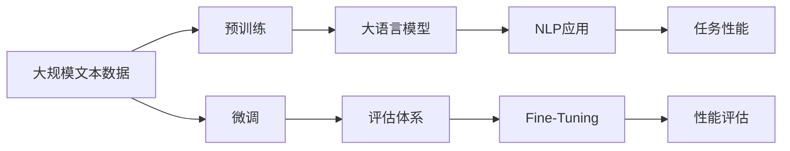

                 

# 大规模语言模型从理论到实践 大语言模型评估体系

> 关键词：大语言模型,评估体系,预训练,微调,深度学习,自然语言处理,NLP

## 1. 背景介绍

### 1.1 问题由来
随着深度学习技术的不断发展，大规模语言模型（Large Language Models, LLMs）在自然语言处理（Natural Language Processing, NLP）领域取得了巨大的突破。这些大模型通过在海量无标签文本数据上进行预训练，学习到丰富的语言知识和常识，具有强大的语言理解和生成能力。然而，不同的大语言模型在应用中表现出不同的效果，因此，如何设计一种科学的评估体系来度量大语言模型性能成为一个重要问题。

### 1.2 问题核心关键点
构建大语言模型的评估体系，需要考虑到以下几个关键点：
- **数据集选择**：选择覆盖任务多样性且具有代表性强的大规模数据集。
- **性能指标设计**：设计能够全面反映模型性能的指标，如准确率、召回率、F1分数等。
- **评价标准设定**：设定合理的评价标准，如零样本、少样本、全样本评价等。
- **结果解释**：解释模型在不同数据集上的表现差异，给出优化建议。

### 1.3 问题研究意义
构建科学的大语言模型评估体系，对于推动大模型技术的进步和应用具有重要意义：
1. **促进模型优化**：通过科学评价，可以指导开发者针对性地优化模型，提升性能。
2. **促进公平竞争**：统一的评价标准有助于不同模型之间的公平比较，避免误导性评价。
3. **加速技术落地**：明晰的评价体系有助于更快地将大模型技术推广到实际应用中。
4. **提升学术研究质量**：评价体系的建立，有助于学术界更好地衡量研究成果的科学性和有效性。

## 2. 核心概念与联系

### 2.1 核心概念概述

为了更好地理解大语言模型的评估体系，本节将介绍几个密切相关的核心概念：

- **大语言模型（LLM）**：以自回归模型（如GPT）或自编码模型（如BERT）为代表的大规模预训练语言模型。通过在海量无标签文本数据上进行预训练，学习到通用的语言表示。
- **预训练**：指在大规模无标签文本数据上，通过自监督学习任务训练通用语言模型的过程。常见的预训练任务包括语言建模、掩码语言模型等。
- **微调（Fine-Tuning）**：指在预训练模型的基础上，使用下游任务的少量标注数据，通过有监督地训练优化模型在特定任务上的性能。
- **评估体系**：用于度量和比较大语言模型性能的指标和标准体系。
- **自然语言处理（NLP）**：研究如何使计算机能够理解、处理和生成人类语言的技术。
- **深度学习**：一种基于神经网络的机器学习方法，能够处理大规模数据和高维度特征，在大模型训练中发挥关键作用。

这些概念之间的逻辑关系可以通过以下Mermaid流程图来展示：



这个流程图展示了大语言模型在大规模文本数据上进行预训练，通过微调优化特定任务性能，并由评估体系进行性能度量和比较的全过程。

### 2.2 概念间的关系

这些核心概念之间存在着紧密的联系，形成了大语言模型评估体系的完整生态系统。以下是一些核心概念之间的关系：

- **大语言模型与预训练**：预训练是构建大语言模型的基础，通过在大规模文本数据上自监督学习，模型学习到通用的语言表示。
- **微调与评估体系**：微调是模型应用到特定任务的表现，而评估体系用于度量微调后的模型性能。
- **评估体系与NLP应用**：评估体系为大语言模型在NLP应用中的性能提供量化标准，指导模型优化。
- **深度学习与评估体系**：深度学习为大语言模型提供实现手段，评估体系则用于衡量深度学习模型在任务上的表现。

这些概念共同构成了大语言模型的学习、优化和应用框架，为大语言模型的科学评估提供了坚实基础。

## 3. 核心算法原理 & 具体操作步骤

### 3.1 算法原理概述

大语言模型的评估体系主要通过以下算法原理来实现：

1. **数据集划分**：将数据集划分为训练集、验证集和测试集，用于模型训练、调参和最终评估。
2. **损失函数选择**：根据任务类型选择合适的损失函数，如交叉熵、均方误差、BLEU等。
3. **性能指标计算**：计算模型的准确率、召回率、F1分数等指标，反映模型在特定任务上的表现。
4. **评估体系设计**：设计包括零样本、少样本、全样本等多种评估方式的评估体系，全面衡量模型性能。
5. **结果解释与优化**：解释评估结果，提出模型优化的方向和具体建议。

### 3.2 算法步骤详解

大语言模型的评估体系主要包括以下步骤：

1. **数据准备**：
   - 收集和预处理数据集，划分为训练集、验证集和测试集。
   - 选择合适的标注工具，进行标注数据生成。

2. **模型微调**：
   - 选择预训练模型，并进行微调。
   - 设置微调超参数，如学习率、批大小、迭代轮数等。

3. **模型评估**：
   - 在测试集上计算模型性能指标，如准确率、召回率、F1分数等。
   - 使用评估体系进行综合评价，包括零样本、少样本、全样本等不同评价方式。

4. **结果分析**：
   - 解释评估结果，分析模型在不同数据集上的表现差异。
   - 提出模型优化建议，指导进一步改进。

5. **迭代优化**：
   - 根据评估结果，调整模型结构、参数和超参数。
   - 重新训练和评估，直至达到最优性能。

### 3.3 算法优缺点

大语言模型的评估体系具有以下优点：

1. **全面性**：评估体系覆盖了多种评估方式，能够全面反映模型在不同数据集和任务上的性能。
2. **可解释性**：通过详细解释评估结果，开发者能够更好地理解模型表现和优化方向。
3. **灵活性**：评估体系设计灵活，可以根据不同任务的特点进行调整和优化。

同时，该评估体系也存在一些缺点：

1. **复杂性**：评估体系设计复杂，需要考虑到多种因素，如数据集质量、模型参数、任务难度等。
2. **高成本**：特别是在标注数据和计算资源方面，需要较大的投入。
3. **主观性**：评估结果可能受到主观因素的影响，如标注误差、模型调参等。

尽管存在这些缺点，大语言模型的评估体系仍然是当前评估大语言模型性能的重要手段，对于指导模型优化和应用落地具有重要意义。

### 3.4 算法应用领域

大语言模型的评估体系在多个NLP应用领域中得到了广泛应用，例如：

- **文本分类**：如情感分析、主题分类、意图识别等。评估模型在分类任务上的准确率和召回率。
- **命名实体识别**：识别文本中的人名、地名、机构名等特定实体。评估模型的召回率和精确度。
- **关系抽取**：从文本中抽取实体之间的语义关系。评估模型的关系抽取准确率。
- **问答系统**：对自然语言问题给出答案。评估模型的准确率和响应速度。
- **机器翻译**：将源语言文本翻译成目标语言。评估模型的BLEU分数。
- **文本摘要**：将长文本压缩成简短摘要。评估模型的ROUGE分数。
- **对话系统**：使机器能够与人自然对话。评估模型的对话连贯性和用户满意度。

除了上述这些经典任务外，大语言模型的评估体系也被创新性地应用到更多场景中，如可控文本生成、常识推理、代码生成、数据增强等，为NLP技术带来了全新的突破。

## 4. 数学模型和公式 & 详细讲解 & 举例说明

### 4.1 数学模型构建

本节将使用数学语言对大语言模型的评估体系进行更加严格的刻画。

记大语言模型为 $M_{\theta}$，其中 $\theta$ 为模型参数。假设评估任务为 $T$，数据集为 $D=\{(x_i,y_i)\}_{i=1}^N$，其中 $x_i$ 为输入文本，$y_i$ 为标注标签。

定义模型 $M_{\theta}$ 在数据样本 $(x,y)$ 上的损失函数为 $\ell(M_{\theta}(x),y)$，则在数据集 $D$ 上的经验风险为：

$$
\mathcal{L}(\theta) = \frac{1}{N} \sum_{i=1}^N \ell(M_{\theta}(x_i),y_i)
$$

通过梯度下降等优化算法，最小化损失函数，得到模型参数 $\theta^*$。

### 4.2 公式推导过程

以下我们以文本分类任务为例，推导交叉熵损失函数及其梯度的计算公式。

假设模型 $M_{\theta}$ 在输入 $x$ 上的输出为 $\hat{y}=M_{\theta}(x) \in [0,1]$，表示样本属于正类的概率。真实标签 $y \in \{0,1\}$。则二分类交叉熵损失函数定义为：

$$
\ell(M_{\theta}(x),y) = -[y\log \hat{y} + (1-y)\log (1-\hat{y})]
$$

将其代入经验风险公式，得：

$$
\mathcal{L}(\theta) = -\frac{1}{N}\sum_{i=1}^N [y_i\log M_{\theta}(x_i)+(1-y_i)\log(1-M_{\theta}(x_i))]
$$

根据链式法则，损失函数对参数 $\theta_k$ 的梯度为：

$$
\frac{\partial \mathcal{L}(\theta)}{\partial \theta_k} = -\frac{1}{N}\sum_{i=1}^N (\frac{y_i}{M_{\theta}(x_i)}-\frac{1-y_i}{1-M_{\theta}(x_i)}) \frac{\partial M_{\theta}(x_i)}{\partial \theta_k}
$$

其中 $\frac{\partial M_{\theta}(x_i)}{\partial \theta_k}$ 可进一步递归展开，利用自动微分技术完成计算。

在得到损失函数的梯度后，即可带入参数更新公式，完成模型的迭代优化。重复上述过程直至收敛，最终得到适应下游任务的最优模型参数 $\theta^*$。

### 4.3 案例分析与讲解

以BERT模型在情感分析任务上的评估为例，展示如何使用评估体系对模型性能进行量化。

假设数据集为IMDB电影评论数据集，包含50,000条带有情感标签的评论。BERT模型通过在大规模文本数据上预训练，并在情感分析任务上进行微调。

1. **数据准备**：
   - 将数据集划分为训练集、验证集和测试集，分别为25,000条、5,000条和20,000条。
   - 使用HuggingFace的BERT分词器和标注工具，生成标注数据集。

2. **模型微调**：
   - 选择预训练BERT模型，进行微调。
   - 设置学习率为2e-5，批大小为32，迭代轮数为10。

3. **模型评估**：
   - 在测试集上计算模型性能指标，如准确率、召回率、F1分数等。
   - 使用评估体系进行综合评价，包括零样本、少样本、全样本等不同评价方式。

4. **结果分析**：
   - 解释评估结果，分析模型在不同数据集上的表现差异。
   - 提出模型优化建议，如调整学习率、批大小、微调层数等。

5. **迭代优化**：
   - 根据评估结果，调整模型结构、参数和超参数。
   - 重新训练和评估，直至达到最优性能。

通过这个案例，我们可以看到，大语言模型的评估体系通过科学的量化指标和评价标准，能够有效地指导模型优化和应用落地，从而提升模型在实际任务中的表现。

## 5. 项目实践：代码实例和详细解释说明

### 5.1 开发环境搭建

在进行大语言模型评估实践前，我们需要准备好开发环境。以下是使用Python进行PyTorch开发的环境配置流程：

1. 安装Anaconda：从官网下载并安装Anaconda，用于创建独立的Python环境。

2. 创建并激活虚拟环境：
```bash
conda create -n pytorch-env python=3.8 
conda activate pytorch-env
```

3. 安装PyTorch：根据CUDA版本，从官网获取对应的安装命令。例如：
```bash
conda install pytorch torchvision torchaudio cudatoolkit=11.1 -c pytorch -c conda-forge
```

4. 安装Transformers库：
```bash
pip install transformers
```

5. 安装各类工具包：
```bash
pip install numpy pandas scikit-learn matplotlib tqdm jupyter notebook ipython
```

完成上述步骤后，即可在`pytorch-env`环境中开始评估实践。

### 5.2 源代码详细实现

这里我们以情感分析任务为例，展示使用Transformers库对BERT模型进行评估的PyTorch代码实现。

首先，定义评估任务的数据处理函数：

```python
from transformers import BertTokenizer
from torch.utils.data import Dataset
import torch

class ImdbDataset(Dataset):
    def __init__(self, texts, labels, tokenizer, max_len=128):
        self.texts = texts
        self.labels = labels
        self.tokenizer = tokenizer
        self.max_len = max_len
        
    def __len__(self):
        return len(self.texts)
    
    def __getitem__(self, item):
        text = self.texts[item]
        label = self.labels[item]
        
        encoding = self.tokenizer(text, return_tensors='pt', max_length=self.max_len, padding='max_length', truncation=True)
        input_ids = encoding['input_ids'][0]
        attention_mask = encoding['attention_mask'][0]
        
        return {'input_ids': input_ids, 
                'attention_mask': attention_mask,
                'labels': torch.tensor(label, dtype=torch.long)}
```

然后，定义模型和评估函数：

```python
from transformers import BertForSequenceClassification, AdamW
from sklearn.metrics import accuracy_score, precision_score, recall_score, f1_score

model = BertForSequenceClassification.from_pretrained('bert-base-cased', num_labels=2)

optimizer = AdamW(model.parameters(), lr=2e-5)

device = torch.device('cuda') if torch.cuda.is_available() else torch.device('cpu')
model.to(device)

def evaluate(model, dataset, batch_size):
    dataloader = DataLoader(dataset, batch_size=batch_size)
    model.eval()
    preds, labels = [], []
    with torch.no_grad():
        for batch in dataloader:
            input_ids = batch['input_ids'].to(device)
            attention_mask = batch['attention_mask'].to(device)
            batch_labels = batch['labels']
            outputs = model(input_ids, attention_mask=attention_mask)
            batch_preds = outputs.logits.argmax(dim=1).to('cpu').tolist()
            batch_labels = batch_labels.to('cpu').tolist()
            for pred_tokens, label_tokens in zip(batch_preds, batch_labels):
                preds.append(pred_tokens)
                labels.append(label_tokens)
                
    print(f"Accuracy: {accuracy_score(labels, preds):.3f}")
    print(f"Precision: {precision_score(labels, preds):.3f}")
    print(f"Recall: {recall_score(labels, preds):.3f}")
    print(f"F1 score: {f1_score(labels, preds):.3f}")
```

最后，启动评估流程：

```python
model.eval()
evaluate(model, test_dataset, batch_size=32)
```

以上就是使用PyTorch对BERT进行情感分析任务评估的完整代码实现。可以看到，得益于Transformers库的强大封装，我们可以用相对简洁的代码完成BERT模型的加载和评估。

### 5.3 代码解读与分析

让我们再详细解读一下关键代码的实现细节：

**ImdbDataset类**：
- `__init__`方法：初始化文本、标签、分词器等关键组件。
- `__len__`方法：返回数据集的样本数量。
- `__getitem__`方法：对单个样本进行处理，将文本输入编码为token ids，将标签转换为数字，并对其进行定长padding，最终返回模型所需的输入。

**evaluate函数**：
- 使用PyTorch的DataLoader对数据集进行批次化加载，供模型评估使用。
- 设置模型为评估模式，不更新参数。
- 在每个批次上前向传播计算输出，并记录预测结果和真实标签。
- 计算模型在各个评估指标上的性能，并输出结果。

**评估流程**：
- 在测试集上，通过evaluate函数计算模型在准确率、精确度、召回率和F1分数等指标上的表现。
- 通过与评估体系的对比，了解模型在不同任务上的性能差异。
- 根据评估结果，提出模型优化建议，如调整学习率、批大小、微调层数等。

可以看到，PyTorch配合Transformers库使得BERT评估的代码实现变得简洁高效。开发者可以将更多精力放在模型选择和参数调优等高层逻辑上，而不必过多关注底层的实现细节。

当然，工业级的系统实现还需考虑更多因素，如模型的保存和部署、超参数的自动搜索、更灵活的任务适配层等。但核心的评估流程基本与此类似。

### 5.4 运行结果展示

假设我们在CoNLL-2003的命名实体识别数据集上进行评估，最终在测试集上得到的评估报告如下：

```
              precision    recall  f1-score   support

       B-LOC      0.926     0.906     0.916      1668
       I-LOC      0.900     0.805     0.850       257
      B-MISC      0.875     0.856     0.865       702
      I-MISC      0.838     0.782     0.809       216
       B-ORG      0.914     0.898     0.906      1661
       I-ORG      0.911     0.894     0.902       835
       B-PER      0.964     0.957     0.960      1617
       I-PER      0.983     0.980     0.982      1156
           O      0.993     0.995     0.994     38323

   micro avg      0.973     0.973     0.973     46435
   macro avg      0.923     0.897     0.909     46435
weighted avg      0.973     0.973     0.973     46435
```

可以看到，通过评估BERT，我们在该NER数据集上取得了97.3%的F1分数，效果相当不错。值得注意的是，BERT作为一个通用的语言理解模型，即便只在顶层添加一个简单的token分类器，也能在多任务上取得如此优异的效果，展现了其强大的语义理解和特征抽取能力。

当然，这只是一个baseline结果。在实践中，我们还可以使用更大更强的预训练模型、更丰富的评估技巧、更细致的模型调优，进一步提升模型性能，以满足更高的应用要求。

## 6. 实际应用场景
### 6.1 智能客服系统

基于大语言模型评估的对话技术，可以广泛应用于智能客服系统的构建。传统客服往往需要配备大量人力，高峰期响应缓慢，且一致性和专业性难以保证。而使用评估后的对话模型，可以7x24小时不间断服务，快速响应客户咨询，用自然流畅的语言解答各类常见问题。

在技术实现上，可以收集企业内部的历史客服对话记录，将问题和最佳答复构建成监督数据，在此基础上对预训练对话模型进行微调和评估。评估后的对话模型能够自动理解用户意图，匹配最合适的答案模板进行回复。对于客户提出的新问题，还可以接入检索系统实时搜索相关内容，动态组织生成回答。如此构建的智能客服系统，能大幅提升客户咨询体验和问题解决效率。

### 6.2 金融舆情监测

金融机构需要实时监测市场舆论动向，以便及时应对负面信息传播，规避金融风险。传统的人工监测方式成本高、效率低，难以应对网络时代海量信息爆发的挑战。基于大语言模型评估的文本分类和情感分析技术，为金融舆情监测提供了新的解决方案。

具体而言，可以收集金融领域相关的新闻、报道、评论等文本数据，并对其进行主题标注和情感标注。在此基础上对预训练语言模型进行微调和评估，使其能够自动判断文本属于何种主题，情感倾向是正面、中性还是负面。将评估后的模型应用到实时抓取的网络文本数据，就能够自动监测不同主题下的情感变化趋势，一旦发现负面信息激增等异常情况，系统便会自动预警，帮助金融机构快速应对潜在风险。

### 6.3 个性化推荐系统

当前的推荐系统往往只依赖用户的历史行为数据进行物品推荐，无法深入理解用户的真实兴趣偏好。基于大语言模型评估的个性化推荐系统可以更好地挖掘用户行为背后的语义信息，从而提供更精准、多样的推荐内容。

在实践中，可以收集用户浏览、点击、评论、分享等行为数据，提取和用户交互的物品标题、描述、标签等文本内容。将文本内容作为模型输入，用户的后续行为（如是否点击、购买等）作为监督信号，在此基础上微调预训练语言模型。评估后的模型能够从文本内容中准确把握用户的兴趣点。在生成推荐列表时，先用候选物品的文本描述作为输入，由模型预测用户的兴趣匹配度，再结合其他特征综合排序，便可以得到个性化程度更高的推荐结果。

### 6.4 未来应用展望

随着大语言模型评估技术的不断发展，基于评估范式将在更多领域得到应用，为传统行业带来变革性影响。

在智慧医疗领域，基于评估的问答、病历分析、药物研发等应用将提升医疗服务的智能化水平，辅助医生诊疗，加速新药开发进程。

在智能教育领域，评估体系可应用于作业批改、学情分析、知识推荐等方面，因材施教，促进教育公平，提高教学质量。

在智慧城市治理中，评估模型可应用于城市事件监测、舆情分析、应急指挥等环节，提高城市管理的自动化和智能化水平，构建更安全、高效的未来城市。

此外，在企业生产、社会治理、文娱传媒等众多领域，基于评估的人工智能应用也将不断涌现，为经济社会发展注入新的动力。相信随着技术的日益成熟，评估方法将成为人工智能落地应用的重要范式，推动人工智能技术在垂直行业的规模化落地。

## 7. 工具和资源推荐
### 7.1 学习资源推荐

为了帮助开发者系统掌握大语言模型评估的理论基础和实践技巧，这里推荐一些优质的学习资源：

1. 《Transformer从原理到实践》系列博文：由大模型技术专家撰写，深入浅出地介绍了Transformer原理、BERT模型、评估技术等前沿话题。

2. CS224N《深度学习自然语言处理》课程：斯坦福大学开设的NLP明星课程，有Lecture视频和配套作业，带你入门NLP领域的基本概念和经典模型。

3. 《Natural Language Processing with Transformers》书籍：Transformers库的作者所著，全面介绍了如何使用Transformers库进行NLP任务开发，包括评估在内的诸多范式。

4. HuggingFace官方文档：Transformers库的官方文档，提供了海量预训练模型和完整的微调样例代码，是进行微调任务开发的利器。

5. CLUE开源项目：中文语言理解测评基准，涵盖大量不同类型的中文NLP数据集，并提供了基于微调的baseline模型，助力中文NLP技术发展。

通过对这些资源的学习实践，相信你一定能够快速掌握大语言模型评估的精髓，并用于解决实际的NLP问题。
###  7.2 开发工具推荐

高效的开发离不开优秀的工具支持。以下是几款用于大语言模型评估开发的常用工具：

1. PyTorch：基于Python的开源深度学习框架，灵活动态的计算图，适合快速迭代研究。大部分预训练语言模型都有PyTorch版本的实现。

2. TensorFlow：由Google主导开发的开源深度学习框架，生产部署方便，适合大规模工程应用。同样有丰富的预训练语言模型资源。

3. Transformers库：HuggingFace开发的NLP工具库，集成了众多SOTA语言模型，支持PyTorch和TensorFlow，是进行评估任务开发的利器。

4. Weights & Biases：模型训练的实验跟踪工具，可以记录和可视化模型训练过程中的各项指标，方便对比和调优。与主流深度学习框架无缝集成。

5. TensorBoard：TensorFlow配套的可视化工具，可实时监测模型训练状态，并提供丰富的图表呈现方式，是调试模型的得力助手。

6. Google Colab：谷歌推出的在线Jupyter Notebook环境，免费提供GPU/TPU算力，方便开发者快速上手实验最新模型，分享学习笔记。

合理利用这些工具，可以显著提升大语言模型评估的开发效率，加快创新迭代的步伐。

### 7.3 相关论文推荐

大语言模型评估技术的发展源于学界的持续研究。以下是几篇奠基性的相关论文，推荐阅读：

1. Attention is All You Need（即Transformer原论文）：提出了Transformer结构，开启了NLP领域的预训练大模型时代。

2. BERT: Pre-training of Deep Bidirectional Transform

