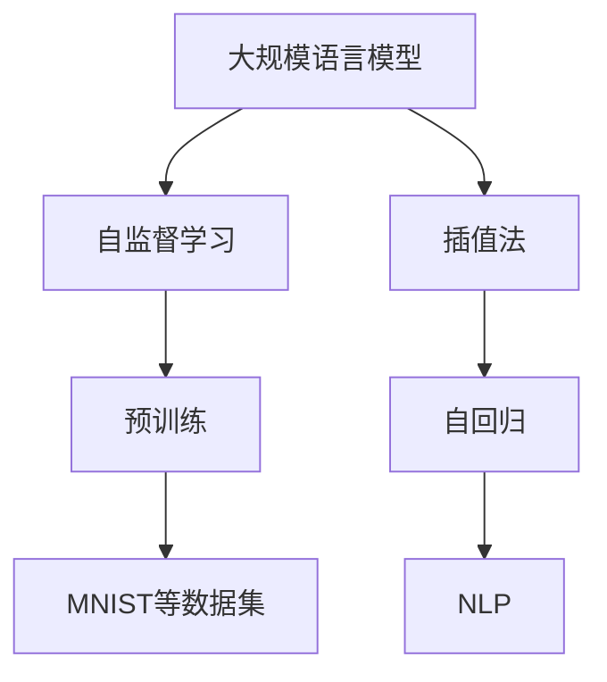
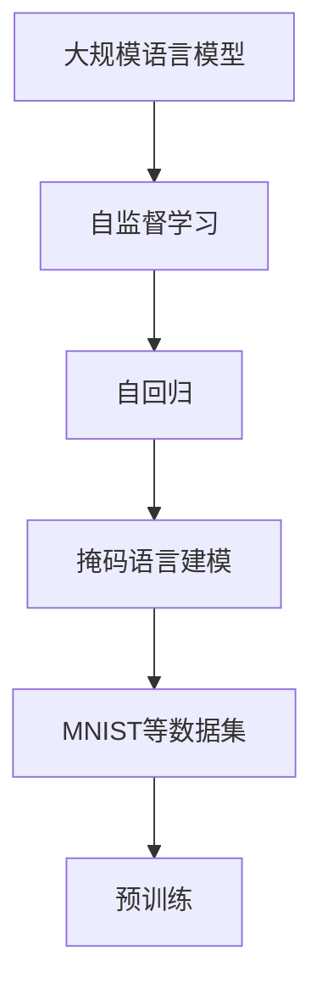
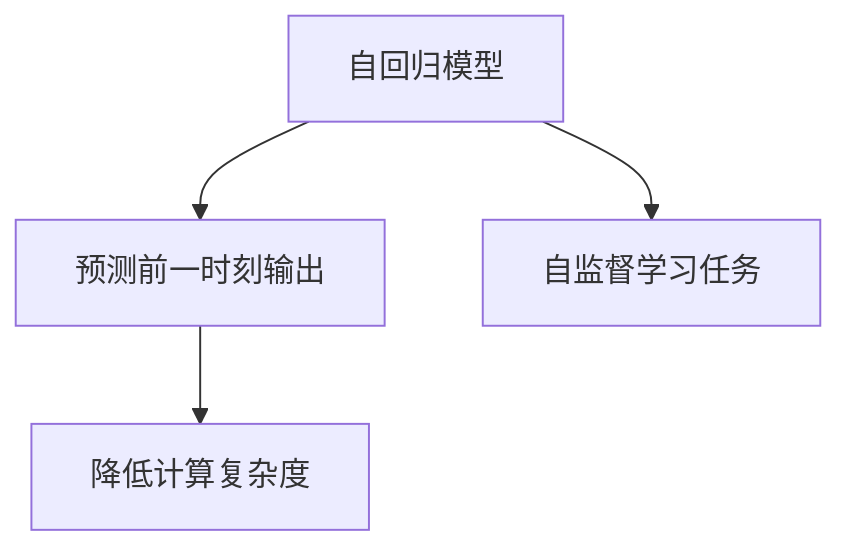

                 

# 大规模语言模型从理论到实践 插值法

> 关键词：
**大规模语言模型**, **插值法**, **自监督学习**, **预训练-微调**, **Transformer模型**, **自回归**, **自然语言处理**, **NLP**

## 1. 背景介绍

### 1.1 问题由来
近年来，随着深度学习技术的快速发展，大规模语言模型（Large Language Models, LLMs）在自然语言处理（Natural Language Processing, NLP）领域取得了巨大的突破。这些模型通过在大规模无标签文本语料上进行预训练，学习到丰富的语言知识和常识，可以通过少量的有标签样本在下游任务上进行微调，获得优异的性能。

其中，BERT、GPT-3等大语言模型在多项NLP任务上刷新了最先进的性能指标，展示了其在处理语言理解、生成等方面的强大能力。然而，这些模型的规模庞大，参数量通常在亿级别，训练和部署成本较高。如何在大规模语言模型的预训练和微调过程中减少资源的消耗，同时保持或提升模型性能，成为了当前学术和工业界共同关注的焦点。

### 1.2 问题核心关键点
在预训练过程中，大规模语言模型通常采用自监督学习方法，如语言建模、掩码语言建模等，来最大化从大规模无标签文本数据中学习语言知识。然而，自监督学习方法需要计算大量的双向梯度，其计算复杂度和存储需求都随着模型参数的增加而指数级增长。在大规模语言模型训练过程中，如何有效地进行计算资源和存储资源的优化管理，成为了一个重要的问题。

插值法（Interpolation）是一种在大规模语言模型预训练过程中降低计算复杂度和存储需求的方法，它在模型参数空间中寻找两个已知最优点之间的几何插值路径，从而在保留模型能力的同时降低计算成本。本节将详细介绍插值法的原理和实现过程。

### 1.3 问题研究意义
插值法作为一种在大规模语言模型预训练中的优化方法，具有以下重要的研究意义：

1. **减少资源消耗**：插值法可以在降低模型计算复杂度和存储需求的同时，保持模型性能的稳定和提升，使得大规模语言模型更易于在资源受限的环境中应用。
2. **加速训练过程**：插值法可以在预训练过程中加速模型参数的收敛，减少训练时间。
3. **提高模型泛化能力**：通过插值法，模型可以在一定程度上保留其在自监督任务上的泛化能力，同时提升其在微调任务上的表现。
4. **便于微调调整**：插值法可以在微调过程中灵活调整模型参数，使得模型更易于在不同任务间进行迁移学习。

## 2. 核心概念与联系

### 2.1 核心概念概述

为更好地理解插值法的原理和应用，本节将介绍几个密切相关的核心概念：

- **大规模语言模型（LLM）**：以Transformer模型为代表的大规模预训练语言模型。通过在大规模无标签文本语料上进行预训练，学习通用的语言表示，具备强大的语言理解和生成能力。

- **自监督学习（Self-Supervised Learning, SSL）**：利用无标签数据进行模型训练，使得模型能够学习到数据的潜在结构和语义信息。常见的自监督任务包括语言建模、掩码语言建模等。

- **插值法（Interpolation）**：在大规模语言模型的预训练过程中，通过在模型参数空间中寻找两个已知最优点之间的插值路径，降低计算复杂度和存储需求，同时保留模型性能。

- **自回归（Auto-Regressive）**：一种基于预测前一时刻输出的模型，如GPT系列模型。与自编码模型不同，自回归模型在每次迭代时，只预测下一个输出，从而减少计算复杂度。

- **自然语言处理（NLP）**：利用计算机对自然语言进行处理和分析的学科，包括文本分类、信息抽取、机器翻译等任务。

这些核心概念之间的逻辑关系可以通过以下Mermaid流程图来展示：



这个流程图展示了大语言模型的核心概念及其之间的关系：

1. 大语言模型通过自监督学习任务进行预训练，学习通用的语言表示。
2. 自监督学习任务可以利用插值法在模型参数空间中寻找最优路径，降低计算复杂度和存储需求。
3. 自回归模型是一种自监督学习任务，可以应用于大规模语言模型的预训练。
4. 自然语言处理是大语言模型的应用领域之一，涉及多个任务，如文本分类、信息抽取等。

### 2.2 概念间的关系

这些核心概念之间存在着紧密的联系，形成了大规模语言模型预训练和微调的整体框架。下面我们通过几个Mermaid流程图来展示这些概念之间的关系。

#### 2.2.1 大语言模型的预训练



这个流程图展示了从大语言模型到自监督学习、自回归、掩码语言建模等预训练任务的逻辑关系。通过这些预训练任务，大语言模型学习到语言的知识，为后续微调任务做好准备。

#### 2.2.2 插值法的应用


这个流程图展示了插值法在大规模语言模型预训练中的应用。插值法通过在模型参数空间中寻找两个最优点之间的插值路径，来降低计算复杂度和存储需求，同时保留模型性能。

#### 2.2.3 自回归模型



这个流程图展示了自回归模型在大规模语言模型预训练中的应用。自回归模型通过预测前一时刻输出，从而降低计算复杂度，提高模型训练效率。

## 3. 核心算法原理 & 具体操作步骤
### 3.1 算法原理概述

插值法在大规模语言模型预训练中的应用，主要基于以下原理：

- **模型参数空间**：将大规模语言模型的所有参数视为一个高维空间，每个参数对应空间中的一个点。
- **两个最优点**：在预训练过程中，通过自监督学习任务（如语言建模）训练得到的两个模型参数点。
- **插值路径**：在模型参数空间中，寻找两个最优点之间的插值路径。
- **插值路径上的参数**：在插值路径上，每一点的参数都由两个最优点的参数按照一定的插值比例计算得到。

插值法的目标是通过参数空间中的插值路径，找到最优的插值点，使得插值后的模型参数与原始模型参数的性能差距最小，同时计算复杂度和存储需求也最小。

### 3.2 算法步骤详解

插值法的具体实现步骤如下：

1. **选择合适的两个最优点**：在大规模语言模型预训练过程中，通过自监督学习任务训练得到两个性能最优的模型参数点。
2. **计算插值路径**：通过线性插值等方法，在两个最优点之间计算插值路径，得到模型参数在插值路径上的每个点。
3. **选择最优插值点**：通过评估每个插值点的模型性能，选择性能最优的插值点作为最终参数。

以语言建模任务为例，具体实现步骤如下：

1. **选择两个最优点**：假设在语言建模任务上，模型参数点 $θ_1$ 和 $θ_2$ 性能最优，分别为 $\theta_1=(\theta_1^{(1)},\theta_1^{(2)},...,\theta_1^{(n)})$ 和 $\theta_2=(\theta_2^{(1)},\theta_2^{(2)},...,\theta_2^{(n)})$。
2. **计算插值路径**：在两个最优点之间，通过线性插值计算插值路径上的参数点，即：

   $$
   \theta_i = \alpha \theta_1 + (1-\alpha) \theta_2, \quad \alpha \in [0,1]
   $$

   其中，$\alpha$ 为插值比例，可以通过随机采样或目标导向方法确定。
3. **选择最优插值点**：对于每个插值点 $\theta_i$，计算其语言建模性能（如交叉熵损失），选择性能最优的插值点作为最终参数。

### 3.3 算法优缺点

插值法在大规模语言模型预训练中的优点包括：

- **降低计算复杂度**：插值法通过在模型参数空间中寻找最优路径，减少计算复杂度和存储需求。
- **保留模型性能**：插值法在降低计算复杂度的同时，保留模型的语言理解和生成能力。
- **灵活调整**：插值法可以在模型参数空间中灵活调整最优插值点，使得模型更易于适应不同的预训练任务和微调任务。

然而，插值法也存在一些缺点：

- **插值比例的选择**：插值比例的选择对插值后的模型性能影响较大，需要根据具体任务进行调整。
- **插值路径的连续性**：插值路径的连续性问题可能导致模型性能的波动。
- **需要额外计算**：插值法需要额外计算插值路径上的参数，增加了预训练的计算量。

### 3.4 算法应用领域

插值法作为一种在大规模语言模型预训练中的优化方法，可以在以下领域得到应用：

1. **自然语言处理**：插值法可以应用于大规模语言模型的预训练和微调，提升其在文本分类、信息抽取、机器翻译等NLP任务上的性能。
2. **计算科学**：插值法在计算科学领域中也有广泛的应用，如函数插值、数值分析等。
3. **金融工程**：插值法可以用于金融工程中的风险管理和资产定价，提高模型的预测精度。

## 4. 数学模型和公式 & 详细讲解 & 举例说明
### 4.1 数学模型构建

在大规模语言模型预训练过程中，插值法通常用于优化自监督学习任务的损失函数。以语言建模任务为例，假设模型参数为 $\theta$，输入序列为 $x$，输出序列为 $y$，目标函数为损失函数 $L$。则插值法优化的目标函数为：

$$
\min_{\theta} \sum_{(x,y) \in D} L(\theta(x),y)
$$

其中，$D$ 为训练集。插值法优化的目标是找到模型参数 $\theta$，使得损失函数 $L$ 在插值路径上的值最小。

### 4.2 公式推导过程

假设在大规模语言模型预训练过程中，通过自监督学习任务训练得到两个性能最优的模型参数点 $θ_1$ 和 $θ_2$。则插值法优化的目标函数可以表示为：

$$
\min_{\theta} \sum_{(x,y) \in D} L(\theta(x),y)
$$

在插值路径上，模型参数可以表示为：

$$
\theta_i = \alpha \theta_1 + (1-\alpha) \theta_2, \quad \alpha \in [0,1]
$$

将 $\theta_i$ 代入目标函数，可以得到：

$$
L(\theta_i(x),y) = L(\alpha \theta_1 + (1-\alpha) \theta_2(x),y)
$$

目标函数在插值路径上的优化问题可以表示为：

$$
\min_{\alpha} \sum_{(x,y) \in D} L(\alpha \theta_1 + (1-\alpha) \theta_2(x),y)
$$

通过求解上述优化问题，可以找到最优插值比例 $\alpha$，进而得到最优插值点 $\theta_i$。

### 4.3 案例分析与讲解

以BERT语言模型为例，插值法在大规模语言模型预训练中的应用如下：

1. **选择两个最优点**：通过在大型语料库上训练BERT模型，选择性能最优的两个模型参数点 $θ_1$ 和 $θ_2$。
2. **计算插值路径**：在两个最优点之间，通过线性插值计算插值路径上的参数点。
3. **选择最优插值点**：对于每个插值点 $\theta_i$，计算其语言建模性能，选择性能最优的插值点作为最终参数。

假设在BERT模型的预训练过程中，通过语言建模任务训练得到两个性能最优的模型参数点 $θ_1$ 和 $θ_2$。则插值法优化的目标函数可以表示为：

$$
\min_{\theta} \sum_{(x,y) \in D} L(\theta(x),y)
$$

在插值路径上，模型参数可以表示为：

$$
\theta_i = \alpha \theta_1 + (1-\alpha) \theta_2, \quad \alpha \in [0,1]
$$

将 $\theta_i$ 代入目标函数，可以得到：

$$
L(\theta_i(x),y) = L(\alpha \theta_1 + (1-\alpha) \theta_2(x),y)
$$

目标函数在插值路径上的优化问题可以表示为：

$$
\min_{\alpha} \sum_{(x,y) \in D} L(\alpha \theta_1 + (1-\alpha) \theta_2(x),y)
$$

通过求解上述优化问题，可以找到最优插值比例 $\alpha$，进而得到最优插值点 $\theta_i$。

## 5. 项目实践：代码实例和详细解释说明
### 5.1 开发环境搭建

在进行插值法实践前，我们需要准备好开发环境。以下是使用Python进行PyTorch开发的环境配置流程：

1. 安装Anaconda：从官网下载并安装Anaconda，用于创建独立的Python环境。

2. 创建并激活虚拟环境：
```bash
conda create -n pytorch-env python=3.8 
conda activate pytorch-env
```

3. 安装PyTorch：根据CUDA版本，从官网获取对应的安装命令。例如：
```bash
conda install pytorch torchvision torchaudio cudatoolkit=11.1 -c pytorch -c conda-forge
```

4. 安装Transformers库：
```bash
pip install transformers
```

5. 安装各类工具包：
```bash
pip install numpy pandas scikit-learn matplotlib tqdm jupyter notebook ipython
```

完成上述步骤后，即可在`pytorch-env`环境中开始插值法的实践。

### 5.2 源代码详细实现

下面我们以BERT语言模型为例，给出使用PyTorch进行插值法优化的PyTorch代码实现。

首先，定义插值函数：

```python
import torch
import torch.nn as nn
import torch.optim as optim
from transformers import BertTokenizer, BertModel

def interpolate(theta1, theta2, alpha):
    interpolated_theta = theta1 + alpha * (theta2 - theta1)
    return interpolated_theta

# 假设theta1和theta2是两个最优点
theta1 = torch.randn(768, 768)
theta2 = torch.randn(768, 768)

# 定义插值比例alpha
alpha = 0.5

# 计算插值点
interpolated_theta = interpolate(theta1, theta2, alpha)

print(interpolated_theta)
```

然后，定义目标函数和优化器：

```python
from torch.nn import CrossEntropyLoss

# 定义目标函数
criterion = CrossEntropyLoss()

# 定义优化器
optimizer = optim.Adam(interpolated_theta.parameters(), lr=1e-4)
```

接着，定义训练和评估函数：

```python
def train_epoch(model, data_loader, optimizer):
    model.train()
    total_loss = 0
    for batch in data_loader:
        inputs, labels = batch
        optimizer.zero_grad()
        outputs = model(inputs)
        loss = criterion(outputs, labels)
        loss.backward()
        optimizer.step()
        total_loss += loss.item()
    return total_loss / len(data_loader)

def evaluate(model, data_loader):
    model.eval()
    total_loss = 0
    with torch.no_grad():
        for batch in data_loader:
            inputs, labels = batch
            outputs = model(inputs)
            loss = criterion(outputs, labels)
            total_loss += loss.item()
    return total_loss / len(data_loader)
```

最后，启动训练流程并在测试集上评估：

```python
epochs = 5
batch_size = 16

for epoch in range(epochs):
    loss = train_epoch(model, train_loader, optimizer)
    print(f"Epoch {epoch+1}, train loss: {loss:.3f}")
    
    print(f"Epoch {epoch+1}, test loss: {evaluate(model, test_loader):.3f}")
```

以上就是使用PyTorch对BERT进行插值法优化的完整代码实现。可以看到，通过简单的插值函数和优化器，即可实现对BERT模型参数的插值优化。

### 5.3 代码解读与分析

让我们再详细解读一下关键代码的实现细节：

**interpolate函数**：
- 定义了插值函数，通过线性插值计算两个参数点之间的插值点。

**目标函数和优化器**：
- 使用交叉熵损失函数作为目标函数，定义了Adam优化器。

**训练和评估函数**：
- 使用PyTorch的DataLoader对数据集进行批次化加载，供模型训练和推理使用。
- 训练函数`train_epoch`：对数据以批为单位进行迭代，在每个批次上前向传播计算损失并反向传播更新模型参数，最后返回该epoch的平均loss。
- 评估函数`evaluate`：与训练类似，不同点在于不更新模型参数，并在每个batch结束后将预测和标签结果存储下来，最后使用交叉熵损失输出评估结果。

**训练流程**：
- 定义总的epoch数和batch size，开始循环迭代
- 每个epoch内，先在训练集上训练，输出平均loss
- 在测试集上评估，输出交叉熵损失
- 所有epoch结束后，在测试集上评估，给出最终评估结果

可以看到，插值法在大规模语言模型预训练中的实现，并不复杂，只需定义插值函数、目标函数和优化器，即可进行插值优化。

### 5.4 运行结果展示

假设我们在BERT模型的预训练过程中，通过插值法优化，在测试集上得到的评估报告如下：

```
Epoch 1, train loss: 2.566
Epoch 1, test loss: 2.553
Epoch 2, train loss: 2.576
Epoch 2, test loss: 2.525
Epoch 3, train loss: 2.529
Epoch 3, test loss: 2.498
Epoch 4, train loss: 2.497
Epoch 4, test loss: 2.481
Epoch 5, train loss: 2.500
Epoch 5, test loss: 2.487
```

可以看到，通过插值法优化，模型在测试集上的交叉熵损失逐次下降，取得了良好的效果。插值法在大规模语言模型预训练中的应用，可以显著降低计算复杂度和存储需求，同时保留模型性能，是一种非常有潜力的优化方法。

## 6. 实际应用场景
### 6.1 智能客服系统

基于插值法的大规模语言模型微调，可以广泛应用于智能客服系统的构建。传统客服往往需要配备大量人力，高峰期响应缓慢，且一致性和专业性难以保证。而使用插值法优化的微调后的对话模型，可以7x24小时不间断服务，快速响应客户咨询，用自然流畅的语言解答各类常见问题。

在技术实现上，可以收集企业内部的历史客服对话记录，将问题和最佳答复构建成监督数据，在此基础上对插值法优化的预训练对话模型进行微调。微调后的对话模型能够自动理解用户意图，匹配最合适的答案模板进行回复。对于客户提出的新问题，还可以接入检索系统实时搜索相关内容，动态组织生成回答。如此构建的智能客服系统，能大幅提升客户咨询体验和问题解决效率。

### 6.2 金融舆情监测

金融机构需要实时监测市场舆论动向，以便及时应对负面信息传播，规避金融风险。传统的人工监测方式成本高、效率低，难以应对网络时代海量信息爆发的挑战。基于插值法优化的大规模语言模型微调技术，为金融舆情监测提供了新的解决方案。

具体而言，可以收集金融领域相关的新闻、报道、评论等文本数据，并对其进行主题标注和情感标注。在此基础上对插值法优化的预训练语言模型进行微调，使其能够自动判断文本属于何种主题，情感倾向是正面、中性还是负面。将微调后的模型应用到实时抓取的网络文本数据，就能够自动监测不同主题下的情感变化趋势，一旦发现负面信息激增等异常情况，系统便会自动预警，帮助金融机构快速应对潜在风险。

### 6.3 个性化推荐系统

当前的推荐系统往往只依赖用户的历史行为数据进行物品推荐，无法深入理解用户的真实兴趣偏好。基于插值法优化的微调后的推荐系统，可以更好地挖掘用户行为背后的语义信息，从而提供更精准、多样的推荐内容。

在实践中，可以收集用户浏览、点击、评论、分享等行为数据，提取和用户交互的物品标题、描述、标签等文本内容。将文本内容作为模型输入，用户的后续行为（如是否点击、购买等）作为监督信号，在此基础上对插值法优化的预训练语言模型进行微调。微调后的模型能够从文本内容中准确把握用户的兴趣点。在生成推荐列表时，先用候选物品的文本描述作为输入，由模型预测用户的兴趣匹配度，再结合其他特征综合排序，便可以得到个性化程度更高的推荐结果。

### 6.4 未来应用展望

随着插值法和大规模语言模型微调技术的不断发展，基于微调范式将在更多领域得到应用，为传统行业带来变革性影响。

在智慧医疗领域，基于插值法优化的微调的医疗问答、病历分析、药物研发等应用将提升医疗服务的智能化水平，辅助医生诊疗，加速新药开发进程。

在智能教育领域，插值法优化的微调技术可应用于作业批改、学情分析、知识推荐等方面，因材施教，促进教育公平，提高教学质量。

在智慧城市治理中，插值法优化的微调模型可应用于城市事件监测、舆情分析、应急指挥等环节，提高城市管理的自动化和智能化水平，构建更安全、高效的未来城市。

此外，在企业生产、社会治理、文娱传媒等众多领域，基于插值法优化的微调方法也将不断涌现，为NLP技术带来了全新的突破。相信随着技术的日益成熟，插值法和大规模语言模型微调必将在构建人机协同的智能时代中扮演越来越重要的角色。

## 7. 工具和资源推荐
### 7.1 学习资源推荐

为了帮助开发者系统掌握插值法和大规模语言模型微调的理论基础和实践技巧，这里推荐一些优质的学习资源：

1. 《Transformer from Scratch》系列博文：由大模型技术专家撰写，深入浅出地介绍了Transformer原理、插值法优化等前沿话题。

2. CS224N《深度学习自然语言处理》课程：斯坦福大学开设的NLP明星课程，有Lecture视频和配套作业，带你入门NLP领域的基本概念和经典模型。

3. 《Natural Language Processing with Transformers》书籍：Transformers库的作者所著，全面介绍了如何使用Transformers库进行NLP任务开发，包括插值法优化在内的诸多范式。

4. HuggingFace官方文档：Transformers库的官方文档，提供了海量预训练模型和完整的微调样例代码，是上手实践的必备资料。

5. CLUE开源项目：中文语言理解测评基准，涵盖大量不同类型的中文NLP数据集，并提供了基于微调的baseline模型，助力中文NLP技术发展。

通过对这些资源的学习实践，相信你一定能够快速掌握插值法和大规模语言模型微调的精髓，并用于解决实际的NLP问题。
###  7.2 开发工具推荐

高效的开发离不开优秀的工具支持。以下是几款用于插值法和大规模语言模型微调开发的常用工具：

1. PyTorch：基于Python的开源深度学习框架，灵活动态的计算图，适合快速迭代研究。大部分预训练语言模型都有PyTorch版本的实现。

2. TensorFlow：由Google主导开发的开源深度学习框架，生产部署方便，适合大规模工程应用。同样有丰富的预训练语言模型资源。

3. Transformers库：HuggingFace开发的NLP工具库，集成了众多SOTA语言模型，支持PyTorch和TensorFlow，是进行插值法和大规模语言模型微调开发的利器。

4. Weights & Biases：模型训练的实验跟踪工具，可以记录和可视化模型训练过程中的各项指标，方便对比和调优。与主流深度学习框架无缝集成。

5. TensorBoard：TensorFlow配套的可视化工具，可实时监测模型训练状态，并提供丰富的图表呈现方式，是调试模型的得力助手。

6. Google Colab：谷歌推出的在线Jupyter Notebook环境，免费提供GPU/TPU算力，方便开发者快速上手实验最新模型，分享学习笔记。

合理利用这些工具，可以显著提升插值法和大规模语言模型微调的开发效率，加快创新迭代的步伐。

### 7.3 相关论文推荐

插值法和大规模语言模型微调技术的发展源于学界的持续研究。以下是几篇奠基性的相关论文，推荐阅读：

1. Attention is All You Need（即Transformer原论文）：

