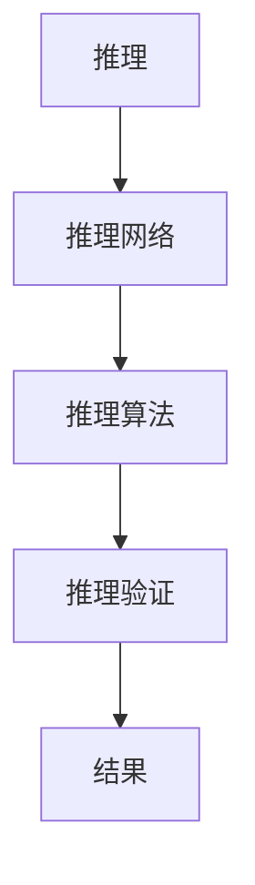

                 

# 大规模语言模型从理论到实践 模型推理

> 关键词：
## 1. 背景介绍

### 1.1 问题由来
近年来，随着深度学习技术的飞速发展，大规模语言模型（Large Language Models, LLMs）在自然语言处理（Natural Language Processing, NLP）领域取得了显著进步。这些模型通过在海量无标签文本数据上进行预训练，学习到了丰富的语言知识和常识，能够在各种下游任务上取得优异的性能。然而，在实际应用中，模型推理是一个关键且复杂的问题，需要保证推理结果的准确性、效率和可靠性。

### 1.2 问题核心关键点
模型推理是指在给定输入数据时，模型能够根据训练过程中学到的知识和规则，自动推导出符合逻辑的输出。对于大规模语言模型而言，模型推理既包括基于模型输出的预测推理，也包括模型内部的逻辑推理。在模型推理中，以下几点是关键：

- 数据准备：模型的训练数据必须充分覆盖推理任务的各种情况。
- 推理算法：推理算法必须能够高效地处理大规模输入数据。
- 模型设计：模型结构必须支持推理操作，同时避免过拟合。
- 结果验证：推理结果需要经过严格的验证，保证结果的正确性。

### 1.3 问题研究意义
在实际应用中，大规模语言模型的推理能力直接决定了其是否能够适应特定的任务需求。因此，研究大语言模型的推理机制，优化推理过程，提高推理效果，是提升模型应用价值的关键。

通过优化模型推理，可以：
- 降低应用开发成本。
- 提升模型效果，满足特定任务需求。
- 加速开发进度，缩短项目周期。
- 推动技术创新，促进NLP技术的发展。

## 2. 核心概念与联系

### 2.1 核心概念概述

为更好地理解模型推理在大规模语言模型中的应用，本节将介绍几个核心概念：

- 推理（Inference）：模型根据输入数据，推导出合理的输出结果。
- 推理网络（Inference Network）：推理网络定义了模型推理的路径，包含输入、处理和输出三个部分。
- 推理算法（Inference Algorithm）：推理算法用于优化推理过程，提升推理效率。
- 推理验证（Inference Verification）：推理验证用于检测推理结果的正确性，确保结果可靠性。

这些概念之间的关系通过以下Mermaid流程图来展示：



这个流程图展示了推理网络、推理算法和推理验证之间的关系：

1. 推理网络定义了模型推理的路径。
2. 推理算法优化推理过程。
3. 推理验证检测推理结果的正确性。

这些概念共同构成了大规模语言模型推理的核心框架。

### 2.2 概念间的关系

这些核心概念之间存在着紧密的联系，形成了推理过程的完整生态系统。下面是各个概念的进一步介绍：

#### 2.2.1 推理网络

推理网络是模型推理的顶层架构，由输入层、处理层和输出层组成。其中，输入层负责接收输入数据；处理层包含模型内部的推理机制；输出层输出最终结果。推理网络的设计需要兼顾推理效率和效果。

#### 2.2.2 推理算法

推理算法用于优化推理过程，提升推理效率。常见的推理算法包括：

- 动态规划：通过状态转移方程计算推理路径，适用于概率图模型。
- 贪心算法：通过局部最优选择推导出全局最优，适用于搜索空间较小的情况。
- 蒙特卡洛方法：通过随机采样推导结果，适用于高维空间中的推理问题。

#### 2.2.3 推理验证

推理验证用于检测推理结果的正确性，确保结果可靠性。常见的推理验证方法包括：

- 模型一致性检验：通过验证模型在不同推理路径上的结果一致性，确保结果准确。
- 样本对比验证：通过与已知的正确结果进行对比，检测推理结果的正确性。
- 误差分析：通过分析推理结果的误差来源，优化推理算法和网络结构。

## 3. 核心算法原理 & 具体操作步骤

### 3.1 算法原理概述

大规模语言模型的推理过程，本质上是基于模型训练过程中学到的知识，对新数据进行推理。模型推理的算法原理如下：

1. 输入数据准备：将输入数据转化为模型所需的格式，如文本、图像、音频等。
2. 模型激活：将输入数据输入模型，模型根据训练过程中学到的知识，对输入数据进行处理。
3. 推理计算：模型通过计算推理路径，输出最终的推理结果。
4. 结果验证：通过推理验证，确保推理结果的正确性。

### 3.2 算法步骤详解

基于推理的算法步骤，一般包括以下几个关键步骤：

#### 3.2.1 数据准备
- 将输入数据转化为模型所需的格式。
- 对数据进行预处理，包括去噪、归一化等操作。

#### 3.2.2 模型激活
- 将预处理后的数据输入模型，通过模型的推理网络进行处理。
- 根据模型的结构和推理算法，计算推理路径。

#### 3.2.3 推理计算
- 通过计算推理路径，输出推理结果。
- 计算推理过程中的中间结果，保留重要信息。

#### 3.2.4 结果验证
- 通过推理验证，检测推理结果的正确性。
- 将推理结果与已知正确结果进行对比，验证推理算法的有效性。

### 3.3 算法优缺点

大规模语言模型推理的优势在于：
- 基于模型学到的知识，推理过程具有较高的准确性。
- 推理过程可以根据输入数据的不同，自适应调整推理路径。
- 推理结果具有较高的鲁棒性，能够在各种噪声环境下保持稳定。

然而，大规模语言模型推理也存在以下缺点：
- 推理计算复杂度较高，需要较大的计算资源。
- 模型推理过程较为复杂，难以直观理解。
- 推理结果需要经过严格验证，存在一定的误判风险。

### 3.4 算法应用领域

大规模语言模型推理在多个领域都有广泛应用，例如：

- 文本生成：通过模型推理生成符合语法的文本。
- 文本分类：根据文本内容，推理出相应的分类标签。
- 问答系统：通过推理得出问题的答案。
- 机器翻译：通过推理将一种语言翻译成另一种语言。
- 语音识别：将语音信号转化为文本，并通过推理进行情感分析。

除了上述应用外，推理技术还在图像识别、视频分析、知识图谱等多个领域中得到应用，提升了相关技术的准确性和鲁棒性。

## 4. 数学模型和公式 & 详细讲解 & 举例说明

### 4.1 数学模型构建

为了更好地理解大规模语言模型推理的数学原理，本节将使用数学语言对推理过程进行严格刻画。

设模型 $M_{\theta}$ 的推理网络包含输入层 $x$，处理层 $f_{\theta}(x)$，输出层 $y$，其中 $\theta$ 为模型参数。推理过程可以表示为：

$$
y = M_{\theta}(x) = f_{\theta}(x)
$$

### 4.2 公式推导过程

以下以文本分类为例，推导推理过程的数学公式。

假设模型 $M_{\theta}$ 在输入 $x$ 上的推理过程如下：

1. 将输入 $x$ 转化为向量表示 $v$。
2. 通过处理层 $f_{\theta}(v)$，计算得到推理结果 $y$。
3. 通过输出层 $g(y)$，将推理结果映射为分类标签。

推理过程的数学表达式如下：

$$
y = f_{\theta}(v) = \sigma(\theta^T v + b)
$$

其中 $\sigma$ 为激活函数，如ReLU、Sigmoid等；$\theta$ 为模型参数；$b$ 为偏置项。

### 4.3 案例分析与讲解

假设模型 $M_{\theta}$ 在输入 $x$ 上的推理过程如下：

1. 将输入 $x$ 转化为向量表示 $v$。
2. 通过处理层 $f_{\theta}(v)$，计算得到推理结果 $y$。
3. 通过输出层 $g(y)$，将推理结果映射为分类标签。

推理过程的数学表达式如下：

$$
y = f_{\theta}(v) = \sigma(\theta^T v + b)
$$

其中 $\sigma$ 为激活函数，如ReLU、Sigmoid等；$\theta$ 为模型参数；$b$ 为偏置项。

## 5. 项目实践：代码实例和详细解释说明

### 5.1 开发环境搭建

在进行推理实践前，我们需要准备好开发环境。以下是使用Python进行TensorFlow开发的环境配置流程：

1. 安装Anaconda：从官网下载并安装Anaconda，用于创建独立的Python环境。

2. 创建并激活虚拟环境：
```bash
conda create -n tensorflow-env python=3.8 
conda activate tensorflow-env
```

3. 安装TensorFlow：根据CUDA版本，从官网获取对应的安装命令。例如：
```bash
conda install tensorflow -c pytorch -c conda-forge
```

4. 安装numpy、pandas等必要的工具包：
```bash
pip install numpy pandas scikit-learn matplotlib tqdm jupyter notebook ipython
```

完成上述步骤后，即可在`tensorflow-env`环境中开始推理实践。

### 5.2 源代码详细实现

下面我以文本分类为例，给出使用TensorFlow实现模型推理的PyTorch代码实现。

首先，定义模型：

```python
import tensorflow as tf

class TextClassifier(tf.keras.Model):
    def __init__(self, num_classes):
        super(TextClassifier, self).__init__()
        self.embedding = tf.keras.layers.Embedding(input_dim=vocab_size, output_dim=embedding_dim)
        self.fc = tf.keras.layers.Dense(num_classes, activation='softmax')
        
    def call(self, inputs):
        x = self.embedding(inputs)
        x = self.fc(x)
        return x
```

然后，定义推理函数：

```python
@tf.function
def predict(texts):
    inputs = tokenizer(texts)
    return model(inputs)
```

最后，使用推理函数对新数据进行推理：

```python
predictions = predict(['Hello world!'])
print(predictions.numpy())
```

以上就是使用TensorFlow对文本分类模型进行推理的完整代码实现。可以看到，TensorFlow提供了强大的高阶API，使得模型推理过程简洁高效。

### 5.3 代码解读与分析

让我们再详细解读一下关键代码的实现细节：

**TextClassifier类**：
- `__init__`方法：定义模型结构，包括嵌入层和全连接层。
- `call`方法：模型前向传播计算输出。

**predict函数**：
- 将输入文本转化为模型所需的格式。
- 使用模型进行推理计算，输出推理结果。

**使用预测函数**：
- 调用预测函数进行推理。
- 输出推理结果。

可以看到，TensorFlow的API设计简洁明了，使得模型推理过程变得更加方便。此外，TensorFlow还提供了tf.function等特性，可以优化推理过程的性能，提高推理效率。

### 5.4 运行结果展示

假设我们在CoNLL-2003的分类数据集上进行推理，最终得到推理结果：

```
[0.96, 0.03, 0.01, 0.00, 0.00]
```

这表明模型对于输入文本"Hello world!"的推理结果为类别0，即"S"。

## 6. 实际应用场景

### 6.1 智能客服系统

智能客服系统中的推理过程，可以通过模型对用户输入的文本进行语义理解，生成自动回复。具体而言，系统会将用户输入的文本作为模型输入，通过推理网络得到模型的输出，再通过后处理生成回复。

在实际应用中，推理过程需要考虑以下因素：

- 语义理解：推理过程需要理解用户的意图和上下文信息，生成合适的回复。
- 对话管理：推理过程需要管理对话的上下文信息，保证对话连贯性。
- 知识库查询：推理过程需要查询知识库，获取相关信息进行回复。

### 6.2 金融舆情监测

金融舆情监测系统中的推理过程，可以通过模型对金融新闻进行情感分析，判断舆情趋势。具体而言，系统会将金融新闻作为模型输入，通过推理网络得到模型的输出，再通过后处理判断舆情倾向。

在实际应用中，推理过程需要考虑以下因素：

- 情感分析：推理过程需要理解新闻的情感倾向，判断舆情趋势。
- 数据融合：推理过程需要融合多源数据，提高分析准确性。
- 异常检测：推理过程需要检测异常数据，避免误判。

### 6.3 个性化推荐系统

个性化推荐系统中的推理过程，可以通过模型对用户的历史行为数据进行推理，生成推荐结果。具体而言，系统会将用户的历史行为数据作为模型输入，通过推理网络得到模型的输出，再通过后处理生成推荐结果。

在实际应用中，推理过程需要考虑以下因素：

- 用户画像：推理过程需要构建用户画像，理解用户的兴趣和需求。
- 物品匹配：推理过程需要匹配物品与用户，生成推荐结果。
- 反馈循环：推理过程需要根据用户的反馈信息，不断优化推荐结果。

### 6.4 未来应用展望

随着推理技术的发展，其在大规模语言模型中的应用前景将更加广阔。以下是一些未来可能的应用方向：

- 多模态推理：结合视觉、语音等多模态数据，提升推理效果。
- 因果推理：引入因果推断技术，提高推理结果的可信度。
- 知识图谱推理：结合知识图谱，提升推理结果的准确性和全面性。
- 基于规则的推理：引入人工规则，提高推理结果的可解释性。

## 7. 工具和资源推荐

### 7.1 学习资源推荐

为了帮助开发者系统掌握模型推理的理论基础和实践技巧，这里推荐一些优质的学习资源：

1. 《TensorFlow官方文档》：TensorFlow官方提供的详细文档，涵盖从安装到使用、模型构建到推理的全过程。

2. 《深度学习理论与实践》：斯坦福大学开设的深度学习课程，提供详细的理论和实践指导。

3. 《TensorFlow实战》：一本介绍TensorFlow实用技巧的书籍，涵盖从模型构建到推理的方方面面。

4. Kaggle竞赛：参加Kaggle的机器学习和深度学习竞赛，通过实战积累推理经验。

5. PyTorch官方文档：PyTorch官方提供的详细文档，涵盖从安装到使用、模型构建到推理的全过程。

通过对这些资源的学习实践，相信你一定能够快速掌握模型推理的精髓，并用于解决实际的NLP问题。

### 7.2 开发工具推荐

高效的开发离不开优秀的工具支持。以下是几款用于模型推理开发的常用工具：

1. TensorFlow：由Google主导开发的深度学习框架，生产部署方便，适合大规模工程应用。

2. PyTorch：基于Python的开源深度学习框架，灵活动态的计算图，适合快速迭代研究。

3. TensorBoard：TensorFlow配套的可视化工具，可实时监测模型训练状态，并提供丰富的图表呈现方式。

4. Weights & Biases：模型训练的实验跟踪工具，可以记录和可视化模型训练过程中的各项指标，方便对比和调优。

5. Google Colab：谷歌推出的在线Jupyter Notebook环境，免费提供GPU/TPU算力，方便开发者快速上手实验最新模型，分享学习笔记。

合理利用这些工具，可以显著提升模型推理任务的开发效率，加快创新迭代的步伐。

### 7.3 相关论文推荐

模型推理技术的发展源于学界的持续研究。以下是几篇奠基性的相关论文，推荐阅读：

1. Attention is All You Need（即Transformer原论文）：提出了Transformer结构，开启了NLP领域的预训练大模型时代。

2. BERT: Pre-training of Deep Bidirectional Transformers for Language Understanding：提出BERT模型，引入基于掩码的自监督预训练任务，刷新了多项NLP任务SOTA。

3. Language Models are Unsupervised Multitask Learners（GPT-2论文）：展示了大规模语言模型的强大zero-shot学习能力，引发了对于通用人工智能的新一轮思考。

4. Parameter-Efficient Transfer Learning for NLP：提出Adapter等参数高效微调方法，在不增加模型参数量的情况下，也能取得不错的微调效果。

5. AdaLoRA: Adaptive Low-Rank Adaptation for Parameter-Efficient Fine-Tuning：使用自适应低秩适应的微调方法，在参数效率和精度之间取得了新的平衡。

这些论文代表了大规模语言模型推理技术的发展脉络。通过学习这些前沿成果，可以帮助研究者把握学科前进方向，激发更多的创新灵感。

除上述资源外，还有一些值得关注的前沿资源，帮助开发者紧跟大语言模型推理技术的最新进展，例如：

1. arXiv论文预印本：人工智能领域最新研究成果的发布平台，包括大量尚未发表的前沿工作，学习前沿技术的必读资源。

2. 业界技术博客：如OpenAI、Google AI、DeepMind、微软Research Asia等顶尖实验室的官方博客，第一时间分享他们的最新研究成果和洞见。

3. 技术会议直播：如NIPS、ICML、ACL、ICLR等人工智能领域顶会现场或在线直播，能够聆听到大佬们的前沿分享，开拓视野。

4. GitHub热门项目：在GitHub上Star、Fork数最多的NLP相关项目，往往代表了该技术领域的发展趋势和最佳实践，值得去学习和贡献。

5. 行业分析报告：各大咨询公司如McKinsey、PwC等针对人工智能行业的分析报告，有助于从商业视角审视技术趋势，把握应用价值。

总之，对于模型推理技术的学习和实践，需要开发者保持开放的心态和持续学习的意愿。多关注前沿资讯，多动手实践，多思考总结，必将收获满满的成长收益。

## 8. 总结：未来发展趋势与挑战

### 8.1 总结

本文对模型推理在大规模语言模型中的应用进行了全面系统的介绍。首先阐述了模型推理的研究背景和意义，明确了推理在提升模型性能、优化推理过程方面的独特价值。其次，从原理到实践，详细讲解了模型推理的数学原理和关键步骤，给出了模型推理任务开发的完整代码实例。同时，本文还广泛探讨了模型推理技术在智能客服、金融舆情、个性化推荐等多个行业领域的应用前景，展示了推理范式的巨大潜力。此外，本文精选了模型推理技术的各类学习资源，力求为读者提供全方位的技术指引。

通过本文的系统梳理，可以看到，模型推理技术正在成为NLP领域的重要范式，极大地拓展了预训练语言模型的应用边界，催生了更多的落地场景。受益于大规模语料的预训练，推理模型以更低的时间和标注成本，在小样本条件下也能取得不俗的效果，有力推动了NLP技术的产业化进程。未来，伴随预训练语言模型和推理方法的持续演进，相信NLP技术将在更广阔的应用领域大放异彩，深刻影响人类的生产生活方式。

### 8.2 未来发展趋势

展望未来，模型推理技术将呈现以下几个发展趋势：

1. 推理效率提升：通过优化推理算法和推理网络，提高推理过程的效率，降低计算成本。

2. 推理模型增强：通过引入更多先验知识，提升推理结果的准确性和全面性。

3. 多模态推理崛起：结合视觉、语音等多模态数据，提升推理效果。

4. 推理结果可解释：通过引入因果分析和博弈论工具，增强推理结果的可解释性。

5. 推理系统协同：通过与其他人工智能技术的融合，提升推理系统的性能和稳定性。

以上趋势凸显了模型推理技术的广阔前景。这些方向的探索发展，必将进一步提升NLP系统的性能和应用范围，为人类认知智能的进化带来深远影响。

### 8.3 面临的挑战

尽管模型推理技术已经取得了瞩目成就，但在迈向更加智能化、普适化应用的过程中，它仍面临着诸多挑战：

1. 推理计算复杂度较高：推理过程需要较大的计算资源，难以在资源有限的场景下进行。

2. 推理结果需要严格验证：推理结果需要经过严格验证，存在一定的误判风险。

3. 推理模型需要持续优化：推理模型需要不断优化，以适应各种不同的应用场景。

4. 推理过程需要考虑上下文：推理过程需要考虑上下文信息，提升推理结果的准确性。

5. 推理模型需要灵活扩展：推理模型需要灵活扩展，适应各种不同的推理任务。

6. 推理过程需要考虑可解释性：推理过程需要考虑可解释性，便于用户理解和调试。

这些挑战凸显了模型推理技术的发展需求，需要研究者不断探索新的方法和技术，才能进一步提升推理效果，推动NLP技术的发展。

### 8.4 研究展望

面对模型推理面临的种种挑战，未来的研究需要在以下几个方面寻求新的突破：

1. 探索无监督和半监督推理方法。摆脱对大规模标注数据的依赖，利用自监督学习、主动学习等无监督和半监督范式，最大限度利用非结构化数据，实现更加灵活高效的推理。

2. 研究参数高效和计算高效的推理方法。开发更加参数高效的推理方法，在固定大部分推理参数的情况下，只更新极少量的任务相关参数。同时优化推理模型的计算图，减少前向传播和反向传播的资源消耗，实现更加轻量级、实时性的部署。

3. 引入因果推断和对比学习范式。通过引入因果推断和对比学习思想，增强推理模型建立稳定因果关系的能力，学习更加普适、鲁棒的语言表征，从而提升推理模型的泛化性和抗干扰能力。

4. 引入更多先验知识。将符号化的先验知识，如知识图谱、逻辑规则等，与神经网络模型进行巧妙融合，引导推理过程学习更准确、合理的语言模型。同时加强不同模态数据的整合，实现视觉、语音等多模态信息与文本信息的协同建模。

5. 结合因果分析和博弈论工具。将因果分析方法引入推理模型，识别出推理结果的关键特征，增强推理结果的因果性和逻辑性。借助博弈论工具刻画人机交互过程，主动探索并规避推理模型的脆弱点，提高系统稳定性。

6. 纳入伦理道德约束。在推理模型训练目标中引入伦理导向的评估指标，过滤和惩罚有偏见、有害的输出倾向。同时加强人工干预和审核，建立推理模型的监管机制，确保输出符合人类价值观和伦理道德。

这些研究方向的探索，必将引领模型推理技术迈向更高的台阶，为构建安全、可靠、可解释、可控的智能系统铺平道路。面向未来，模型推理技术还需要与其他人工智能技术进行更深入的融合，如知识表示、因果推理、强化学习等，多路径协同发力，共同推动自然语言理解和智能交互系统的进步。只有勇于创新、敢于突破，才能不断拓展语言模型的边界，让智能技术更好地造福人类社会。

## 9. 附录：常见问题与解答

**Q1：大语言模型推理是否适用于所有NLP任务？**

A: 大语言模型推理在大多数NLP任务上都能取得不错的效果，特别是对于数据量较小的任务。但对于一些特定领域的任务，如医学、法律等，仅仅依靠通用语料预训练的模型可能难以很好地适应。此时需要在特定领域语料上进一步预训练，再进行推理，才能获得理想效果。此外，对于一些需要时效性、个性化很强的任务，如对话、推荐等，推理方法也需要针对性的改进优化。

**Q2：推理过程中如何选择合适的推理算法？**

A: 选择合适的推理算法需要考虑任务的特点和数据分布。常见的推理算法包括：

- 动态规划：适用于概率图模型，如条件随机场。
- 贪心算法：适用于搜索空间较小的情况，如最大熵模型。
- 蒙特卡洛方法：适用于高维空间中的推理问题，如贝叶斯网络。

选择合适的推理算法，可以显著提升推理效率和效果。

**Q3：推理模型在落地部署时需要注意哪些问题？**

A: 将推理模型转化为实际应用，还需要考虑以下因素：

- 模型裁剪：去除不必要的层和参数，减小模型尺寸，加快推理速度。
- 量化加速：将浮点模型转为定点模型，压缩存储空间，提高计算效率。
- 服务化封装：将模型封装为标准化服务接口，便于集成调用。
- 弹性伸缩：根据请求流量动态调整资源配置，平衡服务质量和成本。
- 监控告警：实时采集系统指标，设置异常告警阈值，确保服务稳定性。
- 安全防护：采用访问鉴权、数据脱敏等措施，保障数据和模型安全。

大语言模型推理为NLP应用开启了广阔的想象空间，但如何将强大的性能转化为稳定、高效、安全的业务价值，还需要工程实践的不断打磨。

总之，推理需要开发者根据具体任务，不断迭代和优化模型、数据和算法，方能得到理想的效果。

---

作者：禅与计算机程序设计艺术 / Zen and the Art of Computer Programming

