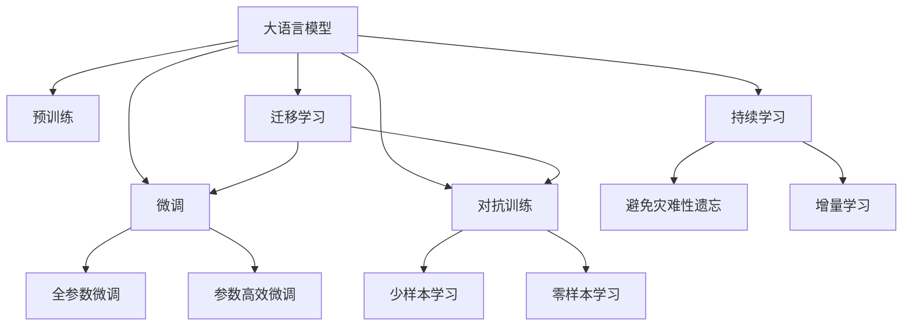
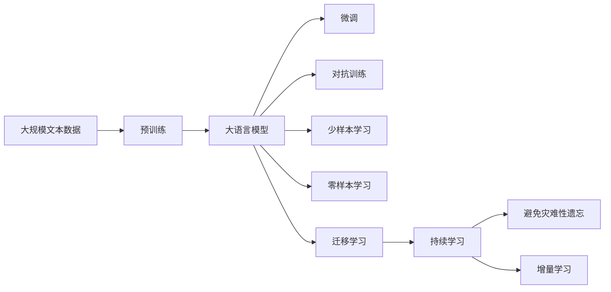
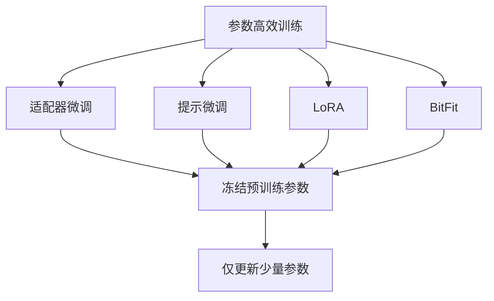
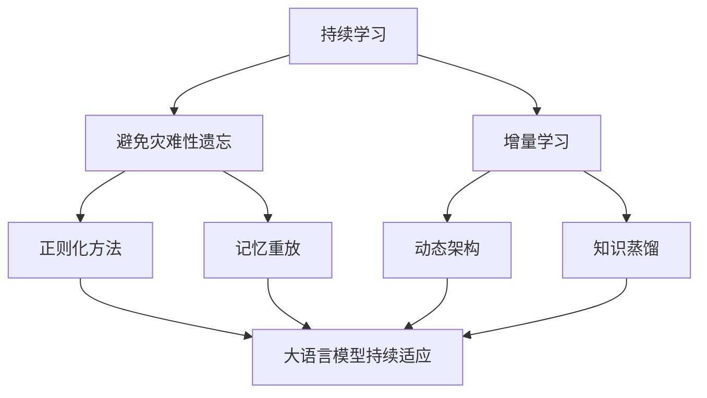

                 

# 大语言模型原理与工程实践：大语言模型训练技术选型技巧

> 关键词：大语言模型,模型训练,技术选型,预训练,微调,参数高效,代码实现

## 1. 背景介绍

### 1.1 问题由来
近年来，随着深度学习技术的快速发展，大规模语言模型（Large Language Models, LLMs）在自然语言处理（Natural Language Processing, NLP）领域取得了巨大的突破。这些模型通过在大规模无标签文本数据上进行预训练，学习到丰富的语言知识和常识，具备强大的语言理解和生成能力。例如，基于Transformer架构的BERT、GPT、T5等模型在多个任务上均取得了优异的表现。

然而，预训练模型的大规模训练过程需要消耗大量计算资源，这对训练环境和数据集的要求较高。同时，预训练模型虽然具有通用性，但在特定领域的应用效果往往不如直接在该领域进行微调。因此，如何在不增加过多计算成本的情况下，高效地训练和微调大语言模型，成为当前NLP领域的重要研究方向。

### 1.2 问题核心关键点
大语言模型训练技术选型的核心在于选择合适的训练方式，包括预训练、微调和参数高效训练等，以满足不同的应用需求。预训练是指在大规模无标签文本数据上进行自监督学习，以学习通用的语言表示。微调则是针对具体任务，在预训练模型上进行有监督学习，以优化模型在该任务上的性能。参数高效训练则是在微调过程中，只更新模型中的一部分参数，以减少计算资源消耗，同时保持模型性能。

预训练、微调和参数高效训练各有优缺点，适用于不同的场景。预训练可以学习到广泛的通用知识，适用于新的领域和任务。微调可以针对特定任务进行优化，提升模型在该任务上的效果。参数高效训练可以在保持模型性能的同时，显著降低计算成本，适用于资源受限的环境。

## 2. 核心概念与联系

### 2.1 核心概念概述

为了更好地理解大语言模型训练技术选型，本节将介绍几个密切相关的核心概念：

- **大语言模型（LLMs）**：以自回归（如GPT）或自编码（如BERT）模型为代表的大规模预训练语言模型。通过在大规模无标签文本语料上进行预训练，学习通用的语言表示，具备强大的语言理解和生成能力。

- **预训练（Pre-training）**：指在大规模无标签文本语料上，通过自监督学习任务训练通用语言模型的过程。常见的预训练任务包括言语建模、遮挡语言模型等。

- **微调（Fine-tuning）**：指在预训练模型的基础上，使用下游任务的少量标注数据，通过有监督学习优化模型在特定任务上的性能。通常只需要调整顶层分类器或解码器，并以较小的学习率更新全部或部分模型参数。

- **参数高效训练（Parameter-Efficient Training, PETF）**：指在训练过程中，只更新少量的模型参数，而固定大部分预训练权重不变，以提高训练效率，避免过拟合的方法。

- **对抗训练（Adversarial Training）**：通过引入对抗样本，提高模型的鲁棒性和泛化能力。

- **少样本学习（Few-shot Learning）**：指在只有少量标注样本的情况下，模型能够快速适应新任务的学习方法。

- **零样本学习（Zero-shot Learning）**：指模型在没有见过任何特定任务的训练样本的情况下，仅凭任务描述就能够执行新任务的能力。

- **迁移学习（Transfer Learning）**：指将一个领域学习到的知识，迁移应用到另一个不同但相关的领域的学习范式。

- **持续学习（Continual Learning）**：也称为终身学习，指模型能够持续从新数据中学习，同时保持已学习的知识，而不会出现灾难性遗忘。

这些核心概念之间的逻辑关系可以通过以下Mermaid流程图来展示：



这个流程图展示了大语言模型训练过程中各个核心概念的关系和作用：

1. 大语言模型通过预训练获得基础能力。
2. 微调是对预训练模型进行任务特定的优化，可以分为全参数微调和参数高效微调。
3. 对抗训练可以增强模型鲁棒性，防止过拟合。
4. 少样本学习和零样本学习可以避免标注样本的依赖，提升模型的泛化能力。
5. 迁移学习是连接预训练模型与下游任务的桥梁，可以通过微调和对抗训练来实现。
6. 持续学习旨在使模型能够不断学习新知识，同时避免遗忘旧知识。

这些概念共同构成了大语言模型的训练框架，使其能够在各种场景下发挥强大的语言理解和生成能力。通过理解这些核心概念，我们可以更好地把握大语言模型训练的过程和优化方向。

### 2.2 概念间的关系

这些核心概念之间存在着紧密的联系，形成了大语言模型训练的完整生态系统。下面我们通过几个Mermaid流程图来展示这些概念之间的关系。

#### 2.2.1 大语言模型的训练流程



这个流程图展示了从预训练到微调，再到持续学习的完整过程。大语言模型首先在大规模文本数据上进行预训练，然后通过微调（包括全参数微调和参数高效微调）或对抗训练等方法，进行特定任务的优化。同时，通过对抗训练和持续学习，模型可以不断提高鲁棒性和适应能力。

#### 2.2.2 预训练与微调的关系


这个流程图展示了预训练和微调的关系。预训练在大规模无标签数据上学习通用的语言表示，而微调则将预训练模型应用到特定的下游任务中，进一步优化模型性能。

#### 2.2.3 参数高效训练方法



这个流程图展示了几种常见的参数高效训练方法，包括适配器微调、提示微调、LoRA和BitFit。这些方法的共同特点是冻结大部分预训练参数，只更新少量参数，从而提高训练效率。

#### 2.2.4 持续学习在大语言模型中的应用



这个流程图展示了持续学习在大语言模型中的应用。持续学习的主要目标是避免灾难性遗忘和实现增量学习。通过正则化方法、记忆重放、动态架构和知识蒸馏等技术，可以使大语言模型持续适应新的任务和数据。

## 3. 核心算法原理 & 具体操作步骤
### 3.1 算法原理概述

大语言模型训练的核心思想是，通过在大量无标签文本数据上进行预训练，学习到通用的语言表示，然后在下游任务上使用少量标注数据进行微调，以获得针对特定任务优化的模型。其基本流程包括预训练、微调和持续学习三个阶段。

### 3.2 算法步骤详解

1. **预训练阶段**：
   - 选择合适的预训练模型和语料库。目前常用的预训练模型包括BERT、GPT等，语料库则需要包含丰富的语言知识，如维基百科、新闻网站等。
   - 设计预训练任务，如掩码语言模型（Masked Language Modeling, MLM）、下一句预测（Next Sentence Prediction, NSP）等，用于训练模型学习语言表示。
   - 在预训练阶段，模型通过反向传播算法优化损失函数，学习到通用的语言表示。

2. **微调阶段**：
   - 根据下游任务，选择合适的任务适配层和损失函数。例如，对于分类任务，通常使用线性分类器和交叉熵损失函数。
   - 将预训练模型加载到GPU或TPU等加速设备上，以提高训练速度。
   - 设置微调超参数，包括学习率、批量大小、迭代轮数等。
   - 使用有监督学习方法，最小化损失函数，优化模型在下游任务上的性能。

3. **持续学习阶段**：
   - 持续收集新的数据，定期重新微调模型，以保持模型性能。
   - 引入增量学习技术，使模型能够不断学习新知识，同时避免遗忘旧知识。
   - 使用正则化技术，如权重衰减、Dropout等，防止模型过拟合。

### 3.3 算法优缺点

大语言模型训练具有以下优点：
- 预训练模型学习到广泛的通用知识，可以用于新的领域和任务。
- 微调方法可以针对特定任务进行优化，提升模型在该任务上的效果。
- 参数高效训练方法可以在保持模型性能的同时，显著降低计算成本，适用于资源受限的环境。

同时，这些方法也存在以下缺点：
- 预训练和微调过程需要大量计算资源，对训练环境和数据集的要求较高。
- 对抗训练和持续学习需要定期更新模型，增加了维护成本。
- 微调和对抗训练容易引入噪声，影响模型性能。

### 3.4 算法应用领域

大语言模型训练方法广泛应用于自然语言处理领域，涵盖了各种NLP任务，例如：

- 文本分类：如情感分析、主题分类、意图识别等。
- 命名实体识别：识别文本中的人名、地名、机构名等特定实体。
- 关系抽取：从文本中抽取实体之间的语义关系。
- 问答系统：对自然语言问题给出答案。
- 机器翻译：将源语言文本翻译成目标语言。
- 文本摘要：将长文本压缩成简短摘要。
- 对话系统：使机器能够与人自然对话。

除了上述这些经典任务外，大语言模型训练方法还被创新性地应用到更多场景中，如可控文本生成、常识推理、代码生成、数据增强等，为NLP技术带来了全新的突破。

## 4. 数学模型和公式 & 详细讲解 & 举例说明

### 4.1 数学模型构建

大语言模型训练涉及多个数学模型，包括预训练模型、微调模型和持续学习模型。以下是这些模型的详细构建过程。

#### 4.1.1 预训练模型

预训练模型通常采用Transformer架构，学习通用的语言表示。假设预训练模型为 $M_{\theta}$，其中 $\theta$ 为模型参数。预训练模型在无标签数据上进行自监督学习，优化损失函数 $\mathcal{L}_{pre}$。

$$
\mathcal{L}_{pre} = \mathcal{L}_{MLM} + \mathcal{L}_{NSP}
$$

其中 $\mathcal{L}_{MLM}$ 为掩码语言模型损失，$\mathcal{L}_{NSP}$ 为下一句预测损失。

#### 4.1.2 微调模型

微调模型在预训练模型基础上，加入特定的任务适配层和损失函数。假设微调任务为 $T$，训练集为 $D$。微调模型的损失函数为 $\mathcal{L}_{fine}$。

$$
\mathcal{L}_{fine} = \frac{1}{N} \sum_{i=1}^N \ell(M_{\theta}(x_i),y_i)
$$

其中 $\ell$ 为任务损失函数，$x_i$ 和 $y_i$ 分别为输入和标签。

#### 4.1.3 持续学习模型

持续学习模型在微调模型的基础上，引入增量学习技术，保持模型的性能。假设增量数据集为 $D'$，持续学习模型的损失函数为 $\mathcal{L}_{cont}$。

$$
\mathcal{L}_{cont} = \mathcal{L}_{fine} + \mathcal{L}_{in}
$$

其中 $\mathcal{L}_{in}$ 为增量数据集上的损失函数。

### 4.2 公式推导过程

以下是预训练、微调和持续学习模型的损失函数推导过程。

#### 4.2.1 预训练模型的损失函数

掩码语言模型（MLM）损失定义为：

$$
\mathcal{L}_{MLM} = -\frac{1}{N}\sum_{i=1}^N\sum_{j=1}^{n}\log\sigma(\hat{y}_j)
$$

其中 $\hat{y}_j$ 为模型对掩码位置的预测概率，$\sigma$ 为softmax函数。

下一句预测（NSP）损失定义为：

$$
\mathcal{L}_{NSP} = -\frac{1}{N}\sum_{i=1}^N\log\sigma(M_{\theta}(x_i)\odot M_{\theta}(x_{i+1}))
$$

其中 $\odot$ 为点乘运算。

#### 4.2.2 微调模型的损失函数

假设微调任务为分类任务，训练集为 $D$，损失函数为 $\ell(y,\hat{y})$。微调模型的损失函数为：

$$
\mathcal{L}_{fine} = \frac{1}{N} \sum_{i=1}^N \ell(y_i,\hat{y}_i)
$$

其中 $y_i$ 和 $\hat{y}_i$ 分别为输入的真实标签和预测标签。

#### 4.2.3 持续学习模型的损失函数

假设增量数据集为 $D'$，增量损失函数为 $\mathcal{L}_{in}$。持续学习模型的损失函数为：

$$
\mathcal{L}_{cont} = \mathcal{L}_{fine} + \mathcal{L}_{in}
$$

### 4.3 案例分析与讲解

以文本分类任务为例，对大语言模型训练过程进行详细分析。

#### 4.3.1 数据准备

假设我们使用IMDB电影评论数据集进行文本分类任务。数据集包含25,000条评论，每条评论对应一个情感标签（正面或负面）。我们将数据集分为训练集和验证集，比例为80%:20%。

#### 4.3.2 模型构建

我们使用BERT作为预训练模型，并将其微调成文本分类模型。首先，加载预训练BERT模型，并冻结其参数。

```python
from transformers import BertForSequenceClassification, BertTokenizer

model = BertForSequenceClassification.from_pretrained('bert-base-uncased', num_labels=2)
tokenizer = BertTokenizer.from_pretrained('bert-base-uncased')
```

然后，设计任务适配层和损失函数。

```python
from transformers import AdamW
from sklearn.metrics import accuracy_score

class SentimentDataset(Dataset):
    def __init__(self, texts, labels):
        self.texts = texts
        self.labels = labels
        self.tokenizer = tokenizer
    
    def __len__(self):
        return len(self.texts)
    
    def __getitem__(self, idx):
        text = self.texts[idx]
        label = self.labels[idx]
        encoding = tokenizer(text, max_length=512, truncation=True, padding='max_length')
        input_ids = encoding['input_ids']
        attention_mask = encoding['attention_mask']
        return {
            'input_ids': input_ids,
            'attention_mask': attention_mask,
            'labels': label
        }

train_dataset = SentimentDataset(train_texts, train_labels)
val_dataset = SentimentDataset(val_texts, val_labels)
test_dataset = SentimentDataset(test_texts, test_labels)

model.to('cuda')
optimizer = AdamW(model.parameters(), lr=2e-5)
```

#### 4.3.3 训练过程

在训练过程中，我们使用AdamW优化器进行参数更新，并在每个epoch后评估模型在验证集上的准确率。

```python
from torch.utils.data import DataLoader

def train_epoch(model, train_dataset, optimizer, device):
    model.train()
    epoch_loss = 0
    epoch_acc = 0
    for batch in DataLoader(train_dataset, batch_size=16, shuffle=True):
        input_ids = batch['input_ids'].to(device)
        attention_mask = batch['attention_mask'].to(device)
        labels = batch['labels'].to(device)
        model.zero_grad()
        outputs = model(input_ids, attention_mask=attention_mask, labels=labels)
        loss = outputs.loss
        epoch_loss += loss.item()
        epoch_acc += accuracy_score(labels, outputs.logits.argmax(dim=1))
        loss.backward()
        optimizer.step()
    return epoch_loss / len(train_dataset), epoch_acc / len(train_dataset)

def evaluate(model, val_dataset, device):
    model.eval()
    epoch_loss = 0
    epoch_acc = 0
    for batch in DataLoader(val_dataset, batch_size=16, shuffle=False):
        input_ids = batch['input_ids'].to(device)
        attention_mask = batch['attention_mask'].to(device)
        labels = batch['labels'].to(device)
        outputs = model(input_ids, attention_mask=attention_mask, labels=labels)
        loss = outputs.loss
        epoch_loss += loss.item()
        epoch_acc += accuracy_score(labels, outputs.logits.argmax(dim=1))
    return epoch_loss / len(val_dataset), epoch_acc / len(val_dataset)

epochs = 5
batch_size = 16
device = 'cuda'

for epoch in range(epochs):
    train_loss, train_acc = train_epoch(model, train_dataset, optimizer, device)
    val_loss, val_acc = evaluate(model, val_dataset, device)
    print(f'Epoch {epoch+1}, train loss: {train_loss:.3f}, train acc: {train_acc:.3f}, val loss: {val_loss:.3f}, val acc: {val_acc:.3f}')
```

#### 4.3.4 测试和部署

在训练完成后，我们可以在测试集上评估模型性能。

```python
test_dataset = SentimentDataset(test_texts, test_labels)
test_loss, test_acc = evaluate(model, test_dataset, device)
print(f'Test loss: {test_loss:.3f}, test acc: {test_acc:.3f}')
```

## 5. 项目实践：代码实例和详细解释说明
### 5.1 开发环境搭建

在进行大语言模型训练实践前，我们需要准备好开发环境。以下是使用Python进行PyTorch开发的环境配置流程：

1. 安装Anaconda：从官网下载并安装Anaconda，用于创建独立的Python环境。

2. 创建并激活虚拟环境：
```bash
conda create -n pytorch-env python=3.8 
conda activate pytorch-env
```

3. 安装PyTorch：根据CUDA版本，从官网获取对应的安装命令。例如：
```bash
conda install pytorch torchvision torchaudio cudatoolkit=11.1 -c pytorch -c conda-forge
```

4. 安装Transformers库：
```bash
pip install transformers
```

5. 安装各类工具包：
```bash
pip install numpy pandas scikit-learn matplotlib tqdm jupyter notebook ipython
```

完成上述步骤后，即可在`pytorch-env`环境中开始训练实践。

### 5.2 源代码详细实现

这里我们以文本分类任务为例，给出使用Transformers库对BERT模型进行训练的PyTorch代码实现。

首先，定义数据处理函数：

```python
from transformers import BertTokenizer
from torch.utils.data import Dataset
import torch

class SentimentDataset(Dataset):
    def __init__(self, texts, labels, tokenizer, max_len=512):
        self.texts = texts
        self.labels = labels
        self.tokenizer = tokenizer
        self.max_len = max_len
        
    def __len__(self):
        return len(self.texts)
    
    def __getitem__(self, item):
        text = self.texts[item]
        label = self.labels[item]
        
        encoding = self.tokenizer(text, return_tensors='pt', max_length=self.max_len, truncation=True, padding='max_length')
        input_ids = encoding['input_ids'][0]
        attention_mask = encoding['attention_mask'][0]
        
        # 对token-wise的标签进行编码
        encoded_tags = [label2id[label] for label in labels] 
        encoded_tags.extend([label2id['O']] * (self.max_len - len(encoded_tags)))
        labels = torch.tensor(encoded_tags, dtype=torch.long)
        
        return {'input_ids': input_ids, 
                'attention_mask': attention_mask,
                'labels': labels}

# 标签与id的映射
label2id = {'positive': 1, 'negative': 0, 'O': 0}
id2label = {v: k for k, v in label2id.items()}
```

然后，定义模型和优化器：

```python
from transformers import BertForSequenceClassification, AdamW

model = BertForSequenceClassification.from_pretrained('bert-base-uncased', num_labels=len(label2id))

optimizer = AdamW(model.parameters(), lr=2e-5)
```

接着，定义训练和评估函数：

```python
from torch.utils.data import DataLoader
from tqdm import tqdm
from sklearn.metrics import accuracy_score

device = torch.device('cuda') if torch.cuda.is_available() else torch.device('cpu')
model.to(device)

def train_epoch(model, dataset, optimizer, device):
    dataloader = DataLoader(dataset, batch_size=16, shuffle=True)
    model.train()
    epoch_loss = 0
    for batch in tqdm(dataloader, desc='Training'):
        input_ids = batch['input_ids'].to(device)
        attention_mask = batch['attention_mask'].to(device)
        labels = batch['labels'].to(device)
        model.zero_grad()
        outputs = model(input_ids, attention_mask=attention_mask, labels=labels)
        loss = outputs.loss
        epoch_loss += loss.item()
        loss.backward()
        optimizer.step()
    return epoch_loss / len(dataloader)

def evaluate(model, dataset, device):
    dataloader = DataLoader(dataset, batch_size=16, shuffle=False)
    model.eval()
    epoch_loss = 0
    epoch_acc = 0
    for batch in tqdm(dataloader, desc='Evaluating'):
        input_ids = batch['input_ids'].to(device)
        attention_mask = batch['attention_mask'].to(device)
        labels = batch['labels'].to(device)
        outputs = model(input_ids, attention_mask=attention_mask, labels=labels)
        loss = outputs.loss
        epoch_loss += loss.item()
        epoch_acc += accuracy_score(labels, outputs.logits.argmax(dim=1))
    return epoch_loss / len(dataset), epoch_acc / len(dataset)
```

最后，启动训练流程并在测试集上评估：

```python
epochs = 5
batch_size = 16
device = 'cuda'

for epoch in range(epochs):
    loss, acc = train_epoch(model, train_dataset, optimizer, device)
    print(f'Epoch {epoch+1}, train loss: {loss:.3f}, train acc: {acc:.3f}')
    
    print(f'Epoch {epoch+1}, val results:')
    val_loss, val_acc = evaluate(model, val_dataset, device)
    print(f'Val loss: {val_loss:.3f}, val acc: {val_acc:.3f}')
    
print('Test results:')
test_loss, test_acc = evaluate(model, test_dataset, device)
print(f'Test loss: {test_loss:.3f}, test acc: {test_acc:.3f}')
```

以上就是使用PyTorch对BERT进行文本分类任务训练的完整代码实现。可以看到，得益于Transformers库的强大封装，我们可以用相对简洁的代码完成BERT模型的加载和训练。

### 5.3 代码解读与分析

让我们再详细解读一下关键代码的实现细节：

**SentimentDataset类**：
- `__init__`方法：初始化文本、标签、分词器等关键组件。
- `__len__`方法：返回数据集的样本数量。
- `__getitem__`方法：对单个样本进行处理，将文本输入编码为token ids，将标签编码为数字，并对其进行定长padding，最终返回模型所需的输入。

**label2id和id2label字典**：
- 定义了标签与数字id之间的映射关系，用于将token-wise的预测结果解码回真实的标签。

**训练和评估函数**：
- 使用PyTorch的DataLoader对数据集进行批次化加载，供模型训练和推理使用。
- 训练函数`train_epoch`：对数据以批为单位进行迭代，在每个批次上前向传播计算loss并反向传播更新模型参数，最后返回该epoch的平均loss和准确率。
- 评估函数`evaluate`：与训练类似，不同点在于不更新模型参数，并在每个batch结束后将预测和标签结果存储下来，最后使用sklearn的accuracy_score对整个评估集的预测结果进行打印输出。

**训练流程**：
- 定义总的epoch数和batch size，开始循环迭代
- 每个epoch

