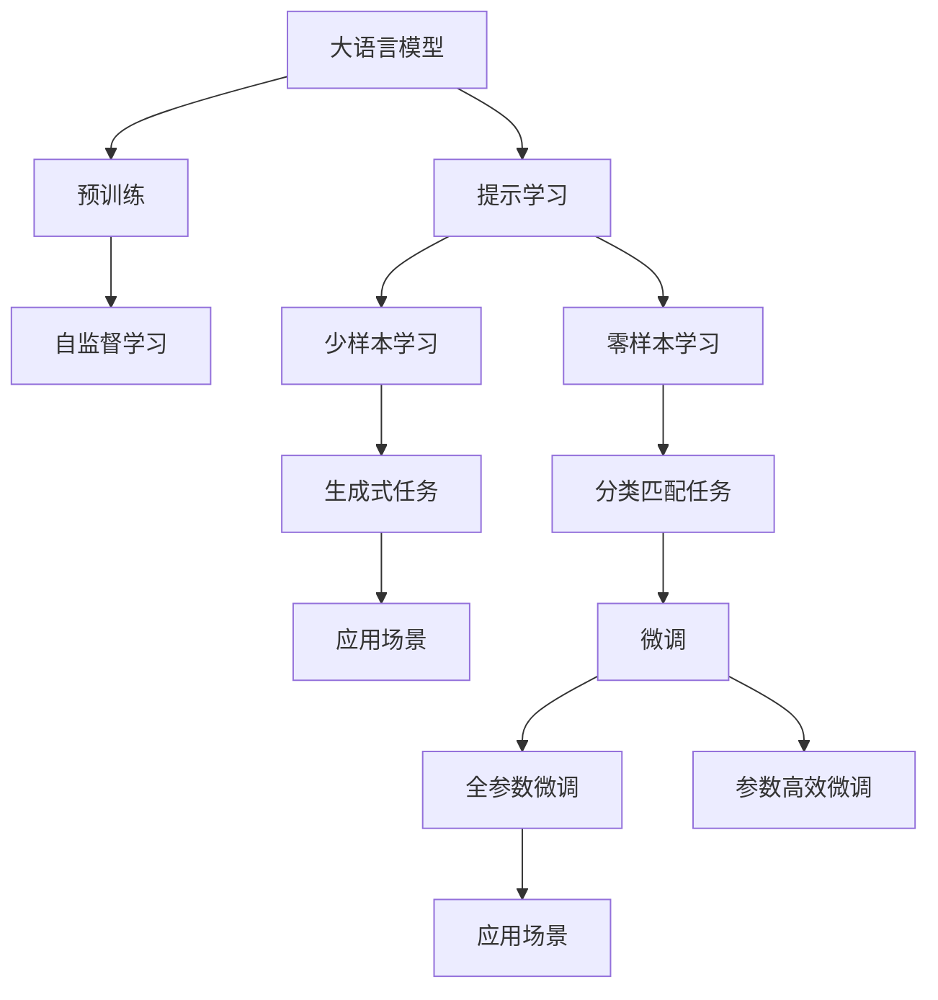
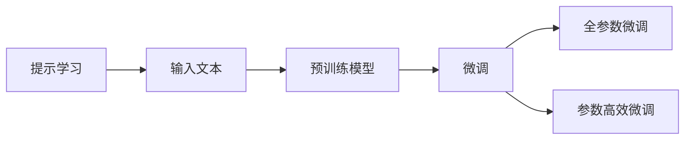
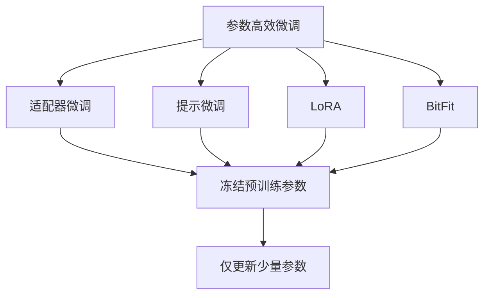
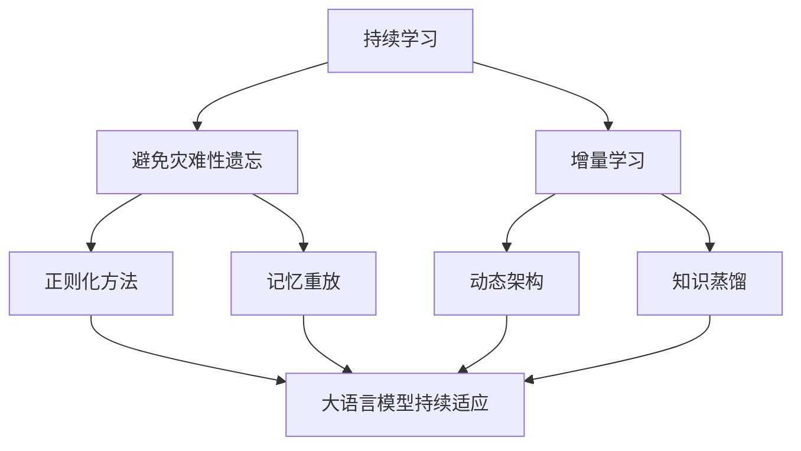
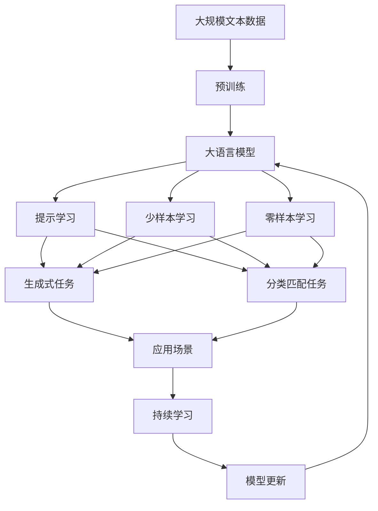

                 

# 大语言模型原理与工程实践：思维树提示

> 关键词：大语言模型,思维树,提示学习,深度学习,自然语言处理(NLP),Transformer,BERT,代码实现

## 1. 背景介绍

### 1.1 问题由来
近年来，深度学习在自然语言处理(NLP)领域取得了巨大的突破，大规模语言模型(Large Language Models, LLMs)在生成、分类、问答等多个任务上表现优异。然而，这些大模型普遍存在过拟合、泛化能力差等问题，尤其在特定领域的应用中，性能往往不尽如人意。为了提高模型在小规模标注数据上的表现，研究人员引入了提示学习（Prompt Learning）方法，通过精心设计的提示模板（Prompt Templates），引导模型生成符合期望的输出，从而在微调数据不足的情况下仍能取得不错的效果。

提示学习是近年来自然语言处理领域的一个重要研究方向，它能够有效提升模型在小样本、零样本或少样本学习任务上的性能，并且对模型的计算资源需求相对较低。这种方法已经成为NLP任务中常用的技术之一，广泛应用于生成式对话、文本摘要、问答系统等多个领域。

### 1.2 问题核心关键点
提示学习的主要思想是：通过在输入文本中添加提示信息，使得模型能够按照期望的方式进行推理和生成。这种方法的优点在于，它可以在不更新模型参数的情况下，实现零样本或少样本学习，从而避免了微调模型时可能出现的过拟合问题。具体来说，提示学习的过程包括以下几个关键步骤：

1. 设计提示模板（Prompt Template）：根据具体任务和数据特点，设计合适的提示模板，确保模型能够理解任务要求。
2. 训练模型：使用预训练模型作为初始化参数，通过提示模板进行微调，使模型学习到任务相关的特征。
3. 生成输出：将测试数据输入模型，使用设计好的提示模板，生成符合期望的输出。

提示学习的方法在学术界和工业界都得到了广泛应用，尤其是在问答系统、对话系统、文本摘要等领域，已经成为提高模型性能的重要手段。

### 1.3 问题研究意义
提示学习在大规模语言模型的基础上，通过优化输入文本的表达方式，可以在不增加额外训练成本的情况下，显著提升模型的性能。这对于NLP技术的快速落地应用具有重要意义：

1. 降低开发成本：提示学习可以充分利用预训练模型的知识，减少从头训练所需的数据和计算资源。
2. 提高模型效果：提示学习使得模型能够更好地适应特定任务，在微调数据不足的情况下仍能取得较优的效果。
3. 加速开发进度：提示学习使得开发者能够快速适配任务，缩短开发周期。
4. 带来技术创新：提示学习促进了对预训练模型的深入研究，催生了更多的新研究方向，如少样本学习和零样本学习等。

提示学习不仅适用于生成式任务，如对话、摘要、翻译等，也适用于分类、匹配等任务，通过设计不同的提示模板，可以实现更广泛的应用场景。因此，掌握提示学习的方法和技巧，对于NLP技术的应用开发具有重要的指导意义。

## 2. 核心概念与联系

### 2.1 核心概念概述

提示学习是自然语言处理(NLP)领域的一个重要研究方向，它通过在输入文本中添加提示信息，引导大语言模型生成符合期望的输出。提示学习主要包括以下几个核心概念：

- 大语言模型(Large Language Model, LLM)：以自回归(如GPT)或自编码(如BERT)模型为代表的大规模预训练语言模型。通过在大规模无标签文本语料上进行预训练，学习到丰富的语言知识和常识，具备强大的语言理解和生成能力。
- 预训练(Pre-training)：指在大规模无标签文本语料上，通过自监督学习任务训练通用语言模型的过程。常见的预训练任务包括言语建模、遮挡语言模型等。预训练使得模型学习到语言的通用表示。
- 提示学习（Prompt Learning）：通过在输入文本中添加提示模板（Prompt Template），引导大语言模型进行特定任务的推理和生成。可以在不更新模型参数的情况下，实现零样本或少样本学习。
- 少样本学习（Few-shot Learning）：指在只有少量标注样本的情况下，模型能够快速适应新任务的学习方法。在大语言模型中，通常通过在输入中提供少量示例来实现，无需更新模型参数。
- 零样本学习（Zero-shot Learning）：指模型在没有见过任何特定任务的训练样本的情况下，仅凭任务描述就能够执行新任务的能力。大语言模型通过预训练获得的广泛知识，使其能够理解任务指令并生成相应输出。

这些核心概念之间的逻辑关系可以通过以下Mermaid流程图来展示：

```mermaid
graph TB
    A[大语言模型] --> B[预训练]
    A --> C[提示学习]
    C --> D[少样本学习]
    C --> E[零样本学习]
    B --> F[自监督学习]
    F --> G[自然语言处理(NLP)]
    G --> H[生成式任务]
    G --> I[分类匹配任务]
    F --> J[监督学习]
    J --> K[微调]
    K --> L[全参数微调]
    K --> M[参数高效微调]
```

这个流程图展示了提示学习在大语言模型中的应用框架：

1. 大语言模型通过预训练获得基础能力。
2. 提示学习通过添加提示模板，实现零样本或少样本学习。
3. 少样本学习和零样本学习在大语言模型中均实现了不错的效果。
4. 微调通过有监督学习进一步优化模型，适用于有少量标注数据的任务。
5. 全参数微调和参数高效微调是常用的微调方法，可以有效提升模型性能。

### 2.2 概念间的关系

这些核心概念之间存在着紧密的联系，形成了提示学习的完整生态系统。下面我通过几个Mermaid流程图来展示这些概念之间的关系。

#### 2.2.1 大语言模型的学习范式



这个流程图展示了大语言模型和提示学习的学习范式：

1. 大语言模型通过预训练获得基础能力。
2. 提示学习通过添加提示模板，实现零样本或少样本学习。
3. 少样本学习和零样本学习在大语言模型中均实现了不错的效果。
4. 微调通过有监督学习进一步优化模型，适用于有少量标注数据的任务。
5. 全参数微调和参数高效微调是常用的微调方法，可以有效提升模型性能。

#### 2.2.2 提示学习与微调的关系



这个流程图展示了提示学习与微调的关系：

1. 提示学习通过添加提示模板，引导预训练模型进行推理和生成。
2. 微调通过有监督学习进一步优化模型，适用于有少量标注数据的任务。
3. 全参数微调和参数高效微调是常用的微调方法，可以有效提升模型性能。

#### 2.2.3 参数高效微调方法



这个流程图展示了几种常见的参数高效微调方法，包括适配器微调、提示微调、LoRA和BitFit。这些方法的共同特点是冻结大部分预训练参数，只更新少量参数，从而提高微调效率。

#### 2.2.4 持续学习在大语言模型中的应用



这个流程图展示了持续学习在大语言模型中的应用：

1. 持续学习旨在使模型能够不断学习新知识，同时保持已学习的知识。
2. 避免灾难性遗忘和实现增量学习是持续学习的主要目标。
3. 正则化方法、记忆重放、动态架构和知识蒸馏等技术，可以使大语言模型持续适应新的任务和数据。

### 2.3 核心概念的整体架构

最后，我们用一个综合的流程图来展示这些核心概念在大语言模型提示学习中的整体架构：



这个综合流程图展示了从预训练到提示学习，再到持续学习的完整过程：

1. 大语言模型通过预训练获得基础能力。
2. 提示学习通过添加提示模板，实现零样本或少样本学习。
3. 少样本学习和零样本学习在大语言模型中均实现了不错的效果。
4. 微调通过有监督学习进一步优化模型，适用于有少量标注数据的任务。
5. 全参数微调和参数高效微调是常用的微调方法，可以有效提升模型性能。
6. 持续学习技术，使模型能够不断学习新知识，同时保持已学习的知识。

通过这些流程图，我们可以更清晰地理解提示学习在大语言模型微调过程中各个核心概念的关系和作用，为后续深入讨论具体的提示学习方法和技术奠定基础。

## 3. 核心算法原理 & 具体操作步骤
### 3.1 算法原理概述

提示学习的主要思想是在输入文本中添加提示信息，使得模型能够按照期望的方式进行推理和生成。这种方法的实现基于自监督学习任务，通过在输入文本中添加不同的提示模板（Prompt Templates），引导模型进行特定任务的推理和生成。提示学习的过程包括两个主要步骤：

1. 设计提示模板：根据具体任务和数据特点，设计合适的提示模板，确保模型能够理解任务要求。
2. 训练模型：使用预训练模型作为初始化参数，通过提示模板进行微调，使模型学习到任务相关的特征。

提示学习的核心在于如何设计有效的提示模板，使得模型能够在不更新参数的情况下，生成符合期望的输出。提示模板通常包含任务描述、输入数据格式、期望输出格式等信息，能够引导模型理解任务要求，并生成正确的输出。

### 3.2 算法步骤详解

提示学习的具体实现步骤如下：

1. 准备预训练模型和数据集：
   - 选择合适的预训练语言模型 $M_{\theta}$ 作为初始化参数，如 BERT、GPT 等。
   - 准备下游任务 $T$ 的标注数据集 $D=\{(x_i, y_i)\}_{i=1}^N$，划分为训练集、验证集和测试集。

2. 设计提示模板（Prompt Template）：
   - 根据下游任务 $T$ 的特点，设计合适的提示模板，确保模型能够理解任务要求。
   - 提示模板通常包含任务描述、输入数据格式、期望输出格式等信息。

3. 训练模型：
   - 使用预训练模型 $M_{\theta}$ 作为初始化参数，通过提示模板进行微调。
   - 对于生成式任务，可以使用交叉熵损失函数，对于分类任务，可以使用二分类交叉熵损失函数。
   - 使用优化算法如 Adam、SGD 等进行训练，设置合适的学习率、批大小、迭代轮数等超参数。

4. 生成输出：
   - 将测试数据输入模型，使用设计好的提示模板，生成符合期望的输出。
   - 对于生成式任务，可以将模型输出的概率分布作为样本的生成方式；对于分类任务，可以使用模型输出的概率分布作为样本的分类结果。

5. 评估模型性能：
   - 在验证集和测试集上评估模型性能，使用常见的评估指标如准确率、召回率、F1分数等。
   - 如果模型性能不佳，可以调整提示模板、优化超参数等方法进行迭代优化。

### 3.3 算法优缺点

提示学习的主要优点在于，它可以在不更新模型参数的情况下，实现零样本或少样本学习，从而避免了微调模型时可能出现的过拟合问题。同时，提示学习对于数据量的要求较低，适用于数据量较小、标注数据难以获取的场景。

然而，提示学习也存在一些缺点：

1. 提示模板设计困难：提示模板的设计需要根据具体任务进行手工设计，设计不当会导致模型输出不准确。
2. 泛化能力有限：提示学习的效果很大程度上依赖于提示模板的质量，不同数据集上的提示模板可能无法通用。
3. 提示依赖性强：提示学习依赖于输入文本的质量和数量，输入文本质量较差时，提示模板的效果也会大打折扣。
4. 缺少可解释性：提示学习的结果缺少可解释性，难以解释模型决策的逻辑。

尽管存在这些缺点，但提示学习在实际应用中已经取得了不错的效果，广泛应用于生成式对话、文本摘要、问答系统等多个领域。

### 3.4 算法应用领域

提示学习在大语言模型中的应用已经覆盖了多个领域，以下是一些典型的应用场景：

- 生成式对话：通过设计合适的提示模板，使模型能够按照对话要求生成符合语境的回答，如智能客服、虚拟助手等。
- 文本摘要：使用提示模板引导模型生成摘要，适用于新闻报道、科技文章等长文本的自动摘要。
- 问答系统：通过设计合适的提示模板，使模型能够回答用户提出的问题，如搜索引擎、智能问答系统等。
- 命名实体识别：使用提示模板引导模型识别文本中的实体信息，如人名、地名、机构名等。
- 情感分析：使用提示模板引导模型判断文本的情感倾向，如正面、负面、中性等。
- 代码生成：使用提示模板引导模型生成符合编程规范的代码，如代码注释、代码补全等。

提示学习在大语言模型中的应用场景非常广泛，几乎涵盖了NLP领域的所有任务，成为提升模型性能的重要手段。

## 4. 数学模型和公式 & 详细讲解  
### 4.1 数学模型构建

提示学习的数学模型构建主要涉及两个方面：提示模板的设计和模型的训练。下面将分别介绍这两个方面的数学模型构建。

#### 4.1.1 提示模板的设计

提示模板的设计需要根据具体任务进行手工设计，通常包含任务描述、输入数据格式、期望输出格式等信息。例如，对于一个生成式对话任务，提示模板可能包含对话上下文、用户意图等信息，如下所示：

```
<对话上下文> 用户意图：<意图描述>
```

#### 4.1.2 模型的训练

提示学习的训练过程主要涉及两个部分：提示模板的训练和模型的微调。

1. 提示模板的训练：提示模板的训练通常使用自监督学习任务进行。例如，对于生成式对话任务，可以使用自回归语言模型（如GPT）进行训练。训练过程中，模型需要学习如何将提示模板转换为有效的输出，使得生成的对话符合对话要求。

2. 模型的微调：模型的微调通常使用有监督学习任务进行。例如，对于生成式对话任务，可以使用交叉熵损失函数进行训练。训练过程中，模型需要学习如何根据输入的提示模板生成符合对话要求的回答。

### 4.2 公式推导过程

以下我将以生成式对话任务为例，推导提示学习的数学模型和训练过程。

假设任务为生成式对话，提示模板为 $\text{Prompt} = \text{Context} \text{意图} \text{用户意图}$，其中 $\text{Context}$ 为对话上下文，$\text{意图}$ 为用户的意图描述，$\text{用户意图}$ 为用户的具体问题。

模型的输入为 $x = (\text{Context}, \text{意图}, \text{用户意图})$，输出为 $y = \text{回答}$。模型的训练过程可以表示为：

$$
\min_{\theta} \mathcal{L}(M_{\theta}(x), y)
$$

其中 $\mathcal{L}$ 为损失函数，$M_{\theta}$ 为模型，$x$ 为输入，$y$ 为输出。

对于生成式对话任务，可以使用交叉熵损失函数进行训练，其定义如下：

$$
\mathcal{L}(M_{\theta}(x), y) = -\log P(y | M_{\theta}(x))
$$

其中 $P(y | M_{\theta}(x))$ 为模型在输入 $x$ 下生成 $y$ 的概率。

### 4.3 案例分析与讲解

下面通过一个具体的案例来分析提示学习的数学模型和训练过程。

假设有一个生成式对话任务，模型需要根据用户的意图和上下文，生成符合语境的回答。设计提示模板如下：

```
<对话上下文> 用户意图：<意图描述>
```

训练模型的过程如下：

1. 准备数据集：收集用户的历史对话数据，划分为训练集、验证集和测试集。
2. 设计提示模板：根据用户的历史对话数据，设计合适的提示模板，确保模型能够理解任务要求。
3. 训练模型：使用预训练模型作为初始化参数，通过提示模板进行微调。使用交叉熵损失函数进行训练，设置合适的学习率、批大小、迭代轮数等超参数。
4. 生成回答：将用户输入的问题和上下文作为输入，使用训练好的模型生成回答。

例如，当用户输入问题“今天天气如何？”时，模型可以根据上下文生成回答，如下所示：

```
用户：今天天气如何？
上下文：昨天天气多云，最高温度28度。
回答：今天天气预计晴朗，最高温度30度。
```

在训练过程中，模型的参数 $\theta$ 不断更新，使得模型能够根据不同的上下文和意图，生成符合语境的回答。

## 5. 项目实践：代码实例和详细解释说明
### 5.1 开发环境搭建

在进行提示学习实践前，我们需要准备好开发环境。以下是使用Python进行PyTorch开发的环境配置流程：

1. 安装Anaconda：从官网下载并安装Anaconda，用于创建独立的Python环境。

2. 创建并激活虚拟环境：
```bash
conda create -n pytorch-env python=3.8 
conda activate pytorch-env
```

3. 安装PyTorch：根据CUDA版本，从官网获取对应的安装命令。例如：
```bash
conda install pytorch torchvision torchaudio cudatoolkit=11.1 -c pytorch -c conda-forge
```

4. 安装Transformers库：
```bash
pip install transformers
```

5. 安装各类工具包：
```bash
pip install numpy pandas scikit-learn matplotlib tqdm jupyter notebook ipython
```

完成上述步骤后，即可在`pytorch-env`环境中开始提示学习实践。

### 5.2 源代码详细实现

下面我以生成式对话任务为例，给出使用Transformers库对BERT模型进行提示学习的PyTorch代码实现。

首先，定义数据集：

```python
from transformers import BertTokenizer
from torch.utils.data import Dataset
import torch

class DialogueDataset(Dataset):
    def __init__(self, texts, prompts, labels):
        self.texts = texts
        self.prompts = prompts
        self.labels = labels
        self.tokenizer = BertTokenizer.from_pretrained('bert-base-cased')

    def __len__(self):
        return len(self.texts)

    def __getitem__(self, item):
        text = self.texts[item]
        prompt = self.prompts[item]
        label = self.labels[item]
        
        encoding = self.tokenizer(prompt, return_tensors='pt', max_length=128, padding='max_length', truncation=True)
        input_ids = encoding['input_ids'][0]
        attention_mask = encoding['attention_mask'][0]
        
        # 对token-wise的标签进行编码
        encoded_labels = [label2id[label] for label in label] 
        encoded_labels.extend([label2id['O']] * (self.max_len - len(encoded_labels)))
        labels = torch.tensor(encoded_labels, dtype=torch.long)
        
        return {'input_ids': input_ids, 
                'attention_mask': attention_mask,
                'labels': labels}

# 标签与id的映射
label2id = {'O': 0, 'A': 1, 'B': 2, 'C': 3}
id2label = {v: k for k, v in label2id.items()}

# 创建dataset
tokenizer = BertTokenizer.from_pretrained('bert-base-cased')

train_dataset = DialogueDataset(train_texts, train_prompts, train_labels)
dev_dataset = DialogueDataset(dev_texts, dev_prompts, dev_labels)
test_dataset = DialogueDataset(test_texts, test_prompts, test_labels)
```

然后，定义模型和优化器：

```python
from transformers import BertForTokenClassification, AdamW

model = BertForTokenClassification.from_pretrained('bert-base-cased', num_labels=len(label2id))

optimizer = AdamW(model.parameters(), lr=2e-5)
```

接着，定义训练和评估函数：

```python
from torch.utils.data import DataLoader
from tqdm import tqdm
from sklearn.metrics import classification_report

device = torch.device('cuda') if torch.cuda.is_available() else torch.device('cpu')
model.to(device)

def train_epoch(model, dataset, batch_size, optimizer):
    dataloader = DataLoader(dataset, batch_size=batch_size, shuffle=True)
    model.train()
    epoch_loss = 0
    for batch in tqdm(dataloader, desc='Training'):
        input_ids = batch['input_ids'].to(device)
        attention_mask = batch['attention_mask'].to(device)
        labels = batch['labels'].to(device)
        model.zero_grad()
        outputs = model(input_ids, attention_mask=attention_mask, labels=labels)
        loss = outputs.loss
        epoch_loss += loss.item()
        loss.backward()
        optimizer.step()
    return epoch_loss / len(dataloader)

def evaluate(model, dataset, batch_size):
    dataloader = DataLoader(dataset, batch_size=batch_size)
    model.eval()
    preds, labels = [], []
    with torch.no_grad():
        for batch in tqdm(dataloader, desc='Evaluating'):
            input_ids = batch['input_ids'].to(device)
            attention_mask = batch['attention_mask'].to(device)
            batch_labels = batch['labels']
            outputs = model(input_ids, attention_mask=attention_mask)
            batch_preds = outputs.logits.argmax(dim=2).to('cpu').tolist()
            batch_labels = batch_labels.to('cpu').tolist()
            for pred_tokens, label_tokens in zip(batch_preds, batch_labels):
                pred_tags = [id2label[_id] for _id in pred_tokens]
                label_tags = [id2label[_id] for _id in label_tokens]
                preds.append(pred_tags[:len(label_tags)])
                labels.append(label_tags)
                
    print(classification_report(labels, preds))
```

最后，启动训练流程并在测试集上评估：

```python
epochs = 5
batch_size = 16

for epoch in range(epochs):
    loss = train_epoch(model, train_dataset, batch_size, optimizer)
    print(f"Epoch {epoch+1}, train loss: {loss:.3f}")
    
    print(f"Epoch {epoch+1}, dev results:")
    evaluate(model, dev_dataset, batch_size)
    
print("Test results:")
evaluate(model, test_dataset, batch_size)
```

以上就是使用PyTorch对BERT进行生成式对话任务提示学习的完整代码实现。可以看到，借助Transformers库，提示学习的代码实现变得简洁高效。

### 5.3 代码解读与分析

让我们再详细解读一下关键代码的实现细节：

**DialogueDataset类**：
- `__init__`方法：初始化文本、提示模板和标签等关键组件。
- `__len__`方法：返回数据集的样本数量。
- `__getitem__`方法：对单个样本进行处理，将提示模板输入编码为token ids，将标签编码为数字，并对其进行定长padding，最终返回模型所需的输入。

**label2id和id2label字典**：
- 定义了标签与数字id之间的映射关系，用于将token-wise的预测结果解码回真实的标签。

**训练和评估函数**：
- 使用PyTorch的DataLoader对数据集进行批次化加载，供模型训练和推理使用。
- 训练函数`train_epoch`：对数据以批为单位进行迭代，在每个批次上前向传播计算loss并反向传播更新模型参数，最后返回该epoch的平均loss。
- 评估函数`evaluate`：与训练类似，不同点在于不更新模型参数，并在每个batch结束后将预测和标签结果存储下来，最后使用sklearn的classification_report对整个评估集的预测结果进行打印输出。

**训练流程**：
- 定义总的epoch数和batch size，开始循环迭代
- 每个epoch内，先在训练集上训练，输出平均loss
- 在验证集上评估，输出分类指标
- 所有epoch结束后，在测试集

