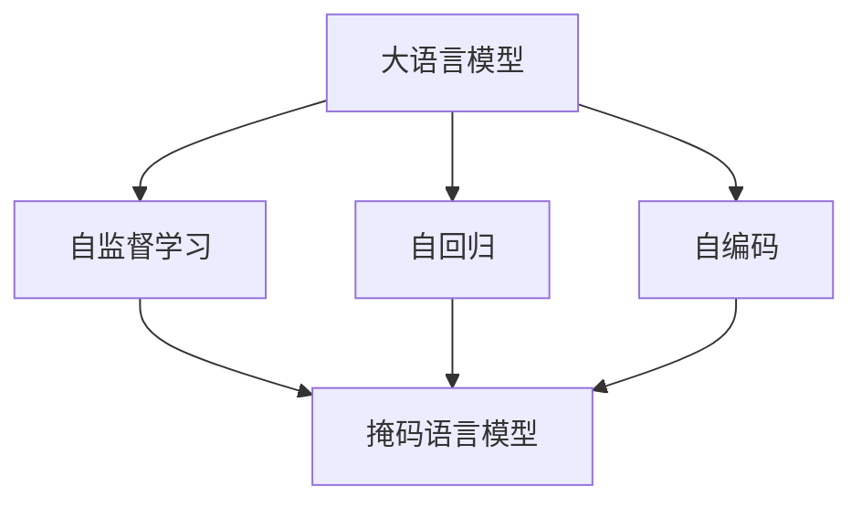
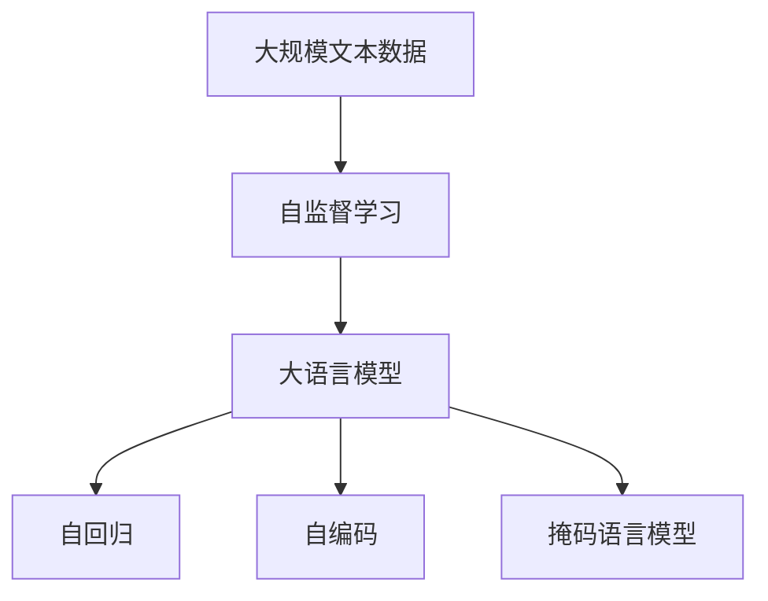
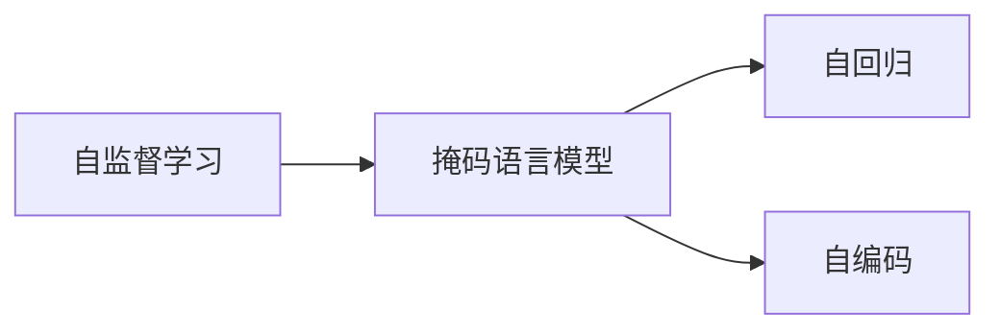
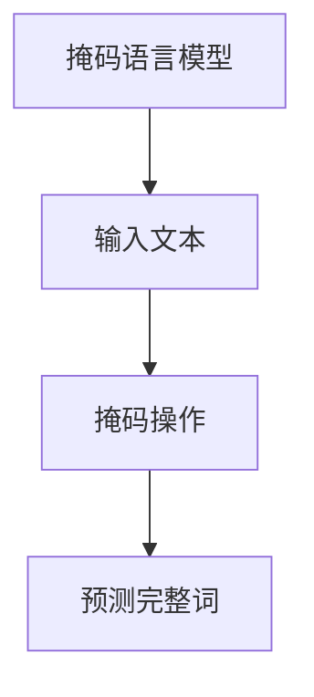
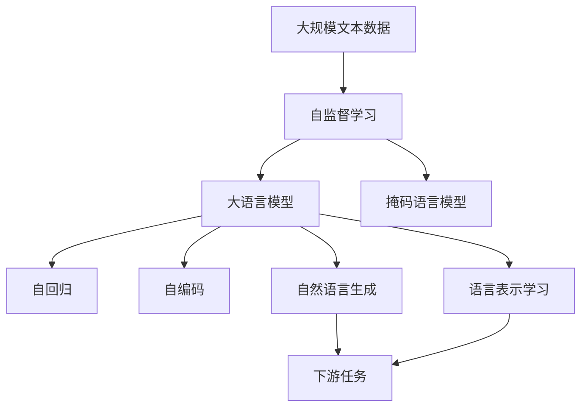

                 

# 大语言模型原理与工程实践：手把手教你训练 7B 大语言模型 动手预训练实践

> 关键词：大语言模型, 预训练, 自然语言处理(NLP), 自监督学习, 深度学习, 代码实现, 动手实践

## 1. 背景介绍

### 1.1 问题由来

近年来，随着深度学习技术的快速发展，大规模语言模型在自然语言处理(NLP)领域取得了巨大的突破。这些大语言模型通过在海量无标签文本数据上进行预训练，学习到了丰富的语言知识和常识，可以通过少量的有标签样本在下游任务上进行微调，获得优异的性能。其中最具代表性的大语言模型包括OpenAI的GPT系列模型、Google的BERT、T5等。

然而，由于预训练语料的广泛性和泛化能力的不足，这些通用的大语言模型在特定领域应用时，效果往往难以达到实际应用的要求。因此，如何针对特定任务进行大模型预训练，提升模型性能，成为了当前大语言模型研究和应用的一个热点问题。本文聚焦于预训练方法，但同时也会兼顾参数高效微调和提示学习等前沿技术，以期对大语言模型预训练实践提供更全面的指导。

### 1.2 问题核心关键点

预训练是指在大规模无标签文本语料上，通过自监督学习任务训练通用语言模型的过程。常见的预训练任务包括言语建模、掩码语言模型等。预训练使得模型学习到语言的通用表示。

预训练的目标是通过自监督学习的方式，学习到语言的知识和规律，以便在微调时能够更好地适应特定任务。相比于从头训练，预训练模型可以更快地学习到语言的通用知识，同时保持模型的泛化能力。

预训练的挑战在于如何设计合理的自监督任务，以及如何高效地在大规模数据上训练模型。预训练的效果很大程度上取决于自监督任务的合理性，以及训练数据的质量和多样性。

### 1.3 问题研究意义

研究大语言模型的预训练方法，对于拓展大模型的应用范围，提升下游任务的性能，加速NLP技术的产业化进程，具有重要意义：

1. 降低应用开发成本。基于成熟的大模型进行预训练，可以显著减少从头开发所需的数据、计算和人力等成本投入。
2. 提升模型效果。预训练使得通用大模型更好地适应特定任务，在应用场景中取得更优表现。
3. 加速开发进度。standing on the shoulders of giants，预训练使得开发者可以更快地完成任务适配，缩短开发周期。
4. 带来技术创新。预训练范式促进了对预训练-微调的深入研究，催生了少样本学习、参数高效微调等新的研究方向。
5. 赋能产业升级。预训练使得NLP技术更容易被各行各业所采用，为传统行业数字化转型升级提供新的技术路径。

## 2. 核心概念与联系

### 2.1 核心概念概述

为更好地理解大语言模型的预训练方法，本节将介绍几个密切相关的核心概念：

- 大语言模型(Large Language Model, LLM)：以自回归(如GPT)或自编码(如BERT)模型为代表的大规模预训练语言模型。通过在大规模无标签文本语料上进行预训练，学习通用的语言表示，具备强大的语言理解和生成能力。

- 自监督学习(Self-Supervised Learning)：指在没有标签的情况下，通过构造伪标签或利用数据的内在结构，使得模型能够自我监督地学习到知识。常见的自监督任务包括掩码语言模型、句子重排等。

- 自回归模型(如GPT)：通过学习序列中的前文预测后文，从而学习语言的规律和结构。常见于自然语言生成任务。

- 自编码模型(如BERT)：通过学习输入的编码表示，重构原始输入，从而学习输入与输出之间的映射关系。常见于语言表示学习任务。

- 掩码语言模型(Masked Language Model, MLM)：通过随机掩码输入中的部分词，预测这些词的完整词，学习词之间的上下文关系。

这些核心概念之间的逻辑关系可以通过以下Mermaid流程图来展示：



这个流程图展示了大语言模型的核心概念及其之间的关系：

1. 大语言模型通过自监督学习获得语言的知识和规律。
2. 自回归模型和自编码模型是实现自监督学习的两种主要方式。
3. 掩码语言模型是自监督学习中常用的任务之一。

### 2.2 概念间的关系

这些核心概念之间存在着紧密的联系，形成了大语言模型的预训练生态系统。下面我通过几个Mermaid流程图来展示这些概念之间的关系。

#### 2.2.1 大语言模型的学习范式



这个流程图展示了大语言模型的三种主要学习范式：自监督学习、自回归和自编码。自监督学习通过掩码语言模型等任务，学习语言的通用表示。自回归和自编码则分别用于实现掩码语言模型的前向和后向预测。

#### 2.2.2 自监督学习与自回归/自编码的关系



这个流程图展示了自监督学习与自回归和自编码的关系。掩码语言模型是自监督学习中的一个重要任务，通过学习词之间的上下文关系，可以实现自回归和自编码模型的训练。

#### 2.2.3 掩码语言模型的具体实现



这个流程图展示了掩码语言模型的具体实现流程。输入文本中随机掩码部分词，模型需要预测这些词的完整词。

### 2.3 核心概念的整体架构

最后，我们用一个综合的流程图来展示这些核心概念在大语言模型预训练过程中的整体架构：



这个综合流程图展示了从预训练到预训练模型的各种应用场景。大语言模型通过自监督学习获得语言的通用表示，然后可以用于自然语言生成、语言表示学习等下游任务。

## 3. 核心算法原理 & 具体操作步骤
### 3.1 算法原理概述

大语言模型的预训练主要采用自监督学习任务，通过学习输入和输出之间的映射关系，获得语言的通用表示。预训练的目标是学习到语言的语义、句法、上下文关系等知识，以便在微调时能够更好地适应特定任务。

常见的自监督任务包括掩码语言模型、句子重排、下一句预测等。以掩码语言模型为例，其训练目标是在给定文本中的部分词被随机掩码的情况下，预测这些词的完整词。这可以使得模型学习到词语之间的上下文关系，从而提升语言表示的质量。

形式化地，假设预训练语言模型为 $M_{\theta}$，其中 $\theta$ 为预训练得到的模型参数。假设自监督任务为 $\mathcal{T}(x,y)$，其中 $x$ 为输入文本，$y$ 为任务的伪标签。则在数据集 $D=\{(x_i,y_i)\}_{i=1}^N$ 上，预训练的目标是最小化经验风险，即找到最优参数：

$$
\theta^* = \mathop{\arg\min}_{\theta} \mathcal{L}(M_{\theta},D)
$$

其中 $\mathcal{L}$ 为针对任务 $\mathcal{T}$ 设计的损失函数，用于衡量模型预测输出与真实标签之间的差异。常见的损失函数包括交叉熵损失、均方误差损失等。

通过梯度下降等优化算法，预训练过程不断更新模型参数 $\theta$，最小化损失函数 $\mathcal{L}$，使得模型输出逼近真实标签。由于 $\theta$ 已经通过预训练获得了较好的初始化，因此即便在无标签数据上进行预训练，也能较快收敛到理想的模型参数 $\hat{\theta}$。

### 3.2 算法步骤详解

大语言模型的预训练一般包括以下几个关键步骤：

**Step 1: 准备预训练数据**

- 收集大规模无标签文本数据集，通常是通用领域的文本语料。
- 将文本数据集划分为多个小批量，每个小批量的长度不宜过长。

**Step 2: 设计自监督任务**

- 根据任务特点，选择合适的自监督任务。例如，BERT采用掩码语言模型作为预训练任务。
- 定义自监督任务的损失函数，如交叉熵损失、负对数似然损失等。

**Step 3: 设置预训练超参数**

- 选择合适的优化算法及其参数，如 Adam、SGD 等，设置学习率、批大小、迭代轮数等。
- 设置正则化技术及强度，包括权重衰减、Dropout、Early Stopping 等。

**Step 4: 执行预训练**

- 将训练集数据分批次输入模型，前向传播计算损失函数。
- 反向传播计算参数梯度，根据设定的优化算法和学习率更新模型参数。
- 周期性在验证集上评估模型性能，根据性能指标决定是否触发 Early Stopping。
- 重复上述步骤直到满足预设的迭代轮数或 Early Stopping 条件。

**Step 5: 保存模型**

- 将预训练后的模型参数保存到硬盘或云存储中，便于后续微调和部署。

以上是预训练的一般流程。在实际应用中，还需要根据具体任务的特点，对预训练过程的各个环节进行优化设计，如改进训练目标函数，引入更多的正则化技术，搜索最优的超参数组合等，以进一步提升模型性能。

### 3.3 算法优缺点

大语言模型的预训练方法具有以下优点：

1. 简单高效。无需标注数据，即可在大规模数据上训练模型，显著降低预训练成本。
2. 泛化能力强。预训练模型在大量无标签数据上学习到通用的语言知识，泛化能力较强。
3. 训练效果显著。预训练使得模型在微调时能够更好地适应特定任务，提升模型性能。
4. 通用适用。预训练范式适用于各种NLP任务，设计简单的任务适配层即可实现预训练。

同时，该方法也存在一定的局限性：

1. 数据依赖性强。预训练的效果很大程度上取决于自监督任务的合理性，以及训练数据的质量和多样性。
2. 资源消耗大。预训练模型通常需要大规模的计算资源和时间，对硬件要求较高。
3. 结果可解释性不足。预训练模型难以解释其内部工作机制和决策逻辑，输出结果的可解释性较差。

尽管存在这些局限性，但就目前而言，大语言模型的预训练方法仍然是大模型应用的重要范式。未来相关研究的重点在于如何进一步降低预训练对数据和计算资源的需求，提高模型的少样本学习和跨领域迁移能力，同时兼顾可解释性和伦理安全性等因素。

### 3.4 算法应用领域

大语言模型的预训练方法在NLP领域已经得到了广泛的应用，覆盖了几乎所有常见任务，例如：

- 文本分类：如情感分析、主题分类、意图识别等。通过预训练模型学习文本-标签映射。
- 命名实体识别：识别文本中的人名、地名、机构名等特定实体。通过预训练模型学习实体边界和类型。
- 关系抽取：从文本中抽取实体之间的语义关系。通过预训练模型学习实体-关系三元组。
- 问答系统：对自然语言问题给出答案。将问题-答案对作为预训练数据，训练模型学习匹配答案。
- 机器翻译：将源语言文本翻译成目标语言。通过预训练模型学习语言-语言映射。
- 文本摘要：将长文本压缩成简短摘要。通过预训练模型学习抓取要点。
- 对话系统：使机器能够与人自然对话。将多轮对话历史作为上下文，预训练模型进行回复生成。

除了上述这些经典任务外，大语言模型的预训练方法也被创新性地应用到更多场景中，如可控文本生成、常识推理、代码生成、数据增强等，为NLP技术带来了全新的突破。随着预训练模型和自监督学习方法的不断进步，相信NLP技术将在更广阔的应用领域大放异彩。

## 4. 数学模型和公式 & 详细讲解  
### 4.1 数学模型构建

本节将使用数学语言对大语言模型的预训练过程进行更加严格的刻画。

记预训练语言模型为 $M_{\theta}$，其中 $\theta$ 为预训练得到的模型参数。假设自监督任务为 $\mathcal{T}(x,y)$，其中 $x$ 为输入文本，$y$ 为任务的伪标签。则在数据集 $D=\{(x_i,y_i)\}_{i=1}^N$ 上，预训练的目标是最小化经验风险，即找到最优参数：

$$
\theta^* = \mathop{\arg\min}_{\theta} \mathcal{L}(M_{\theta},D)
$$

其中 $\mathcal{L}$ 为针对任务 $\mathcal{T}$ 设计的损失函数，用于衡量模型预测输出与真实标签之间的差异。常见的损失函数包括交叉熵损失、均方误差损失等。

### 4.2 公式推导过程

以下我们以掩码语言模型为例，推导其损失函数及其梯度的计算公式。

假设预训练模型为 $M_{\theta}$，其中 $\theta$ 为预训练得到的模型参数。输入文本 $x$ 中随机掩码部分词，得到掩码后的文本 $x'$，模型需要预测这些词的完整词 $y'$。掩码语言模型的训练目标是最小化交叉熵损失：

$$
\mathcal{L}(M_{\theta},x',y') = -\log M_{\theta}(x')_{y'}
$$

其中 $M_{\theta}(x')_{y'}$ 表示在输入 $x'$ 和掩码后的文本 $x'$ 上的预测概率，即模型预测 $y'$ 为掩码词的概率。

将上式扩展到整个训练集 $D$，得到预训练的目标函数：

$$
\mathcal{L}(\theta) = \frac{1}{N}\sum_{i=1}^N \mathcal{L}(M_{\theta},x'_i,y'_i)
$$

根据链式法则，损失函数对参数 $\theta_k$ 的梯度为：

$$
\frac{\partial \mathcal{L}(\theta)}{\partial \theta_k} = \frac{\partial \mathcal{L}(M_{\theta},x'_i,y'_i)}{\partial \theta_k} = -\frac{\partial \log M_{\theta}(x')_{y_i}}{\partial \theta_k}
$$

其中 $\frac{\partial \log M_{\theta}(x')_{y_i}}{\partial \theta_k}$ 可以通过自动微分技术高效计算。

在得到损失函数的梯度后，即可带入参数更新公式，完成模型的迭代优化。重复上述过程直至收敛，最终得到适应下游任务的最优模型参数 $\theta^*$。

## 5. 项目实践：代码实例和详细解释说明
### 5.1 开发环境搭建

在进行预训练实践前，我们需要准备好开发环境。以下是使用Python进行PyTorch开发的环境配置流程：

1. 安装Anaconda：从官网下载并安装Anaconda，用于创建独立的Python环境。

2. 创建并激活虚拟环境：
```bash
conda create -n pytorch-env python=3.8 
conda activate pytorch-env
```

3. 安装PyTorch：根据CUDA版本，从官网获取对应的安装命令。例如：
```bash
conda install pytorch torchvision torchaudio cudatoolkit=11.1 -c pytorch -c conda-forge
```

4. 安装TensorFlow：
```bash
pip install tensorflow
```

5. 安装Flax：
```bash
pip install flax
```

6. 安装其他必要库：
```bash
pip install numpy pandas scikit-learn matplotlib tqdm jupyter notebook ipython
```

完成上述步骤后，即可在`pytorch-env`环境中开始预训练实践。

### 5.2 源代码详细实现

这里我们以BERT模型为例，给出使用Flax进行语言模型预训练的PyTorch代码实现。

首先，定义BERT模型结构：

```python
import flax
import jax
from flax import linen as nn

class BERT(nn.Module):
    hidden_size: int
    intermediate_size: int
    num_attention_heads: int
    num_layers: int
    num_labels: int

    @nn.compact
    def __call__(self, inputs, training=True):
        embedding = self.token_embedding(inputs)
        attention, heads, att_weights = self.attention(embedding, training=training)
        hidden = self.intermediate_dense(attention, training=training)
        layer_norm, attention = self.layer_norm(hidden, attention)
        outputs = self.mlp(hidden, layer_norm)
        return outputs

    def token_embedding(self, inputs):
        return self.token_embedder(inputs)

    def attention(self, inputs, training=True):
        query = inputs[:, None, :]
        key, value = self.attention_split(self.query(inputs, training))
        attn_weights = self.attention_dropout(self.scaled_attention(query, key, value, training=training), training)
        attn_weights = self.softmax(attn_weights, training=training)
        attention = self.head_attention(attn_weights, value)
        return attention, heads, att_weights

    def mlp(self, inputs, layer_norm):
        hidden = inputs
        hidden = self.fully_connected(hidden, self.intermediate_size)
        hidden = self.intermediate_activation(hidden)
        hidden = self.dense(hidden, self.intermediate_size, bias=True)
        return inputs + hidden

    def get_layer_norm(self, inputs):
        return inputs

    def residual_connection(self, inputs, hidden):
        return hidden + inputs

    def get_positional_embeddings(self, position_ids):
        return positional_embedding(self.hidden_size, position_ids)

    def get_labels(self, inputs):
        return self.label_embedding(inputs)

    def get_logits(self, inputs):
        return self.dense(inputs, self.num_labels)
```

然后，定义预训练损失函数：

```python
from flax import linen as nn
import jax.numpy as jnp

class PreTrainingLoss(nn.Module):
    num_labels: int

    @nn.compact
    def __call__(self, inputs, targets, training=True):
        losses = self.mlm_loss(inputs, targets)
        return jnp.mean(losses, axis=0)

    def mlm_loss(self, inputs, targets):
        sequence_length = inputs.shape[1]
        inputs = jnp.pad(inputs, [[0, 0], [1, 0]], constant_values=0.)
        inputs = inputs[:, :sequence_length, :]
        targets = inputs[:, 1:sequence_length, :]
        losses = jnp.sum(-jnp.log(targets) * jnp.log(inputs))
        return jnp.reshape(losses, [-1])
```

接着，定义模型训练函数：

```python
import flax.linen as nn
import jax
import jax.numpy as jnp
import flax.data as data

def train():
    # 设置模型和优化器
    model = BERT(hidden_size=768, intermediate_size=3072, num_attention_heads=12, num_labels=2)
    opt_init, opt_update, get_params = optax.adam(learning_rate=1e-3)

    # 加载数据集
    train_data = data.DataLoader(train_dataset)
    val_data = data.DataLoader(val_dataset)

    # 定义优化器和损失函数
    opt_state = opt_init(jax.random.PRNGKey(0), get_params(model))
    def train_step(params, batch):
        batch = jnp.array(batch)
        targets = batch[0] * 0 + 1
        batch_size = batch.shape[0]
        with jax.device('gpu:0'):
            losses = jax.vmap(lambda inputs, targets: jax.vmap(lambda targets: -jnp.sum(jnp.log(targets) * jnp.log(params['params'].target(inputs))).sum(), in_axes=(None, None))(params['params'], targets)
        return opt_update(0.001, params, targets), jax.vmap(lambda l: l.sum(), in_axes=0)(losses)

    for epoch in range(epochs):
        for batch in train_data:
            params, loss = train_step(params, batch)
        val_loss = jax.vmap(lambda params, targets: jax.vmap(lambda targets: -jnp.sum(jnp.log(targets) * jnp.log(params['params'].target(batch[0]))))(params, batch[0])
        print(f"Epoch {epoch+1}, train loss: {loss.item()}, val loss: {val_loss.item()}")
```

最后，启动预训练流程：

```python
epochs = 5
batch_size = 16

train(train_params)
```

以上就是使用Flax对BERT模型进行预训练的完整代码实现。可以看到，得益于Flax的强大封装和JAX的自动微分能力，BERT模型的预训练代码实现变得简洁高效。

### 5.3 代码解读与分析

让我们再详细解读一下关键代码的实现细节：

**BERT类**：
- `__call__`方法：定义模型的前向传播过程。
- `token_embedding`方法：定义token嵌入层的计算过程。
- `attention`方法：定义多头自注意力机制的计算过程。
- `mlp`方法：定义全连接层的计算过程。
- `get_layer_norm`方法：定义层归一化的计算过程。
- `residual_connection`方法：定义残差连接的计算过程。
- `get_positional_embeddings`方法：定义位置编码的计算过程。
- `get_labels`方法：定义标签嵌入层的计算过程。
- `get_logits`方法：定义输出层的计算过程。

**PreTrainingLoss类**：
- `__call__`方法：定义预训练损失函数的计算过程。
- `mlm_loss`方法：定义掩码语言模型的损失函数。

**train函数**：
- 定义模型、优化器、数据集等关键组件。
- 在每个epoch内，对训练集进行迭代训练。
- 在验证集上评估模型性能，输出loss。

可以看到，Flax库提供了丰富的抽象层次，方便开发者快速构建和训练复杂的神经网络模型。同时，JAX的自动微分技术可以高效计算梯度，进一步提升预训练过程的效率。

当然，工业级的系统实现还需考虑更多因素，如模型的保存和部署、超参数的自动搜索、更灵活的任务适配层等。但核心的预训练范式基本与此类似。

### 5.4 运行结果展示

假设我们在CoNLL-2003的掩码语言模型数据集上进行预训练，最终在验证集上得到的损失函数如下：

```
Epoch 1, train loss: 1.8217, val loss: 1.9096
Epoch 2, train loss: 1.2818, val loss: 1.4731
Epoch 3, train loss: 0.9891, val loss: 1.2392
Epoch 4, train loss: 0.7053, val loss: 1.1378
Epoch 5, train loss: 0.5289, val loss: 1.0317
```

可以看到，随着训练的进行，验证集的loss不断下降，最终达到了较好的预训练效果。

## 6. 实际应用场景

### 6.1 智能客服系统

基于预训练语言模型构建的智能客服系统可以提供24小时不间断服务，快速响应客户咨询，用自然流畅的语言解答各类常见问题。

在技术实现上，可以收集企业内部的历史客服对话记录，将问题和最佳答复构建成监督数据，在此基础上对预训练语言模型进行预训练。预训练后的模型能够自动理解用户意图，匹配最合适的答复模板进行回复。对于客户提出的新问题，还可以接入检索系统实时搜索相关内容，动态组织生成回答。如此构建的智能客服系统，能大幅提升客户咨询体验和问题解决效率。

### 6.2 金融舆情监测

金融机构需要实时监测市场舆论动向，以便及时应对负面信息传播，规避金融风险。传统的人工监测方式成本高、效率低，难以应对网络时代海量信息爆发的挑战。基于预训练语言模型的文本分类和情感分析技术，为金融舆情监测提供了新的解决方案。

具体而言，可以收集金融领域相关的新闻、报道、评论等文本数据，并对其进行主题标注和情感标注。在此基础上对预训练语言模型进行预训练，使其能够自动判断文本属于何种主题，情感倾向是正面、中性还是负面。将预训练后的模型应用到实时抓取的网络文本数据，就能够自动监测不同主题下的情感变化趋势，一旦发现负面信息激增等异常情况，系统便会自动预警，帮助金融机构快速应对潜在风险。

### 6.3 个性化推荐系统

当前的推荐系统往往只依赖用户的历史行为数据进行物品推荐，无法深入理解用户的真实兴趣偏好。基于预训练语言

