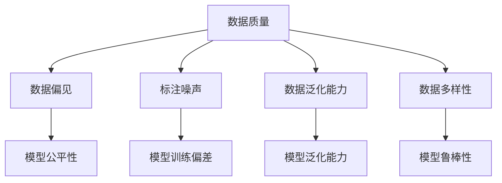
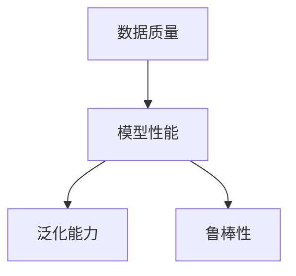
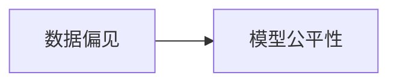
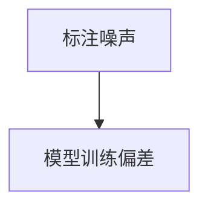
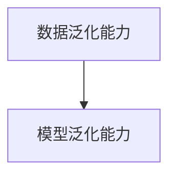
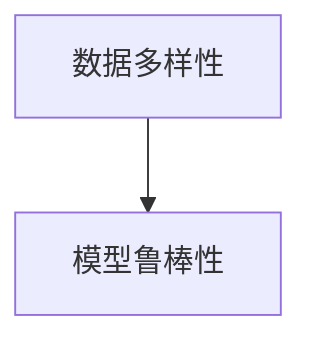
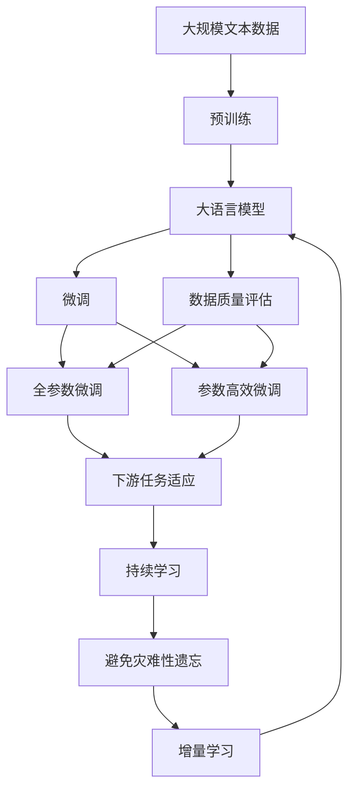

                 

# 大语言模型原理与工程实践：数据质量评估的挑战

## 1. 背景介绍

### 1.1 问题由来
随着深度学习技术的迅速发展，大语言模型（Large Language Models, LLMs）在自然语言处理（NLP）领域取得了显著进步。这些模型通常依赖于大规模的无标签文本数据进行预训练，学习到丰富的语言知识和表征。然而，在大规模数据收集和预训练过程中，数据质量常常成为难以忽视的挑战。数据中的噪声、偏见和误解等问题可能影响模型的泛化能力，从而在微调等下游任务中产生不良影响。

### 1.2 问题核心关键点
数据质量问题在大语言模型的微调过程中尤为关键。质量低劣的数据可能导致模型过拟合，泛化能力下降，或在某些情况下，模型会学习到数据中的偏见，产生不公正的输出。因此，在微调之前，对数据集进行严格的预处理和质量评估，确保其符合一定的标准，是至关重要的。

### 1.3 问题研究意义
研究大语言模型数据质量评估的挑战，对于提高模型性能、确保模型公平性和可靠性、减少社会和伦理问题具有重要意义：

1. **提高模型性能**：高质量的数据集有助于提升模型在下游任务中的表现，减少不必要的噪音干扰。
2. **确保模型公平性**：数据偏见可能导致模型输出不公平，评估和处理数据中的偏见是确保模型公平性的关键。
3. **减少社会和伦理问题**：数据中的有害信息或偏见可能被模型学习并传播，导致不良社会影响，评估和筛选数据有助于避免这类问题。

## 2. 核心概念与联系

### 2.1 核心概念概述

为更好地理解数据质量评估在大语言模型微调中的重要性，本节将介绍几个密切相关的核心概念：

- **数据质量（Data Quality）**：数据集的质量直接影响模型学习的效果。质量良好的数据应包含代表性强、噪声少、标注准确的特点。
- **数据偏见（Data Bias）**：数据集中的某些群体或类别样本数量过少或过少，可能导致模型学习到偏见，影响模型的公平性。
- **标注噪声（Label Noise）**：数据标注中存在的错误、不一致或不准确的情况，可能导致模型训练偏差。
- **数据泛化能力（Data Generalization）**：模型在不同数据分布上的表现能力，好的数据质量能够提升模型的泛化能力。
- **数据多样性（Data Diversity）**：数据集的多样性影响模型的鲁棒性和泛化能力，多样性丰富的数据集有助于模型更好地理解和处理不同的输入。

这些概念之间的逻辑关系可以通过以下Mermaid流程图来展示：



这个流程图展示了大语言模型微调过程中数据质量、数据偏见、标注噪声、数据泛化能力和数据多样性等核心概念之间的关系。

### 2.2 概念间的关系

这些核心概念之间存在着紧密的联系，形成了大语言模型微调过程中数据质量评估的完整生态系统。下面通过几个Mermaid流程图来展示这些概念之间的关系。

#### 2.2.1 数据质量与模型性能



这个流程图展示了数据质量对模型性能的影响。高质量的数据能够提升模型的泛化能力和鲁棒性，从而提高模型在下游任务中的表现。

#### 2.2.2 数据偏见与模型公平性



这个流程图展示了数据偏见对模型公平性的影响。数据偏见可能导致模型学习到不公正的特征，从而产生不公平的输出。

#### 2.2.3 标注噪声与模型训练偏差



这个流程图展示了标注噪声对模型训练偏差的影响。标注噪声可能导致模型学习到错误的特征，从而产生训练偏差。

#### 2.2.4 数据泛化能力与模型泛化能力



这个流程图展示了数据泛化能力对模型泛化能力的影响。高质量的数据集有助于提升模型的泛化能力，使其在未见过的数据上表现良好。

#### 2.2.5 数据多样性与模型鲁棒性



这个流程图展示了数据多样性对模型鲁棒性的影响。多样性丰富的数据集有助于提高模型的鲁棒性，使其在面对不同的输入时表现稳定。

### 2.3 核心概念的整体架构

最后，我们用一个综合的流程图来展示这些核心概念在大语言模型微调过程中的整体架构：



这个综合流程图展示了从预训练到微调，再到数据质量评估和持续学习的完整过程。大语言模型首先在大规模文本数据上进行预训练，然后通过微调（包括全参数微调和参数高效微调）适应下游任务。在微调过程中，数据质量评估是必不可少的环节，确保模型在质量良好的数据上训练。最后，通过持续学习技术，模型可以不断更新和适应新的任务和数据。

## 3. 核心算法原理 & 具体操作步骤
### 3.1 算法原理概述

数据质量评估在大语言模型微调中的核心目标是识别和处理数据中的质量问题，确保模型能够从高质量的数据中学习到有意义的特征。算法原理主要包括以下几个步骤：

1. **数据预处理**：包括去除无关字符、分词、停用词过滤等预处理操作。
2. **数据清洗**：移除或纠正数据中的错误、重复、不完整或不一致信息。
3. **数据标注**：确保数据标注的准确性和一致性。
4. **数据标准化**：统一数据格式和表示方式。
5. **数据分布分析**：分析数据集的分布特征，识别潜在的偏见或噪声。
6. **数据筛选**：去除不符合质量标准的样本或特征。

### 3.2 算法步骤详解

以下是数据质量评估的具体操作步骤：

**Step 1: 数据预处理**

- 去除无关字符、数字、符号等非文本信息。
- 进行分词，使用成熟的库如NLTK、spaCy或分词器如Bert Wordpiece Tokenizer。
- 过滤停用词、高频词等常见但无意义的词汇。

**Step 2: 数据清洗**

- 移除重复的、格式不一致的或缺失的数据。
- 修正数据中的拼写错误或打字错误。
- 删除不完整或不一致的标注信息。

**Step 3: 数据标注**

- 确保所有标注数据都有准确且一致的标注。
- 使用众包标注平台或人工审核工具进行标注审核。
- 对标注错误进行校正，确保标注一致性。

**Step 4: 数据标准化**

- 统一数据格式，如将文本转换为一致的编码方式。
- 统一数据结构，如将不同格式的数据转换为统一的JSON或CSV格式。

**Step 5: 数据分布分析**

- 分析数据集的分布特征，识别不同类别的样本数量是否均衡。
- 使用统计方法或可视化工具分析数据的分布特征，如直方图、箱线图等。
- 识别潜在的偏见或噪声，并采取措施进行处理。

**Step 6: 数据筛选**

- 根据预定义的质量标准，如标注准确率、文本长度、样本多样性等，筛选数据。
- 去除不符合质量标准的数据样本或特征。

### 3.3 算法优缺点

数据质量评估算法具有以下优点：

1. **提升模型性能**：高质量的数据能够减少噪音干扰，提升模型泛化能力。
2. **确保模型公平性**：识别和处理数据中的偏见，确保模型输出公平。
3. **减少标注成本**：通过预处理和清洗，减少数据中噪音和冗余信息，减少后续标注的复杂性和成本。

同时，该算法也存在一些缺点：

1. **数据处理成本高**：预处理和清洗数据可能需要大量人力和资源。
2. **数据分布变化风险**：数据分布变化可能导致已筛选数据过时或不适用。
3. **标注一致性难以保证**：标注过程可能存在误差，影响数据质量评估的准确性。

### 3.4 算法应用领域

数据质量评估在大语言模型微调中的应用非常广泛，涵盖以下领域：

- **自然语言处理（NLP）**：包括文本分类、命名实体识别、情感分析、问答系统等任务。
- **计算机视觉（CV）**：如图像分类、目标检测、图像生成等任务。
- **语音识别（ASR）**：如语音转文本、语音合成等任务。
- **推荐系统**：如用户行为分析、商品推荐等任务。

除了上述领域，数据质量评估在大数据、机器学习、知识图谱等各类应用中也有广泛应用。

## 4. 数学模型和公式 & 详细讲解  
### 4.1 数学模型构建

在大语言模型微调中，数据质量评估的数学模型构建主要集中在以下几方面：

- **数据质量指标**：如标注准确率、样本多样性、文本长度、噪声率等。
- **数据分布特征**：如类别分布、特征分布等。
- **数据筛选标准**：如符合质量标准的样本占比、最大噪声率等。

### 4.2 公式推导过程

以下我们以标注准确率为例，推导数据质量评估的数学模型：

假设数据集 $D=\{(x_i, y_i)\}_{i=1}^N$，其中 $x_i$ 为样本，$y_i$ 为标注。标注准确率定义为：

$$
\text{Accuracy} = \frac{\sum_{i=1}^N \mathbb{I}(y_i = \hat{y}_i)}{N}
$$

其中 $\mathbb{I}(y_i = \hat{y}_i)$ 为示性函数，当 $y_i = \hat{y}_i$ 时，$\mathbb{I}(y_i = \hat{y}_i) = 1$；否则为0。

将准确率公式展开，得到：

$$
\text{Accuracy} = \frac{\sum_{i=1}^N (y_i = \hat{y}_i)}{N}
$$

在数据质量评估中，我们通常需要对数据集进行多次抽样和评估，得到多个准确率值，然后计算其平均值和标准差，以获得更准确的质量评估结果。

### 4.3 案例分析与讲解

假设我们有一个包含1000个样本的数据集，其中标注准确率为85%。如果我们随机抽取100个样本进行评估，得到标注准确率为82%。此时，我们应考虑两种可能的原因：

- 数据集的标注存在一定的噪声，导致部分样本的标注错误。
- 抽取的样本本身存在偏差，不能代表整个数据集的标注质量。

为了更准确地评估数据质量，我们可以进行多次抽样和评估，然后计算所有评估结果的平均值和标准差。如果多次评估的结果一致，则数据集的标注质量较高；反之，则需进一步清洗和筛选数据。

## 5. 项目实践：代码实例和详细解释说明
### 5.1 开发环境搭建

在进行数据质量评估实践前，我们需要准备好开发环境。以下是使用Python进行PyTorch开发的环境配置流程：

1. 安装Anaconda：从官网下载并安装Anaconda，用于创建独立的Python环境。

2. 创建并激活虚拟环境：
```bash
conda create -n pytorch-env python=3.8 
conda activate pytorch-env
```

3. 安装PyTorch：根据CUDA版本，从官网获取对应的安装命令。例如：
```bash
conda install pytorch torchvision torchaudio cudatoolkit=11.1 -c pytorch -c conda-forge
```

4. 安装Transformer库：
```bash
pip install transformers
```

5. 安装各类工具包：
```bash
pip install numpy pandas scikit-learn matplotlib tqdm jupyter notebook ipython
```

完成上述步骤后，即可在`pytorch-env`环境中开始数据质量评估实践。

### 5.2 源代码详细实现

下面我们以文本分类任务为例，给出使用Transformers库进行数据质量评估的PyTorch代码实现。

首先，定义数据处理函数：

```python
from transformers import BertTokenizer
from torch.utils.data import Dataset
import torch

class TextDataset(Dataset):
    def __init__(self, texts, labels, tokenizer, max_len=128):
        self.texts = texts
        self.labels = labels
        self.tokenizer = tokenizer
        self.max_len = max_len
        
    def __len__(self):
        return len(self.texts)
    
    def __getitem__(self, item):
        text = self.texts[item]
        label = self.labels[item]
        
        encoding = self.tokenizer(text, return_tensors='pt', max_length=self.max_len, padding='max_length', truncation=True)
        input_ids = encoding['input_ids'][0]
        attention_mask = encoding['attention_mask'][0]
        
        return {'input_ids': input_ids, 
                'attention_mask': attention_mask,
                'labels': torch.tensor(label, dtype=torch.long)}
```

然后，定义评估函数：

```python
from transformers import BertForTokenClassification, AdamW
from sklearn.metrics import accuracy_score

model = BertForTokenClassification.from_pretrained('bert-base-cased', num_labels=2)

optimizer = AdamW(model.parameters(), lr=2e-5)

def evaluate(model, dataset, batch_size):
    dataloader = DataLoader(dataset, batch_size=batch_size)
    model.eval()
    preds, labels = [], []
    with torch.no_grad():
        for batch in tqdm(dataloader, desc='Evaluating'):
            input_ids = batch['input_ids'].to(device)
            attention_mask = batch['attention_mask'].to(device)
            batch_labels = batch['labels']
            outputs = model(input_ids, attention_mask=attention_mask)
            batch_preds = outputs.logits.argmax(dim=2).to('cpu').tolist()
            batch_labels = batch_labels.to('cpu').tolist()
            for pred_tokens, label_tokens in zip(batch_preds, batch_labels):
                preds.append(pred_tokens[:len(label_tokens)])
                labels.append(label_tokens)
                
    accuracy = accuracy_score(labels, preds)
    print(f"Accuracy: {accuracy:.3f}")
```

最后，启动评估流程：

```python
accuracy = evaluate(model, test_dataset, batch_size=16)
```

### 5.3 代码解读与分析

让我们再详细解读一下关键代码的实现细节：

**TextDataset类**：
- `__init__`方法：初始化文本、标签、分词器等关键组件。
- `__len__`方法：返回数据集的样本数量。
- `__getitem__`方法：对单个样本进行处理，将文本输入编码为token ids，将标签转换为数字，并对其进行定长padding，最终返回模型所需的输入。

**evaluate函数**：
- 使用PyTorch的DataLoader对数据集进行批次化加载，供模型评估使用。
- 模型设为评估模式，不更新参数。
- 在每个批次上前向传播计算损失函数，并返回预测结果。
- 将所有预测结果和真实标签存储下来，并在评估结束时计算准确率。

**评估流程**：
- 在测试集上对微调后的模型进行评估，输出准确率。

可以看到，在数据质量评估的实践中，我们也使用了PyTorch进行模型加载和评估，这与微调任务的实现类似。不同的只是不再更新模型参数，而是专注于评估模型的泛化能力和标注准确性。

## 6. 实际应用场景
### 6.1 智能客服系统

在大规模客服数据集上，数据质量评估对于构建智能客服系统至关重要。智能客服系统需要处理大量的客户咨询，并能够快速准确地响应客户需求。数据质量评估可以确保数据集中的噪音和偏见得到有效处理，提升系统的准确性和鲁棒性。

在实践中，我们可以使用数据质量评估工具对客服数据进行清洗和筛选，去除不相关、不完整或重复的记录。同时，通过标注准确率、样本多样性等指标评估数据质量，确保客户咨询能够被准确理解并快速响应。

### 6.2 金融舆情监测

在金融领域，舆情监测系统需要实时分析和评估大量的市场信息和新闻报道，以快速识别潜在的风险和机会。数据质量评估可以帮助系统识别和处理数据中的噪声和偏见，确保系统的输出准确性。

在金融舆情监测中，我们可以使用数据质量评估工具对新闻报道和市场信息进行清洗和筛选，去除不相关、不完整或重复的内容。同时，通过标注准确率、样本多样性等指标评估数据质量，确保舆情分析的准确性和及时性。

### 6.3 个性化推荐系统

个性化推荐系统需要处理大量的用户行为数据，并通过这些数据推荐用户可能感兴趣的商品或内容。数据质量评估可以确保用户行为数据的准确性和代表性，提升推荐系统的个性化程度。

在实践中，我们可以使用数据质量评估工具对用户行为数据进行清洗和筛选，去除不相关、不完整或重复的记录。同时，通过标注准确率、样本多样性等指标评估数据质量，确保推荐系统能够准确理解用户需求，并推荐符合用户偏好的商品或内容。

### 6.4 未来应用展望

随着大语言模型微调技术的发展，数据质量评估的应用也将更加广泛和深入。未来，数据质量评估将在以下方面得到更广泛的应用：

- **自动化数据清洗**：通过机器学习算法自动识别和处理数据中的噪声和偏见，减少人工干预。
- **实时数据监测**：在数据生成和处理过程中实时监测数据质量，确保数据集的稳定性和一致性。
- **跨领域数据融合**：在跨领域数据融合过程中，评估和处理数据中的偏见和噪音，确保不同数据源的统一性和一致性。
- **数据分布监控**：对数据集的分布特征进行实时监控，识别潜在的数据漂移和变化，确保模型在不同数据分布上的表现一致性。

## 7. 工具和资源推荐
### 7.1 学习资源推荐

为了帮助开发者系统掌握数据质量评估的理论基础和实践技巧，这里推荐一些优质的学习资源：

1. 《数据清洗与预处理》系列博文：详细介绍了数据清洗和预处理的技术细节和最佳实践。
2. 《Python数据清洗实战》书籍：深入浅出地介绍了Python数据清洗和预处理的技术和工具。
3. 《数据科学导论》课程：由Coursera提供，涵盖了数据清洗、数据处理和数据质量评估的基本概念和技巧。
4. 《数据挖掘与统计学习》书籍：介绍了数据清洗、数据预处理和数据质量评估的方法和应用。
5. Kaggle竞赛：通过参与数据清洗和预处理竞赛，提高数据处理和评估技能。

通过对这些资源的学习实践，相信你一定能够快速掌握数据质量评估的精髓，并用于解决实际的NLP问题。

### 7.2 开发工具推荐

高效的数据质量评估离不开优秀的工具支持。以下是几款用于数据质量评估开发的常用工具：

1. OpenRefine：一个强大的数据清洗和预处理工具，支持批处理和交互式操作。
2. Data Wrangler：一个基于Web的数据清洗和预处理工具，支持可视化界面和自动化操作。
3. Pandas：Python中常用的数据处理库，支持数据清洗、数据转换和数据筛选等操作。
4. NumPy：Python中常用的数值计算库，支持高效的数值计算和数据处理。
5. Scikit-learn：Python中常用的机器学习库，支持数据分布分析和特征选择等操作。
6. TensorBoard：TensorFlow配套的可视化工具，可以实时监测数据集分布和特征。

合理利用这些工具，可以显著提升数据质量评估的效率和效果，提高数据集的质量，从而提升后续模型的性能。

### 7.3 相关论文推荐

数据质量评估在大语言模型微调中的研究源于学界的持续研究。以下是几篇奠基性的相关论文，推荐阅读：

1. "Data Cleaning Techniques and Tools" by M. Zhang et al.：介绍了数据清洗和预处理的基本技术和工具。
2. "A Survey on Data Cleaning Techniques" by X. He et al.：综述了数据清洗和预处理的技术和应用。
3. "Automatic Data Cleaning and Quality Assessment" by R. André et al.：介绍了自动数据清洗和质量评估的方法和工具。
4. "Data Quality Assessment in Big Data" by Y. Gu et al.：综述了大数据环境下数据质量评估的技术和方法。
5. "Machine Learning for Data Quality" by T. Petrucci et al.：介绍了机器学习在数据质量评估中的应用。

这些论文代表了大数据清洗和预处理的研究方向，可以帮助研究者把握学科前进方向，激发更多的创新灵感。

除上述资源外，还有一些值得关注的前沿资源，帮助开发者紧跟数据质量评估技术的最新进展，例如：

1. arXiv论文预印本：人工智能领域最新研究成果的发布平台，包括大量尚未发表的前沿工作，学习前沿技术的必读资源。
2. 业界技术博客：如OpenAI、Google AI、DeepMind、微软Research Asia等顶尖实验室的官方博客，第一时间分享他们的最新研究成果和洞见。
3. 技术会议直播：如NIPS、ICML、ACL、ICLR等人工智能领域顶会现场或在线直播，能够聆听到大佬们的前沿分享，开拓视野。
4. GitHub热门项目：在GitHub上Star、Fork数最多的数据清洗和预处理相关项目，往往代表了该技术领域的发展趋势和最佳实践，值得去学习和贡献。
5. 行业分析报告：各大咨询公司如McKinsey、PwC等针对大数据清洗和预处理行业的分析报告，有助于从商业视角审视技术趋势，把握应用价值。

总之，对于数据质量评估的研究和学习，需要开发者保持开放的心态和持续学习的意愿。多关注前沿资讯，多动手实践，多思考总结，必将收获满满的成长收益。

## 8. 总结：未来发展趋势与挑战
### 8.1 总结

本文对数据质量评估在大语言模型微调中的重要性进行了全面系统的介绍。首先阐述了数据质量评估在大语言模型微调中的核心挑战，明确了数据质量对模型性能和公平性的影响。其次，从原理到实践，详细讲解了数据质量评估的数学模型和操作步骤，给出了数据质量评估的代码实例。同时，本文还探讨了数据质量评估在大规模智能应用中的实际应用场景，展示了其在不同领域中的广泛应用潜力。

通过本文的系统梳理，可以看到，数据质量评估是大语言模型微调中不可或缺的一部分。高质量的数据集能够提升模型的泛化能力和鲁棒性，确保模型输出公正、准确。然而，在数据质量评估过程中也面临着数据处理成本高、标注一致性难以保证等挑战。只有通过不断优化数据处理和评估流程，才能有效提升模型性能，确保模型公平性和可靠性。

### 8.2 未来发展趋势

展望未来，数据质量评估技术将呈现以下几个发展趋势：

1. **自动化数据清洗**：通过机器学习算法自动识别和处理数据中的噪声和偏见，减少人工干预。
2. **实时数据监测**：在数据生成和处理过程中实时监测数据质量，确保数据集的稳定性和一致性。
3. **跨领域数据融合**：在跨领域数据融合过程中，评估和处理数据中的偏见和噪音，确保不同数据源的统一性和一致性。
4. **数据分布监控**：对数据集的分布特征进行实时监控，识别潜在的数据漂移和变化，确保模型在不同数据分布上的表现一致性。
5. **数据质量可视化**：通过可视化工具展示数据集的质量指标和分布特征，帮助数据科学家进行数据分析和决策。

以上趋势凸显了数据质量评估技术的重要性，未来将会在各个领域得到广泛应用，为大数据分析和处理提供坚实的技术保障。

### 8.3 面临的挑战

尽管数据质量评估技术在实践中已取得一定成效，但在迈向更加智能化、普适化应用的过程中，仍面临诸多挑战：

1. **数据处理成本高**：数据清洗和预处理需要大量人力和资源，处理复杂数据集的成本较高。
2. **标注一致性难以保证**：标注过程中可能存在误差，影响数据质量评估的准确性。
3. **数据分布变化风险**：数据分布变化可能导致已筛选数据过时或不适用。
4. **数据质量和业务需求不一致**：数据质量和业务需求之间可能存在矛盾，如何平衡数据质量和业务需求是一个重要问题。
5. **数据隐私和安全问题**：在数据处理过程中，需要保护数据隐私和安全，避免数据泄露和滥用。

这些挑战需要数据科学家和工程师不断探索和解决，才能有效提升数据质量评估的准确性和可靠性。

### 8.4 研究展望

面对数据质量评估所面临的挑战，未来的研究需要在以下几个方面寻求新的突破：

1. **自动数据清洗技术**：开发更加自动化和高效的数据清洗算法，降低人工干预成本，提高数据处理效率。
2. **数据分布监控技术**：研究数据分布监控和预警技术，

