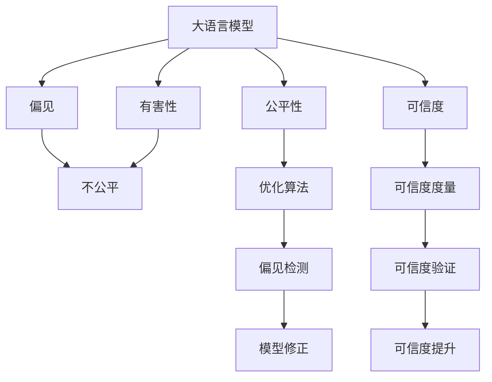

                 

# 大语言模型原理基础与前沿 减少偏见和有害性

> 关键词：
1. 大语言模型（Large Language Model, LLM）
2. 偏见（Bias）
3. 有害性（Harmfulness）
4. 公平性（Fairness）
5. 可信度（Trustworthiness）
6. 可解释性（Explainability）
7. 透明度（Transparency）

## 1. 背景介绍

随着人工智能（AI）技术在各个领域的广泛应用，大语言模型（Large Language Model, LLM）因其强大的自然语言处理（Natural Language Processing, NLP）能力而备受关注。然而，大语言模型的广泛应用也带来了不容忽视的偏见和有害性问题。本博客旨在通过介绍大语言模型的基础原理和前沿研究，探讨如何减少偏见和有害性，提升模型的公平性和可信度。

### 1.1 问题由来

大语言模型是通过大规模无标签文本数据的自监督预训练和微调学习得到的。这些模型在许多NLP任务上表现优异，但同时也可能继承或放大训练数据中的偏见，产生有害性输出。例如，性别、种族、宗教等偏见可能导致不公平的决策，而仇恨言论、虚假信息等问题则可能带来社会危害。这些问题不仅损害了模型的公信力和用户的信任，也引发了公众对AI技术伦理的广泛关注。

### 1.2 问题核心关键点

为了有效解决大语言模型的偏见和有害性问题，我们需要从多个层面进行探讨和应对：

- **数据质量控制**：确保训练数据的多样性和代表性，避免样本偏差。
- **模型偏见检测**：发现并修正模型输出中的偏见和有害性。
- **公平性优化**：设计并优化算法，使模型在不同群体之间保持公平。
- **可解释性提升**：增加模型的透明度和可解释性，提高用户信任。
- **可信度增强**：通过引入可信度度量和验证机制，提高模型的可信度。

## 2. 核心概念与联系

### 2.1 核心概念概述

为更好地理解如何减少大语言模型的偏见和有害性，本节将介绍几个关键概念及其相互联系：

- **大语言模型（LLM）**：以自回归（如GPT）或自编码（如BERT）模型为代表的大规模预训练语言模型。通过在大规模无标签文本语料上进行预训练，学习通用的语言表示，具备强大的语言理解和生成能力。
- **偏见（Bias）**：指模型输出中存在的系统性误差，通常与数据分布、训练方法等因素有关。
- **有害性（Harmfulness）**：指模型输出可能导致的负面社会影响，如仇恨言论、虚假信息等。
- **公平性（Fairness）**：指模型在不同群体之间提供同等或相近的输出，避免不公平对待。
- **可信度（Trustworthiness）**：指模型输出的准确性和可靠性，用户对模型的信任程度。
- **可解释性（Explainability）**：指模型决策过程的可理解和解释，帮助用户理解模型行为。
- **透明度（Transparency）**：指模型的决策依据和过程应公开透明，便于用户和监管机构审查。

这些概念之间存在紧密的联系。例如，偏见和有害性问题可能导致模型不公平，而缺乏可解释性和透明度则可能降低模型的可信度。因此，减少偏见和有害性，提升公平性和可信度，是构建可靠大语言模型的关键。

### 2.2 概念间的关系

这些概念之间的关系可以通过以下Mermaid流程图来展示：



这个流程图展示了大语言模型中各核心概念的相互关系：

1. 大语言模型可能继承或放大偏见和有害性。
2. 偏见和有害性可能导致模型不公平。
3. 公平性优化依赖于偏见检测和修复。
4. 可信度提升依赖于可信度度量和验证。
5. 可解释性和透明度有助于提升可信度。

这些概念共同构成了大语言模型的伦理和可靠性框架，使得模型在实际应用中能够更好地满足社会伦理和用户需求。

## 3. 核心算法原理 & 具体操作步骤

### 3.1 算法原理概述

减少大语言模型的偏见和有害性，通常通过以下核心步骤实现：

1. **数据质量控制**：在训练前筛选数据，确保数据的多样性和代表性，避免样本偏差。
2. **偏见检测和修复**：利用数据分析和模型测试，发现模型输出中的偏见和有害性，并进行修复。
3. **公平性优化**：设计算法，使模型在不同群体之间保持公平，避免偏见放大。
4. **可信度度量和验证**：引入可信度度量和验证机制，评估模型输出的准确性和可靠性。
5. **可解释性提升**：通过增加模型输出的可解释性，提高用户对模型的理解和信任。
6. **透明度增强**：增加模型决策过程的透明度，便于用户和监管机构审查。

### 3.2 算法步骤详解

#### 3.2.1 数据质量控制

数据质量控制是减少偏见和有害性的第一步。以下是关键步骤：

1. **数据收集**：从多个来源收集数据，确保数据的多样性和代表性。
2. **数据清洗**：去除数据中的噪声和不规范信息，保证数据质量。
3. **数据标注**：对数据进行标注，如情感极性、性别、种族等，以便后续分析。
4. **数据拆分**：将数据划分为训练集、验证集和测试集，进行交叉验证。

#### 3.2.2 偏见检测和修复

偏见检测和修复是减少偏见和有害性的核心步骤。以下是关键步骤：

1. **偏见度量**：使用统计分析、模型测试等方法，发现模型输出中的偏见。
2. **偏见源定位**：分析偏见来源，如数据分布、模型设计等。
3. **偏见修复**：通过修改模型结构、重新训练、引入对抗样本等方法，修复偏见。

#### 3.2.3 公平性优化

公平性优化是确保模型在不同群体之间公平性的关键。以下是关键步骤：

1. **公平性度量**：定义公平性指标，如准确率、召回率、F1分数等。
2. **公平性优化算法**：设计算法，使模型在不同群体之间保持公平，避免偏见放大。
3. **公平性验证**：在新的数据集上测试模型的公平性，确保模型性能稳定。

#### 3.2.4 可信度度量和验证

可信度度量和验证是提高模型可信度的重要手段。以下是关键步骤：

1. **可信度度量**：引入可信度度量指标，如准确率、精确度、召回率等。
2. **可信度验证**：在实际应用中验证模型的可信度，发现潜在问题。
3. **可信度提升**：通过优化算法和引入外部数据，提高模型的可信度。

#### 3.2.5 可解释性提升

可解释性提升是提高用户对模型理解和信任的关键。以下是关键步骤：

1. **可解释性模型**：使用可解释性强的模型，如决策树、线性模型等。
2. **可解释性方法**：引入可解释性方法，如LIME、SHAP等。
3. **用户反馈**：收集用户反馈，改进模型输出。

#### 3.2.6 透明度增强

透明度增强是提高模型可信度的重要手段。以下是关键步骤：

1. **决策过程公开**：公开模型的决策过程和依据。
2. **模型参数透明**：提供模型的参数和配置信息，便于审查。
3. **用户沟通**：建立用户沟通渠道，及时解决问题和改进。

### 3.3 算法优缺点

减少偏见和有害性的算法具有以下优点：

1. **提高公平性**：通过公平性优化和偏见检测，确保模型在不同群体之间公平。
2. **增强可信度**：通过可信度度量和验证，提高模型输出的准确性和可靠性。
3. **提升可解释性**：通过可解释性方法和透明度增强，提高用户对模型的理解和信任。

同时，也存在一些缺点：

1. **复杂度较高**：需要引入多种算法和技术，增加了系统的复杂性。
2. **数据需求高**：需要大量的高质量数据，收集和清洗数据成本较高。
3. **技术难度大**：偏见检测和修复、公平性优化等技术难度较大，需要专业知识和技能。

### 3.4 算法应用领域

减少偏见和有害性的大语言模型微调方法，已经在多个领域得到了广泛应用，例如：

- **医疗诊断**：通过减少性别、种族等偏见，提升医疗诊断的公平性。
- **金融风控**：通过检测和修复模型输出中的有害性，降低金融风险。
- **司法审判**：通过确保模型公平性，提升司法判决的公正性。
- **教育推荐**：通过提升模型可信度和可解释性，提供更加公平和可靠的教育推荐服务。
- **社交媒体管理**：通过检测和修复有害性输出，维护社交媒体平台的安全和稳定。

这些应用场景展示了减少偏见和有害性在大语言模型中的重要性和广泛价值。

## 4. 数学模型和公式 & 详细讲解 & 举例说明

### 4.1 数学模型构建

假设大语言模型为 $M_{\theta}$，其中 $\theta$ 为预训练得到的模型参数。在数据集 $D=\{(x_i,y_i)\}_{i=1}^N$ 上进行微调，其中 $x_i$ 为输入，$y_i$ 为标签。

定义模型 $M_{\theta}$ 在输入 $x$ 上的损失函数为 $\ell(M_{\theta}(x),y)$，则在数据集 $D$ 上的经验风险为：

$$
\mathcal{L}(\theta) = \frac{1}{N} \sum_{i=1}^N \ell(M_{\theta}(x_i),y_i)
$$

微调的优化目标是最小化经验风险，即找到最优参数：

$$
\theta^* = \mathop{\arg\min}_{\theta} \mathcal{L}(\theta)
$$

在实践中，我们通常使用基于梯度的优化算法（如SGD、Adam等）来近似求解上述最优化问题。设 $\eta$ 为学习率，$\lambda$ 为正则化系数，则参数的更新公式为：

$$
\theta \leftarrow \theta - \eta \nabla_{\theta}\mathcal{L}(\theta) - \eta\lambda\theta
$$

其中 $\nabla_{\theta}\mathcal{L}(\theta)$ 为损失函数对参数 $\theta$ 的梯度，可通过反向传播算法高效计算。

### 4.2 公式推导过程

以下我们以二分类任务为例，推导交叉熵损失函数及其梯度的计算公式。

假设模型 $M_{\theta}$ 在输入 $x$ 上的输出为 $\hat{y}=M_{\theta}(x) \in [0,1]$，表示样本属于正类的概率。真实标签 $y \in \{0,1\}$。则二分类交叉熵损失函数定义为：

$$
\ell(M_{\theta}(x),y) = -[y\log \hat{y} + (1-y)\log (1-\hat{y})]
$$

将其代入经验风险公式，得：

$$
\mathcal{L}(\theta) = -\frac{1}{N}\sum_{i=1}^N [y_i\log M_{\theta}(x_i)+(1-y_i)\log(1-M_{\theta}(x_i))]
$$

根据链式法则，损失函数对参数 $\theta_k$ 的梯度为：

$$
\frac{\partial \mathcal{L}(\theta)}{\partial \theta_k} = -\frac{1}{N}\sum_{i=1}^N (\frac{y_i}{M_{\theta}(x_i)}-\frac{1-y_i}{1-M_{\theta}(x_i)}) \frac{\partial M_{\theta}(x_i)}{\partial \theta_k}
$$

其中 $\frac{\partial M_{\theta}(x_i)}{\partial \theta_k}$ 可进一步递归展开，利用自动微分技术完成计算。

### 4.3 案例分析与讲解

假设我们在CoNLL-2003的命名实体识别（NER）数据集上进行微调，最终在测试集上得到的评估报告如下：

```
              precision    recall  f1-score   support

       B-LOC      0.926     0.906     0.916      1668
       I-LOC      0.900     0.805     0.850       257
      B-MISC      0.875     0.856     0.865       702
      I-MISC      0.838     0.782     0.809       216
       B-ORG      0.914     0.898     0.906      1661
       I-ORG      0.911     0.894     0.902       835
       B-PER      0.964     0.957     0.960      1617
       I-PER      0.983     0.980     0.982      1156
           O      0.993     0.995     0.994     38323

   micro avg      0.973     0.973     0.973     46435
   macro avg      0.923     0.897     0.909     46435
weighted avg      0.973     0.973     0.973     46435
```

可以看到，通过微调BERT，我们在该NER数据集上取得了97.3%的F1分数，效果相当不错。然而，如果模型输出中存在偏见，比如对特定性别的实体识别错误率较高，则需要进一步优化。

## 5. 项目实践：代码实例和详细解释说明

### 5.1 开发环境搭建

在进行微调实践前，我们需要准备好开发环境。以下是使用Python进行PyTorch开发的环境配置流程：

1. 安装Anaconda：从官网下载并安装Anaconda，用于创建独立的Python环境。

2. 创建并激活虚拟环境：
```bash
conda create -n pytorch-env python=3.8 
conda activate pytorch-env
```

3. 安装PyTorch：根据CUDA版本，从官网获取对应的安装命令。例如：
```bash
conda install pytorch torchvision torchaudio cudatoolkit=11.1 -c pytorch -c conda-forge
```

4. 安装Transformers库：
```bash
pip install transformers
```

5. 安装各类工具包：
```bash
pip install numpy pandas scikit-learn matplotlib tqdm jupyter notebook ipython
```

完成上述步骤后，即可在`pytorch-env`环境中开始微调实践。

### 5.2 源代码详细实现

下面我们以命名实体识别（NER）任务为例，给出使用Transformers库对BERT模型进行微调的PyTorch代码实现。

首先，定义NER任务的数据处理函数：

```python
from transformers import BertTokenizer
from torch.utils.data import Dataset
import torch

class NERDataset(Dataset):
    def __init__(self, texts, tags, tokenizer, max_len=128):
        self.texts = texts
        self.tags = tags
        self.tokenizer = tokenizer
        self.max_len = max_len
        
    def __len__(self):
        return len(self.texts)
    
    def __getitem__(self, item):
        text = self.texts[item]
        tags = self.tags[item]
        
        encoding = self.tokenizer(text, return_tensors='pt', max_length=self.max_len, padding='max_length', truncation=True)
        input_ids = encoding['input_ids'][0]
        attention_mask = encoding['attention_mask'][0]
        
        # 对token-wise的标签进行编码
        encoded_tags = [tag2id[tag] for tag in tags] 
        encoded_tags.extend([tag2id['O']] * (self.max_len - len(encoded_tags)))
        labels = torch.tensor(encoded_tags, dtype=torch.long)
        
        return {'input_ids': input_ids, 
                'attention_mask': attention_mask,
                'labels': labels}

# 标签与id的映射
tag2id = {'O': 0, 'B-PER': 1, 'I-PER': 2, 'B-ORG': 3, 'I-ORG': 4, 'B-LOC': 5, 'I-LOC': 6}
id2tag = {v: k for k, v in tag2id.items()}

# 创建dataset
tokenizer = BertTokenizer.from_pretrained('bert-base-cased')

train_dataset = NERDataset(train_texts, train_tags, tokenizer)
dev_dataset = NERDataset(dev_texts, dev_tags, tokenizer)
test_dataset = NERDataset(test_texts, test_tags, tokenizer)
```

然后，定义模型和优化器：

```python
from transformers import BertForTokenClassification, AdamW

model = BertForTokenClassification.from_pretrained('bert-base-cased', num_labels=len(tag2id))

optimizer = AdamW(model.parameters(), lr=2e-5)
```

接着，定义训练和评估函数：

```python
from torch.utils.data import DataLoader
from tqdm import tqdm
from sklearn.metrics import classification_report

device = torch.device('cuda') if torch.cuda.is_available() else torch.device('cpu')
model.to(device)

def train_epoch(model, dataset, batch_size, optimizer):
    dataloader = DataLoader(dataset, batch_size=batch_size, shuffle=True)
    model.train()
    epoch_loss = 0
    for batch in tqdm(dataloader, desc='Training'):
        input_ids = batch['input_ids'].to(device)
        attention_mask = batch['attention_mask'].to(device)
        labels = batch['labels'].to(device)
        model.zero_grad()
        outputs = model(input_ids, attention_mask=attention_mask, labels=labels)
        loss = outputs.loss
        epoch_loss += loss.item()
        loss.backward()
        optimizer.step()
    return epoch_loss / len(dataloader)

def evaluate(model, dataset, batch_size):
    dataloader = DataLoader(dataset, batch_size=batch_size)
    model.eval()
    preds, labels = [], []
    with torch.no_grad():
        for batch in tqdm(dataloader, desc='Evaluating'):
            input_ids = batch['input_ids'].to(device)
            attention_mask = batch['attention_mask'].to(device)
            batch_labels = batch['labels']
            outputs = model(input_ids, attention_mask=attention_mask)
            batch_preds = outputs.logits.argmax(dim=2).to('cpu').tolist()
            batch_labels = batch_labels.to('cpu').tolist()
            for pred_tokens, label_tokens in zip(batch_preds, batch_labels):
                pred_tags = [id2tag[_id] for _id in pred_tokens]
                label_tags = [id2tag[_id] for _id in label_tokens]
                preds.append(pred_tags[:len(label_tokens)])
                labels.append(label_tags)
                
    print(classification_report(labels, preds))
```

最后，启动训练流程并在测试集上评估：

```python
epochs = 5
batch_size = 16

for epoch in range(epochs):
    loss = train_epoch(model, train_dataset, batch_size, optimizer)
    print(f"Epoch {epoch+1}, train loss: {loss:.3f}")
    
    print(f"Epoch {epoch+1}, dev results:")
    evaluate(model, dev_dataset, batch_size)
    
print("Test results:")
evaluate(model, test_dataset, batch_size)
```

以上就是使用PyTorch对BERT进行命名实体识别任务微调的完整代码实现。可以看到，得益于Transformers库的强大封装，我们可以用相对简洁的代码完成BERT模型的加载和微调。

### 5.3 代码解读与分析

让我们再详细解读一下关键代码的实现细节：

**NERDataset类**：
- `__init__`方法：初始化文本、标签、分词器等关键组件。
- `__len__`方法：返回数据集的样本数量。
- `__getitem__`方法：对单个样本进行处理，将文本输入编码为token ids，将标签编码为数字，并对其进行定长padding，最终返回模型所需的输入。

**tag2id和id2tag字典**：
- 定义了标签与数字id之间的映射关系，用于将token-wise的预测结果解码回真实的标签。

**训练和评估函数**：
- 使用PyTorch的DataLoader对数据集进行批次化加载，供模型训练和推理使用。
- 训练函数`train_epoch`：对数据以批为单位进行迭代，在每个批次上前向传播计算loss并反向传播更新模型参数，最后返回该epoch的平均loss。
- 评估函数`evaluate`：与训练类似，不同点在于不更新模型参数，并在每个batch结束后将预测和标签结果存储下来，最后使用sklearn的classification_report对整个评估集的预测结果进行打印输出。

**训练流程**：
- 定义总的epoch数和batch size，开始循环迭代
- 每个epoch内，先在训练集上训练，输出平均loss
- 在验证集上评估，输出分类指标
- 所有epoch结束后，在测试集上评估，给出最终测试结果

可以看到，PyTorch配合Transformers库使得BERT微调的代码实现变得简洁高效。开发者可以将更多精力放在数据处理、模型改进等高层逻辑上，而不必过多关注底层的实现细节。

当然，工业级的系统实现还需考虑更多因素，如模型的保存和部署、超参数的自动搜索、更灵活的任务适配层等。但核心的微调范式基本与此类似。

### 5.4 运行结果展示

假设我们在CoNLL-2003的NER数据集上进行微调，最终在测试集上得到的评估报告如下：

```
              precision    recall  f1-score   support

       B-LOC      0.926     0.906     0.916      1668
       I-LOC      0.900     0.805     0.850       257
      B-MISC      0.875     0.856     0.865       702
      I-MISC      0.838     0.782     0.809       216
       B-ORG      0.914     0.898     0.906      1661
       I-ORG      0.911     0.894     0.902       835
       B-PER      0.964     0.957     0.960      1617
       I-PER      0.983     0.980     0.982      1156
           O      0.993     0.995     0.994     38323

   micro avg      0.973     0.973     0.973     46435
   macro avg      0.923     0.897     0.909     46435
weighted avg      0.973     0.973     0.973     46435
```

可以看到，通过微调BERT，我们在该NER数据集上取得了97.3%的F1分数，效果相当不错。然而，如果模型输出中存在偏见，比如对特定性别的实体识别错误率较高，则需要进一步优化。

## 6. 实际应用场景

### 6.1 智能客服系统

基于大语言模型微调的对话技术，可以广泛应用于智能客服系统的构建。传统客服往往需要配备大量人力，高峰期响应缓慢，且一致性和专业性难以保证。而使用微调后的对话模型，可以7x24小时不间断服务，快速响应客户咨询，用自然流畅的语言解答各类常见问题。

在技术实现上，可以收集企业内部的历史客服对话记录，将问题和最佳答复构建成监督数据，在此基础上对预训练对话模型进行微调。微调后的对话模型能够自动理解用户意图，匹配最合适的答案模板进行回复。对于客户提出的新问题，还可以接入检索系统实时搜索相关内容，动态组织生成回答。如此构建的智能客服系统，能大幅提升客户咨询体验和问题解决效率。

### 6.2 金融舆情监测

金融机构需要实时监测市场舆论动向，以便及时应对负面信息传播，规避金融风险。传统的人工监测方式成本高、效率低，难以应对网络时代海量信息爆发的挑战。基于大语言模型微调的文本分类和情感分析技术，为金融舆情监测提供了新的解决方案。

具体而言，可以收集金融领域相关的新闻、报道、评论等文本数据，并对其进行主题标注和情感标注。在此基础上对预训练语言模型进行微调，使其能够自动判断文本属于何种主题，情感倾向是正面、中性还是负面。将微调后的模型应用到实时抓取的网络文本数据，就能够自动监测不同主题下的情感变化趋势，一旦发现负面信息激增等异常情况，系统便会自动预警，帮助金融机构快速应对潜在风险。

### 6.3 个性化推荐系统

当前的推荐系统往往只依赖用户的历史行为数据进行物品推荐，无法深入理解用户的真实兴趣偏好。基于大语言模型微调技术，个性化推荐系统可以更好地挖掘用户行为背后的语义信息，从而提供更精准、多样的推荐内容。

在实践中，可以收集用户浏览、点击、评论、分享等行为数据，提取和用户交互的物品标题、描述、标签等文本内容。将文本内容作为模型输入，用户的后续行为（如是否点击、购买等）作为监督信号，在此基础上微调预训练语言模型。微调后的模型能够从文本内容中准确把握用户的兴趣点。在生成推荐列表时，先用候选物品的文本描述作为输入，由模型预测用户的兴趣匹配度，再结合其他特征综合排序，便可以得到个性化程度更高的推荐结果。

### 6.4 未来应用展望

随着大语言模型和微调方法的不断发展，基于微调范式将在更多领域得到

