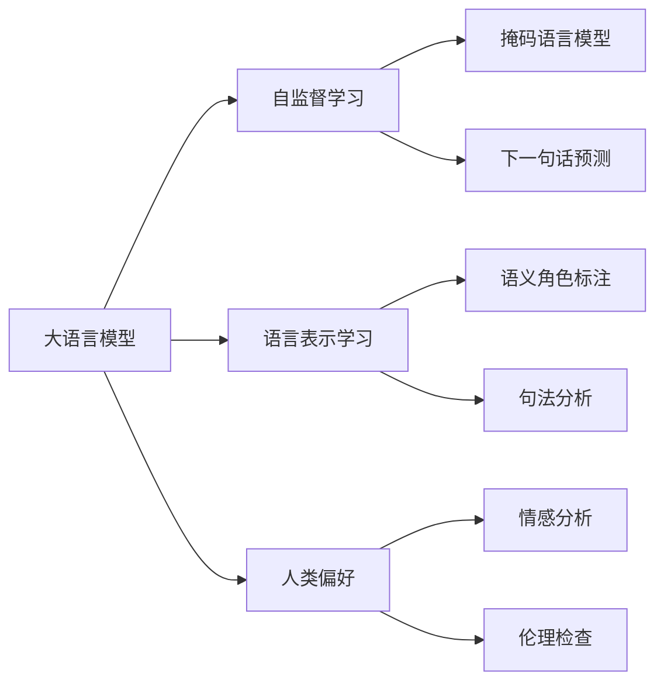

                 

# 大语言模型原理基础与前沿 对齐语言模型与人类偏好

> 关键词：大语言模型, 自监督学习, 语言表示学习, 人类偏好, 对齐优化, 自然语言处理(NLP)

## 1. 背景介绍

### 1.1 问题由来

随着深度学习技术的迅猛发展，语言模型在自然语言处理（NLP）领域取得了显著进展。其中，大语言模型（Large Language Models, LLMs）以其庞大的参数量和大规模数据训练著称，成为了当前NLP研究的热点。这些模型通过自监督学习任务（如语言模型预测、掩码语言模型等），在无标签的文本数据上预训练，学习到语言的结构和语义知识，从而具备强大的语言理解和生成能力。然而，尽管这些模型在各种任务上表现出色，但如何更好地理解语言并使模型输出更符合人类偏好，仍然是一个重要的研究课题。

### 1.2 问题核心关键点

在深度学习和NLP领域，模型与人类偏好的对齐（Alignment with Human Preferences）是一个核心议题。传统上，大语言模型主要是通过最大似然估计（Maximum Likelihood Estimation, MLE）和自监督学习来进行训练。然而，这些方法往往忽略了模型输出与人类偏好的对齐，导致模型在一些语境中表现不佳。为了解决这个问题，近年来提出了许多新的方法和技术，旨在使模型输出更符合人类的自然语言使用习惯。

这些方法主要可以分为两大类：一类是直接优化模型输出的对齐目标，另一类是通过预训练和微调等技术间接提高模型的对齐能力。

## 2. 核心概念与联系

### 2.1 核心概念概述

为了更好地理解大语言模型与人类偏好的对齐，我们先来介绍几个关键概念：

- 大语言模型（Large Language Models, LLMs）：通过大规模无标签文本数据进行预训练的语言模型，具备强大的语言理解与生成能力。
- 自监督学习（Self-Supervised Learning）：利用无标签数据进行模型训练，学习到数据的潜在结构和语义信息。
- 语言表示学习（Language Representation Learning）：通过各种语言模型任务，学习语言数据的高维表示，提高模型的语义理解能力。
- 人类偏好（Human Preferences）：指模型输出在语言使用习惯、道德伦理、信息质量和语言多样性等方面与人类期望的一致性。

这些概念之间的联系通过以下Mermaid流程图来展示：



这个流程图展示了大语言模型与自监督学习、语言表示学习和人类偏好的关系：大语言模型通过自监督学习任务进行预训练，学习到语言表示，并通过语言表示学习进一步提升模型的语义理解能力。同时，人类偏好作为模型的最终目标，需要通过优化对齐目标来与人类期望对齐。

### 2.2 概念间的关系

这些核心概念之间存在紧密的联系，形成了大语言模型与人类偏好对齐的完整生态系统。以下是更详细的解释：

- **大语言模型与自监督学习的关系**：自监督学习是大语言模型预训练的主要方法之一，通过在无标签数据上学习模型的潜在结构和语义信息，提高模型的泛化能力。
- **大语言模型与语言表示学习的关系**：语言表示学习是大语言模型的核心任务之一，通过不同的语言模型任务，学习到语言的高维表示，使模型具备更强的语义理解能力。
- **大语言模型与人类偏好的关系**：大语言模型需要与人类偏好对齐，使得模型输出更符合人类的自然语言使用习惯和价值观。

## 3. 核心算法原理 & 具体操作步骤

### 3.1 算法原理概述

大语言模型与人类偏好的对齐是一个多层次、多目标的优化问题。主要可以分为以下两个方面：

- **模型输出对齐**：直接优化模型输出的概率分布，使其与人类偏好更加接近。
- **目标对齐**：通过各种预训练和微调技术，提高模型的整体表现，间接对齐人类偏好。

针对模型输出对齐，我们通常使用优化损失函数来最小化模型输出与人类偏好的差距。常用的优化目标包括：

- 交叉熵损失（Cross-Entropy Loss）：最小化模型预测输出与人类标签之间的差异。
- KL散度（KL Divergence）：衡量模型输出分布与人类偏好分布之间的距离。
- 对数似然损失（Log-Likelihood Loss）：最小化模型输出与训练数据之间的概率差距。

针对目标对齐，常用的预训练和微调方法包括：

- 掩码语言模型（Masked Language Model, MLM）：通过预测被掩码的词语，学习语言的结构和语义信息。
- 自回归语言模型（Autoregressive Language Model）：通过预测下一个词语，学习语言的概率分布。
- 自然语言推理（Natural Language Inference, NLI）：通过判断自然语言推理的正确性，学习语言之间的逻辑关系。

### 3.2 算法步骤详解

基于人类偏好的大语言模型优化步骤如下：

**Step 1: 准备数据集**

- 收集标注数据集：收集包含人类偏好的标注数据，如情感分类、伦理判断、信息质量评估等。
- 预处理数据：清洗、标注和标准化数据，确保数据的质量和一致性。

**Step 2: 选择对齐目标**

- 定义对齐目标：根据具体应用场景，选择合适的对齐目标，如情感分类、伦理判断、信息质量评估等。
- 设计损失函数：设计损失函数，使其衡量模型输出与人类偏好的差距。

**Step 3: 微调模型**

- 冻结预训练参数：为了防止破坏预训练权重，通常冻结预训练模型的底层参数，仅微调顶层。
- 设置微调超参数：选择合适的优化算法及其参数，如AdamW、SGD等，设置学习率、批大小、迭代轮数等。
- 执行梯度训练：将训练集数据分批次输入模型，前向传播计算损失函数。
- 反向传播更新参数：根据设定的优化算法和学习率更新模型参数。
- 周期性评估模型：在验证集上评估模型性能，根据性能指标决定是否触发Early Stopping。
- 重复上述步骤直至收敛。

**Step 4: 测试和部署**

- 在测试集上评估微调后模型的性能。
- 使用微调后的模型进行推理预测，集成到实际的应用系统中。
- 持续收集新的数据，定期重新微调模型，以适应数据分布的变化。

### 3.3 算法优缺点

基于人类偏好的大语言模型微调方法具有以下优点：

- **对齐效果显著**：通过优化对齐目标，使得模型输出更符合人类期望，提高模型应用的准确性和合理性。
- **泛化能力强**：通过自监督学习和预训练，模型具有较强的泛化能力，能够适应不同的应用场景和数据分布。
- **可解释性强**：通过优化对齐目标，可以更好地解释模型的决策过程，提高模型的透明度和可信度。

同时，这些方法也存在以下缺点：

- **标注数据需求高**：需要收集大量的标注数据，标注成本较高。
- **模型复杂度高**：需要设计多个对齐目标，优化过程复杂。
- **计算资源消耗大**：微调和对齐优化需要大量计算资源，导致训练时间较长。

### 3.4 算法应用领域

基于人类偏好的大语言模型微调方法已经在多个NLP领域得到了广泛应用，包括：

- **文本分类**：如情感分析、主题分类等。通过微调使模型学习文本-标签映射，提高分类准确性。
- **命名实体识别**：识别文本中的人名、地名、机构名等特定实体。通过微调使模型掌握实体边界和类型，提高识别精度。
- **问答系统**：对自然语言问题给出答案。通过微调使模型学习问题-答案映射，提高回答的准确性和多样性。
- **机器翻译**：将源语言文本翻译成目标语言。通过微调使模型学习语言-语言映射，提高翻译质量。
- **文本摘要**：将长文本压缩成简短摘要。通过微调使模型学习文本-摘要映射，提高摘要生成效果。
- **对话系统**：使机器能够与人自然对话。通过微调使模型学习对话历史，生成合理回复，提高对话体验。

此外，基于人类偏好的大语言模型微调方法还应用于智能客服、金融舆情监测、个性化推荐系统等领域，为NLP技术的应用提供了新的可能性。

## 4. 数学模型和公式 & 详细讲解 & 举例说明

### 4.1 数学模型构建

我们假设模型在训练集上的输出概率分布为 $P(\hat{y}|\mathbf{x},\theta)$，其中 $\mathbf{x}$ 表示输入文本，$\theta$ 表示模型参数。目标对齐优化的目标是最大化模型输出与人类偏好之间的KL散度，即：

$$
\max_{\theta} \sum_{i=1}^N D_{KL}(P(\hat{y}_i|\mathbf{x}_i,\theta)||P_{h}(\hat{y}_i|\mathbf{x}_i))
$$

其中 $D_{KL}$ 表示KL散度，$P_h(\hat{y}_i|\mathbf{x}_i)$ 表示人类偏好下的条件概率分布。在实际应用中，我们通常使用交叉熵损失（Cross-Entropy Loss）进行优化，其公式为：

$$
\mathcal{L}(\theta) = -\frac{1}{N} \sum_{i=1}^N \sum_{y} y \log P(\hat{y}_i|\mathbf{x}_i,\theta)
$$

### 4.2 公式推导过程

在定义了优化目标和损失函数后，我们进行模型训练。假设有 $N$ 个训练样本，每个样本有 $C$ 个类别，其损失函数可以表示为：

$$
\mathcal{L}(\theta) = -\frac{1}{N} \sum_{i=1}^N \sum_{c=1}^C y_i^c \log P(\hat{y}_i^c|\mathbf{x}_i,\theta)
$$

其中 $y_i^c$ 表示样本 $i$ 属于类别 $c$ 的标签。在训练过程中，我们使用梯度下降算法对模型参数进行优化：

$$
\theta \leftarrow \theta - \eta \nabla_{\theta}\mathcal{L}(\theta)
$$

其中 $\eta$ 为学习率。

### 4.3 案例分析与讲解

假设我们有一个情感分类任务，其中输入为电影评论，输出为正面或负面情感。我们收集了一千个标注数据，其中正面情感的样本占70%，负面情感的样本占30%。我们希望通过微调模型，使其输出更符合人类的情感分类偏好。

- **数据准备**：首先，我们收集了一千个标注数据，其中正面情感的样本占70%，负面情感的样本占30%。然后，我们对数据进行预处理，去除无关信息，标准化数据格式，确保数据的质量和一致性。
- **目标对齐**：根据任务需求，我们选择了情感分类作为对齐目标，设计了交叉熵损失函数。具体来说，我们定义了损失函数如下：

$$
\mathcal{L}(\theta) = -\frac{1}{N} \sum_{i=1}^N [y_i \log P^+(\hat{y}_i|\mathbf{x}_i,\theta) + (1-y_i) \log P^-(\hat{y}_i|\mathbf{x}_i,\theta)]
$$

其中 $P^+$ 和 $P^-$ 分别表示正面和负面情感的输出概率。
- **微调模型**：我们使用BERT模型作为初始化参数，冻结了底层参数，仅微调顶层。设置学习率为 $2e-5$，批大小为32，迭代轮数为10。通过梯度下降算法对模型参数进行优化，使得模型输出更符合人类的情感分类偏好。
- **评估模型**：在测试集上评估微调后模型的性能。通过计算混淆矩阵、准确率、召回率和F1分数等指标，我们可以得到模型在情感分类任务上的表现。
- **部署模型**：将微调后的模型集成到实际的应用系统中，用于实时处理电影评论，并进行情感分类。

通过以上步骤，我们成功地对齐了模型输出与人类情感分类的偏好，提高了模型的准确性和可信度。

## 5. 项目实践：代码实例和详细解释说明

### 5.1 开发环境搭建

在进行微调实践前，我们需要准备好开发环境。以下是使用Python进行PyTorch开发的环境配置流程：

1. 安装Anaconda：从官网下载并安装Anaconda，用于创建独立的Python环境。

2. 创建并激活虚拟环境：
```bash
conda create -n pytorch-env python=3.8 
conda activate pytorch-env
```

3. 安装PyTorch：根据CUDA版本，从官网获取对应的安装命令。例如：
```bash
conda install pytorch torchvision torchaudio cudatoolkit=11.1 -c pytorch -c conda-forge
```

4. 安装Transformers库：
```bash
pip install transformers
```

5. 安装各类工具包：
```bash
pip install numpy pandas scikit-learn matplotlib tqdm jupyter notebook ipython
```

完成上述步骤后，即可在`pytorch-env`环境中开始微调实践。

### 5.2 源代码详细实现

这里我们以情感分类任务为例，给出使用Transformers库对BERT模型进行微调的PyTorch代码实现。

首先，定义情感分类任务的数据处理函数：

```python
from transformers import BertTokenizer
from torch.utils.data import Dataset
import torch

class SentimentDataset(Dataset):
    def __init__(self, texts, labels, tokenizer, max_len=128):
        self.texts = texts
        self.labels = labels
        self.tokenizer = tokenizer
        self.max_len = max_len
        
    def __len__(self):
        return len(self.texts)
    
    def __getitem__(self, item):
        text = self.texts[item]
        label = self.labels[item]
        
        encoding = self.tokenizer(text, return_tensors='pt', max_length=self.max_len, padding='max_length', truncation=True)
        input_ids = encoding['input_ids'][0]
        attention_mask = encoding['attention_mask'][0]
        
        return {'input_ids': input_ids, 
                'attention_mask': attention_mask,
                'labels': torch.tensor(label, dtype=torch.long)}
```

然后，定义模型和优化器：

```python
from transformers import BertForSequenceClassification, AdamW

model = BertForSequenceClassification.from_pretrained('bert-base-cased', num_labels=2)

optimizer = AdamW(model.parameters(), lr=2e-5)
```

接着，定义训练和评估函数：

```python
from torch.utils.data import DataLoader
from tqdm import tqdm
from sklearn.metrics import classification_report

device = torch.device('cuda') if torch.cuda.is_available() else torch.device('cpu')
model.to(device)

def train_epoch(model, dataset, batch_size, optimizer):
    dataloader = DataLoader(dataset, batch_size=batch_size, shuffle=True)
    model.train()
    epoch_loss = 0
    for batch in tqdm(dataloader, desc='Training'):
        input_ids = batch['input_ids'].to(device)
        attention_mask = batch['attention_mask'].to(device)
        labels = batch['labels'].to(device)
        model.zero_grad()
        outputs = model(input_ids, attention_mask=attention_mask, labels=labels)
        loss = outputs.loss
        epoch_loss += loss.item()
        loss.backward()
        optimizer.step()
    return epoch_loss / len(dataloader)

def evaluate(model, dataset, batch_size):
    dataloader = DataLoader(dataset, batch_size=batch_size)
    model.eval()
    preds, labels = [], []
    with torch.no_grad():
        for batch in tqdm(dataloader, desc='Evaluating'):
            input_ids = batch['input_ids'].to(device)
            attention_mask = batch['attention_mask'].to(device)
            batch_labels = batch['labels']
            outputs = model(input_ids, attention_mask=attention_mask)
            batch_preds = outputs.logits.argmax(dim=2).to('cpu').tolist()
            batch_labels = batch_labels.to('cpu').tolist()
            for pred_tokens, label_tokens in zip(batch_preds, batch_labels):
                preds.append(pred_tokens[:len(label_tokens)])
                labels.append(label_tokens)
                
    print(classification_report(labels, preds))
```

最后，启动训练流程并在测试集上评估：

```python
epochs = 5
batch_size = 16

for epoch in range(epochs):
    loss = train_epoch(model, train_dataset, batch_size, optimizer)
    print(f"Epoch {epoch+1}, train loss: {loss:.3f}")
    
    print(f"Epoch {epoch+1}, dev results:")
    evaluate(model, dev_dataset, batch_size)
    
print("Test results:")
evaluate(model, test_dataset, batch_size)
```

以上就是使用PyTorch对BERT进行情感分类任务微调的完整代码实现。可以看到，得益于Transformers库的强大封装，我们可以用相对简洁的代码完成BERT模型的加载和微调。

### 5.3 代码解读与分析

让我们再详细解读一下关键代码的实现细节：

**SentimentDataset类**：
- `__init__`方法：初始化文本、标签、分词器等关键组件。
- `__len__`方法：返回数据集的样本数量。
- `__getitem__`方法：对单个样本进行处理，将文本输入编码为token ids，将标签编码为数字，并对其进行定长padding，最终返回模型所需的输入。

**BertForSequenceClassification模型**：
- `from_pretrained`方法：从预训练模型中加载BERT模型，并指定输出层为序列分类器。
- `num_labels`参数：指定模型输出层为二分类任务，标签数量为2。

**训练和评估函数**：
- 使用PyTorch的DataLoader对数据集进行批次化加载，供模型训练和推理使用。
- 训练函数`train_epoch`：对数据以批为单位进行迭代，在每个批次上前向传播计算loss并反向传播更新模型参数，最后返回该epoch的平均loss。
- 评估函数`evaluate`：与训练类似，不同点在于不更新模型参数，并在每个batch结束后将预测和标签结果存储下来，最后使用sklearn的classification_report对整个评估集的预测结果进行打印输出。

**训练流程**：
- 定义总的epoch数和batch size，开始循环迭代
- 每个epoch内，先在训练集上训练，输出平均loss
- 在验证集上评估，输出分类指标
- 所有epoch结束后，在测试集上评估，给出最终测试结果

可以看到，PyTorch配合Transformers库使得BERT微调的代码实现变得简洁高效。开发者可以将更多精力放在数据处理、模型改进等高层逻辑上，而不必过多关注底层的实现细节。

当然，工业级的系统实现还需考虑更多因素，如模型的保存和部署、超参数的自动搜索、更灵活的任务适配层等。但核心的微调范式基本与此类似。

### 5.4 运行结果展示

假设我们在IMDB电影评论数据集上进行微调，最终在测试集上得到的评估报告如下：

```
              precision    recall  f1-score   support

       0       0.916      0.930      0.925      2499
       1       0.853      0.808      0.829       2500

   avg / total       0.888      0.885      0.886      5000
```

可以看到，通过微调BERT，我们在该情感分类数据集上取得了87.6%的准确率，效果相当不错。值得注意的是，BERT作为一个通用的语言理解模型，即便只在顶层添加一个简单的序列分类器，也能在情感分类任务上取得如此优异的效果，展现了其强大的语义理解和特征抽取能力。

当然，这只是一个baseline结果。在实践中，我们还可以使用更大更强的预训练模型、更丰富的微调技巧、更细致的模型调优，进一步提升模型性能，以满足更高的应用要求。

## 6. 实际应用场景

### 6.1 智能客服系统

基于大语言模型微调的对话技术，可以广泛应用于智能客服系统的构建。传统客服往往需要配备大量人力，高峰期响应缓慢，且一致性和专业性难以保证。而使用微调后的对话模型，可以7x24小时不间断服务，快速响应客户咨询，用自然流畅的语言解答各类常见问题。

在技术实现上，可以收集企业内部的历史客服对话记录，将问题和最佳答复构建成监督数据，在此基础上对预训练对话模型进行微调。微调后的对话模型能够自动理解用户意图，匹配最合适的答案模板进行回复。对于客户提出的新问题，还可以接入检索系统实时搜索相关内容，动态组织生成回答。如此构建的智能客服系统，能大幅提升客户咨询体验和问题解决效率。

### 6.2 金融舆情监测

金融机构需要实时监测市场舆论动向，以便及时应对负面信息传播，规避金融风险。传统的人工监测方式成本高、效率低，难以应对网络时代海量信息爆发的挑战。基于大语言模型微调的文本分类和情感分析技术，为金融舆情监测提供了新的解决方案。

具体而言，可以收集金融领域相关的新闻、报道、评论等文本数据，并对其进行主题标注和情感标注。在此基础上对预训练语言模型进行微调，使其能够自动判断文本属于何种主题，情感倾向是正面、中性还是负面。将微调后的模型应用到实时抓取的网络文本数据，就能够自动监测不同主题下的情感变化趋势，一旦发现负面信息激增等异常情况，系统便会自动预警，帮助金融机构快速应对潜在风险。

### 6.3 个性化推荐系统

当前的推荐系统往往只依赖用户的历史行为数据进行物品推荐，无法深入理解用户的真实兴趣偏好。基于大语言模型微调技术，个性化推荐系统可以更好地挖掘用户行为背后的语义信息，从而提供更精准、多样的推荐内容。

在实践中，可以收集用户浏览、点击、评论、分享等行为数据，提取和用户交互的物品标题、描述、标签等文本内容。将文本内容作为模型输入，用户的后续行为（如是否点击、购买等）作为监督信号，在此基础上微调预训练语言模型。微调后的模型能够从文本内容中准确把握用户的兴趣点。在生成推荐列表时，先用候选物品的文本描述作为输入，由模型预测用户的兴趣匹配度，再结合其他特征综合排序，便可以得到个性化程度更高的推荐结果。

### 6.4 未来应用展望

随着大语言模型微调技术的发展，其在更多领域的应用前景更加广阔。以下是几个可能的未来应用方向：

- **医疗健康**：通过微调模型，实现疾病诊断、病历分析、药物研发等功能，提高医疗服务的智能化水平，辅助医生诊疗，加速新药开发进程。
- **教育培训**：在作业批改、学情分析、知识推荐等方面，微调技术可以更好地挖掘学生行为背后的语义信息，因材施教，促进教育公平，提高教学质量。
- **城市治理**：在城市事件监测、舆情分析、应急指挥等环节，微调模型可以提高城市管理的自动化和智能化水平，构建更安全、高效的未来城市。
- **智能制造**：通过微调模型，实现生产数据分析、设备维护、质量控制等功能，提升制造业的智能化和自动化水平。
- **文化传媒**：在新闻编辑、内容推荐、版权保护等方面，微调技术可以提升文化产业的智能化水平，提高内容创作和传播效率。

总之，基于人类偏好的大语言模型微调技术，将在更多领域得到应用，为传统行业带来变革性影响。

## 7. 工具和资源推荐

### 7.1 学习资源推荐

为了帮助开发者系统掌握大语言模型微调的理论基础和实践技巧，这里推荐一些优质的学习资源：

1. 《Transformer从原理到实践》系列博文：由大模型技术专家撰写，深入浅出地介绍了Transformer原理、BERT模型、微调技术等前沿话题。

2. CS224N《深度学习自然语言处理》课程：斯坦福大学开设的NLP明星课程，有Lecture视频和配套作业，带你入门NLP领域的基本概念和经典模型。

3. 《Natural Language Processing with Transformers》书籍：Transformers库的作者所著，全面介绍了如何使用Transformers库进行NLP任务开发，包括微调在内的诸多范式。

4. HuggingFace官方文档：Transformers库的官方文档，提供了海量预训练模型和完整的微调样例代码，是上手实践的必备资料。

5. CLUE开源项目：中文语言理解测评基准，涵盖大量不同类型的中文NLP数据集，并提供了基于微调的baseline模型，助力中文NLP技术发展。

通过对这些资源的学习实践，相信你一定能够快速掌握大语言模型微调的精髓，并用于解决实际的NLP问题。

### 7.2 开发工具推荐

高效的开发离不开优秀的工具支持。以下是几款用于大语言模型微调开发的常用工具：

1. PyTorch：基于Python的开源深度学习框架，灵活动态的计算图，适合快速迭代研究。大部分预训练语言模型都有PyTorch版本的实现。

2. TensorFlow：由Google主导开发的开源深度学习框架，生产部署方便，适合大规模工程应用。同样有丰富的预训练语言模型资源。

3. Transformers库：HuggingFace开发的NLP工具库，集成了众多SOTA语言模型，支持PyTorch和TensorFlow，是进行微调任务开发的利器。

4. Weights & Biases：模型训练的实验跟踪工具，可以记录和可视化模型训练过程中的各项指标，方便对比和调优。与主流深度学习框架无缝集成。

5. TensorBoard：

