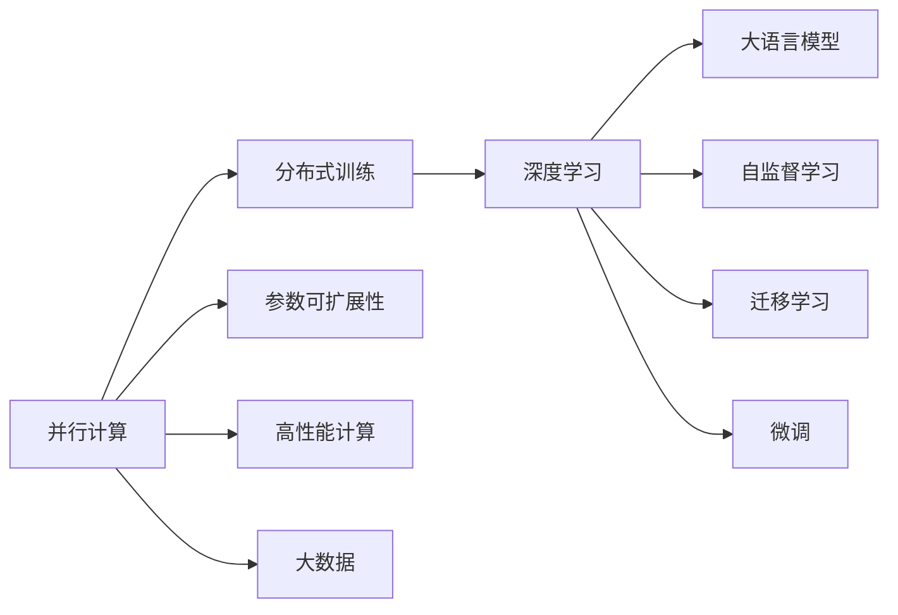

                 

# 大语言模型原理基础与前沿 并行

> 关键词：
大语言模型, 自然语言处理(NLP), 并行计算, 分布式训练, 参数可扩展性, 性能优化, 深度学习, 前馈神经网络(Feedforward Neural Network), 自监督学习, 迁移学习, 微调(Fine-Tuning), 大数据, 高性能计算

## 1. 背景介绍

### 1.1 问题由来
随着深度学习技术的不断发展，大语言模型在自然语言处理（Natural Language Processing，NLP）领域取得了显著进展。这些模型通过在大量无标签文本数据上进行预训练，获得了丰富的语言知识和常识。然而，对于特定领域的应用，传统大语言模型的效果往往难以满足实际需求，特别是在数据量较小或任务复杂度较高的情况下。

为了解决这些问题，研究者们开始探索如何在大规模并行计算环境中高效地训练和优化大语言模型。并行计算技术不仅能够大幅提高模型的训练速度，还能够显著提升模型的性能和泛化能力。本文将重点讨论基于并行计算的深度学习大语言模型原理与前沿技术。

### 1.2 问题核心关键点
本文将从以下几方面探讨基于并行计算的大语言模型：
1. **并行计算的基本概念与原理**：介绍并行计算的基本原理、类型以及其在深度学习中的重要性。
2. **并行计算对大语言模型性能的影响**：分析并行计算如何影响大语言模型的训练效率、模型规模和泛化能力。
3. **基于并行计算的大语言模型优化策略**：探讨如何在并行计算环境中优化大语言模型的参数、架构和训练流程。
4. **实际应用场景**：展示并行计算如何应用于各种NLP任务，如文本分类、情感分析、机器翻译等。
5. **未来发展趋势与挑战**：展望并行计算技术在大语言模型中的应用前景及其面临的挑战。

### 1.3 问题研究意义
基于并行计算的大语言模型研究具有重要意义，主要体现在以下几个方面：
1. **提升模型性能**：并行计算能够显著加快模型的训练速度，使大语言模型在处理大规模数据时更加高效。
2. **支持大规模模型**：并行计算技术使得训练超高参数量的大模型成为可能，从而提升模型的泛化能力和精度。
3. **推动NLP技术产业化**：并行计算技术的应用能够加速NLP技术在实际场景中的落地应用，降低技术开发和应用成本。
4. **拓展研究领域**：并行计算技术的应用为深度学习研究提供了新的思路和方法，促进了NLP领域前沿技术的发展。

## 2. 核心概念与联系

### 2.1 核心概念概述
在讨论基于并行计算的大语言模型前，需要明确几个关键概念：

- **并行计算**：指使用多个处理器或计算单元同时处理不同任务或相同任务的子任务，以提高计算效率的技术。
- **分布式训练**：指在多个计算节点上并行执行模型的训练任务，每个节点负责一部分数据的训练。
- **参数可扩展性**：指模型参数可以随计算资源规模的增加而线性增加，从而实现模型的水平扩展。
- **深度学习**：指通过多层次的神经网络结构和大量的训练数据，学习输入数据与输出数据之间的复杂映射关系。
- **自监督学习**：指使用无标签数据训练模型，使其能够从数据自身规律中学习知识。
- **迁移学习**：指将一个领域学到的知识迁移到另一个领域的应用，以减少新任务的训练时间。
- **微调(Fine-Tuning)**：指在预训练模型基础上，使用有标签数据进一步优化模型在特定任务上的性能。
- **大数据**：指在并行计算环境中处理大量数据的技术，通常涉及分布式存储和计算。
- **高性能计算**：指使用专门的高性能硬件和软件技术，实现高速、高效的计算任务。

这些概念构成了基于并行计算的大语言模型研究的理论基础和实践框架，涵盖了从模型构建到训练优化，再到实际应用的全过程。

### 2.2 概念间的关系

这些核心概念之间的关系可以用以下Mermaid流程图来展示：



这个流程图展示了并行计算在深度学习和NLP中的作用，以及其对大语言模型性能提升的贡献。并行计算不仅能够提高模型训练的效率和参数可扩展性，还能够支持大数据和高性能计算，进而推动大语言模型在实际应用中的落地和优化。

## 3. 核心算法原理 & 具体操作步骤

### 3.1 算法原理概述

基于并行计算的大语言模型训练遵循经典的深度学习模型训练框架，即前向传播-损失计算-反向传播-参数更新这一过程。在并行计算环境中，这一过程可以进一步细化为数据并行和模型并行两种方式。

**数据并行**：指将训练数据分成多个子集，每个计算节点负责一个子集的数据训练，然后将结果合并。

**模型并行**：指将模型的不同层次分布在不同的计算节点上，每个节点负责训练一部分模型参数。

无论采用哪种并行方式，并行计算的核心原理都是利用多台计算资源同时执行任务，以提高训练效率和模型性能。

### 3.2 算法步骤详解

基于并行计算的大语言模型训练一般包括以下几个关键步骤：

**Step 1: 数据分布与模型划分**
- 将大规模训练数据集分布到多个计算节点上，每个节点负责一部分数据。
- 将大语言模型划分为多个子模型，每个子模型负责处理输入数据的特定部分。

**Step 2: 并行训练循环**
- 每个计算节点在前向传播和反向传播过程中，独立计算模型的输出和梯度。
- 通过消息传递或参数共享等机制，将梯度信息汇总到中央控制节点，更新模型参数。

**Step 3: 模型同步与更新**
- 中央控制节点负责协调各个计算节点的训练进度，确保模型参数的一致性。
- 在参数更新阶段，使用异步更新或同步更新策略，调整模型参数。

**Step 4: 结果汇总与模型评估**
- 将各个计算节点的训练结果汇总，生成最终的模型。
- 在测试集上评估模型的性能，进行必要的微调。

这些步骤构成了基于并行计算的大语言模型训练的完整流程，通过分布式计算和模型并行，能够显著提升模型的训练效率和性能。

### 3.3 算法优缺点

**优点**：
1. **训练速度提升**：并行计算能够显著加快模型的训练速度，使得大规模模型的训练成为可能。
2. **模型规模可扩展**：模型参数可以通过并行计算进行线性扩展，支持超高参数量的大模型。
3. **数据处理能力增强**：并行计算能够处理大规模的训练数据，提升模型的泛化能力。
4. **鲁棒性增强**：多节点并行训练使得模型能够应对硬件和软件故障，提高系统的鲁棒性。

**缺点**：
1. **通信开销增加**：并行计算过程中，节点之间的通信开销增加，可能影响整体训练效率。
2. **同步和异步更新复杂**：模型参数更新过程中，同步和异步更新策略的选择和实施需要谨慎考虑。
3. **计算资源需求高**：并行计算需要高性能计算硬件和分布式存储，初始投资成本较高。
4. **算法复杂性增加**：并行计算中的优化和调试过程更加复杂，需要综合考虑不同节点的协同工作。

尽管存在这些缺点，并行计算在提高模型性能和支持大规模应用方面的优势使其成为深度学习和大语言模型训练的重要技术手段。

### 3.4 算法应用领域

基于并行计算的大语言模型在多个NLP任务中得到了广泛应用，包括：

- **文本分类**：将文本数据分为不同的类别，如情感分析、主题分类等。
- **序列标注**：标注文本中的实体、事件等，如命名实体识别（NER）、关系抽取等。
- **机器翻译**：将一种语言的文本翻译成另一种语言的文本。
- **信息抽取**：从非结构化文本中抽取结构化信息，如事件抽取、关系抽取等。
- **问答系统**：根据用户提问，从文本中抽取并生成答案，如基于知识库的问答、对话系统等。

这些任务涵盖了NLP领域的主要研究方向，展示了并行计算在大语言模型中的应用价值。

## 4. 数学模型和公式 & 详细讲解 & 举例说明

### 4.1 数学模型构建

大语言模型的训练通常采用基于梯度的优化算法，如随机梯度下降（SGD）、Adam等。以下以Adam优化算法为例，介绍基于并行计算的数学模型构建。

设模型参数为 $\theta$，训练数据为 $\{x_i\}_{i=1}^N$，目标函数为 $L(\theta)$。Adam算法中，模型参数的更新公式为：

$$
\theta_{t+1} = \theta_t - \eta_t \frac{m_t}{\sqrt{v_t}+\epsilon}
$$

其中，$m_t$ 和 $v_t$ 分别为第一矩估计和第二矩估计，$\eta_t$ 为当前时间步的学习率，$\epsilon$ 为防止除零的常数。

### 4.2 公式推导过程

**数据并行下的模型更新**：
在数据并行模式下，每个节点负责训练数据集的一部分，模型的更新过程可以分解为：

$$
\theta_{t+1} = \theta_t - \frac{\eta_t}{M}\sum_{i=1}^M \nabla_{\theta}L(\theta_t, \{x_i\}_{i=1}^M)
$$

其中，$M$ 为计算节点的数量。

**模型并行下的模型更新**：
在模型并行模式下，每个节点负责一部分模型的参数，模型的更新过程可以分解为：

$$
\theta_{t+1} = \theta_t - \frac{\eta_t}{M}\sum_{i=1}^M \nabla_{\theta}L(\theta_t, \{x_i\}_{i=1}^M)
$$

其中，$M$ 为模型的并行层次数。

### 4.3 案例分析与讲解

**案例分析**：
假设有一个包含100个节点的集群，使用分布式Adam算法训练一个大语言模型。每个节点负责训练1000个样本，模型参数被划分为100个层次，每个层次由10个节点并行训练。在每个时间步，每个节点计算其负责的数据和模型的梯度，并将结果汇总到中央控制节点。中央控制节点使用异步更新策略，更新模型参数。

**讲解**：
1. **数据并行**：每个节点负责训练1000个样本，并行计算模型的输出和梯度。
2. **模型并行**：每个节点负责训练模型的一个层次，参数共享策略确保了模型的全局一致性。
3. **异步更新**：每个节点独立更新模型参数，减少了通信开销，提高了训练效率。
4. **结果汇总**：中央控制节点将各个节点的更新结果合并，生成最终的模型参数。

## 5. 项目实践：代码实例和详细解释说明

### 5.1 开发环境搭建

在进行并行计算实践前，需要准备好开发环境。以下是使用Python和PyTorch进行并行计算的开发环境配置流程：

1. 安装Anaconda：从官网下载并安装Anaconda，用于创建独立的Python环境。

2. 创建并激活虚拟环境：
```bash
conda create -n pytorch-env python=3.8 
conda activate pytorch-env
```

3. 安装PyTorch：根据CUDA版本，从官网获取对应的安装命令。例如：
```bash
conda install pytorch torchvision torchaudio cudatoolkit=11.1 -c pytorch -c conda-forge
```

4. 安装PyTorch distributed包：
```bash
pip install torch.distributed --upgrade
```

5. 安装Python分布式计算库：
```bash
pip install dask[complete] 
```

6. 安装NumPy和Matplotlib：
```bash
pip install numpy matplotlib
```

完成上述步骤后，即可在`pytorch-env`环境中开始并行计算实践。

### 5.2 源代码详细实现

下面我们以训练一个简单的深度学习模型为例，展示并行计算的代码实现。

```python
import torch
import torch.distributed as dist
import torch.nn as nn
import torch.optim as optim
import torch.multiprocessing as mp
import torch.distributed.launch as launch

class MyModel(nn.Module):
    def __init__(self):
        super(MyModel, self).__init__()
        self.fc1 = nn.Linear(10, 5)
        self.fc2 = nn.Linear(5, 2)

    def forward(self, x):
        x = self.fc1(x)
        x = torch.relu(x)
        x = self.fc2(x)
        return x

if __name__ == "__main__":
    # 设置并行环境
    world_size = 4
    torch.cuda.set_device(dist.get_rank())
    
    # 分布式初始化
    if dist.is_initialized():
        dist.destroy_process_group()
    
    dist.init_process_group(backend="nccl", world_size=world_size, init_method="env://")
    
    # 创建模型和优化器
    model = MyModel().to(device="cuda")
    optimizer = optim.Adam(model.parameters(), lr=0.001)
    criterion = nn.MSELoss()
    
    # 定义分布式训练函数
    def train_epoch(model, optimizer, criterion, dataloader):
        model.train()
        for data, target in dataloader:
            data = data.to(device="cuda")
            target = target.to(device="cuda")
            optimizer.zero_grad()
            output = model(data)
            loss = criterion(output, target)
            loss.backward()
            optimizer.step()
    
    # 定义数据加载器
    dataloader = torch.utils.data.DataLoader(torch.randn(100, 10), batch_size=20, shuffle=True)
    
    # 启动并行训练
    mp.spawn(train_epoch, args=(model, optimizer, criterion, dataloader), nprocs=world_size, join=True)
```

### 5.3 代码解读与分析

**代码解读**：
1. **分布式初始化**：使用`dist.destroy_process_group()`销毁之前的分布式环境，并使用`dist.init_process_group()`初始化新的分布式环境，指定使用NCCL作为通信后端，设置集群大小和通信方式。
2. **模型初始化**：创建一个简单的全连接神经网络模型，并将模型迁移到GPU上。
3. **分布式训练函数**：定义一个函数`train_epoch`，用于执行分布式训练循环，包括前向传播、损失计算、反向传播和参数更新。
4. **数据加载器**：定义一个简单的数据加载器，用于模拟训练数据。
5. **启动并行训练**：使用`mp.spawn`启动多个进程，每个进程执行一次`train_epoch`函数。

**代码分析**：
1. **数据并行**：通过`mp.spawn`函数启动多个进程，每个进程负责训练数据集的一部分。数据在每个进程中独立处理，最后将结果汇总。
2. **模型并行**：模型参数被划分为多个层次，每个进程负责训练一部分模型参数，通过参数共享策略确保全局一致性。
3. **异步更新**：每个进程独立更新模型参数，减少通信开销，提高训练效率。
4. **结果汇总**：通过`mp.spawn`函数启动多个进程，每个进程执行一次`train_epoch`函数，最终得到全局训练结果。

## 6. 实际应用场景

### 6.1 智能客服系统

基于并行计算的深度学习模型可以应用于智能客服系统。传统客服系统依赖大量人力，成本高且响应速度慢。而使用并行计算训练的客服模型，能够在7x24小时不间断服务，快速响应客户咨询，提供自然流畅的语音和文字回复。

在技术实现上，可以收集企业内部的历史客服对话记录，将问题-回答对作为训练数据，训练一个基于并行计算的对话模型。模型能够理解客户意图，匹配最合适的答案模板进行回复。对于客户提出的新问题，还可以接入检索系统实时搜索相关内容，动态组织生成回答。

### 6.2 金融舆情监测

金融机构需要实时监测市场舆论动向，以便及时应对负面信息传播，规避金融风险。并行计算训练的模型能够处理大规模的金融舆情数据，快速识别出市场中的异常情况，并自动生成预警信息。

在技术实现上，可以收集金融领域相关的新闻、报道、评论等文本数据，并对其进行主题标注和情感标注。在此基础上，使用并行计算训练一个情感分析模型，使其能够自动判断文本属于何种主题，情感倾向是正面、中性还是负面。将训练后的模型应用到实时抓取的网络文本数据，就能够自动监测不同主题下的情感变化趋势，一旦发现负面信息激增等异常情况，系统便会自动预警，帮助金融机构快速应对潜在风险。

### 6.3 个性化推荐系统

当前的推荐系统往往只依赖用户的历史行为数据进行物品推荐，无法深入理解用户的真实兴趣偏好。并行计算训练的模型可以更好地挖掘用户行为背后的语义信息，从而提供更精准、多样的推荐内容。

在技术实现上，可以收集用户浏览、点击、评论、分享等行为数据，提取和用户交互的物品标题、描述、标签等文本内容。将文本内容作为模型输入，用户的后续行为（如是否点击、购买等）作为监督信号，使用并行计算训练模型。训练后的模型能够从文本内容中准确把握用户的兴趣点。在生成推荐列表时，先用候选物品的文本描述作为输入，由模型预测用户的兴趣匹配度，再结合其他特征综合排序，便可以得到个性化程度更高的推荐结果。

### 6.4 未来应用展望

随着并行计算技术的不断发展，基于并行计算的深度学习大语言模型将在更多领域得到应用，为传统行业带来变革性影响。

在智慧医疗领域，基于并行计算的问答系统、病历分析、药物研发等应用将提升医疗服务的智能化水平，辅助医生诊疗，加速新药开发进程。

在智能教育领域，并行计算训练的模型可应用于作业批改、学情分析、知识推荐等方面，因材施教，促进教育公平，提高教学质量。

在智慧城市治理中，并行计算训练的模型可应用于城市事件监测、舆情分析、应急指挥等环节，提高城市管理的自动化和智能化水平，构建更安全、高效的未来城市。

此外，在企业生产、社会治理、文娱传媒等众多领域，基于并行计算的AI应用也将不断涌现，为经济社会发展注入新的动力。相信随着技术的日益成熟，并行计算技术将成为人工智能落地应用的重要范式，推动人工智能技术向更广阔的领域加速渗透。

## 7. 工具和资源推荐

### 7.1 学习资源推荐

为了帮助开发者系统掌握并行计算和深度学习大语言模型的理论基础和实践技巧，这里推荐一些优质的学习资源：

1. 《Parallel Programming with Python》：介绍Python中并行计算的原理和实践，适合初学者入门。
2. 《深度学习入门：基于PyTorch的理论与实现》：由知名深度学习专家撰写，系统介绍深度学习的基本概念和PyTorch的使用。
3. 《NLP的奥秘：深度学习与自然语言处理》：介绍NLP领域的前沿技术，包括并行计算在内的多种训练方法。
4. PyTorch官方文档：提供了丰富的学习资料和样例代码，适合进阶学习。
5. CS231n《卷积神经网络》课程：斯坦福大学开设的经典深度学习课程，涵盖并行计算和分布式训练的内容。

通过对这些资源的学习实践，相信你一定能够快速掌握并行计算和深度学习大语言模型的精髓，并用于解决实际的NLP问题。

### 7.2 开发工具推荐

高效的开发离不开优秀的工具支持。以下是几款用于并行计算和深度学习大语言模型开发的常用工具：

1. PyTorch：基于Python的开源深度学习框架，灵活动态的计算图，适合快速迭代研究。大部分深度学习模型都有PyTorch版本的实现。
2. TensorFlow：由Google主导开发的开源深度学习框架，生产部署方便，适合大规模工程应用。同样有丰富的深度学习模型资源。
3. Horovod：基于PyTorch和TensorFlow的分布式深度学习框架，支持多节点并行训练，易于使用。
4. Dask：支持大规模并行计算的数据处理框架，适合处理大规模数据集。
5. OpenMPI：开源的消息传递接口，支持多节点通信，适合分布式计算环境。
6. TensorBoard：TensorFlow配套的可视化工具，可实时监测模型训练状态，并提供丰富的图表呈现方式。

合理利用这些工具，可以显著提升并行计算和深度学习大语言模型开发效率，加快创新迭代的步伐。

### 7.3 相关论文推荐

并行计算和大语言模型的发展源于学界的持续研究。以下是几篇奠基性的相关论文，推荐阅读：

1. Understanding Distributed Deep Learning：介绍分布式深度学习的原理和优化策略，是并行计算在深度学习中的应用基础。
2. Improving Generalization with Noisy Data：分析并行计算对模型泛化能力的影响，提出噪声数据策略提升模型性能。
3. Scaling Deep Learning with Mix-precision Training：讨论混合精度训练在并行计算中的优势和实现方法。
4. DeepSpeed：介绍TensorFlow、PyTorch和MXNet等深度学习框架的分布式训练优化，适合大规模模型训练。
5. TensorFlow with GPUs：介绍TensorFlow在GPU上的实现和优化，适用于高性能计算环境。

这些论文代表了大语言模型并行计算的研究方向，通过学习这些前沿成果，可以帮助研究者把握学科前进方向，激发更多的创新灵感。

除上述资源外，还有一些值得关注的前沿资源，帮助开发者紧跟并行计算和大语言模型微调技术的最新进展，例如：

1. arXiv论文预印本：人工智能领域最新研究成果的发布平台，包括大量尚未发表的前沿工作，学习前沿技术的必读资源。
2. 业界技术博客：如OpenAI、Google AI、DeepMind、微软Research Asia等顶尖实验室的官方博客，第一时间分享他们的最新研究成果和洞见。
3. 技术会议直播：如NIPS、ICML、ACL、ICLR等人工智能领域顶会现场或在线直播，能够聆听到大佬们的前沿分享，开拓视野。
4. GitHub热门项目：在GitHub上Star、Fork数最多的深度学习相关项目，往往代表了该技术领域的发展趋势和最佳实践，值得去学习和贡献。
5. 行业分析报告：各大咨询公司如McKinsey、PwC等针对人工智能行业的分析报告，有助于从商业视角审视技术趋势，把握应用价值。

总之，对于并行计算和大语言模型微调技术的学习和实践，需要开发者保持开放的心态和持续学习的意愿。多关注前沿资讯，多动手实践，多思考总结，必将收获满满的成长收益。

## 8. 总结：未来发展趋势与挑战

### 8.1 总结

本文对基于并行计算的大语言模型原理与前沿技术进行了全面系统的介绍。首先阐述了并行计算的基本概念和重要性，接着从并行计算对大语言模型性能的影响，探讨了如何通过并行计算优化模型训练流程。然后通过案例分析和代码实现，展示了并行计算在NLP任务中的应用。最后，展望了并行计算和大语言模型在未来应用中的前景和挑战。

通过本文的系统梳理，可以看到，基于并行计算的大语言模型在提升模型性能和支持大规模应用方面具有显著优势，为NLP技术在实际场景中的落地应用提供了新思路。然而，并行计算和大语言模型的结合仍面临诸如通信开销、模型鲁棒性、计算资源需求等诸多挑战，需要在未来的研究中加以解决。

### 8.2 未来发展趋势

展望未来，基于并行计算的大语言模型将呈现以下几个发展趋势：

1. **模型规模持续增大**：随着算力成本的下降和数据规模的扩张，并行计算环境下的深度学习大语言模型规模将持续增大，进一步提升模型的泛化能力和性能。
2. **分布式训练优化**：新的分布式训练优化算法和策略将不断涌现，如混合精度训练、自适应学习率等，进一步提高并行计算的效率和模型性能。
3. **多模态数据融合**：并行计算技术不仅支持文本数据的处理，还将拓展到图像、语音等多模态数据的融合，提升模型的感知能力和综合表现。
4. **跨领域迁移能力增强**：并行计算训练的大语言模型将具备更强的跨领域迁移能力，能够在不同领域快速适应和应用。
5. **边缘计算与移动设备应用**：并行计算技术将向边缘计算和移动设备迁移，使得大语言模型在资源受限的终端设备上也能运行，推动AI技术在更多场景中的应用。

这些趋势预示着基于并行计算的大语言模型将迎来更广阔的应用前景，进一步推动NLP技术的发展和产业化进程。

### 8.3 面临的挑战

尽管基于并行计算的大语言模型在提升模型性能和支持大规模应用方面取得了显著进展，但仍面临诸多挑战：

1. **通信开销增加**：并行计算中的节点通信开销较大，可能影响整体训练效率。如何优化通信开销，提高并行计算的效率，是未来需要解决的问题。
2. **模型鲁棒性不足**：并行计算训练的大语言模型在面对不同数据分布时，鲁棒性可能不足，泛化能力有待提升。
3. **计算资源需求高**：并行计算需要高性能计算硬件和分布式存储，初始投资成本较高，可能限制

