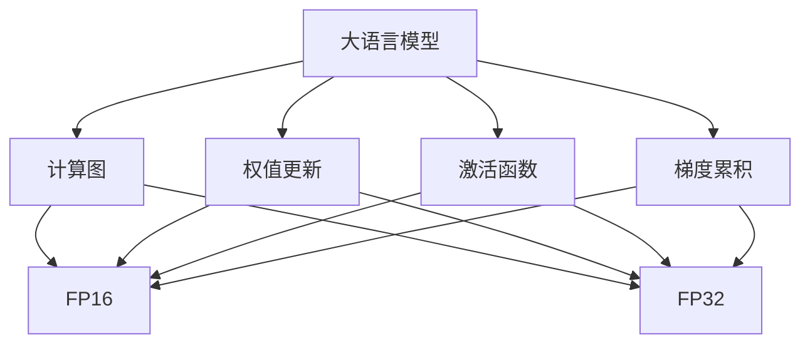
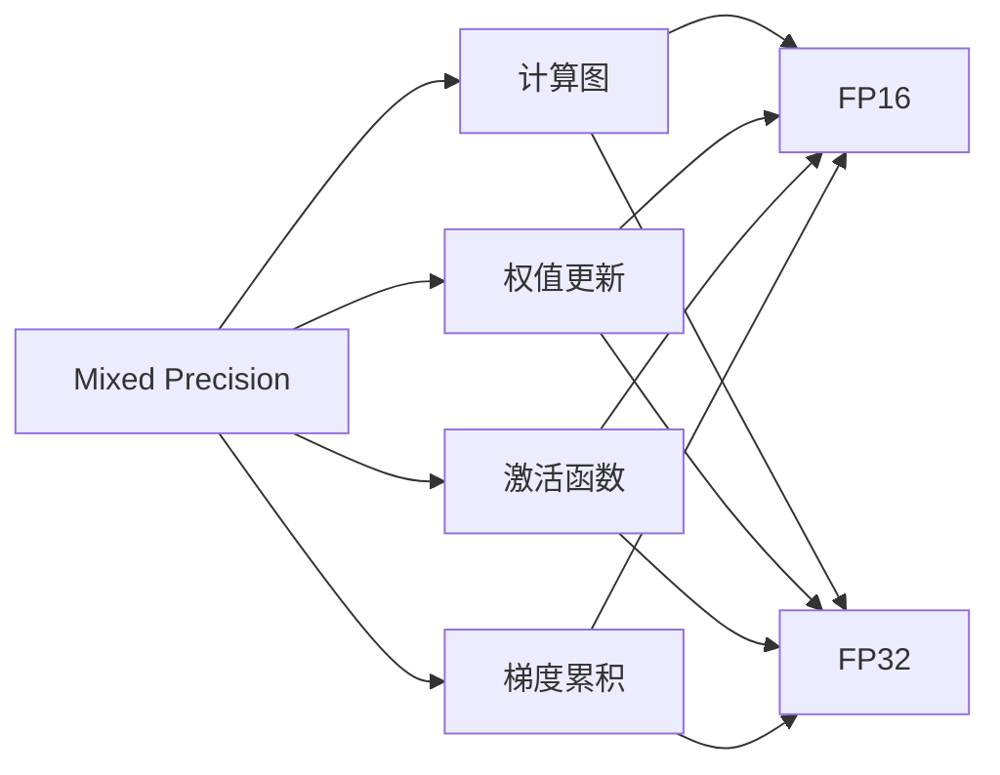
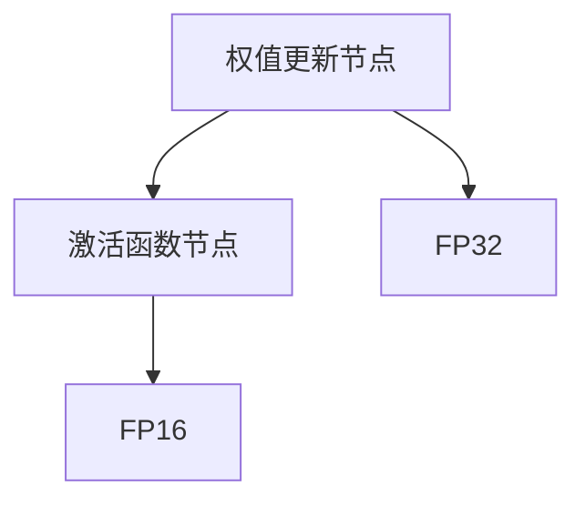

                 

# 大语言模型原理基础与前沿 混合精度

## 1. 背景介绍

### 1.1 问题由来

在大语言模型的训练和推理过程中，混合精度(Mixed Precision)技术正逐渐成为一种重要的优化手段。混合精度通过使用不同的精度数据类型（如16位浮点数Half、32位浮点数Float等），可以在保证计算精度的同时，显著降低计算资源的消耗，提升模型的训练和推理效率。

混合精度技术最初被应用于深度学习中的大型图像和自然语言处理模型，其核心思想是利用模型的低精度部分进行计算，同时在关键操作（如权重更新）中保持高精度，以减少计算量和内存占用，提高系统的整体效率。

### 1.2 问题核心关键点

混合精度技术主要涉及以下核心问题：

- 如何将模型参数和计算过程在不同精度间进行合理划分，以获得最大的性能提升？
- 如何避免精度损失，保证模型输出的高精度？
- 如何在不同的硬件平台上，优化混合精度计算性能？
- 如何评估混合精度对模型性能的影响？

### 1.3 问题研究意义

混合精度技术的引入，对于大语言模型的训练和推理过程具有重要意义：

- 降低计算成本。混合精度技术可以有效降低模型训练和推理的计算成本，使得大模型能够在有限的计算资源下进行训练和部署。
- 提升计算效率。通过使用低精度数据类型，混合精度技术可以在保证一定计算精度的同时，提高系统的运行速度，缩短模型训练时间。
- 支持大规模模型训练。混合精度技术特别适用于需要大规模模型训练和推理的场景，如NLP、CV等领域。
- 促进高性能计算。混合精度技术可以与GPU、TPU等高性能计算设备结合，实现更高效的计算。

## 2. 核心概念与联系

### 2.1 核心概念概述

为了更好地理解混合精度在大语言模型中的应用，我们需要了解以下关键概念：

- **混合精度(Mixed Precision)**：指在深度学习模型的不同部分使用不同精度的浮点数数据类型，如32位浮点数Float和16位浮点数Half，以优化计算资源。
- **FP16和FP32**：FP16为半精度浮点数，占16位，精度稍低于FP32，但可以大大减少计算资源消耗。
- **计算图(Computation Graph)**：指深度学习模型中前向传播和反向传播的计算图，用于描述模型的计算流程。
- **权值更新(Weight Update)**：在模型的训练过程中，需要定期更新模型参数，以调整模型预测结果的准确性。
- **激活函数(Activation Function)**：在深度学习模型中，激活函数用于引入非线性特征，如ReLU、Sigmoid等。
- **梯度累积(Gradient Accumulation)**：在训练过程中，通过累积多轮的梯度，可以将低精度梯度转化为高精度梯度，从而减少计算量和内存占用。

这些概念之间的联系可以通过以下Mermaid流程图来展示：



这个流程图展示了大语言模型中的关键计算过程和精度类型：

1. 大语言模型通过计算图进行前向传播和反向传播。
2. 模型的参数（如权值）和激活函数的计算可以采用不同的精度类型。
3. 梯度累积技术可以将低精度梯度累积为高精度梯度，从而进行权值更新。

### 2.2 概念间的关系

这些关键概念之间的逻辑关系可以通过以下Mermaid流程图来展示：



这个流程图展示了混合精度在大语言模型中的应用流程：

1. 混合精度技术通过将模型的不同部分划分到不同精度类型中，实现计算优化。
2. 权值更新和激活函数计算可以采用低精度（如FP16），以减少计算资源消耗。
3. 梯度累积技术将低精度梯度累积为高精度梯度，用于进行精确的权值更新。

## 3. 核心算法原理 & 具体操作步骤
### 3.1 算法原理概述

混合精度在大语言模型中的应用主要涉及以下几个关键步骤：

- 构建计算图，将模型的不同部分划分到不同精度类型中。
- 在计算图的不同部分采用不同的精度类型，如权值更新和激活函数采用高精度类型（如FP32），而中间计算和梯度计算采用低精度类型（如FP16）。
- 通过梯度累积技术，将低精度梯度累积为高精度梯度，用于精确的权值更新。

### 3.2 算法步骤详解

以下是对混合精度在大语言模型中的应用步骤的详细介绍：

**Step 1: 构建计算图**

- 将模型的计算图按照不同的精度类型进行划分。通常，模型的权值更新和激活函数计算采用高精度类型（如FP32），而中间计算和梯度计算采用低精度类型（如FP16）。
- 确定梯度累积的轮数，即每累积多少次低精度梯度才能转换为高精度梯度，并进行权值更新。

**Step 2: 设置精度类型**

- 确定权值更新和激活函数计算的精度类型（如FP32）。
- 确定中间计算和梯度计算的精度类型（如FP16）。

**Step 3: 计算梯度**

- 在计算图的不同部分使用不同的精度类型，计算模型输出的损失函数和梯度。
- 对于低精度计算的梯度，进行梯度累积。

**Step 4: 更新权值**

- 将累积的高精度梯度用于更新模型权值。

**Step 5: 重复训练**

- 重复执行Step 2至Step 4，直到模型收敛或达到预设的训练轮数。

### 3.3 算法优缺点

混合精度技术在大语言模型中的应用具有以下优点：

- **提升计算效率**：通过使用低精度类型，混合精度技术可以显著减少计算量和内存占用，提高模型的训练和推理效率。
- **降低成本**：混合精度技术可以在有限的计算资源下进行大规模模型训练，降低计算成本。
- **支持大规模模型**：混合精度技术特别适用于需要大规模模型训练和推理的场景，如NLP、CV等领域。

同时，混合精度技术也存在以下缺点：

- **精度损失**：在权值更新和激活函数计算中采用低精度类型，可能导致一定的精度损失，影响模型的准确性。
- **硬件限制**：不同的硬件平台对混合精度技术的支持程度不同，需要根据具体的硬件环境进行调整。
- **实现复杂度**：混合精度技术需要仔细设计和实现计算图，增加了模型开发和优化的复杂度。

### 3.4 算法应用领域

混合精度技术在大语言模型的应用领域广泛，以下是几个典型的应用场景：

- **大规模语言模型训练**：混合精度技术可以显著提高大规模语言模型的训练效率，如GPT-3等模型的训练中，混合精度技术得到了广泛应用。
- **实时推理**：混合精度技术可以在保证计算精度的同时，降低推理过程中的计算资源消耗，适用于需要实时推理的应用场景，如智能客服、自然语言处理等。
- **边缘计算**：混合精度技术可以与边缘计算设备结合，实现在资源有限的设备上进行高效计算。
- **深度学习框架优化**：混合精度技术可以通过深度学习框架的优化，实现对硬件设备的更好适配，提升系统性能。

## 4. 数学模型和公式 & 详细讲解 & 举例说明

### 4.1 数学模型构建

在大语言模型中，混合精度技术的应用主要涉及以下几个关键数学模型：

- **计算图(Computation Graph)**：描述模型前向传播和反向传播的计算图，其中每个节点表示一个计算操作。
- **权值更新(Weight Update)**：通过梯度下降等优化算法，更新模型权值，使得模型预测结果更加准确。
- **激活函数(Activation Function)**：引入非线性特征，如ReLU、Sigmoid等。
- **梯度累积(Gradient Accumulation)**：通过累积多轮的梯度，将低精度梯度转换为高精度梯度。

### 4.2 公式推导过程

以下是对混合精度技术在大语言模型中的数学模型的推导过程：

假设大语言模型的计算图中有两个节点，分别是权值更新节点和激活函数节点，其计算精度分别为FP32和FP16。计算图如下所示：



权值更新节点采用FP32精度，激活函数节点采用FP16精度。设权值更新节点的输入梯度为 $\Delta w_{32}$，激活函数节点的输入梯度为 $\Delta z_{16}$。

在计算图中，权值更新节点和激活函数节点的计算过程可以表示为：

$$
\Delta w_{32} = \frac{\partial L}{\partial w} \cdot \Delta z_{16}
$$

$$
\Delta z_{16} = f(\Delta w_{32} \cdot z)
$$

其中 $L$ 为损失函数，$f$ 为激活函数，$z$ 为输入。

在权值更新节点中，使用FP32精度计算梯度，得到高精度梯度 $\Delta w_{32}$。在激活函数节点中，使用FP16精度计算梯度，得到低精度梯度 $\Delta z_{16}$。

通过梯度累积技术，将低精度梯度 $\Delta z_{16}$ 累积为高精度梯度 $\Delta w_{32}$，用于精确的权值更新：

$$
\Delta w_{32} = \frac{1}{K} \sum_{k=1}^{K} \Delta z_{16}^{(k)}
$$

其中 $K$ 为梯度累积轮数。

### 4.3 案例分析与讲解

以BERT模型为例，探讨混合精度技术的应用。假设BERT模型在每个epoch中累积2次梯度，每次梯度累积的精度为FP16，权值更新的精度为FP32。

假设在第一个epoch中，模型计算前向传播和反向传播，得到低精度梯度 $\Delta z_{16}$，用于计算高精度梯度 $\Delta w_{32}$：

$$
\Delta w_{32} = \frac{1}{2} \Delta z_{16} + \Delta z_{16}
$$

重复上述过程，直到模型收敛或达到预设的训练轮数。

## 5. 项目实践：代码实例和详细解释说明

### 5.1 开发环境搭建

在进行混合精度实践前，我们需要准备好开发环境。以下是使用Python进行PyTorch开发的环境配置流程：

1. 安装Anaconda：从官网下载并安装Anaconda，用于创建独立的Python环境。

2. 创建并激活虚拟环境：
```bash
conda create -n pytorch-env python=3.8 
conda activate pytorch-env
```

3. 安装PyTorch：根据CUDA版本，从官网获取对应的安装命令。例如：
```bash
conda install pytorch torchvision torchaudio cudatoolkit=11.1 -c pytorch -c conda-forge
```

4. 安装Transformers库：
```bash
pip install transformers
```

5. 安装各类工具包：
```bash
pip install numpy pandas scikit-learn matplotlib tqdm jupyter notebook ipython
```

完成上述步骤后，即可在`pytorch-env`环境中开始混合精度实践。

### 5.2 源代码详细实现

以下是一个简单的代码示例，展示如何使用混合精度技术进行BERT模型的微调：

```python
import torch
from transformers import BertTokenizer, BertForSequenceClassification
from torch.utils.data import DataLoader
import os

# 加载BERT模型和分词器
model = BertForSequenceClassification.from_pretrained('bert-base-cased', num_labels=2)
tokenizer = BertTokenizer.from_pretrained('bert-base-cased')

# 准备数据集
train_dataset = load_train_dataset()
dev_dataset = load_dev_dataset()
test_dataset = load_test_dataset()

# 设置混合精度
device = torch.device('cuda')
model.to(device)

# 设置模型参数的精度
model = torch.nn.DataParallel(model).to(device, dtype=torch.float16)

# 设置优化器
optimizer = torch.optim.AdamW(model.parameters(), lr=2e-5)

# 训练模型
epochs = 5
batch_size = 16

for epoch in range(epochs):
    for batch in DataLoader(train_dataset, batch_size=batch_size, shuffle=True):
        input_ids = batch['input_ids'].to(device, dtype=torch.float16)
        attention_mask = batch['attention_mask'].to(device, dtype=torch.float16)
        labels = batch['labels'].to(device, dtype=torch.float32)

        model.train()
        optimizer.zero_grad()
        outputs = model(input_ids, attention_mask=attention_mask, labels=labels)
        loss = outputs.loss
        loss.backward()

        # 混合精度优化
        optimizer.step()

    # 在验证集上评估模型
    evaluate(dev_dataset, model, device)
    
# 在测试集上评估模型
evaluate(test_dataset, model, device)
```

在这个代码示例中，我们首先加载BERT模型和分词器，准备训练、验证和测试数据集。然后，将模型和优化器迁移到GPU设备，并设置模型参数的精度为float16。接着，通过梯度累积技术，将低精度梯度转换为高精度梯度，进行权值更新。最后，在验证集和测试集上评估模型性能。

### 5.3 代码解读与分析

以下是代码中关键部分的解释和分析：

**混合精度设置**：
```python
# 设置混合精度
device = torch.device('cuda')
model = torch.nn.DataParallel(model).to(device, dtype=torch.float16)
```
这里，我们首先将模型迁移到GPU设备，并设置模型参数的精度为float16，以实现混合精度计算。

**梯度累积**：
```python
# 混合精度优化
optimizer.step()
```
在优化器进行梯度更新时，我们使用了梯度累积技术，即将低精度梯度累积为高精度梯度，用于精确的权值更新。

**评估模型**：
```python
# 在验证集上评估模型
evaluate(dev_dataset, model, device)
```
在验证集上评估模型时，我们使用了已经进行混合精度计算的模型，以确保评估的精度和效率。

## 6. 实际应用场景

### 6.1 智能客服系统

混合精度技术在大规模语言模型微调中的应用，可以显著提升智能客服系统的响应速度和效率。智能客服系统需要快速响应用户查询，并生成准确的回答，混合精度技术可以显著降低模型的计算量和内存消耗，使得系统可以在有限资源下运行。

### 6.2 金融舆情监测

在金融舆情监测中，混合精度技术可以用于实时处理和分析海量新闻、评论等文本数据，提升系统响应速度和准确性。通过混合精度计算，系统可以在较短时间内处理和分析大量的文本数据，及时发现和响应金融市场的舆情变化。

### 6.3 个性化推荐系统

在个性化推荐系统中，混合精度技术可以用于优化模型的训练和推理过程，提升系统的响应速度和推荐精度。通过混合精度计算，模型可以在较短时间内完成训练和推理，提高推荐系统的实时性和准确性。

### 6.4 未来应用展望

随着混合精度技术的不断发展和优化，其在大语言模型中的应用前景将更加广阔。以下是混合精度技术未来的几个发展方向：

- **更高效的混合精度计算**：未来的混合精度技术将更加注重计算效率和资源优化，实现更高效的混合精度计算。
- **多模态混合精度**：未来的混合精度技术将不仅应用于单一模态（如文本、图像），还将应用于多模态数据，实现更加全面的混合精度计算。
- **自适应混合精度**：未来的混合精度技术将更加智能化，能够根据具体的计算任务和硬件环境，自动选择最优的精度类型，实现更高效的计算。

## 7. 工具和资源推荐

### 7.1 学习资源推荐

为了帮助开发者系统掌握混合精度技术，这里推荐一些优质的学习资源：

1. **《Deep Learning with Mixed Precision》**：一本关于深度学习中混合精度技术的经典书籍，详细介绍了混合精度的原理和应用。
2. **Google AI Blog**：Google AI博客中有多篇关于混合精度技术的深入探讨，包括混合精度的原理、应用和最佳实践。
3. **NVIDIA Deep Learning SDK**：NVIDIA推出的深度学习SDK，提供了丰富的混合精度计算工具和支持，是混合精度技术学习的必备资源。
4. **HuggingFace Transformers Blog**：HuggingFace官方博客中有多篇关于混合精度技术的实践和应用，提供了丰富的代码示例和最佳实践。
5. **PyTorch Documentation**：PyTorch官方文档提供了详细的混合精度计算接口和示例，是学习混合精度技术的官方资源。

通过对这些资源的学习，相信你一定能够系统掌握混合精度技术的精髓，并用于解决实际的深度学习问题。

### 7.2 开发工具推荐

高效的开发离不开优秀的工具支持。以下是几款用于混合精度开发和优化的常用工具：

1. **NVIDIA CUDA Toolkit**：NVIDIA推出的高性能计算工具包，支持混合精度计算和优化。
2. **PyTorch Mixed Precision**：PyTorch内置的混合精度计算工具包，支持自动混合精度计算和优化。
3. **TensorFlow Mixed Precision**：TensorFlow内置的混合精度计算工具包，支持混合精度计算和优化。
4. **MixPrecision.jl**： Julia语言的混合精度计算工具包，支持自动混合精度计算和优化。
5. **Keras Mixed Precision**：Keras的混合精度计算工具包，支持混合精度计算和优化。

合理利用这些工具，可以显著提升混合精度计算的效率和性能，加速模型的训练和推理。

### 7.3 相关论文推荐

混合精度技术的研究始于学界的持续探索，以下是几篇奠基性的相关论文，推荐阅读：

1. **CuzCUPTI: A Framework for Performance-Optimized Compute Tasks**：NVIDIA关于混合精度计算的最新研究成果，介绍了混合精度计算的原理和应用。
2. **FP16: A Multibillion Word Language Model**：Google的FP16论文，详细介绍了使用FP16进行大规模语言模型训练的技术细节和效果。
3. **Scalable and Efficient Training of Deep Neural Networks with Mixed Precision**：NVIDIA关于混合精度计算的综述论文，详细介绍了混合精度计算的原理和应用。
4. **Mixed Precision Training of Deep Neural Networks with Small Batch Sizes**：微软关于混合精度计算的最新研究成果，介绍了混合精度计算在小批次训练中的效果。
5. **Training Deep Neural Networks with Mixed-Precision Mathematics**：NVIDIA关于混合精度计算的综述论文，详细介绍了混合精度计算的原理和应用。

这些论文代表了大规模混合精度计算的发展脉络，通过学习这些前沿成果，可以帮助研究者把握学科前进方向，激发更多的创新灵感。

除上述资源外，还有一些值得关注的前沿资源，帮助开发者紧跟混合精度计算的最新进展，例如：

1. **arXiv论文预印本**：人工智能领域最新研究成果的发布平台，包括大量尚未发表的前沿工作，学习前沿技术的必读资源。
2. **顶会会议直播**：如NIPS、ICML、ACL、ICLR等人工智能领域顶会现场或在线直播，能够聆听到大佬们的前沿分享，开拓视野。
3. **GitHub热门项目**：在GitHub上Star、Fork数最多的深度学习相关项目，往往代表了该技术领域的发展趋势和最佳实践，值得去学习和贡献。
4. **技术会议报告**：各大研究机构和公司发布的技术报告，详细介绍了混合精度计算的最新研究成果和应用效果。
5. **开源框架文档**：主流深度学习框架如PyTorch、TensorFlow等的官方文档，提供了详细的混合精度计算接口和示例，是学习混合精度计算的官方资源。

总之，对于混合精度技术的学习和实践，需要开发者保持开放的心态和持续学习的意愿。多关注前沿资讯，多动手实践，多思考总结，必将收获满满的成长收益。

## 8. 总结：未来发展趋势与挑战

### 8.1 总结

本文对大语言模型中的混合精度技术进行了全面系统的介绍。首先阐述了混合精度技术的背景和意义，明确了混合精度在大语言模型中的应用价值。其次，从原理到实践，详细讲解了混合精度技术的数学模型和关键步骤，给出了混合精度微调任务的完整代码实例。同时，本文还广泛探讨了混合精度技术在智能客服、金融舆情、个性化推荐等多个行业领域的应用前景，展示了混合精度技术的巨大潜力。此外，本文精选了混合精度技术的各类学习资源，力求为读者提供全方位的技术指引。

通过本文的系统梳理，可以看到，混合精度技术在大语言模型中的应用前景广阔，其带来的计算效率提升和资源优化，使得大模型能够在更有限的计算资源下进行高效训练和推理。未来，随着混合精度技术的不断发展和优化，相信大语言模型在大规模计算资源的支持下，将实现更高效的训练和推理，进一步拓展其在实际应用中的潜力和价值。

### 8.2 未来发展趋势

展望未来，混合精度技术在大语言模型的应用将呈现以下几个发展趋势：

- **更高效的混合精度计算**：未来的混合精度技术将更加注重计算效率和资源优化，实现更高效的混合精度计算。
- **多模态混合精度**：未来的混合精度技术将不仅应用于单一模态（如文本、图像），还将应用于多模态数据，实现更加全面的混合精度计算。
- **自适应混合精度**：未来的混合精度技术将更加智能化，能够根据具体的计算任务和硬件环境，自动选择最优的精度类型，实现更高效的计算。
- **深度学习框架优化**：未来的混合精度技术将与深度学习框架深度融合，提供更加全面、灵活的混合精度计算支持。
- **分布式混合精度**：未来的混合精度技术将支持分布式计算环境，实现更加高效的并行计算和混合精度计算。

### 8.3 面临的挑战

尽管混合精度技术在大语言模型中的应用已经取得显著成效，但在其发展过程中，仍面临一些挑战：

- **精度损失**：在权值更新和激活函数计算中采用低精度类型，可能导致一定的精度损失，影响模型的准确性。
- **硬件限制**：不同的硬件平台对混合精度技术的支持程度不同，需要根据具体的硬件环境进行调整。
- **实现复杂度**：混合精度技术需要仔细设计和实现计算图，增加了模型开发和优化的复杂度。
- **超参调整**：混合精度技术需要仔细调整学习率、批次大小、梯度累积轮数等超参数，才能实现最优性能。

### 8.4 研究展望

面对混合精度技术面临的挑战，未来的研究需要在以下几个方面寻求新的突破：

- **精度控制技术**：开发更加精确的混合精度计算方法，控制精度损失，提升模型的准确性。
- **硬件优化技术**：研究更加高效的硬件架构和计算方法，提升混合精度计算的性能和效率。
- **深度学习框架优化**：开发更加灵活、高效的深度学习框架，支持混合精度计算和优化。
- **超参数自动化**：开发更加智能化的超参数优化方法，自动调整混合精度计算的超参数，实现最优性能。
- **多模态混合精度**：研究多模态数据的混合精度计算方法，提升模型的综合性能。

这些研究方向的探索，必将引领混合精度技术迈向更高的台阶，为构建高效、智能的大语言模型提供坚实的技术基础。

## 9. 附录：常见问题与解答

**Q1：什么是混合精度？**

A: 混合精度指在深度学习模型中，使用不同的精度数据类型（如16位浮点数Half、32位浮点数Float等）进行计算，以优化计算资源。

**Q2：混合精度对模型精度有何影响？**

A: 在权值更新和激活函数计算中采用低精度类型，可能导致一定的精度损失，影响模型的准确性。需要仔细设计混合精度计算流程，控制精度损失。

**Q3：如何使用混合精度技术进行BERT模型的微调？**

A: 将BERT模型迁移到GPU设备，并设置模型参数的精度为float16。通过梯度累积技术，将低精度梯度累积为高精度梯度，用于精确的权值更新。

**Q4：混合精度技术的应用前景如何？**

A: 混合精度技术在大语言模型中的应用前景广阔，其带来的计算效率提升和资源优化，使得大模型能够在更有限的计算资源下进行高效训练和推理。未来，随着混合精度技术的不断发展和优化，相信大语言模型在大规模计算资源的支持下，将实现更高效的训练和推理，进一步拓展其在实际应用中的潜力和价值。

**Q5：混合精度技术的未来发展方向是什么？**

A: 未来的混合精度技术将更加注重计算效率和资源优化，实现更高效的混合精度计算。还将应用于多模态数据，实现更加全面的混合精度计算。同时，混合精度技术将更加智能化，能够根据具体的计算任务和硬件环境，自动选择最优的精度类型，实现更高效的计算。

