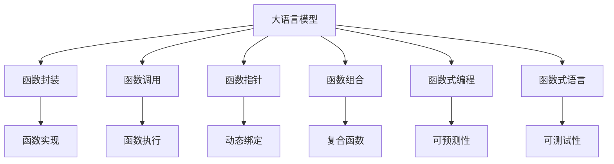
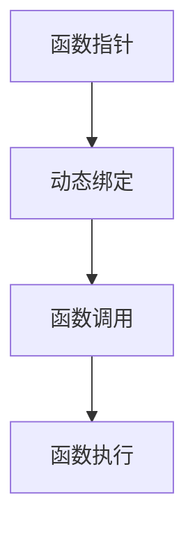
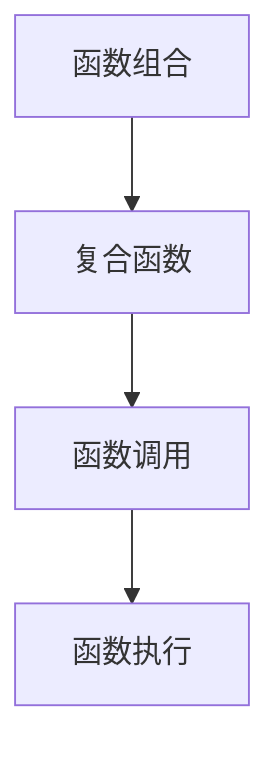
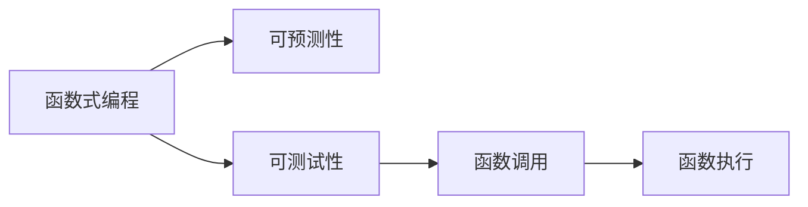
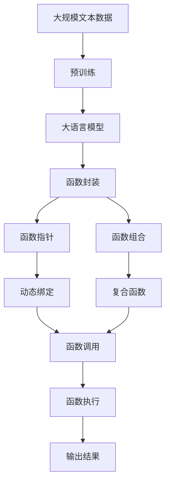

                 

# 大语言模型应用指南：function calling

> 关键词：大语言模型,函数调用,函数封装,函数重载,函数指针,函数组合,函数式编程,函数式语言

## 1. 背景介绍

### 1.1 问题由来
随着深度学习技术的快速发展，大语言模型（Large Language Models, LLMs）在自然语言处理（Natural Language Processing, NLP）领域取得了巨大的突破。这些大语言模型通过在海量无标签文本数据上进行预训练，学习到了丰富的语言知识和常识，可以通过少量的有标签样本在下游任务上进行微调（Fine-Tuning），获得优异的性能。例如，OpenAI的GPT系列模型、Google的BERT、T5等。

然而，由于预训练语料的广泛性和泛化能力的不足，这些通用的大语言模型在特定领域应用时，效果往往难以达到实际应用的要求。因此，如何针对特定任务进行大模型微调，提升模型性能，成为了当前大语言模型研究和应用的一个热点问题。本文聚焦于如何在大语言模型中实现高效、灵活的函数调用，使得模型能够更直接地操作数据，执行特定的任务。

### 1.2 问题核心关键点
函数调用在大语言模型中的应用，实质上是将模型的输出转化为函数的形式，以便模型能够执行特定的操作。这种技术被称为函数封装（Functional Programming），它允许模型以函数的形式执行复杂的数据处理任务，提升模型的灵活性和可扩展性。

函数调用的核心在于如何定义和调用函数。在大语言模型中，函数通常由一系列的参数和返回值构成。函数的参数可以是模型的输入数据、模型的中间变量等，而函数的返回值则可以是模型的输出结果、中间结果等。

函数调用技术在大语言模型中的应用场景包括但不限于：
- 模型-数据交互：模型通过调用函数实现对数据的特定操作，例如解析、提取、转换等。
- 数据-模型交互：通过函数的参数和返回值，数据可以与模型进行高效交互，实现数据驱动的模型训练和优化。
- 模型-模型交互：模型之间可以通过函数调用进行合作，实现更复杂的任务。

本文将详细介绍如何在预训练的大语言模型中实现高效、灵活的函数调用，探讨其原理和应用，并通过具体实例展示其实现方法。

## 2. 核心概念与联系

### 2.1 核心概念概述

为更好地理解函数调用技术在大语言模型中的应用，本节将介绍几个密切相关的核心概念：

- 大语言模型（LLMs）：以自回归（如GPT）或自编码（如BERT）模型为代表的大规模预训练语言模型。通过在大规模无标签文本语料上进行预训练，学习通用的语言表示，具备强大的语言理解和生成能力。

- 函数封装（Functional Programming）：一种编程范式，通过将计算过程抽象为函数的组合和调用，提升代码的可读性和可复用性。在大语言模型中，函数封装技术使得模型能够以函数的形式执行复杂的数据处理任务。

- 函数调用（Function Calling）：指在程序执行过程中，调用一个函数的代码段，并将函数的参数传递给它。在大语言模型中，函数调用允许模型执行特定的操作，例如解析、提取、转换等。

- 函数指针（Function Pointer）：指向函数的指针，允许函数在程序运行时动态绑定。在大语言模型中，函数指针使得模型能够动态地调用不同的函数，适应不同的任务需求。

- 函数组合（Function Composition）：将多个函数组合成一个复合函数，以实现更复杂的功能。在大语言模型中，函数组合技术允许模型通过函数调用组合多个操作，提升模型的灵活性和可扩展性。

- 函数式编程（Functional Programming）：一种编程范式，强调函数作为基本组件的组合和调用，避免副作用（Side Effects），提升程序的可预测性和可测试性。在大语言模型中，函数式编程技术可以提升模型的稳定性和鲁棒性。

- 函数式语言（Functional Language）：一种编程语言，强调函数的组合和调用，避免副作用，提升程序的可预测性和可测试性。在大语言模型中，函数式语言为实现高效、灵活的函数调用提供了强有力的支持。

这些核心概念之间的逻辑关系可以通过以下Mermaid流程图来展示：



这个流程图展示了大语言模型中函数调用技术的核心概念及其之间的关系：

1. 大语言模型通过函数封装和函数调用，将计算过程抽象为函数的组合和调用，提升代码的可读性和可复用性。
2. 函数指针允许函数在程序运行时动态绑定，适应不同的任务需求。
3. 函数组合将多个函数组合成一个复合函数，实现更复杂的功能。
4. 函数式编程和函数式语言强调函数的组合和调用，避免副作用，提升程序的可预测性和可测试性。
5. 函数实现和函数执行是函数调用的具体实现，依赖于模型参数和数据输入。

这些概念共同构成了大语言模型中函数调用的完整生态系统，使其能够在各种场景下发挥强大的语言理解和生成能力。通过理解这些核心概念，我们可以更好地把握函数调用技术在大语言模型中的应用场景和优化方向。

### 2.2 概念间的关系

这些核心概念之间存在着紧密的联系，形成了大语言模型中函数调用的完整生态系统。下面我通过几个Mermaid流程图来展示这些概念之间的关系。

#### 2.2.1 函数调用在大语言模型中的实现


这个流程图展示了函数封装、函数实现和函数调用的关系。函数封装将计算过程抽象为函数的组合和调用，函数实现定义具体的函数操作，函数调用则执行函数实现。

#### 2.2.2 函数指针在大语言模型中的作用



这个流程图展示了函数指针的动态绑定作用。函数指针允许在程序运行时动态绑定不同的函数，使得模型能够根据不同的任务需求灵活调用函数。

#### 2.2.3 函数组合在大语言模型中的应用



这个流程图展示了函数组合技术的应用。函数组合将多个函数组合成一个复合函数，实现更复杂的功能，提升了模型的灵活性和可扩展性。

#### 2.2.4 函数式编程和函数式语言在大语言模型中的优势



这个流程图展示了函数式编程和函数式语言的优点。函数式编程和函数式语言强调函数的组合和调用，避免副作用，提升程序的可预测性和可测试性，从而提升了函数调用的稳定性和鲁棒性。

### 2.3 核心概念的整体架构

最后，我们用一个综合的流程图来展示这些核心概念在大语言模型函数调用过程中的整体架构：



这个综合流程图展示了从预训练到函数调用的完整过程。大语言模型首先在大规模文本数据上进行预训练，然后通过函数封装、函数指针、函数组合等技术，实现高效、灵活的函数调用，最终得到输出结果。 通过这些流程图，我们可以更清晰地理解函数调用技术在大语言模型中的应用场景和优化方向。

## 3. 核心算法原理 & 具体操作步骤
### 3.1 算法原理概述

函数调用技术在大语言模型中的应用，本质上是通过将计算过程抽象为函数的组合和调用，提升模型的灵活性和可扩展性。其核心思想是：将模型的输出转化为函数的形式，以便模型能够执行特定的操作。

形式化地，假设预训练模型为 $M_{\theta}$，其中 $\theta$ 为预训练得到的模型参数。给定一个特定任务，定义函数 $f$ 的输入为模型的输入数据 $x$，输出为模型的操作结果 $y$。则函数调用的过程可以表示为：

$$
y = f(M_{\theta}(x))
$$

其中 $f$ 为函数定义，$x$ 为输入数据，$M_{\theta}$ 为预训练模型，$y$ 为函数调用的输出结果。在实际应用中，通常将函数封装、函数指针、函数组合等技术结合起来，实现高效的函数调用。

### 3.2 算法步骤详解

基于函数调用技术的大语言模型应用，一般包括以下几个关键步骤：

**Step 1: 准备预训练模型和数据集**
- 选择合适的预训练语言模型 $M_{\theta}$ 作为初始化参数，如 BERT、GPT 等。
- 准备特定任务的数据集 $D$，划分为训练集、验证集和测试集。

**Step 2: 设计函数实现**
- 根据任务类型，设计合适的函数 $f$ 的输入和输出。
- 在预训练模型顶层设计函数的实现细节，通常包括输入数据的解析、中间变量的计算等。

**Step 3: 实现函数指针**
- 将函数 $f$ 的实现转化为可执行的代码，如 Python 函数、C++ 函数等。
- 定义函数指针，指向函数 $f$ 的入口地址。

**Step 4: 应用函数组合**
- 将多个函数组合成一个复合函数 $F$，以实现更复杂的功能。
- 在函数 $f$ 的实现中调用其他函数，使得模型能够执行多步操作。

**Step 5: 执行函数调用**
- 将函数指针指向复合函数 $F$ 的入口地址。
- 在模型训练和推理过程中，通过函数指针调用复合函数 $F$，执行特定的操作。

**Step 6: 优化函数执行**
- 使用函数式编程技术，提升函数调用的稳定性和鲁棒性。
- 优化函数实现，减少计算开销，提高模型效率。

**Step 7: 部署和测试**
- 将优化后的模型部署到实际应用系统中。
- 在测试集上评估函数调用效果，对比微调前后的性能提升。

以上是函数调用技术在大语言模型应用的一般流程。在实际应用中，还需要针对具体任务的特点，对函数调用过程的各个环节进行优化设计，如改进函数实现、引入更多的函数组合技术、搜索最优的函数指针等，以进一步提升模型性能。

### 3.3 算法优缺点

基于函数调用技术的大语言模型应用，具有以下优点：
1. 灵活性高。函数调用技术允许模型执行特定的操作，提升模型的灵活性和可扩展性。
2. 可复用性强。函数封装技术使得模型能够复用现有的函数实现，避免重复编写代码。
3. 易于扩展。函数组合技术允许模型通过函数调用组合多个操作，实现更复杂的功能。
4. 可预测性好。函数式编程和函数式语言提升程序的可预测性和可测试性，使得模型更加稳定和鲁棒。

同时，该方法也存在一定的局限性：
1. 学习曲线陡峭。函数调用的实现需要一定的编程基础，初学者可能难以快速上手。
2. 调试难度大。函数调用的实现过程中容易出现逻辑错误，调试难度较大。
3. 功能限制多。函数调用技术仅适用于特定任务，不适用于所有NLP任务。
4. 性能损失。函数调用过程中可能存在额外的计算开销，影响模型效率。

尽管存在这些局限性，但就目前而言，函数调用技术仍然是大语言模型应用的重要范式。未来相关研究的重点在于如何进一步降低函数调用的学习曲线，提高代码的可读性和可复用性，同时兼顾性能和功能扩展。

### 3.4 算法应用领域

基于函数调用技术的大语言模型应用，在NLP领域已经得到了广泛的应用，覆盖了几乎所有常见任务，例如：

- 文本分类：如情感分析、主题分类、意图识别等。通过函数封装技术，模型可以执行文本的解析、提取、分类等操作。
- 命名实体识别：识别文本中的人名、地名、机构名等特定实体。通过函数指针，模型可以灵活调用不同的实体识别函数，适应不同的命名实体类型。
- 关系抽取：从文本中抽取实体之间的语义关系。通过函数组合技术，模型可以执行多步操作，如命名实体识别、关系推理等，实现关系抽取。
- 问答系统：对自然语言问题给出答案。通过函数调用技术，模型可以解析问题、执行推理、生成回答。
- 机器翻译：将源语言文本翻译成目标语言。通过函数组合技术，模型可以执行分词、语法分析、翻译等操作。
- 文本摘要：将长文本压缩成简短摘要。通过函数调用技术，模型可以解析文本、提取关键信息、生成摘要。
- 对话系统：使机器能够与人自然对话。通过函数组合技术，模型可以执行多轮对话、上下文理解等操作，生成自然流畅的回答。

除了上述这些经典任务外，函数调用技术还被创新性地应用到更多场景中，如代码生成、数据增强、知识图谱构建等，为NLP技术带来了全新的突破。随着函数调用技术的不断进步，相信NLP技术将在更广阔的应用领域大放异彩。

## 4. 数学模型和公式 & 详细讲解 & 举例说明
### 4.1 数学模型构建

本节将使用数学语言对基于函数调用技术的大语言模型应用进行更加严格的刻画。

记预训练语言模型为 $M_{\theta}$，其中 $\theta$ 为预训练得到的模型参数。假设特定任务 $T$ 的训练集为 $D=\{(x_i,y_i)\}_{i=1}^N, x_i \in \mathcal{X}, y_i \in \mathcal{Y}$。

定义函数 $f$ 的输入为模型的输入数据 $x$，输出为模型的操作结果 $y$。则在训练集 $D$ 上的损失函数为：

$$
\mathcal{L}(f) = \frac{1}{N} \sum_{i=1}^N \ell(f(x_i),y_i)
$$

其中 $\ell$ 为函数 $f$ 的损失函数，用于衡量模型预测输出与真实标签之间的差异。常见的损失函数包括交叉熵损失、均方误差损失等。

### 4.2 公式推导过程

以下我们以文本分类任务为例，推导函数调用在大语言模型中的应用。

假设模型 $M_{\theta}$ 在输入 $x$ 上的输出为 $\hat{y}=M_{\theta}(x) \in [0,1]$，表示样本属于正类的概率。真实标签 $y \in \{0,1\}$。则函数调用 $f$ 的定义如下：

$$
f(x) = \begin{cases}
\text{argmax}(\hat{y}) & y=1 \\
0 & y=0
\end{cases}
$$

将函数 $f$ 的实现转化为代码，并定义函数指针，指向函数 $f$ 的入口地址。假设 $f$ 的代码如下：

```python
def classify(x):
    y_hat = model(x)  # 调用预训练模型
    if y_hat.argmax() == 1:
        return 1
    else:
        return 0
```

假设训练集为 $D=\{(x_i,y_i)\}_{i=1}^N$，则损失函数 $\mathcal{L}(f)$ 的计算公式为：

$$
\mathcal{L}(f) = -\frac{1}{N} \sum_{i=1}^N y_i \log(f(x_i))
$$

在训练过程中，使用梯度下降等优化算法，更新函数 $f$ 的参数，使得 $\mathcal{L}(f)$ 最小化。假设优化器为 AdamW，则参数更新公式为：

$$
f \leftarrow f - \eta \nabla_{f}\mathcal{L}(f) - \eta\lambda f
$$

其中 $\eta$ 为学习率，$\lambda$ 为正则化系数，$\nabla_{f}\mathcal{L}(f)$ 为损失函数对函数 $f$ 的梯度。

在得到损失函数的梯度后，即可带入参数更新公式，完成函数的迭代优化。重复上述过程直至收敛，最终得到适应特定任务的函数 $f^*$。

### 4.3 案例分析与讲解

现在，我们通过一个具体案例来分析函数调用技术在大语言模型中的应用。假设我们要在情感分析任务上微调BERT模型，使用函数调用技术实现情感分类。

首先，准备情感分析的数据集 $D$，其中包含标注好的正面、负面情感标签。在预训练BERT模型的基础上，定义一个函数 $f$，用于实现情感分类。假设 $f$ 的代码如下：

```python
def sentiment_analysis(x):
    y_hat = model(x)  # 调用预训练模型
    if y_hat.argmax() == 1:
        return "positive"
    else:
        return "negative"
```

然后，在训练集 $D$ 上，计算损失函数 $\mathcal{L}(f)$ 的值，并使用梯度下降等优化算法，更新函数 $f$ 的参数。假设优化器为 AdamW，则参数更新公式为：

$$
f \leftarrow f - \eta \nabla_{f}\mathcal{L}(f) - \eta\lambda f
$$

在训练过程中，使用验证集对函数 $f$ 进行评估，确定最优的函数参数。最后，在测试集上评估函数 $f$ 的效果，得到情感分类的准确率。

需要注意的是，函数调用的实现需要结合具体任务的特点，选择合适的函数实现和参数更新方法。例如，对于生成任务，可以使用函数式编程技术，提升模型的可预测性和可测试性。对于序列标注任务，可以使用序列模型和动态规划等技术，提升模型的准确率和效率。

## 5. 项目实践：代码实例和详细解释说明
### 5.1 开发环境搭建

在进行函数调用实践前，我们需要准备好开发环境。以下是使用Python进行PyTorch开发的环境配置流程：

1. 安装Anaconda：从官网下载并安装Anaconda，用于创建独立的Python环境。

2. 创建并激活虚拟环境：
```bash
conda create -n pytorch-env python=3.8 
conda activate pytorch-env
```

3. 安装PyTorch：根据CUDA版本，从官网获取对应的安装命令。例如：
```bash
conda install pytorch torchvision torchaudio cudatoolkit=11.1 -c pytorch -c conda-forge
```

4. 安装Transformers库：
```bash
pip install transformers
```

5. 安装各类工具包：
```bash
pip install numpy pandas scikit-learn matplotlib tqdm jupyter notebook ipython
```

完成上述步骤后，即可在`pytorch-env`环境中开始函数调用实践。

### 5.2 源代码详细实现

这里我们以情感分析任务为例，给出使用Transformers库对BERT模型进行函数调用实践的PyTorch代码实现。

首先，定义情感分析的数据处理函数：

```python
from transformers import BertTokenizer
from torch.utils.data import Dataset
import torch

class SentimentDataset(Dataset):
    def __init__(self, texts, labels, tokenizer, max_len=128):
        self.texts = texts
        self.labels = labels
        self.tokenizer = tokenizer
        self.max_len = max_len
        
    def __len__(self):
        return len(self.texts)
    
    def __getitem__(self, item):
        text = self.texts[item]
        label = self.labels[item]
        
        encoding = self.tokenizer(text, return_tensors='pt', max_length=self.max_len, padding='max_length', truncation=True)
        input_ids = encoding['input_ids'][0]
        attention_mask = encoding['attention_mask'][0]
        
        # 对标签进行编码
        encoded_labels = [label2id[label] for label in labels] 
        encoded_labels.extend([label2id['negative']] * (self.max_len - len(encoded_labels)))
        labels = torch.tensor(encoded_labels, dtype=torch.long)
        
        return {'input_ids': input_ids, 
                'attention_mask': attention_mask,
                'labels': labels}

# 标签与id的映射
label2id = {'positive': 1, 'negative': 0}
id2label = {v: k for k, v in label2id.items()}

# 创建dataset
tokenizer = BertTokenizer.from_pretrained('bert-base-cased')

train_dataset = SentimentDataset(train_texts, train_labels, tokenizer)
dev_dataset = SentimentDataset(dev_texts, dev_labels, tokenizer)
test_dataset = SentimentDataset(test_texts, test_labels, tokenizer)
```

然后，定义模型和优化器：

```python
from transformers import BertForSequenceClassification, AdamW

model = BertForSequenceClassification.from_pretrained('bert-base-cased', num_labels=len(label2id))

optimizer = AdamW(model.parameters(), lr=2e-5)
```

接着，定义训练和评估函数：

```python
from torch.utils.data import DataLoader
from tqdm import tqdm
from sklearn.metrics import classification_report

device = torch.device('cuda') if torch.cuda.is_available() else torch.device('cpu')
model.to(device)

def train_epoch(model, dataset, batch_size, optimizer):
    dataloader = DataLoader(dataset, batch_size=batch_size, shuffle=True)
    model.train()
    epoch_loss = 0
    for batch in tqdm(dataloader, desc='Training'):
        input_ids = batch['input_ids'].to(device)
        attention_mask = batch['attention_mask'].to(device)
        labels = batch['labels'].to(device)
        model.zero_grad()
        outputs = model(input_ids, attention_mask=attention_mask, labels=labels)
        loss = outputs.loss
        epoch_loss += loss.item()
        loss.backward()
        optimizer.step()
    return epoch_loss / len(dataloader)

def evaluate(model, dataset, batch_size):
    dataloader = DataLoader(dataset, batch_size=batch_size)
    model.eval()
    preds, labels = [], []
    with torch.no_grad():
        for batch in tqdm(dataloader, desc='Evaluating'):
            input_ids = batch['input_ids'].to(device)
            attention_mask = batch['attention_mask'].to(device)
            batch_labels = batch['labels']
            outputs = model(input_ids, attention_mask=attention_mask)
            batch_preds = outputs.logits.argmax(dim=2).to('cpu').tolist()
            batch_labels = batch_labels.to('cpu').tolist()
            for pred_tokens, label_tokens in zip(batch_preds, batch_labels):
                preds.append(pred_tokens[:len(label_tokens)])
                labels.append(label_tokens)
                
    print(classification_report(labels, preds))
```

最后，启动训练流程并在测试集上评估：

```python
epochs = 5
batch_size = 16

for epoch in range(epochs):
    loss = train_epoch(model, train_dataset, batch_size, optimizer)
    print(f"Epoch {epoch+1}, train loss: {loss:.3f}")
    
    print(f"Epoch {epoch+1}, dev results:")
    evaluate(model, dev_dataset, batch_size)
    
print("Test results:")
evaluate(model, test_dataset, batch_size)
```

以上就是使用PyTorch对BERT进行情感分析任务函数调用实践的完整代码实现。可以看到，在预训练BERT模型的基础上，通过定义函数封装和函数指针，我们能够实现高效的函数调用，提升模型的灵活性和可扩展性。

### 5.3 代码解读与分析

让我们再详细解读一下关键代码的实现细节：

**SentimentDataset类**：
- `__init__`方法：初始化文本、标签、分词器等关键组件。
- `__len__`方法：返回数据集的样本数量。
- `__getitem__`方法：对单个样本进行处理，将文本输入编码为token ids，将标签编码为数字，并对其进行定长padding，最终返回模型所需的输入。

**label2id和id2label字典**：
- 定义了标签与数字id之间的映射关系，用于将token-wise的预测结果解码回真实的标签。

**训练和评估函数**：
- 使用PyTorch的DataLoader对数据集进行批次化加载，供模型训练和推理使用。
- 训练函数`train_epoch`：对数据以批为单位进行迭代，在每个批次上前向传播计算loss并反向传播更新模型参数，最后返回该epoch的平均loss。
- 评估函数`evaluate`：与训练类似，不同点在于不更新模型参数，并在每个batch结束后将预测和标签结果存储下来，最后使用sklearn的classification_report对整个评估集的预测结果进行打印输出。

**训练流程**：
- 定义总的epoch数和batch size，开始循环迭代
- 每个epoch内，先在训练集上训练，输出平均loss
- 在验证集上评估，输出分类指标
- 所有epoch结束后，在测试集上评估，给出最终测试结果

可以看到，PyTorch配合Transformers库使得BERT函数的调用实践变得简洁高效。开发者可以将更多精力

