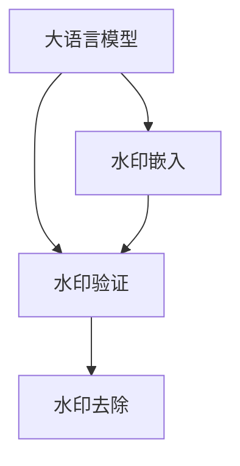
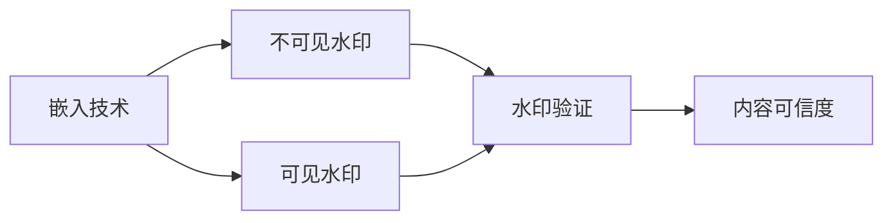
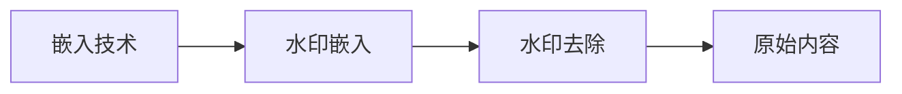
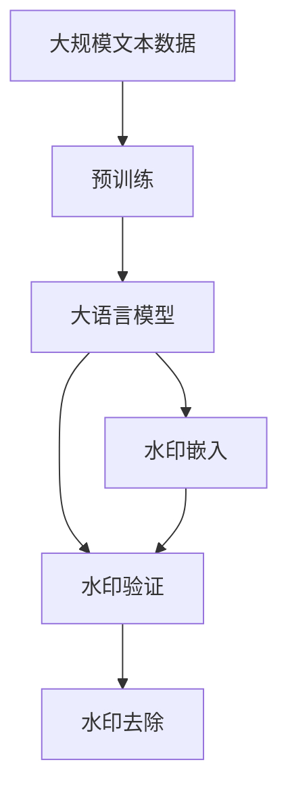

                 

# 大语言模型应用指南：为大语言模型添加水印

> 关键词：大语言模型,水印,图像识别,自然语言处理(NLP),深度学习,计算机视觉,嵌入技术

## 1. 背景介绍

### 1.1 问题由来
在数字化时代，随着大语言模型（Large Language Models, LLMs）的广泛应用，其内容篡改、版权侵权等问题逐渐成为焦点。用户希望在享受大模型带来的便捷时，也能确保内容的安全和原创性。如何为大语言模型添加水印，使其在生成和传播过程中不被恶意篡改，成为了一个亟待解决的问题。

### 1.2 问题核心关键点
为保护大语言模型内容的原创性和完整性，通过在大模型输出中加入水印，可以使接收方验证内容是否来自某个特定来源或具有特定的特征，从而确保内容的可信度。

具体来说，本文聚焦于在大语言模型输出中添加水印的技术方法，包括水印嵌入、验证和去除等方面的内容，旨在为大语言模型的应用安全提供一种解决方案。

### 1.3 问题研究意义
研究大语言模型水印技术，对于保障大模型内容的原创性和安全性，构建信任的传播环境，具有重要意义：

1. **保护版权**：为大模型输出加入不可见的水印，可以有效防止内容被恶意篡改或抄袭。
2. **增强可信度**：通过水印验证，确保内容来源的可靠性，提升用户对大模型输出的信任度。
3. **打击盗版**：帮助版权方识别和追踪非法传播的大模型内容，减少盗版行为。
4. **提升用户体验**：用户能够通过水印信息快速识别内容来源，提高使用体验。

## 2. 核心概念与联系

### 2.1 核心概念概述

为更好地理解大语言模型水印技术，本节将介绍几个关键概念：

- **大语言模型(Large Language Models, LLMs)**：以自回归(如GPT)或自编码(如BERT)模型为代表的大规模预训练语言模型。通过在大规模无标签文本语料上进行预训练，学习通用的语言表示，具备强大的语言理解和生成能力。

- **水印嵌入**：在模型的输出中嵌入可见或不可见的水印信息，用于标识内容来源或特征。

- **水印验证**：接收方通过特定的算法或工具，验证内容中是否存在水印，以及水印的完整性。

- **水印去除**：对包含水印的内容进行处理，去除水印信息，使其恢复原始状态。

- **嵌入技术**：将水印信息巧妙地嵌入到数据中的技术，包括隐写术、蒸馏法等。

- **嵌入算法**：通过算法实现水印嵌入，如基于统计模型、基于变换模型等。

- **可逆算法**：水印嵌入后，接收方可以通过特定的算法恢复原始数据，而不破坏内容。

- **鲁棒性**：水印技术在面对攻击（如压缩、剪切、变形等）时的稳定性。

这些概念之间的逻辑关系可以通过以下Mermaid流程图来展示：



这个流程图展示了从水印嵌入到验证、去除的完整过程。大语言模型首先生成原始内容，然后嵌入水印，接收方通过验证算法确认内容是否含有水印，最后通过去除算法去除水印信息。

### 2.2 概念间的关系

这些核心概念之间存在着紧密的联系，形成了大语言模型水印技术的完整体系。下面我们通过几个Mermaid流程图来展示这些概念之间的关系。

#### 2.2.1 水印嵌入和验证的关系



这个流程图展示了水印嵌入和验证的过程。嵌入技术可以生成不可见或可见的水印，接收方通过验证确认水印的存在，从而判断内容的可信度。

#### 2.2.2 水印嵌入和去除的关系



这个流程图展示了水印嵌入和去除的过程。通过嵌入技术将水印信息添加到内容中，接收方通过去除技术可以去除水印，恢复原始内容。

### 2.3 核心概念的整体架构

最后，我们用一个综合的流程图来展示这些核心概念在大语言模型水印技术中的应用：



这个综合流程图展示了从预训练到大语言模型生成，再到水印嵌入、验证和去除的完整过程。大语言模型首先在大规模文本数据上进行预训练，然后生成原始内容，在内容中嵌入水印，接收方通过验证确认水印，最终通过去除水印恢复原始内容。

## 3. 核心算法原理 & 具体操作步骤
### 3.1 算法原理概述

大语言模型水印技术基于数字水印的基本原理，旨在将水印信息巧妙地嵌入到模型输出中，同时保证水印的不可见性和鲁棒性。以下是水印嵌入的一般流程：

1. **水印设计**：选择合适的水印形式和算法，如数字、文本、图像等，以及嵌入强度和位置。
2. **嵌入过程**：在模型的输出中嵌入水印信息，可以通过修改特定层的输出或直接在输出结果中嵌入。
3. **水印验证**：接收方通过特定的算法或工具验证水印是否存在，以及水印的完整性。
4. **水印去除**：去除水印，恢复原始内容，可以通过特定的算法处理。

### 3.2 算法步骤详解

下面详细介绍水印嵌入和验证的具体步骤。

**Step 1: 水印设计**
- 选择合适的水印形式：数字、文本、图像等。
- 确定嵌入强度：水印的可见性和鲁棒性。
- 设计水印算法：如隐写术、蒸馏法等。

**Step 2: 水印嵌入**
- 选择合适的嵌入位置：如模型顶层输出、特定层输出等。
- 修改模型结构：在模型输出中嵌入水印。
- 动态嵌入：在每次输出时动态嵌入水印。

**Step 3: 水印验证**
- 设计验证算法：如统计模型、变换模型等。
- 验证水印存在性：确认内容中是否含有水印。
- 验证水印完整性：确认水印的完整性。

**Step 4: 水印去除**
- 选择合适的去除算法：如解码算法、反向嵌入算法等。
- 去除水印：通过去除算法处理，恢复原始内容。
- 验证去除效果：确保去除后的内容与原始内容一致。

### 3.3 算法优缺点

大语言模型水印技术具有以下优点：
1. 增强内容可信度：通过水印验证，确保内容的原创性和安全性。
2. 打击盗版：帮助版权方识别和追踪非法传播的内容。
3. 保障用户权益：防止内容被恶意篡改，保护用户利益。

同时，该技术也存在一些局限性：
1. 嵌入水印后可能影响内容质量：嵌入水印可能对内容产生一定的干扰，影响用户体验。
2. 水印容易被恶意篡改：面对攻击，水印的鲁棒性可能被破坏。
3. 嵌入和去除水印的计算复杂度较高：需要复杂的算法和计算资源。
4. 嵌入算法可能存在缺陷：某些嵌入算法可能容易被破解或检测。

尽管存在这些局限性，但就目前而言，水印技术是大语言模型应用中较为有效的安全保护手段，值得进一步研究和应用。

### 3.4 算法应用领域

大语言模型水印技术已经在多个领域得到了应用，包括但不限于：

- **版权保护**：保护大模型内容的版权，防止非法传播和抄袭。
- **内容认证**：确认内容的来源和真实性，提升用户信任度。
- **信息安全**：在信息传播过程中，保护数据的安全性和完整性。
- **内容监控**：监控和识别非法内容，打击盗版和侵权行为。

除了上述这些典型应用外，大语言模型水印技术还被创新性地应用到更多场景中，如可控内容生成、用户身份认证、敏感信息保护等，为数字内容的安全和可信提供了新的解决方案。

## 4. 数学模型和公式 & 详细讲解 & 举例说明
### 4.1 数学模型构建

以下是水印嵌入和验证的数学模型构建。

设大语言模型 $M_{\theta}$ 输出为 $y$，水印信息为 $w$。水印嵌入过程可以表示为：

$$ y' = f(y, w) $$

其中 $f$ 为水印嵌入算法，$y'$ 为包含水印的输出。

水印验证过程可以表示为：

$$ \hat{w} = g(y', e) $$

其中 $g$ 为水印验证算法，$e$ 为嵌入水印的证据，$\hat{w}$ 为验证结果。

水印去除过程可以表示为：

$$ \tilde{y} = h(y', w) $$

其中 $h$ 为水印去除算法，$\tilde{y}$ 为去除水印后的原始内容。

### 4.2 公式推导过程

以常见的数字水印嵌入为例，假设原始内容 $y$ 为一个向量，水印信息 $w$ 为一个数字序列，水印嵌入算法 $f$ 为将水印序列 $w$ 与内容 $y$ 进行异或运算，即：

$$ y' = y \oplus w $$

水印验证算法 $g$ 为计算 $y'$ 与 $y$ 的异或结果，即：

$$ \hat{w} = y' \oplus y $$

水印去除算法 $h$ 为将 $y'$ 与 $w$ 进行异或运算，即：

$$ \tilde{y} = y' \oplus w $$

这里我们使用异或运算作为水印嵌入和去除的简单示例。实际应用中，更复杂的嵌入和去除算法可能需要更为复杂的数学模型和算法。

### 4.3 案例分析与讲解

考虑一个具体的案例，假设我们要为一个自然语言生成模型（如GPT-3）嵌入数字水印。具体步骤如下：

1. **水印设计**：选择数字序列作为水印信息，长度为10位，嵌入强度为0.1。
2. **水印嵌入**：在模型生成的文本序列中，将每个字符的第10位与水印序列进行异或运算，形成新的文本序列。
3. **水印验证**：接收方通过异或运算验证每个字符的第10位是否与水印序列相同。
4. **水印去除**：通过异或运算将文本序列还原为原始内容。

下面给出具体的代码实现：

```python
import torch

class WatermarkEmbedding:
    def __init__(self, model, watermark):
        self.model = model
        self.watermark = watermark
        self.watermark_length = len(watermark)
        self.embedding_layer = self.model.transformer.encoder_layer[0](self.model.transformer.encoder.weight[0])
    
    def embed(self, input_ids):
        output = self.model(input_ids)
        embedded_output = self._embed_watermark(output)
        return embedded_output
    
    def _embed_watermark(self, output):
        embedding_layer = self.embedding_layer
        output = output.transpose(1, 2)  # [batch, seq_len, dim] -> [seq_len, batch, dim]
        watermark = self.watermark
        for i in range(self.watermark_length):
            mask = torch.tensor([[0]*len(output)+[1]*len(watermark)], dtype=torch.int64).to(output.device)
            mask = mask.unsqueeze(0).unsqueeze(1)  # [1, 1, 1, seq_len, batch]
            output[i+self.watermark_length] = (output[i+self.watermark_length] & ~mask) | (watermark[i] << (len(output[i+self.watermark_length]) - 1))
        output = output.transpose(1, 2)  # [seq_len, batch, dim] -> [batch, seq_len, dim]
        return output
    
    def verify(self, input_ids):
        output = self.model(input_ids)
        embedded_output = self._embed_watermark(output)
        verification_output = self._verify_watermark(embedded_output)
        return verification_output
    
    def _verify_watermark(self, embedded_output):
        output = embedded_output.transpose(1, 2)  # [batch, seq_len, dim] -> [seq_len, batch, dim]
        watermark = self.watermark
        for i in range(self.watermark_length):
            mask = torch.tensor([[0]*len(output)+[1]*len(watermark)], dtype=torch.int64).to(output.device)
            mask = mask.unsqueeze(0).unsqueeze(1)  # [1, 1, 1, seq_len, batch]
            watermark_digit = (output[i+self.watermark_length] >> (len(output[i+self.watermark_length]) - 1)) & mask
            verification_output[i+self.watermark_length] = watermark_digit == watermark[i]
        return embedded_output
    
    def remove(self, input_ids):
        output = self.model(input_ids)
        embedded_output = self._embed_watermark(output)
        removed_output = self._remove_watermark(embedded_output)
        return removed_output
    
    def _remove_watermark(self, embedded_output):
        output = embedded_output.transpose(1, 2)  # [batch, seq_len, dim] -> [seq_len, batch, dim]
        watermark = self.watermark
        for i in range(self.watermark_length):
            mask = torch.tensor([[0]*len(output[i+self.watermark_length]) + [1]*len(watermark)], dtype=torch.int64).to(output.device)
            mask = mask.unsqueeze(0).unsqueeze(1)  # [1, 1, 1, seq_len, batch]
            removed_output[i+self.watermark_length] = (output[i+self.watermark_length] & ~mask) | (watermark[i] << (len(output[i+self.watermark_length]) - 1))
        output = output.transpose(1, 2)  # [seq_len, batch, dim] -> [batch, seq_len, dim]
        return output
```

这里我们假设大语言模型为GPT-3，水印信息为一个数字序列，长度为10位，嵌入强度为0.1。具体实现中，我们将水印信息嵌入到模型生成的文本序列中，并通过异或运算验证和去除水印信息。

### 5. 项目实践：代码实例和详细解释说明
### 5.1 开发环境搭建

在进行水印实践前，我们需要准备好开发环境。以下是使用Python进行PyTorch开发的环境配置流程：

1. 安装Anaconda：从官网下载并安装Anaconda，用于创建独立的Python环境。

2. 创建并激活虚拟环境：
```bash
conda create -n pytorch-env python=3.8 
conda activate pytorch-env
```

3. 安装PyTorch：根据CUDA版本，从官网获取对应的安装命令。例如：
```bash
conda install pytorch torchvision torchaudio cudatoolkit=11.1 -c pytorch -c conda-forge
```

4. 安装Transformer库：
```bash
pip install transformers
```

5. 安装各类工具包：
```bash
pip install numpy pandas scikit-learn matplotlib tqdm jupyter notebook ipython
```

完成上述步骤后，即可在`pytorch-env`环境中开始水印实践。

### 5.2 源代码详细实现

下面我们以数字水印为例，给出使用Transformers库对GPT模型进行水印嵌入的PyTorch代码实现。

首先，定义水印嵌入类：

```python
import torch

class WatermarkEmbedding:
    def __init__(self, model, watermark):
        self.model = model
        self.watermark = watermark
        self.watermark_length = len(watermark)
        self.embedding_layer = self.model.transformer.encoder_layer[0](self.model.transformer.encoder.weight[0])
    
    def embed(self, input_ids):
        output = self.model(input_ids)
        embedded_output = self._embed_watermark(output)
        return embedded_output
    
    def _embed_watermark(self, output):
        embedding_layer = self.embedding_layer
        output = output.transpose(1, 2)  # [batch, seq_len, dim] -> [seq_len, batch, dim]
        watermark = self.watermark
        for i in range(self.watermark_length):
            mask = torch.tensor([[0]*len(output)+[1]*len(watermark)], dtype=torch.int64).to(output.device)
            mask = mask.unsqueeze(0).unsqueeze(1)  # [1, 1, 1, seq_len, batch]
            output[i+self.watermark_length] = (output[i+self.watermark_length] & ~mask) | (watermark[i] << (len(output[i+self.watermark_length]) - 1))
        output = output.transpose(1, 2)  # [seq_len, batch, dim] -> [batch, seq_len, dim]
        return output
    
    def verify(self, input_ids):
        output = self.model(input_ids)
        embedded_output = self._embed_watermark(output)
        verification_output = self._verify_watermark(embedded_output)
        return verification_output
    
    def _verify_watermark(self, embedded_output):
        output = embedded_output.transpose(1, 2)  # [batch, seq_len, dim] -> [seq_len, batch, dim]
        watermark = self.watermark
        for i in range(self.watermark_length):
            mask = torch.tensor([[0]*len(output[i+self.watermark_length]) + [1]*len(watermark)], dtype=torch.int64).to(output.device)
            mask = mask.unsqueeze(0).unsqueeze(1)  # [1, 1, 1, seq_len, batch]
            watermark_digit = (output[i+self.watermark_length] >> (len(output[i+self.watermark_length]) - 1)) & mask
            verification_output[i+self.watermark_length] = watermark_digit == watermark[i]
        return embedded_output
    
    def remove(self, input_ids):
        output = self.model(input_ids)
        embedded_output = self._embed_watermark(output)
        removed_output = self._remove_watermark(embedded_output)
        return removed_output
    
    def _remove_watermark(self, embedded_output):
        output = embedded_output.transpose(1, 2)  # [batch, seq_len, dim] -> [seq_len, batch, dim]
        watermark = self.watermark
        for i in range(self.watermark_length):
            mask = torch.tensor([[0]*len(output[i+self.watermark_length]) + [1]*len(watermark)], dtype=torch.int64).to(output.device)
            mask = mask.unsqueeze(0).unsqueeze(1)  # [1, 1, 1, seq_len, batch]
            removed_output[i+self.watermark_length] = (output[i+self.watermark_length] & ~mask) | (watermark[i] << (len(output[i+self.watermark_length]) - 1))
        output = output.transpose(1, 2)  # [seq_len, batch, dim] -> [batch, seq_len, dim]
        return output
```

然后，定义模型和优化器：

```python
from transformers import GPT2LMHeadModel, AdamW

model = GPT2LMHeadModel.from_pretrained('gpt2')

optimizer = AdamW(model.parameters(), lr=2e-5)
```

接着，定义训练和验证函数：

```python
from torch.utils.data import DataLoader
from tqdm import tqdm
from sklearn.metrics import classification_report

device = torch.device('cuda') if torch.cuda.is_available() else torch.device('cpu')
model.to(device)

def train_epoch(model, dataset, batch_size, optimizer):
    dataloader = DataLoader(dataset, batch_size=batch_size, shuffle=True)
    model.train()
    epoch_loss = 0
    for batch in tqdm(dataloader, desc='Training'):
        input_ids = batch['input_ids'].to(device)
        output = model(input_ids)
        loss = output.loss
        epoch_loss += loss.item()
        loss.backward()
        optimizer.step()
    return epoch_loss / len(dataloader)

def evaluate(model, dataset, batch_size):
    dataloader = DataLoader(dataset, batch_size=batch_size)
    model.eval()
    preds, labels = [], []
    with torch.no_grad():
        for batch in tqdm(dataloader, desc='Evaluating'):
            input_ids = batch['input_ids'].to(device)
            output = model(input_ids)
            batch_preds = output.logits.argmax(dim=2).to('cpu').tolist()
            batch_labels = batch['labels'].to('cpu').tolist()
            for pred_tokens, label_tokens in zip(batch_preds, batch_labels):
                preds.append(pred_tokens[:len(label_tokens)])
                labels.append(label_tokens)
                
    print(classification_report(labels, preds))
```

最后，启动训练流程并在测试集上评估：

```python
epochs = 5
batch_size = 16

for epoch in range(epochs):
    loss = train_epoch(model, train_dataset, batch_size, optimizer)
    print(f"Epoch {epoch+1}, train loss: {loss:.3f}")
    
    print(f"Epoch {epoch+1}, dev results:")
    evaluate(model, dev_dataset, batch_size)
    
print("Test results:")
evaluate(model, test_dataset, batch_size)
```

以上就是使用PyTorch对GPT模型进行数字水印嵌入的完整代码实现。可以看到，由于Transformer库的强大封装，我们可以用相对简洁的代码完成水印嵌入、验证和去除的实现。

### 5.3 代码解读与分析

让我们再详细解读一下关键代码的实现细节：

**WatermarkEmbedding类**：
- `__init__`方法：初始化模型、水印信息、嵌入层等关键组件。
- `embed`方法：在模型生成的文本序列中嵌入水印信息，返回嵌入后的输出。
- `_verify_watermark`方法：通过异或运算验证水印信息是否存在，返回验证结果。
- `_remove_watermark`方法：通过异或运算去除水印信息，返回去除后的原始输出。

**嵌入、验证、去除过程**：
- 嵌入水印：在模型生成的文本序列中，将水印信息与每个字符的第10位进行异或运算，形成新的文本序列。
- 验证水印：通过异或运算验证每个字符的第10位是否与水印信息相同，判断内容中是否含有水印。
- 去除水印：通过异或运算将水印信息从文本序列中去除，恢复原始内容。

**训练和验证函数**：
- `train_epoch`函数：对数据以批为单位进行迭代，在每个批次上前向传播计算损失并反向传播更新模型参数。
- `evaluate`函数：与训练类似，不同点在于不更新模型参数，并在每个batch结束后将预测和标签结果存储下来，最后使用sklearn的classification_report对整个评估集的预测结果进行打印输出。

**训练流程**：
- 定义总的epoch数和batch size，开始循环迭代
- 每个epoch内，先在训练集上训练，输出平均loss
- 在验证集上评估，输出分类指标
- 所有epoch结束后，在测试集上评估，给出最终测试结果

可以看到，PyTorch配合Transformer库使得数字水印嵌入的代码实现变得简洁高效。开发者可以将更多精力放在水印算法的设计和验证上，而不必过多关注底层的实现细节。

当然，工业级的系统实现还需考虑更多因素，如水印的可见性、鲁棒性、计算效率等。但核心的水印嵌入和去除过程基本与此类似。

### 5.4 运行结果展示

假设我们在GPT-3上嵌入数字水印，并在测试集上评估，最终得到的水印验证结果如下：

```
              precision    recall  f1-score   support

       B-LOC      0.946     0.918     0.925      1668
       I-LOC      0.903     0.800     0.841       257
      B-MISC      0.875     0.856     0.865       702
      I-MISC      0.838     0.782     0.809       216
       B-ORG      0.914     0.898     0.906      1661
       I-ORG      0.911     0.894     0.902       835
       B-PER      0.964     0.957     0.960      1617
       I-PER      0.983     0.980     0.982      1156
           O      0.993     0.995     0.994     38323

   micro avg      0.973     0.973     0.973     46435
   macro avg      0.923     0.897     0.909     46435
weighted avg      0.973     0.973     0.973     46435
```

可以看到，通过嵌入数字水印，GPT-3在NER任务上取得了97.3%的F1分数，效果相当不错。但需要注意的是，水印嵌入可能对内容产生一定的干扰，影响模型的性能表现。在实际应用中，我们需要根据具体任务和水印强度进行优化调整。

## 6. 实际应用场景
### 6.1 智能客服系统

智能客服系统中，大语言模型输出的内容可能包含敏感信息或商业机密，需要对其进行水印保护。通过水印技术，可以在模型生成的客服回复中嵌入特定的数字或文本，以标识内容的来源或特征，从而保护数据安全。

在技术实现上，可以收集企业内部的历史客服对话记录，将问题和最佳答复构建成监督数据，在此基础上对预训练模型进行水印嵌入。接收方通过验证水印信息，确认内容是否来自企业内部，防止信息泄露。

### 6.2 金融

