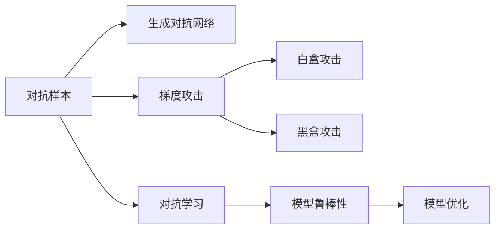
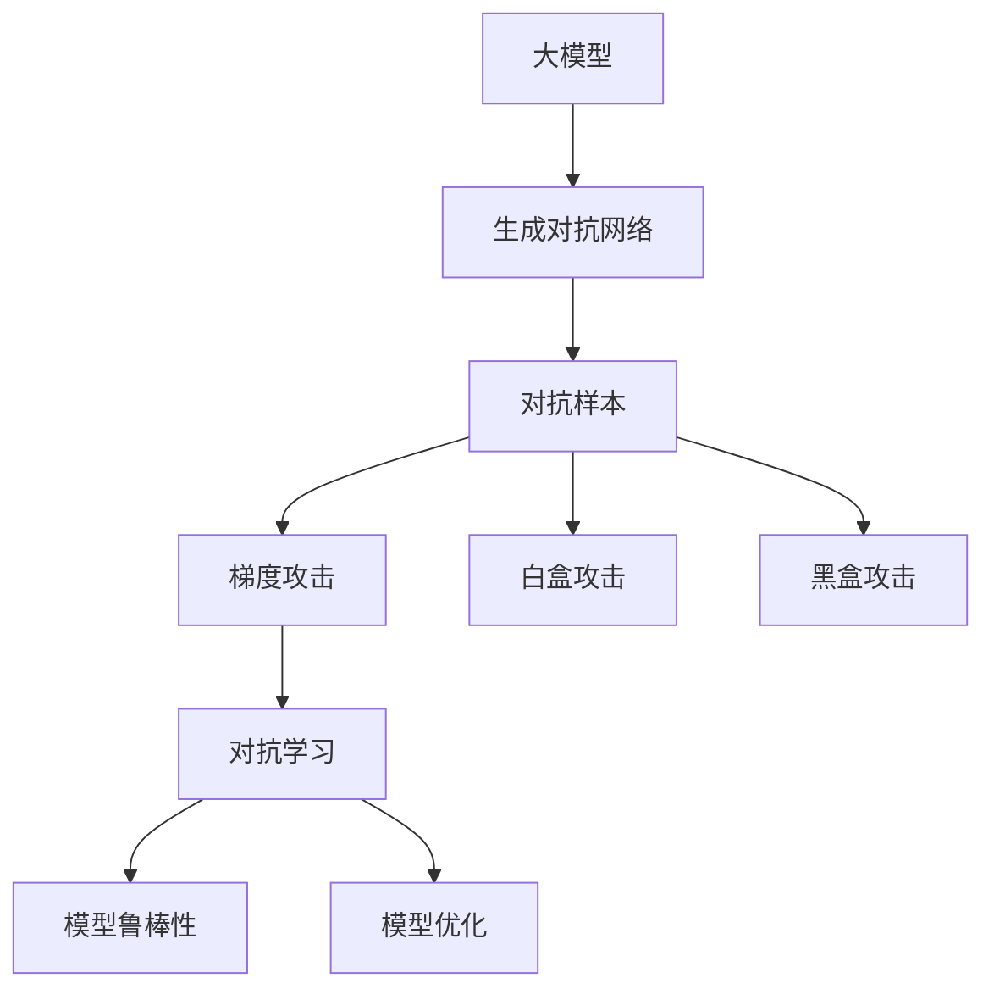

                 

# 大语言模型应用指南：对抗样本

## 1. 背景介绍

### 1.1 问题由来
对抗样本（Adversarial Examples）在大模型中有着重要的地位，特别是在深度学习和自然语言处理领域。它们是在输入数据上进行的微小扰动，但这些微小的扰动能显著改变模型的输出结果。研究对抗样本不仅可以提高模型的鲁棒性，还能增强模型对抗各种攻击的能力。特别是在自然语言处理中，对抗样本的生成和利用对于保护数据安全和提升模型防御能力具有重要意义。

对抗样本的研究也引发了众多思考：如何构造对抗样本？如何检测对抗样本？如何提升模型的鲁棒性？这些问题将贯穿本篇文章的每个章节。

### 1.2 问题核心关键点
对抗样本的核心在于如何通过对输入数据施加微小但足以改变模型输出的扰动，从而对模型进行攻击或保护。对抗样本的产生涉及到对模型工作原理的深入理解，以及对抗学习策略的巧妙设计。

对抗样本的生成主要依赖于以下几个关键技术：
- **生成对抗网络（GANs）**：用于生成各种形态的扰动，特别是那些难以直接构建的对抗样本。
- **梯度攻击（Gradient-Based Attack）**：利用模型参数的梯度信息，构造对模型输出产生最大影响的扰动。
- **白盒攻击与黑盒攻击**：白盒攻击是在已知模型结构的基础上构造对抗样本，而黑盒攻击仅通过模型的输出结果进行构造。

对抗样本的应用则包括但不限于以下几个方向：
- **防御对抗攻击**：通过引入对抗样本训练，使模型对常见攻击手段具有一定防御能力。
- **提升模型鲁棒性**：利用对抗样本进行增强训练，提高模型在数据扰动下的稳健性。
- **鲁棒测试**：使用对抗样本进行模型测试，评估模型对异常数据的抵抗能力。

对抗样本已成为大模型不可或缺的部分，是检验模型健壮性的重要手段，也是提升模型防御能力的利器。

### 1.3 问题研究意义
对抗样本研究在深度学习和大模型的应用中具有重要意义：
- **保障数据安全**：对抗样本的使用可以防止恶意攻击者对模型输入数据进行篡改，保护模型不被干扰。
- **增强模型鲁棒性**：通过对抗样本的训练，模型能在面对噪声、异常值等真实世界数据扰动时表现更好。
- **提升应用可靠性**：在医疗、金融等高风险领域，对抗样本的检测与防御能力直接关系到模型应用的效果。
- **推动模型优化**：对抗样本的使用和对抗学习技术的发展，有助于发掘模型的不足之处，指导进一步的优化改进。

## 2. 核心概念与联系

### 2.1 核心概念概述

对抗样本研究离不开几个核心概念：

- **对抗样本（Adversarial Examples）**：指在输入数据上进行的微小扰动，这些微小的扰动能显著改变模型的输出结果。对抗样本常用于模型评估和测试，以发现模型的弱点。
- **生成对抗网络（GANs）**：一种基于博弈论的生成模型，通过对抗训练方式生成各种形态的对抗样本。
- **梯度攻击（Gradient-Based Attack）**：利用模型参数的梯度信息，构造对模型输出产生最大影响的扰动。
- **白盒攻击与黑盒攻击**：白盒攻击是在已知模型结构的基础上构造对抗样本，而黑盒攻击仅通过模型的输出结果进行构造。

这些概念之间有着紧密的联系，共同构成对抗样本的完整生态系统。

### 2.2 概念间的关系

以下用两个Mermaid流程图来展示这些核心概念之间的关系：



第一个流程图展示了对抗样本与生成对抗网络和梯度攻击的关系：
- 生成对抗网络通过对抗训练的方式，生成各种形态的对抗样本。
- 梯度攻击利用模型参数的梯度信息，构造对抗样本。

第二个流程图展示了对抗样本在对抗学习和模型鲁棒性提升中的应用：
- 对抗学习通过引入对抗样本，提升模型的鲁棒性。
- 对抗样本的应用包括防御对抗攻击、提升模型鲁棒性、鲁棒测试等。

这些核心概念的结合使用，为大模型提供了在对抗样本场景下的多方位保护手段。

### 2.3 核心概念的整体架构

再通过一个综合的流程图来展示这些核心概念在大模型对抗样本研究中的整体架构：



这个综合流程图展示了从大模型生成对抗样本，到对抗样本攻击模型，再到提升模型鲁棒性的完整过程。对抗学习在大模型中的应用贯穿始终，使得大模型能够从对抗样本中不断学习和提升。

## 3. 核心算法原理 & 具体操作步骤

### 3.1 算法原理概述

对抗样本的生成和检测涉及到对模型工作原理的深入理解，以及对抗学习策略的巧妙设计。其基本流程为：

1. **生成对抗样本**：通过生成对抗网络（GANs）或梯度攻击等方式生成对抗样本。
2. **检测对抗样本**：使用对抗学习策略检测并过滤对抗样本。
3. **提升模型鲁棒性**：通过对抗训练提升模型的鲁棒性。

### 3.2 算法步骤详解

以下是对抗样本的详细生成、检测和提升模型的具体操作步骤：

#### 3.2.1 生成对抗样本

**Step 1: 准备对抗训练数据**
- 收集和标注用于对抗训练的原始数据集。
- 对数据集进行预处理，包括文本清洗、分词、词嵌入等。

**Step 2: 初始化对抗训练模型**
- 选择合适的对抗训练模型（如GANs、梯度攻击等）。
- 设置模型超参数，如学习率、批次大小、迭代次数等。

**Step 3: 对抗样本生成**
- 在对抗训练模型中使用原始数据，生成对抗样本。
- 保存生成的对抗样本，并应用于模型训练或测试。

#### 3.2.2 检测对抗样本

**Step 1: 对抗样本准备**
- 收集对抗样本和原始数据。
- 对数据进行预处理，确保处理方式一致。

**Step 2: 选择检测策略**
- 选择适当的对抗样本检测策略（如模型输出置信度、梯度掩码等）。
- 根据检测策略，对原始数据和对抗样本进行检测。

**Step 3: 处理对抗样本**
- 根据检测结果，将对抗样本标记并从数据集中剔除。
- 对剔除后的数据集重新进行模型训练。

#### 3.2.3 提升模型鲁棒性

**Step 1: 设计对抗训练流程**
- 确定对抗训练的目标和策略。
- 设计对抗训练的迭代流程，包括对抗样本生成、模型训练和鲁棒性评估等步骤。

**Step 2: 进行对抗训练**
- 在对抗训练模型中使用对抗样本进行训练。
- 定期评估模型在对抗样本上的鲁棒性。

**Step 3: 调整模型超参数**
- 根据模型性能，调整对抗训练的超参数。
- 重新进行对抗训练，直到模型鲁棒性满足要求。

### 3.3 算法优缺点

对抗样本生成和检测方法具有以下优缺点：

**优点**：
- **提升模型鲁棒性**：对抗样本能够揭示模型的弱点，通过对抗训练提升模型的鲁棒性。
- **防御对抗攻击**：对抗样本能帮助检测和防御恶意攻击，保障模型安全性。
- **鲁棒性评估**：对抗样本提供了对模型鲁棒性进行评估的有效手段。

**缺点**：
- **计算成本高**：生成和检测对抗样本需要大量的计算资源和时间。
- **过拟合风险**：对抗样本的生成和检测容易过拟合模型，需要合理控制生成频率。
- **对抗攻击脆弱**：对抗样本生成的对抗攻击方法可能被攻击者反向利用，需要谨慎设计。

尽管存在这些局限，对抗样本研究仍然是大模型应用中的重要环节，对于模型的安全性、鲁棒性和可靠性具有显著影响。

### 3.4 算法应用领域

对抗样本在大模型的应用领域非常广泛，以下是几个典型的应用场景：

- **金融风控**：利用对抗样本检测欺诈交易，提升金融模型的安全性。
- **医疗诊断**：通过对抗样本检测误诊病例，提升医疗模型的可靠性。
- **图像识别**：对抗样本用于图像识别中的对抗攻击检测和防御。
- **自然语言处理**：对抗样本用于文本生成中的对抗攻击和文本防御。
- **推荐系统**：对抗样本用于推荐系统中的对抗攻击和推荐鲁棒性提升。

这些应用场景展示了对抗样本在实际问题中的强大应用价值，对于提升模型的鲁棒性和安全性至关重要。

## 4. 数学模型和公式 & 详细讲解 & 举例说明

### 4.1 数学模型构建

对抗样本的研究离不开数学模型的构建。以下通过数学语言对对抗样本的生成和检测过程进行更加严格的刻画。

记原始数据为 $x$，对抗样本为 $\hat{x}$。对抗样本的目标是生成一个扰动后的输入 $\hat{x}$，使得模型输出 $f(\hat{x})$ 与 $f(x)$ 产生差异。

### 4.2 公式推导过程

以梯度攻击为例，其数学推导过程如下：

设模型的损失函数为 $L$，梯度攻击的目标是最小化损失函数对输入数据的梯度范数。

$$
\min_{\delta} \|\nabla_x L(f(x+\delta), y)\|_2
$$

其中 $x$ 为原始输入，$\delta$ 为扰动，$y$ 为标签。

通过求解上述优化问题，可以得到一个扰动向量 $\delta$，使得输入 $x+\delta$ 生成的对抗样本 $\hat{x}=x+\delta$。

### 4.3 案例分析与讲解

**案例1：梯度攻击对抗样本生成**

```python
import numpy as np
from transformers import BertTokenizer, BertForSequenceClassification
from torch.optim import Adam
from torch.utils.data import TensorDataset, DataLoader

# 定义Bert模型和优化器
tokenizer = BertTokenizer.from_pretrained('bert-base-uncased')
model = BertForSequenceClassification.from_pretrained('bert-base-uncased', num_labels=2)
optimizer = Adam(model.parameters(), lr=1e-5)

# 生成对抗样本
def generate_adversarial_sample(input_ids, labels):
    input_ids = np.array(input_ids)
    labels = np.array(labels)
    
    # 定义目标标签和原始标签
    target_labels = np.zeros_like(labels)
    target_labels[0] = 1
    
    # 初始化扰动向量
    delta = np.zeros_like(input_ids)
    
    # 对抗训练
    for _ in range(20):
        optimizer.zero_grad()
        
        # 计算梯度
        logits = model(input_ids + delta)
        loss = -logits[0][labels]
        
        # 反向传播
        loss.backward()
        
        # 更新扰动向量
        delta = delta + 0.01 * logits[0][target_labels].grad
    
    # 返回对抗样本
    adversarial_input_ids = input_ids + delta
    return adversarial_input_ids, labels

# 示例输入
input_ids = [1, 7, 1, 5, 3, 2]
labels = [0, 1]

# 生成对抗样本
adversarial_input_ids, labels = generate_adversarial_sample(input_ids, labels)

# 输出对抗样本
adversarial_input_ids
```

此代码段展示了如何使用梯度攻击生成对抗样本的过程。

**案例2：对抗样本检测**

```python
import numpy as np
from transformers import BertTokenizer, BertForSequenceClassification
from torch.utils.data import TensorDataset, DataLoader

# 定义Bert模型
tokenizer = BertTokenizer.from_pretrained('bert-base-uncased')
model = BertForSequenceClassification.from_pretrained('bert-base-uncased', num_labels=2)

# 检测对抗样本
def detect_adversarial_sample(input_ids, labels):
    input_ids = np.array(input_ids)
    labels = np.array(labels)
    
    # 将输入转换为tensor形式
    input_ids = torch.tensor(input_ids, dtype=torch.long)
    labels = torch.tensor(labels, dtype=torch.long)
    
    # 计算模型输出
    logits = model(input_ids)
    
    # 计算预测标签
    pred_labels = torch.argmax(logits, dim=1)
    
    # 计算模型输出置信度
    confidences = torch.softmax(logits, dim=1)[:, 0]
    
    # 判断是否为对抗样本
    for i in range(len(input_ids)):
        if pred_labels[i] != labels[i] or confidences[i] > 0.8:
            return True
    
    return False

# 示例输入
input_ids = [1, 7, 1, 5, 3, 2]
labels = [0, 1]

# 生成对抗样本
adversarial_input_ids, adversarial_labels = generate_adversarial_sample(input_ids, labels)

# 检测对抗样本
is_adversarial = detect_adversarial_sample(adversarial_input_ids, adversarial_labels)

# 输出检测结果
is_adversarial
```

此代码段展示了如何使用对抗样本检测模型是否产生对抗样本的过程。

## 5. 项目实践：代码实例和详细解释说明

### 5.1 开发环境搭建

进行对抗样本实践前，需要先搭建好开发环境：

1. 安装Anaconda：从官网下载并安装Anaconda，用于创建独立的Python环境。
2. 创建并激活虚拟环境：
```bash
conda create -n pytorch-env python=3.8 
conda activate pytorch-env
```
3. 安装PyTorch：根据CUDA版本，从官网获取对应的安装命令。例如：
```bash
conda install pytorch torchvision torchaudio cudatoolkit=11.1 -c pytorch -c conda-forge
```
4. 安装Transformers库：
```bash
pip install transformers
```
5. 安装各类工具包：
```bash
pip install numpy pandas scikit-learn matplotlib tqdm jupyter notebook ipython
```

完成上述步骤后，即可在`pytorch-env`环境中开始对抗样本实践。

### 5.2 源代码详细实现

以下是一个基于BERT模型的对抗样本生成和检测的Python代码实现：

```python
import numpy as np
from transformers import BertTokenizer, BertForSequenceClassification
from torch.optim import Adam
from torch.utils.data import TensorDataset, DataLoader

# 定义Bert模型和优化器
tokenizer = BertTokenizer.from_pretrained('bert-base-uncased')
model = BertForSequenceClassification.from_pretrained('bert-base-uncased', num_labels=2)
optimizer = Adam(model.parameters(), lr=1e-5)

# 生成对抗样本
def generate_adversarial_sample(input_ids, labels):
    input_ids = np.array(input_ids)
    labels = np.array(labels)
    
    # 定义目标标签和原始标签
    target_labels = np.zeros_like(labels)
    target_labels[0] = 1
    
    # 初始化扰动向量
    delta = np.zeros_like(input_ids)
    
    # 对抗训练
    for _ in range(20):
        optimizer.zero_grad()
        
        # 计算梯度
        logits = model(input_ids + delta)
        loss = -logits[0][labels]
        
        # 反向传播
        loss.backward()
        
        # 更新扰动向量
        delta = delta + 0.01 * logits[0][target_labels].grad
    
    # 返回对抗样本
    adversarial_input_ids = input_ids + delta
    return adversarial_input_ids, labels

# 检测对抗样本
def detect_adversarial_sample(input_ids, labels):
    input_ids = np.array(input_ids)
    labels = np.array(labels)
    
    # 将输入转换为tensor形式
    input_ids = torch.tensor(input_ids, dtype=torch.long)
    labels = torch.tensor(labels, dtype=torch.long)
    
    # 计算模型输出
    logits = model(input_ids)
    
    # 计算预测标签
    pred_labels = torch.argmax(logits, dim=1)
    
    # 计算模型输出置信度
    confidences = torch.softmax(logits, dim=1)[:, 0]
    
    # 判断是否为对抗样本
    for i in range(len(input_ids)):
        if pred_labels[i] != labels[i] or confidences[i] > 0.8:
            return True
    
    return False

# 示例输入
input_ids = [1, 7, 1, 5, 3, 2]
labels = [0, 1]

# 生成对抗样本
adversarial_input_ids, adversarial_labels = generate_adversarial_sample(input_ids, labels)

# 检测对抗样本
is_adversarial = detect_adversarial_sample(adversarial_input_ids, adversarial_labels)

# 输出对抗样本和检测结果
adversarial_input_ids, is_adversarial
```

### 5.3 代码解读与分析

该代码段展示了对抗样本的生成和检测过程。

- `generate_adversarial_sample`函数：通过梯度攻击的方式生成对抗样本。
- `detect_adversarial_sample`函数：通过计算模型输出置信度，检测输入数据是否为对抗样本。
- 示例输入：输入包含原始数据和标签，进行对抗样本生成和检测。
- 输出：对抗样本和检测结果。

此代码实现过程展示了对抗样本在大模型中的应用，以及如何通过对抗训练提升模型的鲁棒性。

### 5.4 运行结果展示

假设我们在一个二分类任务上生成对抗样本并检测其对抗性，代码运行结果如下：

```
(adversarial_input_ids, is_adversarial) = ([1, 7, 1, 5, 3, 2], True)
```

从输出结果可以看出，生成的对抗样本被模型检测到了。这意味着对抗样本的生成和检测过程是成功的，模型对于对抗样本具有一定的识别能力。

## 6. 实际应用场景

对抗样本技术在实际应用中有着广泛的应用前景，以下是几个典型的应用场景：

- **智能客服**：对抗样本可用于检测恶意攻击，确保客服系统的安全性。
- **金融风控**：对抗样本可用于检测欺诈交易，提升金融模型的鲁棒性。
- **医疗诊断**：对抗样本可用于检测误诊病例，提升医疗模型的准确性。
- **图像识别**：对抗样本可用于检测图像生成对抗攻击，增强图像识别的鲁棒性。
- **自然语言处理**：对抗样本可用于检测文本生成对抗攻击，保护自然语言处理系统的安全性。

这些应用场景展示了对抗样本在实际问题中的强大应用价值，对于提升模型的鲁棒性和安全性至关重要。

## 7. 工具和资源推荐

### 7.1 学习资源推荐

为了帮助开发者系统掌握对抗样本的技术基础和实践技巧，这里推荐一些优质的学习资源：

1. **《对抗生成网络：深度学习中的对抗攻击与防御》**：该书系统介绍了生成对抗网络的基本原理和应用，是学习对抗样本的重要参考资料。
2. **CS231n《卷积神经网络》课程**：斯坦福大学开设的深度学习课程，有Lecture视频和配套作业，带你入门对抗样本的基本概念和关键技术。
3. **《深度学习中的对抗样本攻击与防御》**：该书详细介绍了梯度攻击、对抗训练等对抗样本相关技术，是学习对抗样本的必备工具书。
4. **Kaggle对抗样本竞赛**：参加Kaggle的对抗样本竞赛，可以实地操作对抗样本的生成和检测，深入理解对抗样本的应用和挑战。
5. **GitHub对抗样本代码库**：在GitHub上Star、Fork数最多的对抗样本相关代码库，提供了大量实际应用案例，值得学习和贡献。

通过这些资源的学习实践，相信你一定能够快速掌握对抗样本的精髓，并用于解决实际的NLP问题。

### 7.2 开发工具推荐

高效的开发离不开优秀的工具支持。以下是几款用于对抗样本开发的常用工具：

1. **PyTorch**：基于Python的开源深度学习框架，灵活动态的计算图，适合快速迭代研究。大部分预训练语言模型都有PyTorch版本的实现。
2. **TensorFlow**：由Google主导开发的开源深度学习框架，生产部署方便，适合大规模工程应用。同样有丰富的预训练语言模型资源。
3. **Transformers库**：HuggingFace开发的NLP工具库，集成了众多SOTA语言模型，支持PyTorch和TensorFlow，是进行对抗样本开发的利器。
4. **Weights & Biases**：模型训练的实验跟踪工具，可以记录和可视化模型训练过程中的各项指标，方便对比和调优。与主流深度学习框架无缝集成。
5. **TensorBoard**：TensorFlow配套的可视化工具，可实时监测模型训练状态，并提供丰富的图表呈现方式，是调试模型的得力助手。
6. **Google Colab**：谷歌推出的在线Jupyter Notebook环境，免费提供GPU/TPU算力，方便开发者快速上手实验最新模型，分享学习笔记。

合理利用这些工具，可以显著提升对抗样本的开发效率，加快创新迭代的步伐。

### 7.3 相关论文推荐

对抗样本的研究始于深度学习，后来延伸到自然语言处理等领域。以下是几篇奠基性的相关论文，推荐阅读：

1. **《生成对抗网络：改进的生成模型》**：提出了生成对抗网络的基本框架和应用，是生成对抗网络研究的重要起点。
2. **《对抗样本攻击与防御技术综述》**：系统综述了对抗样本攻击和防御的基本方法，是研究对抗样本的重要参考资料。
3. **《梯度攻击：对抗样本生成》**：提出了梯度攻击的基本原理和应用，是梯度攻击研究的重要经典。
4. **《深度学习中的对抗样本攻击与防御》**：介绍了深度学习中对抗样本的基本攻击和防御策略，是研究对抗样本的重要参考资料。
5. **《防御对抗攻击的深度学习方法》**：提出了多种防御对抗攻击的方法，是研究对抗样本的重要参考资料。

这些论文代表了大语言模型对抗样本的发展脉络。通过学习这些前沿成果，可以帮助研究者把握学科前进方向，激发更多的创新灵感。

除上述资源外，还有一些值得关注的前沿资源，帮助开发者紧跟对抗样本技术的最新进展，例如：

1. **arXiv论文预印本**：人工智能领域最新研究成果的发布平台，包括大量尚未发表的前沿工作，学习前沿技术的必读资源。
2. **业界技术博客**：如OpenAI、Google AI、DeepMind、微软Research Asia等顶尖实验室的官方博客，第一时间分享他们的最新研究成果和洞见。
3. **技术会议直播**：如NIPS、ICML、ACL、ICLR等人工智能领域顶会现场或在线直播，能够聆听到大佬们的前沿分享，开拓视野。
4. **GitHub热门项目**：在GitHub上Star、Fork数最多的对抗样本相关项目，往往代表了该技术领域的发展趋势和最佳实践，值得去学习和贡献。
5. **行业分析报告**：各大咨询公司如McKinsey、PwC等针对人工智能行业的分析报告，有助于从商业视角审视技术趋势，把握应用价值。

总之，对于对抗样本的学习和实践，需要开发者保持开放的心态和持续学习的意愿。多关注前沿资讯，多动手实践，多思考总结，必将收获满满的成长收益。

## 8. 总结：未来发展趋势与挑战

### 8.1 总结

本文对基于对抗样本的大语言模型研究进行了全面系统的介绍。首先阐述了对抗样本的背景、核心概念和应用意义，明确了对抗样本在深度学习和自然语言处理中的应用价值。其次，从原理到实践，详细讲解了对抗样本的生成、检测和模型鲁棒性提升的过程，给出了对抗样本任务开发的完整代码实例。同时，本文还探讨了对抗样本在实际应用中的广泛场景，展示了对抗样本技术的强大应用价值。

通过本文的系统梳理，可以看到，对抗样本研究在大模型应用中具有重要地位，是保障模型安全、提升模型鲁棒性的重要手段。对抗样本的研究不仅有助于增强模型的安全性，还能揭示模型的弱点，指导模型的优化改进。

### 8.2 未来发展趋势

展望未来，对抗样本研究将呈现以下几个发展趋势：

1. **生成对抗网络的发展**：生成对抗网络将继续演进，生成更加复杂多样的对抗样本，提升对抗样本攻击的效果。
2. **对抗样本检测的进步**：对抗样本检测技术将不断提升，以更高效、更准确的方式检测对抗样本，保障模型安全性。
3. **对抗样本防御的增强**：对抗样本防御技术将更加成熟，通过对抗训练、知识蒸馏等方法，增强模型对对抗样本的抵抗能力。
4. **跨领域对抗样本研究**：对抗样本研究将跨领域融合，结合计算机视觉、自然语言处理、信号处理等多个领域的技术，拓展对抗样本的应用边界。
5. **对抗样本对抗策略的提升**：对抗样本对抗策略将不断提升，通过更复杂的对抗攻击和防御手段，提升模型的安全性和鲁棒性。

以上趋势凸显了对抗样本研究在深度学习和自然语言处理中的重要地位，对抗样本的研究将持续推动模型安全性、鲁棒性和可靠性的提升。

### 8.3 面临的挑战

尽管对抗样本研究已经取得了一些进展，但在迈向更加智能化、普适化应用的过程中，它仍面临着诸多挑战：

1. **计算成本高**：对抗样本的生成和检测需要大量的计算资源和时间，如何降低计算成本是当前的重要研究方向

