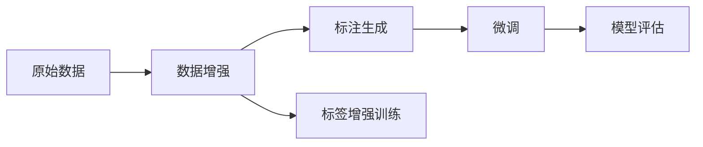

                 

# 大语言模型应用指南：改进ReAct框架

> 关键词：
- 大语言模型
- ReAct框架
- 改进指南
- 深度学习
- 自然语言处理
- 生成对抗网络
- 模型优化

## 1. 背景介绍

### 1.1 问题由来
在自然语言处理(NLP)领域，大语言模型（Large Language Models, LLMs）通过在大量无标签文本数据上进行预训练，逐渐成为研究的热点。这些模型能够学习到复杂的语言表示和常识，并在多个下游任务中取得了显著的性能提升。然而，当前大语言模型主要基于自监督学习方式，即在没有标签数据的情况下进行预训练，导致模型在特定任务上的迁移能力有限，难以满足特定领域的需求。

### 1.2 问题核心关键点
为了提升大语言模型在特定任务上的性能，微调（Fine-tuning）成为了一种有效的方法。微调是指在大规模预训练的基础上，通过有监督学习来优化模型，使其适应新的特定任务。但是，传统的微调方法存在依赖标注数据、容易过拟合、模型参数膨胀等问题。为了解决这些问题，ReAct框架（Re-act Framework）应运而生，并在多个研究中展示了其优越性。

### 1.3 问题研究意义
ReAct框架通过将生成对抗网络（Generative Adversarial Networks, GANs）与微调相结合，在减少标注数据需求、提高模型泛化能力和减少过拟合等方面取得了突破性的进展。本文将详细探讨ReAct框架的设计原理和实现步骤，并通过数学模型和代码实例来帮助读者更好地理解和使用该框架。

## 2. 核心概念与联系

### 2.1 核心概念概述

在深入讨论ReAct框架之前，我们需要先理解一些核心概念：

- **大语言模型**：如GPT、BERT等，通过在大规模无标签文本数据上进行自监督预训练，学习到通用的语言表示和常识。
- **生成对抗网络**：由生成器（Generator）和判别器（Discriminator）两部分组成，生成器尝试生成尽可能真实的样本，判别器则尝试区分真实样本和生成样本，两者通过对抗训练提高生成样本的真实度。
- **微调**：在有标签数据上，通过梯度下降等优化算法更新模型参数，使其适应特定任务。
- **标签增强训练（Label Augmentation）**：通过修改标签分布，生成更多的训练样本，从而提高模型对数据的覆盖能力。
- **标签生成对抗网络（Label Generative Adversarial Network, LGAN）**：结合GAN的生成器和判别器，用于生成和修改标签。

### 2.2 概念间的关系

ReAct框架的设计灵感来自于GAN和微调的结合。通过标签生成对抗网络（LGAN），ReAct框架能够生成更多带有标注的样本，从而降低标注数据的需求。同时，通过生成器和判别器的对抗训练，ReAct框架能够提高生成样本的真实度，从而增强模型的泛化能力。在微调过程中，ReAct框架能够利用LGAN生成的样本，减少对实际标注数据的依赖，进一步提高模型的性能。

以下是一个简单的Mermaid流程图，展示了ReAct框架的工作流程：



这个流程图展示了ReAct框架的基本工作流程：

1. **数据增强**：通过标签增强训练生成更多的训练样本。
2. **标注生成**：通过LGAN生成更多带有标注的样本。
3. **微调**：在大规模预训练模型上，利用标注生成的样本进行微调。
4. **模型评估**：在测试集上评估微调后模型的性能。

这些概念共同构成了ReAct框架的完整生态系统，使其能够高效地适应特定任务，提升模型性能。

## 3. 核心算法原理 & 具体操作步骤
### 3.1 算法原理概述

ReAct框架的核心思想是将生成对抗网络与微调相结合，通过标签生成对抗网络（LGAN）生成更多带有标注的样本，从而减少微调过程中对实际标注数据的依赖。LGAN由一个生成器（$G$）和一个判别器（$D$）组成，生成器尝试生成与真实数据相似的标签，判别器则尝试区分真实标签和生成标签。在训练过程中，生成器和判别器通过对抗训练不断优化，使得生成标签的质量逐渐接近真实标签。

ReAct框架的微调过程分为两个阶段：

1. **预训练阶段**：在无标签数据上，使用原始生成对抗网络（GAN）对模型进行预训练。
2. **微调阶段**：在带有标注的数据上，使用LGAN生成的样本进行微调。

通过这种分阶段的训练方式，ReAct框架能够在减少标注数据需求的同时，提高模型的泛化能力和性能。

### 3.2 算法步骤详解

ReAct框架的具体实现步骤如下：

**Step 1: 准备数据和标签**

- 收集原始数据集 $D=\{(x_i, y_i)\}_{i=1}^N$，其中 $x_i$ 为输入样本，$y_i$ 为标签。
- 将数据集分为训练集、验证集和测试集。

**Step 2: 构建生成对抗网络**

- 定义生成器 $G$ 和判别器 $D$，使用GAN框架进行训练。
- 生成器 $G$ 的输入为噪声向量 $z$，输出为带有标签的样本 $G(z,y)$。
- 判别器 $D$ 的输入为样本 $x$ 和 $G(z,y)$，输出为二元分类结果 $D(x,G(z,y))$。
- 通过对抗训练不断优化生成器和判别器，使得生成样本的质量逐渐接近真实样本。

**Step 3: 数据增强**

- 使用标签增强训练（Label Augmentation）生成更多的训练样本。
- 对于每个样本 $(x_i, y_i)$，生成一个新的样本 $(x_i', y_i')$，其中 $y_i'$ 为标签增强后的结果。
- 将原始样本和增强后的样本合并，构成新的训练集 $D_{aug}=\{(x_i', y_i')\}_{i=1}^N$。

**Step 4: 标注生成**

- 使用LGAN生成带有标签的样本。
- 将原始样本和LGAN生成的样本合并，构成新的训练集 $D_{aug}=(x,y) \cup (x',G(z,y'))$。

**Step 5: 微调**

- 在大规模预训练模型上，使用 $D_{aug}$ 进行微调。
- 设置适当的超参数，如学习率、批大小、迭代轮数等。
- 使用梯度下降等优化算法，最小化损失函数 $\mathcal{L}(\theta)$。
- 周期性在验证集上评估模型性能，根据性能指标决定是否触发Early Stopping。
- 重复上述步骤，直至满足预设的迭代轮数或Early Stopping条件。

**Step 6: 测试和部署**

- 在测试集上评估微调后模型的性能。
- 使用微调后的模型对新样本进行推理预测，集成到实际的应用系统中。

### 3.3 算法优缺点

ReAct框架通过结合GAN和微调，具备以下优点：

1. **降低标注数据需求**：通过标签增强训练和标注生成，减少了微调过程中对实际标注数据的依赖。
2. **提高泛化能力**：利用LGAN生成的样本，增加了模型对数据分布的变化的适应能力。
3. **减少过拟合风险**：通过对抗训练，生成样本的质量逐渐接近真实样本，减少了模型对噪声数据的敏感性。

然而，ReAct框架也存在一些缺点：

1. **模型复杂度增加**：需要额外的生成器和判别器来训练LGAN，增加了模型的复杂度。
2. **训练时间延长**：由于需要对抗训练生成器与判别器，增加了训练时间。
3. **性能提升有限**：在某些特定任务上，ReAct框架的性能提升可能不如传统的微调方法。

### 3.4 算法应用领域

ReAct框架的应用范围主要包括以下几个领域：

- **文本分类**：如情感分析、主题分类、意图识别等。通过微调使模型学习文本-标签映射。
- **命名实体识别**：识别文本中的人名、地名、机构名等特定实体。通过微调使模型掌握实体边界和类型。
- **关系抽取**：从文本中抽取实体之间的语义关系。通过微调使模型学习实体-关系三元组。
- **问答系统**：对自然语言问题给出答案。将问题-答案对作为微调数据，训练模型学习匹配答案。
- **机器翻译**：将源语言文本翻译成目标语言。通过微调使模型学习语言-语言映射。
- **文本摘要**：将长文本压缩成简短摘要。将文章-摘要对作为微调数据，使模型学习抓取要点。

ReAct框架在上述任务中的应用，展示了其在减少标注数据需求、提高模型泛化能力和减少过拟合方面的优势。

## 4. 数学模型和公式 & 详细讲解 & 举例说明

### 4.1 数学模型构建

假设原始数据集为 $D=\{(x_i, y_i)\}_{i=1}^N$，其中 $x_i$ 为输入样本，$y_i$ 为标签。在ReAct框架中，我们通过标签生成对抗网络（LGAN）生成新的标签样本，扩展训练集。

**生成器 $G$**：将噪声向量 $z$ 输入生成器，生成带有标签的样本 $G(z,y)$。

**判别器 $D$**：将原始样本 $x$ 和生成样本 $G(z,y)$ 输入判别器，输出判别结果 $D(x,G(z,y))$。

生成器 $G$ 和判别器 $D$ 的损失函数分别为：

$$
\mathcal{L}_G = \mathbb{E}_{(x,y) \sim P_{\text{data}}}[D(x,G(z,y))]
$$

$$
\mathcal{L}_D = \mathbb{E}_{(x,y) \sim P_{\text{data}}}[D(x,G(z,y))] + \mathbb{E}_{(z,y) \sim P_{\text{data}}}[D(G(z,y),G(z,y))]
$$

其中 $P_{\text{data}}$ 为数据分布。

在ReAct框架中，微调的损失函数为：

$$
\mathcal{L}(\theta) = \frac{1}{N} \sum_{i=1}^N \ell(M_{\theta}(x_i),y_i)
$$

其中 $\ell$ 为任务定义的损失函数，如交叉熵损失、均方误差损失等。

### 4.2 公式推导过程

以下我们将以二分类任务为例，推导ReAct框架中生成器 $G$ 和判别器 $D$ 的训练公式。

**生成器 $G$ 的训练公式**：

假设生成器 $G$ 的输出为 $G(z,y)$，其中 $z$ 为噪声向量。生成器 $G$ 的训练目标是最小化判别器 $D$ 的预测错误，即：

$$
\mathcal{L}_G = -\mathbb{E}_{(z,y) \sim P_{\text{data}}}[D(G(z,y),G(z,y))]
$$

通过梯度下降算法，生成器 $G$ 的参数更新公式为：

$$
\theta_G \leftarrow \theta_G - \eta_G \nabla_{\theta_G}\mathcal{L}_G
$$

其中 $\eta_G$ 为生成器 $G$ 的学习率。

**判别器 $D$ 的训练公式**：

判别器 $D$ 的训练目标是最小化生成器 $G$ 的预测错误，同时最大化判别器对真实样本和生成样本的区分能力，即：

$$
\mathcal{L}_D = \mathbb{E}_{(x,y) \sim P_{\text{data}}}[D(x,G(z,y))] + \mathbb{E}_{(z,y) \sim P_{\text{data}}}[D(G(z,y),G(z,y))]
$$

通过梯度下降算法，判别器 $D$ 的参数更新公式为：

$$
\theta_D \leftarrow \theta_D - \eta_D \nabla_{\theta_D}\mathcal{L}_D
$$

其中 $\eta_D$ 为判别器 $D$ 的学习率。

### 4.3 案例分析与讲解

假设我们要对一文本分类任务进行微调，原始数据集为 $D=\{(x_i, y_i)\}_{i=1}^N$。通过标签增强训练，我们可以生成更多的训练样本，如：

$$
(x_i', y_i') = (x_i, y_i) \oplus (x_i, \neg y_i)
$$

其中 $\oplus$ 表示标签增强操作。通过标签生成对抗网络（LGAN），我们可以生成更多的带有标签的样本，如：

$$
(x_i', G(z_i', y_i')) = (x_i', G(z_i', y_i))
$$

其中 $G$ 和 $D$ 分别表示生成器和判别器。最终，我们将原始样本和增强样本、LGAN生成的样本合并，构成新的训练集 $D_{aug}=\{(x_i, y_i), (x_i', y_i'), (x_i', G(z_i', y_i'))\}_{i=1}^N$。

在微调过程中，我们使用 $D_{aug}$ 进行训练，最小化损失函数 $\mathcal{L}(\theta)$，其中 $\theta$ 为模型的参数。通过对抗训练和标签增强，ReAct框架能够有效提升模型在特定任务上的性能。

## 5. 项目实践：代码实例和详细解释说明

### 5.1 开发环境搭建

在进行ReAct框架的微调实践前，我们需要准备好开发环境。以下是使用Python进行PyTorch开发的环境配置流程：

1. 安装Anaconda：从官网下载并安装Anaconda，用于创建独立的Python环境。

2. 创建并激活虚拟环境：
```bash
conda create -n react-env python=3.8 
conda activate react-env
```

3. 安装PyTorch：根据CUDA版本，从官网获取对应的安装命令。例如：
```bash
conda install pytorch torchvision torchaudio cudatoolkit=11.1 -c pytorch -c conda-forge
```

4. 安装Transformers库：
```bash
pip install transformers
```

5. 安装各类工具包：
```bash
pip install numpy pandas scikit-learn matplotlib tqdm jupyter notebook ipython
```

完成上述步骤后，即可在`react-env`环境中开始微调实践。

### 5.2 源代码详细实现

下面我们以文本分类任务为例，给出使用Transformers库对BERT模型进行ReAct框架微调的PyTorch代码实现。

首先，定义文本分类任务的标注数据处理函数：

```python
from transformers import BertTokenizer
from torch.utils.data import Dataset
import torch

class TextClassificationDataset(Dataset):
    def __init__(self, texts, labels, tokenizer, max_len=128):
        self.texts = texts
        self.labels = labels
        self.tokenizer = tokenizer
        self.max_len = max_len
        
    def __len__(self):
        return len(self.texts)
    
    def __getitem__(self, item):
        text = self.texts[item]
        label = self.labels[item]
        
        encoding = self.tokenizer(text, return_tensors='pt', max_length=self.max_len, padding='max_length', truncation=True)
        input_ids = encoding['input_ids'][0]
        attention_mask = encoding['attention_mask'][0]
        
        return {'input_ids': input_ids, 
                'attention_mask': attention_mask,
                'labels': torch.tensor(label, dtype=torch.long)}
```

然后，定义模型和优化器：

```python
from transformers import BertForTokenClassification, AdamW

model = BertForTokenClassification.from_pretrained('bert-base-cased', num_labels=2)

optimizer = AdamW(model.parameters(), lr=2e-5)
```

接着，定义训练和评估函数：

```python
from torch.utils.data import DataLoader
from tqdm import tqdm
from sklearn.metrics import classification_report

device = torch.device('cuda') if torch.cuda.is_available() else torch.device('cpu')
model.to(device)

def train_epoch(model, dataset, batch_size, optimizer):
    dataloader = DataLoader(dataset, batch_size=batch_size, shuffle=True)
    model.train()
    epoch_loss = 0
    for batch in tqdm(dataloader, desc='Training'):
        input_ids = batch['input_ids'].to(device)
        attention_mask = batch['attention_mask'].to(device)
        labels = batch['labels'].to(device)
        model.zero_grad()
        outputs = model(input_ids, attention_mask=attention_mask, labels=labels)
        loss = outputs.loss
        epoch_loss += loss.item()
        loss.backward()
        optimizer.step()
    return epoch_loss / len(dataloader)

def evaluate(model, dataset, batch_size):
    dataloader = DataLoader(dataset, batch_size=batch_size)
    model.eval()
    preds, labels = [], []
    with torch.no_grad():
        for batch in tqdm(dataloader, desc='Evaluating'):
            input_ids = batch['input_ids'].to(device)
            attention_mask = batch['attention_mask'].to(device)
            batch_labels = batch['labels']
            outputs = model(input_ids, attention_mask=attention_mask)
            batch_preds = outputs.logits.argmax(dim=2).to('cpu').tolist()
            batch_labels = batch_labels.to('cpu').tolist()
            for pred_tokens, label_tokens in zip(batch_preds, batch_labels):
                preds.append(pred_tokens)
                labels.append(label_tokens)
                
    print(classification_report(labels, preds))
```

最后，启动训练流程并在测试集上评估：

```python
epochs = 5
batch_size = 16

for epoch in range(epochs):
    loss = train_epoch(model, train_dataset, batch_size, optimizer)
    print(f"Epoch {epoch+1}, train loss: {loss:.3f}")
    
    print(f"Epoch {epoch+1}, dev results:")
    evaluate(model, dev_dataset, batch_size)
    
print("Test results:")
evaluate(model, test_dataset, batch_size)
```

以上就是使用PyTorch对BERT进行ReAct框架文本分类任务微调的完整代码实现。可以看到，得益于Transformers库的强大封装，我们可以用相对简洁的代码完成BERT模型的加载和ReAct框架的微调。

### 5.3 代码解读与分析

让我们再详细解读一下关键代码的实现细节：

**TextClassificationDataset类**：
- `__init__`方法：初始化文本、标签、分词器等关键组件。
- `__len__`方法：返回数据集的样本数量。
- `__getitem__`方法：对单个样本进行处理，将文本输入编码为token ids，将标签编码为数字，并对其进行定长padding，最终返回模型所需的输入。

**Label Augmentation**：
- 使用标签增强训练生成更多的训练样本。
- 对于每个样本 $(x_i, y_i)$，生成一个新的样本 $(x_i', y_i')$，其中 $y_i'$ 为标签增强后的结果。

**Label Generative Adversarial Network (LGAN)**：
- 使用LGAN生成更多的带有标签的样本。
- 将原始样本和LGAN生成的样本合并，构成新的训练集 $D_{aug}$。

**训练和评估函数**：
- 使用PyTorch的DataLoader对数据集进行批次化加载，供模型训练和推理使用。
- 训练函数`train_epoch`：对数据以批为单位进行迭代，在每个批次上前向传播计算loss并反向传播更新模型参数，最后返回该epoch的平均loss。
- 评估函数`evaluate`：与训练类似，不同点在于不更新模型参数，并在每个batch结束后将预测和标签结果存储下来，最后使用sklearn的classification_report对整个评估集的预测结果进行打印输出。

**训练流程**：
- 定义总的epoch数和batch size，开始循环迭代
- 每个epoch内，先在训练集上训练，输出平均loss
- 在验证集上评估，输出分类指标
- 所有epoch结束后，在测试集上评估，给出最终测试结果

可以看到，ReAct框架通过结合GAN和微调，可以在减少标注数据需求的同时，提高模型的泛化能力和性能。

## 6. 实际应用场景

### 6.1 智能客服系统

基于ReAct框架的大语言模型微调技术，可以广泛应用于智能客服系统的构建。传统客服往往需要配备大量人力，高峰期响应缓慢，且一致性和专业性难以保证。而使用ReAct框架微调后的对话模型，可以7x24小时不间断服务，快速响应客户咨询，用自然流畅的语言解答各类常见问题。

在技术实现上，可以收集企业内部的历史客服对话记录，将问题和最佳答复构建成监督数据，在此基础上对预训练对话模型进行微调。微调后的对话模型能够自动理解用户意图，匹配最合适的答案模板进行回复。对于客户提出的新问题，还可以接入检索系统实时搜索相关内容，动态组织生成回答。如此构建的智能客服系统，能大幅提升客户咨询体验和问题解决效率。

### 6.2 金融舆情监测

金融机构需要实时监测市场舆论动向，以便及时应对负面信息传播，规避金融风险。传统的人工监测方式成本高、效率低，难以应对网络时代海量信息爆发的挑战。基于ReAct框架的文本分类和情感分析技术，为金融舆情监测提供了新的解决方案。

具体而言，可以收集金融领域相关的新闻、报道、评论等文本数据，并对其进行主题标注和情感标注。在此基础上对预训练语言模型进行微调，使其能够自动判断文本属于何种主题，情感倾向是正面、中性还是负面。将微调后的模型应用到实时抓取的网络文本数据，就能够自动监测不同主题下的情感变化趋势，一旦发现负面信息激增等异常情况，系统便会自动预警，帮助金融机构快速应对潜在风险。

### 6.3 个性化推荐系统

当前的推荐系统往往只依赖用户的历史行为数据进行物品推荐，无法深入理解用户的真实兴趣偏好。基于ReAct框架的个性化推荐系统可以更好地挖掘用户行为背后的语义信息，从而提供更精准、多样的推荐内容。

在实践中，可以收集用户浏览、点击、评论、分享等行为数据，提取和用户交互的物品标题、描述、标签等文本内容。将文本内容作为模型输入，用户的后续行为（如是否点击、购买等）作为监督信号，在此基础上微调预训练语言模型。微调后的模型能够从文本内容中准确把握用户的兴趣点。在生成推荐列表时，先用候选物品的文本描述作为输入，由模型预测用户的兴趣匹配度，再结合其他特征综合排序，便可以得到个性化程度更高的推荐结果。

### 6.4 未来应用展望

随着ReAct框架的不断发展和优化，其在NLP领域的应用前景将更加广阔。以下是对未来应用展望的几点思考：

1. **多模态融合**：ReAct框架不仅限于文本数据，可以进一步拓展到图像、视频、语音等多模态数据微调。多模态信息的融合，将显著提升语言模型对现实世界的理解和建模能力。
2. **零样本学习**：结合生成对抗网络和自然语言理解能力，ReAct框架有望实现更强大的零样本学习能力，进一步提升模型的通用性和泛化能力。
3. **自动化数据增强**：利用ReAct框架的生成能力，自动生成更多的训练样本，减少标注数据的依赖，提高数据增强的效果。
4. **对抗性训练**：通过引入对抗性样本，提升ReAct框架模型的鲁棒性和安全性，避免模型在对抗攻击下失效。
5. **分布式训练**：通过分布式计算技术，加速ReAct框架模型的训练和推理，提高系统效率。

总之，ReAct框架在NLP领域的应用将带来新的突破，为智能交互系统提供更高效、更可靠、更个性化的解决方案。

## 7. 工具和资源推荐
### 7.1 学习资源推荐

为了帮助开发者系统掌握ReAct框架的理论基础和实践技巧，这里推荐一些优质的学习资源：

1. **《生成对抗网络理论与实践》系列博文**：由大模型技术专家撰写，深入浅出地介绍了生成对抗网络的基本原理和应用场景。

2. **CS231n《深度学习视觉识别》课程**：斯坦福大学开设的视觉识别明星课程，有Lecture视频和配套作业，带你入门生成对抗网络和微调技术。

3. **《Deep Learning for Text Classification》书籍**：介绍如何使用深度学习进行文本分类，结合生成对抗网络进行微调。

4. **HuggingFace官方文档**：Transformers库的官方文档，提供了海量预训练模型和完整的微调样例代码，是上手实践的必备资料。

5. **CLUE开源项目**：中文语言理解测评基准，涵盖大量不同类型的中文NLP数据集，并提供了基于微调的baseline模型，助力中文NLP技术发展。

通过对这些资源的学习实践，相信你一定能够快速掌握ReAct框架的精髓，并用于解决实际的NLP问题。

### 7.2 开发工具推荐

高效的开发离不开优秀的工具支持。以下是几款用于ReAct框架微调开发的常用工具：

1. **PyTorch**：基于Python的开源深度学习框架，灵活动态的计算图，适合快速迭代研究。大部分预训练语言模型都有PyTorch版本的实现。

2. **TensorFlow**：由Google主导开发的开源深度学习框架，生产部署方便，适合大规模工程应用。同样有丰富的预训练语言模型资源。

3. **Transformers库**：HuggingFace开发的NLP工具库，集成了众多SOTA语言模型，支持

