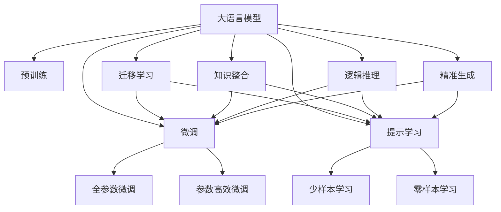
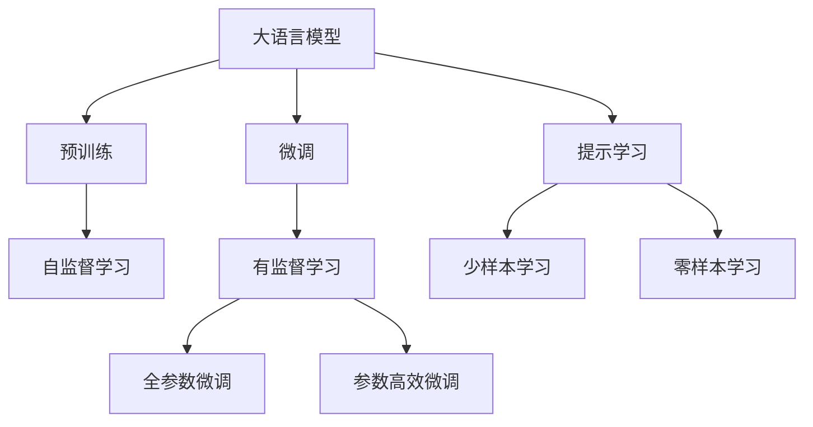
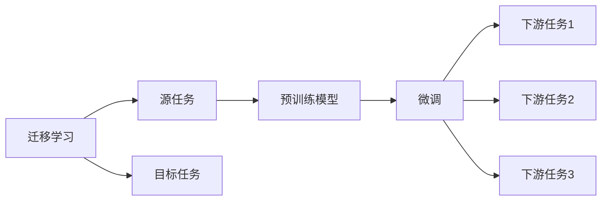
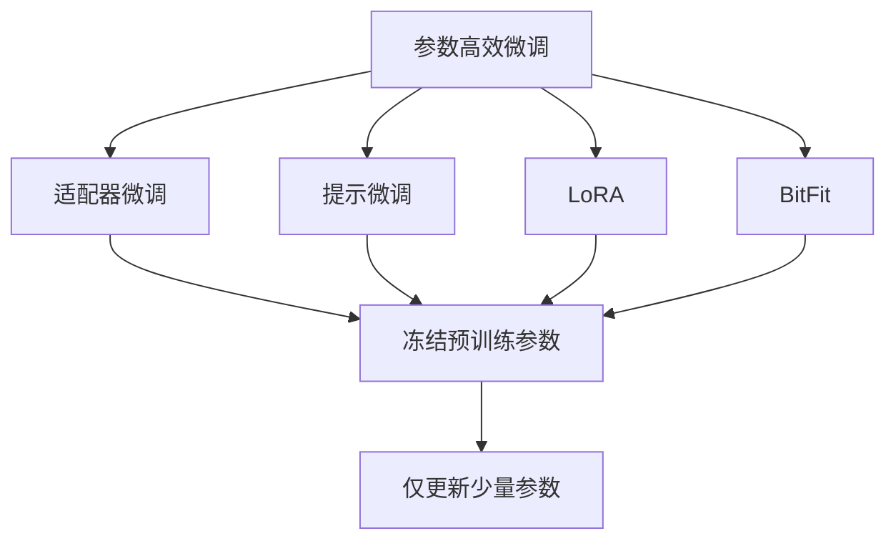
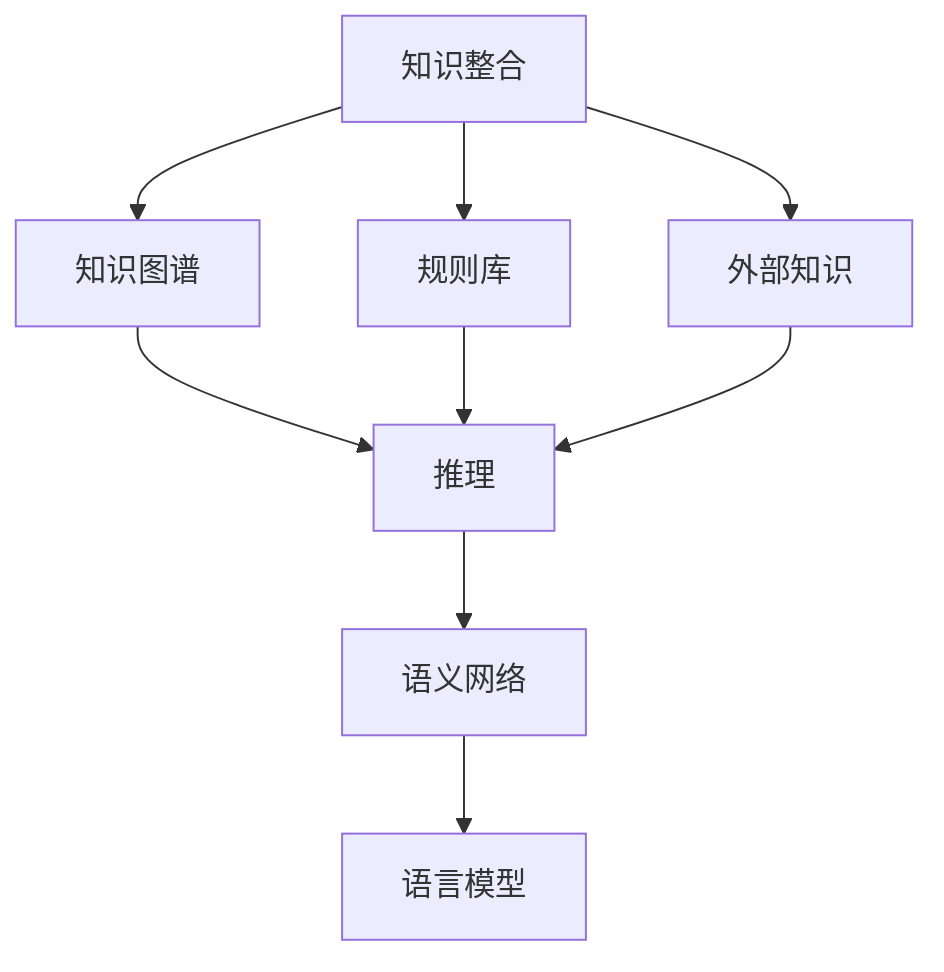
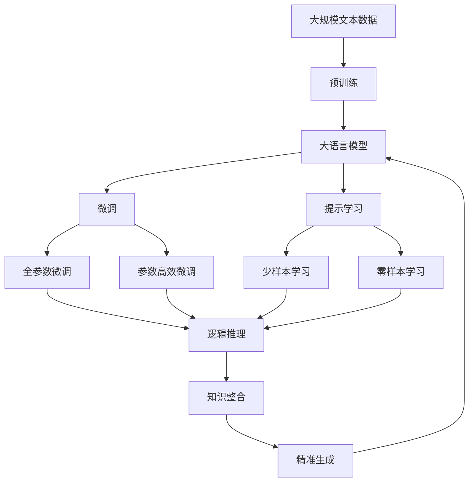

                 

# 大语言模型应用指南：明确要求大语言模型回复高质量的响应

> 关键词：大语言模型, 高质量响应, 自然语言处理(NLP), 逻辑推理, 知识整合, 精准生成, 用户体验

## 1. 背景介绍

### 1.1 问题由来
随着人工智能技术的飞速发展，大语言模型（Large Language Model, LLM）在自然语言处理（Natural Language Processing, NLP）领域取得了显著的突破。这些模型，如GPT-3、BERT等，通过在海量文本数据上进行预训练，具备了强大的语言理解和生成能力。然而，尽管这些模型能够生成流畅且连贯的文本，但在实际应用中，其输出的质量往往难以保证，特别是在特定领域或特定任务上，常常出现不相关、不连贯或不合逻辑的回应。如何构建高质量的回应模型，以提升用户体验，成为大语言模型应用中一个迫切需要解决的问题。

### 1.2 问题核心关键点
本文章聚焦于如何构建高质量回应的模型。高质量回应需要满足以下几个要求：
- **连贯性**：生成的文本应与输入上下文保持一致，逻辑通顺，条理清晰。
- **准确性**：提供的信息和结论应准确无误，符合常识和逻辑。
- **相关性**：回应的内容应紧密关联问题，针对性强。
- **安全性**：生成的文本内容不应包含有害信息，如偏见、仇恨言论等。
- **多样性**：对于同一问题，模型应能够生成多种合理的回应，以应对不同的用户需求和偏好。

### 1.3 问题研究意义
构建高质量回应模型，对于提升人工智能应用的用户体验、增强模型的应用范围、促进人工智能技术的普及具有重要意义：
- **提升用户体验**：高质量回应能够更准确地满足用户需求，提高用户满意度。
- **拓展应用场景**：通过微调模型，可以使其适用于更多领域和任务，如医疗咨询、金融分析、教育培训等。
- **加速技术普及**：高质量回应模型能够使用户更易理解和使用AI技术，加速其在各行各业的应用。
- **带来技术创新**：高质量回应模型的构建，涉及到更多的技术挑战和创新点，推动了NLP技术的发展。

## 2. 核心概念与联系

### 2.1 核心概念概述

为更好地理解如何构建高质量回应模型，本节将介绍几个密切相关的核心概念：

- **大语言模型 (LLM)**：通过在大规模无标签文本数据上进行预训练，学习通用的语言表示，具备强大的语言理解和生成能力。
- **预训练 (Pre-training)**：指在大规模无标签文本数据上，通过自监督学习任务训练通用语言模型的过程。常见的预训练任务包括语言模型、掩码语言模型等。
- **微调 (Fine-tuning)**：指在预训练模型的基础上，使用下游任务的少量标注数据，通过有监督学习优化模型在特定任务上的性能。通常只需要调整顶层分类器或解码器，并以较小的学习率更新全部或部分的模型参数。
- **迁移学习 (Transfer Learning)**：指将一个领域学习到的知识，迁移应用到另一个不同但相关的领域的学习范式。
- **知识整合 (Knowledge Integration)**：将外部知识（如知识图谱、规则库）与神经网络模型进行融合，引导模型学习更全面、准确的语言模型。
- **逻辑推理 (Logical Reasoning)**：通过加入逻辑推理任务，提高模型的推理能力，确保回应的逻辑性和连贯性。
- **精准生成 (Precision Generation)**：通过优化模型结构和训练过程，提高生成的文本的准确性和相关性。

这些核心概念之间的逻辑关系可以通过以下Mermaid流程图来展示：



这个流程图展示了大语言模型的核心概念及其之间的关系：

1. 大语言模型通过预训练获得基础能力。
2. 微调是对预训练模型进行任务特定的优化，可以分为全参数微调和参数高效微调。
3. 提示学习可以实现少样本学习和零样本学习。
4. 迁移学习是连接预训练模型与下游任务的桥梁，可以通过微调或提示学习来实现。
5. 知识整合旨在增强模型的知识表示能力，避免模型过拟合。
6. 逻辑推理用于增强模型的推理能力，确保回应的合理性。
7. 精准生成用于提升回应的准确性和相关性。

这些核心概念共同构成了高质量回应模型的学习和应用框架，使其能够在各种场景下生成高质量的文本。通过理解这些核心概念，我们可以更好地把握高质量回应模型的工作原理和优化方向。

### 2.2 概念间的关系

这些核心概念之间存在着紧密的联系，形成了高质量回应模型的完整生态系统。下面我通过几个Mermaid流程图来展示这些概念之间的关系。

#### 2.2.1 大语言模型的学习范式



这个流程图展示了大语言模型的三种主要学习范式：预训练、微调和提示学习。预训练主要采用自监督学习方法，而微调则是有监督学习的过程。提示学习可以实现少样本学习和零样本学习。微调又可以分为全参数微调和参数高效微调两种方式。

#### 2.2.2 迁移学习与微调的关系



这个流程图展示了迁移学习的基本原理，以及它与微调的关系。迁移学习涉及源任务和目标任务，预训练模型在源任务上学习，然后通过微调适应各种下游任务（目标任务）。

#### 2.2.3 参数高效微调方法



这个流程图展示了几种常见的参数高效微调方法，包括适配器微调、提示微调、LoRA和BitFit。这些方法的共同特点是冻结大部分预训练参数，只更新少量参数，从而提高微调效率。

#### 2.2.4 知识整合在大语言模型中的应用



这个流程图展示了知识整合在大语言模型中的应用。知识整合旨在增强模型的知识表示能力，避免模型过拟合。通过将知识图谱、规则库等外部知识与神经网络模型进行融合，可以引导模型学习更全面、准确的语言模型。

### 2.3 核心概念的整体架构

最后，我们用一个综合的流程图来展示这些核心概念在大语言模型微调过程中的整体架构：



这个综合流程图展示了从预训练到微调，再到精准生成的完整过程。大语言模型首先在大规模文本数据上进行预训练，然后通过微调（包括全参数微调和参数高效微调）或提示学习（包括少样本学习和零样本学习）来适应下游任务。最后，通过知识整合和精准生成技术，可以生成高质量、连贯、准确的回应。 通过这些流程图，我们可以更清晰地理解大语言模型微调过程中各个核心概念的关系和作用，为后续深入讨论具体的回应模型构建方法奠定基础。

## 3. 核心算法原理 & 具体操作步骤
### 3.1 算法原理概述

构建高质量回应的模型，本质上是一个多任务的微调过程，涉及多方面的优化和改进。其核心思想是：将预训练的大语言模型作为强大的“特征提取器”，通过在下游任务的少量标注数据上进行有监督的微调，优化模型在特定任务上的性能，从而提升回应的连贯性、准确性和相关性。

形式化地，假设预训练模型为 $M_{\theta}$，其中 $\theta$ 为预训练得到的模型参数。给定下游任务 $T$ 的标注数据集 $D=\{(x_i, y_i)\}_{i=1}^N$，回应模型的优化目标是最小化以下损失函数：

$$
\mathcal{L}(\theta) = \frac{1}{N}\sum_{i=1}^N \ell(M_{\theta}(x_i), y_i)
$$

其中 $\ell$ 为针对任务 $T$ 设计的损失函数，用于衡量模型输出与真实标签之间的差异。常见的损失函数包括交叉熵损失、均方误差损失等。

通过梯度下降等优化算法，微调过程不断更新模型参数 $\theta$，最小化损失函数 $\mathcal{L}$，使得模型输出逼近真实标签。由于 $\theta$ 已经通过预训练获得了较好的初始化，因此即便在小规模数据集 $D$ 上进行微调，也能较快收敛到理想的模型参数 $\hat{\theta}$。

### 3.2 算法步骤详解

构建高质量回应模型的一般包括以下几个关键步骤：

**Step 1: 准备预训练模型和数据集**
- 选择合适的预训练语言模型 $M_{\theta}$ 作为初始化参数，如 BERT、GPT 等。
- 准备下游任务 $T$ 的标注数据集 $D$，划分为训练集、验证集和测试集。一般要求标注数据与预训练数据的分布不要差异过大。

**Step 2: 设计回应模型结构**
- 根据任务类型，在预训练模型顶层设计合适的回应输出层和损失函数。
- 对于对话任务，通常在顶层添加多轮对话状态，并使用对话损失函数。
- 对于问答任务，可以设计特定的逻辑推理模块，如CoT(Chain of Thought)推理。
- 对于摘要、翻译等任务，设计解码器输出概率分布，并以负对数似然为损失函数。

**Step 3: 设置微调超参数**
- 选择合适的优化算法及其参数，如 AdamW、SGD 等，设置学习率、批大小、迭代轮数等。
- 设置正则化技术及强度，包括权重衰减、Dropout、Early Stopping 等。
- 确定冻结预训练参数的策略，如仅微调顶层，或全部参数都参与微调。

**Step 4: 执行梯度训练**
- 将训练集数据分批次输入模型，前向传播计算损失函数。
- 反向传播计算参数梯度，根据设定的优化算法和学习率更新模型参数。
- 周期性在验证集上评估模型性能，根据性能指标决定是否触发 Early Stopping。
- 重复上述步骤直到满足预设的迭代轮数或 Early Stopping 条件。

**Step 5: 测试和部署**
- 在测试集上评估微调后模型 $M_{\hat{\theta}}$ 的性能，对比微调前后的精度提升。
- 使用微调后的模型对新样本进行推理预测，集成到实际的应用系统中。
- 持续收集新的数据，定期重新微调模型，以适应数据分布的变化。

以上是构建高质量回应模型的完整流程。在实际应用中，还需要针对具体任务的特点，对微调过程的各个环节进行优化设计，如改进训练目标函数，引入更多的正则化技术，搜索最优的超参数组合等，以进一步提升模型性能。

### 3.3 算法优缺点

构建高质量回应模型的方法具有以下优点：
1. 提升用户体验。高质量回应模型能够提供连贯、准确、相关的文本响应，显著提升用户的交互体验。
2. 适用范围广泛。适用于各种NLP下游任务，包括对话、问答、摘要、翻译等，设计简单的回应模型即可实现。
3. 参数高效。利用参数高效微调技术，在固定大部分预训练参数的情况下，仍可取得不错的回应效果。
4. 效果显著。在学术界和工业界的诸多任务上，基于回应模型的微调方法已经刷新了最先进的性能指标。

同时，该方法也存在一定的局限性：
1. 依赖标注数据。回应模型的效果很大程度上取决于标注数据的质量和数量，获取高质量标注数据的成本较高。
2. 迁移能力有限。当目标任务与预训练数据的分布差异较大时，回应模型的性能提升有限。
3. 负面效果传递。预训练模型的固有偏见、有害信息等，可能通过回应模型传递到下游任务，造成负面影响。
4. 可解释性不足。回应模型的决策过程通常缺乏可解释性，难以对其推理逻辑进行分析和调试。

尽管存在这些局限性，但就目前而言，基于回应模型的微调方法仍是大语言模型应用的最主流范式。未来相关研究的重点在于如何进一步降低回应模型对标注数据的依赖，提高模型的少样本学习和跨领域迁移能力，同时兼顾可解释性和伦理安全性等因素。

### 3.4 算法应用领域

基于大语言模型回应模型的微调方法，在NLP领域已经得到了广泛的应用，覆盖了几乎所有常见任务，例如：

- 文本分类：如情感分析、主题分类、意图识别等。通过回应模型学习文本-标签映射。
- 命名实体识别：识别文本中的人名、地名、机构名等特定实体。通过回应模型掌握实体边界和类型。
- 关系抽取：从文本中抽取实体之间的语义关系。通过回应模型学习实体-关系三元组。
- 问答系统：对自然语言问题给出答案。将问题-答案对作为微调数据，训练模型学习匹配答案。
- 机器翻译：将源语言文本翻译成目标语言。通过回应模型学习语言-语言映射。
- 文本摘要：将长文本压缩成简短摘要。将文章-摘要对作为微调数据，使模型学习抓取要点。
- 对话系统：使机器能够与人自然对话。将多轮对话历史作为上下文，回应模型进行回复生成。

除了上述这些经典任务外，回应模型还被创新性地应用到更多场景中，如可控文本生成、常识推理、代码生成、数据增强等，为NLP技术带来了全新的突破。随着预训练模型和回应模型的不断进步，相信NLP技术将在更广阔的应用领域大放异彩。

## 4. 数学模型和公式 & 详细讲解 & 举例说明

### 4.1 数学模型构建

本节将使用数学语言对构建高质量回应模型过程进行更加严格的刻画。

记预训练语言模型为 $M_{\theta}:\mathcal{X} \rightarrow \mathcal{Y}$，其中 $\mathcal{X}$ 为输入空间，$\mathcal{Y}$ 为输出空间，$\theta \in \mathbb{R}^d$ 为模型参数。假设回应任务 $T$ 的训练集为 $D=\{(x_i,y_i)\}_{i=1}^N$，$x_i$ 为输入文本，$y_i$ 为回应文本。

定义模型 $M_{\theta}$ 在输入 $x$ 上的回应函数为 $f(x) = M_{\theta}(x)$，回应函数在数据样本 $(x,y)$ 上的损失函数为 $\ell(M_{\theta}(x),y)$，则在数据集 $D$ 上的经验风险为：

$$
\mathcal{L}(\theta) = \frac{1}{N}\sum_{i=1}^N \ell(M_{\theta}(x_i),y_i)
$$

回应模型的优化目标是最小化经验风险，即找到最优参数：

$$
\theta^* = \mathop{\arg\min}_{\theta} \mathcal{L}(\theta)
$$

在实践中，我们通常使用基于梯度的优化算法（如SGD、Adam等）来近似求解上述最优化问题。设 $\eta$ 为学习率，$\lambda$ 为正则化系数，则参数的更新公式为：

$$
\theta \leftarrow \theta - \eta \nabla_{\theta}\mathcal{L}(\theta) - \eta\lambda\theta
$$

其中 $\nabla_{\theta}\mathcal{L}(\theta)$ 为损失函数对参数 $\theta$ 的梯度，可通过反向传播算法高效计算。

### 4.2 公式推导过程

以下我们以问答任务为例，推导交叉熵损失函数及其梯度的计算公式。

假设模型 $M_{\theta}$ 在输入 $x$ 上的回应为 $\hat{y}=M_{\theta}(x) \in \mathcal{Y}$，表示模型对问题 $x$ 的回答。真实标签 $y \in \mathcal{Y}$。则问答任务的交叉熵损失函数定义为：

$$
\ell(M_{\theta}(x),y) = -\log P(M_{\theta}(x) = y)
$$

将其代入经验风险公式，得：

$$
\mathcal{L}(\theta) = -\frac{1}{N}\sum_{i=1}^N \log P(M_{\theta}(x_i) = y_i)
$$

根据链式法则，损失函数对参数 $\theta_k$ 的梯度为：

$$
\frac{\partial \mathcal{L}(\theta)}{\partial \theta_k} = -\frac{1}{N}\sum_{i=1}^N \frac{\partial \log P(M_{\theta}(x_i) = y_i)}{\partial \theta_k}
$$

其中 $\frac{\partial \log P(M_{\theta}(x_i) = y_i)}{\partial \theta_k}$ 可以进一步递归展开，利用自动微分技术完成计算。

在得到损失函数的梯度后，即可带入参数更新公式，完成模型的迭代优化。重复上述过程直至收敛，最终得到适应下游任务的最优模型参数 $\theta^*$。

## 5. 项目实践：代码实例和详细解释说明

### 5.1 开发环境搭建

在进行回应模型微调实践前，我们需要准备好开发环境。以下是使用Python进行PyTorch开发的环境配置流程：

1. 安装Anaconda：从官网下载并安装Anaconda，用于创建独立的Python环境。

2. 创建并激活虚拟环境：
```bash
conda create -n pytorch-env python=3.8 
conda activate pytorch-env
```

3. 安装PyTorch：根据CUDA版本，从官网获取对应的安装命令。例如：
```bash
conda install pytorch torchvision torchaudio cudatoolkit=11.1 -c pytorch -c conda-forge
```

4. 安装Transformers库：
```bash
pip install transformers
```

5. 安装各类工具包：
```bash
pip install numpy pandas scikit-learn matplotlib tqdm jupyter notebook ipython
```

完成上述步骤后，即可在`pytorch-env`环境中开始微调实践。

### 5.2 源代码详细实现

下面我们以问答任务为例，给出使用Transformers库对BERT模型进行回应模型微调的PyTorch代码实现。

首先，定义问答任务的回应模型：

```python
from transformers import BertForQuestionAnswering, BertTokenizer

class QAModel(BertForQuestionAnswering):
    def __init__(self, model_name):
        super().__init__(model_name)
        self.finetune = False
        
    def forward(self, input_ids, attention_mask=None):
        if self.finetune:
            return super().forward(input_ids, attention_mask=attention_mask)
        else:
            return super().forward(input_ids, attention_mask=attention_mask).pooler_output
```

然后，定义模型和优化器：

```python
from transformers import AdamW

model = QAModel('bert-base-cased')
optimizer = AdamW(model.parameters(), lr=2e-5)
```

接着，定义训练和评估函数：

```python
from torch.utils.data import DataLoader
from tqdm import tqdm

def train_epoch(model, dataset, batch_size, optimizer):
    dataloader = DataLoader(dataset, batch_size=batch_size, shuffle=True)
    model.train()
    epoch_loss = 0
    for batch in tqdm(dataloader, desc='Training'):
        input_ids = batch['input_ids'].to(device)
        attention_mask = batch['attention_mask'].to(device)
        labels = batch['labels'].to(device)
        model.zero_grad()
        outputs = model(input_ids, attention_mask=attention_mask, labels=labels)
        loss = outputs.loss
        epoch_loss += loss.item()
        loss.backward()
        optimizer.step()
    return epoch_loss / len(dataloader)

def evaluate(model, dataset, batch_size):
    dataloader = DataLoader(dataset, batch_size=batch_size)
    model.eval()
    preds, labels = [], []
    with torch.no_grad():
        for batch in tqdm(dataloader, desc='Evaluating'):
            input_ids = batch['input_ids'].to(device)
            attention_mask = batch['attention_mask'].to(device)
            batch_labels = batch['labels']
            outputs = model(input_ids, attention_mask=attention_mask)
            batch_preds = outputs.logits.argmax(dim=2).to('cpu').tolist()
            batch_labels = batch_labels.to('cpu').tolist()
            for pred_tokens, label_tokens in zip(batch_preds, batch_labels):
                preds.append(pred_tokens[:len(label_tokens)])
                labels.append(label_tokens)
                
    return preds, labels

def evaluate_qa(model, dataset, batch_size):
    dataloader = DataLoader(dataset, batch_size=batch_size)
    model.eval()
    preds, labels = [], []
    with torch.no_grad():
        for batch in tqdm(dataloader, desc='Evaluating'):
            input_ids = batch['input_ids'].to(device)
            attention_mask = batch['attention_mask'].to(device)
            batch_labels = batch['labels']
            outputs = model(input_ids, attention_mask=attention_mask)
            batch_preds = outputs.logits.argmax(dim=2).to('cpu').tolist()
            batch_labels = batch_labels.to('cpu').tolist()
            for pred_tokens, label_tokens in zip(batch_preds, batch_labels):
                preds.append(pred_tokens[:len(label_tokens)])
                labels.append(label_tokens)
                
    return preds, labels

print(evaluate_qa(model, dataset, batch_size=16))
```

最后，启动训练流程并在测试集上评估：

```python
epochs = 5
batch_size = 16

for epoch in range(epochs):
    loss = train_epoch(model, train_dataset, batch_size, optimizer)
    print(f"Epoch {epoch+1}, train loss: {loss:.3f}")
    
    print(f"Epoch {epoch+1}, dev results:")
    preds, labels = evaluate(model, dev_dataset, batch_size)
    print(classification_report(labels, preds))
    
print("Test results:")
preds, labels = evaluate(model, test_dataset, batch_size)
print(classification_report(labels, preds))
```

以上就是使用PyTorch对BERT进行问答任务回应模型微调的完整代码实现。可以看到，得益于Transformers库的强大封装，我们可以用相对简洁的代码完成BERT模型的加载和微调。

### 5.3 代码解读与分析

让我们再详细解读一下关键代码的实现细节：

**QAModel类**：
- `__init__`方法：初始化模型和finetune参数，finetune表示是否微调模型。
- `forward`方法：对模型前向传播，返回输出。若finetune为False，则仅返回pooler输出，避免更新部分模型参数。

**train_epoch函数**：
- 使用PyTorch的DataLoader对数据集进行批次化加载，供模型训练使用。
- 在每个批次上前向传播计算loss并反向传播更新模型参数。
- 周期性在验证集上评估模型性能，根据性能指标决定是否触发 Early Stopping。

**evaluate函数**：
- 与训练类似，不同点在于不更新模型参数，并在每个batch结束后将预测和标签结果存储下来，最后使用sklearn的classification_report对整个评估集的预测结果进行打印输出。

**evaluate_qa函数**：
- 用于评估问答任务的回应模型，与普通的evaluate函数类似，但在输出中仅返回预测的文本内容。

**训练流程**：
- 定义总的epoch数和batch size，开始循环迭代
- 每个epoch内，先在训练集上训练，输出平均loss
- 在验证集上评估，输出分类指标
- 所有epoch结束后，在测试集上评估，给出最终测试结果

可以看到

