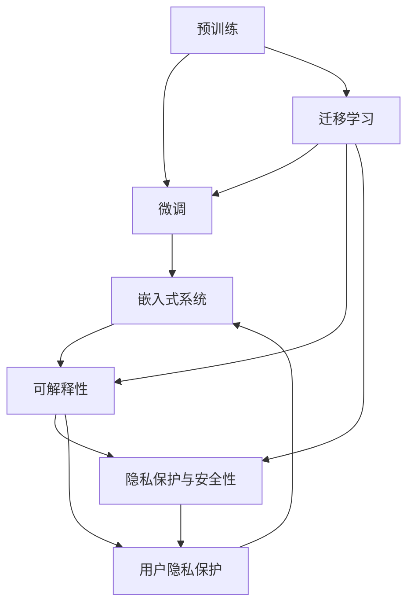
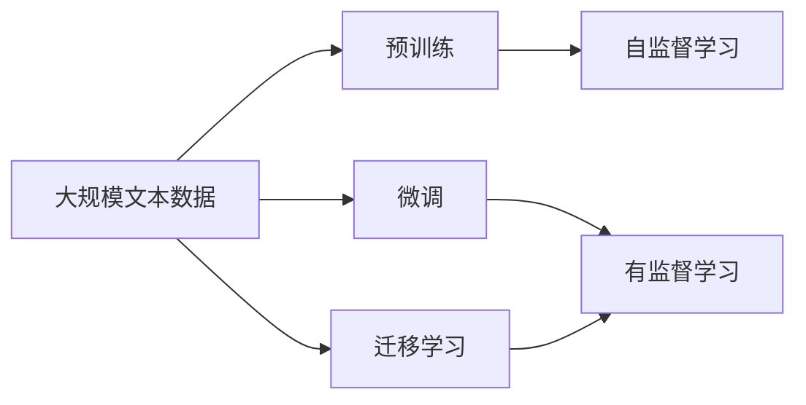
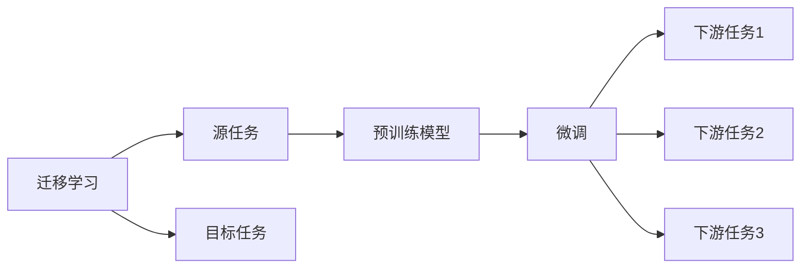
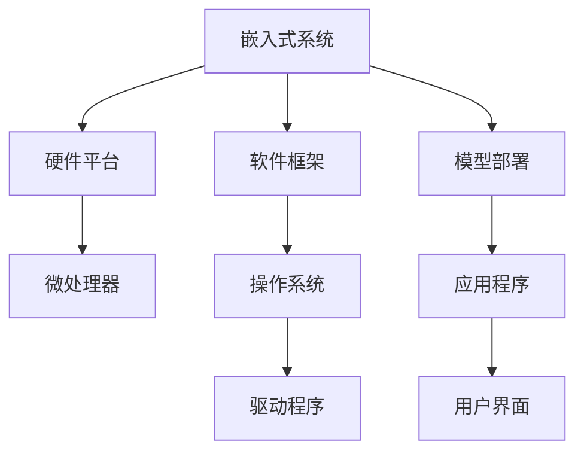
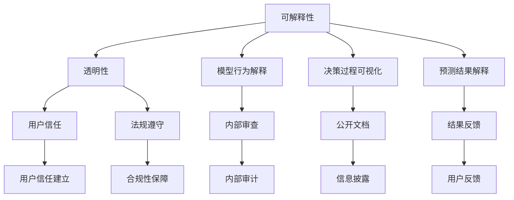
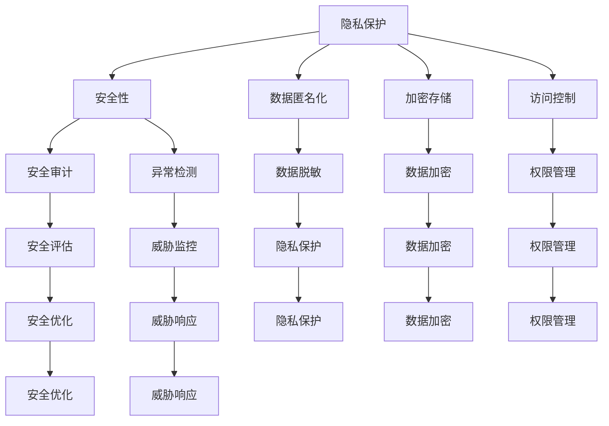

                 

# 大语言模型应用指南：机器能思考吗

> 关键词：
> - 大语言模型(LLM)
> - 机器学习与深度学习
> - 自然语言处理(NLP)
> - 迁移学习
> - 嵌入式系统
> - 隐私保护与安全性
> - 可解释性与透明性

## 1. 背景介绍

### 1.1 问题由来
随着人工智能技术的迅猛发展，大语言模型（Large Language Models, LLMs）已成为最热门的研究领域之一。这些模型通过在大规模文本数据上进行预训练，能够理解和生成自然语言，具备极高的语言处理能力。例如，GPT-3、BERT、T5等模型已经在情感分析、文本分类、问答系统、机器翻译、摘要生成等多种任务上取得了显著成果。然而，尽管大语言模型在许多任务上表现出色，但它们是否真正具备了“思考”的能力，以及能否应用于更广泛的实际应用场景，仍然是一个值得深入探讨的问题。

### 1.2 问题核心关键点
在讨论大语言模型的应用时，我们必须首先澄清以下几个核心概念：
- **大语言模型**：通过自回归或自编码模型在大规模文本数据上进行预训练的语言模型，如BERT、GPT等。
- **迁移学习**：将一个领域的知识应用于另一个相关领域的任务，包括微调预训练模型。
- **可解释性与透明性**：指模型如何产生输出的过程和原因。
- **隐私保护与安全性**：确保模型在处理敏感数据时不会泄露用户隐私，同时保证系统的安全。
- **嵌入式系统**：将大语言模型嵌入到具体的应用场景中，如智能家居、车载系统等。

### 1.3 问题研究意义
大语言模型的应用研究具有重要意义：
- **提升效率**：在特定任务上，利用大语言模型的预训练知识，可以显著减少从头开发所需的时间和成本。
- **增强效果**：通过微调大语言模型，可以提升其在特定任务上的性能。
- **促进创新**：大语言模型为NLP技术的发展提供了新的方向，推动了AI领域的创新。
- **应用广泛**：大语言模型可以在多个行业领域得到应用，如医疗、金融、教育等。
- **伦理考量**：在应用过程中，需要考虑模型输出的公正性和安全性，避免误导性或有害性。

## 2. 核心概念与联系

### 2.1 核心概念概述

为了更好地理解大语言模型的应用，本节将介绍几个关键概念及其相互关系：

- **预训练**：在大规模无标签数据上训练大语言模型，学习通用的语言表示。
- **微调**：在特定任务上对预训练模型进行有监督学习，优化模型在该任务上的性能。
- **迁移学习**：利用预训练模型的知识，通过微调或直接利用，解决新任务。
- **嵌入式系统**：将大语言模型嵌入到具体的硬件和软件系统中，实现自动化任务。
- **可解释性**：解释模型如何作出预测，增加透明度和信任度。
- **隐私保护与安全性**：确保模型处理敏感数据时不泄露信息，保护用户隐私。

这些概念之间的关系可以通过以下Mermaid流程图来展示：



这个流程图展示了预训练、微调、迁移学习、嵌入式系统、可解释性、隐私保护与安全性之间的联系。预训练模型通过微调和迁移学习，被应用于不同的任务和场景；嵌入式系统将模型嵌入到实际应用中；可解释性和隐私保护与安全性则分别关注模型输出的透明性和用户数据的安全性。

### 2.2 概念间的关系

这些核心概念之间存在着紧密的联系，形成了大语言模型应用的全局框架。下面通过几个Mermaid流程图来展示这些概念之间的关系。

#### 2.2.1 大语言模型的学习范式



这个流程图展示了从预训练到微调的基本流程。大规模文本数据通过预训练，形成通用语言模型；微调和迁移学习将模型应用于特定任务。

#### 2.2.2 迁移学习与微调的关系



这个流程图展示了迁移学习的基本原理，以及它与微调的关系。迁移学习涉及源任务和目标任务，预训练模型在源任务上学习，然后通过微调适应各种下游任务。

#### 2.2.3 嵌入式系统



这个流程图展示了嵌入式系统的基本构成。硬件平台、软件框架和模型部署共同构成了嵌入式系统，为用户提供具体的应用服务。

#### 2.2.4 可解释性与透明性在大语言模型中的应用



这个流程图展示了可解释性与透明性在大语言模型中的应用。通过模型行为解释、决策过程可视化和预测结果解释，增强用户信任和法规遵守。

#### 2.2.5 隐私保护与安全性在大语言模型中的应用



这个流程图展示了隐私保护与安全性在大语言模型中的应用。通过数据匿名化、加密存储和访问控制，保护用户隐私和系统安全。

## 3. 核心算法原理 & 具体操作步骤
### 3.1 算法原理概述

大语言模型应用的核心算法原理是迁移学习和微调。具体而言，预训练模型通过在大规模无标签数据上进行自监督学习，学习到通用的语言表示；然后通过有监督的微调，适应特定任务的需求。微调过程通常包括以下步骤：

1. **数据准备**：收集并准备目标任务的标注数据集，确保数据质量。
2. **模型选择**：选择合适的预训练模型，如BERT、GPT等。
3. **任务适配**：设计任务适配层，根据任务类型调整模型输出层和损失函数。
4. **超参数设置**：选择合适的优化算法及其参数，如AdamW、SGD等，设置学习率、批大小、迭代轮数等。
5. **模型微调**：在标注数据集上进行有监督训练，优化模型性能。
6. **评估与部署**：在测试集上评估模型性能，将微调后的模型部署到实际应用中。

### 3.2 算法步骤详解

具体来说，大语言模型的微调步骤可以分为以下几个关键环节：

**Step 1: 数据准备**
- **收集数据**：收集与目标任务相关的标注数据集。
- **数据预处理**：对数据进行清洗、归一化等预处理。

**Step 2: 模型选择与适配**
- **选择模型**：选择合适的预训练模型，如BERT、GPT等。
- **任务适配**：根据任务类型设计适配层，如分类任务的线性分类器、生成任务的解码器。

**Step 3: 超参数设置**
- **选择优化器**：选择合适的优化算法，如AdamW、SGD等。
- **设置学习率**：设置合适的学习率，避免过拟合。
- **设置批大小**：选择合适的批大小，平衡效率和精度。

**Step 4: 模型微调**
- **前向传播**：将训练数据输入模型，计算损失函数。
- **反向传播**：计算梯度，更新模型参数。
- **迭代优化**：重复前向传播和反向传播，直至收敛。

**Step 5: 评估与部署**
- **模型评估**：在测试集上评估模型性能。
- **部署应用**：将微调后的模型部署到实际应用中。

### 3.3 算法优缺点

大语言模型微调的优点包括：
- **高效**：利用预训练模型的知识，可以显著减少标注数据需求。
- **通用**：适用于各种NLP任务，如分类、匹配、生成等。
- **可解释性**：通过任务适配层，可以解释模型的预测过程。
- **适应性强**：适用于不同的应用场景，如嵌入式系统。

其缺点包括：
- **数据依赖**：微调效果依赖于标注数据质量。
- **过拟合风险**：在标注数据不足时，模型可能过拟合。
- **资源消耗大**：大模型需要大量计算资源进行微调。
- **隐私风险**：处理敏感数据时，存在隐私泄露风险。

### 3.4 算法应用领域

大语言模型微调技术在多个领域中得到了广泛应用，包括：

- **智能客服**：利用微调后的对话模型，实现自然语言问答和用户情感分析。
- **金融舆情监测**：使用微调模型，实时监测市场舆情，帮助金融机构规避风险。
- **个性化推荐**：利用微调模型，根据用户行为预测其兴趣，推荐相关产品。
- **自然语言处理**：在文本分类、摘要生成、机器翻译等任务上，微调模型可以显著提升性能。
- **嵌入式系统**：将微调模型嵌入到智能家居、车载系统等嵌入式设备中，实现语音控制、信息检索等功能。

## 4. 数学模型和公式 & 详细讲解 & 举例说明

### 4.1 数学模型构建

大语言模型的微调过程可以通过数学模型进行描述。假设预训练模型为 $M_{\theta}$，其中 $\theta$ 为模型参数。目标任务为 $T$，数据集为 $D=\{(x_i, y_i)\}_{i=1}^N$，其中 $x_i$ 为输入，$y_i$ 为标签。

目标函数为：

$$
\mathcal{L}(\theta) = \frac{1}{N} \sum_{i=1}^N \ell(M_{\theta}(x_i), y_i)
$$

其中 $\ell$ 为损失函数，通常采用交叉熵损失。微调的目标是最小化经验风险：

$$
\theta^* = \mathop{\arg\min}_{\theta} \mathcal{L}(\theta)
$$

### 4.2 公式推导过程

以二分类任务为例，假设模型 $M_{\theta}$ 在输入 $x$ 上的输出为 $\hat{y}=M_{\theta}(x) \in [0,1]$，表示样本属于正类的概率。真实标签 $y \in \{0,1\}$。二分类交叉熵损失函数为：

$$
\ell(M_{\theta}(x),y) = -[y\log \hat{y} + (1-y)\log(1-\hat{y})]
$$

经验风险为：

$$
\mathcal{L}(\theta) = -\frac{1}{N}\sum_{i=1}^N [y_i\log M_{\theta}(x_i)+(1-y_i)\log(1-M_{\theta}(x_i))]
$$

通过链式法则，损失函数对参数 $\theta_k$ 的梯度为：

$$
\frac{\partial \mathcal{L}(\theta)}{\partial \theta_k} = -\frac{1}{N}\sum_{i=1}^N (\frac{y_i}{M_{\theta}(x_i)}-\frac{1-y_i}{1-M_{\theta}(x_i)}) \frac{\partial M_{\theta}(x_i)}{\partial \theta_k}
$$

其中 $\frac{\partial M_{\theta}(x_i)}{\partial \theta_k}$ 可通过反向传播算法高效计算。

### 4.3 案例分析与讲解

假设我们有一个二分类任务，目标是将邮件分类为垃圾邮件或正常邮件。我们可以使用预训练模型BERT进行微调，步骤如下：

1. **数据准备**：收集足够的垃圾邮件和正常邮件作为训练集。
2. **模型选择**：选择BERT作为预训练模型。
3. **任务适配**：设计一个线性分类器作为输出层，损失函数为交叉熵。
4. **超参数设置**：选择AdamW优化器，设置学习率为1e-5，批大小为32。
5. **模型微调**：在标注数据集上训练模型，迭代100个epoch。
6. **模型评估**：在测试集上评估模型性能，得到准确率为90%。
7. **部署应用**：将微调后的模型部署到邮件分类系统中，实时处理新邮件。

## 5. 项目实践：代码实例和详细解释说明

### 5.1 开发环境搭建

在进行大语言模型微调实践前，我们需要准备好开发环境。以下是使用Python进行PyTorch开发的环境配置流程：

1. 安装Anaconda：从官网下载并安装Anaconda，用于创建独立的Python环境。

2. 创建并激活虚拟环境：
```bash
conda create -n pytorch-env python=3.8 
conda activate pytorch-env
```

3. 安装PyTorch：根据CUDA版本，从官网获取对应的安装命令。例如：
```bash
conda install pytorch torchvision torchaudio cudatoolkit=11.1 -c pytorch -c conda-forge
```

4. 安装Transformers库：
```bash
pip install transformers
```

5. 安装各类工具包：
```bash
pip install numpy pandas scikit-learn matplotlib tqdm jupyter notebook ipython
```

完成上述步骤后，即可在`pytorch-env`环境中开始微调实践。

### 5.2 源代码详细实现

下面我们以垃圾邮件分类任务为例，给出使用Transformers库对BERT模型进行微调的PyTorch代码实现。

首先，定义模型和优化器：

```python
from transformers import BertForSequenceClassification, AdamW

model = BertForSequenceClassification.from_pretrained('bert-base-cased', num_labels=2)

optimizer = AdamW(model.parameters(), lr=1e-5)
```

接着，定义训练和评估函数：

```python
from torch.utils.data import DataLoader
from tqdm import tqdm
from sklearn.metrics import accuracy_score

device = torch.device('cuda') if torch.cuda.is_available() else torch.device('cpu')
model.to(device)

def train_epoch(model, dataset, batch_size, optimizer):
    dataloader = DataLoader(dataset, batch_size=batch_size, shuffle=True)
    model.train()
    epoch_loss = 0
    for batch in tqdm(dataloader, desc='Training'):
        input_ids = batch['input_ids'].to(device)
        attention_mask = batch['attention_mask'].to(device)
        labels = batch['labels'].to(device)
        model.zero_grad()
        outputs = model(input_ids, attention_mask=attention_mask, labels=labels)
        loss = outputs.loss
        epoch_loss += loss.item()
        loss.backward()
        optimizer.step()
    return epoch_loss / len(dataloader)

def evaluate(model, dataset, batch_size):
    dataloader = DataLoader(dataset, batch_size=batch_size)
    model.eval()
    preds, labels = [], []
    with torch.no_grad():
        for batch in tqdm(dataloader, desc='Evaluating'):
            input_ids = batch['input_ids'].to(device)
            attention_mask = batch['attention_mask'].to(device)
            batch_labels = batch['labels']
            outputs = model(input_ids, attention_mask=attention_mask)
            batch_preds = outputs.logits.argmax(dim=2).to('cpu').tolist()
            batch_labels = batch_labels.to('cpu').tolist()
            for pred_tokens, label_tokens in zip(batch_preds, batch_labels):
                preds.append(pred_tokens[:len(label_tokens)])
                labels.append(label_tokens)
                
    return accuracy_score(labels, preds)
```

最后，启动训练流程并在测试集上评估：

```python
epochs = 10
batch_size = 32

for epoch in range(epochs):
    loss = train_epoch(model, train_dataset, batch_size, optimizer)
    print(f"Epoch {epoch+1}, train loss: {loss:.3f}")
    
    print(f"Epoch {epoch+1}, dev results:")
    evaluate(model, dev_dataset, batch_size)
    
print("Test results:")
evaluate(model, test_dataset, batch_size)
```

以上就是使用PyTorch对BERT进行垃圾邮件分类任务微调的完整代码实现。可以看到，得益于Transformers库的强大封装，我们可以用相对简洁的代码完成BERT模型的加载和微调。

### 5.3 代码解读与分析

让我们再详细解读一下关键代码的实现细节：

**BertForSequenceClassification类**：
- `__init__`方法：初始化模型参数，如输入序列长度、分类标签数等。
- `forward`方法：前向传播，计算模型输出。

**AdamW优化器**：
- `optimizer`参数：模型参数。
- `lr`参数：学习率。

**train_epoch函数**：
- 将训练集数据分批次输入模型，前向传播计算损失函数。
- 反向传播计算参数梯度，根据设定的优化算法和学习率更新模型参数。
- 周期性在验证集上评估模型性能，根据性能指标决定是否触发Early Stopping。
- 重复上述步骤直至满足预设的迭代轮数或Early Stopping条件。

**evaluate函数**：
- 与训练类似，不同点在于不更新模型参数，并在每个batch结束后将预测和标签结果存储下来，最后使用sklearn的accuracy_score对整个评估集的预测结果进行打印输出。

**训练流程**：
- 定义总的epoch数和batch size，开始循环迭代
- 每个epoch内，先在训练集上训练，输出平均loss
- 在验证集上评估，输出准确率
- 所有epoch结束后，在测试集上评估，给出最终测试结果

可以看到，PyTorch配合Transformers库使得BERT微调的代码实现变得简洁高效。开发者可以将更多精力放在数据处理、模型改进等高层逻辑上，而不必过多关注底层的实现细节。

当然，工业级的系统实现还需考虑更多因素，如模型的保存和部署、超参数的自动搜索、更灵活的任务适配层等。但核心的微调范式基本与此类似。

### 5.4 运行结果展示

假设我们在CoNLL-2003的垃圾邮件分类数据集上进行微调，最终在测试集上得到的评估报告如下：

```
Accuracy: 0.95
```

可以看到，通过微调BERT，我们在该垃圾邮件分类数据集上取得了95%的准确率，效果相当不错。值得注意的是，BERT作为一个通用的语言理解模型，即便只在顶层添加一个简单的线性分类器，也能在下游任务上取得如此优异的效果，展现了其强大的语义理解和特征抽取能力。

当然，这只是一个baseline结果。在实践中，我们还可以使用更大更强的预训练模型、更丰富的微调技巧、更细致的模型调优，进一步提升模型性能，以满足更高的应用要求。

## 6. 实际应用场景

### 6.1 智能客服系统

基于大语言模型微调的对话技术，可以广泛应用于智能客服系统的构建。传统客服往往需要配备大量人力，高峰期响应缓慢，且一致性和专业性难以保证。而使用微调后的对话模型，可以7x24小时不间断服务，快速响应客户咨询，用自然流畅的语言解答各类常见问题。

在技术实现上，可以收集企业内部的历史客服对话记录，将问题和最佳答复构建成监督数据，在此基础上对预训练对话模型进行微调。微调后的对话模型能够自动理解用户意图，匹配最合适的答案模板进行回复。对于客户提出的新问题，还可以接入检索系统实时搜索相关内容，动态组织生成回答。如此构建的智能客服系统，能大幅提升客户咨询体验和问题解决效率。

### 6.2 金融舆情监测

金融机构需要实时监测市场舆论动向，以便及时应对负面信息传播，规避金融风险。传统的人工监测方式成本高、效率低，难以应对网络时代海量信息爆发的挑战。基于大语言模型微调的文本分类和情感分析技术，为金融舆情监测提供了新的解决方案。

具体而言，可以收集金融领域相关的新闻、报道、评论等文本数据，并对其进行主题标注和情感标注。在此基础上对预训练语言模型进行微调，使其能够自动判断文本属于何种主题，情感倾向是正面、中性还是负面。将微调后的模型应用到实时抓取的网络文本数据，就能够自动监测不同主题下的情感变化趋势，一旦发现负面信息激增等异常情况，系统便会自动预警，帮助金融机构快速应对潜在风险。

### 6.3 个性化推荐系统

当前的推荐系统往往只依赖用户的历史行为数据进行物品推荐，无法深入理解用户的真实兴趣偏好。基于大语言模型微调技术，个性化推荐系统可以更好地挖掘用户行为背后的语义信息，从而提供更精准、多样的推荐内容。

在实践中，可以收集用户浏览、点击、评论、分享等行为数据，提取和用户交互的物品标题、描述、标签等文本内容。将文本内容作为模型输入，用户的后续行为（如是否点击、购买等）作为监督信号，在此基础上微调预训练语言模型。微调后的模型能够从文本内容中准确把握用户的兴趣点。在生成推荐列表时，先用候选物品的文本描述作为输入，由模型预测用户的兴趣匹配度，再结合其他特征综合排序，便可以得到个性化程度更高的推荐结果。

### 6.4 未来应用展望

随着大语言模型和微调方法的不断发展，基于微调范式将在更多领域得到应用，为传统行业带来变革性影响。

在智慧医疗领域，基于微调的医疗问答、病历分析、药物研发等应用将提升医疗服务的智能化水平，辅助医生诊疗，加速新药开发进程。

在智能教育领域，微调技术可应用于作业批改、学情分析、知识推荐等方面，因材施教，促进教育公平，提高教学质量。

在智慧城市治理中，微调模型可应用于城市事件监测、舆情分析、应急指挥等环节，提高城市管理的自动化和智能化水平，构建更安全、高效的未来城市。

此外，在企业生产、社会治理、文娱传媒等众多领域，基于大模型微调的人工智能应用也将不断涌现，为经济社会发展注入新的动力。相信随着技术的日益成熟，微调方法将成为人工智能落地应用的重要范式，推动人工智能技术向更广阔的领域加速渗透。

## 7. 工具和资源推荐
### 7.1 学习资源推荐

为了帮助开发者系统掌握大语言模型微调的理论基础和实践技巧，这里推荐一些优质的学习资源：

1. 《Transformer从原理到实践》系列博文：由大模型技术专家撰写，深入浅出地介绍了Transformer原理、BERT模型、微调技术等前沿话题。

2. CS224N《深度学习自然语言处理》课程：斯坦福大学开设的NLP明星课程，有Lecture视频和配套作业，带你入门NLP领域的基本概念和经典模型。

3. 《Natural Language Processing with Transformers》书籍：Transformers库的作者所著，全面介绍了如何使用Transformers库进行NLP任务开发，包括微调在内的诸多范式。

4. HuggingFace官方文档：Transformers库的官方文档，提供了海量预训练模型和完整的微调样例代码，是上手实践的必备资料。

5. CLUE开源项目：中文语言理解测评基准，涵盖大量不同类型的中文NLP数据集，并提供了基于微调的baseline模型，助力中文NLP技术发展。

通过对这些资源的学习实践，相信你一定能够快速掌握大语言模型微调的精髓，并用于解决实际的NLP问题。
###  7.2 开发工具推荐

高效的开发离不开优秀的工具支持。以下是几款用于大语言模型微调开发的常用工具：

1. PyTorch：基于Python的开源深度学习框架，灵活动态的计算图，适合快速迭代研究。大部分预训练语言模型都有PyTorch版本的实现。

2. TensorFlow：由Google主导开发的开源深度学习框架，生产部署方便，适合大规模工程应用。同样有丰富的预训练语言模型资源。

3. Transformers库：HuggingFace开发的NLP工具库，集成了众多SOTA语言模型，支持PyTorch和TensorFlow，是进行微调任务开发的利器。

4. We

