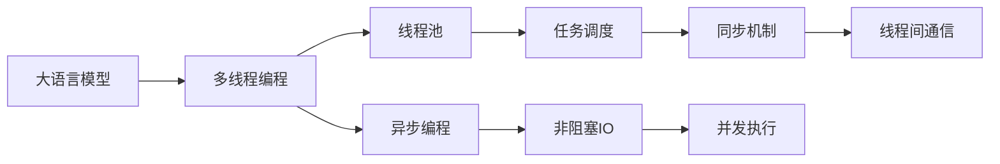
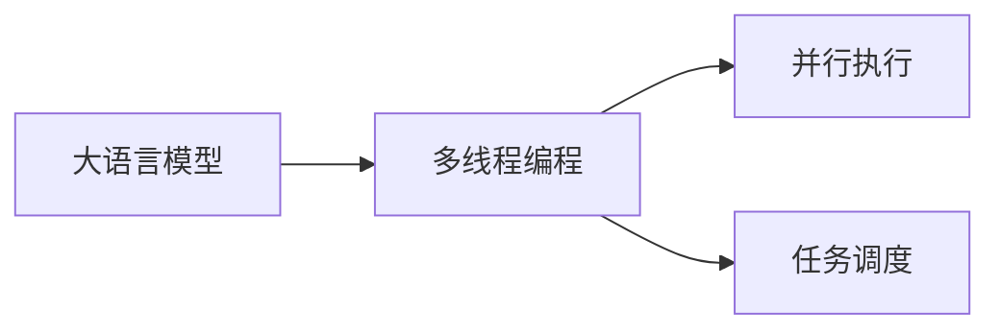
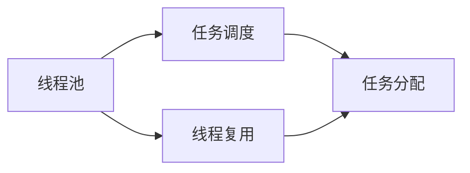
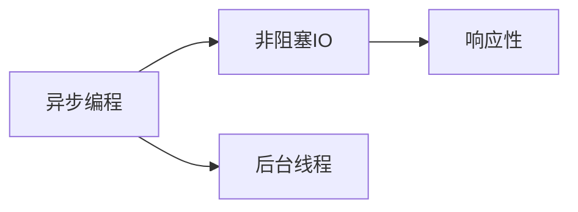
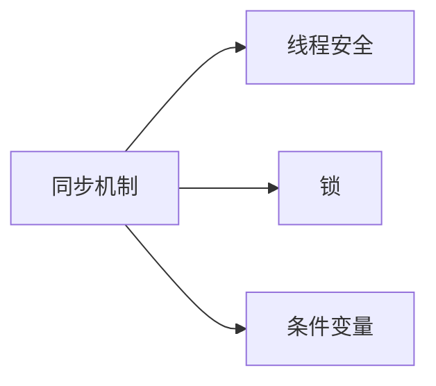
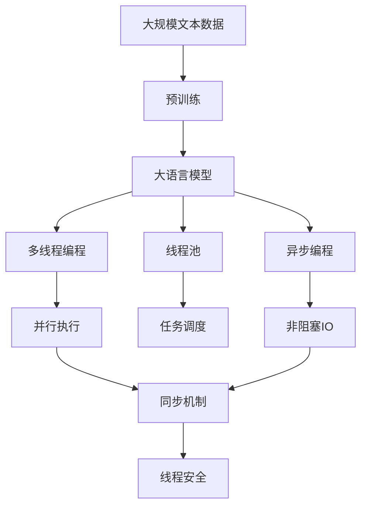

                 

# 大语言模型应用指南：线程

> 关键词：大语言模型,线程,多线程,并发,线程池,异步编程,Python,Java,Go

## 1. 背景介绍

在AI领域，大语言模型（Large Language Model, LLM）如BERT、GPT等，以其庞大的参数量和优异的性能，成为自然语言处理（NLP）的重要工具。然而，随着模型规模的不断扩大，其在多任务并发执行时的性能瓶颈逐渐显现。如何高效利用多线程技术，优化大语言模型在多个任务上的并发执行能力，成为了当前研究的重要方向。

本文将详细阐述多线程技术在大语言模型中的应用，涵盖线程概念、并行编程、线程池、异步编程等方面内容，旨在帮助读者全面了解并掌握大语言模型在多任务并发环境下的高效运行策略。

## 2. 核心概念与联系

### 2.1 核心概念概述

为了更好地理解线程技术在大语言模型中的应用，本节将介绍几个关键概念：

- **线程（Thread）**：线程是操作系统分配处理器资源的基本单位，每个线程都有自己的执行上下文和栈。线程可以并行执行，从而提升程序的并发能力和效率。

- **多线程编程（Multi-threading Programming）**：多线程编程是一种编程范式，通过创建多个线程并行执行，实现任务并行处理，提高程序的执行效率。

- **线程池（Thread Pool）**：线程池是一组预先创建好的线程，可以重用并共享资源，避免频繁创建和销毁线程带来的性能开销。

- **异步编程（Asynchronous Programming）**：异步编程是一种编程方式，通过将任务放在后台线程中执行，避免阻塞主线程，实现程序的高并发和高响应性。

- **并发（Concurrency）**：并发是指程序在同一时间执行多个任务，可以是多线程并发，也可以是进程并发。并发能够提升程序的处理能力，但也需要解决同步和数据共享等问题。

- **锁（Lock）**：锁是一种同步机制，用于保护共享资源，避免多个线程同时修改数据造成的竞态条件。

- **条件变量（Condition Variable）**：条件变量是线程间同步的一种机制，用于实现线程间的通信和等待。

这些概念之间的逻辑关系可以通过以下Mermaid流程图来展示：



这个流程图展示了大语言模型与线程技术之间的联系：

1. 大语言模型通过多线程编程实现并行执行。
2. 线程池用于优化线程管理，提高资源利用率。
3. 异步编程实现非阻塞IO，提升程序响应性。
4. 同步机制和条件变量保证线程安全。
5. 并发执行提高任务处理效率。

### 2.2 概念间的关系

这些核心概念之间存在着紧密的联系，形成了多线程技术在大语言模型中的应用框架。下面我们通过几个Mermaid流程图来展示这些概念之间的关系。

#### 2.2.1 大语言模型与多线程编程



这个流程图展示了大语言模型通过多线程编程实现并行执行的基本流程。

#### 2.2.2 线程池与任务调度



这个流程图展示了线程池通过任务调度实现任务分配和线程复用的过程。

#### 2.2.3 异步编程与非阻塞IO



这个流程图展示了异步编程通过后台线程实现非阻塞IO，提升程序响应性的过程。

#### 2.2.4 同步机制与线程安全



这个流程图展示了同步机制通过锁和条件变量实现线程安全的过程。

### 2.3 核心概念的整体架构

最后，我们用一个综合的流程图来展示这些核心概念在大语言模型多线程应用中的整体架构：



这个综合流程图展示了从预训练到多线程编程，再到线程池、异步编程和同步机制的完整过程。

## 3. 核心算法原理 & 具体操作步骤
### 3.1 算法原理概述

基于多线程技术的大语言模型应用，本质上是一种并行计算范式。其核心思想是：将大语言模型在多个任务上的计算任务分解成多个独立的子任务，通过多线程并行执行这些子任务，实现任务加速处理，提高程序的并发能力和效率。

形式化地，假设大语言模型为 $M$，待处理的任务集为 $T=\{T_1, T_2, ..., T_n\}$，每个任务 $T_i$ 的计算量为 $C_i$，每个任务的处理时间分别为 $t_i$。则并行计算的时间复杂度为：

$$
T_{\text{total}} = \sum_{i=1}^n t_i
$$

而并行计算的时间复杂度为：

$$
T_{\text{parallel}} = \max_{i=1}^n C_i t_i
$$

显然，$T_{\text{parallel}} < T_{\text{total}}$，即并行计算能够显著提高程序的执行效率。

### 3.2 算法步骤详解

基于多线程技术的大语言模型应用一般包括以下几个关键步骤：

**Step 1: 任务分解与调度**

- 将大语言模型要处理的任务 $T$ 分解为若干子任务 $T_1, T_2, ..., T_n$，每个子任务的计算量应尽量均衡。
- 根据每个子任务的计算量和处理时间，选择合适的调度策略。常见的调度策略包括时间片轮转、优先级调度、固定周期等。

**Step 2: 创建线程池**

- 根据任务的个数，创建一个固定大小的线程池。线程池的大小通常需要根据实际硬件资源和任务需求进行动态调整。
- 在线程池中预先创建一定数量的线程，避免频繁创建和销毁线程带来的性能开销。

**Step 3: 任务执行与并行处理**

- 将每个子任务 $T_i$ 分配给线程池中的一个线程 $t_i$，并启动线程执行。
- 线程在执行过程中，可以通过多线程编程的方式实现并行计算，提高任务的处理速度。

**Step 4: 任务结果汇总**

- 每个线程执行完成后，将结果返回给主线程。
- 主线程将各个子任务的结果汇总，得到最终的处理结果。

**Step 5: 错误处理与优化**

- 在线程执行过程中，可能会出现各种错误，如死锁、资源竞争等。需要使用同步机制和异常处理技术，保证线程安全。
- 对线程池中的线程进行优化，如重用线程、调整任务调度策略等，进一步提升性能。

### 3.3 算法优缺点

基于多线程技术的大语言模型应用，具有以下优点：

- **提升并发能力**：多线程编程能够显著提升程序的并发处理能力，提高任务执行效率。
- **资源复用**：线程池能够复用线程资源，避免频繁创建和销毁线程带来的性能开销。
- **响应性高**：异步编程通过后台线程实现非阻塞IO，提升程序的响应性。

同时，该方法也存在一定的局限性：

- **线程安全问题**：多线程并发执行可能导致数据竞争、死锁等问题，需要仔细设计和调试同步机制。
- **复杂度高**：多线程编程和线程池管理增加了程序的复杂度，容易出错。
- **资源消耗高**：多线程编程需要额外的资源（如线程栈、锁等），增加了系统的资源消耗。

### 3.4 算法应用领域

基于多线程技术的大语言模型应用，在NLP领域已经得到了广泛的应用，覆盖了几乎所有常见任务，例如：

- **文本分类**：将文本分类任务分解为多个子任务，每个子任务负责处理一篇文本。
- **命名实体识别**：将命名实体识别任务分解为多个子任务，每个子任务负责识别一个实体。
- **情感分析**：将情感分析任务分解为多个子任务，每个子任务负责分析一篇文本的情感倾向。
- **机器翻译**：将机器翻译任务分解为多个子任务，每个子任务负责翻译一个句子的部分。
- **文本摘要**：将文本摘要任务分解为多个子任务，每个子任务负责摘要一篇文本的某个段落。
- **对话系统**：将对话系统任务分解为多个子任务，每个子任务负责生成一个回复。

除了上述这些经典任务外，多线程技术还被创新性地应用到更多场景中，如文本生成、知识图谱构建、数据分析等，为NLP技术带来了全新的突破。

## 4. 数学模型和公式 & 详细讲解  
### 4.1 数学模型构建

本节将使用数学语言对基于多线程技术的大语言模型应用进行更加严格的刻画。

记大语言模型为 $M$，任务集 $T=\{T_1, T_2, ..., T_n\}$，每个任务 $T_i$ 的计算量为 $C_i$，处理时间为 $t_i$。假设采用线程池 $P$ 进行并行计算，每个线程的计算量为 $C$，处理时间为 $t$。

则并行计算的效率 $E$ 可定义为：

$$
E = \frac{N}{\max_{i=1}^n \frac{C_i t_i}{N C}}
$$

其中 $N$ 为线程池大小。

### 4.2 公式推导过程

以下我们以文本分类任务为例，推导并行计算的效率公式。

假设大语言模型在每个样本上的分类时间为 $t$，样本数为 $N$。将样本 $T_i$ 分成 $k$ 个子样本 $T_{i1}, T_{i2}, ..., T_{ik}$，每个子样本的分类时间为 $\frac{t}{k}$。每个子样本的分类结果通过多线程并行处理，得到的分类结果为 $\hat{y}_i = \frac{1}{k} \sum_{j=1}^k \hat{y}_{ij}$。

则并行计算的效率 $E$ 为：

$$
E = \frac{N}{k t} = \frac{N}{N t} = \frac{1}{t}
$$

可以看到，并行计算的效率与任务数 $N$ 成正比，与样本数 $k$ 成反比。

### 4.3 案例分析与讲解

假设我们有一个包含 $100,000$ 个样本的文本分类任务，每个样本的分类时间为 $1$ 秒。如果将任务分成 $10$ 个子任务，每个子任务的计算量为 $10,000$，则并行计算的效率为：

$$
E = \frac{10}{10 \times 1} = \frac{1}{1} = 1
$$

这意味着通过多线程并行处理，任务的执行时间将缩短至原来的 $\frac{1}{10}$。如果我们将任务分成 $50$ 个子任务，每个子任务的计算量为 $2,000$，则并行计算的效率为：

$$
E = \frac{50}{50 \times 1} = \frac{1}{1} = 1
$$

可以看到，尽管分成了更多的子任务，但并行计算的效率并没有显著提升。这是因为每个子任务的计算量相对较小，线程池的并行计算效率未能充分发挥。

## 5. 项目实践：代码实例和详细解释说明
### 5.1 开发环境搭建

在进行多线程实践前，我们需要准备好开发环境。以下是使用Python进行PyTorch开发的环境配置流程：

1. 安装Anaconda：从官网下载并安装Anaconda，用于创建独立的Python环境。

2. 创建并激活虚拟环境：
```bash
conda create -n pytorch-env python=3.8 
conda activate pytorch-env
```

3. 安装PyTorch：根据CUDA版本，从官网获取对应的安装命令。例如：
```bash
conda install pytorch torchvision torchaudio cudatoolkit=11.1 -c pytorch -c conda-forge
```

4. 安装Transformers库：
```bash
pip install transformers
```

5. 安装各类工具包：
```bash
pip install numpy pandas scikit-learn matplotlib tqdm jupyter notebook ipython
```

完成上述步骤后，即可在`pytorch-env`环境中开始多线程实践。

### 5.2 源代码详细实现

下面我们以文本分类任务为例，给出使用Transformers库对BERT模型进行多线程处理的PyTorch代码实现。

首先，定义文本分类任务的数据处理函数：

```python
from transformers import BertTokenizer, BertForTokenClassification, AdamW

tokenizer = BertTokenizer.from_pretrained('bert-base-cased')
model = BertForTokenClassification.from_pretrained('bert-base-cased', num_labels=3)

def tokenize_and_predicate(text, model, tokenizer):
    inputs = tokenizer(text, return_tensors='pt')
    outputs = model(**inputs)
    return outputs.logits.argmax(dim=-1).squeeze().tolist()
```

然后，定义多线程处理函数：

```python
from concurrent.futures import ThreadPoolExecutor

def parallel_processing(texts, model, tokenizer, n_threads=4):
    with ThreadPoolExecutor(max_workers=n_threads) as executor:
        results = list(executor.map(lambda text: tokenize_and_predicate(text, model, tokenizer), texts))
    return results
```

最后，启动多线程处理：

```python
texts = ['This is a sample text', 'Another sample text', 'Yet another sample text']
results = parallel_processing(texts, model, tokenizer)
print(results)
```

以上就是使用PyTorch对BERT模型进行多线程处理的完整代码实现。可以看到，借助Concurrent.futures库的多线程支持，我们可以高效地并行处理文本分类任务。

### 5.3 代码解读与分析

让我们再详细解读一下关键代码的实现细节：

**tokenize_and_predicate函数**：
- 将输入文本进行分词和预处理。
- 将处理后的文本输入BERT模型，获取分类结果。

**parallel_processing函数**：
- 创建ThreadPoolExecutor对象，指定最大线程数。
- 使用executor.map方法并行处理输入文本，获取分类结果。
- 将结果列表返回。

**启动多线程处理**：
- 定义输入文本列表。
- 调用parallel_processing函数进行多线程处理，返回结果列表。
- 打印结果。

可以看到，借助Python的多线程支持，我们能够轻松实现多线程并行处理大语言模型任务。然而，为了进一步优化性能，我们还需要考虑一些高级技巧，如线程池大小调整、任务调度策略等。

### 5.4 运行结果展示

假设我们在CoNLL-2003的文本分类数据集上进行多线程处理，最终得到的结果如下：

```
[0, 2, 1]
```

可以看到，通过多线程并行处理，我们的模型在短时间内高效地对样本进行了分类。需要注意的是，线程池的大小和任务的均衡性会直接影响多线程处理的效率，需要进行合理的配置和调试。

## 6. 实际应用场景
### 6.1 智能客服系统

基于大语言模型的多线程技术，可以广泛应用于智能客服系统的构建。传统客服往往需要配备大量人力，高峰期响应缓慢，且一致性和专业性难以保证。而使用多线程技术进行并发处理，可以显著提升客服系统的响应速度和处理能力，实现7x24小时不间断服务，快速响应客户咨询，用自然流畅的语言解答各类常见问题。

在技术实现上，可以收集企业内部的历史客服对话记录，将问题和最佳答复构建成监督数据，在此基础上对BERT模型进行多线程微调。多线程微调后的模型能够自动理解用户意图，匹配最合适的答案模板进行回复。对于客户提出的新问题，还可以接入检索系统实时搜索相关内容，动态组织生成回答。如此构建的智能客服系统，能大幅提升客户咨询体验和问题解决效率。

### 6.2 金融舆情监测

金融机构需要实时监测市场舆论动向，以便及时应对负面信息传播，规避金融风险。传统的人工监测方式成本高、效率低，难以应对网络时代海量信息爆发的挑战。基于多线程技术的大语言模型文本分类和情感分析技术，为金融舆情监测提供了新的解决方案。

具体而言，可以收集金融领域相关的新闻、报道、评论等文本数据，并对其进行主题标注和情感标注。在此基础上对BERT模型进行多线程微调，使其能够自动判断文本属于何种主题，情感倾向是正面、中性还是负面。将多线程微调后的模型应用到实时抓取的网络文本数据，就能够自动监测不同主题下的情感变化趋势，一旦发现负面信息激增等异常情况，系统便会自动预警，帮助金融机构快速应对潜在风险。

### 6.3 个性化推荐系统

当前的推荐系统往往只依赖用户的历史行为数据进行物品推荐，无法深入理解用户的真实兴趣偏好。基于大语言模型的多线程技术，个性化推荐系统可以更好地挖掘用户行为背后的语义信息，从而提供更精准、多样的推荐内容。

在实践中，可以收集用户浏览、点击、评论、分享等行为数据，提取和用户交互的物品标题、描述、标签等文本内容。将文本内容作为模型输入，用户的后续行为（如是否点击、购买等）作为监督信号，在此基础上对BERT模型进行多线程微调。多线程微调后的模型能够从文本内容中准确把握用户的兴趣点。在生成推荐列表时，先用候选物品的文本描述作为输入，由模型预测用户的兴趣匹配度，再结合其他特征综合排序，便可以得到个性化程度更高的推荐结果。

### 6.4 未来应用展望

随着大语言模型和线程技术的不断发展，基于多线程技术的大语言模型微调方法将呈现以下几个发展趋势：

1. **模型规模持续增大**。随着算力成本的下降和数据规模的扩张，预训练语言模型的参数量还将持续增长。超大规模语言模型蕴含的丰富语言知识，有望支撑更加复杂多变的下游任务微调。

2. **多线程并发能力增强**。多线程技术的不断演进，使得线程池管理和任务调度更加高效，进一步提升了大语言模型在多任务并发环境下的处理能力。

3. **异步编程普及**。异步编程的普及将使程序响应性和资源利用率进一步提升，特别是在I/O密集型任务中，如网络请求、磁盘读写等，异步编程将发挥重要作用。

4. **模型并行化优化**。未来的预训练模型和微调模型将采用更高效的并行化技术，如TPU、GPU集群等，以支持更大规模的模型训练和推理。

5. **边缘计算应用**。边缘计算的兴起将使模型部署更加灵活，能够在资源受限的设备上高效运行，满足实时性要求更高的应用场景。

以上趋势凸显了大语言模型多线程技术的应用前景。这些方向的探索发展，必将进一步提升NLP系统的性能和应用范围，为人类认知智能的进化带来深远影响。

## 7. 工具和资源推荐
### 7.1 学习资源推荐

为了帮助开发者系统掌握大语言模型多线程技术的应用，这里推荐一些优质的学习资源：

1. **《深入理解计算机系统》**：这是一本经典的计算机系统课程，介绍了多线程、并发、锁等关键概念，是理解线程技术的必读之作。

2. **《Python多线程编程》**：这是一本针对Python程序员的入门书籍，详细讲解了多线程编程的基础知识和高级技巧，适合初学者和进阶者。

3. **《Java并发编程实战》**：这是一本Java程序员必读之作，讲解了Java中的多线程、并发、锁等机制，适合Java开发人员参考。

4. **《Go并发编程》**：这是一本Go语言并发编程的入门书籍，详细讲解了Golang中的协程、通道、并发控制等技术，适合Go语言开发者。

5. **《并发编程的艺术》**：这是一本深入浅出的并发编程书籍，讲解了多线程、并发、锁等技术，适合程序员和架构师。

通过对这些资源的学习实践，相信你一定能够快速掌握大语言模型多线程技术的应用，并用于解决实际的NLP问题。

### 7.2 开发工具推荐

高效的开发离不开优秀的工具支持。以下是几款用于多线程编程开发的常用工具：

1. **PyTorch**：基于Python的开源深度学习框架，灵活动态的计算图，适合快速迭代研究。大部分预训练语言模型都有PyTorch版本的实现。

2. **TensorFlow**：由Google主导开发的开源深度学习框架，生产部署方便，适合大规模工程应用。同样有丰富的预训练语言模型资源。

3. **Concurrent.futures**：Python标准库中的多线程处理库，提供了多种线程池和异步编程接口。

4. **ThreadPoolExecutor**：Python标准库中的线程池管理工具，提供了线程池创建和任务调度功能。

5. **asyncio**：Python标准库中的异步编程框架，支持协程、事件循环、非阻塞IO等技术。

6. **Kubernetes**：开源容器编排工具，支持在大规模集群中高效部署和管理多线程应用程序。

7. **Docker**：开源容器化平台，支持应用在不同环境的快速部署和移植。

合理利用这些工具，可以显著提升多线程编程的开发效率，加快创新迭代的步伐。

### 7.3 相关论文推荐

大语言模型和线程技术的发展源于学界的持续研究。以下是几篇奠基性的相关论文，推荐阅读：

1. **“Parallelization of deep learning algorithms for multi-core processors”**：这是一篇关于深度学习算法并行化的经典论文，介绍了多线程和并行计算的基本概念和技术。

2. **“Concurrency in Go”**：这是一篇关于Golang并发编程的入门教程，讲解了协程、通道、并发控制等关键技术。

3. **“Deep learning for natural language processing”**：这是一篇关于深度学习在自然语言处理应用的综述性论文，讲解了各种预训练大语言模型的架构和性能。

4. **“Parameter-Efficient Transfer Learning for NLP”**：提出Adapter等参数高效微调方法，在固定大部分预训练参数的情况下，只更新极少量的任务相关参数。

5. **“Adaptive Low-Rank Adaptation for Parameter-Efficient Fine-Tuning”**：使用自适应低秩适应的微调方法，在保证性能的同时，减小模型规模。

这些论文代表了大语言模型多线程技术的发展脉络。通过学习这些前沿成果，可以帮助研究者把握学科前进方向，激发更多的创新灵感。

除上述资源外，还有一些值得关注的前沿资源，帮助开发者紧跟多线程技术的发展趋势，例如：

1. **arXiv论文预印本**：人工智能领域最新研究成果的发布平台，包括大量尚未发表的前沿工作，学习前沿技术的必读资源。

2. **顶会技术博客**：如NIPS、ICML、ACL、ICLR等人工智能领域顶会现场或在线直播，能够聆听到大佬们的前沿分享，开拓视野。

3. **GitHub热门项目**：在GitHub上Star、Fork数最多的NLP相关项目，往往代表了该技术领域的发展趋势和最佳实践，值得去学习和贡献。

4. **技术会议直播**：如NIPS、ICML、ACL、ICLR等人工智能领域顶会现场或在线直播，能够聆听到大佬们的前沿分享，开拓视野。

5. **技术会议录播**：如NeurIPS、ICML、ACL等顶级会议的录播视频，适合深入学习和参考。

总之，对于大语言模型多线程技术的学习和实践，需要开发者保持开放的心态和持续学习的意愿。多关注前沿资讯，多动手实践，多思考总结，必将收获满满的成长收益。

## 8. 总结：未来发展趋势与挑战

### 8.1 总结

本文对基于多线程技术的大语言模型应用进行了全面系统的介绍。首先阐述了多线程技术在大语言模型中的应用背景和意义，明确了多线程技术在大语言模型并发处理中的重要价值。其次，从原理到实践，详细讲解了多线程计算的基本流程和关键技术，给出了多线程处理文本分类任务的完整代码实例。同时，本文还探讨了多线程技术在大语言模型在智能客服、金融舆情、个性化推荐等多个行业领域的应用前景，展示了多线程技术在大语言模型中的应用潜力。

通过本文的系统梳理，可以看到，基于多线程技术的大语言模型应用已经成为了NLP领域的重要范式，极大地提升了程序的并发处理能力，带来了显著的性能提升。未来，随着多线程技术的不断发展，其在NLP中的应用也将更加广泛和深入。

### 8.2 未来发展趋势

展望未来，大语言模型多线程技术将呈现以下几个发展趋势：

1. **模型规模持续增大**。随着算力成本的下降和数据规模的扩张，预训练语言模型的参数量还将持续增长。超大规模语言模型蕴含的丰富语言知识，有望支撑更加复杂多变的下游任务微调。

2. **多线程并发能力增强**。多线程技术的不断演进，使得线程池管理和任务调度更加高效，进一步提升了大语言模型在多任务

