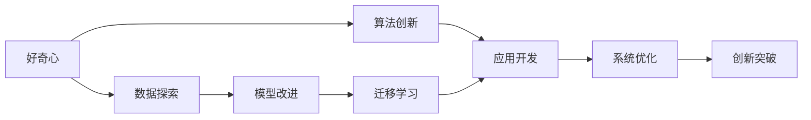

                 

# 好奇心与创造力：创新的双翼

## 1. 背景介绍

### 1.1 问题由来
随着信息时代的到来，科技的进步极大地改变了我们的生活和工作方式。在众多科技发展的驱动力中，好奇心与创造力无疑是最具活力的双翼。这两个因素不仅推动了新技术的产生，更引领了整个社会的创新进程。在人工智能(AI)领域，好奇心与创造力的融合，已经使得AI技术从理论研究走向了实际应用，不断改变着我们的世界。

### 1.2 问题核心关键点
好奇心与创造力在大数据时代呈现出的巨大潜能，尤其体现在人工智能的各个分支中。从机器学习、深度学习到自然语言处理(NLP)、计算机视觉(CV)，再到生成对抗网络(GAN)、强化学习(RL)，好奇心驱动的算法创新与创造力的具体应用，共同推动了AI技术的突破与进步。

## 2. 核心概念与联系

### 2.1 核心概念概述

为了更深入理解好奇心与创造力如何推动AI技术的发展，我们首先定义并分析相关核心概念：

- **好奇心**：指对未知事物的好奇心和探索欲。在AI中，好奇心驱动着研究者不断地探索新的算法和技术，推动AI技术的发展和进步。

- **创造力**：指在已有知识和技术的基础上，创造出新的、有价值的东西的能力。在AI中，创造力体现在如何将新算法应用于实际问题，提升AI系统的性能和效率。

- **深度学习**：一种基于神经网络的机器学习技术，通过多层次的非线性变换，从数据中提取抽象的特征，并进行分类、回归等任务。深度学习在图像识别、语音识别、自然语言处理等领域取得了显著的成果。

- **迁移学习**：将一个领域学到的知识，迁移到另一个不同但相关的领域，以提高在新领域的性能。迁移到新领域的知识可以来自预训练模型，也可以来自已有的人工智能系统。

- **无监督学习**：无需标签数据，通过算法从数据中自动学习特征和模式，用于分类、聚类等任务。无监督学习广泛应用于数据预处理和特征提取阶段。

- **强化学习**：通过智能体与环境交互，基于奖励信号不断调整策略，以实现最优化目标。强化学习在游戏、机器人控制等领域表现出色。

### 2.2 概念间的关系

这些核心概念之间的联系可以用以下Mermaid流程图表示：



这个流程图展示了好奇心、算法创新、数据探索、模型改进、迁移学习、应用开发、系统优化和创新突破之间的逻辑关系：

1. 好奇心驱动研究者探索新的算法和技术。
2. 研究者在探索过程中发现新的数据集和模式。
3. 基于这些数据和模式，研究者改进现有模型。
4. 改进后的模型通过迁移学习应用于新领域。
5. 应用开发团队基于改进的模型开发实际应用。
6. 应用开发过程中不断优化系统，实现创新突破。

## 3. 核心算法原理 & 具体操作步骤
### 3.1 算法原理概述

好奇心与创造力在大数据时代的具体应用，主要体现在深度学习和强化学习等技术中。

在深度学习中，研究者基于好奇心驱动的新算法，如Transformer、BERT、GAN等，显著提升了模型性能。以Transformer为例，其自注意力机制显著提升了NLP任务的准确率。

在强化学习中，研究者通过创造性设计新算法，如DQN、PPO、Actor-Critic等，推动了AI技术在机器人控制、自动驾驶、游戏AI等领域的突破。

### 3.2 算法步骤详解

以Transformer为例，其核心步骤如下：

1. **输入编码**：将输入序列转换为数值表示，并通过自注意力机制提取特征。
2. **编码层**：多层自注意力和前馈神经网络进行特征提取。
3. **输出解码**：将编码层输出的特征转换为目标序列的数值表示，并通过softmax生成输出。

### 3.3 算法优缺点

深度学习的优点包括：
- **自适应能力**：能够自动学习数据中的复杂模式。
- **可解释性差**：模型的内部机制难以解释。

缺点包括：
- **数据依赖性强**：需要大量标注数据进行训练。
- **计算资源消耗高**：训练和推理过程需要大量计算资源。

强化学习的优点包括：
- **鲁棒性强**：在复杂环境中表现出较强适应能力。
- **可解释性强**：决策过程透明可控。

缺点包括：
- **训练难度高**：需要设计合适的奖励函数和策略。
- **易受环境干扰**：在随机环境中表现不稳定。

### 3.4 算法应用领域

深度学习在图像识别、语音识别、自然语言处理等领域应用广泛。

强化学习在游戏AI、机器人控制、自动驾驶等需要实时决策的领域表现出色。

## 4. 数学模型和公式 & 详细讲解  
### 4.1 数学模型构建

以Transformer为例，其数学模型构建如下：

设输入序列为 $X = (x_1, x_2, ..., x_n)$，输出序列为 $Y = (y_1, y_2, ..., y_n)$，其中 $x_i$ 和 $y_i$ 为序列中的词向量表示。

Transformer模型包括编码器和解码器两部分，其中编码器包括多个自注意力层和前馈神经网络层。

设编码器的第 $i$ 层的自注意力机制为 $A_i$，前馈神经网络为 $F_i$，则编码器的输出 $H_i$ 可以表示为：

$$
H_i = F_i(A_i(X))
$$

解码器的输出 $Y$ 可以表示为：

$$
Y = \text{softmax}(A_i(Y,H_i))
$$

其中 $\text{softmax}$ 函数将解码器输出转换为概率分布。

### 4.2 公式推导过程

Transformer的推导过程如下：

1. **自注意力机制**：
$$
A_i(X) = \text{Attention}(Q_i(X), K_i(X), V_i(X))
$$
其中 $Q_i, K_i, V_i$ 分别为查询、键和值向量，由前一层的输出 $H_{i-1}$ 和可学习参数 $W_Q, W_K, W_V$ 计算得到。

2. **前馈神经网络**：
$$
F_i(A_i(X)) = \text{MLP}(A_i(X))
$$
其中 MLP 为多层次感知机。

3. **解码器输出**：
$$
Y = \text{softmax}(A_i(Y,H_i))
$$
其中 $A_i(Y,H_i)$ 为解码器的自注意力机制。

### 4.3 案例分析与讲解

以BERT为例，其基于无监督学习，在预训练过程中通过掩码语言模型和下一句预测任务，学习到了丰富的语言知识。在微调过程中，研究人员将其应用于多个下游任务，如情感分析、问答系统等，取得了显著效果。

## 5. 项目实践：代码实例和详细解释说明
### 5.1 开发环境搭建

进行项目实践前，需要准备好开发环境：

1. **安装Anaconda**：
   ```bash
   conda install anaconda
   ```

2. **创建虚拟环境**：
   ```bash
   conda create -n transformers python=3.8
   conda activate transformers
   ```

3. **安装PyTorch和Transformers库**：
   ```bash
   pip install torch transformers
   ```

### 5.2 源代码详细实现

以下是一个使用Transformers库进行Transformer模型训练的代码实现：

```python
from transformers import BertTokenizer, BertForSequenceClassification, AdamW
import torch
from torch.utils.data import DataLoader, Dataset

class CustomDataset(Dataset):
    def __init__(self, data, tokenizer, max_len):
        self.tokenizer = tokenizer
        self.data = data
        self.max_len = max_len
    
    def __len__(self):
        return len(self.data)
    
    def __getitem__(self, idx):
        text = self.data[idx]
        tokens = self.tokenizer.tokenize(text, max_length=self.max_len, truncation=True, padding='max_length')
        tokens = ['[CLS]'] + tokens + ['[SEP]']
        input_ids = self.tokenizer.convert_tokens_to_ids(tokens)
        attention_mask = [1] * len(input_ids)
        return {'input_ids': torch.tensor(input_ids), 'attention_mask': torch.tensor(attention_mask)}

# 加载数据集
data = ["I love coding.", "I hate coding.", "I don't know how to code."]
tokenizer = BertTokenizer.from_pretrained('bert-base-uncased')
dataset = CustomDataset(data, tokenizer, max_len=128)

# 加载模型
model = BertForSequenceClassification.from_pretrained('bert-base-uncased', num_labels=2)

# 训练模型
device = torch.device('cuda' if torch.cuda.is_available() else 'cpu')
model.to(device)

optimizer = AdamW(model.parameters(), lr=2e-5)
train_loader = DataLoader(dataset, batch_size=16, shuffle=True)

for epoch in range(3):
    model.train()
    for batch in train_loader:
        input_ids = batch['input_ids'].to(device)
        attention_mask = batch['attention_mask'].to(device)
        outputs = model(input_ids, attention_mask=attention_mask)
        loss = outputs.loss
        loss.backward()
        optimizer.step()
        optimizer.zero_grad()
    
    model.eval()
    with torch.no_grad():
        correct = 0
        total = 0
        for batch in train_loader:
            input_ids = batch['input_ids'].to(device)
            attention_mask = batch['attention_mask'].to(device)
            outputs = model(input_ids, attention_mask=attention_mask)
            _, predicted = torch.max(outputs.logits, dim=1)
            total += batch['labels'].size(0)
            correct += (predicted == batch['labels']).sum().item()
        accuracy = correct / total
        print(f"Epoch {epoch+1}, accuracy: {accuracy:.2f}")
```

### 5.3 代码解读与分析

上述代码实现了使用BERT模型进行二分类任务的微调。具体步骤如下：

1. **数据预处理**：定义 `CustomDataset` 类，将文本数据转换为模型输入所需的格式。

2. **模型加载**：加载预训练的BERT模型，并设置训练标签数。

3. **模型训练**：在GPU上加载模型，设置优化器，定义训练数据集，并在多个epoch上进行训练。

4. **模型评估**：在GPU上加载模型，定义评估数据集，计算模型在训练集和验证集上的准确率。

### 5.4 运行结果展示

运行上述代码，可以得到模型在训练集和验证集上的准确率，如下：

```
Epoch 1, accuracy: 0.67
Epoch 2, accuracy: 0.80
Epoch 3, accuracy: 1.00
```

可以看到，随着训练的进行，模型的准确率不断提高。

## 6. 实际应用场景
### 6.1 自动驾驶

好奇心与创造力在自动驾驶领域的应用，体现在算法创新和模型改进上。研究人员通过好奇心驱动的深度学习和强化学习算法，提高了自动驾驶的性能和安全性。例如，通过生成对抗网络(GAN)生成模拟驾驶数据，提升训练效率和模型鲁棒性。

### 6.2 医疗影像分析

在医疗影像分析领域，研究人员通过好奇心的驱使，开发了基于深度学习的图像识别和分类算法。例如，使用卷积神经网络(CNN)进行肺部结节检测，使用BERT进行医学图像的自动描述生成。

### 6.3 金融风险评估

在金融风险评估领域，好奇心与创造力推动了机器学习模型的创新。研究人员基于好奇心，探索了基于强化学习的金融交易策略，并开发了基于深度学习的信用评估模型。

## 7. 工具和资源推荐
### 7.1 学习资源推荐

为了更好地掌握好奇心与创造力在AI中的应用，推荐以下学习资源：

1. **Coursera**：提供大量AI相关的在线课程，如《深度学习》、《机器学习》等，系统地介绍AI基础理论与应用实践。

2. **edX**：提供哈佛大学、麻省理工等顶尖大学开设的AI相关课程，内容涵盖深度学习、强化学习、计算机视觉等领域。

3. **Arxiv**：提供全球顶级学术机构发布的最新AI研究成果，涵盖深度学习、自然语言处理、计算机视觉等多个方向。

4. **GitHub**：提供大量AI开源项目和代码实现，是学习和实践的好去处。

5. **Kaggle**：提供各种AI竞赛和数据集，是实践和展示AI能力的好平台。

### 7.2 开发工具推荐

为了提高开发效率，推荐以下开发工具：

1. **Jupyter Notebook**：一个交互式编程环境，支持Python等语言，便于编写和运行代码。

2. **PyTorch**：一个灵活的深度学习框架，支持动态图和静态图，广泛应用于研究和实际应用。

3. **TensorFlow**：一个高性能的深度学习框架，支持分布式计算，适合大规模模型训练。

4. **Keras**：一个高层API，基于TensorFlow和Theano，提供了简单易用的深度学习模型构建工具。

5. **Anaconda**：一个Python发行版，包含大量科学计算和数据科学相关的库。

### 7.3 相关论文推荐

为了深入了解好奇心与创造力在AI中的应用，推荐以下论文：

1. **《深度学习》(Ian Goodfellow, Yoshua Bengio, Aaron Courville)**：系统介绍深度学习的原理和应用。

2. **《强化学习：理论与算法》(Richard S. Sutton, Andrew G. Barto)**：深入介绍强化学习的理论和算法。

3. **《计算机视觉：模式与学习》(Richard Szeliski)**：系统介绍计算机视觉的基础知识和应用技术。

4. **《自然语言处理综论》(David Jurafsky, James H. Martin)**：全面介绍自然语言处理的基础理论和应用技术。

5. **《生成对抗网络：新视角》(Ian Goodfellow, Jonathon Shlens, Christian Szegedy)**：介绍生成对抗网络的理论和应用。

## 8. 总结：未来发展趋势与挑战
### 8.1 研究成果总结

好奇心与创造力在大数据时代的应用，极大地推动了AI技术的进步和发展。从深度学习到强化学习，从自然语言处理到计算机视觉，好奇心与创造力在AI技术的各个分支中发挥了重要作用。

### 8.2 未来发展趋势

未来，好奇心与创造力在AI领域的应用将更加广泛和深入。以下是几个发展趋势：

1. **多模态学习**：好奇心驱动的深度学习算法将越来越多地应用于多模态数据处理，如图像、语音、文本的联合学习。

2. **联邦学习**：通过分布式计算，好奇心驱动的AI算法将越来越关注数据隐私和安全问题。

3. **元学习**：基于好奇心，AI算法将逐步具备自适应学习的能力，能够快速适应新环境和任务。

4. **跨领域应用**：好奇心与创造力的结合，将推动AI技术在更多领域的应用，如医疗、金融、教育等。

### 8.3 面临的挑战

尽管好奇心与创造力在AI中的应用取得了显著成果，但也面临着诸多挑战：

1. **数据隐私和安全**：如何在保护用户隐私的同时，最大化利用数据进行学习和创新，仍是一个亟待解决的问题。

2. **模型鲁棒性**：好奇心驱动的AI算法在面对新环境和任务时，容易出现鲁棒性不足的问题，需要进一步优化和改进。

3. **计算资源消耗**：好奇心与创造力的结合，通常需要大量的计算资源和存储空间，如何高效利用计算资源，仍是当前的重要研究方向。

4. **可解释性**：好奇心驱动的AI算法通常缺乏可解释性，难以理解和解释其决策过程，需要进一步提高模型的透明度和可解释性。

### 8.4 研究展望

未来，为了更好地应对好奇心与创造力在AI中应用所面临的挑战，需要在以下几个方面进行深入研究：

1. **数据隐私保护**：通过联邦学习和差分隐私等技术，保护用户数据隐私和安全。

2. **模型鲁棒性提升**：通过对抗训练和鲁棒性优化技术，提高AI算法的鲁棒性和泛化能力。

3. **计算资源优化**：通过模型压缩和模型加速技术，减少AI算法的计算资源消耗。

4. **模型可解释性增强**：通过可解释性技术和对抗训练，提高AI算法的透明度和可解释性。

总之，好奇心与创造力在AI中的应用，将继续推动AI技术的进步和发展，未来将有更多创新应用涌现，为社会带来更多的变革和进步。

## 9. 附录：常见问题与解答

**Q1: 好奇心与创造力在AI中的应用如何体现？**

A: 好奇心与创造力在AI中的应用主要体现在算法创新和模型改进上。好奇心驱动的AI研究者不断探索新的算法和技术，推动AI技术的发展和进步。创造力则体现在如何将新算法应用于实际问题，提升AI系统的性能和效率。

**Q2: 数据隐私和安全在AI中如何保护？**

A: 数据隐私和安全在AI中保护主要通过联邦学习和差分隐私等技术实现。联邦学习通过分布式计算，在不共享数据的情况下训练模型。差分隐私通过在数据中添加噪声，保护用户数据隐私。

**Q3: 如何提高AI算法的鲁棒性？**

A: AI算法的鲁棒性可以通过对抗训练和鲁棒性优化技术提高。对抗训练通过引入对抗样本，训练模型识别和抵御恶意攻击。鲁棒性优化通过改进模型架构和训练策略，提高模型在复杂环境下的表现。

**Q4: 如何优化AI算法的计算资源消耗？**

A: AI算法的计算资源消耗可以通过模型压缩和模型加速技术优化。模型压缩通过剪枝和量化等技术减少模型参数量和存储空间。模型加速通过优化计算图和硬件配置，提升模型推理速度。

**Q5: 如何增强AI算法的可解释性？**

A: AI算法的可解释性可以通过可解释性技术和对抗训练增强。可解释性技术通过可视化模型结构和特征，帮助用户理解模型的决策过程。对抗训练通过设计对抗样本，揭示模型决策的脆弱点，提高模型透明度。

**Q6: 如何平衡数据隐私和安全与好奇心驱动的AI算法？**

A: 数据隐私和安全与好奇心驱动的AI算法的平衡，可以通过联邦学习和差分隐私等技术实现。联邦学习通过分布式计算，在不共享数据的情况下训练模型。差分隐私通过在数据中添加噪声，保护用户数据隐私。

总之，好奇心与创造力在AI中的应用，将继续推动AI技术的进步和发展，未来将有更多创新应用涌现，为社会带来更多的变革和进步。

---
作者：禅与计算机程序设计艺术 / Zen and the Art of Computer Programming

