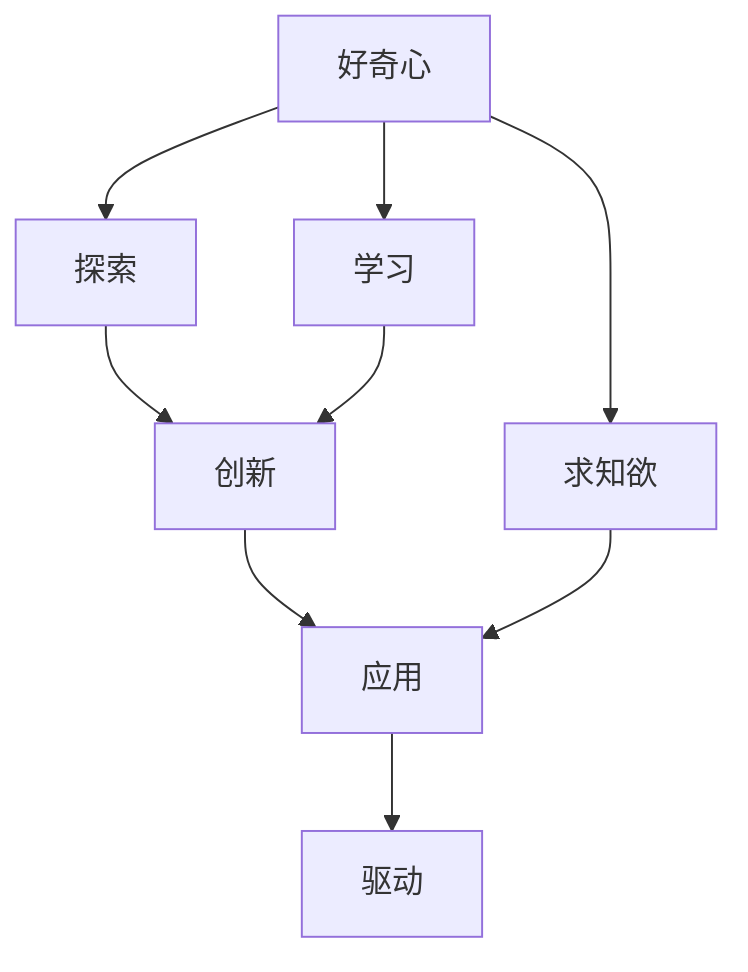

                 

## 1. 背景介绍

### 1.1 问题由来
好奇心与求知欲，自古以来便是人类文明发展的推动力。在信息爆炸、知识更新换代加速的今天，对新技术的探索、对新知识的渴求，成为了科技公司和个人保持竞争力的重要途径。

在IT领域，好奇心与求知欲不仅驱动了技术创新的不断涌现，也引领了人工智能(AI)、机器学习(ML)、深度学习(DL)等前沿技术的发展。而作为AI技术的重要组成部分，好奇心驱动了机器学习的算法创新、模型优化、应用拓展等方面，使得AI技术在众多领域取得了重大突破。

### 1.2 问题核心关键点
好奇心与求知欲对AI技术发展的推动主要体现在以下几个方面：

1. **算法创新**：推动了如梯度下降、随机梯度下降、Adam等优化算法，以及卷积神经网络(CNN)、循环神经网络(RNN)、Transformer等模型架构的创新。

2. **模型优化**：推动了模型的剪枝、量化、蒸馏、融合等优化技术的出现，以及多模型集成、迁移学习、对抗训练等方法的应用。

3. **应用拓展**：推动了AI技术在自然语言处理(NLP)、计算机视觉(CV)、语音识别(SR)、推荐系统等领域的广泛应用，使得AI技术逐步深入人们的日常生活。

4. **知识驱动**：推动了深度学习框架、开源社区、数据集构建等基础设施的发展，使得技术成果更容易共享、复用。

5. **伦理社会**：推动了AI伦理、隐私保护、公平性等社会问题的研究和思考，为AI技术的健康发展提供了指导。

### 1.3 问题研究意义
对好奇心与求知欲的研究，对于推动AI技术的发展具有重要意义：

1. **加速技术迭代**：好奇心的驱动使得研究者不断探索未知领域，推动技术突破，加速AI技术的演进。

2. **优化资源配置**：通过对技术的深刻理解，好奇心驱动的探索有助于合理配置资源，提高技术开发和应用效率。

3. **激发创新精神**：好奇心和求知欲是创新的源泉，有助于激发开发者和研究者的创造力，推动更多前沿技术的诞生。

4. **促进交叉融合**：好奇心驱动的技术研究有助于不同领域的交叉融合，产生更多具有创新性的应用场景。

5. **引导学术研究**：好奇心引领下的探索活动，为学术界提供了丰富的研究方向和研究课题，推动了学科的发展。

## 2. 核心概念与联系

### 2.1 核心概念概述

在探索AI技术的过程中，有几个关键概念必须加以理解：

- **好奇心**：指对新事物、新问题的好奇心，驱动人们去探索、学习、发现。

- **求知欲**：指对知识的渴望，驱使人们通过学习、实践来掌握和应用知识。

- **探索**：指主动寻找未知、探索可能的解决方案。

- **学习**：指通过阅读、实验、反思等手段获取知识和技能。

- **创新**：指通过探索和研究，提出新的方法、工具和应用。

- **应用**：指将创新技术应用于实际问题中，解决实际需求。

- **驱动**：指好奇心和求知欲作为内在动力，驱动技术和应用的演进。

### 2.2 概念间的关系

这些概念之间的联系可以通过以下Mermaid流程图来展示：



这个流程图展示了好奇心和求知欲是如何通过探索、学习和创新，最终驱动AI技术的演进和应用的过程。

## 3. 核心算法原理 & 具体操作步骤
### 3.1 算法原理概述

AI技术的发展离不开算法原理的深入研究。本文将对几个重要的算法原理进行详细介绍。

1. **梯度下降算法**：用于求解无约束或约束优化问题，通过迭代调整参数，使得目标函数达到最小值。

2. **随机梯度下降算法**：梯度下降的一种变体，每次仅使用单个样本或一小批样本的梯度信息进行参数更新，加速收敛。

3. **Adam算法**：一种基于梯度的一阶优化算法，结合了动量、梯度归一化等技术，适用于大规模数据集和大规模模型。

4. **卷积神经网络**：一种前馈神经网络，通过卷积层、池化层、全连接层等结构，实现对图像、文本等数据的特征提取。

5. **循环神经网络**：一种具有记忆功能的神经网络，适用于序列数据的时间建模，如语音识别、文本生成等。

6. **Transformer架构**：一种基于自注意力机制的神经网络，在NLP任务中表现优异，被广泛应用于机器翻译、文本分类、对话系统等。

### 3.2 算法步骤详解

下面我们以Transformer架构的微调为例，详细讲解微调的步骤。

**Step 1: 准备预训练模型和数据集**
- 选择合适的预训练语言模型 $M_{\theta}$ 作为初始化参数，如BERT、GPT等。
- 准备下游任务 $T$ 的标注数据集 $D$，划分为训练集、验证集和测试集。

**Step 2: 添加任务适配层**
- 根据任务类型，在预训练模型顶层设计合适的输出层和损失函数。
- 对于分类任务，通常在顶层添加线性分类器和交叉熵损失函数。
- 对于生成任务，通常使用语言模型的解码器输出概率分布，并以负对数似然为损失函数。

**Step 3: 设置微调超参数**
- 选择合适的优化算法及其参数，如 AdamW、SGD 等，设置学习率、批大小、迭代轮数等。
- 设置正则化技术及强度，包括权重衰减、Dropout、Early Stopping 等。
- 确定冻结预训练参数的策略，如仅微调顶层，或全部参数都参与微调。

**Step 4: 执行梯度训练**
- 将训练集数据分批次输入模型，前向传播计算损失函数。
- 反向传播计算参数梯度，根据设定的优化算法和学习率更新模型参数。
- 周期性在验证集上评估模型性能，根据性能指标决定是否触发 Early Stopping。
- 重复上述步骤直到满足预设的迭代轮数或 Early Stopping 条件。

**Step 5: 测试和部署**
- 在测试集上评估微调后模型 $M_{\hat{\theta}}$ 的性能，对比微调前后的精度提升。
- 使用微调后的模型对新样本进行推理预测，集成到实际的应用系统中。
- 持续收集新的数据，定期重新微调模型，以适应数据分布的变化。

### 3.3 算法优缺点

梯度下降算法及其变体具有以下优点：

- 收敛速度快，适用于大规模优化问题。
- 易于理解和实现，被广泛应用于各种机器学习任务。

同时，梯度下降算法也存在一些缺点：

- 容易陷入局部最优解。
- 对于高维空间，收敛速度较慢。

Transformer架构的优点包括：

- 模型性能优越，尤其在NLP任务中表现突出。
- 结构简洁，易于实现和优化。

缺点包括：

- 模型参数量较大，需要大量的计算资源。
- 对训练数据的依赖性较强，容易过拟合。

### 3.4 算法应用领域

梯度下降算法及其变体在优化领域得到了广泛应用，如线性回归、逻辑回归、深度学习等。

Transformer架构在NLP领域表现出色，被广泛应用于机器翻译、文本分类、对话系统等任务中。

## 4. 数学模型和公式 & 详细讲解 & 举例说明

### 4.1 数学模型构建

在本节中，我们将使用数学语言对梯度下降算法的原理进行详细阐述。

假设目标函数为 $f(\mathbf{x})$，其中 $\mathbf{x}$ 为模型参数向量。梯度下降算法通过迭代更新参数向量，使得目标函数 $f(\mathbf{x})$ 最小化。

目标函数 $f(\mathbf{x})$ 在当前参数 $\mathbf{x}$ 处的一阶泰勒展开式为：

$$
f(\mathbf{x}) \approx f(\mathbf{x}^t) + \nabla f(\mathbf{x}^t)^\top (\mathbf{x} - \mathbf{x}^t)
$$

其中 $\nabla f(\mathbf{x}^t)$ 为目标函数在 $\mathbf{x}^t$ 处的梯度向量。梯度下降算法的更新公式为：

$$
\mathbf{x}^{t+1} = \mathbf{x}^t - \eta \nabla f(\mathbf{x}^t)
$$

其中 $\eta$ 为学习率。

### 4.2 公式推导过程

下面推导梯度下降算法收敛的充分条件。

假设 $f(\mathbf{x})$ 为凸函数，且存在 Lipschitz 连续的梯度。若学习率 $\eta$ 满足：

$$
\eta < \frac{1}{L}
$$

则梯度下降算法将收敛到全局最优解。其中 $L$ 为梯度的 Lipschitz 常数。

证明如下：

假设 $\mathbf{x}^*$ 为全局最优解，则对任意 $\mathbf{x}$ 有：

$$
f(\mathbf{x}^*) - f(\mathbf{x}) \geq \nabla f(\mathbf{x}^*)^\top (\mathbf{x} - \mathbf{x}^*)
$$

代入梯度下降算法更新公式，得：

$$
f(\mathbf{x}^t) - f(\mathbf{x}^{t+1}) = \nabla f(\mathbf{x}^t)^\top (\mathbf{x}^t - \mathbf{x}^{t+1}) \geq \eta \nabla f(\mathbf{x}^t)^\top \nabla f(\mathbf{x}^t) = \eta ||\nabla f(\mathbf{x}^t)||^2
$$

累计 $t$ 次更新，得：

$$
f(\mathbf{x}^0) - f(\mathbf{x}^T) \geq \sum_{t=0}^{T-1} \eta ||\nabla f(\mathbf{x}^t)||^2
$$

若 $\eta < \frac{1}{L}$，则：

$$
f(\mathbf{x}^0) - f(\mathbf{x}^T) \geq \frac{1}{2L} ||\mathbf{x}^0 - \mathbf{x}^*||^2 - \frac{1}{2L} ||\mathbf{x}^T - \mathbf{x}^*||^2
$$

化简得：

$$
||\mathbf{x}^0 - \mathbf{x}^*||^2 \leq ||\mathbf{x}^0 - \mathbf{x}^T||^2
$$

因此，梯度下降算法将收敛到全局最优解。

### 4.3 案例分析与讲解

考虑线性回归任务，目标函数为：

$$
f(\mathbf{x}) = \frac{1}{2} ||\mathbf{y} - \mathbf{X}\mathbf{x}||^2
$$

其中 $\mathbf{y}$ 为标签向量，$\mathbf{X}$ 为特征矩阵，$\mathbf{x}$ 为参数向量。

梯度下降算法的更新公式为：

$$
\mathbf{x}^{t+1} = \mathbf{x}^t - \eta \mathbf{X}^\top (\mathbf{y} - \mathbf{X}\mathbf{x}^t)
$$

在实际应用中，一般使用随机梯度下降(SGD)进行参数更新：

$$
\mathbf{x}^{t+1} = \mathbf{x}^t - \eta \nabla f(\mathbf{x}^t)
$$

其中 $\nabla f(\mathbf{x}^t)$ 为随机梯度，可通过以下代码实现：

```python
from sklearn.linear_model import SGDRegressor
import numpy as np

X = np.array([[1, 2], [3, 4], [5, 6]])
y = np.array([3, 6, 9])
x0 = np.zeros(2)

model = SGDRegressor(learning_rate='constant', eta0=0.1, loss='huber')
model.fit(X, y)

print("Optimized Parameters: ", model.coef_)
```

## 5. 项目实践：代码实例和详细解释说明

### 5.1 开发环境搭建

在进行机器学习开发前，我们需要准备好开发环境。以下是使用Python进行Scikit-learn开发的环境配置流程：

1. 安装Anaconda：从官网下载并安装Anaconda，用于创建独立的Python环境。

2. 创建并激活虚拟环境：
```bash
conda create -n sklearn-env python=3.8 
conda activate sklearn-env
```

3. 安装Scikit-learn：
```bash
pip install scikit-learn
```

4. 安装各类工具包：
```bash
pip install numpy pandas scikit-learn matplotlib tqdm jupyter notebook ipython
```

完成上述步骤后，即可在`sklearn-env`环境中开始机器学习开发。

### 5.2 源代码详细实现

下面我们以线性回归任务为例，给出使用Scikit-learn进行梯度下降算法优化的Python代码实现。

```python
from sklearn.linear_model import SGDRegressor
from sklearn.datasets import make_regression
import numpy as np

# 生成样本数据
X, y = make_regression(n_samples=100, n_features=2, noise=0.1, random_state=0)

# 初始化参数向量
x0 = np.zeros(2)

# 训练模型
model = SGDRegressor(learning_rate='constant', eta0=0.1, loss='huber')
model.fit(X, y)

# 打印最优参数向量
print("Optimized Parameters: ", model.coef_)
```

在代码中，我们使用Scikit-learn中的SGDRegressor类实现梯度下降算法，其中`learning_rate`为学习率，`eta0`为初始学习率，`loss`为损失函数。通过调用`fit`方法，进行模型的训练。

### 5.3 代码解读与分析

下面我们详细解读一下关键代码的实现细节：

**make_regression函数**：
- 用于生成样本数据，包括特征矩阵 $X$ 和标签向量 $y$。

**SGDRegressor类**：
- 实现梯度下降算法，其中`learning_rate`为学习率，`eta0`为初始学习率，`loss`为损失函数。

**fit方法**：
- 训练模型，使用生成的样本数据进行梯度下降更新，直到收敛。

**coef_属性**：
- 存储最优的模型参数向量，可以通过打印输出获取。

## 6. 实际应用场景

### 6.1 线性回归

线性回归是一种常见的机器学习任务，用于建立变量之间的线性关系。通过梯度下降算法，可以优化模型参数，使得模型预测值与真实值之间的误差最小化。

在实际应用中，线性回归被广泛应用于金融预测、股票价格预测、销售预测等场景，帮助企业做出更准确的决策。例如，通过对历史销售数据的分析，预测未来的销售趋势，可以帮助企业优化库存管理、制定营销策略。

### 6.2 图像分类

图像分类是计算机视觉领域的重要任务之一，旨在将图像分为不同的类别。通过卷积神经网络(CNN)和梯度下降算法，可以训练出高精度的图像分类模型。

在实际应用中，图像分类被广泛应用于医学影像诊断、自动驾驶、视频监控等领域。例如，通过卷积神经网络对医学影像进行分类，可以帮助医生快速诊断疾病；通过图像分类技术，自动驾驶系统可以识别道路上的障碍物、行人等，保证行车安全。

### 6.3 自然语言处理

自然语言处理(NLP)是人工智能的重要分支，旨在让计算机理解和处理自然语言。通过Transformer架构和梯度下降算法，可以训练出高精度的NLP模型，用于文本分类、情感分析、机器翻译等任务。

在实际应用中，NLP技术被广泛应用于智能客服、智能推荐、智能搜索等领域。例如，通过Transformer模型，智能客服系统可以理解用户的自然语言输入，自动生成回复；通过NLP技术，推荐系统可以分析用户的兴趣偏好，推荐个性化的商品或内容。

### 6.4 未来应用展望

随着技术的发展，梯度下降算法及其变体的应用将更加广泛。未来，梯度下降算法将与更多的AI技术结合，如深度学习、强化学习、联邦学习等，产生更多具有创新性的应用。

在医疗领域，梯度下降算法可以用于预测患者的疾病风险，帮助医生制定更个性化的治疗方案。在金融领域，梯度下降算法可以用于预测股票市场的波动趋势，帮助投资者做出更明智的投资决策。

总之，梯度下降算法及其变体将在更多领域产生深远影响，推动AI技术的不断进步。

## 7. 工具和资源推荐

### 7.1 学习资源推荐

为了帮助开发者系统掌握梯度下降算法及其应用，这里推荐一些优质的学习资源：

1. 《机器学习》书籍：周志华著，全面介绍了机器学习的基本概念和算法，是入门机器学习的必备书籍。

2. 《深度学习》课程：斯坦福大学开设的深度学习课程，涵盖深度学习的基本理论和实践，适合进一步深入学习。

3. 《Python机器学习》书籍：Jake VanderPlas著，介绍如何使用Python进行机器学习，包含丰富的代码示例。

4. Scikit-learn官方文档：Scikit-learn库的官方文档，提供了丰富的学习资源和代码示例，是学习机器学习的绝佳工具。

5. Kaggle竞赛平台：Kaggle提供了大量的机器学习竞赛项目，可以实战练习，提升技能。

通过对这些资源的学习实践，相信你一定能够快速掌握梯度下降算法的精髓，并用于解决实际的机器学习问题。

### 7.2 开发工具推荐

高效的开发离不开优秀的工具支持。以下是几款用于梯度下降算法开发的常用工具：

1. Python：作为机器学习的主流编程语言，Python拥有丰富的机器学习库和工具，如Scikit-learn、TensorFlow、PyTorch等。

2. Scikit-learn：基于Python的机器学习库，提供了丰富的算法实现和数据预处理工具，适合快速迭代研究。

3. TensorFlow：由Google主导开发的深度学习框架，生产部署方便，适合大规模工程应用。

4. PyTorch：基于Python的深度学习框架，灵活动态，适合深度学习研究。

5. Jupyter Notebook：交互式编程环境，适合开发、测试、协作等场景，广泛应用于数据科学领域。

合理利用这些工具，可以显著提升梯度下降算法的开发效率，加快创新迭代的步伐。

### 7.3 相关论文推荐

梯度下降算法的研究历史悠久，以下是几篇奠基性的相关论文，推荐阅读：

1. Gradient Descent and Beyond: A Survey (J. M. Nocedal and S. J. Wright, 2021)：全面介绍了梯度下降算法的原理、变体和优化技术。

2. Adaptive Moment Estimation (Kingma et al., 2014)：提出了Adam优化算法，在梯度下降算法的基础上引入了动量、梯度归一化等技术，具有较高的收敛速度和鲁棒性。

3. Minimizing Sums of Non-convex Functions (Pearlmutter et al., 1997)：提出了随机梯度下降算法，通过随机化梯度计算，加速收敛速度。

4. Optimization Methods for Training Deep Learning Models (Goodfellow et al., 2016)：介绍了深度学习中的优化方法，包括梯度下降、Adam等，详细讨论了各种算法的优缺点。

这些论文代表了梯度下降算法的研究进展，通过学习这些前沿成果，可以帮助研究者把握学科前进方向，激发更多的创新灵感。

除上述资源外，还有一些值得关注的前沿资源，帮助开发者紧跟梯度下降算法的最新进展，例如：

1. arXiv论文预印本：人工智能领域最新研究成果的发布平台，包括大量尚未发表的前沿工作，学习前沿技术的必读资源。

2. 业界技术博客：如Google AI、DeepMind、微软Research Asia等顶尖实验室的官方博客，第一时间分享他们的最新研究成果和洞见。

3. 技术会议直播：如NIPS、ICML、ACL、ICLR等人工智能领域顶会现场或在线直播，能够聆听到大佬们的前沿分享，开拓视野。

4. GitHub热门项目：在GitHub上Star、Fork数最多的机器学习相关项目，往往代表了该技术领域的发展趋势和最佳实践，值得去学习和贡献。

5. 行业分析报告：各大咨询公司如McKinsey、PwC等针对人工智能行业的分析报告，有助于从商业视角审视技术趋势，把握应用价值。

总之，对于梯度下降算法的学习和实践，需要开发者保持开放的心态和持续学习的意愿。多关注前沿资讯，多动手实践，多思考总结，必将收获满满的成长收益。

## 8. 总结：未来发展趋势与挑战

### 8.1 总结

本文对梯度下降算法及其在机器学习中的应用进行了全面系统的介绍。首先阐述了梯度下降算法的发展历史和原理，明确了其在优化问题求解中的重要地位。其次，从原理到实践，详细讲解了梯度下降算法的核心步骤和具体实现，给出了梯度下降算法在机器学习任务中的代码实例。同时，本文还广泛探讨了梯度下降算法的应用场景，展示了其在多个领域的广泛应用。此外，本文精选了梯度下降算法的各类学习资源，力求为读者提供全方位的技术指引。

通过本文的系统梳理，可以看到，梯度下降算法是机器学习中不可或缺的一部分，其应用广泛，影响深远。未来的研究需要在算法原理、优化技术、应用场景等方面持续探索，以应对不断变化的技术和应用需求。

### 8.2 未来发展趋势

展望未来，梯度下降算法及其变体的发展趋势包括：

1. 自适应优化技术：通过自适应学习率调整、自适应正则化等技术，进一步提升算法的收敛速度和鲁棒性。

2. 多目标优化算法：针对多目标优化问题，开发能够同时优化多个目标的优化算法，提升模型的综合性能。

3. 联邦学习算法：通过分布式优化技术，在保护数据隐私的前提下，实现多个设备之间的协同学习。

4. 对抗训练算法：通过引入对抗样本，增强模型对噪声和扰动的鲁棒性，提升模型泛化能力。

5. 多模态优化算法：针对多模态数据，开发能够同时处理不同类型数据的优化算法，实现更全面的特征表示。

6. 可解释性优化算法：通过引入可解释性技术，使得模型决策过程透明化，提升算法的可信度。

7. 神经网络优化算法：针对神经网络模型，开发能够加速训练、优化参数的算法，提高模型的性能和效率。

以上趋势凸显了梯度下降算法的广阔前景。这些方向的探索发展，必将进一步提升机器学习模型的性能和应用范围，为人工智能技术的发展提供新的动力。

### 8.3 面临的挑战

尽管梯度下降算法及其变体已经取得了瞩目成就，但在迈向更加智能化、普适化应用的过程中，它仍面临着诸多挑战：

1. 模型复杂度增加：随着神经网络结构的复杂化，梯度下降算法需要处理更多的参数和更复杂的优化问题，增加了计算复杂度。

2. 训练速度瓶颈：在处理大规模数据集时，梯度下降算法需要较长的时间进行训练，限制了模型的应用效率。

3. 内存和存储限制：神经网络模型参数量巨大，训练和推理过程中需要大量的内存和存储资源。

4. 模型过拟合问题：在处理噪声数据时，梯度下降算法容易陷入局部最优解，导致模型过拟合。

5. 可解释性不足：梯度下降算法的优化过程往往难以解释，模型决策过程缺乏透明性，难以进行调试和优化。

6. 数据隐私问题：在大规模数据集上训练模型时，数据隐私和安全问题不容忽视，需要采取相应的隐私保护措施。

7. 算法鲁棒性不足：梯度下降算法在面对数据噪声、模型泛化等问题时，鲁棒性有待进一步提升。

正视这些挑战，积极应对并寻求突破，将使梯度下降算法在未来的应用中更加高效、可靠、安全。

### 8.4 研究展望

面对梯度下降算法所面临的种种挑战，未来的研究需要在以下几个方面寻求新的突破：

1. 优化算法的多样化：开发更多的优化算法，如自适应优化算法、多目标优化算法等，以满足不同应用场景的需求。

2. 算法鲁棒性的提升：引入更多的鲁棒性技术，如对抗训练、噪声注入等，提升模型对噪声和扰动的鲁棒性。

3. 可解释性技术的引入：引入可解释性技术，如梯度可视化、模型蒸馏等，增强模型的透明性和可解释性。

4. 分布式优化的实现：通过分布式计算技术，提高训练效率和资源利用率。

5. 数据隐私保护措施：引入隐私保护技术，如差分隐私、联邦学习等，保护数据隐私和安全。

6. 多模态数据处理能力：开发能够同时处理不同类型数据的算法，实现更全面的特征表示。

这些研究方向将推动梯度下降算法向更高的台阶发展，为人工智能技术的应用带来新的突破。

## 9. 附录：常见问题与解答

**Q1：梯度下降算法为什么会陷入局部最优解？

