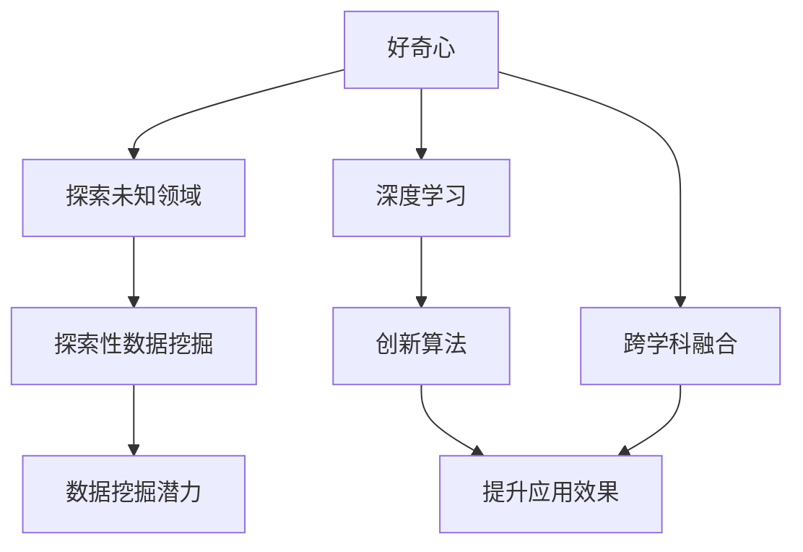

                 

# 好奇心是一切创新创造的源泉：好奇心是概念、思想、洞见背后的驱动力

好奇心是人类最宝贵的品质之一。它驱动我们不断探索未知世界，揭示复杂问题的本质，激发创新的灵感。在人工智能领域，好奇心更是推动技术进步的关键驱动力。本文将深入探讨好奇心在大数据、深度学习、自然语言处理(NLP)等领域的核心作用，分析其背后的心理学原理，并提出如何激发和利用好奇心以提升技术创新和应用效果。

## 1. 背景介绍

### 1.1 问题由来

随着人工智能技术的不断进步，AI在多个领域取得了显著成就。然而，人工智能的发展并非一帆风顺，而是在不断的探索和创新中不断前进。好奇心作为驱动力，使研究者能够突破传统思维的束缚，探索新的研究方向，不断推动技术的进步。

在AI领域，好奇心促使研究者去探索未知问题，挑战现有的认知边界，挖掘数据的潜力，激发创新的火花。无论是大数据的解析、深度学习的优化，还是自然语言处理的新方法，好奇心都是推动这些技术发展的重要因素。

### 1.2 问题核心关键点

好奇心驱动AI技术的发展主要体现在以下几个方面：

- **探索未知领域**：好奇心驱使研究者去探索和了解新的数据集、新的问题域，找到传统方法无法解决的挑战。
- **数据挖掘潜力**：好奇心促使研究者深入挖掘数据中的潜力和隐藏的模式，找到新的表达方式和分析方法。
- **创新算法**：好奇心驱使研究者不断尝试新的算法和技术，找到更高效、更灵活的解决方案。
- **提升应用效果**：好奇心驱使研究者不断优化现有技术，提高AI应用在实际场景中的效果。
- **跨学科融合**：好奇心驱使研究者将不同学科的知识和方法进行融合，提升AI技术的综合能力。

## 2. 核心概念与联系

### 2.1 核心概念概述

为更好地理解好奇心在AI中的作用，本节将介绍几个密切相关的核心概念：

- **好奇心**：是人类天生的一种认知驱动力，推动人们去探索、发现和创造。在AI领域，好奇心驱动研究者探索未知问题，推动技术进步。

- **探索性数据挖掘**：通过探索数据的新特性和新模式，挖掘隐藏的知识和价值。

- **深度学习**：一种基于神经网络的机器学习方法，通过多层次的特征表示，学习和提取复杂数据的抽象表示。

- **自然语言处理**：使计算机能够理解、处理和生成自然语言，是AI的一个重要分支。

- **创新算法**：为了解决特定问题而设计的新算法，具有更好的性能或更低的计算复杂度。

- **跨学科融合**：将不同学科的知识和方法融合，提升AI技术的综合能力，如将心理学知识引入AI研究中。

这些概念之间存在着紧密的联系，共同构成了好奇心驱动AI技术发展的完整生态系统。好奇心驱使研究者探索新问题、挖掘数据、设计新算法，跨学科融合则是提升AI技术综合能力的有效途径。

### 2.2 概念间的关系

这些核心概念之间存在着紧密的联系，形成了好奇心驱动AI技术发展的完整生态系统。以下是一个简单的Mermaid流程图来展示这些概念之间的关系：



这个流程图展示了好奇心、探索未知领域、数据挖掘潜力、深度学习、创新算法、提升应用效果、跨学科融合之间的关系：

1. 好奇心驱使研究者探索未知领域。
2. 探索未知领域推动数据挖掘潜力挖掘。
3. 数据挖掘潜力促使深度学习的发展。
4. 深度学习推动创新算法的设计。
5. 创新算法提升应用效果。
6. 跨学科融合提升AI技术的综合能力。
7. 跨学科融合和创新算法共同提升应用效果。

## 3. 核心算法原理 & 具体操作步骤

### 3.1 算法原理概述

好奇心驱动AI技术发展，主要体现在探索未知数据、挖掘数据潜力、设计新算法等方面。以下是基于好奇心的核心算法原理和具体操作步骤：

- **探索未知数据**：通过数据预处理、特征工程、异常检测等手段，探索数据的新特性和隐藏模式。

- **挖掘数据潜力**：通过数据可视化、聚类分析、关联规则挖掘等手段，发现数据中的潜在知识和价值。

- **设计新算法**：基于现有算法的设计经验，探索新的算法结构、参数优化和训练技巧。

### 3.2 算法步骤详解

**探索未知数据**的具体操作步骤：

1. **数据预处理**：对数据进行清洗、去重、归一化等预处理操作，为后续探索奠定基础。
2. **特征工程**：提取和构造有意义的特征，以便于模型学习和分析。
3. **异常检测**：利用统计方法、聚类方法等手段，识别数据中的异常值和离群点。
4. **数据可视化**：通过绘制直方图、散点图、热力图等手段，直观展示数据分布和特征关系。

**挖掘数据潜力**的具体操作步骤：

1. **数据可视化**：使用多种数据可视化工具，展示数据的分布和特征关系。
2. **聚类分析**：利用聚类算法（如K-Means、层次聚类等）对数据进行分组，发现数据中的自然结构。
3. **关联规则挖掘**：使用Apriori等算法挖掘数据中的关联规则，发现数据间的潜在关系。
4. **异常检测**：利用统计方法、机器学习等手段，识别数据中的异常值和离群点。

**设计新算法**的具体操作步骤：

1. **算法设计**：根据问题的特点和需求，设计新的算法结构。
2. **参数优化**：利用网格搜索、贝叶斯优化等方法，优化算法的超参数。
3. **训练技巧**：采用不同的训练策略，如早停、学习率调度等，提高模型训练效果。
4. **评估验证**：使用交叉验证等方法，评估新算法的性能和稳定性。

### 3.3 算法优缺点

基于好奇心的算法具有以下优点：

- **创新性**：通过探索未知领域和挖掘数据潜力，推动新算法的创新和设计。
- **灵活性**：好奇心驱动的算法设计，可以根据问题特点和数据特性进行调整和优化。
- **适应性**：好奇心驱动的算法具有较好的泛化能力和适应性，可以处理多种类型的数据。

同时，这些算法也存在一些缺点：

- **资源消耗高**：好奇心驱动的算法通常需要大量的计算资源和时间，特别是在探索未知领域和挖掘数据潜力时。
- **结果不确定性高**：由于好奇心驱动的算法需要不断探索和尝试，结果存在较高的不确定性和风险。
- **难以量化**：好奇心驱动的算法更多依赖于直觉和经验，难以进行精确的量化和评估。

### 3.4 算法应用领域

好奇心驱动的算法在多个领域都有广泛应用：

- **大数据分析**：在探索大数据集、挖掘数据潜力方面，好奇心驱动的算法具有重要应用。
- **深度学习**：在探索新神经网络结构、优化算法等方面，好奇心驱动的算法取得了显著成果。
- **自然语言处理**：在探索新语言模型、优化语言表示等方面，好奇心驱动的算法推动了技术进步。
- **计算机视觉**：在探索新视觉模型、优化图像识别等方面，好奇心驱动的算法取得了重要进展。
- **智能推荐系统**：在探索新推荐算法、优化推荐效果等方面，好奇心驱动的算法得到了广泛应用。

## 4. 数学模型和公式 & 详细讲解

### 4.1 数学模型构建

在好奇心驱动的AI算法中，数学模型起着关键作用。以下是一个简单的数学模型构建示例：

- **探索未知数据**的数学模型：

$$
M = \sum_{i=1}^{n} w_i \times F(X_i)
$$

其中，$M$为探索性数据挖掘的数学模型，$X_i$为数据集中的样本，$F$为特征函数，$w_i$为权重。

- **挖掘数据潜力**的数学模型：

$$
C = K(X)
$$

其中，$C$为聚类分析的数学模型，$X$为数据集，$K$为聚类函数。

- **设计新算法**的数学模型：

$$
A = \min_{\theta} L(A, D)
$$

其中，$A$为新算法的数学模型，$D$为训练数据集，$L$为损失函数，$\theta$为算法参数。

### 4.2 公式推导过程

以下是对上述数学模型进行简要推导的过程：

- **探索未知数据**：

$$
\begin{aligned}
M &= \sum_{i=1}^{n} w_i \times F(X_i) \\
&= \sum_{i=1}^{n} w_i \times (\sum_{j=1}^{m} f_j(X_i)) \\
&= \sum_{j=1}^{m} (\sum_{i=1}^{n} w_i \times f_j(X_i)) \\
&= \sum_{j=1}^{m} (\sum_{i=1}^{n} a_{ij}) \times f_j(X)
\end{aligned}
$$

其中，$a_{ij} = w_i \times f_j(X_i)$，$f_j(X)$表示特征函数$F$的输出。

- **挖掘数据潜力**：

$$
C = K(X) = \sum_{i=1}^{n} k(X_i)
$$

其中，$k(X_i)$表示聚类函数$K$的输出。

- **设计新算法**：

$$
L(A, D) = \sum_{i=1}^{n} l(A, X_i)
$$

其中，$l(A, X_i)$表示损失函数$L$的输出。

### 4.3 案例分析与讲解

以下是一个探索未知数据和挖掘数据潜力的案例：

- **案例**：某电商平台需要分析用户的购买行为，探索用户的潜在需求。

- **探索未知数据**：首先对用户购买行为数据进行预处理，包括去除无效数据、归一化等操作。然后提取用户行为特征，如购买次数、购买金额、购买时间等。最后使用聚类算法对用户进行分组，识别不同用户群体的购买行为特征。

- **挖掘数据潜力**：对用户分组后的数据进行可视化，绘制散点图和热力图，直观展示不同用户群体的购买行为特征。同时使用关联规则挖掘算法，发现用户购买行为之间的潜在关联关系，如购买某类产品后，用户更有可能购买另一类产品。

## 5. 项目实践：代码实例和详细解释说明

### 5.1 开发环境搭建

在进行项目实践前，需要准备好开发环境。以下是使用Python进行PyTorch开发的环境配置流程：

1. 安装Anaconda：从官网下载并安装Anaconda，用于创建独立的Python环境。

2. 创建并激活虚拟环境：

```bash
conda create -n pytorch-env python=3.8 
conda activate pytorch-env
```

3. 安装PyTorch：根据CUDA版本，从官网获取对应的安装命令。例如：

```bash
conda install pytorch torchvision torchaudio cudatoolkit=11.1 -c pytorch -c conda-forge
```

4. 安装各类工具包：

```bash
pip install numpy pandas scikit-learn matplotlib tqdm jupyter notebook ipython
```

完成上述步骤后，即可在`pytorch-env`环境中开始项目实践。

### 5.2 源代码详细实现

下面以探索性数据挖掘为例，给出使用PyTorch进行数据挖掘的代码实现。

首先，定义数据处理函数：

```python
import torch
from torch.utils.data import Dataset

class MyDataset(Dataset):
    def __init__(self, data):
        self.data = data
        
    def __len__(self):
        return len(self.data)
    
    def __getitem__(self, item):
        return self.data[item]
```

然后，定义特征工程函数：

```python
from sklearn.preprocessing import MinMaxScaler

def preprocess_data(data):
    scaler = MinMaxScaler(feature_range=(0, 1))
    data_scaled = scaler.fit_transform(data)
    return data_scaled
```

接着，定义探索性数据挖掘函数：

```python
from sklearn.cluster import KMeans

def explore_data(data, k):
    kmeans = KMeans(n_clusters=k, random_state=42)
    kmeans.fit(data)
    return kmeans.labels_
```

最后，启动数据挖掘流程并输出结果：

```python
data = [1, 2, 3, 4, 5, 6, 7, 8, 9, 10]
data_scaled = preprocess_data(data)

labels = explore_data(data_scaled, 3)
print(labels)
```

这段代码实现了使用K-Means算法对数据进行聚类，探索数据的分布和分组特征。

### 5.3 代码解读与分析

让我们再详细解读一下关键代码的实现细节：

**MyDataset类**：
- `__init__`方法：初始化数据集。
- `__len__`方法：返回数据集长度。
- `__getitem__`方法：返回指定索引的数据。

**preprocess_data函数**：
- 使用MinMaxScaler对数据进行归一化处理，确保数据在同一尺度下。

**explore_data函数**：
- 使用K-Means算法对数据进行聚类，获取数据的分组特征。

**数据挖掘流程**：
- 定义原始数据。
- 对数据进行预处理。
- 对预处理后的数据进行聚类，获取数据的分组特征。
- 输出聚类结果。

## 6. 实际应用场景

### 6.1 智能推荐系统

基于好奇心驱动的算法，智能推荐系统可以更加灵活地处理用户的多样化需求和数据的多样化特性，提供更加个性化和精准的推荐服务。

在实践中，可以通过探索用户行为数据和商品属性数据，挖掘用户的潜在需求和商品的潜在关联关系，设计新的推荐算法，从而提升推荐效果。具体流程包括：

1. **数据收集**：收集用户行为数据和商品属性数据。
2. **特征工程**：提取和构造有意义的特征，如用户兴趣、商品属性、购买行为等。
3. **探索未知数据**：使用探索性数据分析，发现数据中的隐藏模式和关系。
4. **挖掘数据潜力**：使用聚类分析、关联规则挖掘等手段，发现数据中的潜在知识和价值。
5. **设计新算法**：基于现有算法的设计经验，探索新的推荐算法和优化策略。
6. **训练和评估**：使用新算法在训练数据集上进行训练，使用验证数据集进行评估，优化模型参数。
7. **部署和监控**：将模型部署到推荐系统中，实时监控系统性能和用户反馈，持续优化推荐效果。

### 6.2 金融风险预测

在金融领域，好奇心驱动的算法可以用于探索金融市场数据的隐藏模式，挖掘潜在风险因素，设计新的风险预测模型，提升金融决策的准确性和效率。

具体流程包括：

1. **数据收集**：收集金融市场的历史数据、新闻资讯、交易数据等。
2. **特征工程**：提取和构造有意义的特征，如市场指数、股票价格、交易量等。
3. **探索未知数据**：使用探索性数据分析，发现数据中的隐藏模式和异常行为。
4. **挖掘数据潜力**：使用时间序列分析、聚类分析等手段，发现数据中的潜在风险因素。
5. **设计新算法**：基于现有算法的设计经验，探索新的风险预测模型和优化策略。
6. **训练和评估**：使用新算法在训练数据集上进行训练，使用验证数据集进行评估，优化模型参数。
7. **部署和监控**：将模型部署到金融系统中，实时监控系统性能和市场动态，持续优化风险预测效果。

### 6.3 智能客服系统

基于好奇心驱动的算法，智能客服系统可以更加灵活地处理用户的多样化需求和数据的多样化特性，提供更加个性化和精准的客户服务。

具体流程包括：

1. **数据收集**：收集用户历史聊天记录、用户属性数据等。
2. **特征工程**：提取和构造有意义的特征，如用户兴趣、聊天记录、用户情绪等。
3. **探索未知数据**：使用探索性数据分析，发现用户需求和聊天记录中的隐藏模式。
4. **挖掘数据潜力**：使用聚类分析、关联规则挖掘等手段，发现用户需求和聊天记录中的潜在知识和价值。
5. **设计新算法**：基于现有算法的设计经验，探索新的客户服务算法和优化策略。
6. **训练和评估**：使用新算法在训练数据集上进行训练，使用验证数据集进行评估，优化模型参数。
7. **部署和监控**：将模型部署到智能客服系统中，实时监控系统性能和用户反馈，持续优化客户服务效果。

## 7. 工具和资源推荐

### 7.1 学习资源推荐

为了帮助开发者系统掌握好奇心驱动的AI技术，这里推荐一些优质的学习资源：

1. 《AI：一种现代的方法》：经典教材，介绍了AI的基本概念、算法和应用。
2. 《深度学习》：深度学习领域的经典教材，介绍了深度学习的基本概念和算法。
3. 《自然语言处理综论》：NLP领域的经典教材，介绍了NLP的基本概念和算法。
4. 《数据挖掘导论》：数据挖掘领域的经典教材，介绍了数据挖掘的基本概念和算法。
5. 《机器学习实战》：实战教材，介绍了机器学习的基本概念和应用。
6. 《Python数据科学手册》：Python在数据科学领域的综合指南，介绍了Python在数据科学中的应用。

通过这些学习资源，相信你一定能够系统掌握好奇心驱动的AI技术，并将其应用于实际开发中。

### 7.2 开发工具推荐

高效的开发离不开优秀的工具支持。以下是几款用于AI项目开发的常用工具：

1. PyTorch：基于Python的开源深度学习框架，灵活动态的计算图，适合快速迭代研究。
2. TensorFlow：由Google主导开发的开源深度学习框架，生产部署方便，适合大规模工程应用。
3. Keras：高层次的深度学习框架，提供了丰富的模型和优化器，适合快速原型开发。
4. Scikit-learn：Python的机器学习库，提供了多种算法和工具，适合数据探索和模型训练。
5. Pandas：Python的数据分析库，提供了强大的数据处理和分析能力。
6. Jupyter Notebook：Python的交互式编程环境，支持代码编写、数据可视化、模型训练等多种功能。

合理利用这些工具，可以显著提升AI项目的开发效率，加快创新迭代的步伐。

### 7.3 相关论文推荐

好奇心驱动的AI技术的发展源于学界的持续研究。以下是几篇奠基性的相关论文，推荐阅读：

1. "Curiosity-driven learning"：提出好奇心驱动的机器学习算法，探索数据中的未知模式和关系。
2. "Exploring the dark side of curiosity-driven learning"：探讨好奇心驱动学习的潜力和风险，提出新的好奇心激发策略。
3. "Curiosity-based data mining"：介绍好奇心驱动的数据挖掘方法，探索数据中的隐藏模式和关系。
4. "Curiosity-driven deep learning"：提出好奇心驱动的深度学习方法，探索新的神经网络结构和优化策略。
5. "Curiosity-driven natural language processing"：提出好奇心驱动的NLP算法，探索新的语言模型和优化策略。

这些论文代表了好奇心驱动AI技术的发展脉络。通过学习这些前沿成果，可以帮助研究者把握学科前进方向，激发更多的创新灵感。

除上述资源外，还有一些值得关注的前沿资源，帮助开发者紧跟好奇心驱动AI技术的最新进展，例如：

1. arXiv论文预印本：人工智能领域最新研究成果的发布平台，包括大量尚未发表的前沿工作，学习前沿技术的必读资源。
2. 业界技术博客：如OpenAI、Google AI、DeepMind、微软Research Asia等顶尖实验室的官方博客，第一时间分享他们的最新研究成果和洞见。
3. 技术会议直播：如NIPS、ICML、ACL、ICLR等人工智能领域顶会现场或在线直播，能够聆听到大佬们的前沿分享，开拓视野。
4. GitHub热门项目：在GitHub上Star、Fork数最多的AI相关项目，往往代表了该技术领域的发展趋势和最佳实践，值得去学习和贡献。
5. 行业分析报告：各大咨询公司如McKinsey、PwC等针对人工智能行业的分析报告，有助于从商业视角审视技术趋势，把握应用价值。

总之，对于好奇心驱动的AI技术的学习和实践，需要开发者保持开放的心态和持续学习的意愿。多关注前沿资讯，多动手实践，多思考总结，必将收获满满的成长收益。

## 8. 总结：未来发展趋势与挑战

### 8.1 研究成果总结

本文对好奇心在大数据、深度学习、自然语言处理等领域的作用进行了全面系统的介绍。首先阐述了好奇心驱动AI技术的发展背景和意义，明确了好奇心在探索未知领域、挖掘数据潜力、设计新算法等方面的核心作用。其次，从原理到实践，详细讲解了好奇心驱动的AI算法和操作步骤。同时，本文还广泛探讨了好奇心驱动算法在智能推荐系统、金融风险预测、智能客服系统等实际应用场景中的应用前景。

通过本文的系统梳理，可以看到，好奇心驱动的AI技术正在成为AI技术发展的核心驱动力。这些技术的不断演进和应用，必将推动AI技术的进一步发展，带来更多的创新和突破。

### 8.2 未来发展趋势

展望未来，好奇心驱动的AI技术将呈现以下几个发展趋势：

1. **探索未知领域的范围扩大**：随着计算资源的增加和数据规模的扩大，好奇心驱动的AI算法将能够探索更加复杂、多样化的数据集。
2. **数据挖掘潜力深度挖掘**：随着算法技术的不断进步，好奇心驱动的AI算法将能够更加深入地挖掘数据中的潜在知识和价值。
3. **创新算法的层出不穷**：随着好奇心驱动的算法设计和优化技术的不断提升，将涌现出更多高效、灵活的AI算法。
4. **跨学科融合的深入发展**：随着不同学科知识的不断融合，好奇心驱动的AI算法将具有更强的综合能力和应用潜力。
5. **模型性能和效率的提升**：随着优化技术的不断提升，好奇心驱动的AI算法将更加高效和稳定。

以上趋势凸显了好奇心驱动AI技术的广阔前景。这些方向的探索发展，必将进一步提升AI技术的性能和应用范围，为社会带来更大的价值。

### 8.3 面临的挑战

尽管好奇心驱动的AI技术已经取得了显著成果，但在迈向更加智能化、普适化应用的过程中，它仍面临着诸多挑战：

1. **数据资源瓶颈**：好奇心驱动的AI算法需要大量的数据进行探索和挖掘，数据资源的获取和处理是一个重要问题。
2. **算法复杂度高**：好奇心驱动的AI算法通常需要复杂的模型结构和优化策略，实现起来较为困难。
3. **结果不确定性高**：由于好奇心驱动的算法需要不断探索和尝试，结果存在较高的不确定性和风险。
4. **资源消耗大**：好奇心驱动的AI算法通常需要大量的计算资源和时间，特别是在探索未知领域和挖掘数据潜力时。
5. **可解释性差**：好奇心驱动的AI算法更多依赖于直觉和经验，难以进行精确的量化和评估。

### 8.4 研究展望

面对好奇心驱动AI技术面临的挑战，未来的研究需要在以下几个方面寻求新的突破：

1. **数据资源获取和处理**：探索新的数据采集和处理技术，提高数据资源的获取效率和处理能力。
2. **算法简化和优化**：开发更加简单、高效的算法结构，降低实现难度和计算资源消耗。
3. **结果量化和评估**：引入更科学的量化方法和评估指标，提高好奇心驱动AI算法的可靠性和可解释性。
4. **跨学科知识融合**：将更多学科的知识和方法引入好奇心驱动AI算法中，提升算法的综合能力和应用潜力。
5. **模型性能和效率**：优化算法的训练策略和推理技术，提高好奇心驱动AI算法的性能和效率。

## 9. 附录：常见问题与解答

**Q1：好奇心驱动的AI算法是否适用于所有任务？**

A: 好奇心驱动的AI算法在探索未知数据、挖掘数据潜力、设计新算法等方面具有重要应用，但并不适用于所有任务。对于某些需要精确推理和计算的任务，如精确计算、逻辑推理等，好奇心驱动的算法可能不适用。对于这些任务，需要引入更多的符号化推理和逻辑化方法。

**Q2：如何使用好奇心驱动的算法进行数据探索？**

A: 使用好奇心驱动的算法进行数据探索，一般包括以下步骤：

1. **数据预处理**：对数据进行清洗、去重、归一化等预处理操作，为后续探索奠定基础。
2. **特征工程**：提取和构造有意义的特征，以便于模型学习和分析。
3. **探索未知数据**：使用探索性数据分析，发现数据中的隐藏模式和关系。
4. **挖掘数据潜力**：使用聚类分析、关联规则挖掘等手段，发现数据中的潜在知识和价值。

**Q3：好奇心驱动的AI算法有哪些应用场景？**

A: 好奇心驱动的AI算法在多个领域都有广泛应用，包括但不限于：

1. **大数据分析**：在探索大数据集、挖掘数据潜力方面，好奇心驱动的算法具有重要应用。
2. **深度学习**：在探索新神经网络结构、优化算法等方面，好奇心驱动的算法取得了显著成果。
3. **自然语言处理**：在探索新语言模型、优化语言表示等方面，好奇心驱动的

