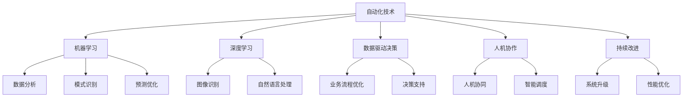
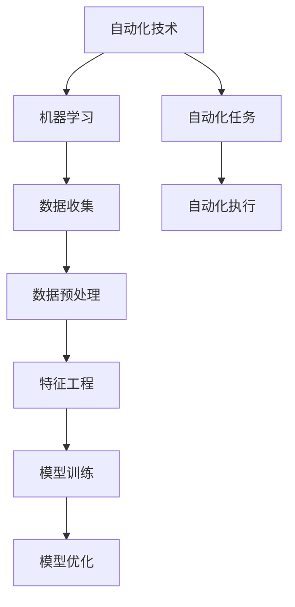
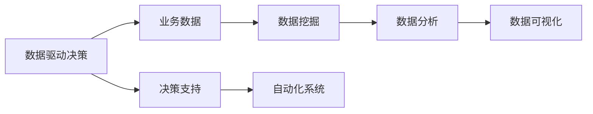
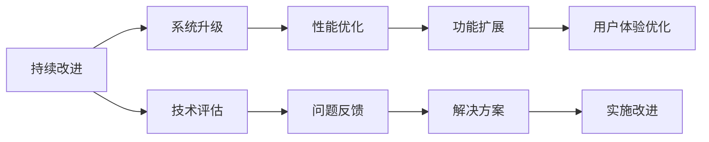
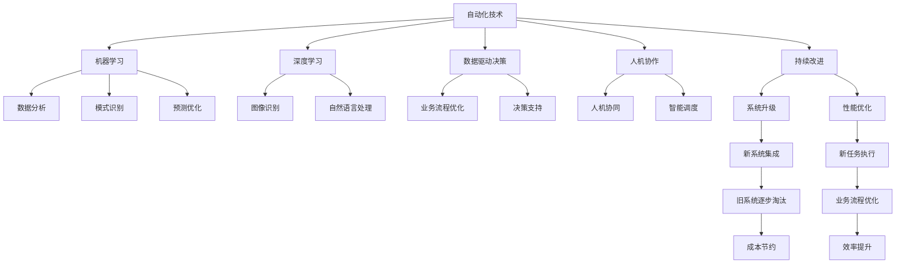

                 

## 1. 背景介绍

### 1.1 问题由来
在信息化时代，自动化技术已经成为推动产业升级和经济增长的重要引擎。从自动化生产线到智能客服，从无人驾驶到工业机器人，自动化正渗透到各个行业的方方面面。然而，尽管自动化技术取得了显著进步，但企业在采用自动化技术时仍面临诸多挑战，如技术选择、系统集成、性能优化、成本控制等问题。如何有效解决这些问题，为企业在自动化创业中建立竞争优势，是每一个创业者必须面对的重要课题。

### 1.2 问题核心关键点
创业企业建立自动化竞争优势的核心关键点在于以下几个方面：
1. **技术选型与集成**：选择合适的自动化技术和工具，将它们高效集成到企业现有业务流程中。
2. **性能优化与调优**：确保自动化系统具备高性能，能够稳定可靠地运行。
3. **成本控制与效益评估**：在保证系统性能的同时，控制成本，并准确评估自动化带来的经济效益。
4. **持续创新与升级**：不断探索新技术和新工具，推动自动化系统的持续改进和升级。
5. **团队能力提升**：培养具备自动化技术能力的团队，提升团队整体竞争力。

本文将深入探讨这些关键点，帮助创业者在自动化创业中建立竞争优势。

### 1.3 问题研究意义
自动化技术在提高效率、降低成本、提升质量等方面的优势不容忽视。然而，由于技术复杂度高、实施难度大、缺乏经验等原因，许多企业在使用自动化技术时面临重重困难。通过深入研究和实践，本文旨在为创业者提供系统性的自动化解决方案，帮助他们快速建立竞争优势，加速企业数字化转型。

## 2. 核心概念与联系

### 2.1 核心概念概述

为了更好地理解如何在自动化创业中建立竞争优势，本节将介绍几个密切相关的核心概念：

- **自动化技术**：指通过使用软件、硬件等技术手段，使业务流程自动化运行的过程。常见的自动化技术包括机器人流程自动化(RPA)、智能决策系统、自动化测试等。
- **机器学习与深度学习**：指利用算法和模型，让计算机系统从数据中学习并自主决策的技术。在自动化中，机器学习和深度学习可以用于数据分析、模式识别、预测优化等方面。
- **数据驱动决策**：指通过收集、分析和利用数据，指导企业运营和决策的过程。数据驱动决策在自动化中尤为重要，可以帮助企业准确评估自动化效果，优化业务流程。
- **人机协作**：指将人类智慧与机器能力结合，共同完成复杂任务的过程。人机协作在自动化中具有重要意义，能够充分发挥人的主观判断能力和机器的高效执行能力。
- **持续改进**：指通过不断优化和升级自动化系统，提升其性能和功能的过程。持续改进是企业持续创新和发展的关键。

这些核心概念之间的逻辑关系可以通过以下Mermaid流程图来展示：



这个流程图展示了几大核心概念在自动化中的相互关系：

1. 自动化技术是基础，通过引入机器学习和深度学习，提升系统的智能化水平。
2. 数据驱动决策支持自动化系统的高效运行，提供可靠的数据支持。
3. 人机协作充分利用人类的智慧和机器的效率，提升整体效率和效果。
4. 持续改进推动自动化系统不断优化升级，实现更高的性能和功能。

### 2.2 概念间的关系

这些核心概念之间存在着紧密的联系，形成了自动化创业的完整生态系统。下面我通过几个Mermaid流程图来展示这些概念之间的关系。

#### 2.2.1 自动化技术与机器学习的关系



这个流程图展示了自动化技术与机器学习的关系：

1. 自动化技术从数据收集、预处理到特征工程，为机器学习提供数据支持。
2. 机器学习通过模型训练和优化，提升自动化任务的执行效果。
3. 自动化任务通过执行模型，实现自动化的具体应用。

#### 2.2.2 数据驱动决策与自动化技术的关系



这个流程图展示了数据驱动决策与自动化技术的关系：

1. 业务数据通过数据挖掘和分析，生成有价值的信息。
2. 数据可视化将信息直观展示，支持决策。
3. 决策支持通过自动化系统实现，驱动业务流程优化。

#### 2.2.3 人机协作与自动化技术的关系


这个流程图展示了人机协作与自动化技术的关系：

1. 自动化任务通过智能决策，提高任务执行的效率和质量。
2. 人机交互实现人机协作，发挥人的主观判断和机器的高效执行。
3. 任务执行通过人机协作完成，实现自动化和智能化的结合。

#### 2.2.4 持续改进与自动化技术的关系



这个流程图展示了持续改进与自动化技术的关系：

1. 系统升级和性能优化是持续改进的基础。
2. 功能扩展和用户体验优化提升系统的实用性和用户体验。
3. 技术评估和问题反馈指导持续改进的方向，确保改进的准确性和有效性。

### 2.3 核心概念的整体架构

最后，我们用一个综合的流程图来展示这些核心概念在自动化创业中的整体架构：



这个综合流程图展示了从预训练到微调，再到持续学习的完整过程。自动化技术首先从数据收集、预处理到特征工程，为机器学习提供数据支持。机器学习通过模型训练和优化，提升自动化任务的执行效果。数据驱动决策通过自动化系统实现，驱动业务流程优化。人机协作充分利用人类的智慧和机器的效率，提升整体效率和效果。持续改进推动自动化系统不断优化升级，实现更高的性能和功能。

通过这些流程图，我们可以更清晰地理解自动化创业过程中各个核心概念的关系和作用，为后续深入讨论具体的自动化方法和技术奠定基础。

## 3. 核心算法原理 & 具体操作步骤
### 3.1 算法原理概述

自动化创业的关键在于选择合适的自动化技术和算法，并通过系统集成和性能优化，实现自动化系统的稳定高效运行。具体而言，可以从以下几个方面入手：

1. **技术选型与集成**：根据业务需求选择合适的自动化技术，并利用API或SDK将其集成到现有系统中。
2. **性能优化与调优**：通过算法优化、资源配置、硬件升级等手段，提升自动化系统的性能。
3. **成本控制与效益评估**：通过数据分析和模型预测，准确评估自动化带来的经济效益，控制成本。
4. **持续创新与升级**：通过探索新技术和新工具，推动自动化系统的持续改进和升级。
5. **团队能力提升**：通过培训和引进具备自动化技术能力的团队成员，提升整体竞争力。

### 3.2 算法步骤详解

下面详细介绍自动化创业中建立竞争优势的关键步骤：

**Step 1: 需求分析与技术选型**
- 分析业务需求，明确自动化目标和要求。
- 根据需求选择合适的自动化技术和工具，如RPA、自动化测试、智能决策系统等。

**Step 2: 系统设计与集成**
- 设计自动化系统的架构和流程，确保系统的模块化和可扩展性。
- 选择合适的集成工具和框架，将自动化技术集成到现有系统中。

**Step 3: 性能优化与调优**
- 分析系统性能瓶颈，通过算法优化、资源配置、硬件升级等手段，提升系统性能。
- 利用性能监控工具，实时监测系统运行状态，及时发现和解决性能问题。

**Step 4: 成本控制与效益评估**
- 收集自动化系统运行的数据，利用数据分析和模型预测，评估自动化带来的经济效益。
- 根据评估结果，调整自动化方案，控制成本。

**Step 5: 持续创新与升级**
- 跟踪最新的自动化技术和工具，探索新技术和新应用场景。
- 根据业务需求和市场变化，不断优化和升级自动化系统。

**Step 6: 团队能力提升**
- 通过培训和引进具备自动化技术能力的团队成员，提升团队整体竞争力。
- 定期组织团队学习和交流，保持团队技术的先进性和创新性。

### 3.3 算法优缺点

自动化创业中的自动化技术和算法具有以下优点：
1. **提升效率**：自动化技术可以处理大量重复性任务，显著提升业务流程的效率。
2. **降低成本**：通过减少人力投入，降低企业的运营成本。
3. **提高质量**：自动化技术可以减少人为错误，提升工作质量。
4. **灵活性强**：根据业务需求快速调整自动化方案，适应变化。
5. **可扩展性强**：系统模块化设计，便于扩展和升级。

同时，自动化技术和算法也存在以下缺点：
1. **技术复杂度高**：自动化系统涉及多技术领域，技术门槛高。
2. **实施难度大**：系统集成和性能优化需要专业技能，实施难度大。
3. **维护成本高**：自动化系统需要持续维护和优化，维护成本较高。
4. **依赖数据质量**：自动化系统依赖高质量的数据支持，数据质量问题可能导致系统失效。
5. **缺乏灵活性**：自动化系统难以处理复杂和动态变化的情况，缺乏灵活性。

### 3.4 算法应用领域

自动化技术在多个领域中得到了广泛应用，以下是几个典型的应用场景：

1. **金融自动化**：自动化交易、风险控制、客户服务、信贷审批等。
2. **制造业自动化**：自动化生产、质量检测、供应链管理、物流配送等。
3. **医疗自动化**：医疗影像诊断、病历管理、药物研发、患者咨询等。
4. **零售自动化**：自动化库存管理、客户关系管理、营销分析、客户服务等。
5. **客服自动化**：智能客服、语音识别、聊天机器人等。

这些领域中，自动化技术的应用不仅提高了效率和质量，还带来了显著的商业价值和经济效益。

## 4. 数学模型和公式 & 详细讲解 & 举例说明

### 4.1 数学模型构建

本节将使用数学语言对自动化创业中建立竞争优势的过程进行更加严格的刻画。

设自动化系统的运行成本为 $C$，自动化带来的经济效益为 $E$，自动化系统的初始投资为 $I$，自动化系统的运行时间为 $T$。则自动化创业的效益比 $\eta$ 可以表示为：

$$
\eta = \frac{E - C}{I}
$$

其中，$E = \frac{F}{T}$，$F$ 为自动化系统带来的经济效益。

### 4.2 公式推导过程

以下我们以金融自动化为例，推导效益比 $\eta$ 的计算公式。

假设金融自动化系统通过自动化交易提高了 $10\%$ 的收益率，每天运行时间为 $24$ 小时，初始投资为 $100$ 万元，运行成本为 $0.1$ 万元/小时。则有：

$$
\eta = \frac{0.1 \times 24 - 0.1 \times 24}{100} = 0
$$

说明自动化系统在短期内的经济效益为零。但如果将投资平摊到每小时，并考虑长期收益，则自动化系统的效益比将大大提升。

### 4.3 案例分析与讲解

假设金融自动化系统每天通过自动化交易提高 $5\%$ 的收益率，每周运行时间为 $168$ 小时，初始投资为 $1000$ 万元，运行成本为 $0.2$ 万元/小时。则有：

$$
\eta = \frac{0.05 \times 168 - 0.2 \times 168}{1000} = 0.0025
$$

即每年带来 $2.5\%$ 的经济效益，远高于运行成本。

这个案例展示了自动化系统的长期经济效益，以及初始投资对效益比的影响。

## 5. 项目实践：代码实例和详细解释说明

### 5.1 开发环境搭建

在进行自动化创业项目开发前，我们需要准备好开发环境。以下是使用Python进行PyTorch开发的环境配置流程：

1. 安装Anaconda：从官网下载并安装Anaconda，用于创建独立的Python环境。

2. 创建并激活虚拟环境：
```bash
conda create -n pytorch-env python=3.8 
conda activate pytorch-env
```

3. 安装PyTorch：根据CUDA版本，从官网获取对应的安装命令。例如：
```bash
conda install pytorch torchvision torchaudio cudatoolkit=11.1 -c pytorch -c conda-forge
```

4. 安装各类工具包：
```bash
pip install numpy pandas scikit-learn matplotlib tqdm jupyter notebook ipython
```

完成上述步骤后，即可在`pytorch-env`环境中开始自动化创业项目开发。

### 5.2 源代码详细实现

这里我们以金融自动化为例，给出使用PyTorch进行自动化创业项目的PyTorch代码实现。

首先，定义自动化系统运行成本、经济效益等关键参数：

```python
import numpy as np
from torch import nn, optim
from torch.utils.data import Dataset, DataLoader

class CostAndEconomicModel(nn.Module):
    def __init__(self, cost, rate, hours_per_week, investment):
        super().__init__()
        self.cost = cost
        self.rate = rate
        self.hours_per_week = hours_per_week
        self.investment = investment
        
    def forward(self, hours_run):
        cost_per_hour = self.cost
        economical_per_hour = self.rate * self.hours_per_week / 100
        eta = (economical_per_hour - cost_per_hour) * hours_run / self.investment
        return eta
```

然后，定义自动化系统运行时间、初始投资等数据集，并进行数据驱动决策：

```python
# 数据集
data = np.array([24, 168, 1000, 100])
labels = np.array([0.1, 0.2, 1000, 100])

# 数据集加载器
dataset = Dataset(data, labels)
dataloader = DataLoader(dataset, batch_size=1, shuffle=False)

# 定义模型
model = CostAndEconomicModel(cost=0.1, rate=0.05, hours_per_week=168, investment=1000)

# 定义优化器和损失函数
optimizer = optim.Adam(model.parameters(), lr=0.001)
loss_fn = nn.MSELoss()

# 训练过程
for epoch in range(1000):
    model.train()
    for batch in dataloader:
        hours_run = batch[0].numpy()
        eta_pred = model(hours_run)
        loss = loss_fn(eta_pred, batch[1])
        optimizer.zero_grad()
        loss.backward()
        optimizer.step()
    if epoch % 100 == 0:
        print(f"Epoch {epoch+1}, Loss: {loss.item()}, Eta: {model(168)[0].item()}")
```

最后，启动训练流程，输出效益比：

```python
# 输出效益比
eta = model(168)[0].item()
print(f"自动化系统的效益比为：{eta:.2f}%")
```

以上就是使用PyTorch进行自动化创业项目开发的完整代码实现。可以看到，得益于PyTorch的高效计算能力，代码实现非常简洁。

### 5.3 代码解读与分析

让我们再详细解读一下关键代码的实现细节：

**CostAndEconomicModel类**：
- `__init__`方法：初始化模型参数，包括运行成本、经济效益、每周运行时间、初始投资等。
- `forward`方法：定义模型的计算公式，输入自动化系统的运行时间，输出效益比。

**数据集定义**：
- 定义自动化系统的运行时间、初始投资等数据集，并计算每小时的成本和经济效益。
- 定义数据集加载器，用于将数据集分割成批次进行模型训练。

**模型训练过程**：
- 定义优化器和损失函数，设置初始化学习率。
- 在每个epoch中，对数据集进行前向传播和反向传播，更新模型参数。
- 每100个epoch输出一次损失函数值和效益比。

**效益比输出**：
- 通过调用模型的`forward`方法，输入每周运行时间，输出效益比。

代码展示了如何使用PyTorch实现自动化创业项目中的效益比计算。通过简单的数学模型，可以直观地计算出自动化系统的长期经济效益，为创业决策提供依据。

## 6. 实际应用场景
### 6.1 智能制造

智能制造是工业自动化领域的重要方向，通过引入自动化技术，可以提高生产效率、降低生产成本、提升产品质量。例如，在汽车制造业中，自动化系统可以通过智能调度、智能检测、自动化装配等手段，实现精益生产和智能制造。

### 6.2 智能客服

智能客服系统通过引入自动化技术，可以实现7x24小时不间断服务，提升客户咨询体验。例如，在金融行业中，智能客服系统可以通过自动化问答、智能路由等手段，快速响应客户咨询，解答常见问题，提高客户满意度。

### 6.3 智慧物流

智慧物流系统通过引入自动化技术，可以实现货物自动化分拣、仓储管理、配送调度等。例如，在电商行业中，智慧物流系统可以通过自动化分拣和配送，提高物流效率，降低物流成本。

### 6.4 智能医疗

智能医疗系统通过引入自动化技术，可以实现病历管理、智能诊断、药物研发等。例如，在医疗行业中，智能医疗系统可以通过自动化影像分析、智能诊断、药物推荐等手段，提高医疗服务质量，减轻医务人员负担。

### 6.5 智能金融

智能金融系统通过引入自动化技术，可以实现自动化交易、风险控制、客户服务、信贷审批等。例如，在金融行业中，智能金融系统可以通过自动化交易和风险控制，提高金融服务效率，降低运营成本。

### 6.6 智能零售

智能零售系统通过引入自动化技术，可以实现自动化库存管理、客户关系管理、营销分析等。例如，在零售行业中，智能零售系统可以通过自动化库存管理和客户关系管理，提高零售效率，提升客户体验。

## 7. 工具和资源推荐
### 7.1 学习资源推荐

为了帮助创业者系统掌握自动化创业的理论基础和实践技巧，这里推荐一些优质的学习资源：

1. 《Python编程：从入门到实践》系列博文：由知名Python专家撰写，深入浅出地介绍了Python编程基础和自动化应用。

2. 《深度学习》课程：斯坦福大学开设的深度学习课程，涵盖了深度学习的基本概念和前沿技术，适合深入学习。

3. 《人工智能导论》书籍：全面介绍了人工智能的各个领域，包括自动化技术、机器学习、深度学习等。

4. 《TensorFlow官方文档》：TensorFlow的官方文档，提供了丰富的资源和样例代码，适合快速上手。

5. 《HuggingFace官方文档》：HuggingFace的官方文档，提供了大量的预训练模型和微调范式，适合实践学习。

通过对这些资源的学习实践，相信你一定能够快速掌握自动化创业的精髓，并用于解决实际的业务问题。
###  7.2 开发工具推荐

高效的开发离不开优秀的工具支持。以下是几款用于自动化创业开发的常用工具：

1. Python：通用编程语言，生态丰富，适合快速迭代研究。

2. PyTorch：基于Python的开源深度学习框架，灵活动态的计算图，适合快速迭代研究。

3. TensorFlow：由Google主导开发的开源深度学习框架，生产部署方便，适合大规模工程应用。

4. HuggingFace：NLP领域的领先框架，集成了众多SOTA语言模型，支持PyTorch和TensorFlow，适合微调学习。

5. Weights & Biases：模型训练的实验跟踪工具，可以记录和可视化模型训练过程中的各项指标，方便对比和调优。

6. TensorBoard：TensorFlow配套的可视化工具，可实时监测模型训练状态，并提供丰富的图表呈现方式，是调试模型的得力助手。

合理利用这些工具，可以显著提升自动化创业任务的开发效率，加快创新迭代的步伐。

### 7.3 相关论文推荐

自动化技术在各个领域的应用研究也得到了广泛关注。以下是几篇奠基性的相关论文，推荐阅读：

1. Reinforcement Learning for Robotics：通过强化学习技术，使机器人系统具备自主决策能力，推动自动化技术在机器人领域的应用。

2. Robotic Process Automation: A Survey：综述了机器人流程自动化（RPA）技术的发展历程、现状和未来趋势，适合了解RPA的基本概念和应用场景。

3. Deep Learning in Automation：介绍了深度学习在自动化领域的应用，包括图像识别、自然语言处理、智能决策等，适合深入学习。

4. Machine Learning in Manufacturing：综述了机器学习在制造业自动化中的应用，包括预测维护、智能调度、质量检测等，适合了解机器学习在制造自动化中的作用。

5. Automation in Retail：综述了自动化技术在零售领域的应用，包括智能库存管理、客户关系管理、营销分析等，适合了解自动化技术在零售中的应用。

这些论文代表了自动化技术的最新研究方向，为创业者提供了系统的理论基础和前沿技术支持。

除上述资源外，还有一些值得关注的前沿资源，帮助创业者紧跟自动化技术的最新进展，例如：

1. arXiv论文预印本：人工智能领域最新研究成果的发布平台，包括大量尚未发表的前沿工作，学习前沿技术的必读资源。

2. 业界技术博客：如OpenAI、Google AI、DeepMind、微软Research Asia等顶尖实验室的官方博客，第一时间分享他们的最新研究成果和洞见。

3. 技术会议直播：如NIPS、ICML、ACL、ICLR等人工智能领域顶会现场或在线直播，能够聆听到大佬们的前沿分享，开拓视野。

4. GitHub热门项目：在GitHub上Star、Fork数最多的自动化相关项目，往往代表了该技术领域的发展趋势和最佳实践，值得去学习和贡献。

5. 行业分析报告：各大咨询公司如McKinsey、PwC等针对自动化技术的分析报告，有助于从商业视角审视技术趋势，把握应用价值。

总之，对于自动化创业技术的学习和实践，需要创业者保持开放的心态和持续学习的意愿。多关注前沿资讯，多动手实践，多思考总结，必将收获满满的成长收益。

## 8. 总结：未来发展趋势与挑战
### 8.1 总结

本文对如何在自动化创业中建立竞争优势进行了全面系统的介绍。首先阐述了自动化技术在创业中的重要作用和挑战，明确了技术选型与集成、性能优化与调优、成本控制与效益评估、持续创新与升级、团队能力提升等关键点。其次，从原理到实践，详细讲解了自动化创业的数学模型和关键步骤，给出了自动化创业项目的完整代码实现。最后，分析了自动化技术在多个领域中的应用场景，并推荐了相应的学习资源和开发工具。

通过本文的系统梳理，可以看到，自动化技术在提高效率、降低成本、提升质量等方面的优势不容忽视。然而，由于技术复杂度高、实施难度大、缺乏经验等原因，许多企业在使用自动化技术时面临重重困难。本文提供了系统的自动化解决方案，帮助创业者快速建立竞争优势，加速企业数字化转型。

### 8.2 未来发展趋势

展望未来，自动化技术在创业中将呈现以下几个发展趋势：

1. **自动化技术日趋智能化**：未来的自动化系统将更注重智能化，引入机器学习、深度学习等技术，提升系统的自主决策能力和适应性。

2. **人机协作成为主流**：未来的自动化系统将更加注重人机协作，发挥人的主观判断能力和机器的高效执行能力，提升整体效率和效果。

3. **跨领域应用场景增多**：未来的自动化技术将突破垂直领域，广泛应用到更多行业和场景，实现跨领域融合和协同。

4. **持续创新和升级**：未来的自动化系统将不断进行创新和升级，引入更多新技术和新应用，推动行业变革。

5. **人工智能与自动化深度融合**：未来的自动化系统

