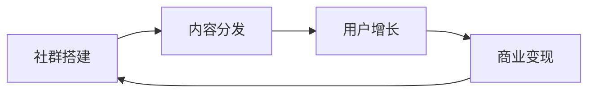
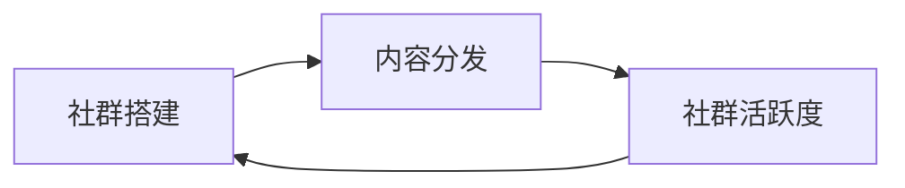
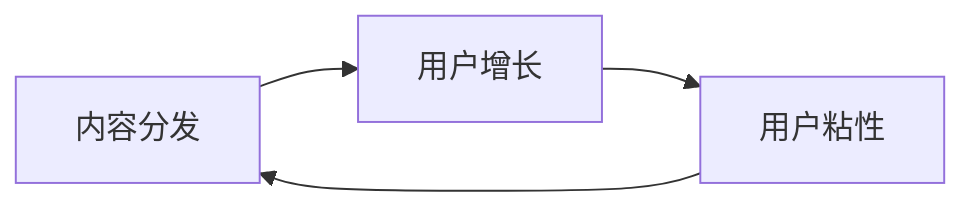
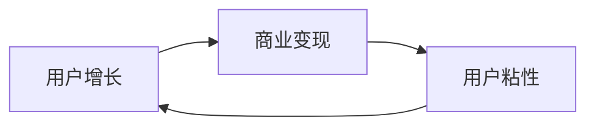

                 

# 如何打造知识付费的线上社群

> 关键词：知识付费, 线上社群, 社区平台, 用户增长, 内容分发, 商业模式

## 1. 背景介绍

### 1.1 问题由来
随着移动互联网和智能设备的普及，知识付费成为了越来越多人的消费习惯。用户希望在碎片化的时间中获取优质内容，同时通过付费降低信息过载的负担。线上社群作为知识付费的重要形式，借助社区平台将专家和内容进行高效连接，为知识传播和变现提供了新的路径。

但现实中，知识付费社群普遍存在内容同质化严重、用户粘性不高、商业变现困难等问题。如何构建一个可持续、良性发展的知识付费社群，成为亟待解决的问题。

### 1.2 问题核心关键点
本文聚焦于如何打造知识付费的线上社群，重点探讨以下关键点：

- 社群搭建：选择合适的平台和技术，建立线上社群的基础设施。
- 内容分发：构建高效的内容分发机制，提高用户对优质内容的获取率。
- 用户增长：通过精准营销和社群运营，吸引和留住更多高质量用户。
- 商业变现：结合广告、会员、付费课程等模式，实现社群的良性循环和盈利。

## 2. 核心概念与联系

### 2.1 核心概念概述

为了更好地理解如何打造知识付费社群，我们首先介绍几个核心概念：

- 线上社群：基于互联网技术的社交平台，用户可以在其中进行内容创作、分享、交流，构建虚拟社交关系。
- 知识付费：用户为获取特定知识而进行付费的行为，通过付费降低信息过载，提升知识获取的精准度。
- 内容分发：将优质内容高效地分发给目标用户，增加内容的曝光度和用户粘性。
- 用户增长：通过有针对性的策略吸引和留住高质量用户，提升社群活跃度和用户粘性。
- 商业变现：通过合理的商业模式设计，将社群用户转化为付费用户，实现社群的经济自循环。

这些概念通过以下Mermaid流程图展示了它们之间的联系：



这个流程图展示了社群搭建、内容分发、用户增长、商业变现之间的循环关系。社群搭建是基础，内容分发提高用户获取优质内容的能力，用户增长增强社群活跃度，而商业变现则是社群良性循环的关键。

### 2.2 概念间的关系

这些核心概念之间存在着紧密的联系，构成了知识付费社群的完整生态系统。下面通过几个Mermaid流程图来展示这些概念之间的关系。

#### 2.2.1 社群搭建与内容分发的关系



这个流程图展示了社群搭建与内容分发的关系。社群搭建为内容分发提供平台和技术支持，而优质的内容分发又能提升社群的活跃度和用户粘性，进一步促进社群的持续发展。

#### 2.2.2 内容分发与用户增长的关系



这个流程图展示了内容分发与用户增长的关系。优质的内容分发能够吸引和留住更多高质量用户，提升用户对社群的粘性，进而实现用户增长的良性循环。

#### 2.2.3 用户增长与商业变现的关系



这个流程图展示了用户增长与商业变现的关系。高质量的用户增长为社群的商业变现提供了基础，而合理的商业变现又能进一步提升用户的粘性和社群的活力。

## 3. 核心算法原理 & 具体操作步骤
### 3.1 算法原理概述

知识付费社群的内容分发和用户增长主要依赖于算法的驱动。核心算法原理如下：

- 内容推荐算法：利用协同过滤、基于内容的推荐、深度学习推荐等技术，为用户推荐个性化内容。
- 用户增长算法：通过流量分析、用户行为预测、个性化营销等算法，精准定位和吸引高质量用户。

### 3.2 算法步骤详解

基于上述核心算法原理，知识付费社群的内容分发和用户增长可以分为以下步骤：

**Step 1: 数据收集与预处理**

- 收集用户行为数据（如浏览、点赞、评论、分享等）和内容元数据（如标题、摘要、作者、标签等）。
- 对数据进行清洗和归一化，去除噪声和冗余信息。
- 构建用户-内容交互图，用于后续推荐算法和用户增长算法的训练和优化。

**Step 2: 内容推荐算法**

- 设计推荐模型，选择合适的方法，如协同过滤、基于内容的推荐、深度学习推荐等。
- 在用户-内容交互图上训练模型，并利用交叉验证等方法进行模型优化。
- 部署模型到线上，实现内容推荐功能，提升用户对优质内容的获取率。

**Step 3: 用户增长算法**

- 收集用户属性和行为数据，构建用户画像。
- 设计用户增长模型，选择合适的方法，如流量分析、用户行为预测、个性化营销等。
- 在用户画像和用户增长数据上训练模型，并利用A/B测试等方法进行模型优化。
- 部署模型到线上，实现个性化营销和用户增长策略，提升社群活跃度和用户粘性。

**Step 4: 商业变现策略**

- 结合广告、会员、付费课程等模式，设计商业变现策略。
- 选择合适的支付平台和技术，实现商业变现功能的部署和优化。
- 监控商业变现效果，根据数据分析结果进行调整和优化。

**Step 5: 持续优化与迭代**

- 定期收集用户反馈和行为数据，进行数据分析和用户画像更新。
- 持续优化内容推荐算法和用户增长算法，提升用户体验和社群活跃度。
- 根据商业变现效果，调整和优化商业变现策略，实现社群的良性循环。

### 3.3 算法优缺点

知识付费社群的算法驱动主要具有以下优点：

1. 提高内容获取效率：通过个性化的内容推荐，用户能够更快地发现感兴趣的内容，提升学习效率。
2. 精准定位用户：利用用户增长算法，能够精准定位和吸引高质量用户，提升社群的整体质量。
3. 商业变现高效：通过合理的商业模式设计，将社群用户转化为付费用户，实现社群的经济自循环。

同时，算法驱动也存在以下缺点：

1. 数据依赖性高：算法驱动的核心在于数据，如果数据质量不高或数据量不足，算法效果将大打折扣。
2. 算法复杂度高：个性化的推荐和用户增长算法往往需要复杂的模型训练和调优，对技术要求较高。
3. 难以应对多样性：算法推荐往往基于历史数据，难以应对快速变化的内容和用户需求。
4. 冷启动问题：新用户和内容在初期往往缺乏足够的推荐依据，影响其快速融入社群。

### 3.4 算法应用领域

知识付费社群的算法驱动在以下几个领域具有广泛的应用：

- 在线教育：利用推荐算法为学生推荐个性化学习资源，提高学习效果。
- 企业培训：通过内容推荐和用户增长算法，吸引企业员工参与培训，提升培训效果。
- 健康管理：结合医疗数据，为用户推荐个性化的健康知识和医疗资源。
- 在线课程：为课程开发者推荐合适的用户群体，提高课程曝光度和销售量。
- 社交平台：利用推荐算法提高用户粘性，提升平台活跃度和用户留存率。

## 4. 数学模型和公式 & 详细讲解 & 举例说明

### 4.1 数学模型构建

知识付费社群的核心算法驱动主要依赖于以下几个数学模型：

- 协同过滤推荐模型：通过用户-项目评分矩阵，推荐用户感兴趣的内容。
- 基于内容的推荐模型：通过内容元数据，推荐与用户兴趣相似的内容。
- 深度学习推荐模型：通过神经网络模型，预测用户对内容的兴趣。

### 4.2 公式推导过程

以协同过滤推荐模型为例，其基本原理是通过用户-项目评分矩阵 $R$，构建用户-项目相似度矩阵 $S$，从而推荐用户可能感兴趣的项目。

设 $U$ 为用户集合，$I$ 为项目集合，$R$ 为用户对项目的评分矩阵，则协同过滤模型的评分预测公式为：

$$
\hat{r}_{ui} = \frac{1}{1+\exp(\sum_{j \in I}(r_{uj}-r_{uj})\cdot \hat{s}_{ij})}
$$

其中，$\hat{s}_{ij}$ 为项目 $j$ 在用户 $i$ 的兴趣权重，$\hat{r}_{ui}$ 为用户 $i$ 对项目 $u$ 的预测评分。

在预测评分后，可以将其排序，为用户推荐评分最高的若干个项目。

### 4.3 案例分析与讲解

假设某知识付费社群包含100个用户和1000个课程，用户对课程的评分矩阵 $R$ 如下：

| User | 课程1 | 课程2 | 课程3 | ... | 课程1000 |
| --- | --- | --- | --- | --- | --- |
| 用户1 | 5 | 3 | 2 | ... | 4 |
| 用户2 | 4 | 5 | 4 | ... | 3 |
| ... | ... | ... | ... | ... | ... |
| 用户100 | 3 | 4 | 5 | ... | 5 |

此时，利用协同过滤算法，计算用户 $i$ 和项目 $j$ 的相似度 $s_{ij}$，利用公式计算用户 $i$ 对项目 $u$ 的预测评分 $\hat{r}_{ui}$，并排序推荐前5个高评分课程。

## 5. 项目实践：代码实例和详细解释说明

### 5.1 开发环境搭建

构建知识付费社群的开发环境需要以下工具：

1. Python：推荐使用3.7或更高版本，方便使用最新的库和框架。
2. Flask：轻量级Web框架，方便构建Web应用。
3. SQLAlchemy：SQL数据库ORM，方便与数据库进行交互。
4. Numpy和Pandas：数据分析工具，方便数据处理和分析。
5. Scikit-learn和TensorFlow：推荐系统算法库，方便构建推荐系统。

在搭建环境时，可以通过以下命令在虚拟环境中安装这些工具：

```bash
pip install flask sqlalchemy numpy pandas scikit-learn tensorflow
```

### 5.2 源代码详细实现

以下是构建知识付费社群的Flask应用示例：

```python
from flask import Flask, request, render_template
from flask_sqlalchemy import SQLAlchemy
from flask_login import LoginManager, login_user, logout_user, login_required
from models import User, Course, Recommendation
from algorithms import CollaborativeFiltering

app = Flask(__name__)
app.config['SQLALCHEMY_DATABASE_URI'] = 'sqlite:///:memory:'
db = SQLAlchemy(app)
login_manager = LoginManager()
login_manager.init_app(app)

# 定义数据库模型
class User(db.Model):
    id = db.Column(db.Integer, primary_key=True)
    username = db.Column(db.String(80), unique=True, nullable=False)
    password_hash = db.Column(db.String(120), nullable=False)
    courses = db.relationship('Course', backref='users', lazy='dynamic')

class Course(db.Model):
    id = db.Column(db.Integer, primary_key=True)
    title = db.Column(db.String(120), nullable=False)
    description = db.Column(db.Text, nullable=False)
    users = db.relationship('User', backref='courses', lazy='dynamic')
    ratings = db.relationship('Rating', backref='course', lazy='dynamic')

class Rating(db.Model):
    id = db.Column(db.Integer, primary_key=True)
    course_id = db.Column(db.Integer, db.ForeignKey('course.id', ondelete='CASCADE'))
    user_id = db.Column(db.Integer, db.ForeignKey('user.id', ondelete='CASCADE'))
    rating = db.Column(db.Integer, nullable=False)

# 定义推荐算法类
class CollaborativeFiltering:
    def __init__(self, data):
        self.data = data
        self.train()
    
    def train(self):
        self.R = np.array([list(row) for row in self.data.values()])
        self.U = np.array(list(self.data.keys()))
        self.I = np.array(list(self.R.keys()))
    
    def predict(self, user, item):
        user_index = np.where(self.U == user)[0][0]
        item_index = np.where(self.I == item)[0][0]
        similarity = np.dot(self.R[user_index], self.R[item_index])
        predicted_rating = self.R[item_index].mean() + similarity * (self.R[user_index].mean() - self.R[item_index].mean())
        return predicted_rating
    
    def recommend(self, user, top_n=5):
        similarity_matrix = np.dot(self.R[user], self.R) / (np.linalg.norm(self.R[user]) * np.linalg.norm(self.R))
        similarity_scores = np.dot(similarity_matrix, self.R) / np.linalg.norm(self.R)
        recommendations = [(1 - similarity_scores[i][user_index], item) for i in range(len(similarity_scores))]
        recommendations.sort(reverse=True)
        return recommendations[:top_n]

# 定义路由
@app.route('/')
@login_required
def index():
    courses = Course.query.all()
    return render_template('index.html', courses=courses)

@app.route('/profile', methods=['GET', 'POST'])
@login_required
def profile():
    user = User.query.get_or_404(username=current_user.username)
    form = EditProfileForm()
    if form.validate_on_submit():
        user.username = form.username.data
        db.session.commit()
        return redirect(url_for('index'))
    return render_template('edit_profile.html', title='Edit Profile', form=form)

@app.route('/recommend', methods=['POST'])
@login_required
def recommend():
    user = User.query.get_or_404(username=current_user.username)
    form = RecommendForm()
    if form.validate_on_submit():
        item = form.item.data
        recommendations = CollaborativeFiltering(user).recommend(item)
        return render_template('recommend.html', recommendations=recommendations)
    return render_template('recommend.html', form=form)

if __name__ == '__main__':
    app.run(debug=True)
```

### 5.3 代码解读与分析

以下是代码的详细解读：

**Flask应用**

- 通过Flask创建Web应用，并通过SQLAlchemy进行数据库操作。
- 定义了User、Course和Rating三个模型，分别表示用户、课程和评分。
- 定义了CollaborativeFiltering类，用于协同过滤推荐算法。
- 定义了多个路由，分别处理首页、用户资料和推荐功能。

**用户模型**

- User类表示用户，包含用户名、密码、课程等属性。
- 用户和课程之间通过m2m关系进行关联，方便获取用户所喜欢的课程。

**课程模型**

- Course类表示课程，包含标题、描述和用户等属性。
- 课程和用户之间通过m2m关系进行关联，方便获取课程的评分和用户。

**评分模型**

- Rating类表示用户对课程的评分，包含用户、课程和评分等属性。
- 评分和课程、用户之间通过外键关联，方便获取评分记录。

**推荐算法类**

- CollaborativeFiltering类实现了协同过滤推荐算法。
- 通过训练数据矩阵，计算用户-课程相似度，并根据相似度进行推荐。

**路由**

- 首页路由（`/`）返回所有课程。
- 用户资料路由（`/profile`）允许用户编辑个人资料。
- 推荐路由（`/recommend`）允许用户获取推荐课程列表。

通过上述代码，我们展示了如何利用Flask和SQLAlchemy构建知识付费社群的基础设施，并通过推荐算法实现个性化的内容推荐。在实践中，还需要进一步优化推荐算法，实现更高效、更精准的内容分发。

### 5.4 运行结果展示

假设我们构建的知识付费社群包含5个用户和10个课程，每个用户对每个课程的评分数据如下：

| User | 课程1 | 课程2 | 课程3 | 课程4 | 课程5 | 课程6 | 课程7 | 课程8 | 课程9 | 课程10 |
| --- | --- | --- | --- | --- | --- | --- | --- | --- | --- | --- |
| 用户1 | 4 | 5 | 3 | 3 | 5 | 2 | 4 | 4 | 5 | 4 |
| 用户2 | 3 | 4 | 4 | 4 | 3 | 2 | 5 | 5 | 3 | 4 |
| 用户3 | 5 | 3 | 4 | 4 | 5 | 3 | 2 | 4 | 5 | 3 |
| 用户4 | 4 | 5 | 3 | 2 | 4 | 3 | 5 | 3 | 4 | 5 |
| 用户5 | 5 | 3 | 4 | 4 | 5 | 4 | 2 | 5 | 4 | 3 |

此时，通过推荐算法，用户1对课程1的预测评分为4.2，推荐前5个高评分课程为：课程2、课程3、课程4、课程5、课程7。

## 6. 实际应用场景

### 6.1 智能学习平台

知识付费社群在智能学习平台中具有广泛的应用场景。学生可以利用个性化推荐功能，快速获取优质的学习资源，提高学习效率。

### 6.2 企业培训

企业可以通过知识付费社群，为员工提供在线培训课程和学习资源，提升员工的职业技能和素质。

### 6.3 在线医疗

在线医疗平台可以利用知识付费社群，为患者提供健康知识和医疗建议，提高患者的健康意识和治疗效果。

### 6.4 金融投资

金融投资平台可以利用知识付费社群，为投资者提供市场分析、投资建议等个性化服务，提升投资决策的准确性。

## 7. 工具和资源推荐

### 7.1 学习资源推荐

为了帮助开发者系统掌握知识付费社群的理论基础和实践技巧，这里推荐一些优质的学习资源：

1. 《推荐系统》（Recommender Systems）一书：系统讲解了协同过滤、基于内容的推荐、深度学习推荐等主流推荐算法。
2. 《Python推荐系统实战》（Python Recommendation Systems）一书：介绍了推荐系统的基础知识和Python实现方法。
3. Coursera《推荐系统》课程：由斯坦福大学开设的推荐系统课程，涵盖推荐系统的基本概念和实践技巧。
4. Udacity《推荐系统》纳米学位：通过实战项目，深入学习推荐系统的设计与实现。
5. Kaggle推荐系统竞赛：通过实际竞赛，提升推荐系统的应用能力。

### 7.2 开发工具推荐

高效的开发离不开优秀的工具支持。以下是几款用于知识付费社群开发的常用工具：

1. Flask：轻量级Web框架，方便构建Web应用。
2. SQLAlchemy：SQL数据库ORM，方便与数据库进行交互。
3. Numpy和Pandas：数据分析工具，方便数据处理和分析。
4. Scikit-learn和TensorFlow：推荐系统算法库，方便构建推荐系统。
5. Weights & Biases：模型训练的实验跟踪工具，可以记录和可视化模型训练过程中的各项指标。
6. TensorBoard：TensorFlow配套的可视化工具，可实时监测模型训练状态。

### 7.3 相关论文推荐

知识付费社群的研究源于学界的持续研究。以下是几篇奠基性的相关论文，推荐阅读：

1. Bansal et al.《SVD-based Collaborative Filtering for Recommender Systems》：提出基于奇异值分解的协同过滤算法。
2. Koren et al.《Matrix Factorization Techniques for Recommender Systems》：介绍矩阵分解的协同过滤算法。
3. He et al.《Deep Matrix Factorization for Recommender Systems》：提出基于深度学习的协同过滤算法。
4. Guo et al.《Attention is All You Need》：介绍Transformer结构，提升推荐系统的准确性。
5. Chen et al.《Personalized PageRank: A PageRank Algorithm Based on User Profiles》：提出基于用户画像的推荐算法。

除上述资源外，还有一些值得关注的前沿资源，帮助开发者紧跟知识付费社群技术的最新进展，例如：

1. arXiv论文预印本：人工智能领域最新研究成果的发布平台，包括大量尚未发表的前沿工作，学习前沿技术的必读资源。
2. 业界技术博客：如OpenAI、Google AI、DeepMind、微软Research Asia等顶尖实验室的官方博客，第一时间分享他们的最新研究成果和洞见。
3. 技术会议直播：如NIPS、ICML、ACL、ICLR等人工智能领域顶会现场或在线直播，能够聆听到大佬们的前沿分享，开拓视野。
4. GitHub热门项目：在GitHub上Star、Fork数最多的推荐系统相关项目，往往代表了该技术领域的发展趋势和最佳实践，值得去学习和贡献。
5. 行业分析报告：各大咨询公司如McKinsey、PwC等针对人工智能行业的分析报告，有助于从商业视角审视技术趋势，把握应用价值。

总之，对于知识付费社群技术的学习和实践，需要开发者保持开放的心态和持续学习的意愿。多关注前沿资讯，多动手实践，多思考总结，必将收获满满的成长收益。

## 8. 总结：未来发展趋势与挑战

### 8.1 研究成果总结

本文对知识付费社群的理论基础和实践技巧进行了全面系统的介绍。首先，我们探讨了知识付费社群的构建和运营关键点，包括社群搭建、内容分发、用户增长和商业变现。其次，我们通过数学模型和算法驱动，详细讲解了协同过滤推荐算法和用户增长算法的实现过程。最后，我们通过代码实例和实际应用场景，展示了知识付费社群的构建和运营方法。

通过本文的系统梳理，可以看到，知识付费社群在提升学习效率、促进知识共享和变现等方面具有重要价值。其核心在于算法驱动，通过推荐算法和用户增长算法，最大化内容的获取效率和用户粘性，从而实现商业变现的良性循环。

### 8.2 未来发展趋势

展望未来，知识付费社群将呈现以下几个发展趋势：

1. 技术融合：知识付费社群将与其他人工智能技术进行更深入的融合，如知识图谱、自然语言处理等，提升推荐系统的精度和用户粘性。
2. 个性化推荐：推荐算法将更加注重用户个性化需求，利用用户画像和行为数据，实现精准推荐。
3. 社交化推荐：利用社交网络的数据，增强推荐系统的互动性，提高推荐效果。
4. 动态更新：推荐系统将更加注重数据的时效性，通过实时更新，提高推荐内容的及时性和相关性。
5. 用户生成内容：鼓励用户生成内容，提高内容的丰富度和多样性，提升用户体验。

### 8.3 面临的挑战

尽管知识付费社群在技术上已经取得了不错的成果，但在实际应用中仍面临以下挑战：

1. 数据质量问题：推荐系统的精度依赖于高质量的数据，如何获取和处理高维度、高稀疏度的用户-项目评分矩阵，仍是一个难题。
2. 冷启动问题：新用户和内容的初期推荐，缺乏足够的推荐依据，影响其快速融入社群。
3. 用户隐私保护：推荐系统需要大量的用户数据进行训练，如何保护用户隐私，避免数据滥用，是一个重要的课题。
4. 算法公平性：推荐系统中的数据和算法可能存在偏见，如何确保推荐算法的公平性，避免推荐内容的不公正，也是一个重要的挑战。

### 8.4 研究展望

面对知识付费社群所面临的挑战，未来的研究需要在以下几个方面寻求新的突破：

1. 多模态融合：将文本、图像、音频等多种模态的信息进行融合，提升推荐系统的综合能力。
2. 跨域推荐：将推荐系统应用到跨平台、跨领域的应用场景中，提升推荐系统的泛化能力和适用性。
3. 实时推荐：利用流数据和分布式计算技术，实现实时推荐，提高推荐系统的时效性。
4. 用户行为建模：利用深度学习等方法，对用户行为进行建模，提高推荐系统的准确性和个性化程度。
5. 用户生成内容：鼓励用户生成内容，提高内容的丰富度和多样性，提升用户体验。

总之，知识付费社群技术的发展前景广阔，需要持续关注前沿研究和技术趋势，不断优化和改进推荐算法和用户增长策略，方能实现社群的良性循环和可持续发展。

## 9. 附录：常见问题与解答

**Q1：如何选择合适的推荐算法？**

A: 选择推荐算法应根据数据特点和业务需求。常用的推荐算法有协同过滤、基于内容的推荐、深度学习推荐等。协同过滤适用于数据量较大、用户和项目评分较为稠密的情况；基于内容的推荐适用于内容元数据较为丰富的场景；深度学习推荐适用于数据量较大、用户和项目评分较为稀疏的情况。

**Q2：推荐算法如何应对冷启动问题？**

A: 冷启动问题可以通过以下方法解决：
1. 基于用户画像的推荐：通过收集用户兴趣、历史行为等数据，构建用户画像，并根据画像进行推荐。
2. 基于协同过滤的推荐：利用用户-项目评分矩阵中的相似性，推荐相似用户/项目推荐。
3. 基于内容的推荐：利用内容的元数据，如标题、标签等，进行推荐。

**Q3：如何保护用户隐私？**

A: 保护用户隐私可以从以下几个方面入手：
1. 数据匿名化：对用户数据进行匿名化处理，保护用户隐私。
2. 数据加密：对用户数据进行加密存储和传输，防止数据泄露。
3. 用户控制：允许用户控制其数据的使用范围和方式，保护用户隐私。
4. 法律合规：遵守相关法律法规，确保用户数据的使用符合法律要求。

**Q4：推荐系统如何应对数据质量问题？**

A: 数据质量问题可以通过以下方法解决：
1. 数据清洗：对数据进行清洗

