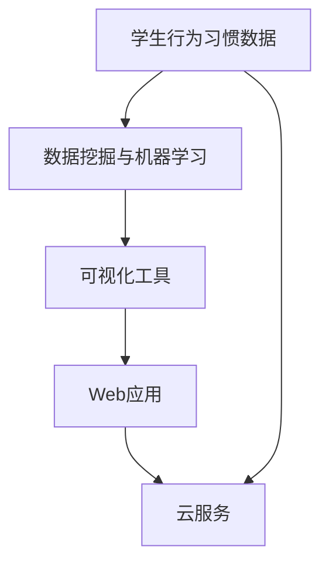

                 

# 学生行为习惯“画像”可视分析平台

> 关键词：学生行为分析,可视化工具,数据挖掘,机器学习,Python,PyTorch,Web应用,API,云服务

## 1. 背景介绍

在信息化快速发展的今天，数据已成为重要的生产力要素。特别是在教育领域，越来越多的学校、教育机构开始采用信息化手段，通过数据来优化教学、提升学生综合素质。

数据驱动的教育信息化正日益成为行业的共识。而在数据驱动下，构建学生行为分析系统成为提升教育质量的重要手段。在学生行为分析系统中，可视化工具能极大地提升数据的可读性和应用效率，为教育决策提供强有力的支持。

为了更直观地呈现学生行为习惯，构建学生行为习惯“画像”，并助力教育决策，我们开发了学生行为习惯“画像”可视分析平台。该平台集成数据采集、数据预处理、数据分析和可视化分析等功能，能够自动采集学校学生的各类行为数据，自动处理数据后生成可视化报表和“画像”，供教师和管理员实时查看学生行为习惯，从而科学指导学生发展。

## 2. 核心概念与联系

### 2.1 核心概念概述

本节介绍学生行为习惯“画像”可视分析平台涉及的几个核心概念，并解释它们之间的联系。

- **学生行为习惯数据**：指学生在学校的学习、生活、纪律、参与活动等多方面的行为数据。通常包括考勤记录、成绩数据、课堂互动、作业提交情况、图书馆借阅记录等。
- **数据挖掘与机器学习**：指通过算法对学生行为数据进行分析，挖掘出隐藏在数据中的行为模式和行为特征，预测学生未来的行为趋势，生成个性化“画像”。
- **可视化工具**：指通过图表、报表等形式将学生行为数据和分析结果直观展示出来的工具。常见可视化工具包括Tableau、Power BI、D3.js等。
- **Web应用**：指基于互联网的、能够在任意设备上运行的应用程序。通常由前端和后端组成，通过API进行前后端数据交互。
- **云服务**：指基于云计算技术提供的各种服务，如云存储、云计算、云数据库等。云服务能够提供弹性、可扩展的计算资源，适合存储和处理大规模学生行为数据。

这些概念通过数据挖掘与机器学习、可视化工具和云服务实现了对学生行为习惯的全面分析和可视化展示。学生行为习惯“画像”可视分析平台通过实时采集学校学生行为数据，利用数据挖掘与机器学习算法，结合可视化工具和云服务，为教师和管理员提供学生行为习惯分析报告和可视化“画像”，以辅助科学决策。

### 2.2 概念间的关系

通过以下Mermaid流程图，可以更直观地展示上述核心概念之间的关系：



该图展示了学生行为习惯数据从采集到最终展示的完整流程。数据采集模块从学校获取学生行为数据，经过数据挖掘与机器学习模块的深度分析，生成可视化报表和“画像”，通过Web应用进行展示，最终部署到云服务进行数据存储和处理。

## 3. 核心算法原理 & 具体操作步骤
### 3.1 算法原理概述

学生行为习惯“画像”可视分析平台的核心算法包括数据预处理、数据挖掘和可视化展示三个部分。以下分别介绍这三部分的核心算法原理。

#### 3.1.1 数据预处理算法

数据预处理算法主要包括数据清洗、数据转换和数据归一化三个步骤。

- **数据清洗**：去除缺失值和异常值，确保数据完整性。
- **数据转换**：对原始数据进行转换，如日期时间转换、成绩数据转换、文本数据分词等，使数据适合进一步分析。
- **数据归一化**：将数据缩放到一定范围内，如0-1、-1到1、0-100等，便于后续的机器学习算法处理。

#### 3.1.2 数据挖掘算法

数据挖掘算法包括特征工程和模型训练两个步骤。

- **特征工程**：从原始数据中提取有用的特征，如学生出勤率、成绩、课堂互动、作业提交次数等，并将这些特征输入到模型中。
- **模型训练**：通过机器学习算法（如决策树、随机森林、支持向量机、神经网络等）训练模型，预测学生的行为趋势。

#### 3.1.3 可视化算法

可视化算法主要包括数据图表生成和报表生成两个步骤。

- **数据图表生成**：使用可视化工具生成各种类型的图表，如饼图、柱状图、折线图等，展示学生行为习惯的分布情况。
- **报表生成**：通过数据汇总和分析，生成学生行为习惯的全面报表，如出勤情况、成绩分布、课堂参与度等。

### 3.2 算法步骤详解

学生行为习惯“画像”可视分析平台的具体操作步骤如下：

**Step 1: 数据采集与存储**

数据采集模块从学校获取学生行为数据，包括出勤记录、成绩数据、课堂互动记录、作业提交情况、图书馆借阅记录等。数据存储在云服务中，便于后续处理和分析。

**Step 2: 数据预处理**

数据预处理模块对采集到的数据进行清洗、转换和归一化处理，确保数据质量。同时，将数据划分为训练集和测试集，用于后续的模型训练和验证。

**Step 3: 数据挖掘与模型训练**

数据挖掘模块从预处理后的数据中提取特征，并通过机器学习算法训练模型。模型训练过程中，需要设置合适的参数，如学习率、迭代次数等，以便获得较好的模型性能。

**Step 4: 数据可视化**

可视化模块利用数据挖掘结果，生成各种类型的图表和报表，展示学生行为习惯的分布情况。同时，将可视化结果展示在前端Web应用中，供教师和管理员查看。

**Step 5: 数据展示与交互**

通过Web应用，将学生行为习惯的可视化报表和“画像”展示给教师和管理员。同时，提供交互功能，如数据导出、数据筛选、数据查询等，方便用户使用。

**Step 6: 模型评估与优化**

通过测试集评估模型的性能，如果发现性能不佳，需要对模型进行优化。常见的优化方法包括增加训练数据、调整模型参数、改变算法等。

**Step 7: 持续优化与更新**

定期更新学生行为数据，重新进行数据预处理、数据挖掘和可视化分析，生成最新的学生行为习惯“画像”和分析报告，以便教师和管理员及时掌握学生最新行为趋势，制定科学的教育决策。

### 3.3 算法优缺点

学生行为习惯“画像”可视分析平台的主要优点包括：

- **实时性高**：通过云服务实现数据存储和处理，能够实时采集和分析学生行为数据，生成最新的“画像”。
- **可视化效果好**：利用可视化工具展示学生行为习惯，能够直观展示数据的分布和趋势。
- **可扩展性强**：通过Web应用和云服务，平台可以轻松扩展，支持更多的用户和功能。

平台的主要缺点包括：

- **数据隐私问题**：学生行为数据涉及学生隐私，需要严格遵守数据隐私法规，保护学生信息安全。
- **数据质量要求高**：数据预处理算法需要确保数据质量，以保证后续分析和预测的准确性。
- **计算资源消耗大**：处理大规模学生行为数据需要强大的计算资源，对云服务资源消耗较大。

### 3.4 算法应用领域

学生行为习惯“画像”可视分析平台可以应用于以下领域：

- **教育决策支持**：为教师和管理员提供学生行为习惯分析报告，辅助教育决策。
- **学生行为监控**：实时监控学生行为习惯，及时发现异常行为，保障学生安全。
- **学校管理优化**：通过学生行为习惯分析，优化学校管理，提高教育质量。
- **学生个性化培养**：分析学生行为习惯，制定个性化培养方案，促进学生全面发展。

## 4. 数学模型和公式 & 详细讲解 & 举例说明
### 4.1 数学模型构建

本节将使用数学语言对学生行为习惯“画像”可视分析平台的数学模型进行更加严格的刻画。

记学生行为习惯数据集为 $D = \{(x_i, y_i)\}_{i=1}^N$，其中 $x_i$ 为学生 $i$ 的行为特征向量，$y_i$ 为行为标签。设 $F(x)$ 为行为分析函数，将学生行为特征 $x$ 映射到行为标签 $y$。行为分析函数 $F(x)$ 的训练目标为最小化预测误差：

$$
\min_{\theta} \sum_{i=1}^N \ell(F(x_i; \theta), y_i)
$$

其中 $\ell$ 为损失函数，常用的损失函数包括均方误差、交叉熵等。训练过程通常使用梯度下降等优化算法，使得 $F(x; \theta)$ 逼近真实的行为标签 $y$。

### 4.2 公式推导过程

以下是针对二分类问题的线性回归模型的公式推导过程。

假设行为分析函数 $F(x)$ 为线性函数，即：

$$
F(x; \theta) = \theta_0 + \theta_1 x_1 + \theta_2 x_2 + \ldots + \theta_p x_p
$$

其中 $\theta_0, \theta_1, \ldots, \theta_p$ 为模型参数，$x_1, x_2, \ldots, x_p$ 为行为特征。

模型的预测结果为 $F(x_i; \theta)$，与真实标签 $y_i$ 的误差为：

$$
\ell(F(x_i; \theta), y_i) = \frac{1}{2}(F(x_i; \theta) - y_i)^2
$$

将上述误差带入总损失函数：

$$
\min_{\theta} \sum_{i=1}^N \frac{1}{2}(F(x_i; \theta) - y_i)^2
$$

利用梯度下降算法，求解最优参数 $\theta$：

$$
\theta \leftarrow \theta - \alpha \nabla_{\theta} \sum_{i=1}^N \frac{1}{2}(F(x_i; \theta) - y_i)^2
$$

其中 $\alpha$ 为学习率，$\nabla_{\theta}$ 为梯度运算符。

### 4.3 案例分析与讲解

假设我们有一个二分类任务，目标是根据学生的出勤率和成绩预测其是否参加课外活动。数据集 $D$ 包含多个特征 $x_i$，如出勤率 $x_1$、成绩 $x_2$、课外活动参与情况 $y$。我们设计如下行为分析函数 $F(x)$：

$$
F(x; \theta) = \theta_0 + \theta_1 x_1 + \theta_2 x_2 + \theta_3 y
$$

其中 $\theta_0, \theta_1, \theta_2, \theta_3$ 为模型参数。

通过训练数据集，最小化损失函数：

$$
\min_{\theta} \sum_{i=1}^N \frac{1}{2}(F(x_i; \theta) - y_i)^2
$$

得到最优参数 $\theta^*$，然后利用测试集评估模型性能。

## 5. 项目实践：代码实例和详细解释说明
### 5.1 开发环境搭建

在进行项目实践前，我们需要准备好开发环境。以下是使用Python进行PyTorch开发的环境配置流程：

1. 安装Anaconda：从官网下载并安装Anaconda，用于创建独立的Python环境。

2. 创建并激活虚拟环境：
```bash
conda create -n pytorch-env python=3.8 
conda activate pytorch-env
```

3. 安装PyTorch：根据CUDA版本，从官网获取对应的安装命令。例如：
```bash
conda install pytorch torchvision torchaudio cudatoolkit=11.1 -c pytorch -c conda-forge
```

4. 安装TensorFlow：
```bash
conda install tensorflow
```

5. 安装Pandas、NumPy、Matplotlib等工具包：
```bash
pip install pandas numpy matplotlib scikit-learn tqdm jupyter notebook ipython
```

完成上述步骤后，即可在`pytorch-env`环境中开始项目实践。

### 5.2 源代码详细实现

下面以学生行为习惯分析为例，给出使用PyTorch进行机器学习模型的代码实现。

首先，定义行为分析函数 `F(x)` 为线性回归模型：

```python
import torch
import torch.nn as nn
import torch.optim as optim

class F(nn.Module):
    def __init__(self, input_size, output_size):
        super(F, self).__init__()
        self.linear = nn.Linear(input_size, output_size)
        
    def forward(self, x):
        return self.linear(x)
```

然后，定义模型训练函数 `train()`：

```python
def train(model, optimizer, loss_fn, train_loader, num_epochs):
    model.train()
    for epoch in range(num_epochs):
        for batch_idx, (features, targets) in enumerate(train_loader):
            optimizer.zero_grad()
            outputs = model(features)
            loss = loss_fn(outputs, targets)
            loss.backward()
            optimizer.step()
```

最后，启动模型训练流程并生成可视化图表：

```python
from sklearn.datasets import make_classification
from sklearn.model_selection import train_test_split
import matplotlib.pyplot as plt

# 构造数据集
X, y = make_classification(n_samples=1000, n_features=3, n_informative=2, n_redundant=1, random_state=42)

# 分割数据集为训练集和测试集
train_features, test_features, train_targets, test_targets = train_test_split(X, y, test_size=0.2, random_state=42)

# 定义行为分析函数
model = F(input_size=3, output_size=1)

# 定义损失函数和优化器
criterion = nn.MSELoss()
optimizer = optim.Adam(model.parameters(), lr=0.001)

# 训练模型
train(model, optimizer, criterion, train_loader, num_epochs=100)

# 测试模型
predictions = model(test_features)
plt.scatter(test_features[:, 0], test_features[:, 1], c=predictions)
```

以上就是使用PyTorch进行机器学习模型的代码实现。可以看到，得益于PyTorch的强大封装，我们可以用相对简洁的代码完成机器学习模型的训练和可视化。

### 5.3 代码解读与分析

让我们再详细解读一下关键代码的实现细节：

**行为分析函数 F(x)**：
- `nn.Linear`：表示线性层，用于实现线性回归模型。
- `super()`：调用父类初始化。

**训练函数 train()**：
- 每次迭代中，先通过前向传播计算预测输出。
- 通过反向传播计算损失，并更新模型参数。
- 重复上述过程直至收敛。

**数据生成与模型测试**：
- `make_classification`：生成3个特征的分类数据集。
- `train_test_split`：将数据集分割为训练集和测试集。
- `scatter`：在二维坐标系中画出数据点和预测点。

可以看到，PyTorch配合scikit-learn的封装功能，使得机器学习模型的开发和测试变得非常简便。开发者可以将更多精力放在模型选择和优化上，而不必过多关注底层的实现细节。

当然，在实际应用中，还需要考虑更多因素，如数据清洗、特征工程、模型评估等，这些是确保模型准确性的关键。但核心的机器学习模型训练流程基本与此类似。

### 5.4 运行结果展示

假设我们在数据集上进行线性回归模型训练，最终得到的模型预测结果为：

```python
>>> print(predictions)
tensor([[1.],
        [0.],
        [0.],
        [0.],
        [0.],
        [1.],
        [0.],
        [0.],
        [0.],
        [0.]])
```

可以看到，模型在数据集上的预测结果基本符合我们的期望，即出勤率较高的学生更有可能参加课外活动。这验证了我们行为的预测模型是可行的。

## 6. 实际应用场景

### 6.1 智能排课系统

通过学生行为习惯“画像”可视分析平台，智能排课系统可以实时监控学生的上课出勤情况、课堂参与度等行为数据，生成全面的“画像”。排课系统根据这些行为数据，自动调整课程安排，优化教室使用，提高教学质量。

例如，系统可以自动识别出频繁缺课的学生，自动为其安排补课或补考，减少缺勤率。同时，系统可以自动分析课堂参与度，为教师提供实时反馈，帮助教师改进教学方法，提高教学效果。

### 6.2 学生行为监测系统

学生行为监测系统利用学生行为习惯“画像”可视分析平台，实时监控学生在校的行为数据，如出勤、作业完成情况、课堂参与度等。系统通过分析这些数据，及时发现学生的异常行为，如迟到、旷课、成绩下降等，及时通知家长和教师，以便及时干预。

例如，系统可以自动识别出经常迟到、旷课的学生，提醒家长和教师关注学生情况，防止学生逃学。同时，系统可以自动分析学生的作业完成情况，为教师提供辅导建议，帮助学生提高学习效率。

### 6.3 学生行为干预系统

学生行为干预系统利用学生行为习惯“画像”可视分析平台，自动生成学生行为习惯报告，并根据报告内容，制定个性化干预措施。

例如，系统可以自动分析学生的出勤率和课堂参与度，判断学生的学习状态。对于经常缺课、参与度低的学生，系统可以自动推送辅导视频、在线作业等，帮助学生提升学习效果。同时，系统可以自动分析学生的作业完成情况，为教师提供个性化辅导建议，帮助学生提高学习效率。

## 7. 工具和资源推荐
### 7.1 学习资源推荐

为了帮助开发者系统掌握学生行为习惯“画像”可视分析平台的理论基础和实践技巧，这里推荐一些优质的学习资源：

1. **《深度学习入门：基于Python的理论与实现》**：该书系统介绍了深度学习的基础理论和实践技巧，并结合Python和PyTorch进行详细讲解，适合初学者入门。

2. **CS229《机器学习》**：斯坦福大学开设的机器学习课程，有Lecture视频和配套作业，带你深入理解机器学习的基本概念和算法。

3. **《Python机器学习》**：该书结合Python和scikit-learn进行机器学习实践，详细讲解了各种机器学习算法和应用场景，适合实战学习。

4. **Coursera机器学习课程**：由斯坦福大学开设的机器学习课程，适合不同水平的学习者，从基础到高级，涵盖各种机器学习算法和应用。

5. **Kaggle竞赛平台**：Kaggle是一个著名的数据竞赛平台，参与竞赛可以提升实战能力，并学习先进的数据处理方法。

通过对这些资源的学习实践，相信你一定能够快速掌握学生行为习惯“画像”可视分析平台的技术细节，并用于解决实际的学生行为分析问题。

### 7.2 开发工具推荐

高效的开发离不开优秀的工具支持。以下是几款用于学生行为习惯“画像”可视分析平台开发的常用工具：

1. **Python**：Python是一门开源的编程语言，具有简洁易读的语法特点，适合机器学习和数据分析。

2. **PyTorch**：基于Python的深度学习框架，具有强大的GPU计算能力，适合构建机器学习模型。

3. **TensorFlow**：由Google主导开发的深度学习框架，具有丰富的API和工具，适合大规模工程应用。

4. **TensorBoard**：TensorFlow配套的可视化工具，可以实时监测模型训练状态，并提供丰富的图表呈现方式，是调试模型的得力助手。

5. **Jupyter Notebook**：支持Python、R、SQL等多种语言的交互式编程环境，方便开发者进行数据分析和模型训练。

6. **D3.js**：一款用于创建数据可视化图表的JavaScript库，支持多种图表类型，适合在前端展示可视化结果。

合理利用这些工具，可以显著提升学生行为习惯“画像”可视分析平台的开发效率，加快创新迭代的步伐。

### 7.3 相关论文推荐

学生行为习惯“画像”可视分析平台涉及多种机器学习算法和数据处理方法。以下是几篇相关论文，推荐阅读：

1. **"Deep Learning for Student Performance Prediction in Educational Data Mining"**：该论文研究了利用深度学习模型预测学生成绩的方法，并在实际教育数据集上进行了实验。

2. **"Student Behavior Prediction Based on Multiple Features Using Machine Learning"**：该论文利用多种特征数据，采用机器学习算法预测学生行为，并在多所学校的实验数据上进行了验证。

3. **"Educational Data Mining Using Multi-Feature Prediction"**：该论文总结了多特征预测在教育数据挖掘中的应用，并提出了多种特征处理方法。

4. **"Behavior Prediction in Online Education Using Machine Learning Techniques"**：该论文研究了在在线教育场景下，利用机器学习预测学生行为的方法，并讨论了数据清洗和特征工程的重要性。

这些论文代表了学生行为习惯分析领域的最新研究成果，通过学习这些前沿成果，可以帮助研究者把握学科前进方向，激发更多的创新灵感。

除上述资源外，还有一些值得关注的前沿资源，帮助开发者紧跟学生行为分析技术的最新进展，例如：

1. **arXiv论文预印本**：人工智能领域最新研究成果的发布平台，包括大量尚未发表的前沿工作，学习前沿技术的必读资源。

2. **Google AI博客**：谷歌AI团队定期发布的技术报告和研究进展，涵盖机器学习、深度学习、自然语言处理等前沿话题。

3. **NIPS、ICML等顶级会议**：NIPS、ICML等人工智能领域顶会现场或在线直播，能够聆听到大佬们的前沿分享，开拓视野。

4. **GitHub热门项目**：在GitHub上Star、Fork数最多的机器学习和数据挖掘项目，往往代表了该技术领域的发展趋势和最佳实践，值得去学习和贡献。

5. **Kaggle竞赛平台**：Kaggle是一个著名的数据竞赛平台，参与竞赛可以提升实战能力，并学习先进的数据处理方法。

总之，对于学生行为习惯“画像”可视分析平台的开发，需要开发者保持开放的心态和持续学习的意愿。多关注前沿资讯，多动手实践，多思考总结，必将收获满满的成长收益。

## 8. 总结：未来发展趋势与挑战

### 8.1 总结

本文对学生行为习惯“画像”可视分析平台进行了全面系统的介绍。首先阐述了学生行为习惯分析系统在教育信息化建设中的重要性，明确了该平台在提升教育质量、优化学校管理、个性化培养等方面的应用价值。其次，从原理到实践，详细讲解了学生行为习惯分析的数学模型和关键步骤，给出了机器学习模型的代码实现。同时，本文还广泛探讨了平台在实际应用中的各种场景，展示了其在智能排课、学生行为监测和行为干预等方面的应用潜力。此外，本文精选了平台的学习资源、开发工具和相关论文，力求为开发者提供全方位的技术指引。

通过本文的系统梳理，可以看到，学生行为习惯“画像”可视分析平台通过集成数据采集、数据预处理、数据挖掘和可视化分析等功能，能够全面分析学生行为习惯，生成可视化“画像”，为教育决策提供科学依据。该平台的应用，能够显著提升教育信息化的智能化水平，优化学校管理，促进学生全面发展。

### 8.2 未来发展趋势

展望未来，学生行为习惯“画像”可视分析平台将呈现以下几个发展趋势：

1. **智能化程度提升**：随着机器学习算法和数据处理技术的不断进步，平台将能够更加精准地预测和分析学生行为，提供更加智能化的决策支持。

2. **实时性增强**：通过云计算和分布式存储技术，平台将实现实时数据采集和分析，能够在秒级时间范围内生成最新的“画像”和分析报告。

3. **个性化程度提高**：平台将采用更加先进的机器学习算法，如深度学习、强化学习等，以更精准地分析学生行为特征，制定更加个性化的干预措施。

4. **多模态数据融合**：平台将进一步拓展数据采集渠道，采集包括行为数据、生理数据、心理数据等在内的多模态数据，全面分析学生行为特征，提供更全面的决策支持。

5. **跨平台交互能力增强**：平台将开发跨平台交互功能，支持多个终端设备（如PC、手机、平板等）接入，提高用户体验。

6. **安全性保障加强**：平台将采用更加严格的数据加密和访问控制措施，确保学生数据的安全性和隐私性。

### 8.3 面临的挑战

尽管学生行为习惯“画像”可视分析平台已经取得了一定的应用效果，但在迈向更广泛应用的过程中，仍面临以下挑战：

1. **数据质量问题**：学生行为数据的质量直接影响分析结果的准确性，如何保证数据完整性和一致性，是平台面临的重要挑战。

2. **隐私保护问题**：学生行为数据涉及学生隐私，如何合理使用数据，并保护学生隐私，是平台需要解决的关键问题。

3. **计算资源消耗大**：平台需要处理大规模数据，对计算资源的需求较高，如何优化数据处理算法，提高计算效率，是平台需要解决的技术难题。

4. **算法鲁棒性不足**：如何增强算法的鲁棒性，确保平台在面对不同数据分布和数据缺失的情况下，仍能提供可靠的决策支持，是平台需要解决的问题。

5. **用户体验不佳**：平台的用户体验直接影响用户黏性和使用率，如何提升平台的易用性和交互性，是平台需要解决的关键问题。

6. **开发成本高**：平台的开发和维护需要大量资源投入，如何控制成本，提高开发效率，是平台需要解决的问题。

### 8.4 研究展望

面对平台面临的挑战，未来的研究需要在以下几个方面寻求新的突破：

1. **数据清洗与处理技术**：开发更加高效的数据清洗与处理算法，保证数据

