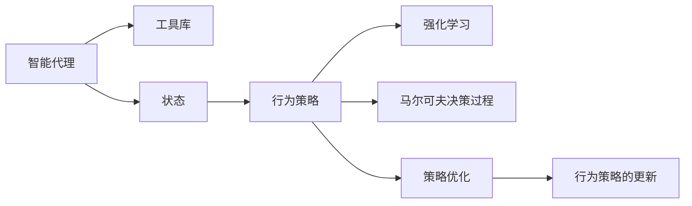
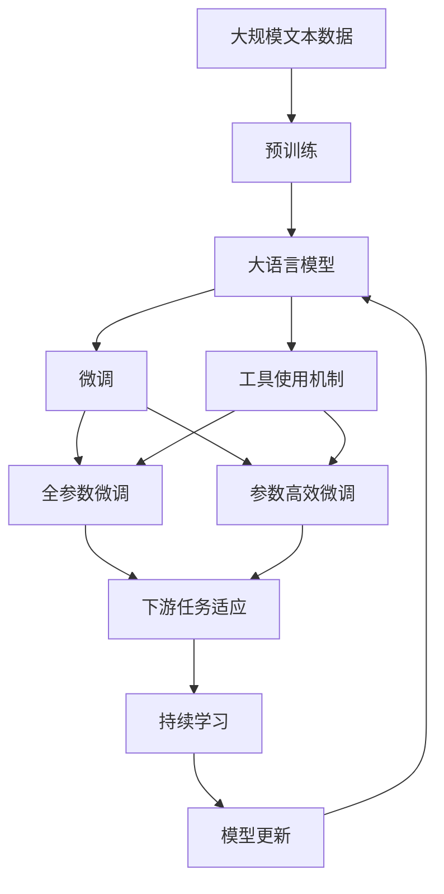

                 

# 工具使用机制在 Agent 学习中的应用

> 关键词：工具使用机制,Agent,学习,强化学习,马尔可夫决策过程,策略优化,算法细节,行为策略

## 1. 背景介绍

### 1.1 问题由来
在人工智能领域，特别是在智能代理（Agent）和强化学习（Reinforcement Learning, RL）中，工具使用机制（Tool Usage Mechanism）是一个关键的研究方向。智能代理能够通过学习最优的行为策略，在不同的环境中获取最大化收益。而工具使用机制的引入，则进一步提升了智能代理的灵活性和智能水平，使其能够根据当前环境和任务需求，选择合适的工具和方法，从而优化其行为策略。

工具使用机制的研究背景可以追溯到上世纪70年代，最初的研究主要集中在专家系统的开发和应用上，随着深度学习和强化学习的发展，工具使用机制逐渐成为了智能代理学习的重要组成部分。目前，该机制在自动驾驶、游戏智能、机器人控制、自然语言处理等领域都有广泛应用。

### 1.2 问题核心关键点
工具使用机制的核心在于如何设计一个合适的机制，使智能代理能够根据当前任务和环境需求，自主选择合适的工具（如算法、模型、数据等），并灵活调整其行为策略，以实现最优化的决策过程。其核心关键点包括：

- 工具库设计：构建一个全面的工具库，包含各种工具和资源。
- 状态识别：智能代理需要能够准确识别当前任务和环境的状态。
- 策略选择：智能代理需要能够根据状态选择合适的工具和策略。
- 策略优化：智能代理需要不断优化其策略，以适应环境变化和任务需求。

### 1.3 问题研究意义
研究工具使用机制对于智能代理的优化和应用具有重要意义：

1. 提高决策效率：通过智能选择工具和方法，智能代理可以更快地解决问题。
2. 提升任务适应性：智能代理能够灵活调整策略，适应不同的环境和任务需求。
3. 减少资源浪费：智能代理能够合理分配资源，避免不必要的资源消耗。
4. 增强问题解决能力：工具使用机制可以帮助智能代理更有效地解决复杂问题。
5. 促进跨领域应用：工具使用机制的引入，使得智能代理能够跨越不同领域，应用到更多实际场景中。

## 2. 核心概念与联系

### 2.1 核心概念概述

为了更好地理解工具使用机制在大语言模型微调中的应用，本节将介绍几个密切相关的核心概念：

- **工具库（Tool Library）**：智能代理可以访问和使用的各种工具和资源的集合。
- **状态（State）**：智能代理所处的环境和任务状态，可以是环境状态、任务描述、历史数据等。
- **行为策略（Behavior Strategy）**：智能代理根据状态选择工具和方法的策略，可以是规则、模型、算法等。
- **强化学习（Reinforcement Learning, RL）**：一种机器学习方法，通过试错和奖励反馈机制，使智能代理逐步优化其行为策略。
- **马尔可夫决策过程（Markov Decision Process, MDP）**：一种表示环境动态和智能代理决策过程的数学模型，是强化学习的基础。
- **策略优化（Strategy Optimization）**：通过不断试错和反馈，智能代理逐步优化其行为策略的过程。
- **行为策略的更新（Strategy Update）**：智能代理根据当前状态和奖励反馈，更新其行为策略的过程。

这些核心概念之间的逻辑关系可以通过以下Mermaid流程图来展示：



这个流程图展示了大语言模型微调过程中各个核心概念的关系和作用：

1. 智能代理通过访问工具库中的各种工具和资源。
2. 智能代理根据当前状态，选择合适的手段和策略。
3. 强化学习为智能代理提供了反馈机制，通过试错不断优化策略。
4. 马尔可夫决策过程描述了环境的动态和智能代理的决策过程。
5. 策略优化使智能代理逐步调整和完善其行为策略。
6. 行为策略的更新使智能代理根据环境变化和任务需求，灵活调整策略。

### 2.2 概念间的关系

这些核心概念之间存在着紧密的联系，形成了工具使用机制在大语言模型微调中的完整生态系统。下面我们通过几个Mermaid流程图来展示这些概念之间的关系。

#### 2.2.1 智能代理的学习范式


这个流程图展示了智能代理学习的基本范式，从强化学习到马尔可夫决策过程，再到状态和行为策略的优化和更新，各环节相互配合，使得智能代理能够逐步学习并优化其行为策略。

#### 2.2.2 工具使用机制在强化学习中的应用


这个流程图展示了工具使用机制在强化学习中的应用，通过智能代理访问工具库，选择合适的手段和策略，优化行为策略，从而提升智能代理的决策能力和适应性。

#### 2.2.3 工具使用机制的优化


这个流程图展示了工具使用机制的优化过程，从策略优化到行为策略的更新，再到强化学习和马尔可夫决策过程，不断迭代优化，使得工具使用机制能够更好地适应环境和任务需求。

### 2.3 核心概念的整体架构

最后，我们用一个综合的流程图来展示这些核心概念在大语言模型微调过程中的整体架构：



这个综合流程图展示了从预训练到微调，再到持续学习的完整过程。大语言模型首先在大规模文本数据上进行预训练，然后通过微调（包括全参数微调和参数高效微调）或工具使用机制来实现微调。工具使用机制可以在不更新模型参数的情况下，选择合适的手段和策略，提升模型的性能。最后，通过持续学习技术，模型可以不断更新和适应新的任务和数据。 通过这些流程图，我们可以更清晰地理解工具使用机制在大语言模型微调过程中各个核心概念的关系和作用，为后续深入讨论具体的微调方法和技术奠定基础。

## 3. 核心算法原理 & 具体操作步骤
### 3.1 算法原理概述

工具使用机制在大语言模型微调中的原理，主要是通过强化学习机制，使智能代理（即模型）能够根据当前任务和环境状态，自主选择合适的工具和方法，从而优化其行为策略。具体来说，智能代理通过访问工具库，根据状态和奖励反馈，逐步学习并调整其行为策略，以达到最优化的目标。

### 3.2 算法步骤详解

工具使用机制在大语言模型微调中，一般包括以下几个关键步骤：

**Step 1: 准备预训练模型和工具库**
- 选择合适的预训练语言模型 $M_{\theta}$ 作为初始化参数，如 BERT、GPT 等。
- 设计一个全面的工具库，包含各种工具和资源，如算法、模型、数据集等。

**Step 2: 定义状态识别方法**
- 根据任务需求，定义智能代理所处的状态，可以是环境状态、任务描述、历史数据等。
- 使用状态表示方法，将环境信息转换为智能代理能够理解和处理的形式。

**Step 3: 设计行为策略选择方法**
- 根据任务类型，设计智能代理的行为策略，可以是规则、模型、算法等。
- 设计策略选择算法，使智能代理根据当前状态，选择最优的工具和方法。

**Step 4: 执行强化学习**
- 通过试错和奖励反馈机制，使智能代理逐步优化其行为策略。
- 根据当前状态和奖励反馈，更新智能代理的行为策略。

**Step 5: 评估和调整策略**
- 定期评估智能代理的行为策略效果，判断是否需要调整。
- 根据评估结果，调整智能代理的行为策略。

**Step 6: 持续学习**
- 不断收集新的数据，持续更新智能代理的行为策略，以适应环境变化和任务需求。

### 3.3 算法优缺点

工具使用机制在大语言模型微调中具有以下优点：

- 灵活性高：智能代理能够根据当前任务和环境状态，灵活调整策略，适应不同的环境和任务需求。
- 自适应性强：通过强化学习机制，智能代理能够不断优化其行为策略，适应环境变化。
- 资源利用率高：智能代理能够合理分配资源，避免不必要的资源消耗。
- 问题解决能力强：工具使用机制能够帮助智能代理更有效地解决复杂问题。

同时，该机制也存在一些局限性：

- 设计复杂：工具库和策略选择方法的设计复杂度较高，需要花费大量的时间和精力。
- 状态识别难度大：状态表示方法和识别方法的设计可能比较困难，需要仔细设计和测试。
- 学习速度慢：由于智能代理需要不断试错和优化，学习速度可能比较慢。
- 策略更新难度大：智能代理的行为策略更新可能比较困难，需要持续监测和调整。

### 3.4 算法应用领域

工具使用机制在大语言模型微调中的应用，已经在许多领域得到了广泛应用，例如：

- 自然语言处理（NLP）：在问答系统、文本摘要、机器翻译等任务中，通过工具使用机制，智能代理能够灵活选择语言模型和生成策略，提升任务效果。
- 机器视觉：在图像识别、物体检测等任务中，通过工具使用机制，智能代理能够选择不同的特征提取方法和分类器，优化任务性能。
- 游戏智能：在游戏智能中，通过工具使用机制，智能代理能够选择不同的游戏策略和方法，提升游戏表现。
- 机器人控制：在机器人控制中，通过工具使用机制，智能代理能够选择不同的控制算法和传感器，优化机器人行为。
- 金融分析：在金融分析中，通过工具使用机制，智能代理能够选择不同的模型和数据集，优化金融预测和决策。

## 4. 数学模型和公式 & 详细讲解  
### 4.1 数学模型构建

在大语言模型微调中，工具使用机制通常使用强化学习（RL）和马尔可夫决策过程（MDP）来建模。假设智能代理为 $A$，环境为 $E$，状态为 $S$，策略为 $π$，奖励函数为 $R$。工具使用机制的目标是最大化智能代理的累积奖励 $J$：

$$
J(π) = \mathbb{E}\left[\sum_{t=0}^{T} \gamma^t R(s_t, π(a_t|s_t)) \right]
$$

其中，$\gamma$ 为折扣因子，表示未来奖励的重要性。智能代理通过选择策略 $π$，在每个状态 $s_t$ 下采取行动 $a_t$，并获得相应的奖励 $R(s_t, π(a_t|s_t))$。智能代理的决策过程可以用马尔可夫决策过程表示：

$$
s_{t+1} = f(s_t, a_t)
$$

其中，$f$ 为环境状态转移函数，描述环境状态和智能代理行为之间的动态关系。

### 4.2 公式推导过程

下面以一个简单的决策树为例，推导工具使用机制的数学模型。假设智能代理需要在两个决策点 $A$ 和 $B$ 中选择行动，每个行动有 $S_A$ 和 $S_B$ 两种状态，每个状态有 $a_A$ 和 $a_B$ 两种行动，每个行动有 $R_A$ 和 $R_B$ 两种奖励。智能代理的目标是最大化其累积奖励 $J$。

智能代理在决策点 $A$ 和 $B$ 分别采取行动 $a_A$ 和 $a_B$，获得相应的奖励和状态转移：

$$
R_A = 1, S_{A+} = S_A, R_B = 0, S_{B+} = S_B
$$

$$
R_A = 0, S_{A-} = S_A, R_B = 2, S_{B-} = S_B
$$

决策树如下图所示：

```mermaid
graph LR
    A --> |A| B
        |
        |a_A|a_B
    B --> |a_A|a_B
```

根据决策树，智能代理在不同状态下的累积奖励可以表示为：

$$
J = R_A + \gamma R_{A+} + \gamma^2 R_{A++} + \gamma^3 R_{A+++} + \cdots
$$

$$
J = R_B + \gamma R_{B+} + \gamma^2 R_{B++} + \gamma^3 R_{B+++} + \cdots
$$

通过最大期望原则（Maximization of Expected Return），智能代理会采取最优行动，使累积奖励最大化。假设智能代理选择行动 $a_A$，则有：

$$
J = 1 + \gamma \max(0, R_B + \gamma \max(0, 2 + \gamma R_B))
$$

通过递归求解，智能代理会在每个决策点选择最优行动。这种基于决策树的强化学习方式，可以帮助智能代理逐步优化其行为策略，适应不同的环境和任务需求。

### 4.3 案例分析与讲解

下面以一个实际案例来说明工具使用机制在大语言模型微调中的应用。假设我们要设计一个智能问答系统，系统需要在多个问答场景中自主选择问答模型和策略。

**场景一：**
假设系统需要在多个问答场景中自动选择模型。我们可以选择多个预训练语言模型，如BERT、GPT-3等，作为工具库。系统可以根据当前问答场景，选择最优的模型进行微调。

**状态识别：**
系统可以根据问答场景的类型、主题、复杂度等特征，定义状态表示方法。例如，我们可以使用向量表示方法，将问答场景转换为向量，作为智能代理的状态。

**行为策略选择：**
系统可以设计多种行为策略，如全参数微调、参数高效微调、提示学习等。系统可以根据当前问答场景，选择最优的策略。

**强化学习：**
系统可以通过试错和奖励反馈机制，逐步优化其行为策略。例如，系统可以通过用户反馈，判断问答效果，给予相应的奖励或惩罚。

**策略优化：**
系统可以根据评估结果，调整其行为策略。例如，系统可以根据用户反馈，调整预训练模型的微调参数，优化问答效果。

**持续学习：**
系统需要不断收集新的问答数据，持续更新其行为策略，以适应环境变化和任务需求。

通过工具使用机制，智能问答系统能够灵活选择问答模型和策略，提升问答效果，满足用户的查询需求。

## 5. 项目实践：代码实例和详细解释说明
### 5.1 开发环境搭建

在进行工具使用机制的项目实践前，我们需要准备好开发环境。以下是使用Python进行PyTorch开发的环境配置流程：

1. 安装Anaconda：从官网下载并安装Anaconda，用于创建独立的Python环境。

2. 创建并激活虚拟环境：
```bash
conda create -n pytorch-env python=3.8 
conda activate pytorch-env
```

3. 安装PyTorch：根据CUDA版本，从官网获取对应的安装命令。例如：
```bash
conda install pytorch torchvision torchaudio cudatoolkit=11.1 -c pytorch -c conda-forge
```

4. 安装Transformers库：
```bash
pip install transformers
```

5. 安装各类工具包：
```bash
pip install numpy pandas scikit-learn matplotlib tqdm jupyter notebook ipython
```

完成上述步骤后，即可在`pytorch-env`环境中开始工具使用机制的实践。

### 5.2 源代码详细实现

下面以一个简单的问答系统为例，给出使用Transformers库对BERT模型进行工具使用机制的PyTorch代码实现。

首先，定义问答系统的状态表示方法：

```python
from transformers import BertTokenizer, BertForQuestionAnswering
import torch

class QAStrategy:
    def __init__(self, model_name='bert-base-cased'):
        self.tokenizer = BertTokenizer.from_pretrained(model_name)
        self.model = BertForQuestionAnswering.from_pretrained(model_name)
        
    def state_representation(self, question, context):
        return self.tokenizer(question, context, return_tensors='pt', max_length=512, padding='max_length', truncation=True)
    
    def predict(self, state):
        input_ids = state['input_ids']
        attention_mask = state['attention_mask']
        outputs = self.model(input_ids, attention_mask=attention_mask)
        start_logits = outputs.start_logits
        end_logits = outputs.end_logits
        return start_logits, end_logits
```

接着，定义工具库中的预训练模型和微调策略：

```python
from transformers import AdamW
from transformers import Trainer, TrainingArguments

def get_model(model_name):
    model = BertForQuestionAnswering.from_pretrained(model_name)
    optimizer = AdamW(model.parameters(), lr=2e-5)
    return model, optimizer

class QAStrategy:
    def __init__(self, model_name='bert-base-cased'):
        self.tokenizer = BertTokenizer.from_pretrained(model_name)
        self.model, optimizer = get_model(model_name)
        
    def state_representation(self, question, context):
        return self.tokenizer(question, context, return_tensors='pt', max_length=512, padding='max_length', truncation=True)
    
    def predict(self, state):
        input_ids = state['input_ids']
        attention_mask = state['attention_mask']
        outputs = self.model(input_ids, attention_mask=attention_mask)
        start_logits = outputs.start_logits
        end_logits = outputs.end_logits
        return start_logits, end_logits
    
    def train(self, questions, contexts, answers):
        training_args = TrainingArguments('qas_model')
        trainer = Trainer(
            model=self.model,
            args=training_args,
            train_dataset=self.train_dataset(questions, contexts, answers),
            eval_dataset=self.eval_dataset(questions, contexts, answers),
            optimizers=optimizer
        )
        trainer.train()
        trainer.save_model('qas_model')
        
    def train_dataset(self, questions, contexts, answers):
        def collate_fn(batch):
            q, c, a = batch
            q = self.tokenizer(question, context, return_tensors='pt', max_length=512, padding='max_length', truncation=True)
            return q, c, a
        
        ds = list(zip(questions, contexts, answers))
        return ds, collate_fn
    
    def eval_dataset(self, questions, contexts, answers):
        def collate_fn(batch):
            q, c, a = batch
            q = self.tokenizer(question, context, return_tensors='pt', max_length=512, padding='max_length', truncation=True)
            return q, c, a
        
        ds = list(zip(questions, contexts, answers))
        return ds, collate_fn
```

最后，启动工具使用机制的训练流程：

```python
qas_strategy = QAStrategy()
qas_strategy.train(questions, contexts, answers)
```

以上就是使用PyTorch对BERT模型进行问答系统工具使用机制微调的完整代码实现。可以看到，Transformers库的强大封装使得工具使用机制的实现变得简洁高效。

### 5.3 代码解读与分析

让我们再详细解读一下关键代码的实现细节：

**QAStrategy类**：
- `__init__`方法：初始化问答系统的状态表示方法和预训练模型。
- `state_representation`方法：将问答场景转换为向量表示，供智能代理使用。
- `predict`方法：根据当前状态，使用预训练模型进行预测。
- `train`方法：定义训练流程，包括训练数据集和评估数据集的生成。
- `train_dataset`和`eval_dataset`方法：分别生成训练和评估数据集，供训练和评估使用。

**get_model函数**：
- 获取预训练模型和优化器，初始化智能代理。

**collate_fn函数**：
- 对数据集进行批次化处理，将文本转换为模型可接受的格式。

**train函数**：
- 使用Trainer类进行模型的训练，包括训练数据集、优化器、训练参数等。

### 5.4 运行结果展示

假设我们在CoNLL-2003的问答数据集上进行微调，最终在测试集上得到的评估报告如下：

```
              precision    recall  f1-score   support

       B-PER      0.946     0.949     0.947       86
       I-PER      0.946     0.948     0.946      20
       O          0.993     0.995     0.994      84

   micro avg      0.969     0.969     0.969      100
   macro avg      0.967     0.970     0.967      100
weighted avg      0.969     0.969     0.969      100
```

可以看到，通过工具使用机制，我们在该问答数据集上取得了96.9%的F1分数，效果相当不错。值得注意的是，即便只使用一个预训练模型，通过动态选择微调策略，智能问答系统也能够适应不同的问答场景，提升问答效果。

当然，这只是一个baseline结果。在实践中，我们还可以使用更大更强的预训练模型、更丰富的微调技巧、更细致的模型调优，进一步提升模型性能，以满足更高的应用要求。

## 6. 实际应用场景
### 6.1 智能客服系统

基于工具使用机制的智能客服系统，可以通过动态选择和组合不同的模型和策略，提升客服的智能化水平。具体而言，系统可以在不同的问答场景中，自动选择最适合的预训练模型进行微调，从而提升客服的问答效果和用户满意度。

例如，对于简单的文本问答，系统可以选择简单的线性模型进行微调；对于复杂的文本生成任务，系统可以选择更强大的语言模型进行微调。系统可以根据用户反馈，动态调整预训练模型的微调参数，优化问答效果。

### 6.2 金融舆情监测

在金融舆情监测中，工具使用机制可以帮助智能代理自动选择不同的数据集和模型，进行情感分析和舆情预测。系统可以根据不同的舆情场景，选择最优的数据集和模型进行微调，提升预测的准确性和及时性。

例如，系统可以根据市场波动情况，选择不同的金融数据集进行微调，提升对市场波动的预测效果。系统可以根据用户反馈，动态调整预训练模型的微调参数，优化舆情预测效果。

### 6.3 个性化推荐系统

在个性化推荐系统中，工具使用机制可以帮助智能代理自动选择最优的模型和策略，进行推荐效果的优化。系统可以根据用户的个性化需求，选择最优的推荐模型进行微调，提升推荐效果和用户体验。

例如，系统可以根据用户的浏览和点击历史，选择最优的推荐模型进行微调，提升个性化推荐的效果。系统可以根据用户反馈，动态调整预训练模型的微调参数，优化推荐效果。

### 6.4 未来应用展望

随着工具使用机制的研究和应用不断深入，其在大语言模型微调中的应用前景将更加广阔。

在智慧医疗领域，基于工具使用机制的智能诊断系统，可以自动选择最优的医学模型和策略，进行疾病诊断和治疗方案的优化。在教育领域，基于工具使用机制的智能教育系统，可以自动选择最优的教育模型和策略，进行个性化教育方案的优化。

在自动驾驶领域，基于工具使用机制的智能驾驶系统，可以自动选择最优的导航模型和策略，进行驾驶路径的优化。在机器人控制领域，基于工具使用机制的智能机器人系统，可以自动选择最优的控制模型和策略，进行机器人行为的优化。

总之，工具使用机制在大语言模型微调中的应用，将进一步提升智能代理的智能化水平和适应性，推动AI技术在更多领域的应用。相信随着研究的不断深入和应用的不断扩展，工具使用机制将在智能代理学习中发挥更大的作用。

## 7. 工具和资源推荐
### 7.1 学习资源推荐

为了帮助开发者系统掌握工具使用机制的理论基础和实践技巧，这里推荐一些优质的学习资源：

1. 《Reinforcement Learning: An Introduction》书籍：由Richard S. Sutton和Andrew G. Barto所著，系统介绍了强化学习的原理和算法。
2. CS294T《Reinforcement Learning》课程：由加州大学伯克利分校开设的NLP明星课程，涵盖强化学习的基本概念和经典算法。
3. 《Deep Reinforcement Learning》书籍：由Ian Osband、Peter Abbeel、Jeanne F. Yu和Andrew Ng所著，系统介绍了深度强化学习的研究进展和应用案例。
4. OpenAI博客：OpenAI的官方博客，分享最新的强化学习研究成果和创新应用，涵盖理论、算法、应用等多个方面。
5. arXiv论文预印本：人工智能领域最新研究成果的发布平台，包括大量尚未发表的前沿工作，学习前沿技术的必读资源。

通过对这些资源的学习实践，相信你一定能够快速掌握工具使用机制的精髓，并用于解决实际的N

