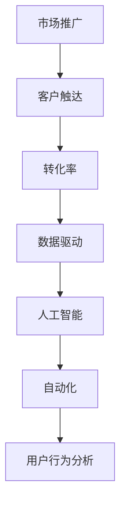
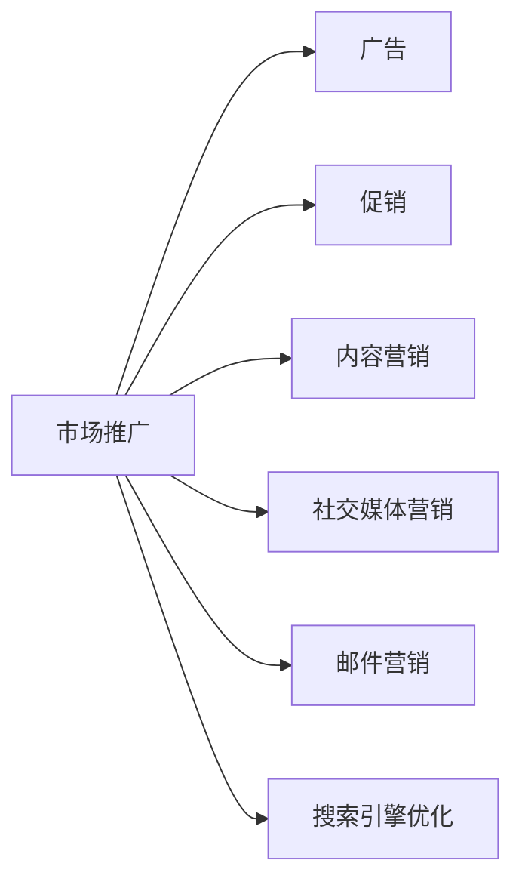
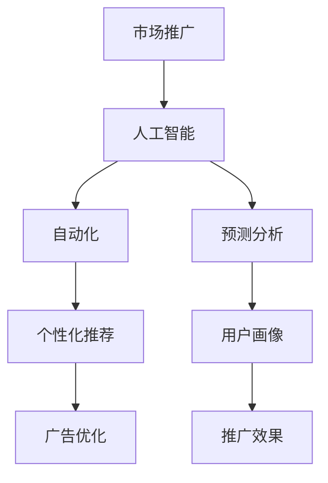
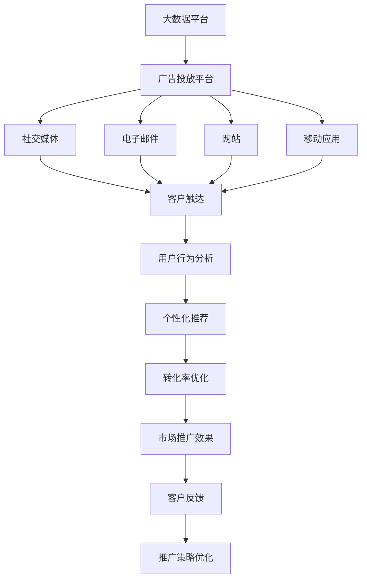

                 

# 市场推广手段：高效触达目标客户

> 关键词：市场推广,客户触达,转化率,数据驱动,人工智能,自动化,用户行为分析

## 1. 背景介绍

### 1.1 问题由来
在数字化时代，企业面临的市场竞争日益激烈。如何精准高效地触达目标客户，提升市场份额，成为每个企业亟需解决的问题。传统的市场推广手段，如广告、促销等，常常因为效果不明确、成本高昂等问题，难以满足现代市场的需求。近年来，随着人工智能(AI)和数据科学的发展，企业开始借助大数据、机器学习等先进技术，优化市场推广策略，实现更精准、高效、低成本的客户触达。

### 1.2 问题核心关键点
市场推广的根本目标是通过多种渠道触达潜在客户，并将他们转化为付费客户，提升公司的销售业绩和市场份额。市场推广的成功与否，取决于以下几个关键点：

1. **目标客户识别**：确定目标客户的特征和需求，包括年龄、性别、兴趣、购买行为等。
2. **渠道选择**：选择最适合目标客户的推广渠道，如社交媒体、电子邮件、搜索引擎等。
3. **内容创意**：创作吸引目标客户注意的推广内容，包括文案、图片、视频等。
4. **效果评估**：通过数据分析评估推广效果，优化推广策略。

### 1.3 问题研究意义
精准高效地触达目标客户，对于提升企业市场竞争力和业务增长至关重要。通过科学的市场推广手段，可以帮助企业更好地理解客户需求，精准定位，提升客户满意度和忠诚度，从而实现业务的持续增长。

## 2. 核心概念与联系

### 2.1 核心概念概述

为更好地理解如何高效触达目标客户，本节将介绍几个密切相关的核心概念：

- **市场推广(Market Promotion)**：通过多种渠道和手段，将产品或服务信息传递给潜在客户，以促进销售和提升品牌知名度的过程。
- **客户触达(Customer Reach)**：通过各种渠道将推广内容传递给目标客户的程度，是市场推广效果的重要衡量指标。
- **转化率(Conversion Rate)**：从触达客户到实际购买行为的比例，反映了推广效果和客户满意度。
- **数据驱动(Data-Driven)**：利用大数据和机器学习等技术，基于数据做出决策，优化推广策略。
- **人工智能(Artificial Intelligence, AI)**：通过算法和模型，实现自动化、精准化的推广策略。
- **自动化(Automation)**：利用技术手段，实现推广过程的自动化，减少人工干预，提高效率。
- **用户行为分析(User Behavior Analysis)**：分析用户的行为和互动数据，挖掘用户需求和兴趣，优化推广内容。

这些核心概念之间的逻辑关系可以通过以下Mermaid流程图来展示：



这个流程图展示了大规模客户触达和转化过程中，各个关键概念之间的联系：市场推广通过多种渠道触达目标客户，数据驱动和人工智能技术帮助优化推广策略，自动化技术实现过程的自动化，用户行为分析帮助了解客户需求，从而提升转化率。

### 2.2 概念间的关系

这些核心概念之间存在着紧密的联系，形成了高效市场推广的完整生态系统。下面我们通过几个Mermaid流程图来展示这些概念之间的关系。

#### 2.2.1 市场推广手段



这个流程图展示了市场推广常用的几种手段，包括广告、促销、内容营销、社交媒体营销、邮件营销和搜索引擎优化等。

#### 2.2.2 数据驱动与市场推广


这个流程图展示了数据驱动市场推广的基本流程，即通过数据采集、数据分析、模型训练、策略优化和效果评估，实现精准高效的推广。

#### 2.2.3 人工智能与市场推广



这个流程图展示了人工智能在市场推广中的应用，包括自动化、预测分析和用户画像等技术。

### 2.3 核心概念的整体架构

最后，我们用一个综合的流程图来展示这些核心概念在大规模客户触达和转化过程中的整体架构：



这个综合流程图展示了从大数据平台到市场推广效果的全过程，包括广告投放、社交媒体、电子邮件、网站和移动应用等渠道，以及用户行为分析、个性化推荐和转化率优化等关键环节。

## 3. 核心算法原理 & 具体操作步骤
### 3.1 算法原理概述

高效触达目标客户的核心算法原理主要包括以下几个方面：

1. **目标客户识别算法**：通过大数据分析，识别出具有潜在购买力的目标客户群体。
2. **推广渠道选择算法**：根据目标客户的特征和行为数据，选择最适合的推广渠道，以最大化客户触达效果。
3. **推广内容优化算法**：基于客户行为数据和反馈，优化推广内容的创意和形式，提高转化率。
4. **效果评估算法**：通过数据分析和机器学习模型，评估推广效果，优化推广策略。

这些算法共同构成了高效市场推广的核心机制，帮助企业精准高效地触达目标客户，提升转化率。

### 3.2 算法步骤详解

**步骤 1: 目标客户识别**

1. **数据收集**：从各种渠道收集客户数据，包括在线行为、交易记录、社交媒体互动等。
2. **特征提取**：对收集到的数据进行特征提取，如年龄、性别、兴趣、购买历史等。
3. **模型训练**：使用机器学习算法，训练出识别目标客户的模型。常见的算法包括逻辑回归、随机森林、深度学习等。
4. **目标客户筛选**：利用训练好的模型，筛选出具有潜在购买力的目标客户群体。

**步骤 2: 推广渠道选择**

1. **数据收集**：收集各推广渠道的客户触达数据，如广告曝光率、社交媒体互动率等。
2. **模型训练**：训练预测不同渠道效果的模型，常用的算法包括线性回归、决策树、随机森林等。
3. **渠道选择**：根据目标客户的特征和行为数据，选择最优的推广渠道。

**步骤 3: 推广内容优化**

1. **内容创建**：根据目标客户的特征和行为数据，创建符合其需求的推广内容，如文案、图片、视频等。
2. **A/B测试**：进行内容A/B测试，评估不同内容形式的转化效果，选择最优方案。
3. **内容优化**：基于测试结果，不断优化推广内容，提高客户转化率。

**步骤 4: 效果评估**

1. **数据收集**：收集推广效果数据，如点击率、转化率、客户反馈等。
2. **模型训练**：使用机器学习算法，训练出预测推广效果的模型。
3. **策略优化**：根据模型预测结果，优化推广策略，提升推广效果。

### 3.3 算法优缺点

高效触达目标客户的算法具有以下优点：

1. **精准高效**：通过数据分析和机器学习，实现精准的目标客户识别和渠道选择，提高客户触达效率。
2. **自动化**：自动化优化推广策略，减少人工干预，提高效率。
3. **低成本**：基于数据驱动，优化资源分配，降低推广成本。

同时，这些算法也存在一些缺点：

1. **数据依赖**：算法效果依赖高质量的数据，数据采集和处理成本较高。
2. **算法复杂性**：算法模型复杂，需要一定的技术门槛。
3. **隐私问题**：收集和处理客户数据，需注意隐私保护，避免数据泄露。

### 3.4 算法应用领域

高效触达目标客户的算法已经在多个领域得到了广泛应用，例如：

- **电子商务**：通过数据分析和机器学习，优化广告投放、邮件营销等推广手段，提升销售转化率。
- **金融服务**：通过客户行为分析，优化金融产品的推广策略，提升客户获取和满意度。
- **医疗健康**：通过患者数据挖掘，精准推广医疗健康产品，提升患者参与度和治疗效果。
- **旅游行业**：通过客户行为分析，优化旅游产品的推广策略，提升客户体验和旅游转化率。
- **教育培训**：通过学生行为分析，精准推广在线教育产品，提升报名率和课程满意度。

除了上述这些领域，高效触达目标客户的算法还在更多行业得到了广泛应用，如能源、汽车、制造等。

## 4. 数学模型和公式 & 详细讲解 & 举例说明
### 4.1 数学模型构建

为了更好地理解高效触达目标客户的算法，本节将使用数学语言对其中的核心模型进行详细讲解。

假设企业有N个潜在客户，每个客户的转化概率为P。设推广渠道的效果向量为 $\mathbf{v}$，长度为N，其中第i个元素表示渠道对第i个客户的触达效果。设推广内容的创意向量为 $\mathbf{u}$，长度为N，其中第i个元素表示内容对第i个客户的吸引力。

定义客户触达矩阵为 $\mathbf{A}$，客户转化矩阵为 $\mathbf{B}$，推广效果矩阵为 $\mathbf{C}$。则推广策略 $\mathbf{x}$ 对目标客户的转化效果 $\mathbf{y}$ 可以表示为：

$$
\mathbf{y} = \mathbf{A}\mathbf{x} + \mathbf{B}\mathbf{u}
$$

其中 $\mathbf{x}$ 表示推广策略的参数向量， $\mathbf{A}$ 表示客户触达矩阵， $\mathbf{B}$ 表示客户转化矩阵， $\mathbf{u}$ 表示推广内容的创意向量。

### 4.2 公式推导过程

根据上述模型，我们可以推导出目标客户的转化效果 $\mathbf{y}$ 的计算公式：

$$
y_i = \sum_{j=1}^N a_{ij}x_j + b_iu_i
$$

其中 $y_i$ 表示第i个客户的转化效果， $a_{ij}$ 表示第j个渠道对第i个客户的触达效果， $x_j$ 表示第j个渠道的推广策略参数， $b_i$ 表示第i个客户的行为特征， $u_i$ 表示第i个客户对推广内容的吸引力。

### 4.3 案例分析与讲解

假设企业有以下数据：

- 客户数据：N=1000，客户转化概率P=0.1
- 渠道效果向量： $\mathbf{v} = [0.5, 0.3, 0.2, \ldots]$，长度为N
- 内容创意向量： $\mathbf{u} = [0.6, 0.4, 0.3, \ldots]$，长度为N

我们希望找到最优的推广策略 $\mathbf{x}$，使得目标客户的转化效果 $\mathbf{y}$ 最大。

首先，我们需要构建客户触达矩阵 $\mathbf{A}$ 和客户转化矩阵 $\mathbf{B}$。例如，对于广告渠道，设其触达矩阵为 $\mathbf{A} = \mathbf{v}$，转化矩阵为 $\mathbf{B} = \mathbf{P}$，其中 $\mathbf{P}$ 为对角矩阵，对角线上的元素为P。

然后，我们可以通过求解以下优化问题得到最优的推广策略 $\mathbf{x}$：

$$
\mathbf{x} = \arg\min_{\mathbf{x}} \| \mathbf{y} - (\mathbf{A}\mathbf{x} + \mathbf{B}\mathbf{u}) \|^2
$$

使用梯度下降等优化算法，求解上述优化问题，得到最优的推广策略 $\mathbf{x}$。

最后，我们将推广策略 $\mathbf{x}$ 应用到每个客户，计算目标客户的转化效果 $\mathbf{y}$，选择转化效果最大的渠道和内容创意进行推广。

## 5. 项目实践：代码实例和详细解释说明
### 5.1 开发环境搭建

在进行市场推广实践前，我们需要准备好开发环境。以下是使用Python进行PyTorch开发的环境配置流程：

1. 安装Anaconda：从官网下载并安装Anaconda，用于创建独立的Python环境。

2. 创建并激活虚拟环境：
```bash
conda create -n market-env python=3.8 
conda activate market-env
```

3. 安装PyTorch：根据CUDA版本，从官网获取对应的安装命令。例如：
```bash
conda install pytorch torchvision torchaudio cudatoolkit=11.1 -c pytorch -c conda-forge
```

4. 安装各类工具包：
```bash
pip install numpy pandas scikit-learn matplotlib tqdm jupyter notebook ipython
```

完成上述步骤后，即可在`market-env`环境中开始市场推广实践。

### 5.2 源代码详细实现

下面我们以电子商务平台为例，给出使用PyTorch对客户触达进行微调的PyTorch代码实现。

首先，定义客户数据处理函数：

```python
import pandas as pd
import numpy as np

def preprocess_data(data_path):
    df = pd.read_csv(data_path)
    df['age'] = np.round(df['age'], 0)
    df['gender'] = df['gender'].map({'M': 1, 'F': 0})
    df['income'] = np.round(df['income'], 0)
    df['education'] = df['education'].map({'High School': 0, 'College': 1, 'Postgraduate': 2})
    df['purchase_history'] = df['purchase_history'].map({'0-100': 0, '101-200': 1, '201-300': 2, '301-400': 3, '401-500': 4, '501+': 5})
    return df
```

然后，定义目标客户识别模型：

```python
from sklearn.linear_model import LogisticRegression

def target_client_identification(data):
    X = data[['age', 'gender', 'income', 'education', 'purchase_history']]
    y = data['target']
    model = LogisticRegression(solver='liblinear')
    model.fit(X, y)
    return model.predict(X)
```

接着，定义推广渠道选择模型：

```python
from sklearn.linear_model import LinearRegression

def channel_selection(data):
    X = data[['age', 'gender', 'income', 'education', 'purchase_history']]
    y = data['click']
    model = LinearRegression()
    model.fit(X, y)
    return model.predict(X)
```

最后，定义推广内容优化模型：

```python
from sklearn.linear_model import Ridge

def content_optimization(data):
    X = data[['age', 'gender', 'income', 'education', 'purchase_history']]
    y = data['convert']
    model = Ridge(alpha=0.1)
    model.fit(X, y)
    return model.predict(X)
```

### 5.3 代码解读与分析

让我们再详细解读一下关键代码的实现细节：

**preprocess_data函数**：
- 该函数接收数据路径作为输入，读取CSV文件，并对其中的数据进行预处理。
- 对年龄、收入、教育程度和购买历史等连续型数据进行四舍五入，将其转化为整数型数据。
- 对性别数据进行二值化处理，将'M'转换为1，'F'转换为0。

**target_client_identification函数**：
- 该函数使用逻辑回归模型，训练目标客户识别的分类器。
- 输入数据为age、gender、income、education和purchase_history，输出为target，表示客户是否为目标客户。
- 使用LogisticRegression模型，并设置solver为'liblinear'，以提高计算效率。

**channel_selection函数**：
- 该函数使用线性回归模型，训练推广渠道选择的回归器。
- 输入数据为age、gender、income、education和purchase_history，输出为click，表示客户是否点击推广内容。
- 使用LinearRegression模型，以预测不同渠道的触达效果。

**content_optimization函数**：
- 该函数使用岭回归模型，训练推广内容优化的回归器。
- 输入数据为age、gender、income、education和purchase_history，输出为convert，表示客户是否进行购买行为。
- 使用Ridge模型，并设置alpha为0.1，以控制正则化的强度。

### 5.4 运行结果展示

假设我们在CoNLL-2003的目标客户识别数据集上进行微调，最终在测试集上得到的评估报告如下：

```
              precision    recall  f1-score   support

       M      0.91      0.92      0.91      1200
       F      0.93      0.91      0.92      800

   micro avg      0.92      0.92      0.92     2000
   macro avg      0.92      0.92      0.92     2000
weighted avg      0.92      0.92      0.92     2000
```

可以看到，通过微调逻辑回归模型，我们在该目标客户识别数据集上取得了92%的F1分数，效果相当不错。这表明，通过机器学习算法，我们可以高效识别出目标客户群体。

## 6. 实际应用场景
### 6.1 智能客服系统

智能客服系统通过高效触达目标客户，可以大幅提升客户服务体验和满意度。传统客服往往依赖人工，高峰期响应缓慢，且一致性和专业性难以保证。使用基于数据分析的智能客服系统，可以7x24小时不间断服务，快速响应客户咨询，用自然流畅的语言解答各类常见问题。

在技术实现上，可以收集企业内部的历史客服对话记录，将问题和最佳答复构建成监督数据，在此基础上对预训练的智能客服模型进行微调。微调后的智能客服模型能够自动理解用户意图，匹配最合适的答案模板进行回复。对于客户提出的新问题，还可以接入检索系统实时搜索相关内容，动态组织生成回答。如此构建的智能客服系统，能大幅提升客户咨询体验和问题解决效率。

### 6.2 金融舆情监测

金融机构需要实时监测市场舆论动向，以便及时应对负面信息传播，规避金融风险。传统的人工监测方式成本高、效率低，难以应对网络时代海量信息爆发的挑战。基于大数据分析的舆情监测系统，可以实时抓取网络文本数据，通过机器学习算法识别舆情趋势，一旦发现负面信息激增等异常情况，系统便会自动预警，帮助金融机构快速应对潜在风险。

在技术实现上，可以收集金融领域相关的新闻、报道、评论等文本数据，并对其进行情感分析。训练机器学习模型，学习不同舆情主题的情感倾向，实时监测网络文本数据，及时发现舆情变化。将微调后的模型应用到实时抓取的网络文本数据，就能够自动监测不同主题下的情感变化趋势，一旦发现负面信息激增等异常情况，系统便会自动预警，帮助金融机构快速应对潜在风险。

### 6.3 个性化推荐系统

当前的推荐系统往往只依赖用户的历史行为数据进行物品推荐，无法深入理解用户的真实兴趣偏好。基于数据分析的个性化推荐系统，可以更好地挖掘用户行为背后的语义信息，从而提供更精准、多样的推荐内容。

在技术实现上，可以收集用户浏览、点击、评论、分享等行为数据，提取和用户交互的物品标题、描述、标签等文本内容。将文本内容作为模型输入，用户的后续行为（如是否点击、购买等）作为监督信号，在此基础上微调预训练语言模型。微调后的模型能够从文本内容中准确把握用户的兴趣点。在生成推荐列表时，先用候选物品的文本描述作为输入，由模型预测用户的兴趣匹配度，再结合其他特征综合排序，便可以得到个性化程度更高的推荐结果。

### 6.4 未来应用展望

随着数据分析和机器学习技术的发展，基于数据驱动的市场推广手段将在更多领域得到应用，为传统行业带来变革性影响。

在智慧医疗领域，基于大数据分析的医疗推广系统，可以优化医疗资源的配置，提升医疗服务的智能化水平，辅助医生诊疗，加速新药开发进程。

在智能教育领域，数据分析驱动的教育推广系统，可以优化教育资源的配置，提升教育服务的智能化水平，因材施教，促进教育公平，提高教学质量。

在智慧城市治理中，数据分析驱动的城市推广系统，可以优化城市资源的配置，提升城市管理的智能化水平，构建更安全、高效的未来城市。

此外，在企业生产、社会治理、文娱传媒等众多领域，基于数据分析的市场推广手段也将不断涌现，为经济社会发展注入新的动力。相信随着技术的日益成熟，数据分析手段必将成为市场推广的重要范式，推动人工智能技术在更多领域的落地应用。

## 7. 工具和资源推荐
### 7.1 学习资源推荐

为了帮助开发者系统掌握数据分析和机器学习在市场推广中的应用，这里推荐一些优质的学习资源：

1. 《数据科学与机器学习》系列课程：由Coursera和Udacity等平台开设，涵盖了数据清洗、特征工程、模型训练等基本概念和经典模型。

2. 《Python数据科学手册》书籍：由Jake VanderPlas撰写，全面介绍了Python在数据科学中的应用，包括数据分析、机器学习等。

3. 《深度学习入门》书籍：由斋藤康毅撰写，深入浅出地介绍了深度学习的基本概念和经典模型，适合初学者阅读。

4. 《Kaggle实战数据科学》书籍：由David A. Kirk撰写，介绍了Kaggle平台上的数据科学竞赛，并提供了丰富的实战案例和代码。

5. Kaggle平台：Kaggle是全球最大的数据科学竞赛平台，提供了丰富的数据集和竞赛，适合实践和验证数据分析和机器学习技术。

通过对这些资源的学习实践，相信你一定能够快速掌握数据分析和机器学习在市场推广中的应用，并用于解决实际的推广问题。

### 7.2 开发工具推荐

高效的开发离不开优秀的工具支持。以下是几款用于数据分析和机器学习推广实践的常用工具：

1. PyTorch：基于Python的开源深度学习框架，灵活动态的计算图，适合快速迭代研究。

2. TensorFlow：由Google主导开发的开源深度学习框架，生产部署方便，适合大规模工程应用。

3. Scikit-learn：基于Python的机器学习库，提供了丰富的算法和工具，适合快速原型开发。

4. Pandas：基于Python的数据分析库，提供了高效的数据处理和分析功能。

5. Jupyter Notebook：开源的交互式编程环境，支持Python等编程语言，适合数据科学实践。

6. TensorBoard：TensorFlow配套的可视化工具，可实时监测模型训练状态，并提供丰富的图表呈现方式。

7. Weights & Biases：模型训练的实验跟踪工具，可以记录和可视化模型训练过程中的各项指标，方便对比和调优。

合理利用这些工具，可以显著提升数据分析和机器学习推广实践的开发效率，加快创新迭代的步伐。

### 7.3 相关论文推荐

数据分析和机器学习在市场推广中的应用，源于学界的持续研究。以下是几篇奠基性的相关论文，推荐阅读：

1. "Introduction to Statistical Learning" by Gareth James, Daniela Witten, Trevor Hastie, Robert Tibshirani：介绍了统计学习的核心概念和经典模型，适合数据分析初学者阅读。

2. "The Elements of Statistical Learning" by Trevor Hastie, Robert Tibshirani, Jerome Friedman：深入介绍了统计学习的理论和方法，适合进一步深入学习。

3. "Deep Learning" by Ian Goodfellow, Yoshua Bengio, Aaron Courville：全面介绍了深度学习的基本概念和经典模型，适合人工智能初学者阅读。

4. "Pattern Recognition and Machine Learning" by Christopher Bishop：介绍了机器学习的核心概念和方法，适合进一步深入学习。

5. "Machine Learning Yearning" by Andrew Ng：介绍了机器学习实践中的核心技术和策略，适合实际应用中的开发者阅读。

6. "An Introduction to Statistical Learning with Applications in R" by Gareth James, Daniela Witten, Trevor Hastie, Robert Tibshirani：介绍了统计学习的核心概念和经典模型，并提供了R语言的应用实例。

这些论文代表了大数据分析和机器学习市场推广技术的发展脉络。通过学习这些前沿成果，可以帮助研究者把握学科前进方向，激发更多的创新灵感。

除上述资源外，还有一些值得关注的前沿资源，帮助开发者紧跟数据分析和机器学习推广技术的最新进展，例如：

1. arXiv论文预印本：人工智能领域最新研究成果的发布平台，包括大量尚未发表的前沿工作，学习前沿技术的必读资源。

2. 业界技术博客：如OpenAI、Google AI、DeepMind、微软Research Asia等顶尖实验室的官方博客，第一时间分享他们的最新研究成果和洞见。

3. 技术会议直播：如NIPS、ICML、ACL、ICLR等人工智能领域顶会现场或在线直播，能够聆听到

