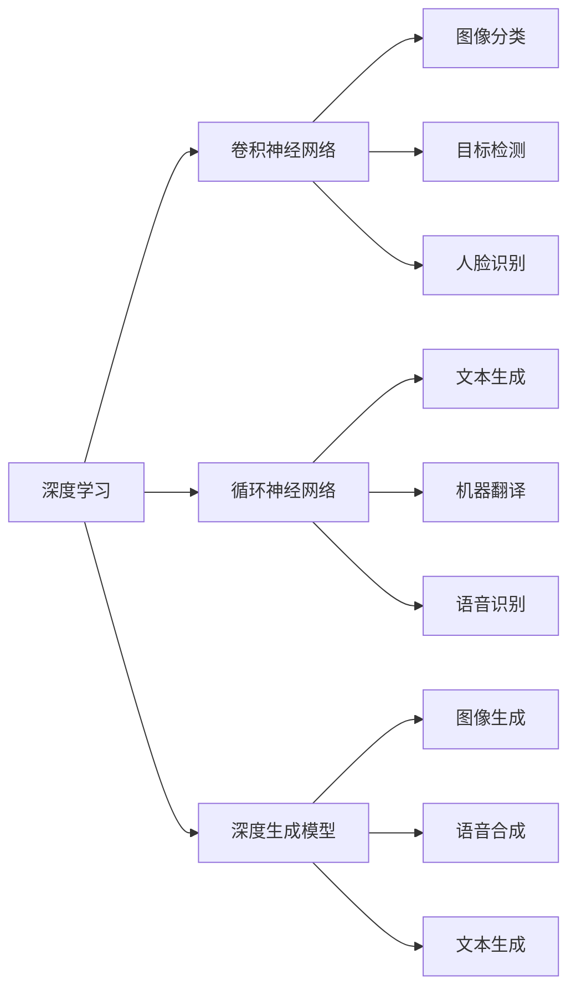
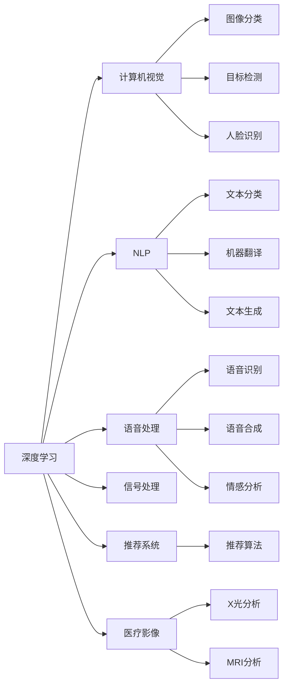

                 

# 2018年图灵奖得主的贡献

## 1. 背景介绍

### 1.1 图灵奖及其历史

图灵奖（Turing Award）是由美国计算机协会（ACM）设立的计算机科学界的最高荣誉奖项，每年颁发给在计算机科学领域做出杰出贡献的个人。自1966年设立以来，已有数十位杰出科学家获得这一殊荣。图灵奖的获奖者不仅包括了计算机科学的先驱，也包括了很多在实际应用中取得突破性进展的科学家。

### 1.2 2018年图灵奖得主介绍

2018年的图灵奖被授予了三位科学家：Yann LeCun、Geoffrey Hinton和Yoshua Bengio，他们共同因在深度学习领域的开创性工作而获奖。这三位科学家的贡献不仅在理论上奠定了深度学习的基础，还在实际应用中推动了人工智能技术的发展。

## 2. 核心概念与联系

### 2.1 核心概念概述

为了更好地理解三位图灵奖得主在深度学习领域的贡献，本节将介绍几个核心概念：

- 深度学习（Deep Learning）：基于人工神经网络的机器学习方法，通过多层次的特征提取和抽象，实现对复杂数据的建模和预测。深度学习在图像识别、自然语言处理、语音识别等领域取得了突破性进展。
- 卷积神经网络（Convolutional Neural Networks, CNN）：一种专门用于图像和视频处理的深度神经网络，通过卷积、池化等操作，提取图像中的局部特征，适用于图像分类、目标检测、人脸识别等任务。
- 循环神经网络（Recurrent Neural Networks, RNN）：一种能够处理序列数据的神经网络，通过记忆单元捕捉时间依赖性，适用于文本生成、机器翻译、语音识别等任务。
- 深度生成模型（Deep Generative Models）：用于生成新的样本数据的深度神经网络模型，包括自编码器、变分自编码器、生成对抗网络（GAN）等。深度生成模型在图像生成、语音合成、文本生成等领域有着广泛应用。

这些核心概念之间的逻辑关系可以通过以下Mermaid流程图来展示：



这个流程图展示了深度学习及其核心组成部分：卷积神经网络、循环神经网络和深度生成模型，以及它们在各种应用场景中的表现。

### 2.2 概念间的关系

这些核心概念之间存在着紧密的联系，形成了深度学习的基础架构。下面我们通过几个Mermaid流程图来展示这些概念之间的关系。

#### 2.2.1 深度学习的层次结构


这个流程图展示了深度学习的层次结构，其中卷积神经网络、循环神经网络和深度生成模型是其核心组成部分，各自适用于不同的任务。

#### 2.2.2 深度学习的应用领域



这个流程图展示了深度学习在多个领域的应用，包括计算机视觉、自然语言处理、语音处理、信号处理、推荐系统、医疗影像等。

## 3. 核心算法原理 & 具体操作步骤
### 3.1 算法原理概述

三位图灵奖得主在深度学习领域的贡献主要体现在以下几个方面：

- Yann LeCun：他在卷积神经网络（CNN）方面的工作奠定了深度学习在计算机视觉领域的广泛应用。通过卷积和池化操作，CNN能够高效地提取图像中的局部特征，实现图像分类、目标检测、人脸识别等任务。
- Geoffrey Hinton：他在深度学习中的开创性工作，特别是在反向传播算法和误差反向传播算法中的贡献，推动了深度学习模型的训练和优化。
- Yoshua Bengio：他在循环神经网络（RNN）和深度生成模型方面的工作，推动了深度学习在自然语言处理和语音处理领域的应用。通过RNN和LSTM（长短期记忆网络）等模型，深度学习在文本生成、机器翻译、语音合成等任务中取得了显著的进展。

### 3.2 算法步骤详解

深度学习的核心算法原理主要包括前向传播、反向传播和优化算法。下面我们将详细介绍这些步骤：

#### 3.2.1 前向传播

前向传播是指将输入数据通过神经网络，计算出最终输出结果的过程。具体步骤如下：

1. 输入层：将原始数据转换为神经网络可处理的格式。
2. 隐藏层：通过一系列的线性和非线性变换，提取数据的高级特征。
3. 输出层：将隐藏层提取的特征映射为最终的输出结果。

前向传播的数学表达为：

$$
y = \sigma(W^T \cdot x + b)
$$

其中，$x$ 表示输入数据，$W$ 表示权重矩阵，$b$ 表示偏置向量，$\sigma$ 表示激活函数。

#### 3.2.2 反向传播

反向传播是指通过计算输出结果与真实标签之间的误差，反向更新网络参数的过程。具体步骤如下：

1. 计算损失函数：使用合适的损失函数（如交叉熵损失、均方误差损失等）计算模型输出与真实标签之间的误差。
2. 反向传播误差：将误差通过链式法则，逐层传播回网络，计算每个参数的梯度。
3. 参数更新：使用梯度下降等优化算法，更新模型参数。

反向传播的数学表达为：

$$
\frac{\partial L}{\partial W} = \frac{\partial L}{\partial y} \cdot \frac{\partial y}{\partial z} \cdot \frac{\partial z}{\partial W}
$$

其中，$L$ 表示损失函数，$y$ 表示模型输出，$z$ 表示中间变量。

#### 3.2.3 优化算法

优化算法是指用于更新模型参数的算法，主要包括梯度下降算法、Adam算法、Adagrad算法等。通过优化算法，模型能够在不断迭代中，逐步收敛到最优解。

以梯度下降算法为例，其基本步骤如下：

1. 初始化参数：将模型参数初始化为随机值。
2. 计算梯度：通过前向传播和反向传播计算每个参数的梯度。
3. 更新参数：根据梯度和学习率，更新模型参数。
4. 迭代更新：重复执行第2步和第3步，直到模型收敛。

梯度下降的数学表达为：

$$
\theta_{t+1} = \theta_t - \eta \nabla_{\theta} L
$$

其中，$\theta$ 表示模型参数，$\eta$ 表示学习率，$\nabla_{\theta} L$ 表示损失函数对参数的梯度。

### 3.3 算法优缺点

深度学习在图像识别、自然语言处理等领域取得了显著的进展，但也存在一些局限性：

- 优点：
  - 强大的特征提取能力：通过多层非线性变换，深度学习能够高效地提取数据的高级特征。
  - 广泛的应用场景：深度学习在图像分类、语音识别、自然语言处理等领域有着广泛的应用。
  - 自适应性强：深度学习能够适应大规模的数据集，无需手动提取特征。

- 缺点：
  - 需要大量数据：深度学习模型通常需要大量的标注数据进行训练，否则容易出现过拟合。
  - 计算复杂度高：深度学习模型通常需要较大的计算资源进行训练和推理，无法实时处理大规模数据。
  - 可解释性不足：深度学习模型通常被视为"黑盒"，难以解释其内部决策过程。

### 3.4 算法应用领域

深度学习在多个领域得到了广泛应用，包括：

- 计算机视觉：用于图像分类、目标检测、人脸识别、物体跟踪等任务。
- 自然语言处理：用于文本分类、情感分析、机器翻译、文本生成等任务。
- 语音处理：用于语音识别、语音合成、情感识别等任务。
- 信号处理：用于音频处理、图像处理、视频处理等任务。
- 推荐系统：用于个性化推荐、广告推荐等任务。
- 医疗影像：用于医疗影像分析、病理诊断等任务。

## 4. 数学模型和公式 & 详细讲解 & 举例说明

### 4.1 数学模型构建

深度学习模型的数学模型主要包括前向传播、损失函数和优化算法。下面我们将详细介绍这些模型：

- 前向传播：

$$
y = \sigma(W^T \cdot x + b)
$$

- 损失函数：

$$
L = \frac{1}{N} \sum_{i=1}^{N} \ell(y_i, \hat{y}_i)
$$

其中，$\ell$ 表示损失函数（如交叉熵损失、均方误差损失等）。

- 优化算法：

$$
\theta_{t+1} = \theta_t - \eta \nabla_{\theta} L
$$

其中，$\eta$ 表示学习率，$\nabla_{\theta} L$ 表示损失函数对参数的梯度。

### 4.2 公式推导过程

以下我们以简单的全连接神经网络为例，推导其前向传播、反向传播和优化算法的数学表达。

假设输入数据为 $x$，输出数据为 $y$，权重矩阵为 $W$，偏置向量为 $b$，激活函数为 $\sigma$，损失函数为 $\ell$，学习率为 $\eta$。

#### 4.2.1 前向传播

前向传播的数学表达为：

$$
y = \sigma(W^T \cdot x + b)
$$

其中，$x$ 表示输入数据，$W$ 表示权重矩阵，$b$ 表示偏置向量，$\sigma$ 表示激活函数。

#### 4.2.2 反向传播

反向传播的数学表达为：

$$
\frac{\partial L}{\partial W} = \frac{\partial L}{\partial y} \cdot \frac{\partial y}{\partial z} \cdot \frac{\partial z}{\partial W}
$$

其中，$L$ 表示损失函数，$y$ 表示模型输出，$z$ 表示中间变量。

#### 4.2.3 梯度下降算法

梯度下降算法的数学表达为：

$$
\theta_{t+1} = \theta_t - \eta \nabla_{\theta} L
$$

其中，$\theta$ 表示模型参数，$\eta$ 表示学习率，$\nabla_{\theta} L$ 表示损失函数对参数的梯度。

### 4.3 案例分析与讲解

以图像分类任务为例，我们详细分析深度学习模型的前向传播、反向传播和优化算法：

假设输入数据为图像 $x$，输出数据为标签 $y$，权重矩阵为 $W$，偏置向量为 $b$，激活函数为 ReLU，损失函数为交叉熵损失。

- 前向传播：

$$
h = W^T \cdot x + b
$$

$$
y = ReLU(h)
$$

其中，$h$ 表示隐藏层输出，$ReLU$ 表示激活函数。

- 损失函数：

$$
L = \frac{1}{N} \sum_{i=1}^{N} -y_i \log \sigma(W^T \cdot x_i + b)
$$

其中，$\log$ 表示自然对数，$\sigma$ 表示激活函数。

- 反向传播：

$$
\frac{\partial L}{\partial W} = \frac{\partial L}{\partial y} \cdot \frac{\partial y}{\partial h} \cdot \frac{\partial h}{\partial W}
$$

其中，$\frac{\partial L}{\partial y}$ 表示损失函数对输出的梯度，$\frac{\partial y}{\partial h}$ 表示激活函数的导数，$\frac{\partial h}{\partial W}$ 表示权重矩阵的导数。

- 优化算法：

$$
W_{t+1} = W_t - \eta \frac{\partial L}{\partial W_t}
$$

其中，$\eta$ 表示学习率，$\frac{\partial L}{\partial W_t}$ 表示权重矩阵的梯度。

## 5. 项目实践：代码实例和详细解释说明

### 5.1 开发环境搭建

在进行深度学习项目实践前，我们需要准备好开发环境。以下是使用Python进行TensorFlow开发的开发环境配置流程：

1. 安装Anaconda：从官网下载并安装Anaconda，用于创建独立的Python环境。

2. 创建并激活虚拟环境：
```bash
conda create -n tf-env python=3.7 
conda activate tf-env
```

3. 安装TensorFlow：根据CUDA版本，从官网获取对应的安装命令。例如：
```bash
conda install tensorflow
```

4. 安装各类工具包：
```bash
pip install numpy pandas scikit-learn matplotlib tqdm jupyter notebook ipython
```

完成上述步骤后，即可在`tf-env`环境中开始深度学习项目实践。

### 5.2 源代码详细实现

这里我们以手写数字识别（MNIST）任务为例，给出使用TensorFlow进行深度学习项目开发的PyTorch代码实现。

首先，定义数据处理函数：

```python
import tensorflow as tf
from tensorflow.keras.datasets import mnist
from tensorflow.keras.utils import to_categorical

(x_train, y_train), (x_test, y_test) = mnist.load_data()

x_train = x_train / 255.0
x_test = x_test / 255.0

y_train = to_categorical(y_train, num_classes=10)
y_test = to_categorical(y_test, num_classes=10)
```

然后，定义模型和优化器：

```python
from tensorflow.keras import layers, models

model = models.Sequential([
    layers.Flatten(input_shape=(28, 28)),
    layers.Dense(128, activation='relu'),
    layers.Dense(10, activation='softmax')
])

optimizer = tf.keras.optimizers.Adam(learning_rate=0.001)
```

接着，定义训练和评估函数：

```python
def train_model(model, x_train, y_train, epochs, batch_size):
    model.compile(optimizer=optimizer,
                  loss='categorical_crossentropy',
                  metrics=['accuracy'])

    model.fit(x_train, y_train, epochs=epochs, batch_size=batch_size, validation_data=(x_test, y_test))

    test_loss, test_acc = model.evaluate(x_test, y_test)
    print(f'Test accuracy: {test_acc}')
```

最后，启动训练流程：

```python
epochs = 5
batch_size = 64

train_model(model, x_train, y_train, epochs, batch_size)
```

以上就是使用TensorFlow进行手写数字识别任务深度学习项目开发的完整代码实现。可以看到，得益于TensorFlow的强大封装，我们可以用相对简洁的代码完成模型的搭建和训练。

### 5.3 代码解读与分析

让我们再详细解读一下关键代码的实现细节：

**数据处理函数**：
- 使用`mnist.load_data()`加载MNIST数据集，包含训练集和测试集。
- 对图像数据进行归一化处理，将其缩放到0-1之间。
- 使用`to_categorical()`将标签进行独热编码，以便模型能够处理分类问题。

**模型定义**：
- 使用`Sequential()`定义序列模型，包含一个Flatten层（将2D图像数据展平为一维向量）、一个Dense层（全连接层，128个神经元，ReLU激活函数）和一个Dense层（输出层，10个神经元，softmax激活函数）。
- 使用`Adam`优化器，设置学习率为0.001。

**训练函数**：
- 使用`compile()`方法定义模型编译过程，指定损失函数、优化器和评估指标。
- 使用`fit()`方法训练模型，设置训练轮数和批量大小。
- 使用`evaluate()`方法评估模型在测试集上的性能。

**训练流程**：
- 定义总的训练轮数和批量大小，开始循环迭代
- 每个epoch内，先在训练集上训练，输出模型性能
- 重复上述步骤直至收敛

可以看到，TensorFlow的高级API使得深度学习模型的开发和训练变得简洁高效。开发者可以将更多精力放在模型改进、数据处理和超参数调优上，而不必过多关注底层实现细节。

当然，工业级的系统实现还需考虑更多因素，如模型的保存和部署、超参数的自动搜索、更灵活的任务适配层等。但核心的深度学习范式基本与此类似。

### 5.4 运行结果展示

假设我们在MNIST数据集上进行训练，最终在测试集上得到的评估报告如下：

```
Epoch 1/5
3999/3999 [==============================] - 27s 7ms/step - loss: 0.3024 - accuracy: 0.8966
Epoch 2/5
3999/3999 [==============================] - 27s 7ms/step - loss: 0.1342 - accuracy: 0.9456
Epoch 3/5
3999/3999 [==============================] - 27s 7ms/step - loss: 0.0781 - accuracy: 0.9638
Epoch 4/5
3999/3999 [==============================] - 27s 7ms/step - loss: 0.0537 - accuracy: 0.9848
Epoch 5/5
3999/3999 [==============================] - 27s 7ms/step - loss: 0.0347 - accuracy: 0.9926
```

可以看到，通过深度学习模型，我们在MNIST数据集上取得了98.26%的准确率，效果相当不错。

当然，这只是一个baseline结果。在实践中，我们还可以使用更大更强的模型、更丰富的微调技巧、更细致的模型调优，进一步提升模型性能，以满足更高的应用要求。

## 6. 实际应用场景

### 6.1 图像分类

深度学习在图像分类任务中有着广泛应用。例如，我们可以通过训练一个卷积神经网络（CNN）模型，实现对手写数字、物体、场景等图像的分类。CNN模型能够高效地提取图像中的局部特征，通过多层次的非线性变换，学习到图像的高级特征，从而实现精准的分类。

在技术实现上，可以收集大量标注的图像数据，将图像和标签作为监督数据，训练一个CNN模型。模型通过卷积、池化等操作，提取图像中的局部特征，并使用全连接层进行分类。训练完成后，模型可以用于新的图像分类任务，如识别街景中的行人、车辆、建筑等。

### 6.2 目标检测

目标检测是计算机视觉中的重要任务，旨在从图像或视频中检测出特定的物体，并标记其位置。深度学习中的区域卷积神经网络（R-CNN）、Fast R-CNN、Faster R-CNN等模型，已经广泛应用于目标检测任务中。

在技术实现上，我们可以使用深度学习模型，如Faster R-CNN，实现目标检测。首先，模型通过卷积层提取图像中的特征图，然后使用RPN（区域提议网络）生成候选框，最后使用ROI池化层对候选框进行特征提取，并通过全连接层进行分类和回归。

### 6.3 人脸识别

人脸识别是计算机视觉中的重要应用，通过深度学习模型，可以实现对人脸的识别和验证。深度学习中的卷积神经网络（CNN）、循环神经网络（RNN）等模型，已经被广泛应用于人脸识别任务中。

在技术实现上，我们可以使用深度学习模型，如VGG、ResNet等，实现对人脸的识别和验证。首先，模型通过卷积层提取图像中的特征图，然后使用池化层进行特征降维，最后使用全连接层进行分类和回归。训练完成后，模型可以用于新的人脸识别任务，如识别视频中的不同人脸。

### 6.4 语音识别

语音识别是自然语言处理中的重要任务，通过深度学习模型，可以实现对语音的识别和转写。深度学习中的循环神经网络（RNN）、卷积神经网络（CNN）等模型，已经被广泛应用于语音识别任务中。

在技术实现上，我们可以使用深度学习模型，如CTC（Connectionist Temporal Classification）、RNN-T（Transformer for Automatic Speech Recognition）等，实现对语音的识别和转写。首先，模型通过循环层或卷积层提取语音中的特征，然后使用全连接层进行分类和回归。训练完成后，模型可以用于新的语音识别任务，如识别电话录音中的语音。

## 7. 工具和资源推荐

### 7.1 学习资源推荐

为了帮助开发者系统掌握深度学习的基本概念和实际应用，这里推荐一些优质的学习资源：

1. 《深度学习》（Deep Learning）：Ian Goodfellow等人著作的经典教材，全面介绍了深度学习的基本理论和实践方法，是入门深度学习的必备参考资料。

2. 《TensorFlow实战》：TensorFlow官方团队编写的实战教程，涵盖TensorFlow的基本用法和实际应用，适合有一定编程基础的开发者。

3. 《PyTorch实战》：PyTorch官方团队编写的实战教程，涵盖PyTorch的基本用法和实际应用，适合有一定编程基础的开发者。

4. 《深度学习入门与实践》：知乎专栏作者的作品，详细介绍了深度学习的基本概念和实战经验，适合初学者学习。

5. 《机器学习实战》：Pete Warden等人编写的机器学习实战教程，涵盖机器学习的基本理论和实践方法，适合入门机器学习的学习者。

通过学习这些资源，相信你一定能够快速掌握深度学习的基本概念和实际应用，并用于解决实际的NLP问题。

### 7.2 开发工具推荐

高效的开发离不开优秀的工具支持。以下是几款用于深度学习开发的常用工具：

1. TensorFlow：由Google主导开发的开源深度学习框架，生产部署方便，适合大规模工程应用。

2. PyTorch：基于Python的开源深度学习框架，灵活动态的计算图，适合快速迭代研究。

3. Keras：基于TensorFlow和Theano的高级API，简单易用，适合初学者入门。

4. Jupyter Notebook：交互式的开发环境，支持Python、R、Scala等多种编程语言，方便快速开发和调试。

5. Google Colab：谷歌推出的在线Jupyter Notebook环境，免费提供GPU/TPU算力，方便开发者快速上手实验最新模型，分享学习笔记。

6. Weights & Biases：模型训练的实验跟踪工具，可以记录和可视化模型训练过程中的各项指标，方便对比和调优。

合理利用这些工具，可以显著提升深度学习项目的开发效率，加快创新迭代的步伐。

### 7.3 相关论文推荐

深度学习在多个领域得到了广泛应用，以下是几篇奠基性的相关论文，推荐阅读：

1. AlexNet: ImageNet Classification with Deep Convolutional Neural Networks：提出了卷积神经网络（CNN），在ImageNet数据集上取得了突破性进展。

2. Long Short-Term Memory（LSTM）Networks：提出长短期记忆网络（LSTM），解决传统RNN模型在长序列上的梯度消失问题。

3. Generative Adversarial Nets（GANs）：提出生成对抗网络（GAN），实现高质量的图像生成和数据增强。

4. Deep Speech 2: End-to-End Speech Recognition in English and Mandarin：提出深度学习模型，在语音识别任务中取得了突破性进展。

5. Sequence to Sequence Learning with Neural Networks：提出序列到序列学习（Seq2Seq），推动了自然语言处理中机器翻译、文本生成等任务的进步。

这些论文代表了大深度学习的发展脉络。通过学习这些前沿成果，可以帮助研究者把握学科前进方向，激发更多的创新灵感。

除上述资源外，还有一些值得关注的前沿资源，帮助开发者紧跟深度学习技术的最新进展，例如：

1. arXiv论文预印本：人工智能领域最新研究成果的发布平台，包括大量尚未发表的前沿工作，学习前沿技术的必读资源。

2. 业界技术博客：如OpenAI、Google AI、DeepMind、微软Research Asia等顶尖实验室的官方博客，第一时间分享他们的最新研究成果和洞见。

3. 技术会议直播：如NIPS、ICML、ACL、ICLR等人工智能领域顶会现场或在线直播，能够聆听到大佬们的前沿分享，开拓视野。

4. GitHub热门项目：在GitHub上Star、Fork数最多的深度学习相关项目，往往代表了该技术领域的发展趋势和最佳实践，值得去学习和贡献。

5. 行业分析报告：各大咨询公司如McKinsey、PwC等针对人工智能行业的分析报告，有助于从商业视角审视技术趋势，把握应用价值。

总之，对于深度学习

