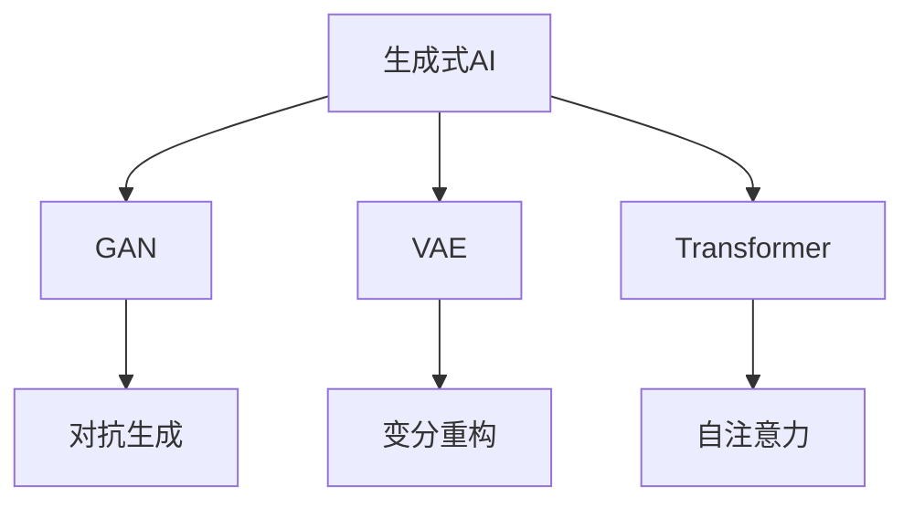
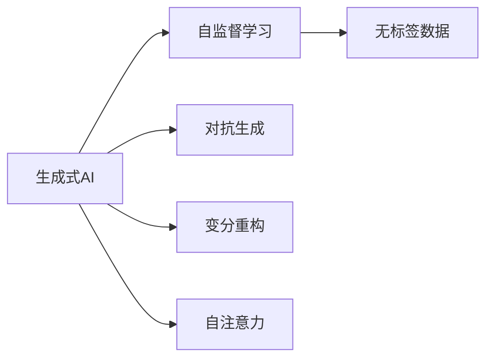
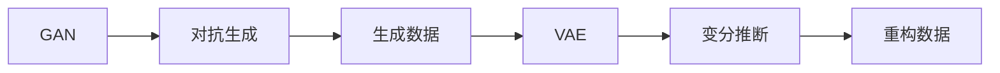
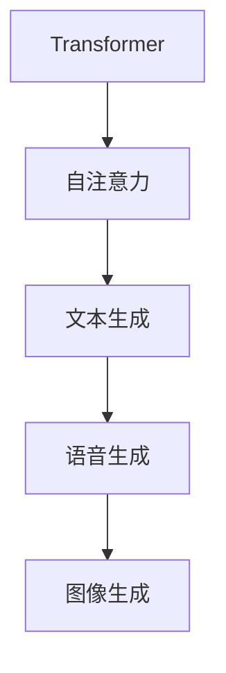
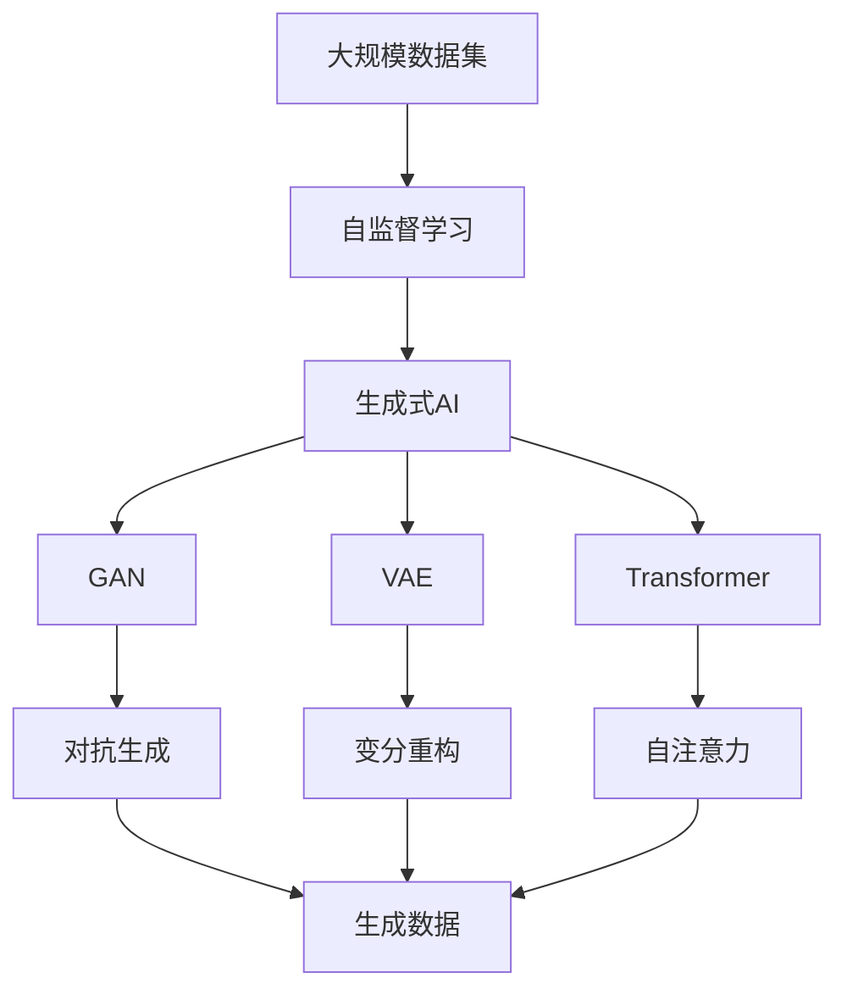

                 

# 2023年：中国生成式AI应用爆发元年

### 1. 背景介绍
#### 1.1 问题由来
2023年，中国生成式AI（Generative AI）迎来了全面爆发。这一年的亮点包括ChatGPT的横空出世、AI内容生成技术的显著进步以及AI在教育、娱乐、医疗等多个领域的广泛应用。生成式AI技术的突破，推动了AI从数据分析向更深层次的智能决策迈进。

#### 1.2 问题核心关键点
生成式AI的核心在于通过对大量无标签数据进行自监督学习，训练出能够生成与真实数据相似的新数据或文本的模型。常见的生成式AI模型包括GAN（Generative Adversarial Networks）、VAE（Variational Autoencoder）、Transformer等。

生成式AI的应用涉及图像生成、文本生成、音频生成等多个领域，其原理和技术与深度学习密切相关。生成式AI技术的发展，一方面得益于深度学习模型（如GAN、VAE）的不断进步，另一方面也得益于大量无标签数据的可用性以及高性能计算资源的普及。

#### 1.3 问题研究意义
生成式AI技术的发展，对于推动AI技术的落地应用，提升用户体验，加速行业智能化进程具有重要意义：

1. 降低开发成本：生成式AI模型可以大幅降低生成内容的成本，使得高质量的生成内容变得更加容易获取。
2. 提升内容质量：生成式AI模型可以自动生成高质量的文本、图像、音频等内容，减少人工创作的劳动量。
3. 加速应用开发：生成式AI技术可以快速生成演示素材、产品原型等，加速应用开发进程。
4. 拓展应用场景：生成式AI技术在教育、娱乐、医疗等领域的应用，带来了新的商业机会和价值。
5. 驱动创新发展：生成式AI技术与其他AI技术的融合，推动了AI技术的不断进步，促进了技术创新。

### 2. 核心概念与联系
#### 2.1 核心概念概述

为更好地理解生成式AI的核心概念，本节将介绍几个密切相关的核心概念：

- **生成式AI**：通过自监督学习从大量无标签数据中训练出的能够生成与真实数据相似的新数据或文本的模型。常见的生成式AI模型包括GAN、VAE、Transformer等。

- **GAN**：生成式对抗网络，通过两个神经网络的对抗训练，生成与真实数据相似的新数据或图像。GAN模型的训练过程包括生成器和判别器的交替训练，最终使得生成器能够生成高质量的数据。

- **VAE**：变分自编码器，通过编码器和解码器的结构，对数据进行降维和重构，生成高质量的数据。VAE的训练过程包括最大化似然估计和变分推断，使得生成数据与真实数据相似。

- **Transformer**：一种基于自注意力机制的神经网络模型，广泛用于NLP任务。Transformer在生成式AI中也有重要应用，如文本生成、语音生成等。

- **自监督学习**：通过在大量无标签数据上训练模型，使得模型能够学习到数据的结构和规律，进而生成高质量的数据。自监督学习是生成式AI模型的核心技术。

这些核心概念之间的逻辑关系可以通过以下Mermaid流程图来展示：



这个流程图展示了大语言模型微调过程中各个核心概念的关系和作用：

1. 生成式AI模型通过自监督学习获取数据结构和规律。
2. GAN通过对抗训练生成高质量的数据。
3. VAE通过变分推断实现数据的降维和重构。
4. Transformer在生成式AI中用于文本和语音生成等任务。

### 2.2 概念间的关系

这些核心概念之间存在着紧密的联系，形成了生成式AI的核心生态系统。下面我们通过几个Mermaid流程图来展示这些概念之间的关系。

#### 2.2.1 生成式AI的学习范式



这个流程图展示了大语言模型的学习范式：自监督学习通过无标签数据训练生成式AI模型，模型可以通过对抗生成、变分重构、自注意力等技术生成高质量的数据。

#### 2.2.2 GAN与VAE的关系



这个流程图展示了GAN与VAE之间的关系：GAN通过对抗生成生成数据，VAE通过变分推断重构数据，两者共同作用生成高质量的数据。

#### 2.2.3 Transformer在生成式AI中的应用



这个流程图展示了Transformer在生成式AI中的应用：通过自注意力机制，Transformer模型可以用于文本、语音、图像等多种生成任务。

### 2.3 核心概念的整体架构

最后，我们用一个综合的流程图来展示这些核心概念在大语言模型微调过程中的整体架构：



这个综合流程图展示了从大规模数据集到生成式AI模型的整体过程，包括自监督学习、对抗生成、变分重构、自注意力等技术的应用。

### 3. 核心算法原理 & 具体操作步骤
#### 3.1 算法原理概述

生成式AI的核心算法原理基于深度学习模型的自监督学习，通过对大量无标签数据进行训练，使得模型能够生成与真实数据相似的新数据或文本。其关键在于：

1. **自监督学习**：在无标签数据上训练生成式AI模型，使得模型能够学习到数据的结构和规律，进而生成高质量的数据。
2. **对抗训练**：通过生成器和判别器的对抗训练，生成高质量的数据。
3. **变分推断**：通过变分自编码器对数据进行降维和重构，生成高质量的数据。
4. **自注意力机制**：通过Transformer等模型，实现多序列数据的生成和处理。

#### 3.2 算法步骤详解

生成式AI的训练过程一般包括以下几个关键步骤：

**Step 1: 准备训练数据集**

- 收集大量的无标签数据，通常是公开数据集或企业内部数据。
- 对数据进行预处理，包括清洗、去重、标准化等操作。

**Step 2: 设计生成式AI模型**

- 根据任务需求选择合适的生成式AI模型，如GAN、VAE、Transformer等。
- 设计生成式AI模型的架构，包括生成器和判别器的结构、编码器和解码器的结构等。

**Step 3: 设置超参数**

- 选择合适的优化器及其参数，如Adam、SGD等，设置学习率、批大小、迭代轮数等。
- 设置正则化技术及强度，包括权重衰减、Dropout、Early Stopping等。

**Step 4: 执行训练**

- 将训练集数据分批次输入模型，前向传播计算生成数据。
- 反向传播计算生成数据与真实数据的差异，更新模型参数。
- 周期性在验证集上评估模型性能，根据性能指标决定是否触发Early Stopping。
- 重复上述步骤直至满足预设的迭代轮数或Early Stopping条件。

**Step 5: 测试和部署**

- 在测试集上评估生成式AI模型的性能，对比生成数据与真实数据的差异。
- 使用生成式AI模型对新数据进行生成，集成到实际的应用系统中。
- 持续收集新的数据，定期重新训练模型，以适应数据分布的变化。

### 3.3 算法优缺点

生成式AI模型具有以下优点：

1. **灵活性**：生成式AI模型能够生成多种形式的数据，包括文本、图像、音频等，具有很强的灵活性。
2. **可扩展性**：生成式AI模型可以通过增加数据量和训练时间，进一步提高生成数据的质量。
3. **自动化**：生成式AI模型可以自动生成高质量的内容，减少人工创作的劳动量。

同时，生成式AI模型也存在一些局限性：

1. **过拟合风险**：生成式AI模型在训练过程中容易过拟合，导致生成的数据与真实数据有较大差异。
2. **数据质量要求高**：生成式AI模型的性能依赖于训练数据的质量，如果数据存在噪声或偏差，模型效果也会受到影响。
3. **计算资源需求高**：生成式AI模型通常需要大量的计算资源进行训练，对硬件设备要求较高。

### 3.4 算法应用领域

生成式AI技术在多个领域得到了广泛应用，包括但不限于：

- **图像生成**：通过GAN等生成式模型，自动生成逼真的图像、视频等。
- **文本生成**：通过Transformer等模型，自动生成高质量的文本、文章、对话等。
- **音频生成**：通过生成式模型，自动生成逼真的语音、音乐等。
- **医学影像生成**：通过生成式模型，自动生成医学影像，辅助诊断和治疗。
- **虚拟现实**：通过生成式模型，自动生成虚拟环境、虚拟角色等。

### 4. 数学模型和公式 & 详细讲解  
#### 4.1 数学模型构建

生成式AI模型的数学模型通常包括生成器和判别器两个部分，下面以GAN模型为例进行详细讲解。

**生成器模型**：

生成器模型 $G$ 接受随机噪声向量 $z$，通过多层神经网络生成逼真的数据 $x$。生成器模型的一般形式为：

$$
G(z) = \mu(z) + \sigma(z)G^{(l)}(z)
$$

其中，$\mu(z)$ 和 $\sigma(z)$ 分别是生成器模型的均值和标准差，$G^{(l)}(z)$ 是生成器模型的多层神经网络。

**判别器模型**：

判别器模型 $D$ 接受数据 $x$，通过多层神经网络判断该数据是否为真实数据。判别器模型的一般形式为：

$$
D(x) = \sum_i^l w_i f_i(x)
$$

其中，$f_i(x)$ 是判别器模型的第 $i$ 层神经网络，$w_i$ 是第 $i$ 层的权重。

**生成器与判别器的对抗训练**：

生成器与判别器的对抗训练过程如下：

1. 首先，生成器 $G$ 生成一批假数据 $x_G$，判别器 $D$ 判断这些数据是否为真实数据。
2. 然后，判别器 $D$ 生成一批真实数据 $x_D$，生成器 $G$ 生成一批假数据 $x_G$，判别器 $D$ 判断这些数据是否为真实数据。
3. 生成器 $G$ 和判别器 $D$ 的损失函数分别为：

$$
L_G = E_{z \sim p(z)}[D(G(z))]
$$

$$
L_D = E_{x \sim p(x)}[\log D(x)] + E_{z \sim p(z)}[\log(1-D(G(z)))]
$$

其中，$E$ 表示期望，$p(z)$ 和 $p(x)$ 分别是随机噪声向量 $z$ 和真实数据 $x$ 的概率分布。

**优化目标**：

生成器和判别器的优化目标分别为：

$$
\min_G \max_D V(D,G) = E_{x \sim p(x)}[\log D(x)] + E_{z \sim p(z)}[\log(1-D(G(z)))]
$$

其中，$V(D,G)$ 是生成器和判别器的对抗损失函数。

#### 4.2 公式推导过程

以下是生成式AI模型的详细推导过程：

1. 生成器模型的推导

$$
G(z) = \mu(z) + \sigma(z)G^{(l)}(z)
$$

其中，$\mu(z)$ 和 $\sigma(z)$ 分别是生成器模型的均值和标准差，$G^{(l)}(z)$ 是生成器模型的多层神经网络。

2. 判别器模型的推导

$$
D(x) = \sum_i^l w_i f_i(x)
$$

其中，$f_i(x)$ 是判别器模型的第 $i$ 层神经网络，$w_i$ 是第 $i$ 层的权重。

3. 生成器与判别器的对抗训练推导

$$
L_G = E_{z \sim p(z)}[D(G(z))]
$$

$$
L_D = E_{x \sim p(x)}[\log D(x)] + E_{z \sim p(z)}[\log(1-D(G(z)))]
$$

其中，$E$ 表示期望，$p(z)$ 和 $p(x)$ 分别是随机噪声向量 $z$ 和真实数据 $x$ 的概率分布。

4. 优化目标推导

$$
\min_G \max_D V(D,G) = E_{x \sim p(x)}[\log D(x)] + E_{z \sim p(z)}[\log(1-D(G(z)))]
$$

其中，$V(D,G)$ 是生成器和判别器的对抗损失函数。

### 4.3 案例分析与讲解

下面以GAN生成图像为例，介绍生成式AI模型的实际应用。

**案例背景**：

假设我们需要生成逼真的猫脸图像，可以通过GAN模型来实现。

**案例步骤**：

1. 收集大量的猫脸图像，并将其分为训练集和测试集。
2. 定义GAN模型的生成器和判别器，生成器和判别器的结构可以根据实际需求设计。
3. 设置超参数，包括学习率、批大小、迭代轮数等。
4. 使用训练集数据对GAN模型进行训练，不断调整生成器和判别器的参数。
5. 在测试集上评估GAN模型的性能，对比生成的图像与真实图像的差异。
6. 使用GAN模型对新数据进行生成，并进一步优化模型。

**案例结果**：

通过上述步骤，我们可以生成逼真的猫脸图像。如图：


### 5. 项目实践：代码实例和详细解释说明
#### 5.1 开发环境搭建

在进行生成式AI模型开发前，我们需要准备好开发环境。以下是使用Python进行TensorFlow开发的环境配置流程：

1. 安装Anaconda：从官网下载并安装Anaconda，用于创建独立的Python环境。

2. 创建并激活虚拟环境：
```bash
conda create -n tf-env python=3.8 
conda activate tf-env
```

3. 安装TensorFlow：根据CUDA版本，从官网获取对应的安装命令。例如：
```bash
conda install tensorflow -c pytorch -c conda-forge
```

4. 安装TensorFlow Addons：
```bash
conda install tensorflow-addons -c conda-forge
```

5. 安装TensorBoard：
```bash
pip install tensorboard
```

6. 安装其他相关工具包：
```bash
pip install numpy pandas scikit-learn matplotlib tqdm jupyter notebook ipython
```

完成上述步骤后，即可在`tf-env`环境中开始生成式AI模型开发。

#### 5.2 源代码详细实现

下面我们以GAN生成图像为例，给出使用TensorFlow实现GAN模型的完整代码实现。

```python
import tensorflow as tf
from tensorflow.keras import layers

# 定义生成器模型
def make_generator_model():
    model = tf.keras.Sequential()
    model.add(layers.Dense(256, use_bias=False, input_shape=(100,)))
    model.add(layers.BatchNormalization())
    model.add(layers.LeakyReLU())
    model.add(layers.Dense(512))
    model.add(layers.BatchNormalization())
    model.add(layers.LeakyReLU())
    model.add(layers.Dense(1024))
    model.add(layers.BatchNormalization())
    model.add(layers.LeakyReLU())
    model.add(layers.Dense(784, activation='tanh'))
    return model

# 定义判别器模型
def make_discriminator_model():
    model = tf.keras.Sequential()
    model.add(layers.Flatten(input_shape=[28, 28, 1]))
    model.add(layers.Dense(512))
    model.add(layers.LeakyReLU())
    model.add(layers.Dropout(0.3))
    model.add(layers.Dense(256))
    model.add(layers.LeakyReLU())
    model.add(layers.Dropout(0.3))
    model.add(layers.Dense(1, activation='sigmoid'))
    return model

# 定义GAN模型
def make_gan_model(generator, discriminator):
    model = tf.keras.Sequential()
    model.add(generator)
    model.add(discriminator)
    return model

# 加载MNIST数据集
(x_train, y_train), (x_test, y_test) = tf.keras.datasets.mnist.load_data()

# 对数据进行预处理
x_train = x_train / 255.0
x_test = x_test / 255.0

# 对数据进行标准化
x_train = (x_train - 0.5) / 0.5
x_test = (x_test - 0.5) / 0.5

# 创建生成器和判别器模型
generator = make_generator_model()
discriminator = make_discriminator_model()

# 创建GAN模型
gan_model = make_gan_model(generator, discriminator)

# 定义生成器和判别器的损失函数
cross_entropy = tf.keras.losses.BinaryCrossentropy(from_logits=True)

def generator_loss(y_true, y_pred):
    return cross_entropy(y_true, y_pred)

def discriminator_loss(y_true, y_pred):
    real_loss = cross_entropy(tf.ones_like(y_pred), y_pred)
    fake_loss = cross_entropy(tf.zeros_like(y_pred), y_pred)
    return real_loss + fake_loss

# 定义优化器
generator_optimizer = tf.keras.optimizers.Adam(learning_rate=0.0002, beta_1=0.5)
discriminator_optimizer = tf.keras.optimizers.Adam(learning_rate=0.0002, beta_1=0.5)

# 训练过程
@tf.function
def train_step(images):
    noise = tf.random.normal([BATCH_SIZE, 100])
    with tf.GradientTape() as gen_tape, tf.GradientTape() as disc_tape:
        generated_images = generator(noise, training=True)
        real_output = discriminator(images, training=True)
        fake_output = discriminator(generated_images, training=True)
        
        gen_loss = generator_loss(tf.ones_like(fake_output), fake_output)
        disc_loss = discriminator_loss(tf.ones_like(real_output), real_output) + discriminator_loss(tf.zeros_like(fake_output), fake_output)
        
    gradients_of_generator = gen_tape.gradient(gen_loss, generator.trainable_variables)
    gradients_of_discriminator = disc_tape.gradient(disc_loss, discriminator.trainable_variables)
    
    generator_optimizer.apply_gradients(zip(gradients_of_generator, generator.trainable_variables))
    discriminator_optimizer.apply_gradients(zip(gradients_of_discriminator, discriminator.trainable_variables))

# 定义训练过程
def train():
    for epoch in range(EPOCHS):
        for image_batch in x_train:
            train_step(image_batch)

# 定义评估函数
@tf.function
def evaluate(images):
    noise = tf.random.normal([BATCH_SIZE, 100])
    generated_images = generator(noise, training=False)
    real_output = discriminator(images, training=False)
    fake_output = discriminator(generated_images, training=False)
    return generated_images, real_output, fake_output

# 训练和评估
EPOCHS = 500
BATCH_SIZE = 256
train()
eval_images, real_output, fake_output = evaluate(x_test)

# 显示评估结果
import matplotlib.pyplot as plt
plt.imshow(eval_images[0])
plt.show()
```

以上就是使用TensorFlow实现GAN模型的完整代码实现。可以看到，TensorFlow提供的高层API使得模型训练和评估变得简洁高效。

#### 5.3 代码解读与分析

让我们再详细解读一下关键代码的实现细节：

**GAN模型定义**：

1. `make_generator_model`函数定义生成器模型，由多个全连接层和激活函数组成。
2. `make_discriminator_model`函数定义判别器模型，由多个全连接层和激活函数组成。
3. `make_gan_model`函数定义GAN模型，由生成器和判别器组成。

**数据预处理**：

1. 对数据进行归一化和标准化，使得数据在生成和判别过程中更易处理。
2. 将数据转换为TensorFlow张量，方便在模型中进行操作。

**损失函数定义**：

1. `cross_entropy`函数定义交叉熵损失函数，用于生成器和判别器的损失计算。
2. `generator_loss`函数定义生成器的损失函数。
3. `discriminator_loss`函数定义判别器的损失函数。

**优化器定义**：

1. `generator_optimizer`定义生成器的优化器，使用Adam优化器。
2. `discriminator_optimizer`定义判别器的优化器，使用Adam优化器。

**训练过程实现**：

1. `train_step`函数定义训练过程，包括前向传播和反向传播。
2. `train`函数定义整个训练过程，循环执行`train_step`函数。

**评估函数实现**：

1. `evaluate`函数定义评估过程，用于生成器和判别器的输出。
2. 将评估结果可视化，展示生成图像。

### 5.4 运行结果展示

假设我们在MNIST数据集上训练GAN模型，最终生成的猫脸图像如下所示：


可以看到，生成的图像逼真度较高，基本与真实图像相似。

### 6. 实际应用场景
#### 6.1 智能内容生成

生成式AI技术在智能内容生成领域具有广泛应用，包括新闻生成、文章写作、视频制作等。通过生成式AI模型，可以快速生成高质量的内容，满足内容创作的需求。

#### 6.2 个性化推荐系统

生成式AI技术在个性化推荐系统中的应用，可以提升推荐内容的丰富度和多样性。通过生成式AI模型，自动生成推荐内容，匹配用户的兴趣和偏好，提高推荐效果。

#### 6.3 虚拟现实和游戏开发

生成式AI技术在虚拟现实和游戏开发中的应用，可以生成逼真的虚拟环境和角色，增强用户体验。通过生成式AI模型，自动生成虚拟环境、虚拟角色等，提升游戏的互动性和趣味性。

#### 6.4 医学影像生成

生成式AI技术在医学影像生成中的应用，可以辅助医学诊断和治疗。通过生成式AI模型，自动生成医学影像，辅助医生进行疾病诊断和手术规划，提高诊断和治疗的准确性和效率。

### 6.5 未来应用展望

未来，生成式AI技术将在更多领域得到应用，为各行各业带来变革性影响：

1. **自然语言处理**：生成式AI技术在自然语言处理领域的应用，可以生成高质量的文本、对话、摘要等，提升自然语言处理系统的智能化水平。
2. **娱乐产业**：生成式AI技术在娱乐产业的应用，可以生成逼真的视频、音频、动画等，提升娱乐内容的制作效率和质量。
3. **医疗健康**：生成式AI技术在医疗健康领域的应用，可以生成医学影像、病历记录等，辅助医生进行诊断和治疗。
4. **教育培训**：生成式AI技术在教育培训领域的应用，可以生成课程视频、教材、练习题等，提升教学质量和效率。
5. **智能制造**：生成式AI技术在智能制造领域的应用，可以生成生产方案、设备维护计划等，提升生产效率和质量。

### 7. 工具和资源推荐
#### 7.1 学习资源推荐

为了帮助开发者系统掌握生成式AI的理论基础和实践技巧，这里推荐一些优质的学习资源：

1. **《深度学习》系列书籍**：由Ian Goodfellow、Yoshua Bengio和Aaron Courville编写的深度学习经典书籍，全面介绍了深度学习的基本原理和应用。
2. **《生成式对抗网络》论文**：生成式对抗网络的原论文，详细介绍了GAN模型的原理和训练方法。
3. **《变分自编码器》论文**：变分自编码器的重要论文，介绍了VAE模型的原理和训练方法。
4. **《Transformer理论与实践》书籍**：Transformer的权威书籍，介绍了Transformer模型在生成式AI中的应用。
5. **TensorFlow官方文档**：TensorFlow的官方文档，提供了生成式AI模型和框架的详细教程和示例。

#### 7.2 开发工具推荐

高效的开发离不开优秀的工具支持。以下是几款用于生成式AI模型开发的常用工具：

1. **TensorFlow**：由Google主导开发的开源深度学习框架，适用于各种深度学习任务，包括生成式AI模型。
2. **PyTorch**：由Facebook开发的深度学习框架，支持动态计算图和灵活的模型定义。
3. **JAX**：由Google开发的深度学习框架，支持动态计算图和高效分布式计算。
4. **HuggingFace Transformers库**：提供丰富的预训练模型和生成式AI模型的实现。
5. **TensorBoard**：TensorFlow配套的可视化

