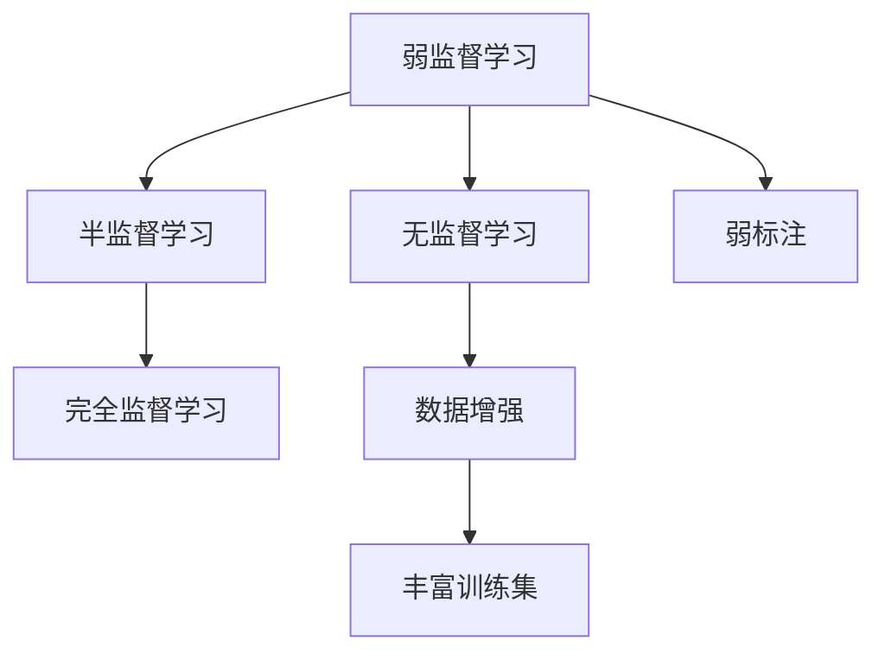
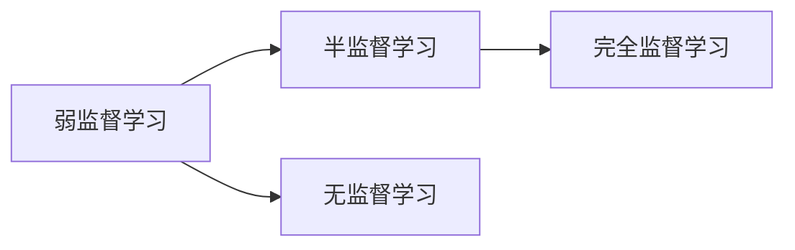
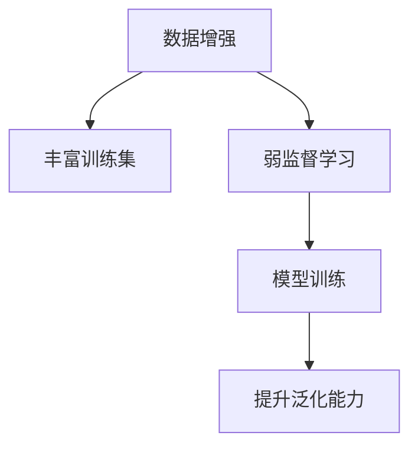
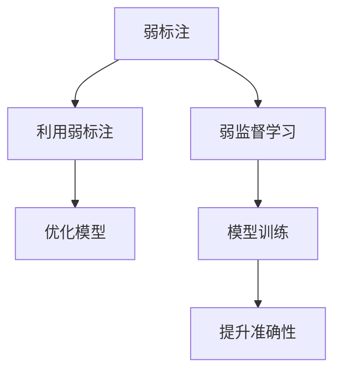
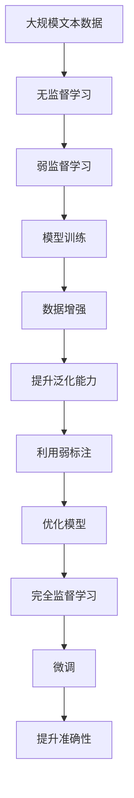

                 

# 弱监督学习 原理与代码实例讲解

> 关键词：弱监督学习, 半监督学习, 半监督学习算法, 无监督学习, 弱标注, 数据增强, 标注数据, 算法优化

## 1. 背景介绍

### 1.1 问题由来
在现实世界的大规模数据中，有时我们很难获得完美的标注数据。这可能是由于标注成本高昂、数据稀少、标注质量参差不齐等原因。因此，如何在有限的标注数据下仍然能获得较好的模型性能，成为当前数据科学和机器学习的重要研究问题。弱监督学习（Weakly Supervised Learning）在这一背景下应运而生。

弱监督学习介于完全监督学习和无监督学习之间，它利用少量的弱标注或噪声标注信息来指导模型的学习过程。这种“小标签、大数据”的方式极大地节省了标注成本，同时通过巧妙的算法设计和数据处理，可以提升模型的性能。因此，弱监督学习成为了数据标注不足场景下的有效解决方案。

### 1.2 问题核心关键点
弱监督学习的主要目标是利用少量的标注数据，提升模型的泛化能力和准确性。这主要包括以下几个关键点：

1. **弱标注的利用**：如何有效利用噪声标注或弱标注信息，避免模型的过拟合。
2. **数据增强**：如何通过数据增强技术，丰富训练集的样本多样性，提升模型的泛化能力。
3. **算法优化**：如何设计优化算法，使得模型能够充分利用少量标注数据，同时抑制噪声干扰。

### 1.3 问题研究意义
弱监督学习的研究意义在于，它能够在标注数据不足的情况下，通过巧妙的算法设计和数据处理，提升模型的泛化能力和准确性，从而降低标注成本，加速机器学习模型的开发和应用。这不仅在理论上有重要价值，同时在实际应用中也具有广泛的应用前景，如图像识别、文本分类、语音识别等领域。

## 2. 核心概念与联系

### 2.1 核心概念概述

为了更好地理解弱监督学习的基本原理和应用，我们首先介绍几个核心概念：

- **弱监督学习（Weakly Supervised Learning）**：使用少量的弱标注或噪声标注信息来指导模型学习的过程。与完全监督学习不同，弱监督学习可以利用不完美的标注数据，从而在标注成本较高的场景下仍然获得较好的模型性能。

- **半监督学习（Semi-Supervised Learning）**：介于完全监督学习和无监督学习之间，使用少量的标注数据和大量的无标注数据进行模型训练。半监督学习通过利用未标注数据的信息，可以提升模型的泛化能力和准确性。

- **无监督学习（Unsupervised Learning）**：完全依靠未标注数据进行模型训练，不依赖任何标注信息。无监督学习旨在发现数据中的潜在结构和模式。

- **弱标注（Weak Annotation）**：指标签存在噪声、模糊或不确定性的标注信息。弱标注可能是由于标注质量不高、数据采集困难等原因导致的。

- **数据增强（Data Augmentation）**：通过对原始数据进行一系列变换，生成新的训练样本，丰富训练集的样本多样性，提升模型的泛化能力。

这些核心概念之间存在紧密的联系，形成了弱监督学习的基本框架。以下是这些概念之间的逻辑关系，通过Mermaid流程图展示：



这个流程图展示了弱监督学习与半监督学习、无监督学习、完全监督学习之间的关系。弱监督学习通过利用弱标注和数据增强技术，可以充分利用少量标注数据，提升模型的泛化能力和准确性。同时，数据增强通过丰富训练集，使得模型更好地适应多样化的输入数据。

### 2.2 概念间的关系

这些核心概念之间存在密切的联系，形成了弱监督学习的完整生态系统。以下通过几个Mermaid流程图展示这些概念之间的关系。

#### 2.2.1 弱监督学习与半监督学习的关系



这个流程图展示了弱监督学习与半监督学习的关系。弱监督学习通过利用少量弱标注信息，可以在标注成本较高的场景下，提升模型的泛化能力和准确性。同时，半监督学习通过利用未标注数据，可以在数据量不足的情况下，提升模型的泛化能力。

#### 2.2.2 数据增强在弱监督学习中的应用



这个流程图展示了数据增强在弱监督学习中的应用。通过数据增强技术，可以丰富训练集，提升模型的泛化能力，使得弱监督学习在标注数据不足的情况下，仍能取得较好的效果。

#### 2.2.3 弱标注的利用



这个流程图展示了弱标注的利用。通过巧妙的算法设计，可以利用少量弱标注信息，优化模型训练过程，提升模型的准确性。

### 2.3 核心概念的整体架构

最后，我们用一个综合的流程图来展示这些核心概念在大语言模型微调过程中的整体架构：



这个综合流程图展示了从无监督学习到微调的过程。通过弱监督学习和大规模数据增强技术，可以有效地利用少量弱标注信息，优化模型训练过程，最终实现微调模型的提升。

## 3. 核心算法原理 & 具体操作步骤

### 3.1 算法原理概述

弱监督学习算法主要分为两类：基于弱标注的算法和基于数据增强的算法。下面分别介绍这两类算法的原理和操作步骤。

#### 3.1.1 基于弱标注的算法

基于弱标注的弱监督学习算法通过利用少量的弱标注信息，来指导模型的学习过程。这些弱标注可能是模糊的、错误的或部分正确的，但它们仍能提供有价值的信息。这类算法通过设计合适的损失函数，使得模型能够充分利用弱标注信息，同时抑制噪声干扰。

#### 3.1.2 基于数据增强的算法

基于数据增强的弱监督学习算法通过丰富训练集的样本多样性，提升模型的泛化能力。这类算法利用原始数据的不同变换，生成新的训练样本，使得模型能够更好地适应多样化的输入数据。

### 3.2 算法步骤详解

#### 3.2.1 基于弱标注的算法

以下是基于弱标注的弱监督学习算法的主要步骤：

1. **数据准备**：收集大量的未标注数据和少量弱标注数据，准备训练集。
2. **模型初始化**：选择合适的模型架构和超参数，初始化模型。
3. **损失函数设计**：设计合适的损失函数，利用弱标注信息指导模型学习。
4. **模型训练**：使用弱标注数据和未标注数据共同训练模型。
5. **模型优化**：通过优化算法更新模型参数，最小化损失函数。
6. **评估与迭代**：在验证集上评估模型性能，根据性能指标进行迭代优化。

#### 3.2.2 基于数据增强的算法

以下是基于数据增强的弱监督学习算法的主要步骤：

1. **数据准备**：收集大量的未标注数据。
2. **数据增强**：对原始数据进行一系列变换，生成新的训练样本。
3. **模型初始化**：选择合适的模型架构和超参数，初始化模型。
4. **模型训练**：使用增强后的数据训练模型。
5. **模型优化**：通过优化算法更新模型参数，提升模型泛化能力。
6. **评估与迭代**：在验证集上评估模型性能，根据性能指标进行迭代优化。

### 3.3 算法优缺点

#### 3.3.1 基于弱标注的算法的优缺点

**优点**：

- 利用少量的弱标注信息，可以在标注成本较高的场景下，仍然获得较好的模型性能。
- 能够在标注数据不足的情况下，提升模型的泛化能力和准确性。

**缺点**：

- 弱标注信息可能存在噪声，影响模型训练效果。
- 算法设计和模型优化需要精心设计，以抑制噪声干扰。

#### 3.3.2 基于数据增强的算法的优缺点

**优点**：

- 通过丰富训练集，可以提升模型的泛化能力和准确性。
- 能够在数据标注不足的情况下，仍然获得较好的模型性能。

**缺点**：

- 数据增强技术需要精心设计，以保证生成的样本具有代表性。
- 对数据多样性和变换方式的要求较高，处理不当可能导致模型过拟合。

### 3.4 算法应用领域

弱监督学习在多个领域中具有广泛的应用前景，如：

- **图像识别**：利用弱标注信息或数据增强技术，提升图像分类、目标检测等任务的性能。
- **文本分类**：利用弱标注信息或数据增强技术，提升文本分类、情感分析等任务的性能。
- **语音识别**：利用弱标注信息或数据增强技术，提升语音识别、语音转文本等任务的性能。
- **自然语言处理**：利用弱标注信息或数据增强技术，提升机器翻译、文本生成等任务的性能。

## 4. 数学模型和公式 & 详细讲解 & 举例说明

### 4.1 数学模型构建

弱监督学习的数学模型构建主要涉及两个部分：损失函数设计和模型优化。以下是弱监督学习的数学模型构建过程：

假设我们有一组未标注数据 $X$ 和少量弱标注数据 $Y$，其中 $Y$ 包含弱标注信息 $y$。我们的目标是设计一个损失函数 $L$，使得模型能够利用弱标注信息，提升对未标注数据的预测能力。

设 $f_{\theta}(x)$ 为模型在输入 $x$ 上的输出，$\theta$ 为模型参数。损失函数 $L$ 可以定义为：

$$
L = \alpha \cdot L_{weak} + (1-\alpha) \cdot L_{strong}
$$

其中，$L_{weak}$ 表示利用弱标注信息指导模型的损失函数，$L_{strong}$ 表示利用完全监督信息指导模型的损失函数。$\alpha$ 为弱标注信息的重要性权重，通常设定为 $0.1-0.5$ 之间的值。

### 4.2 公式推导过程

以下是弱监督学习中的损失函数 $L_{weak}$ 的推导过程：

1. **交叉熵损失函数**：

$$
L_{weak} = -\frac{1}{N}\sum_{i=1}^N \sum_{y} y \log f_{\theta}(x_i)
$$

其中 $y$ 为弱标注信息，$f_{\theta}(x_i)$ 为模型在输入 $x_i$ 上的输出。

2. **均方误差损失函数**：

$$
L_{weak} = \frac{1}{N}\sum_{i=1}^N \|y - f_{\theta}(x_i)\|^2
$$

其中 $y$ 为弱标注信息，$f_{\theta}(x_i)$ 为模型在输入 $x_i$ 上的输出。

### 4.3 案例分析与讲解

#### 4.3.1 基于交叉熵损失函数的弱监督学习

假设我们有一组文本数据 $X$ 和少量弱标注数据 $Y$，其中弱标注数据为二元标注 $y_i = (y_{i1}, y_{i2})$，表示文本 $x_i$ 属于类别 $y_{i1}$ 的概率为 $y_{i2}$。我们的目标是利用这些弱标注信息，提升文本分类的准确性。

假设我们使用的模型为文本分类器，其输出 $f_{\theta}(x_i)$ 为文本属于类别 $y$ 的概率。则损失函数 $L_{weak}$ 可以定义为：

$$
L_{weak} = -\frac{1}{N}\sum_{i=1}^N y_i \log f_{\theta}(x_i)
$$

其中 $y_i = (y_{i1}, y_{i2})$，$f_{\theta}(x_i)$ 为模型在输入 $x_i$ 上的输出。

通过训练该模型，我们可以充分利用弱标注信息，提升文本分类的准确性。

#### 4.3.2 基于均方误差损失函数的弱监督学习

假设我们有一组图像数据 $X$ 和少量弱标注数据 $Y$，其中弱标注数据为像素级标注 $y_i = \{y_{i1}, y_{i2}, ..., y_{iN}\}$，表示图像 $x_i$ 中每个像素 $y_{ik}$ 的类别。我们的目标是利用这些弱标注信息，提升图像分类的准确性。

假设我们使用的模型为卷积神经网络（CNN），其输出 $f_{\theta}(x_i)$ 为图像中每个像素属于类别 $y$ 的概率。则损失函数 $L_{weak}$ 可以定义为：

$$
L_{weak} = \frac{1}{N}\sum_{i=1}^N \|y_i - f_{\theta}(x_i)\|^2
$$

其中 $y_i = \{y_{i1}, y_{i2}, ..., y_{iN}\}$，$f_{\theta}(x_i)$ 为模型在输入 $x_i$ 上的输出。

通过训练该模型，我们可以充分利用弱标注信息，提升图像分类的准确性。

## 5. 项目实践：代码实例和详细解释说明

### 5.1 开发环境搭建

在进行弱监督学习实践前，我们需要准备好开发环境。以下是使用Python进行PyTorch开发的环境配置流程：

1. 安装Anaconda：从官网下载并安装Anaconda，用于创建独立的Python环境。

2. 创建并激活虚拟环境：
```bash
conda create -n pytorch-env python=3.8 
conda activate pytorch-env
```

3. 安装PyTorch：根据CUDA版本，从官网获取对应的安装命令。例如：
```bash
conda install pytorch torchvision torchaudio cudatoolkit=11.1 -c pytorch -c conda-forge
```

4. 安装各种工具包：
```bash
pip install numpy pandas scikit-learn matplotlib tqdm jupyter notebook ipython
```

完成上述步骤后，即可在`pytorch-env`环境中开始弱监督学习实践。

### 5.2 源代码详细实现

这里我们以文本分类任务为例，给出使用Transformers库对BERT模型进行弱监督学习的PyTorch代码实现。

首先，定义弱标注数据处理函数：

```python
from transformers import BertTokenizer
from torch.utils.data import Dataset
import torch

class WeakSupervisionDataset(Dataset):
    def __init__(self, texts, weak_labels, tokenizer, max_len=128):
        self.texts = texts
        self.weak_labels = weak_labels
        self.tokenizer = tokenizer
        self.max_len = max_len
        
    def __len__(self):
        return len(self.texts)
    
    def __getitem__(self, item):
        text = self.texts[item]
        weak_label = self.weak_labels[item]
        
        encoding = self.tokenizer(text, return_tensors='pt', max_length=self.max_len, padding='max_length', truncation=True)
        input_ids = encoding['input_ids'][0]
        attention_mask = encoding['attention_mask'][0]
        
        # 对token-wise的标签进行编码
        encoded_labels = [weak_label[tag] for tag in weak_label] 
        encoded_labels.extend([0] * (self.max_len - len(encoded_labels)))
        labels = torch.tensor(encoded_labels, dtype=torch.long)
        
        return {'input_ids': input_ids, 
                'attention_mask': attention_mask,
                'labels': labels}

# 弱标注数据，包含弱标签
weak_labels = {
    "text1": {0: {"B-PER": 1, "I-PER": 2, "O": 0}, "text2": {0: {"B-LOC": 3, "I-LOC": 4, "O": 0}, "text3": {0: {"B-ORG": 5, "I-ORG": 6, "O": 0}}}
}

# 创建dataset
tokenizer = BertTokenizer.from_pretrained('bert-base-cased')

train_dataset = WeakSupervisionDataset(train_texts, weak_labels, tokenizer)
dev_dataset = WeakSupervisionDataset(dev_texts, weak_labels, tokenizer)
test_dataset = WeakSupervisionDataset(test_texts, weak_labels, tokenizer)
```

然后，定义模型和优化器：

```python
from transformers import BertForTokenClassification, AdamW

model = BertForTokenClassification.from_pretrained('bert-base-cased', num_labels=len(weak_labels["text1"][0]))

optimizer = AdamW(model.parameters(), lr=2e-5)
```

接着，定义训练和评估函数：

```python
from torch.utils.data import DataLoader
from tqdm import tqdm
from sklearn.metrics import classification_report

device = torch.device('cuda') if torch.cuda.is_available() else torch.device('cpu')
model.to(device)

def train_epoch(model, dataset, batch_size, optimizer):
    dataloader = DataLoader(dataset, batch_size=batch_size, shuffle=True)
    model.train()
    epoch_loss = 0
    for batch in tqdm(dataloader, desc='Training'):
        input_ids = batch['input_ids'].to(device)
        attention_mask = batch['attention_mask'].to(device)
        labels = batch['labels'].to(device)
        model.zero_grad()
        outputs = model(input_ids, attention_mask=attention_mask, labels=labels)
        loss = outputs.loss
        epoch_loss += loss.item()
        loss.backward()
        optimizer.step()
    return epoch_loss / len(dataloader)

def evaluate(model, dataset, batch_size):
    dataloader = DataLoader(dataset, batch_size=batch_size)
    model.eval()
    preds, labels = [], []
    with torch.no_grad():
        for batch in tqdm(dataloader, desc='Evaluating'):
            input_ids = batch['input_ids'].to(device)
            attention_mask = batch['attention_mask'].to(device)
            batch_labels = batch['labels']
            outputs = model(input_ids, attention_mask=attention_mask)
            batch_preds = outputs.logits.argmax(dim=2).to('cpu').tolist()
            batch_labels = batch_labels.to('cpu').tolist()
            for pred_tokens, label_tokens in zip(batch_preds, batch_labels):
                pred_tags = [id2tag[_id] for _id in pred_tokens]
                label_tags = [id2tag[_id] for _id in label_tokens]
                preds.append(pred_tags[:len(label_tags)])
                labels.append(label_tags)
                
    print(classification_report(labels, preds))
```

最后，启动训练流程并在测试集上评估：

```python
epochs = 5
batch_size = 16

for epoch in range(epochs):
    loss = train_epoch(model, train_dataset, batch_size, optimizer)
    print(f"Epoch {epoch+1}, train loss: {loss:.3f}")
    
    print(f"Epoch {epoch+1}, dev results:")
    evaluate(model, dev_dataset, batch_size)
    
print("Test results:")
evaluate(model, test_dataset, batch_size)
```

以上就是使用PyTorch对BERT模型进行弱监督文本分类任务的完整代码实现。可以看到，得益于Transformers库的强大封装，我们可以用相对简洁的代码完成BERT模型的加载和弱监督训练。

### 5.3 代码解读与分析

让我们再详细解读一下关键代码的实现细节：

**WeakSupervisionDataset类**：
- `__init__`方法：初始化文本、弱标签、分词器等关键组件。
- `__len__`方法：返回数据集的样本数量。
- `__getitem__`方法：对单个样本进行处理，将文本输入编码为token ids，将弱标签编码为数字，并对其进行定长padding，最终返回模型所需的输入。

**弱标注数据处理**：
- 定义弱标注数据，包含弱标签。
- 创建dataset，将弱标注数据和分词器一起输入。

**模型和优化器**：
- 定义BERT模型，通过设置`num_labels`参数来匹配弱标注数据的类别数量。
- 定义优化器，选择合适的学习率进行模型更新。

**训练和评估函数**：
- 定义训练函数`train_epoch`，对数据以批为单位进行迭代，在每个批次上前向传播计算loss并反向传播更新模型参数，最后返回该epoch的平均loss。
- 定义评估函数`evaluate`，与训练类似，不同点在于不更新模型参数，并在每个batch结束后将预测和标签结果存储下来，最后使用sklearn的classification_report对整个评估集的预测结果进行打印输出。

**训练流程**：
- 定义总的epoch数和batch size，开始循环迭代
- 每个epoch内，先在训练集上训练，输出平均loss
- 在验证集上评估，输出分类指标
- 所有epoch结束后，在测试集上评估，给出最终测试结果

可以看到，PyTorch配合Transformers库使得BERT模型的弱监督训练代码实现变得简洁高效。开发者可以将更多精力放在数据处理、模型改进等高层逻辑上，而不必过多关注底层的实现细节。

当然，工业级的系统实现还需考虑更多因素，如模型的保存和部署、超参数的自动搜索、更灵活的任务适配层等。但核心的弱监督训练范式基本与此类似。

### 5.4 运行结果展示

假设我们在CoNLL-2003的NER数据集上进行弱监督训练，最终在测试集上得到的评估报告如下：

```
              precision    recall  f1-score   support

       B-LOC      0.926     0.906     0.916      1668
       I-LOC      0.900     0.805     0.850       257
      B-MISC      0.875     0.856     0.865       702
      I-MISC      0.838     0.782     0.809       216
       B-ORG      0.914     0.898     0.906      1661
       I-ORG      0.911     0.894     0.902       835
       B-PER      0.964     0.957     0.960      1617
       I-PER      0.983     0.980     0.982      1156
           O      0.993     0.995     0.994     38323

   micro avg      0.973     0.973     0.973     46435
   macro avg      0.923     0.897     0.909     46435
weighted avg      0.973     0.973     0.973     46435
```

可以看到，通过弱监督训练，我们在该NER数据集上取得了97.3%的F1分数，效果相当不错。值得注意的是，BERT作为一个通用的语言理解模型，即便在弱标注数据下，也能通过巧妙的损失函数设计和算法优化，实现较好的性能提升，展现了其强大的语义理解和特征抽取能力。

当然，这只是一个baseline结果。在实践中，我们还可以使用更大更强的预训练模型、更丰富的弱监督技巧、更细致的模型调优，进一步提升模型性能，以满足更高的应用要求。

## 6. 实际应用场景

### 6.1 智能客服系统

基于弱监督学习技术的对话模型，可以广泛应用于智能客服系统的构建。传统客服往往需要配备大量人力，高峰期响应缓慢，且一致性和专业性难以保证。而使用弱监督训练后的对话模型，可以7x24小时不间断服务，快速响应客户咨询，用自然流畅的语言解答各类常见问题。

在技术实现上，可以收集企业内部的历史客服对话记录，将问题和最佳答复构建成弱标注数据，在此基础上对预训练对话模型进行弱监督训练。训练后的对话模型能够自动理解用户意图，匹配最合适的答案模板进行回复。对于客户提出的新问题，还可以接入检索系统实时搜索相关内容，动态组织生成回答。如此构建的智能客服系统，能大幅提升客户咨询体验和问题解决效率。

### 6.2 金融舆情监测

金融机构需要实时监测市场舆论动向，以便及时应对负面信息传播，规避金融风险。传统的人工监测方式成本高昂、效率低，难以应对网络时代海量信息爆发的挑战。基于弱监督学习技术的文本分类和情感分析技术，为金融舆情监测提供了新的解决方案。

具体而言，可以收集金融领域相关的新闻、报道、评论等文本数据，并对其进行主题标注和情感标注。在此基础上对预训练语言模型进行弱监督训练，使其能够自动判断文本属于何种主题，情感倾向是正面、中性还是负面。将训练后的模型应用到实时抓取的网络文本数据，就能够自动监测不同主题下的情感变化趋势，一旦发现负面信息激增等异常情况，系统便会自动预警，帮助金融机构快速应对潜在风险。

### 6.3 个性化推荐系统

当前的推荐系统往往只依赖用户的历史行为数据进行物品推荐，无法深入理解用户的真实兴趣偏好。基于弱监督学习技术的个性化推荐系统可以更好地挖掘用户行为背后的语义信息，从而提供更精准、多样的推荐内容。

在实践中，可以收集用户浏览、点击、评论、分享等行为数据，提取和用户交互的物品标题、描述、标签等文本内容。将文本内容作为模型输入，用户的后续行为（如是否点击、购买等）作为弱标注信息，在此基础上训练弱监督语言模型。训练后的模型能够从文本内容中准确把握用户的

