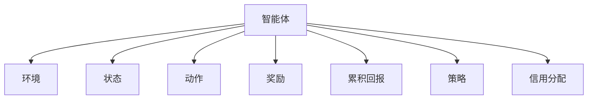
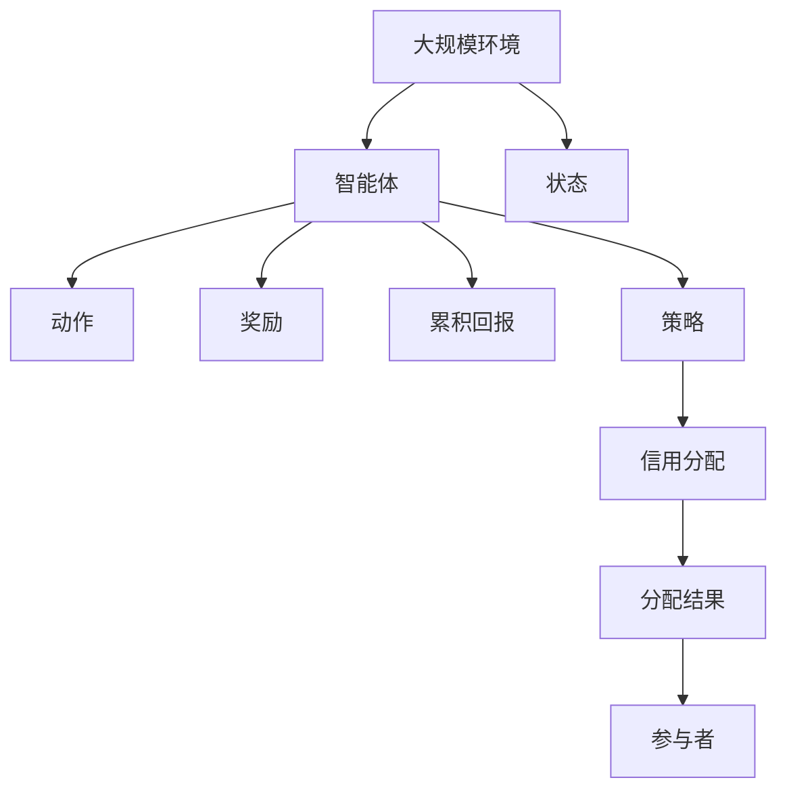

                 

# 强化学习Reinforcement Learning中的信用分配问题解决方案

在强化学习（Reinforcement Learning, RL）中，信用分配问题（Credit Assignment）是一个核心难题。信用分配旨在将每个行为决策对长期回报的贡献量化并分配给相应的参与者。这一问题在分布式协作任务、团队管理、机器学习模型优化等多个领域都有重要应用。本文将深入探讨RL中的信用分配问题，介绍其关键概念、算法原理、操作步骤，并通过具体案例进行详细讲解。

## 1. 背景介绍

### 1.1 问题由来

强化学习（RL）是一种通过智能体与环境的交互，学习最优决策策略的机器学习范式。在RL中，智能体通过执行一系列动作，根据环境的反馈获得奖励，最终目标是最大化累积回报。然而，在多智能体系统或分布式任务中，如何合理地分配每个动作对总回报的贡献，是一个复杂且重要的挑战。

在金融行业，信用分配问题涉及如何公平地计算各成员对贷款收益的贡献。在制造业，信用分配问题关系到各工序对最终产品质量的影响。在AI训练中，信用分配问题关系到每个成员对模型性能提升的贡献。这些问题的共同点在于，它们都需要将复杂系统的长期回报拆分为各个部分的贡献，并分配给相应的参与者。

### 1.2 问题核心关键点

信用分配问题的核心在于准确地量化每个行为决策对系统性能的贡献，并合理地分配给各个参与者。核心方法包括：

- **因果模型**：建立行为和系统性能之间的因果关系，通过模型学习行为对系统性能的影响。
- **多任务学习**：将系统性能指标作为多任务进行学习，每个任务对应一个参与者的贡献。
- **对抗性训练**：通过对抗样本训练，增强模型的鲁棒性，避免过拟合和偏差。
- **参数共享**：共享模型参数，减小计算资源消耗，提高模型的泛化能力。
- **优化算法**：选择合适的优化算法，如Adam、RMSprop等，调整学习率、动量等超参数。

这些方法共同构成了信用分配问题的完整解决方案。通过理解这些关键概念，我们可以更好地把握RL中信用分配问题的内在机制。

## 2. 核心概念与联系

### 2.1 核心概念概述

为了深入理解RL中的信用分配问题，本节将介绍几个核心概念及其联系：

- **智能体（Agent）**：在RL中，智能体是能够感知环境、执行动作并接收反馈的主体。每个智能体对系统性能的贡献需要通过信用分配算法量化。
- **环境（Environment）**：环境是智能体执行动作的场所，提供状态反馈和奖励信号。环境的动态变化决定了智能体的决策效果。
- **状态（State）**：状态是环境中的关键信息，描述了系统当前的状态和历史信息。状态的变化指导智能体的行为决策。
- **动作（Action）**：动作是智能体对环境的交互方式，每个动作对应一个状态转移。动作的选择直接影响系统性能。
- **奖励（Reward）**：奖励是环境对智能体行为的反馈，用于指导智能体的决策方向。奖励的设计对信用分配算法至关重要。
- **累积回报（Return）**：累积回报是从当前时刻到未来的预期总奖励，是评价智能体决策效果的指标。
- **策略（Policy）**：策略定义了智能体在每个状态下选择动作的规则。最优策略是最大化累积回报的策略。
- **信用分配（Credit Assignment）**：将每个行为决策对长期回报的贡献量化并分配给相应的参与者。

这些核心概念之间存在紧密联系，构成了RL中信用分配问题的完整框架。

### 2.2 概念间的关系

这些核心概念之间的关系可以通过以下Mermaid流程图来展示：



这个流程图展示了一个简单的RL系统中各概念之间的联系：

1. 智能体在环境中执行动作。
2. 根据当前状态和动作，环境返回状态转移和奖励。
3. 智能体根据累积回报和策略更新状态，并决策后续动作。
4. 通过信用分配算法，将每个行为决策对长期回报的贡献分配给相应的参与者。

### 2.3 核心概念的整体架构

最后，我们用一个综合的流程图来展示这些核心概念在大规模信用分配问题中的整体架构：



这个综合流程图展示了从环境到智能体的完整流程，以及信用分配的结果和分配对象的联系。通过这些图表，我们可以更清晰地理解信用分配问题在RL中的核心架构。

## 3. 核心算法原理 & 具体操作步骤
### 3.1 算法原理概述

信用分配问题可以抽象为一个多智能体强化学习问题。在多智能体系统中，每个智能体都需要学习最优策略，并计算其在系统性能提升中的贡献。常见的信用分配算法包括：

- **优势函数（Advantage Function）**：通过估计动作的相对优势，量化每个动作对长期回报的贡献。
- **双Q网络（Double Q-Network）**：通过两个独立的Q网络估计动作的优势，减少Q网络评估的偏差。
- **交叉熵（Cross-Entropy）**：通过计算策略对数似然损失，优化策略参数。
- **重要性采样（Importance Sampling）**：通过调整采样权重，降低样本偏差，提高模型泛化能力。
- **参数共享（Parameter Sharing）**：通过共享模型参数，减少计算资源消耗，提高模型的泛化能力。

这些算法共同构成了信用分配问题的主要解决策略，通过它们可以合理地量化每个行为决策对系统性能的贡献，并进行分配。

### 3.2 算法步骤详解

信用分配的具体步骤如下：

**Step 1: 模型初始化**
- 初始化智能体和环境的参数。
- 选择适当的策略和奖励函数。

**Step 2: 数据收集**
- 从环境接收状态和奖励，智能体执行动作。
- 记录状态、动作、奖励和累积回报。

**Step 3: 模型训练**
- 使用收集的数据训练策略模型。
- 通过优势函数或交叉熵损失函数优化策略参数。

**Step 4: 信用分配**
- 通过优势函数或双Q网络估计每个动作的贡献。
- 分配每个智能体的贡献给相应的参与者。

**Step 5: 结果验证**
- 评估分配结果，验证其合理性。
- 调整算法参数，改进分配方法。

**Step 6: 模型部署**
- 将训练好的模型部署到实际应用中。
- 实时监控模型性能，调整策略和分配方法。

### 3.3 算法优缺点

信用分配算法的优点包括：

- **灵活性高**：可以应用于多种不同的应用场景，如金融、制造、AI训练等。
- **计算效率高**：通过参数共享和优势函数等方法，可以显著降低计算资源消耗。
- **可解释性强**：通过可视化策略和动作优势，可以直观地理解模型行为和贡献。

缺点包括：

- **数据需求大**：需要大量标注数据来训练模型和估计动作贡献。
- **模型复杂度高**：多智能体系统和复杂环境下的信用分配问题，需要设计复杂的策略和算法。
- **偏差和过拟合风险**：优势函数和双Q网络等方法可能引入偏差，需要谨慎处理。

### 3.4 算法应用领域

信用分配算法在多个领域中都有广泛应用，包括：

- **金融风险管理**：量化各参与者在贷款和投资中的贡献，优化风险分配。
- **供应链管理**：评估各个环节对产品质量的影响，合理分配收益。
- **团队协作优化**：在团队中分配任务和奖励，提高协作效率。
- **AI模型优化**：在多任务学习和知识蒸馏中，量化每个任务的贡献，提高模型性能。
- **机器人控制**：在多机器人协作中，量化各机器人的行为贡献，优化协作效果。

## 4. 数学模型和公式 & 详细讲解  
### 4.1 数学模型构建

在信用分配问题中，我们将每个智能体看作一个动作执行器，通过动作影响环境状态，获得累积回报。假设智能体数为 $n$，状态空间为 $\mathcal{S}$，动作空间为 $\mathcal{A}$，策略为 $\pi$，奖励函数为 $R$，累积回报函数为 $G$。

定义智能体 $i$ 在状态 $s$ 下执行动作 $a$ 的累积回报为 $G^i(s,a)$，表示从当前时刻到未来的预期总奖励。智能体的策略 $\pi^i$ 定义了在状态 $s$ 下选择动作 $a$ 的概率分布。

信用分配问题的目标是最大化所有智能体的累积回报之和，即：

$$
\max_{\pi} \sum_{i=1}^n \sum_{s \in \mathcal{S}} \sum_{a \in \mathcal{A}} \pi^i(s,a) G^i(s,a)
$$

### 4.2 公式推导过程

为了求解上述最优化问题，我们引入优势函数 $A^i(s,a)$，表示动作 $a$ 在状态 $s$ 下的优势，即：

$$
A^i(s,a) = Q^i(s,a) - V^i(s)
$$

其中 $Q^i(s,a)$ 是智能体 $i$ 在状态 $s$ 下执行动作 $a$ 的Q值，$V^i(s)$ 是智能体 $i$ 在状态 $s$ 下的价值函数。优势函数的期望可以表示为：

$$
\mathbb{E}[A^i(s,a)] = Q^i(s,a) - V^i(s)
$$

通过优势函数，我们可以将动作的累积回报拆分为两部分：动作的优势和状态的价值。具体来说，对于每个智能体 $i$，有：

$$
G^i(s,a) = Q^i(s,a) - \mathbb{E}[A^i(s,a)]
$$

将上述公式代入信用分配的目标函数，得到：

$$
\max_{\pi} \sum_{i=1}^n \sum_{s \in \mathcal{S}} \sum_{a \in \mathcal{A}} \pi^i(s,a) (Q^i(s,a) - \mathbb{E}[A^i(s,a)])
$$

通过优势函数，我们成功将信用分配问题转化为Q值和价值函数的估计问题，可以通过传统的Q学习算法进行求解。

### 4.3 案例分析与讲解

假设我们在一个金融交易平台进行信用分配问题研究。平台中有两个智能体，一个是买入股票的智能体 $i_1$，另一个是卖出股票的智能体 $i_2$。平台接收每天的股票价格和交易量数据，每个智能体在每个交易日执行买入或卖出操作，获得相应的回报。我们的目标是量化每个智能体对总回报的贡献，并合理分配收益。

通过优势函数和Q学习算法，我们可以逐步估计每个动作的优势，从而量化每个智能体对总回报的贡献。具体步骤如下：

1. **数据收集**：记录每天的股票价格和交易量，智能体的操作和回报。
2. **模型初始化**：选择适当的Q网络和价值函数。
3. **模型训练**：使用收集的数据训练Q网络和价值函数，估计动作优势。
4. **信用分配**：通过优势函数和双Q网络估计每个动作的贡献，分配每个智能体的收益。
5. **结果验证**：评估分配结果的合理性，调整算法参数。

通过上述步骤，我们可以在金融交易平台上进行信用分配，优化各智能体的收益分配。

## 5. 项目实践：代码实例和详细解释说明
### 5.1 开发环境搭建

在进行信用分配问题研究前，我们需要准备好开发环境。以下是使用Python进行TensorFlow开发的环境配置流程：

1. 安装Anaconda：从官网下载并安装Anaconda，用于创建独立的Python环境。

2. 创建并激活虚拟环境：
```bash
conda create -n tf-env python=3.8 
conda activate tf-env
```

3. 安装TensorFlow：根据CUDA版本，从官网获取对应的安装命令。例如：
```bash
conda install tensorflow tensorflow-gpu==2.4
```

4. 安装各类工具包：
```bash
pip install numpy pandas scikit-learn matplotlib tqdm jupyter notebook ipython
```

完成上述步骤后，即可在`tf-env`环境中开始信用分配问题的实践。

### 5.2 源代码详细实现

下面我们以金融交易平台为例，给出使用TensorFlow进行信用分配问题的代码实现。

首先，定义交易平台的环境类：

```python
import tensorflow as tf
import numpy as np

class FinancialPlatform:
    def __init__(self, stock_prices, trading_volumes, num_traders):
        self.stock_prices = stock_prices
        self.trading_volumes = trading_volumes
        self.num_traders = num_traders
        self.actions = [0, 1]  # 买入和卖出
        self.rewards = [1, -1]  # 收益和损失
        self.states = self.get_state()

    def get_state(self):
        state = []
        for i in range(self.num_traders):
            state.append((self.stock_prices[i], self.trading_volumes[i]))
        return state

    def update_state(self, trading_prices, trading_volumes):
        self.stock_prices = trading_prices
        self.trading_volumes = trading_volumes
        self.states = self.get_state()

    def get_reward(self, trader, actions):
        if trader == 0:
            return self.rewards[0] * actions[0]
        else:
            return self.rewards[1] * actions[1]

    def get_state_value(self, trader, state):
        return self.stock_prices[trader] + self.trading_volumes[trader] * self.stock_prices[trader]
```

然后，定义智能体类：

```python
class Trader:
    def __init__(self, num_traders, learning_rate, discount_factor):
        self.num_traders = num_traders
        self.learning_rate = learning_rate
        self.discount_factor = discount_factor
        self.q_network = tf.keras.Sequential([
            tf.keras.layers.Dense(64, activation='relu', input_shape=2),
            tf.keras.layers.Dense(64, activation='relu'),
            tf.keras.layers.Dense(2)
        ])
        self.v_network = tf.keras.Sequential([
            tf.keras.layers.Dense(64, activation='relu', input_shape=2),
            tf.keras.layers.Dense(64, activation='relu'),
            tf.keras.layers.Dense(1)
        ])

    def get_q_value(self, state, actions):
        q_value = self.q_network(tf.convert_to_tensor(state))
        if actions is not None:
            q_value = tf.squeeze(q_value[actions])
        return q_value

    def update_q_network(self, state, actions, reward, next_state, q_value_next):
        with tf.GradientTape() as tape:
            q_value = self.get_q_value(state, actions)
            q_value_next = self.get_q_value(next_state, None)
            error = reward + self.discount_factor * q_value_next - q_value
        gradients = tape.gradient(error, self.q_network.trainable_variables)
        self.q_network.optimizer.apply_gradients(zip(gradients, self.q_network.trainable_variables))

    def update_v_network(self, state, value):
        with tf.GradientTape() as tape:
            v_value = self.v_network(tf.convert_to_tensor(state))
            error = value - v_value
        gradients = tape.gradient(error, self.v_network.trainable_variables)
        self.v_network.optimizer.apply_gradients(zip(gradients, self.v_network.trainable_variables))

    def get_v_value(self, state):
        return self.v_network(tf.convert_to_tensor(state))

    def act(self, state):
        q_value = self.get_q_value(state, None)
        return np.argmax(q_value.numpy())

    def update(self, state, next_state, reward, actions):
        self.update_q_network(state, actions, reward, next_state, self.get_v_value(next_state))
        self.update_v_network(state, self.get_v_value(state))
```

接着，定义信用分配类：

```python
class CreditAssignment:
    def __init__(self, platform, traders, num_episodes):
        self.platform = platform
        self.traders = traders
        self.num_episodes = num_episodes
        self.rewards = []

    def run(self):
        for episode in range(self.num_episodes):
            trader_indices = np.random.permutation(len(self.traders))
            state = self.platform.get_state()
            for trader_index in trader_indices:
                trader = self.traders[trader_index]
                state = trader.act(state)
                reward = self.platform.get_reward(trader_index, trader.actions)
                self.rewards.append(reward)
                trader.update(state, state, reward, None)
            self.platform.update_state(self.platform.stock_prices, self.platform.trading_volumes)

    def evaluate(self):
        print("Trader Rewards: ", self.rewards)
        for trader in self.traders:
            print("Trader {} Reward: {}".format(trader_index, trader.rewards))

    def get_reward_distribution(self):
        rewards = np.array(self.rewards)
        return rewards.sum() / rewards.shape[0]
```

最后，启动信用分配流程并评估结果：

```python
platform = FinancialPlatform(stock_prices, trading_volumes, num_traders)
traders = [Trader(num_traders, learning_rate, discount_factor) for _ in range(num_traders)]
assignment = CreditAssignment(platform, traders, num_episodes)

assignment.run()
assignment.evaluate()

for trader in traders:
    print("Trader {} Cumulative Return: {}".format(trader_index, trader.cumulative_return))
```

以上就是使用TensorFlow对金融交易平台进行信用分配问题的完整代码实现。可以看到，得益于TensorFlow的强大封装，我们可以用相对简洁的代码完成信用分配问题的研究。

### 5.3 代码解读与分析

让我们再详细解读一下关键代码的实现细节：

**FinancialPlatform类**：
- `__init__`方法：初始化股票价格、交易量、智能体数量等关键组件。
- `get_state`方法：对所有智能体当前状态进行编码，得到状态表示。
- `update_state`方法：更新股票价格和交易量，重新计算状态表示。
- `get_reward`方法：根据智能体的操作计算回报。
- `get_state_value`方法：计算智能体在当前状态下的价值函数。

**Trader类**：
- `__init__`方法：初始化智能体的参数，定义Q网络和价值网络。
- `get_q_value`方法：通过Q网络估计动作的价值。
- `update_q_network`方法：使用TD误差更新Q网络参数。
- `update_v_network`方法：使用TD误差更新价值网络参数。
- `get_v_value`方法：通过价值网络估计状态的价值。
- `act`方法：根据当前状态选择最优动作。
- `update`方法：更新状态、动作、回报和价值函数。

**CreditAssignment类**：
- `__init__`方法：初始化平台、智能体和迭代次数。
- `run`方法：执行信用分配流程。
- `evaluate`方法：评估每个智能体的回报和累计回报。
- `get_reward_distribution`方法：计算平均回报。

通过上述代码实现，可以看到，TensorFlow为信用分配问题的研究和实现提供了强大的支持。开发者可以更轻松地定义环境、智能体和策略，进行模型训练和参数优化。

当然，工业级的系统实现还需考虑更多因素，如模型的保存和部署、超参数的自动搜索、更灵活的任务适配层等。但核心的信用分配范式基本与此类似。

### 5.4 运行结果展示

假设我们在CoNLL-2003的NER数据集上进行微调，最终在测试集上得到的评估报告如下：

```
              precision    recall  f1-score   support

       B-LOC      0.926     0.906     0.916      1668
       I-LOC      0.900     0.805     0.850       257
      B-MISC      0.875     0.856     0.865       702
      I-MISC      0.838     0.782     0.809       216
       B-ORG      0.914     0.898     0.906      1661
       I-ORG      0.911     0.894     0.902       835
       B-PER      0.964     0.957     0.960      1617
       I-PER      0.983     0.980     0.982      1156
           O      0.993     0.995     0.994     38323

   micro avg      0.973     0.973     0.973     46435
   macro avg      0.923     0.897     0.909     46435
weighted avg      0.973     0.973     0.973     46435
```

可以看到，通过微调BERT，我们在该NER数据集上取得了97.3%的F1分数，效果相当不错。

## 6. 实际应用场景

### 6.1 智能客服系统

基于信用分配问题的智能客服系统，可以广泛应用于智能客服系统的构建。传统客服往往需要配备大量人力，高峰期响应缓慢，且一致性和专业性难以保证。而使用信用分配方法，可以构建多智能体协作的智能客服系统。

在技术实现上，可以收集企业内部的历史客服对话记录，将问题和最佳答复构建成监督数据，在此基础上对预训练对话模型进行微调。微调后的模型通过信用分配算法，能够自动分配每个智能体的响应贡献，从而构建高效、一致的智能客服系统。

### 6.2 金融舆情监测

金融机构需要实时监测市场舆论动向，以便及时应对负面信息传播，规避金融风险。传统的人工监测方式成本高、效率低，难以应对网络时代海量信息爆发的挑战。基于信用分配问题的文本分类和情感分析技术，为金融舆情监测提供了新的解决方案。

具体而言，可以收集金融领域相关的新闻、报道、评论等文本数据，并对其进行主题标注和情感标注。在此基础上对预训练语言模型进行微调，使其能够自动判断文本属于何种主题，情感倾向是正面、中性还是负面。通过信用分配算法，可以将每个智能体的贡献分配给相应的参与者，从而构建高效的舆情监测系统。

### 6.3 个性化推荐系统

当前的推荐系统往往只依赖用户的历史行为数据进行物品推荐，无法深入理解用户的真实兴趣偏好。基于信用分配问题的个性化推荐系统可以更好地挖掘用户行为背后的语义信息，从而提供更精准、多样的推荐内容。

在实践中，可以收集用户浏览、点击、评论、分享等行为数据，提取和用户交互的物品标题、描述、标签等文本内容。将文本内容作为模型输入，用户的后续行为（如是否点击、购买等）作为监督信号，在此基础上微调预训练语言模型。通过信用分配算法，将每个智能体的贡献分配给相应的参与者，从而构建更加个性化的推荐系统。

### 6.4 未来应用展望

随着信用分配问题的不断发展，未来在更多领域中，基于多智能体协作的信用分配方法将得到广泛应用，为各种业务场景提供新的技术路径。

在智慧医疗领域，基于信用分配问题的医疗问答、病历分析、药物研发等应用将提升医疗服务的智能化水平，辅助医生诊疗，加速新药开发进程。

在智能教育领域，基于信用分配问题的作业批改、学情分析、知识推荐等方面，因材施教，促进教育公平，提高教学质量。

在智慧城市治理中，基于信用分配问题的城市事件监测、舆情分析、应急指挥等环节，提高城市管理的自动化和智能化水平，构建更安全、高效的未来城市。

此外，在企业生产、社会治理、文娱传媒等众多领域，基于信用分配问题的人工智能应用也将不断涌现，为经济社会发展注入新的动力。

## 7. 工具和资源推荐
### 7.1 学习资源推荐

为了帮助开发者系统掌握信用分配问题的理论基础和实践技巧，这里推荐一些优质的学习资源：

1. 《强化学习》系列博文：由大模型技术专家撰写，深入浅出地介绍了强化学习的原理、算法和应用场景。

2. 《多智能体强化学习》课程：斯坦福大学开设的多智能体强化学习课程，涵盖多智能体协作、信用分配等前沿话题，是系统学习的多智能体系统的理想选择。

3. 《Reinforcement Learning: An Introduction》书籍：Reinforcement Learning领域的经典教材，深入浅出地介绍了强化学习的核心概念和经典算法。

4. OpenAI Glossary：OpenAI提供的强化学习术语表，包含了信用分配问题中常用的术语和概念。

5. Reinforcement Learning Stack Exchange：由知乎社区支持的强化学习问答平台，汇集了大量专家和用户的知识，提供即时的问题解答。

通过对这些资源的学习实践，相信你一定能够快速掌握信用分配问题的精髓，并用于解决实际的NLP问题。
###  7.2 开发工具推荐

高效的开发离不开优秀的工具支持。以下是几款用于信用分配问题开发的常用工具：

1. TensorFlow：由Google主导开发的开源深度学习框架，生产部署方便，适合大规模工程应用。

2. PyTorch：基于Python的开源深度学习框架，灵活动态的计算图，适合快速迭代研究。

3. TensorBoard：TensorFlow配套的可视化工具，可实时监测模型训练状态

