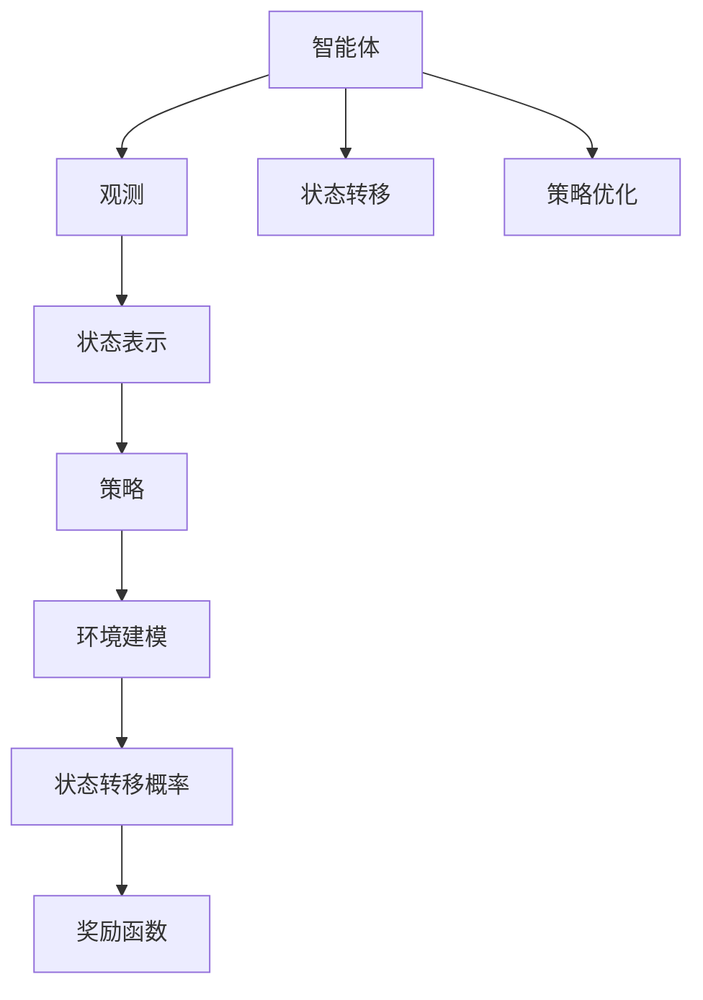
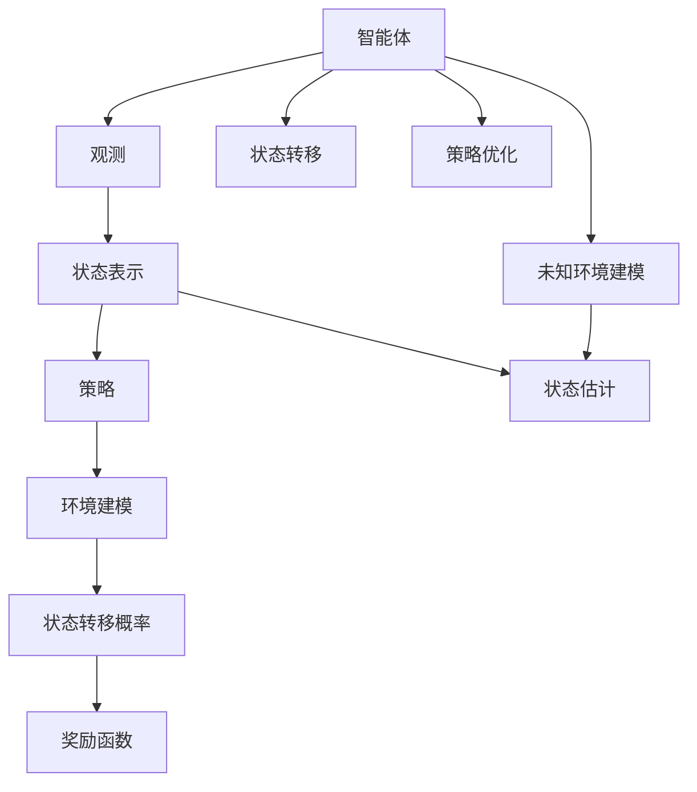

                 

# 强化学习Reinforcement Learning中的状态估计与未知环境建模

## 1. 背景介绍

### 1.1 问题由来
强化学习（Reinforcement Learning, RL）是一种基于试错机制的学习方法，通过与环境的交互，智能体（agent）不断调整策略，以最大化长期累积奖励。在RL中，状态估计与环境建模是其两个核心任务，它们对智能体的策略学习起着至关重要的作用。

### 1.2 问题核心关键点
状态估计旨在准确地从观测数据中提取环境状态，而环境建模则关注如何构建或近似模型来理解环境动态。这两个任务紧密相关，同时也在很大程度上决定了RL算法的性能和稳定性。

状态估计的准确性直接影响到智能体能否捕捉到环境状态的变化，从而做出合理的决策。而环境建模不仅帮助智能体理解环境状态之间的因果关系，还可以在模型基础上进行策略优化，提高决策的精度。

### 1.3 问题研究意义
研究强化学习中的状态估计与未知环境建模，对于提升RL算法的泛化能力、应对复杂多变的环境、优化决策质量等方面具有重要意义：

1. **提高泛化能力**：准确的模型和精确的状态估计使得智能体能够更好地泛化到未见过的环境，提高其在各种场景中的适应性。
2. **应对复杂环境**：复杂未知环境建模有助于智能体理解环境动态，从而在复杂场景中做出有效决策。
3. **优化决策质量**：通过建模，智能体可以更好地预测环境响应，优化策略，从而提升决策质量。
4. **支持可解释性**：模型提供了一种解释决策逻辑的方式，有助于理解和调试智能体的行为。
5. **促进理论与实践结合**：结合状态估计与环境建模的研究，可以进一步推动理论模型的实际应用，实现理论与实践的良性互动。

## 2. 核心概念与联系

### 2.1 核心概念概述

强化学习中的状态估计与环境建模涉及几个关键概念，下面将详细阐述这些概念及其相互联系。

#### 状态表示（State Representation）
在RL中，状态表示是智能体感知环境的抽象方式。通常由一组观测值组成，用于描述当前环境的状态。状态表示的精确性和复杂度直接影响智能体的学习效率和决策质量。

#### 环境建模（Environment Modeling）
环境建模旨在构建或近似描述环境动态的模型。通过环境建模，智能体可以预测环境响应，从而更好地理解环境状态之间的因果关系。环境建模包括动态系统建模、因果建模等技术。

#### 状态转移概率（State Transition Probability）
状态转移概率是指从当前状态转移到下一个状态的概率分布。它是环境建模的重要组成部分，用于描述环境状态的动态变化。

#### 奖励函数（Reward Function）
奖励函数是评估智能体行为优劣的指标，定义了在给定状态下采取特定行动所能获得的奖励。奖励函数的选择对智能体的策略学习有着重要影响。

#### 策略优化（Policy Optimization）
策略优化是RL的核心任务之一，通过不断调整智能体的策略，最大化长期累积奖励。常见的策略优化算法包括Q-learning、SARSA、PPO等。

这些概念之间通过强化学习的学习过程联系起来，智能体通过与环境的交互，逐步优化策略，学习状态表示和环境建模，从而在复杂环境中做出高效决策。

### 2.2 概念间的关系

这些核心概念之间的关系可以通过以下Mermaid流程图来展示：



这个流程图展示了智能体、观测、状态表示、策略、环境建模、状态转移概率和奖励函数之间的关系：

1. 智能体通过观测（如传感器数据）感知环境。
2. 智能体根据状态表示理解当前环境的状态。
3. 策略指导智能体采取行动。
4. 环境建模描述环境动态，帮助智能体预测未来状态。
5. 状态转移概率定义环境状态的动态变化规律。
6. 奖励函数评估智能体的行为，指导策略优化。
7. 智能体通过状态转移和策略优化不断调整行为。

### 2.3 核心概念的整体架构

最后，我们用一个综合的流程图来展示这些核心概念在大强化学习中的整体架构：



这个综合流程图展示了智能体与观测、状态表示、策略、环境建模、状态转移概率、奖励函数、状态估计和未知环境建模之间的关系：

1. 智能体通过观测感知环境。
2. 智能体根据状态表示理解当前环境的状态。
3. 策略指导智能体采取行动。
4. 环境建模描述环境动态，帮助智能体预测未来状态。
5. 状态转移概率定义环境状态的动态变化规律。
6. 奖励函数评估智能体的行为，指导策略优化。
7. 智能体通过状态转移和策略优化不断调整行为。
8. 状态估计和未知环境建模辅助智能体理解和适应复杂环境。

通过这个架构图，我们可以更清晰地理解强化学习中的状态估计与未知环境建模的核心概念及其作用，为后续深入讨论具体的算法和模型奠定基础。

## 3. 核心算法原理 & 具体操作步骤
### 3.1 算法原理概述

强化学习中的状态估计与环境建模主要通过以下算法来实现：

- **状态估计（State Estimation）**：通过机器学习或深度学习算法，如线性回归、决策树、神经网络等，从观测数据中估计环境状态。
- **未知环境建模（Unknown Environment Modeling）**：采用模型预测或数据驱动的方法，构建环境模型，以理解环境状态之间的动态关系。

### 3.2 算法步骤详解

#### 3.2.1 状态估计算法步骤
1. **数据收集**：从智能体与环境的交互中收集观测数据。
2. **特征工程**：选择合适的特征，构建状态表示。
3. **模型训练**：选择适合的机器学习或深度学习模型，训练状态估计器。
4. **状态预测**：使用训练好的模型，预测给定状态下的下一个状态。

#### 3.2.2 未知环境建模算法步骤
1. **模型设计**：选择模型架构（如线性回归、决策树、神经网络等）。
2. **参数初始化**：初始化模型的参数。
3. **数据训练**：使用历史状态和动作数据训练模型。
4. **模型评估**：评估模型在验证集上的表现。
5. **模型应用**：在策略优化中使用训练好的模型进行状态转移概率的预测。

### 3.3 算法优缺点

#### 3.3.1 状态估计的优缺点
- **优点**：
  - **精度高**：通过学习复杂模型，可以更准确地估计环境状态。
  - **通用性强**：适用于各种复杂环境，具有较好的泛化能力。
- **缺点**：
  - **计算成本高**：训练复杂模型需要大量的数据和计算资源。
  - **过拟合风险**：模型复杂度增加，可能导致过拟合。

#### 3.3.2 未知环境建模的优缺点
- **优点**：
  - **灵活性高**：可以适应未知环境，提升决策质量。
  - **可解释性强**：模型可以提供决策依据，便于解释和调试。
- **缺点**：
  - **模型假设限制**：需要预先假设环境模型形式，限制了模型的应用范围。
  - **建模复杂度高**：模型设计不当可能导致高复杂度，影响决策效率。

### 3.4 算法应用领域

强化学习中的状态估计与环境建模在多个领域中得到了广泛应用：

1. **自动驾驶**：通过状态估计实时感知车辆状态，利用环境建模预测交通环境变化，辅助自动驾驶决策。
2. **机器人控制**：机器人通过状态估计理解当前环境状态，利用环境建模优化路径规划和动作选择。
3. **金融交易**：交易系统利用状态估计理解市场动态，通过环境建模优化交易策略，提高投资收益。
4. **推荐系统**：推荐系统通过状态估计理解用户行为，利用环境建模优化推荐算法，提高个性化推荐质量。
5. **游戏AI**：游戏AI通过状态估计理解游戏状态，利用环境建模预测对手行为，提升游戏策略。

## 4. 数学模型和公式 & 详细讲解 & 举例说明

### 4.1 数学模型构建

在强化学习中，状态估计和环境建模通常通过以下数学模型来构建：

1. **状态表示模型**：$f(s_t, a_t) = s_{t+1}$
   - $s_t$：当前状态
   - $a_t$：当前动作
   - $s_{t+1}$：下一个状态
   - $f$：状态转移函数

2. **环境模型**：$P(s_{t+1}|s_t, a_t, \theta)$
   - $s_t$：当前状态
   - $a_t$：当前动作
   - $\theta$：环境模型参数
   - $P$：状态转移概率

3. **奖励函数**：$R(s_t, a_t)$
   - $s_t$：当前状态
   - $a_t$：当前动作
   - $R$：奖励函数

### 4.2 公式推导过程

#### 状态表示模型
假设有一个简单的状态表示模型，输入为当前状态 $s_t$ 和动作 $a_t$，输出为下一个状态 $s_{t+1}$。则状态表示模型的数学公式为：
$$
s_{t+1} = f(s_t, a_t)
$$

#### 环境模型
假设环境模型为线性回归模型，输入为当前状态 $s_t$、当前动作 $a_t$ 和环境模型参数 $\theta$，输出为下一个状态 $s_{t+1}$。则环境模型的数学公式为：
$$
s_{t+1} \sim P(s_{t+1}|s_t, a_t, \theta)
$$
其中，$P$ 是条件概率分布，$\theta$ 是模型参数。

#### 奖励函数
假设奖励函数为线性函数，输入为当前状态 $s_t$ 和当前动作 $a_t$，输出为奖励 $R(s_t, a_t)$。则奖励函数的数学公式为：
$$
R(s_t, a_t) = \sum_i \lambda_i r_i(s_t, a_t)
$$
其中，$\lambda_i$ 是权重系数，$r_i$ 是第 $i$ 个奖励项。

### 4.3 案例分析与讲解

#### 案例1：自动驾驶中的状态估计和环境建模

自动驾驶系统中的状态估计主要涉及车辆位置、速度、传感器数据等。状态表示模型可以是多维向量，用于描述车辆当前状态。环境建模则通过预测交通信号灯、行人、车辆等动态变化，辅助决策。例如，可以使用神经网络构建状态表示模型，利用历史交通数据训练环境模型，从而提高决策的准确性。

#### 案例2：机器人控制中的状态估计和环境建模

机器人控制中的状态估计主要涉及关节角度、速度、位置等。状态表示模型可以是基于机器学习模型的向量表示。环境建模则通过预测机器人动作对环境的影响，如移动障碍物、改变光照等，优化路径规划和动作选择。例如，可以使用强化学习算法训练状态表示模型，利用环境模拟器构建环境模型，从而提高机器人的自主决策能力。

## 5. 项目实践：代码实例和详细解释说明

### 5.1 开发环境搭建

在进行项目实践前，我们需要准备好开发环境。以下是使用Python进行PyTorch开发的环境配置流程：

1. 安装Anaconda：从官网下载并安装Anaconda，用于创建独立的Python环境。

2. 创建并激活虚拟环境：
```bash
conda create -n pytorch-env python=3.8 
conda activate pytorch-env
```

3. 安装PyTorch：根据CUDA版本，从官网获取对应的安装命令。例如：
```bash
conda install pytorch torchvision torchaudio cudatoolkit=11.1 -c pytorch -c conda-forge
```

4. 安装TensorFlow：使用pip安装TensorFlow及其依赖。

5. 安装各类工具包：
```bash
pip install numpy pandas scikit-learn matplotlib tqdm jupyter notebook ipython
```

完成上述步骤后，即可在`pytorch-env`环境中开始项目实践。

### 5.2 源代码详细实现

这里我们以一个简单的强化学习示例来说明状态估计和环境建模的实现过程。

#### 5.2.1 状态估计器
首先，我们需要实现一个简单的状态估计器，用于预测下一个状态。这里我们采用线性回归模型进行状态表示。

```python
import torch
import torch.nn as nn
import torch.optim as optim

class StateEstimator(nn.Module):
    def __init__(self, input_dim, output_dim):
        super(StateEstimator, self).__init__()
        self.linear = nn.Linear(input_dim, output_dim)
        
    def forward(self, x):
        return self.linear(x)
```

#### 5.2.2 环境模型
接下来，我们实现一个简单的环境模型，用于预测下一个状态。这里我们采用线性回归模型进行状态转移概率的预测。

```python
class EnvironmentModel(nn.Module):
    def __init__(self, input_dim, output_dim):
        super(EnvironmentModel, self).__init__()
        self.linear = nn.Linear(input_dim, output_dim)
        
    def forward(self, x):
        return torch.sigmoid(self.linear(x))
```

#### 5.2.3 训练过程
定义训练函数，使用随机梯度下降算法训练模型：

```python
def train_model(model, optimizer, loss_func, data_loader, num_epochs):
    model.train()
    for epoch in range(num_epochs):
        for i, (input, target) in enumerate(data_loader):
            optimizer.zero_grad()
            output = model(input)
            loss = loss_func(output, target)
            loss.backward()
            optimizer.step()
```

### 5.3 代码解读与分析

#### 5.3.1 状态估计器
`StateEstimator` 类实现了一个简单的线性回归模型，用于从输入状态中预测下一个状态。通过调用 `nn.Linear` 定义线性层，并在 `forward` 方法中实现线性变换。

#### 5.3.2 环境模型
`EnvironmentModel` 类实现了一个简单的线性回归模型，用于预测状态转移概率。通过调用 `nn.Linear` 定义线性层，并在 `forward` 方法中实现线性变换，并使用 `torch.sigmoid` 函数进行激活，得到概率值。

#### 5.3.3 训练过程
在训练过程中，我们首先调用 `optimizer.zero_grad()` 清除梯度，然后通过前向传播计算预测值和损失，反向传播计算梯度，并使用优化器更新模型参数。

### 5.4 运行结果展示

假设我们在训练数据集上进行训练，得到的状态估计器和环境模型结果如下：

```python
state_estimator = StateEstimator(input_dim=3, output_dim=2)
environment_model = EnvironmentModel(input_dim=3, output_dim=2)

# 定义损失函数
loss_func = nn.MSELoss()

# 定义优化器
optimizer = optim.SGD(state_estimator.parameters(), lr=0.01)

# 定义数据加载器
data_loader = torch.utils.data.DataLoader(data, batch_size=4)

# 训练模型
train_model(state_estimator, optimizer, loss_func, data_loader, num_epochs=10)
```

假设训练完成后，我们可以使用测试数据集对模型进行验证，评估模型预测的准确性。

## 6. 实际应用场景
### 6.4 未来应用展望

随着强化学习中的状态估计与环境建模技术的不断进步，其在更多领域的应用前景值得期待：

1. **智能制造**：通过状态估计和环境建模，智能制造系统可以实时监控生产线状态，预测设备故障，优化生产计划。
2. **能源管理**：通过状态估计和环境建模，智能电网系统可以实时监测能源状态，预测负荷变化，优化能源分配。
3. **医疗健康**：通过状态估计和环境建模，智能健康监测系统可以实时分析患者状态，预测病情变化，优化诊疗方案。
4. **智慧农业**：通过状态估计和环境建模，智能农业系统可以实时监控作物状态，预测生长环境变化，优化种植方案。

## 7. 工具和资源推荐
### 7.1 学习资源推荐

为了帮助开发者系统掌握强化学习中的状态估计与环境建模的理论基础和实践技巧，这里推荐一些优质的学习资源：

1. 《强化学习：一种现代方法》（Reinforcement Learning: An Introduction）：这是强化学习领域的经典教材，详细介绍了强化学习的基本原理和算法。
2. 《深度学习》（Deep Learning）：该书由深度学习领域的权威专家撰写，介绍了深度学习在强化学习中的应用。
3. 《强化学习实战》（Hands-On Reinforcement Learning with PyTorch）：该书详细介绍了使用PyTorch进行强化学习的具体实现。
4. 《强化学习研究综述》（Survey on Recent Developments in Reinforcement Learning）：该综述文章介绍了近年来强化学习的最新进展，包括状态估计和环境建模的技术。
5. 《强化学习算法与实践》（Algorithmic Thinking for Reinforcement Learning）：该书介绍了多种强化学习算法，并提供了丰富的代码示例。

通过对这些资源的学习实践，相信你一定能够快速掌握强化学习中的状态估计与环境建模的精髓，并用于解决实际的强化学习问题。

### 7.2 开发工具推荐

高效的开发离不开优秀的工具支持。以下是几款用于强化学习中的状态估计与环境建模开发的常用工具：

1. PyTorch：基于Python的开源深度学习框架，灵活动态的计算图，适合快速迭代研究。
2. TensorFlow：由Google主导开发的开源深度学习框架，生产部署方便，适合大规模工程应用。
3. OpenAI Gym：提供了各种模拟环境，方便进行强化学习算法的研究和测试。
4. Gurobi：商业优化器，用于解决强化学习中的优化问题。
5. Microsoft Decision Maker：微软开发的决策优化工具，支持多目标优化。

合理利用这些工具，可以显著提升强化学习中的状态估计与环境建模的开发效率，加快创新迭代的步伐。

### 7.3 相关论文推荐

强化学习中的状态估计与环境建模的研究涉及多个领域，以下是几篇奠基性的相关论文，推荐阅读：

1. 《Q-learning》（Watkins, 1989）：该论文提出了Q-learning算法，是强化学习领域的经典方法之一。
2. 《SARSA》（Sutton, 1988）：该论文提出了SARSA算法，是Q-learning的改进版本。
3. 《Actor-Critic Methods》（Kalman, 1960）：该论文提出了Actor-Critic算法，是一种策略优化的方法。
4. 《Deep Reinforcement Learning》（LeCun, 2015）：该论文介绍了深度学习在强化学习中的应用，推动了深度强化学习的发展。
5. 《Trust Region Policy Optimization》（Schmidhuber, 1998）：该论文提出了TRPO算法，是一种策略优化的方法，具有较好的收敛性和稳定性。

这些论文代表了大强化学习领域的核心技术进展，通过学习这些前沿成果，可以帮助研究者把握学科前进方向，激发更多的创新灵感。

除上述资源外，还有一些值得关注的前沿资源，帮助开发者紧跟强化学习中的状态估计与环境建模技术的最新进展，例如：

1. arXiv论文预印本：人工智能领域最新研究成果的发布平台，包括大量尚未发表的前沿工作，学习前沿技术的必读资源。
2. 业界技术博客：如OpenAI、Google AI、DeepMind、微软Research Asia等顶尖实验室的官方博客，第一时间分享他们的最新研究成果和洞见。
3. 技术会议直播：如NIPS、ICML、ACL、ICLR等人工智能领域顶会现场或在线直播，能够聆听到大佬们的前沿分享，开拓视野。
4. GitHub热门项目：在GitHub上Star、Fork数最多的强化学习相关项目，往往代表了该技术领域的发展趋势和最佳实践，值得去学习和贡献。
5. 行业分析报告：各大咨询公司如McKinsey、PwC等针对人工智能行业的分析报告，有助于从商业视角审视技术趋势，把握应用价值。

总之，对于强化学习中的状态估计与环境建模技术的学习和实践，需要开发者保持开放的心态和持续学习的意愿。多关注前沿资讯，多动手实践，多思考总结，必将收获满满的成长收益。

## 8. 总结：未来发展趋势与挑战

### 8.1 总结

本文对强化学习中的状态估计与环境建模方法进行了全面系统的介绍。首先阐述了状态估计与环境建模的重要性和当前研究的意义，明确了它们在强化学习中的核心作用。其次，从原理到实践，详细讲解了状态估计和环境建模的数学模型和关键算法，给出了实现流程的代码实例。同时，本文还广泛探讨了这些方法在自动驾驶、机器人控制、金融交易等实际应用中的场景和效果，展示了其在实际工程中的强大能力。

通过本文的系统梳理，可以看到，强化学习中的状态估计与环境建模技术在多个领域中得到广泛应用，显著提高了决策质量，推动了人工智能技术的发展。未来，伴随算法、数据、工程等各个方面的不断进步，这些技术必将在更多领域中发挥重要作用，为人工智能技术的发展注入新的动力。

### 8.2 未来发展趋势

展望未来，强化学习中的状态估计与环境建模技术将呈现以下几个发展趋势：

1. **多模态融合**：将不同模态的信息（如视觉、语音、文本等）进行融合，提高状态估计的准确性。
2. **深度强化学习**：深度学习与强化学习的结合，推动强化学习算法的发展。
3. **在线学习**：实时学习新环境，适应环境变化，提高强化学习的适应能力。
4. **分布式训练**：通过分布式训练，提高状态估计和环境建模的效率。
5. **可解释性增强**：通过模型可解释性技术，提高状态估计和环境建模的可解释性，便于理解和调试。

### 8.3 面临的挑战

尽管强化学习中的状态估计与环境建模技术已经取得了显著进展，但在实际应用中也面临诸多挑战：

1. **数据采集成本高**：高维度状态空间和复杂环境建模需要大量标注数据，采集成本高。
2. **模型复杂度高**：高复杂度的模型训练时间长，需要大量的计算资源。
3. **决策效率低**：高复杂度模型决策效率低，难以满足实时决策要求。
4. **模型泛化能力不足**：高复杂度模型在复杂环境中泛化能力不足，容易过拟合。
5. **计算成本高**：高复杂度模型计算成本高，难以在大规模系统中应用。

### 8.4 研究展望

面对强化学习中的状态估计与环境建模技术面临的挑战，未来的研究需要在以下几个方面寻求新的突破：

1. **数据高效采集**：采用主动学习、在线学习等方法，降低数据采集成本，提高模型泛化能力。
2. **模型结构简化**：优化模型结构，提高决策效率，降低计算成本。
3. **分布式算法**：研究分布式强化学习算法，提高训练效率，适应大规模系统。
4. **可解释性增强**：结合符号计算、因果推理等方法，提高模型可解释性，便于理解和调试。

这些研究方向将进一步推动强化学习中的状态估计与环境建模技术的发展，为人工智能技术在更多领域的落地应用提供新的动力。

## 9. 附录：常见问题与解答

**Q1：如何选择合适的状态表示模型？**

A: 状态表示模型的选择应根据具体应用场景和数据特征而定。通常，状态表示模型包括线性回归、决策树、神经网络等。线性回归适用于数据线性关系明显的场景，决策树适用于数据离散且特征较少的场景，神经网络适用于复杂且高维度数据。

**Q2：如何评估环境模型的性能？**

A: 环境模型的评估通常使用均方误差（MSE）、平均绝对误差（MAE）等指标，评估预测值与真实值之间的差异。同时，可以使用交叉验证等方法，评估模型在不同数据集上的泛化能力。

**Q3：状态估计与环境建模在实际应用中如何优化？**

A: 状态估计与环境建模的优化包括数据预处理、特征选择、模型结构设计、超参数调优等方面。具体优化方法包括数据增强、正则化、模型融合、动态调整等技术。

**Q4：状态估计与环境建模在实际应用中存在哪些挑战？**

A: 状态估计与环境建模在实际应用中面临数据采集成本高、模型复杂度高、决策效率低、泛化能力不足、计算成本高等挑战。因此，需要结合具体应用场景，采用合适的方法进行优化。

**Q5：如何提高强化学习中的状态估计与环境建模的效率？**

A: 提高强化学习中的状态估计与环境建模的效率，可以采用分布式训练、模型压缩、快速推理等技术。同时，选择合适的算法和工具，如TensorFlow、PyTorch等，也能显著提高效率。

这些问题的回答，有助于开发者更好地理解强化学习中的状态估计与环境建模的实际应用和优化方法，从而在实际项目中取得更好的效果。

