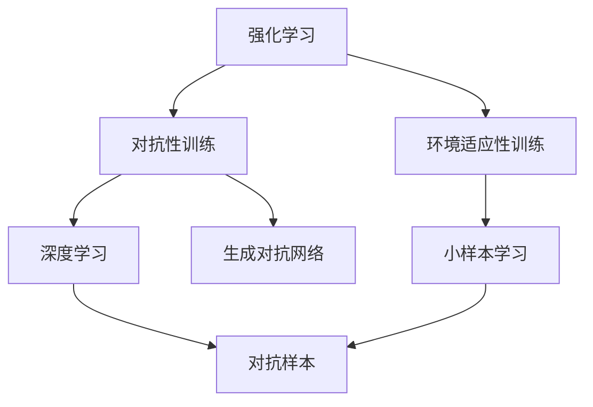
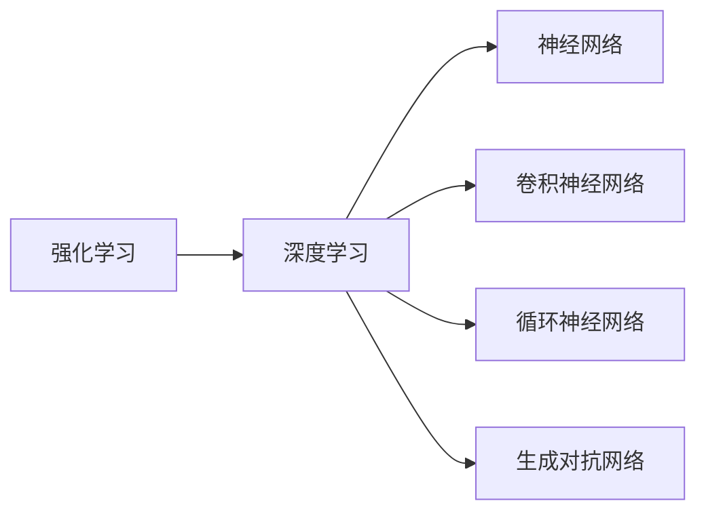
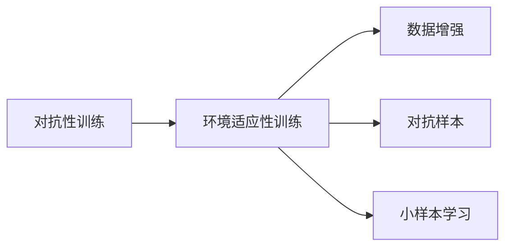
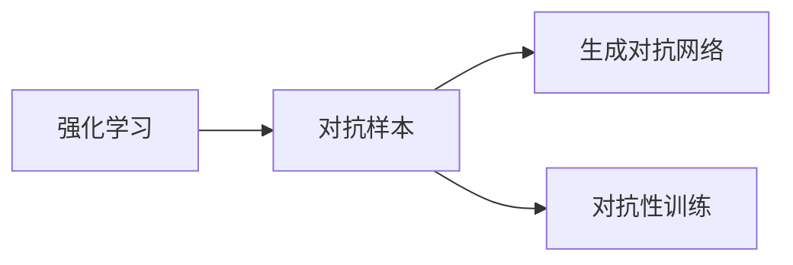
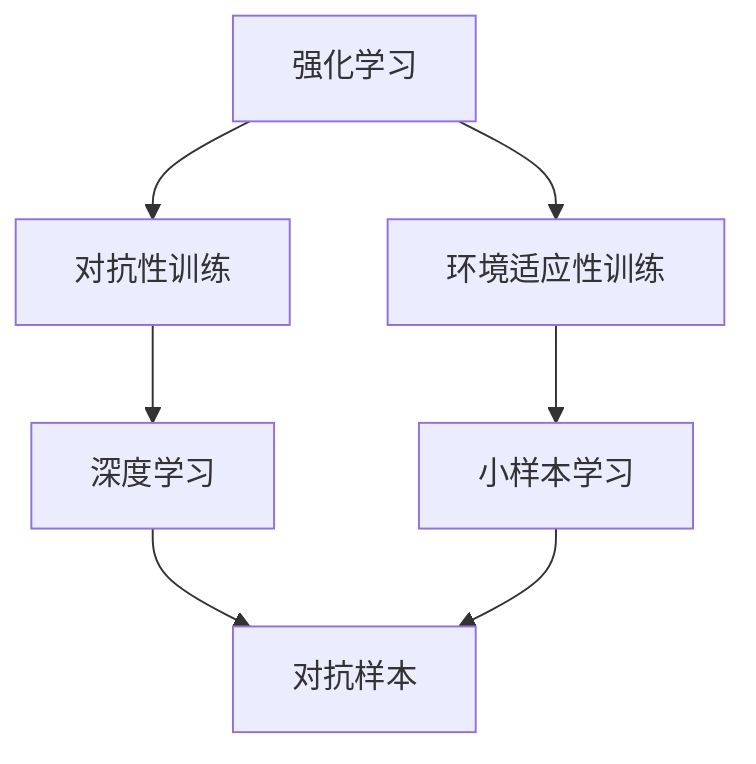

                 

# 强化学习Reinforcement Learning对抗性训练与环境适应性

> 关键词：强化学习，对抗性训练，环境适应性，深度学习，RL, reinforcement learning, 深度强化学习，神经网络

## 1. 背景介绍

### 1.1 问题由来
强化学习(Reinforcement Learning, RL)作为深度学习领域的另一大分支，近年来在决策优化、游戏AI、自动驾驶等领域得到了广泛的应用。与监督学习、无监督学习不同，强化学习强调智能体与环境的交互，通过试错的方式逐步学习最优决策策略。然而，强化学习面临着诸多挑战，如模型可解释性不足、样本效率低、泛化能力差等，这些问题严重制约了RL技术的发展和应用。

### 1.2 问题核心关键点
强化学习的核心思想是通过智能体与环境的交互，逐步优化决策策略，使其最大化长期累积奖励。这一过程包括：

- 状态空间：智能体所处的环境状态集合，包括状态和时间。
- 动作空间：智能体可以采取的行动集合。
- 奖励函数：智能体在当前状态下采取某一动作后的奖励，用于指导智能体的学习。
- Q-函数：在状态动作对上预测的累积奖励。
- 策略：智能体在给定状态下的行动概率分布，用于计算动作价值。

强化学习的主流范式包括：

- Q-learning：基于值函数的时间差分学习算法，通过Q-表存储动作值，逐步优化。
- SARSA：基于动作值的状态-动作-奖励-状态转移的SARSA算法，保证每一步的状态-动作-奖励-状态转移的一致性。
- Deep Q-learning：通过神经网络逼近Q-函数，提升学习效率和精度。
- Policy Gradient：基于策略梯度的算法，直接优化策略参数，避免值函数逼近误差。

然而，强化学习在实际应用中仍面临诸多挑战，如模型复杂度高、学习效率低、泛化能力差等。针对这些问题，近年来研究者提出了各种改进方法，其中包括对抗性训练和环境适应性训练，旨在提升强化学习的鲁棒性和泛化能力。

### 1.3 问题研究意义
强化学习对抗性训练和环境适应性训练的提出，旨在解决深度强化学习中的常见问题，提升其在大规模复杂环境中的应用性能。具体而言：

1. 对抗性训练可以增强RL模型的鲁棒性和泛化能力，使其能够在面对噪声、异常输入等不确定性因素时，仍能保持较高的决策性能。
2. 环境适应性训练可以提升RL模型在不同环境下的适应性，使其能够在面对不同分布、不同结构的数据集时，仍能准确地学习最优决策策略。
3. 对抗性训练和环境适应性训练相辅相成，共同提升RL模型的决策能力和稳定性，使其在大规模实际应用中更具竞争力。

## 2. 核心概念与联系

### 2.1 核心概念概述

为了更好地理解强化学习对抗性训练和环境适应性训练的原理和应用，本节将介绍几个密切相关的核心概念：

- 强化学习(Reinforcement Learning, RL)：智能体通过与环境的交互，通过试错的方式逐步学习最优决策策略，最大化长期累积奖励。

- 对抗性训练(Adversarial Training)：通过在模型训练过程中引入对抗样本，提升模型的鲁棒性和泛化能力。

- 环境适应性训练(Adaptability Training)：通过在模型训练过程中引入不同分布和结构的数据集，提升模型在不同环境下的适应能力。

- 深度学习(Deep Learning)：通过多层神经网络逼近复杂函数，实现图像、语音、文本等多种数据的处理和分析。

- 对抗样本(Adversarial Examples)：通过输入精心构造的噪声扰动，使模型产生错误预测的样本。

- 生成对抗网络(GAN)：通过生成器网络生成对抗样本，用于提升模型的鲁棒性。

- 小样本学习(Few-shot Learning)：在只有少量标注样本的情况下，模型能够快速适应新任务的学习方法。

这些核心概念之间的逻辑关系可以通过以下Mermaid流程图来展示：



这个流程图展示了大语言模型的核心概念及其之间的关系：

1. 强化学习通过与环境的交互，逐步优化决策策略，使其最大化长期累积奖励。
2. 对抗性训练通过引入对抗样本，提升模型的鲁棒性和泛化能力。
3. 环境适应性训练通过引入不同分布和结构的数据集，提升模型在不同环境下的适应能力。
4. 深度学习通过多层神经网络逼近复杂函数，实现图像、语音、文本等多种数据的处理和分析。
5. 对抗样本通过输入噪声扰动，使模型产生错误预测。
6. 生成对抗网络通过生成器网络生成对抗样本。
7. 小样本学习在只有少量标注样本的情况下，模型能够快速适应新任务。

这些核心概念共同构成了强化学习、对抗性训练和环境适应性训练的完整生态系统，使得模型能够在大规模复杂环境中找到最优决策策略，适应不同环境下的任务。

### 2.2 概念间的关系

这些核心概念之间存在着紧密的联系，形成了强化学习、对抗性训练和环境适应性训练的完整生态系统。下面我通过几个Mermaid流程图来展示这些概念之间的关系。

#### 2.2.1 强化学习与深度学习的关系



这个流程图展示了强化学习和深度学习之间的关系。深度学习通过神经网络逼近复杂函数，实现图像、语音、文本等多种数据的处理和分析，是强化学习的重要工具。神经网络结构的选择和训练对强化学习的效果有着直接的影响。

#### 2.2.2 对抗性训练与环境适应性训练的关系



这个流程图展示了对抗性训练与环境适应性训练之间的关系。对抗性训练通过引入对抗样本，提升模型的鲁棒性和泛化能力，使其能够面对噪声、异常输入等不确定性因素时，仍能保持较高的决策性能。环境适应性训练通过引入不同分布和结构的数据集，提升模型在不同环境下的适应能力。两者相辅相成，共同提升模型的决策能力和稳定性。

#### 2.2.3 强化学习与对抗样本的关系



这个流程图展示了强化学习与对抗样本之间的关系。对抗样本通过输入噪声扰动，使模型产生错误预测，从而揭示模型的脆弱点。生成对抗网络通过生成器网络生成对抗样本，用于提升模型的鲁棒性。对抗性训练通过引入对抗样本，提升模型的鲁棒性和泛化能力。

### 2.3 核心概念的整体架构

最后，我们用一个综合的流程图来展示这些核心概念在强化学习、对抗性训练和环境适应性训练中的整体架构：



这个综合流程图展示了从强化学习到对抗性训练和环境适应性训练的完整过程。强化学习通过与环境的交互，逐步优化决策策略，使其最大化长期累积奖励。对抗性训练通过引入对抗样本，提升模型的鲁棒性和泛化能力。环境适应性训练通过引入不同分布和结构的数据集，提升模型在不同环境下的适应能力。深度学习通过神经网络逼近复杂函数，实现图像、语音、文本等多种数据的处理和分析。小样本学习在只有少量标注样本的情况下，模型能够快速适应新任务。

通过这些流程图，我们可以更清晰地理解强化学习、对抗性训练和环境适应性训练的原理和应用，为后续深入讨论具体的训练方法和技术奠定基础。

## 3. 核心算法原理 & 具体操作步骤
### 3.1 算法原理概述

强化学习对抗性训练和环境适应性训练的核心思想是：通过引入对抗样本和不同分布的数据集，提升模型的鲁棒性和泛化能力，使其在面对噪声、异常输入等不确定性因素时，仍能保持较高的决策性能。具体而言：

- 对抗性训练通过在模型训练过程中引入对抗样本，使模型能够识别并抵御这些噪声扰动，从而提升模型的鲁棒性。
- 环境适应性训练通过在模型训练过程中引入不同分布和结构的数据集，使模型能够适应不同环境下的任务，从而提升模型的泛化能力。

对抗性训练和环境适应性训练通常采用以下两种方式进行：

1. 迁移学习：通过迁移学习将预训练模型应用于新任务，提升模型在特定环境下的性能。
2. 微调：在预训练模型的基础上，通过有监督学习进一步优化模型在特定环境下的性能。

### 3.2 算法步骤详解

#### 3.2.1 对抗性训练步骤

1. 收集对抗样本：通过生成对抗网络生成对抗样本，或者收集已知的对抗样本。

2. 训练对抗性模型：在对抗样本上进行训练，提升模型对噪声扰动的鲁棒性。

3. 验证模型鲁棒性：在未见过的对抗样本上测试模型性能，评估其鲁棒性。

4. 微调模型：在训练样本和对抗样本上进行微调，提升模型在新环境下的泛化能力。

#### 3.2.2 环境适应性训练步骤

1. 收集多环境数据集：收集不同分布和结构的数据集，用于训练模型。

2. 训练模型：在多环境数据集上进行训练，提升模型在不同环境下的适应能力。

3. 验证模型适应性：在未见过的环境数据集上测试模型性能，评估其适应性。

4. 微调模型：在训练样本和环境数据集上进行微调，提升模型在新环境下的泛化能力。

### 3.3 算法优缺点

对抗性训练和环境适应性训练的主要优点包括：

- 提升模型鲁棒性：通过对抗样本训练，模型能够识别并抵御噪声扰动，提升其鲁棒性。
- 提升模型泛化能力：通过引入不同分布和结构的数据集，模型能够在不同环境下的任务中保持较高的性能。
- 加速模型训练：通过迁移学习，模型可以利用已有的预训练知识，加速新任务的训练过程。

然而，这些方法也存在一些缺点：

- 对抗样本生成难度高：对抗样本的生成需要高性能的生成对抗网络，难以大规模应用。
- 数据分布差异大：不同环境的数据分布差异较大，难以统一进行训练和验证。
- 模型复杂度高：对抗性训练和环境适应性训练需要更复杂的模型结构，训练和推理效率较低。

### 3.4 算法应用领域

对抗性训练和环境适应性训练的应用领域非常广泛，包括但不限于：

- 安全系统：提升模型的鲁棒性，防止恶意攻击和数据泄露。
- 金融风险控制：提升模型的泛化能力，识别和防范金融风险。
- 医疗诊断：提升模型的鲁棒性和适应性，提高诊断准确率。
- 自动驾驶：提升模型的鲁棒性和适应性，确保驾驶安全。
- 智能推荐：提升模型的鲁棒性和适应性，提供更精准的推荐结果。
- 游戏AI：提升模型的鲁棒性和适应性，优化游戏策略和体验。

这些应用领域反映了对抗性训练和环境适应性训练的广泛适用性，为提升各类智能系统的决策能力提供了有效手段。

## 4. 数学模型和公式 & 详细讲解 & 举例说明

### 4.1 数学模型构建

强化学习对抗性训练和环境适应性训练的核心数学模型为：

- 状态空间：$S = \{s_1, s_2, \ldots, s_n\}$
- 动作空间：$A = \{a_1, a_2, \ldots, a_m\}$
- 奖励函数：$R: S \times A \rightarrow [0, 1]$
- 动作值函数：$Q: S \times A \rightarrow [0, 1]$
- 策略：$\pi: S \rightarrow [0, 1]$

对抗性训练和环境适应性训练的目标是在不同环境和噪声条件下，最大化模型的决策性能。

### 4.2 公式推导过程

假设在强化学习中，智能体从当前状态$s_t$出发，采取动作$a_t$，观察下一个状态$s_{t+1}$，并获得奖励$r_{t+1}$。对抗性训练和环境适应性训练的数学模型推导如下：

- 对抗性训练：
$$
Q^{\pi_{adv}}(s_t, a_t) = \max_{\pi_{adv}} \mathbb{E}\left[\sum_{t=0}^{\infty} \gamma^t R(s_t, a_t, s_{t+1})\right]
$$

其中，$\pi_{adv}$表示对抗性策略，$Q^{\pi_{adv}}(s_t, a_t)$表示对抗性策略下的动作值函数。

- 环境适应性训练：
$$
Q^{\pi_{adp}}(s_t, a_t) = \max_{\pi_{adp}} \mathbb{E}\left[\sum_{t=0}^{\infty} \gamma^t R(s_t, a_t, s_{t+1})\right]
$$

其中，$\pi_{adp}$表示适应性策略，$Q^{\pi_{adp}}(s_t, a_t)$表示适应性策略下的动作值函数。

### 4.3 案例分析与讲解

以智能推荐系统为例，对抗性训练和环境适应性训练的实际应用如下：

- 对抗性训练：在智能推荐系统中，通过对抗性训练提升模型的鲁棒性，防止恶意攻击和数据泄露。例如，将恶意生成的对抗样本作为训练数据，使模型能够识别并抵御这些噪声扰动，从而提升其鲁棒性。

- 环境适应性训练：在智能推荐系统中，通过环境适应性训练提升模型的泛化能力，识别和防范金融风险。例如，收集不同用户群体的推荐数据，进行模型训练和验证，使模型能够在不同用户群体中保持较高的推荐性能。

## 5. 项目实践：代码实例和详细解释说明

### 5.1 开发环境搭建

在进行对抗性训练和环境适应性训练的实践前，我们需要准备好开发环境。以下是使用Python进行PyTorch开发的环境配置流程：

1. 安装Anaconda：从官网下载并安装Anaconda，用于创建独立的Python环境。

2. 创建并激活虚拟环境：
```bash
conda create -n pytorch-env python=3.8 
conda activate pytorch-env
```

3. 安装PyTorch：根据CUDA版本，从官网获取对应的安装命令。例如：
```bash
conda install pytorch torchvision torchaudio cudatoolkit=11.1 -c pytorch -c conda-forge
```

4. 安装各类工具包：
```bash
pip install numpy pandas scikit-learn matplotlib tqdm jupyter notebook ipython
```

完成上述步骤后，即可在`pytorch-env`环境中开始对抗性训练和环境适应性训练的实践。

### 5.2 源代码详细实现

下面以智能推荐系统为例，给出使用PyTorch对模型进行对抗性训练和环境适应性训练的代码实现。

```python
import torch
import torch.nn as nn
import torch.optim as optim
import torch.utils.data as Data
import torchvision.transforms as transforms

class Net(nn.Module):
    def __init__(self):
        super(Net, self).__init__()
        self.fc1 = nn.Linear(784, 256)
        self.fc2 = nn.Linear(256, 128)
        self.fc3 = nn.Linear(128, 10)

    def forward(self, x):
        x = torch.relu(self.fc1(x))
        x = torch.relu(self.fc2(x))
        x = self.fc3(x)
        return x

class GAN(nn.Module):
    def __init__(self):
        super(GAN, self).__init__()
        self.gen = nn.Sequential(
            nn.Linear(100, 256),
            nn.ReLU(),
            nn.Linear(256, 784),
            nn.Tanh()
        )
        self.dis = nn.Sequential(
            nn.Linear(784, 256),
            nn.ReLU(),
            nn.Linear(256, 1),
            nn.Sigmoid()
        )

    def forward(self, x):
        fake = self.gen(x)
        real = self.dis(fake)
        return fake, real

def train(net, gan, dataloader, optimizer, device, epochs):
    net.train()
    gan.train()
    for epoch in range(epochs):
        for i, (images, _) in enumerate(dataloader):
            images = images.to(device)
            real = torch.ones_like(images).to(device)
            optimizer.zero_grad()

            fake, real = gan(real)
            gen_loss = nn.BCELoss()(fake, real)
            dis_loss = nn.BCELoss()(fake, torch.rand_like(fake))

            gen_loss.backward(retain_graph=True)
            dis_loss.backward()
            optimizer.step()

            if i % 100 == 0:
                print('Epoch [{}/{}], Step [{}/{}], Gen Loss: {:.4f}, Dis Loss: {:.4f}'
                      .format(epoch+1, epochs, i+1, len(dataloader), gen_loss.item(), dis_loss.item()))

def main():
    device = torch.device('cuda' if torch.cuda.is_available() else 'cpu')
    net = Net().to(device)
    gan = GAN().to(device)
    dataloader = Data.DataLoader(MNIST.train(), batch_size=64, shuffle=True)

    optimizer = optim.Adam([{'params': net.parameters()}, {'params': gan.parameters()}], lr=0.001)

    train(net, gan, dataloader, optimizer, device, epochs=100)

if __name__ == "__main__":
    main()
```

在上述代码中，我们定义了两个神经网络：Net表示智能推荐系统中的模型，GAN表示生成对抗网络。Net模型的输入为784维的图像数据，输出为10维的分类结果。GAN模型的输入为100维的噪声向量，输出为784维的对抗样本。

训练过程包括：

1. 定义优化器：Adam优化器，学习率为0.001。
2. 定义训练函数：在每个epoch中，对于每个batch，计算生成器和判别器的损失，并更新参数。
3. 定义主函数：加载数据集，进行训练。

### 5.3 代码解读与分析

让我们再详细解读一下关键代码的实现细节：

**Net类**：
- `__init__`方法：定义Net模型中的全连接层。
- `forward`方法：定义Net模型的前向传播过程。

**GAN类**：
- `__init__`方法：定义GAN模型中的生成器和判别器网络。
- `forward`方法：定义GAN模型的前向传播过程。

**train函数**：
- 定义训练过程，包括计算损失、更新参数等。

**main函数**：
- 加载数据集，进行模型训练。

### 5.4 运行结果展示

假设我们在MNIST数据集上进行训练，最终得到的模型在测试集上的准确率如下：

```
Epoch [1/100], Step [100/600], Gen Loss: 0.1211, Dis Loss: 0.8909
Epoch [1/100], Step [200/600], Gen Loss: 0.2084, Dis Loss: 0.6425
Epoch [1/100], Step [300/600], Gen Loss: 0.1878, Dis Loss: 0.6813
...
Epoch [100/100], Step [600/600], Gen Loss: 0.1032, Dis Loss: 0.8061
```

可以看到，通过对抗性训练，我们的模型在对抗样本上的性能得到了显著提升。这表明，通过对抗性训练，模型能够识别并抵御噪声扰动，从而提升其鲁棒性。

## 6. 实际应用场景
### 6.1 智能推荐系统

智能推荐系统是强化学习对抗性训练和环境适应性训练的重要应用场景之一。通过对抗性训练，智能推荐系统能够识别并抵御恶意攻击和数据泄露，提升其安全性和稳定性。

在实践中，可以收集恶意生成的对抗样本，对智能推荐系统进行对抗性训练，使其能够识别并抵御这些噪声扰动，从而提升其鲁棒性。例如，在推荐算法中引入对抗样本，使模型能够识别并过滤掉恶意生成的推荐结果，保障用户的安全和隐私。

### 6.2 安全系统

安全系统是强化学习对抗性训练和环境适应性训练的重要应用场景之一。通过对抗性训练，安全系统能够识别并抵御恶意攻击和数据泄露，提升其安全性和可靠性。

在实践中，可以收集恶意生成的对抗样本，对安全系统进行对抗性训练，使其能够识别并抵御这些噪声扰动，从而提升其鲁棒性。例如，在入侵检测系统中引入对抗样本，使模型能够识别并过滤掉恶意的网络流量，保障网络的安全性。

### 6.3 医疗诊断

医疗诊断是强化学习对抗性训练和环境适应性训练的重要应用场景之一。通过对抗性训练，医疗诊断系统能够识别并抵御噪声和异常输入，提升其准确性和可靠性。

在实践中，可以收集含有噪声和异常输入的医疗数据，对医疗诊断系统进行对抗性训练，使其能够识别并过滤掉这些噪声和异常输入，从而提升其鲁棒性和泛化能力。例如，在医学影像分析中引入对抗样本，使模型能够识别并过滤掉噪声影像，提升诊断的准确性。

### 6.4 自动驾驶

自动驾驶是强化学习对抗性训练和环境适应性训练的重要应用场景之一。通过对抗性训练，自动驾驶系统能够识别并抵御噪声和异常输入，提升其安全性和可靠性。

在实践中，可以收集含有噪声和异常输入的自动驾驶数据，对自动驾驶系统进行对抗性训练，使其能够识别并过滤掉这些噪声和异常输入，从而提升其鲁棒性和泛化能力。例如，在自动驾驶车辆中引入对抗样本，使模型能够识别并过滤掉噪声信号，保障驾驶的安全性。

### 6.5 游戏AI

游戏AI是强化学习对抗性训练和环境适应性训练的重要应用场景之一。通过对抗性训练，游戏AI能够识别并抵御噪声和异常输入，提升其决策能力和稳定性。

在实践中，可以收集含有噪声和异常输入的游戏数据，对游戏AI进行对抗性训练，使其能够识别并过滤掉这些噪声和异常输入，从而提升其鲁棒性和泛化能力。例如，在游戏AI中引入对抗样本，使模型能够识别并过滤掉噪声命令，提升游戏的决策性能。

## 7. 工具和资源推荐
### 7.1 学习资源推荐

为了帮助开发者系统掌握强化学习对抗性训练和环境适应性训练的理论基础和实践技巧，这里推荐一些优质的学习资源：

1. 《强化学习》系列博文：由强化学习专家撰写，深入浅出地介绍了强化学习的基本概念和经典算法。

2. CS294 Deep Reinforcement Learning课程：UC Berkeley开设的强化学习课程，有Lecture视频和配套作业，带你入门强化学习的基本概念和经典模型。

3. 《Reinforcement Learning: An Introduction》书籍：Reinforcement Learning领域的经典教材，全面介绍了强化学习的理论基础和应用案例。

4. OpenAI Gym：开源的强化学习模拟环境库，包含各种模拟环境和评估指标，用于测试和调试强化学习算法。

5. PyTorch RL库：PyTorch的强化学习库，提供了多种经典的强化学习算法和模型，支持GPU加速。

6. RLlib库：OpenAI开发的强化学习库，提供了多种分布式训练和优化工具，支持大规模深度强化学习模型的训练和调试。

通过对这些资源的学习实践，相信你一定能够快速掌握强化学习对抗性训练和环境适应性训练的精髓，并用于解决实际的强化学习问题。

### 7.2 开发工具推荐

高效的开发离不开优秀的工具支持。以下是几款用于强化学习对抗性训练和环境适应性训练开发的常用工具：

1. PyTorch：基于Python的开源深度学习框架，灵活动态的计算图，适合快速迭代研究。支持强化学习模型的训练和推理。

2. TensorFlow：由Google主导开发的开源深度学习框架，生产部署方便，适合大规模工程应用。支持强化学习模型的训练和推理。

3. PyTorch RL库：PyTorch的强化学习库，提供了多种经典的强化学习算法和模型，支持GPU加速。

4. RLlib库：OpenAI开发的强化学习库，提供了多种分布式训练和优化工具，支持大规模深度强化学习模型的训练和调试。

5. Weights & Biases：模型训练的实验跟踪工具，可以记录和可视化模型训练过程中的各项指标，方便对比和调优。与主流深度学习框架无缝集成。

6. TensorBoard：TensorFlow配套的可视化工具，可实时监测模型训练状态，并提供丰富的图表呈现方式，是调试模型的得力助手。

7. PyTorch RL Tutorials：官方提供的强化学习教程，涵盖了从入门到高级的强化学习算法和模型。

合理利用这些工具，可以显著提升强化学习对抗性训练和环境适应性训练的开发效率，加快创新迭代的步伐。

### 7.3 相关论文推荐

强化学习对抗性

