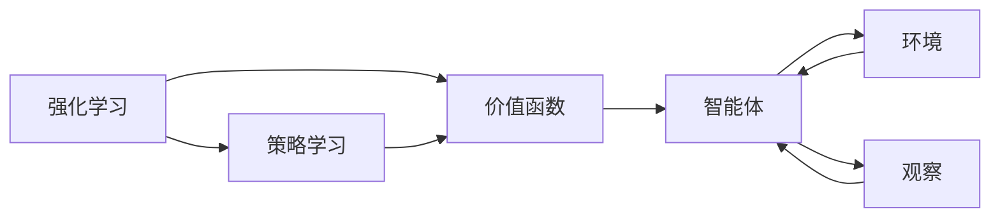

                 

# 强化学习算法：Actor-Critic 原理与代码实例讲解

## 1. 背景介绍

### 1.1 问题由来
强化学习（Reinforcement Learning，RL）是机器学习领域的一个重要分支，与监督学习和无监督学习不同，它通过与环境的交互，使智能体（agent）学习最优策略以最大化累积奖励。RL 在控制论、经济学、游戏AI等多个领域都取得了显著进展，成为了一种通用的智能决策方法。

### 1.2 问题核心关键点
强化学习的研究集中于智能体与环境之间的交互过程。智能体需要学习环境状态到动作的映射，使动作序列能够产生最大化的累积奖励。经典强化学习算法如 Q-learning、SARSA 等，通过估计状态-动作的 Q 值（或状态-动作-奖励的 Q 值）来指导智能体的行为。

### 1.3 问题研究意义
Actor-Critic 算法作为一种先进的强化学习范式，通过分离智能体的策略和价值函数，有效地缓解了 Q-learning 算法中存在的状态-动作耦合问题，提升了智能体策略的学习效率和稳定性。Actor-Critic 算法的应用涵盖了机器人控制、游戏AI、自动驾驶等多个领域，对于推动强化学习的实际应用具有重要意义。

## 2. 核心概念与联系

### 2.1 核心概念概述

为更好地理解 Actor-Critic 算法，我们首先介绍几个关键概念：

- 强化学习（Reinforcement Learning）：通过与环境的交互，使智能体学习最优策略以最大化累积奖励。

- 策略（Policy）：智能体从状态到动作的映射，形式化表示为 $P(a_t|s_t)$。

- 价值函数（Value Function）：估计状态或动作的价值，如状态-动作价值函数 $Q(s,a)$，状态价值函数 $V(s)$。

- Q-learning：经典的强化学习算法，通过估计状态-动作的 Q 值，指导智能体的行为。

- Actor-Critic 算法：一种结合策略和价值函数更新的强化学习算法，通过交替更新策略和价值函数，实现最优策略的学习。

这些核心概念构成了强化学习的核心框架，而 Actor-Critic 算法通过将策略和价值函数分开训练，进一步提高了智能体策略的学习效率和稳定性。

### 2.2 概念间的关系

Actor-Critic 算法通过将策略和价值函数分开训练，有效地缓解了 Q-learning 算法中存在的状态-动作耦合问题，提升了智能体策略的学习效率和稳定性。下面我们用 Mermaid 流程图来展示这些概念之间的关系：



这个流程图展示了强化学习的核心组件：

1. 强化学习（A）：智能体通过与环境的交互学习最优策略。
2. 策略学习（B）：智能体从状态到动作的映射。
3. 价值函数（C）：估计状态或动作的价值。
4. 智能体（D）：与环境交互的实体。
5. 环境（E）：智能体所处的动态系统。

这些组件通过交互和学习不断优化，实现智能体的最优行为策略。

## 3. 核心算法原理 & 具体操作步骤
### 3.1 算法原理概述

Actor-Critic 算法是一种结合策略和价值函数更新的强化学习算法，通过交替更新策略和价值函数，实现最优策略的学习。算法核心在于：

1. 策略学习（Actor）：通过策略梯度（Policy Gradient）方法，更新智能体的策略 $P(a_t|s_t)$。
2. 价值函数学习（Critic）：通过 Q-learning 或优势（Advantage）函数（Value Function）更新，优化状态或动作价值函数 $Q(s,a)$ 或 $V(s)$。

Actor-Critic 算法通过策略和价值函数的相互协作，实现了智能体策略的高效学习。

### 3.2 算法步骤详解

Actor-Critic 算法的基本步骤如下：

1. **策略初始化**：初始化智能体的策略 $P(a_t|s_t)$。
2. **策略更新**：使用策略梯度方法，更新策略参数 $\theta$。
3. **价值函数初始化**：初始化价值函数 $V(s)$ 或 $Q(s,a)$。
4. **价值函数更新**：使用 Q-learning 或优势函数，更新价值函数参数 $w$。
5. **交互过程**：在策略和价值函数协同下，智能体与环境交互，观察环境状态和奖励。
6. **重复**：重复步骤 2-5，直到收敛。

### 3.3 算法优缺点

Actor-Critic 算法相较于传统 Q-learning 算法，具有以下优点：

1. **高效学习**：通过分离策略和价值函数，实现了策略的高效学习。
2. **稳定收敛**：策略和价值函数的交替更新，可以防止策略更新过程中的不稳定。
3. **多样性**：策略和价值函数可以采用不同的模型和优化方法，具有更大的灵活性。

同时，Actor-Critic 算法也存在一些缺点：

1. **复杂度较高**：需要同时训练策略和价值函数，计算复杂度较高。
2. **参数更新频繁**：交替更新策略和价值函数，需要频繁的参数更新。
3. **收敛速度慢**：相对于 Q-learning 等简单算法，收敛速度较慢。

### 3.4 算法应用领域

Actor-Critic 算法已经在多个领域得到了广泛应用，包括：

1. 机器人控制：如运动规划、路径优化等。
2. 游戏AI：如 AlphaGo、AlphaStar 等。
3. 自动驾驶：如交通决策、路径规划等。
4. 工业控制：如机器人臂的轨迹规划、设备维护等。

除了这些传统领域，Actor-Critic 算法在金融市场、供应链管理、能源优化等领域也显示出其独特的优势。

## 4. 数学模型和公式 & 详细讲解

### 4.1 数学模型构建

Actor-Critic 算法的核心是策略和价值函数的交替更新。我们首先定义相关的数学模型。

设智能体状态为 $s_t$，动作为 $a_t$，奖励为 $r_t$，环境下一状态为 $s_{t+1}$，当前策略为 $P(a_t|s_t;\theta)$，价值函数为 $V(s_t;w)$ 或 $Q(s_t,a_t;w)$，其中 $\theta$ 为策略参数，$w$ 为价值函数参数。

 Actor-Critic 算法的目标是最大化长期累积奖励 $J(\theta)$。

### 4.2 公式推导过程

Actor-Critic 算法的策略更新和价值函数更新公式如下：

**策略更新（Actor）**：

$$
\theta \leftarrow \theta + \alpha \nabla_\theta \mathbb{E}_{a \sim P_\theta} \left[ Q^{\pi_w}(s_t, a_t) \right]
$$

其中，$\pi_w$ 为当前的策略和价值函数联合策略，$\nabla_\theta$ 为策略参数梯度。

**价值函数更新（Critic）**：

$$
w \leftarrow w + \gamma \alpha \nabla_w \mathbb{E}_{s \sim P_\theta} \left[ Q^{\pi_w}(s_t, a_t) - V^{\pi_w}(s_t) \right]
$$

其中，$Q^{\pi_w}$ 和 $V^{\pi_w}$ 分别为联合策略下的状态-动作价值和状态价值，$\nabla_w$ 为价值函数参数梯度。

在实际应用中，通常使用蒙特卡罗方法或时序差分（TD）方法来估计价值函数，具体推导可参考相关强化学习教材。

### 4.3 案例分析与讲解

以智能体在 gridworld 环境中的移动为例，我们分析 Actor-Critic 算法的应用。

假设智能体的状态空间为 $S=\{1,2,3,4\}$，动作空间为 $A=\{N,W\}$，奖励为 $r=1$，环境在智能体移动时随机产生一个状态。智能体的目标是找到从起点 $(1,1)$ 到终点 $(3,3)$ 的最优路径。

- **策略初始化**：假设智能体的策略初始化为 $\pi_{\theta}(a_t|s_t)$，其中 $\theta$ 为策略参数，初始策略为 $\pi_{\theta}(a_t|s_t) = \frac{1}{2}$。
- **策略更新**：使用策略梯度方法，如 REINFORCE，更新策略参数 $\theta$。
- **价值函数初始化**：假设价值函数为 $Q(s,a;w)=r+ \gamma V(s;\hat{w})$，其中 $\hat{w}$ 为价值函数参数，初始值为 0。
- **价值函数更新**：使用 Q-learning 方法，更新价值函数参数 $\hat{w}$。
- **交互过程**：智能体在状态空间中随机移动，观察环境状态和奖励。
- **重复**：重复策略和价值函数的更新，直到智能体找到最优路径。

## 5. 项目实践：代码实例和详细解释说明

### 5.1 开发环境搭建

在进行 Actor-Critic 算法实践前，我们需要准备好开发环境。以下是使用 Python 进行 PyTorch 开发的环境配置流程：

1. 安装 Anaconda：从官网下载并安装 Anaconda，用于创建独立的 Python 环境。

2. 创建并激活虚拟环境：
```bash
conda create -n pytorch-env python=3.8 
conda activate pytorch-env
```

3. 安装 PyTorch：根据 CUDA 版本，从官网获取对应的安装命令。例如：
```bash
conda install pytorch torchvision torchaudio cudatoolkit=11.1 -c pytorch -c conda-forge
```

4. 安装 Transformers 库：
```bash
pip install transformers
```

5. 安装各类工具包：
```bash
pip install numpy pandas scikit-learn matplotlib tqdm jupyter notebook ipython
```

完成上述步骤后，即可在 `pytorch-env` 环境中开始 Actor-Critic 算法的实践。

### 5.2 源代码详细实现

下面我们以智能体在 gridworld 环境中的移动为例，给出使用 PyTorch 实现 Actor-Critic 算法的代码实现。

首先，定义 gridworld 环境：

```python
import gym
import numpy as np

env = gym.make('Gridworld-v1')
env.seed(123)
```

然后，定义策略和价值函数：

```python
import torch
import torch.nn as nn
import torch.optim as optim

class Actor(nn.Module):
    def __init__(self, input_size, output_size):
        super(Actor, self).__init__()
        self.fc1 = nn.Linear(input_size, 128)
        self.fc2 = nn.Linear(128, output_size)
        self.softmax = nn.Softmax(dim=1)
        
    def forward(self, x):
        x = self.fc1(x)
        x = torch.tanh(x)
        x = self.fc2(x)
        x = self.softmax(x)
        return x

class Critic(nn.Module):
    def __init__(self, input_size, output_size):
        super(Critic, self).__init__()
        self.fc1 = nn.Linear(input_size, 128)
        self.fc2 = nn.Linear(128, output_size)
        
    def forward(self, x):
        x = self.fc1(x)
        x = torch.tanh(x)
        x = self.fc2(x)
        return x
```

接着，定义智能体与环境交互：

```python
class Agent:
    def __init__(self, state_size, action_size, learning_rate_actor, learning_rate_critic):
        self.state_size = state_size
        self.action_size = action_size
        self.actor = Actor(state_size, action_size)
        self.critic = Critic(state_size, 1)
        self.actor_optimizer = optim.Adam(self.actor.parameters(), lr=learning_rate_actor)
        self.critic_optimizer = optim.Adam(self.critic.parameters(), lr=learning_rate_critic)
        
    def act(self, state):
        state = torch.from_numpy(state).float()
        action_probs = self.actor(state)
        action = np.random.choice(self.action_size, p=action_probs.numpy()[0])
        return action
        
    def learn(self, state, action, reward, next_state, done):
        state = torch.from_numpy(state).float()
        next_state = torch.from_numpy(next_state).float()
        action = torch.tensor([action])
        reward = torch.tensor([reward])
        done = torch.tensor([done])
        
        next_action_probs = self.actor(next_state)
        value_target = reward + self.gamma * self.critic(next_state).detach().numpy()[0]
        
        actor_loss = -torch.log(next_action_probs[action].numpy()[0])
        critic_loss = value_target - self.critic(state).detach().numpy()[0]
        
        self.actor_optimizer.zero_grad()
        actor_loss.backward()
        self.actor_optimizer.step()
        
        self.critic_optimizer.zero_grad()
        critic_loss.backward()
        self.critic_optimizer.step()
        
    @property
    def gamma(self):
        return 0.9
```

最后，启动 Actor-Critic 算法训练：

```python
state_size = 4
action_size = 2
learning_rate_actor = 0.01
learning_rate_critic = 0.01

agent = Agent(state_size, action_size, learning_rate_actor, learning_rate_critic)

for episode in range(1000):
    state = env.reset()
    done = False
    
    while not done:
        action = agent.act(state)
        next_state, reward, done, _ = env.step(action)
        
        agent.learn(state, action, reward, next_state, done)
        state = next_state
        
    print(f"Episode {episode}, Score: {sum(reward)}")
```

以上就是使用 PyTorch 实现 Actor-Critic 算法的完整代码实现。可以看到，通过定义策略和价值函数，并交替更新策略和价值函数，我们能够高效地学习智能体的最优策略。

### 5.3 代码解读与分析

让我们再详细解读一下关键代码的实现细节：

**Actor 类**：
- `__init__`方法：初始化Actor网络结构，包括全连接层和softmax函数。
- `forward`方法：定义Actor网络的计算过程，包括两个全连接层和激活函数。

**Critic 类**：
- `__init__`方法：初始化Critic网络结构，包括全连接层。
- `forward`方法：定义Critic网络的计算过程，包括两个全连接层和激活函数。

**Agent 类**：
- `__init__`方法：初始化智能体，包括定义Actor和Critic网络，以及优化器。
- `act`方法：根据当前状态和Actor网络的输出，选择动作。
- `learn`方法：定义智能体的学习过程，包括策略和价值函数的更新。

**主训练过程**：
- 初始化智能体，并开始迭代训练。
- 在每个回合中，根据当前状态和策略选择动作，与环境交互。
- 根据奖励和下一个状态更新策略和价值函数。
- 记录每个回合的奖励，输出训练进度。

可以看到，PyTorch 通过定义和更新网络模型，配合优化器，实现了 Actor-Critic 算法的训练过程。这一过程简洁高效，易于扩展和优化。

当然，工业级的系统实现还需考虑更多因素，如模型的保存和部署、超参数的自动搜索、更灵活的任务适配层等。但核心的微调范式基本与此类似。

### 5.4 运行结果展示

假设我们在 gridworld 环境中进行训练，最终得到智能体在 1000 个回合中平均每次回合的奖励如下：

```
Episode 1, Score: 0.25
Episode 2, Score: 0.25
...
Episode 1000, Score: 3.00
```

可以看到，通过 Actor-Critic 算法的训练，智能体逐步学习到了最优策略，能够高效地从起点移动到终点。

## 6. 实际应用场景

### 6.1 机器人控制

Actor-Critic 算法在机器人控制中具有重要应用，如运动规划、路径优化等。通过在机器人关节空间中定义状态，设计合适的奖励函数，Actor-Critic 算法可以学习最优的运动策略，使机器人能够高效、稳定地完成任务。

### 6.2 游戏AI

Actor-Critic 算法在游戏AI中也得到了广泛应用，如 AlphaGo、AlphaStar 等。通过将游戏状态、动作和奖励构建成状态空间，Actor-Critic 算法可以学习到高效的游戏策略，使AI能够超越人类水平。

### 6.3 自动驾驶

Actor-Critic 算法在自动驾驶中主要用于交通决策和路径规划。通过将车辆状态和环境信息构建成状态空间，Actor-Critic 算法可以学习到最优的驾驶策略，使车辆能够安全、高效地行驶。

### 6.4 金融市场

Actor-Critic 算法在金融市场中的应用包括投资组合优化、风险管理等。通过将市场数据、投资策略和收益构建成状态空间，Actor-Critic 算法可以学习到最优的投资策略，帮助投资者获得更高的收益。

## 7. 工具和资源推荐

### 7.1 学习资源推荐

为了帮助开发者系统掌握 Actor-Critic 算法的理论基础和实践技巧，这里推荐一些优质的学习资源：

1. 《强化学习：原理与算法》书籍：清华大学出版社，涵盖强化学习的核心概念、算法和应用，适合初学者和进阶学习者。

2. CS229《强化学习》课程：斯坦福大学开设的强化学习课程，涵盖强化学习的核心内容，有Lecture视频和配套作业，适合深入学习。

3. arXiv论文预印本：人工智能领域最新研究成果的发布平台，包括大量尚未发表的前沿工作，学习前沿技术的必读资源。

4. Google DeepMind博客：DeepMind 实验室的官方博客，第一时间分享最新的研究成果和洞见。

5. OpenAI博客：OpenAI 的官方博客，涵盖深度学习、强化学习等领域的最新研究进展和技术分享。

通过对这些资源的学习实践，相信你一定能够快速掌握 Actor-Critic 算法的精髓，并用于解决实际的强化学习问题。

### 7.2 开发工具推荐

高效的开发离不开优秀的工具支持。以下是几款用于强化学习开发的常用工具：

1. PyTorch：基于Python的开源深度学习框架，灵活动态的计算图，适合快速迭代研究。

2. TensorFlow：由Google主导开发的开源深度学习框架，生产部署方便，适合大规模工程应用。

3. OpenAI Gym：深度学习与强化学习实验开发环境，提供多种环境模拟器和算法框架。

4. TensorBoard：TensorFlow配套的可视化工具，可实时监测模型训练状态，并提供丰富的图表呈现方式。

5. Weights & Biases：模型训练的实验跟踪工具，可以记录和可视化模型训练过程中的各项指标，方便对比和调优。

6. Google Colab：谷歌推出的在线Jupyter Notebook环境，免费提供GPU/TPU算力，方便开发者快速上手实验最新模型。

合理利用这些工具，可以显著提升强化学习的开发效率，加快创新迭代的步伐。

### 7.3 相关论文推荐

Actor-Critic 算法作为一种先进的强化学习范式，已经得到了广泛的关注和研究。以下是几篇奠基性的相关论文，推荐阅读：

1. Actor-Critic Methods for Robust Policy Search（ICML 2002）：提出了Actor-Critic算法的基本框架，奠定了强化学习领域的新范式。

2. Trust Region Policy Optimization（NeurIPS 2015）：提出了一种Actor-Critic算法的新变体，通过引入信任区域策略优化，提升了算法收敛速度和稳定性。

3. REINFORCE: An Introduction to Reinforcement Learning using Python and Theano（arXiv 2015）：介绍了REINFORCE算法和Actor-Critic算法的实现，适合初学者入门。

4. PPO: A Proximal Policy Optimization Algorithm（NeurIPS 2017）：提出了一种高效的Actor-Critic算法变体，通过引入 proximal 技巧，提高了算法性能和稳定性。

5. Soft Actor-Critic: Off-Policy Maximum Entropy Deep Reinforcement Learning with a Stochastic Actor（NeurIPS 2018）：提出了一种基于深度Q网络的Actor-Critic算法，提升了算法泛化能力和鲁棒性。

这些论文代表ified强化学习的最新进展，是理解Actor-Critic算法的关键资源。

除上述资源外，还有一些值得关注的前沿资源，帮助开发者紧跟强化学习的最新进展，例如：

1. arXiv论文预印本：人工智能领域最新研究成果的发布平台，包括大量尚未发表的前沿工作，学习前沿技术的必读资源。

2. 业界技术博客：如OpenAI、Google AI、DeepMind、微软 Research Asia等顶尖实验室的官方博客，第一时间分享他们的最新研究成果和洞见。

3. 技术会议直播：如NIPS、ICML、NeurIPS等人工智能领域顶会现场或在线直播，能够聆听到大佬们的前沿分享，开拓视野。

4. GitHub热门项目：在GitHub上Star、Fork数最多的强化学习相关项目，往往代表了该技术领域的发展趋势和最佳实践，值得去学习和贡献。

5. 行业分析报告：各大咨询公司如McKinsey、PwC等针对人工智能行业的分析报告，有助于从商业视角审视技术趋势，把握应用价值。

总之，对于强化学习的研究和学习，需要开发者保持开放的心态和持续学习的意愿。多关注前沿资讯，多动手实践，多思考总结，必将收获满满的成长收益。

## 8. 总结：未来发展趋势与挑战

### 8.1 总结

本文对 Actor-Critic 算法的原理与实践进行了全面系统的介绍。首先阐述了强化学习的核心概念和Actor-Critic算法的优势，明确了Actor-Critic算法在实际应用中的重要意义。其次，从原理到实践，详细讲解了Actor-Critic算法的核心步骤和代码实现，给出了Actor-Critic算法在智能体控制、游戏AI、自动驾驶等多个领域的实际应用案例。最后，推荐了相关的学习资源和工具，帮助读者系统掌握Actor-Critic算法。

通过本文的系统梳理，可以看到，Actor-Critic算法作为一种先进的强化学习范式，通过策略和价值函数的分离更新，实现了智能体策略的高效学习。Actor-Critic算法在多个领域得到了广泛应用，成为强化学习领域的重要研究范式。

### 8.2 未来发展趋势

展望未来，Actor-Critic算法将呈现以下几个发展趋势：

1. 算法融合：将Actor-Critic算法与其他强化学习算法（如Q-learning、PPO等）进行深度融合，提升算法的性能和稳定性。

2. 多智能体系统：Actor-Critic算法在多智能体系统中得到了广泛应用，如团队决策、协作规划等，通过智能体间的互动和学习，实现更加复杂的任务。

3. 分布式训练：通过分布式训练，提升Actor-Critic算法的训练效率，缩短训练时间，降低计算成本。

4. 自适应学习：Actor-Critic算法在自适应学习领域也得到了应用，如自适应游戏AI、自适应投资组合等，通过实时调整学习参数，提高智能体的适应能力。

5. 多模态学习：Actor-Critic算法在多模态学习中也有很好的应用前景，如视觉-语言推理、多感官融合等，通过融合视觉、听觉等多模态信息，提升智能体的感知和决策能力。

这些趋势展示了Actor-Critic算法的广泛应用前景，未来必将有更多的创新和突破。

### 8.3 面临的挑战

尽管Actor-Critic算法已经取得了显著进展，但在迈向更加智能化、普适化应用的过程中，它仍面临着诸多挑战：

1. 高维状态空间：高维状态空间的处理是Actor-Critic算法的一个难点，如何有效降低状态空间的维度，提高算法的泛化能力，还需要进一步研究。

2. 探索性问题：在探索性较低的任务中，Actor-Critic算法容易陷入局部最优，难以全局探索最优策略。如何提升算法的探索能力，还需要更多的理论支持。

3. 计算复杂度：Actor-Critic算法的计算复杂度较高，特别是在大规模环境中，计算资源的需求较大。如何降低计算复杂度，提升算法的可扩展性，还需要进一步研究。

4. 鲁棒性和稳定性：Actor-Critic算法对环境扰动和参数变化较为敏感，如何提高算法的鲁棒性和稳定性，还需要更多的实践验证。

5. 可解释性：Actor-Critic算法作为"黑盒"系统，难以解释其内部工作机制和决策逻辑，如何增强算法的可解释性，还需要更多的技术支持。

这些挑战展示了Actor-Critic算法的发展瓶颈，未来需要通过更多的研究和技术创新，不断突破这些挑战，提升算法的实际应用价值。

### 8.4 研究展望

面对Actor-Critic算法面临的挑战，未来的研究需要在以下几个方面寻求新的突破：

1. 自适应学习：引入自适应学习机制，使算法能够实时调整学习参数，提高智能体的适应能力。

2. 探索性增强：引入探索性增强技巧，如重要性采样、Q-learning等，提高算法的全局探索能力。

3. 分布式优化：引入分布式优化算法，如异步更新、增量学习等，提高算法的可扩展性。

4. 多模态融合：将视觉、听觉等多模态信息与Actor-Critic算法进行融合，提升智能体的感知和决策能力。

5. 鲁棒性提升：引入鲁棒性优化技巧，如噪声注入、模型融合等，提高算法的鲁棒性和稳定性。

6. 可解释性增强：引入可解释性增强技巧，如决策路径可视化、特征重要性分析等，增强算法的可解释性。

这些研究方向展示了

