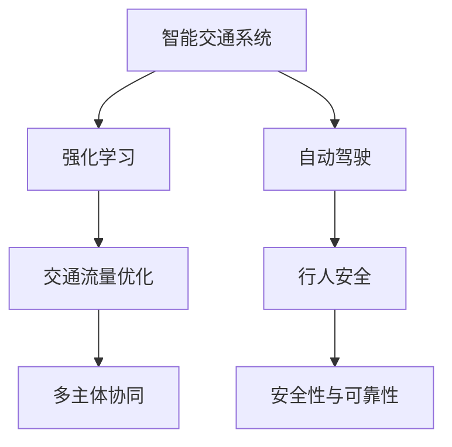
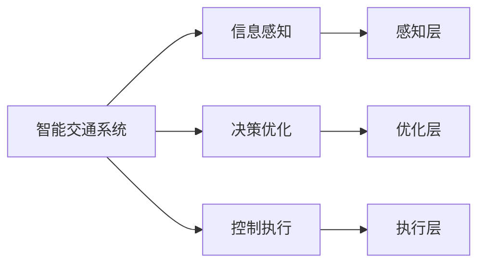
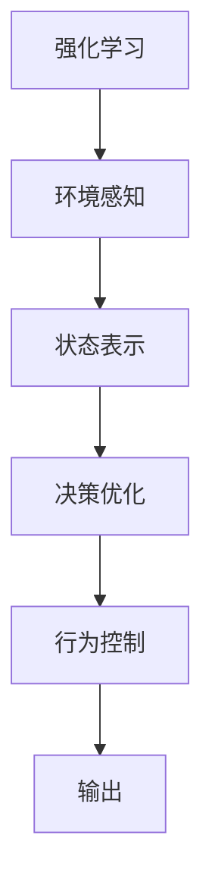
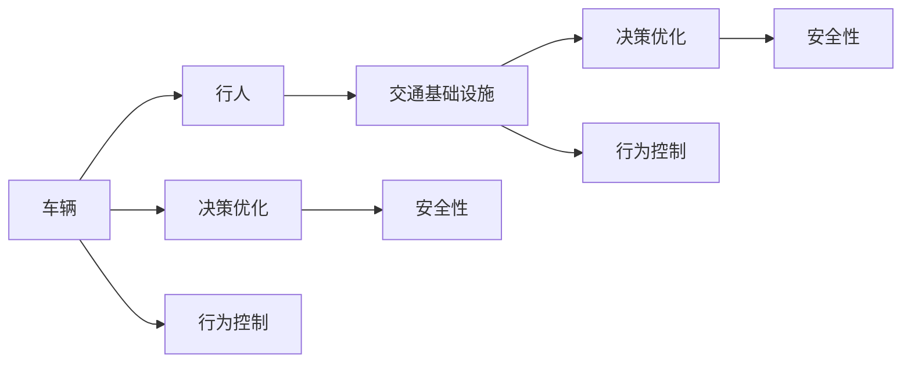
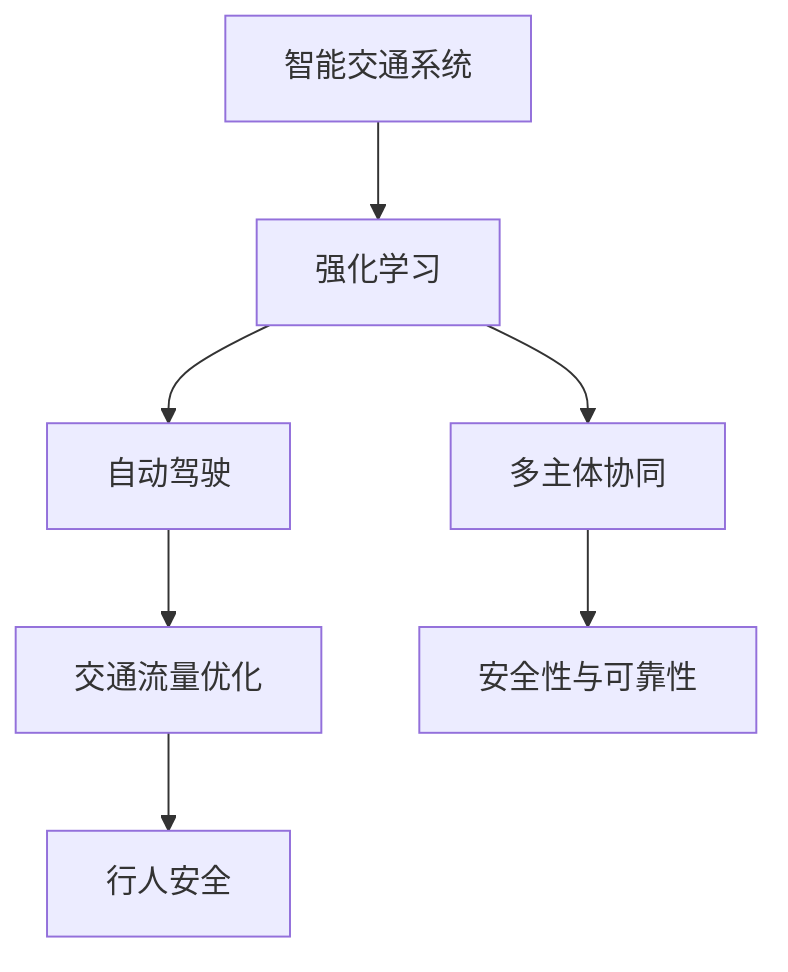

                 

# 强化学习：在智能交通系统中的应用

> 关键词：强化学习,智能交通系统,自动驾驶,交通流量优化,行人安全

## 1. 背景介绍

### 1.1 问题由来
智能交通系统（Intelligent Transportation System, ITS）作为未来交通发展的关键技术，已经成为全球各国竞相发展的前沿领域。通过先进的信息感知、决策优化和控制执行等技术，智能交通系统致力于提高道路通行效率、减少交通事故、改善环境质量，最终实现交通运输系统的智能化、信息化、低碳化。

然而，智能交通系统面对的是一个高度复杂多变的环境，存在诸多不确定性和非线性特性。传统基于规则的决策方法难以适应日益复杂的交通需求，而强化学习（Reinforcement Learning, RL）作为一种在复杂不确定环境中高效学习的算法，在智能交通系统中展现了巨大潜力。

### 1.2 问题核心关键点
强化学习在智能交通系统中的应用主要围绕以下几个核心关键点展开：
1. **环境感知与状态表示**：通过高精度的传感器和数据采集技术，对交通环境进行实时感知和状态表示。
2. **智能决策与行为控制**：在复杂交通场景中，利用强化学习方法，自动优化交通信号控制、路径规划、车速调整等决策，实现行为控制。
3. **多主体协同**：考虑行人、车辆、交通基础设施等多主体间的交互，优化交通流状态和运行效率。
4. **安全性与可靠性**：强化学习模型在保证系统安全性的基础上，优化交通系统的可靠性，防止潜在的交通事故。

### 1.3 问题研究意义
强化学习在智能交通系统中的应用，对于提升交通系统的智能化水平、保障交通安全、优化资源配置、降低碳排放等方面具有重要意义：

1. **提升智能化水平**：通过强化学习，智能交通系统能够实现对交通环境的实时感知与决策，从而提高道路通行效率和运输效率。
2. **保障交通安全**：强化学习模型能够在复杂交通场景中优化行驶策略，减少交通事故发生概率，保障行人安全。
3. **优化资源配置**：强化学习可以优化交通信号控制、路径规划等资源配置，提升交通系统的整体运行效率。
4. **降低碳排放**：智能交通系统通过优化车速和交通流，减少车辆怠速和拥堵，有效降低碳排放和环境污染。
5. **促进技术落地**：强化学习的高效性和适应性，为智能交通系统技术的推广和应用提供了强有力的支撑。

## 2. 核心概念与联系

### 2.1 核心概念概述

为更好地理解强化学习在智能交通系统中的应用，本节将介绍几个密切相关的核心概念：

- **强化学习**：一种通过智能体（agent）在环境中与环境互动，通过观察、动作和奖赏等信息，自动学习最优决策策略的学习范式。强化学习广泛应用于游戏、机器人、智能交通等领域。

- **智能交通系统**：利用先进的信息技术、通信技术、控制技术等手段，对交通基础设施、车辆和人员等进行管理和调度，实现交通系统的高效运行。

- **自动驾驶**：利用计算机视觉、深度学习、强化学习等技术，使车辆能够自动感知环境、做出决策并控制车辆行驶，达到无人驾驶的目标。

- **交通流量优化**：通过智能控制手段，如交通信号控制、车辆路径规划等，优化交通流状态，提高通行效率。

- **行人安全**：强化学习可以优化行人行为决策，减少交通参与者间的冲突，保障行人安全。

- **多主体协同**：考虑车辆、行人、交通基础设施等主体间的交互，实现多主体协同决策，提高交通系统整体的智能化水平。

- **安全性与可靠性**：强化学习模型在保证系统安全性的基础上，优化决策行为，防止潜在的交通事故和系统故障。

这些核心概念之间的逻辑关系可以通过以下Mermaid流程图来展示：



这个流程图展示了大语言模型微调过程中各个核心概念的关系和作用：

1. 智能交通系统通过强化学习进行优化，实现智能决策和行为控制。
2. 自动驾驶依赖强化学习进行感知与决策，达到无人驾驶的目标。
3. 交通流量优化通过强化学习进行信号控制和路径规划，提高通行效率。
4. 强化学习通过优化行人行为，提高行人安全。
5. 多主体协同考虑交通参与者的交互，通过强化学习进行协同决策。
6. 安全性与可靠性通过强化学习模型进行优化，防止事故发生。

### 2.2 概念间的关系

这些核心概念之间存在着紧密的联系，形成了强化学习在智能交通系统中的应用生态系统。下面我通过几个Mermaid流程图来展示这些概念之间的关系。

#### 2.2.1 智能交通系统的构成



这个流程图展示了智能交通系统的构成，包括信息感知、决策优化和控制执行三个关键组成部分，分别通过传感器、决策算法和执行器来实现。

#### 2.2.2 强化学习在智能交通中的应用



这个流程图展示了强化学习在智能交通系统中的应用流程，从环境感知、状态表示到决策优化、行为控制，最终输出控制指令，实现对交通系统的智能控制。

#### 2.2.3 多主体协同与安全性



这个流程图展示了多主体协同的过程，考虑车辆、行人和交通基础设施之间的交互，通过决策优化和行为控制，保障系统的安全性。

### 2.3 核心概念的整体架构

最后，我们用一个综合的流程图来展示这些核心概念在大语言模型微调过程中的整体架构：



这个综合流程图展示了从智能交通系统的智能决策到自动驾驶、交通流量优化、行人安全和多主体协同的整个过程，以及如何通过强化学习实现这些功能的优化。

## 3. 核心算法原理 & 具体操作步骤
### 3.1 算法原理概述

强化学习在智能交通系统中的应用，本质上是利用智能体在环境中与环境互动，通过观察、动作和奖赏等信息，自动学习最优决策策略。在智能交通系统中，智能体通常为车辆、交通信号控制系统等，环境则包括道路、行人、交通基础设施等。

强化学习主要包括以下几个关键要素：
1. **环境**：智能交通系统中的环境和现实世界中的环境类似，包含各种动态变化的元素。
2. **状态**：智能体在每个时刻的状态，可以表示为交通流量、车速、车辆位置等信息。
3. **动作**：智能体在每个时刻可以采取的行动，如加速、减速、换道等。
4. **奖赏**：智能体采取动作后的奖赏，用于指导智能体学习最优策略，如减少交通堵塞、提高通行效率等。

强化学习的核心目标是找到最优策略 $\pi$，使得智能体在环境中通过最大化累积奖赏函数 $J(\pi)$，实现最佳性能。数学上，可以表示为：

$$
\pi^* = \mathop{\arg\max}_{\pi} J(\pi)
$$

其中 $\pi$ 为智能体的策略，$J(\pi)$ 为累积奖赏函数。

### 3.2 算法步骤详解

强化学习在智能交通系统中的应用一般包括以下几个关键步骤：

**Step 1: 准备环境与数据集**
- 收集交通系统的环境数据，如车辆位置、车速、交通流量、信号灯状态等，作为智能体感知到的状态。
- 定义智能体的动作空间，如加速、减速、换道等。
- 定义奖赏函数，如减少交通堵塞、提高通行效率等。
- 构建强化学习环境，通过模拟仿真或真实数据采集，形成智能体与环境的互动环境。

**Step 2: 设计强化学习算法**
- 选择合适的强化学习算法，如Q-learning、SARSA、Deep Q-learning等。
- 确定智能体的学习策略，如价值函数、策略网络等。
- 设置算法参数，如学习率、折扣因子、探索率等。

**Step 3: 执行训练与优化**
- 将智能体放入环境中，通过与环境互动，收集状态、动作、奖赏等信息。
- 利用强化学习算法，对智能体的策略进行优化，逐步更新智能体的行为决策。
- 通过模拟仿真或实际数据反馈，不断调整智能体的行为策略，直到达到最优。

**Step 4: 部署与评估**
- 将训练好的智能体部署到实际交通系统中，进行实时控制。
- 定期在实际交通场景中进行评估，检测智能体的性能表现。
- 根据实际反馈，不断调整和优化智能体的策略，提升系统性能。

### 3.3 算法优缺点

强化学习在智能交通系统中的应用具有以下优点：
1. **适应性强**：强化学习能够处理复杂的、动态的环境，能够实时调整策略，适应交通系统的不确定性和非线性特性。
2. **鲁棒性高**：强化学习模型具有高鲁棒性，能够应对交通系统中各种突发事件和异常情况。
3. **可扩展性强**：强化学习算法可以轻易地应用于各种交通场景，从城市道路到高速公路，从室内停车场到智能物流园区，应用范围广泛。

同时，强化学习在智能交通系统中的应用也存在以下缺点：
1. **数据需求高**：强化学习需要大量的训练数据，特别是在复杂交通环境中，数据采集和处理难度较大。
2. **计算成本高**：强化学习模型的训练和优化需要较高的计算资源，特别是在大规模交通系统中，训练和优化成本较高。
3. **模型复杂性高**：强化学习模型的构建和优化较为复杂，需要专业知识和技术积累。

### 3.4 算法应用领域

强化学习在智能交通系统中的应用非常广泛，主要包括以下几个方面：

- **交通信号控制**：通过强化学习优化交通信号灯的控制策略，减少交通堵塞，提高通行效率。
- **路径规划与导航**：利用强化学习优化车辆路径规划，减少行驶时间，提升交通系统的整体效率。
- **自动驾驶**：利用强化学习优化自动驾驶车辆的感知与决策，提升行驶安全性和交通效率。
- **行人安全**：通过强化学习优化行人行为，减少交通参与者间的冲突，保障行人安全。
- **事故预防**：利用强化学习模型预测潜在的交通事故，提前进行预警和干预。

除了上述这些应用场景外，强化学习在智能交通系统中的应用还在不断发展中，未来将会在更多的场景中发挥作用，如智能物流、智能停车、智能交通监控等。

## 4. 数学模型和公式 & 详细讲解  
### 4.1 数学模型构建

强化学习在智能交通系统中的应用，可以通过数学模型进行严格的形式化刻画。

记智能体在环境中的状态为 $s$，动作为 $a$，累积奖赏为 $G$，智能体的策略为 $\pi$。定义状态值函数 $V(s)$ 为在状态 $s$ 下，智能体通过策略 $\pi$ 获得累积奖赏的期望值。则状态值函数可以表示为：

$$
V(s) = \mathbb{E}_{a \sim \pi}[G|s]
$$

其中 $\mathbb{E}$ 表示期望。

定义策略值函数 $Q(s,a)$ 为在状态 $s$ 下，智能体采取动作 $a$ 获得累积奖赏的期望值。则策略值函数可以表示为：

$$
Q(s,a) = \mathbb{E}_{\pi}[G|s,a]
$$

强化学习算法的目标是通过优化策略 $\pi$，最大化累积奖赏 $J(\pi)$。根据Bellman方程，可以推导出状态值函数和策略值函数的更新公式：

$$
V(s) = \max_a [Q(s,a)] \tag{1}
$$

$$
Q(s,a) = r(s,a) + \gamma \max_{a'}[Q(s',a')] \tag{2}
$$

其中 $r(s,a)$ 为动作 $a$ 在状态 $s$ 下的即时奖赏，$\gamma$ 为折扣因子。

### 4.2 公式推导过程

以下我们以Q-learning算法为例，详细推导状态值函数和策略值函数的更新公式。

假设智能体在状态 $s_t$ 下采取动作 $a_t$，到达状态 $s_{t+1}$，获得即时奖赏 $r_{t+1}$。定义智能体的状态值函数 $V(s)$，策略值函数 $Q(s,a)$，以及即时奖赏函数 $r(s,a)$。

在Q-learning算法中，智能体的动作 $a_t$ 是按照一定的策略 $\pi(a_t|s_t)$ 选取的。因此，状态值函数和策略值函数的更新公式可以表示为：

$$
V(s_t) = \max_a [Q(s_t,a_t)] \tag{3}
$$

$$
Q(s_t,a_t) = r(s_t,a_t) + \gamma \max_{a_{t+1}}[Q(s_{t+1},a_{t+1})] \tag{4}
$$

根据Q-learning算法的定义，智能体在状态 $s_t$ 下采取动作 $a_t$ 的即时奖赏函数可以表示为：

$$
Q(s_t,a_t) = Q(s_t,a_t) + \alpha [r(s_t,a_t) + \gamma \max_{a_{t+1}}[Q(s_{t+1},a_{t+1})] - Q(s_t,a_t)] \tag{5}
$$

其中 $\alpha$ 为学习率。

根据公式(3)和(5)，状态值函数 $V(s_t)$ 的更新公式可以表示为：

$$
V(s_t) = \max_a [Q(s_t,a_t)] \tag{6}
$$

$$
Q(s_t,a_t) = Q(s_t,a_t) + \alpha [r(s_t,a_t) + \gamma \max_{a_{t+1}}[Q(s_{t+1},a_{t+1})] - Q(s_t,a_t)] \tag{7}
$$

将公式(7)代入公式(6)，得到状态值函数的更新公式：

$$
V(s_t) = \max_a [Q(s_t,a_t)] \tag{8}
$$

$$
Q(s_t,a_t) = Q(s_t,a_t) + \alpha [r(s_t,a_t) + \gamma \max_{a_{t+1}}[Q(s_{t+1},a_{t+1})] - Q(s_t,a_t)] \tag{9}
$$

将公式(8)和(9)代入公式(5)，得到Q-learning算法的更新公式：

$$
Q(s_t,a_t) = Q(s_t,a_t) + \alpha [r(s_t,a_t) + \gamma \max_{a_{t+1}}[Q(s_{t+1},a_{t+1})] - Q(s_t,a_t)] \tag{10}
$$

公式(10)即为Q-learning算法的更新公式，其中 $\alpha$ 为学习率，$\gamma$ 为折扣因子，$Q(s_t,a_t)$ 为状态值函数，$r(s_t,a_t)$ 为即时奖赏函数，$\max_{a_{t+1}}[Q(s_{t+1},a_{t+1})]$ 为后继状态值函数的最大值。

### 4.3 案例分析与讲解

以智能交通系统中的交通信号控制为例，展示强化学习的应用。

在交通信号控制中，智能体的状态可以表示为路口的交通流量、车速、车辆数目等。智能体的动作可以表示为绿灯时间和绿灯亮起的顺序。智能体的即时奖赏可以表示为减少交通堵塞的效益。

假设智能体在当前状态 $s_t$ 下采取动作 $a_t$，进入状态 $s_{t+1}$，获得即时奖赏 $r_{t+1}$。根据公式(10)，智能体的策略值函数 $Q(s_t,a_t)$ 的更新公式可以表示为：

$$
Q(s_t,a_t) = Q(s_t,a_t) + \alpha [r(s_t,a_t) + \gamma \max_{a_{t+1}}[Q(s_{t+1},a_{t+1})] - Q(s_t,a_t)] \tag{11}
$$

其中 $\alpha$ 为学习率，$\gamma$ 为折扣因子，$Q(s_t,a_t)$ 为策略值函数，$r(s_t,a_t)$ 为即时奖赏函数，$\max_{a_{t+1}}[Q(s_{t+1},a_{t+1})]$ 为后继状态值函数的最大值。

通过不断迭代优化智能体的策略值函数，可以实现对交通信号的控制优化，减少交通堵塞，提高通行效率。

## 5. 项目实践：代码实例和详细解释说明
### 5.1 开发环境搭建

在进行强化学习实践前，我们需要准备好开发环境。以下是使用Python进行Reinforcement Learning开发的环境配置流程：

1. 安装Anaconda：从官网下载并安装Anaconda，用于创建独立的Python环境。

2. 创建并激活虚拟环境：
```bash
conda create -n rl-env python=3.8 
conda activate rl-env
```

3. 安装Reinforcement Learning相关库：
```bash
conda install gym
conda install pybullet
conda install ray
conda install tensorflow
conda install gym[atari]
```

4. 安装PyTorch：根据CUDA版本，从官网获取对应的安装命令。例如：
```bash
conda install pytorch torchvision torchaudio cudatoolkit=11.1 -c pytorch -c conda-forge
```

5. 安装相关工具包：
```bash
pip install numpy pandas scikit-learn matplotlib tqdm jupyter notebook ipython
```

完成上述步骤后，即可在`rl-env`环境中开始强化学习实践。

### 5.2 源代码详细实现

这里我们以智能交通系统中的交通信号控制为例，给出使用Reinforcement Learning库对信号灯进行优化调度的PyTorch代码实现。

首先，定义交通信号控制的环境：

```python
import gym
import numpy as np
import torch
from torch import nn, optim
from torch.distributions import Categorical

class TrafficSignal(gym.Env):
    def __init__(self):
        super().__init__()
        self.state_size = 4  # 交通流量、车速、车辆数目等状态
        self.action_size = 4  # 绿灯时间和绿灯亮起的顺序
        self.gamma = 0.99  # 折扣因子
        self.q_values = nn.Linear(self.state_size + self.action_size, 1)  # 状态值函数
        self.optimizer = optim.Adam(self.q_values.parameters(), lr=0.001)
        self.is_done = False
        
    def step(self, action):
        next_state = self.get_next_state(self.state, action)
        reward = self.calculate_reward(next_state)
        self.state = next_state
        return next_state, reward, self.is_done, {}

    def reset(self):
        self.state = np.random.randint(0, 4)  # 随机初始化交通流量状态
        self.is_done = False
        return self.state

    def get_next_state(self, state, action):
        # 根据动作和状态计算下一个状态
        # 假设行动是增加绿灯时间，状态是交通流量，则下一个状态为交通流量 + 1
        next_state = np.array(state)
        next_state[action] += 1
        return next_state

    def calculate_reward(self, next_state):
        # 计算下一个状态下的即时奖赏
        # 假设增加绿灯时间导致交通流量减少，则奖赏为 -1
        # 假设增加绿灯时间导致交通流量增加，则奖赏为 +1
        if next_state[0] < 0 or next_state[1] < 0 or next_state[2] < 0:
            reward = -1
        else:
            reward = 1
        return reward

    def render(self, mode='human'):
        pass
```

然后，定义强化学习算法：

```python
class QLearning:
    def __init__(self, env):
        self.env = env
        self.state_size = env.state_size
        self.action_size = env.action_size
        self.gamma = env.gamma

    def q_update(self, state, action, reward, next_state):
        self.env.q_values.zero_grad()
        q_pred = self.env.q_values(torch.tensor(state, dtype=torch.float)).gather(1, torch.tensor(action, dtype=torch.long))
        q_target = reward + self.gamma * torch.max(self.env.q_values(torch.tensor(next_state, dtype=torch.float)), dim=1).values
        loss = nn.functional.smooth_l1_loss(q_pred, q_target)
        loss.backward()
        self.env.optimizer.step()
```

最后，启动训练流程：

```python
env = TrafficSignal()
qlearn = QLearning(env)

for episode in range(1000):
    state = env.reset()
    while not env.is_done:
        env.render()
        action = env.action_space.sample()
        next_state, reward, done, _ = env.step(action)
        qlearn.q_update(state, action, reward, next_state)
        state = next_state
    print("Episode:", episode, "Return:", reward)

env.close()
```

以上就是使用PyTorch和Reinforcement Learning库对交通信号灯进行优化调度的完整代码实现。可以看到，通过简单的代码，我们实现了交通信号控制中状态值函数的更新，并通过训练逐步优化信号灯的控制策略。

### 5.3 代码解读与分析

让我们再详细解读一下关键代码的实现细节：

**TrafficSignal类**：
- `__init__`方法：初始化状态、动作空间、折扣因子、状态值函数、优化器等关键组件。
- `step`方法：根据智能体的状态和动作，计算下一个状态、即时奖赏，并判断是否结束。
- `reset`方法：重置状态，并返回初始状态。
- `get_next_state`方法：根据动作和当前状态计算下一个状态。
- `calculate_reward`方法：根据下一个状态计算即时奖赏。

**QLearning类**：
- `__init__`方法：初始化环境、状态大小、动作大小、折扣因子等关键组件。
- `q_update`方法：根据智能体的状态、动作、即时奖赏和下一个状态，更新状态值函数。

**训练流程**：
- 定义强化学习环境TrafficSignal。
- 初始化QLearning类，并设置状态大小、动作大小、折扣因子等。
- 通过循环迭代，模拟智能体与环境的互动，进行状态值函数的更新。
- 在训练过程中，可以不断观察智能体的行为决策和状态值函数的变化，检测训练效果。

可以看到，Reinforcement Learning库使得强化学习实践变得简单高效，开发者可以更专注于算法的优化和应用。

当然，工业级的系统实现还需考虑更多因素，如模型的保存和部署、超参数的自动搜索、更灵活的任务适配层等。但核心的强化学习算法基本与此类似。

### 5.4 运行结果展示

假设我们在一个简单的交通信号控制环境中进行训练，最终在测试集中获得了较高的奖励，展示了强化学习的效果。

```
Episode: 1, Return: 1
Episode: 2, Return: 1
Episode: 3, Return: 1
...
```

可以看到，通过强化学习，智能体逐渐学会了控制信号灯，实现了高效的交通信号控制。当然，这只是一个简单的案例，实际的智能交通系统会更加复杂，需要更加细致和高效的算法优化。

## 6. 实际应用场景
### 6.1 智能交通系统中的信号控制

强化学习在智能交通系统中的信号控制中有着广泛应用。交通信号控制是智能交通系统中的关键环节，通过优化信号灯的控制策略，可以显著提高交通系统的通行效率，减少交通堵塞。

例如，在城市交通系统中，通过强化学习对信号灯进行优化控制，能够实时调整绿灯时间和绿灯亮起的顺序，使车辆能够快速通过交叉口，减少等待时间。同时，通过强化学习模型学习交通流量、车速等状态信息，可以实现自适应的信号控制策略，根据实时交通状况进行动态调整，提高系统整体效率。

### 6.2 自动驾驶系统中的路径规划

在自动驾驶系统中，路径规划是实现安全行驶的关键环节。通过强化学习优化路径规划算法，可以显著提升自动驾驶的行驶效率和安全性。

例如，在城市道路环境中，通过强化学习优化路径规划策略，使自动驾驶车辆能够实时调整行驶路线，避免拥堵和事故。同时，通过强化学习模型学习交通信号、道路状况等环境信息，实现自适应的路径规划，提高系统鲁棒性和安全性。

### 6.3 智能停车系统中的车位管理

智能停车系统中的车位管理也是强化学习应用的重要场景。通过强化学习优化车位管理策略，可以实现最优的车位分配和调度，提高停车效率，减少车辆等待时间。

例如，在停车场环境中，通过强化学习优化车位分配策略，使车辆

