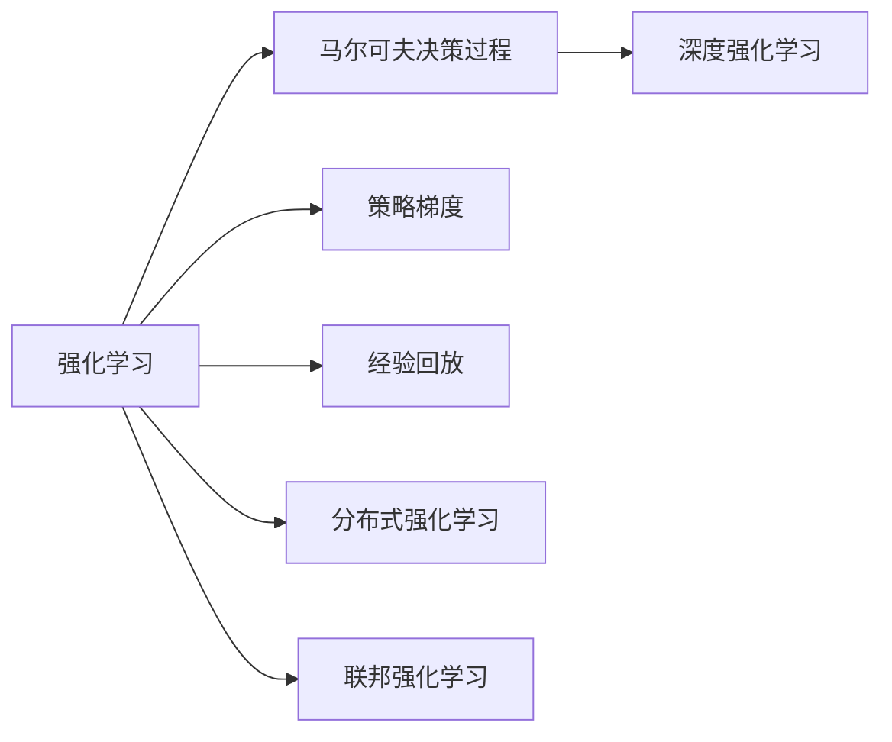
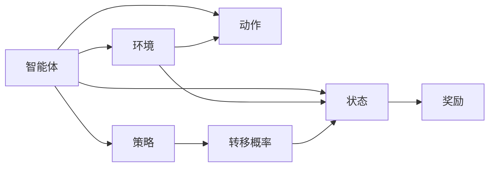
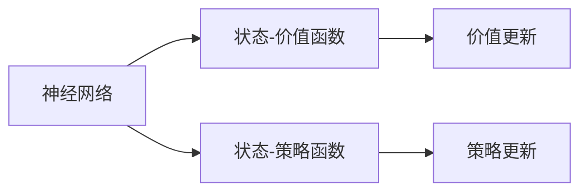
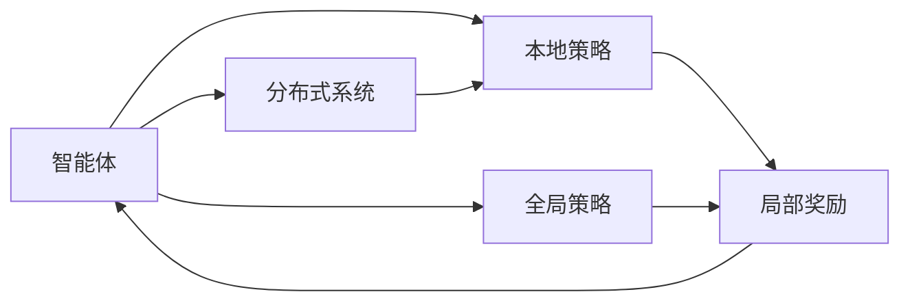
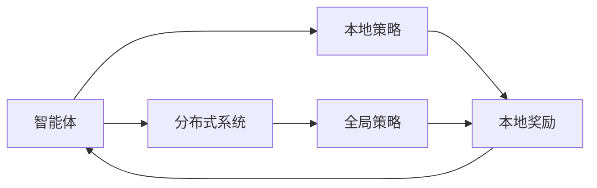
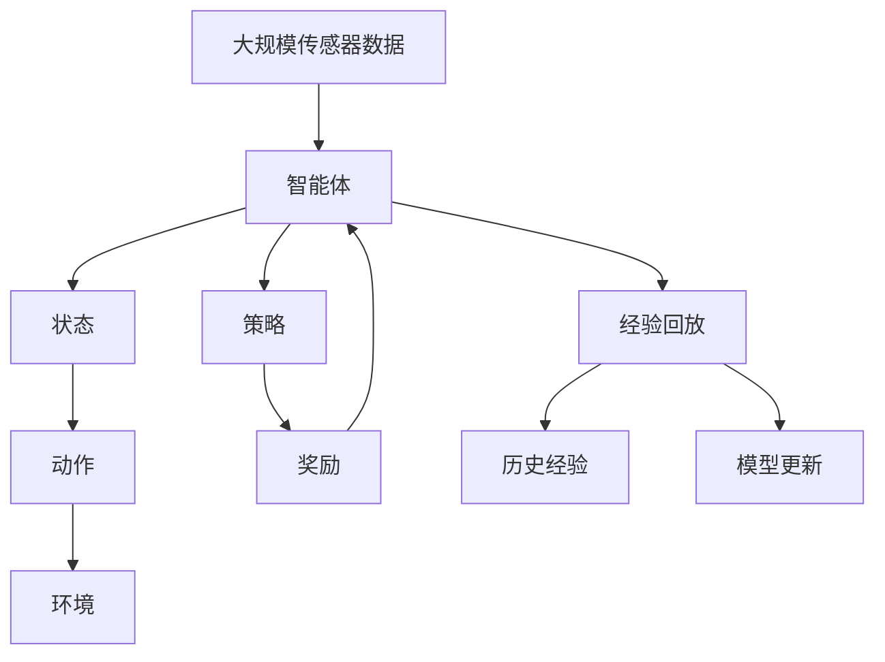

                 

## 1. 背景介绍

物联网（IoT）是指通过互联网将各种物理设备连接起来，实现实时监控、数据采集和远程控制。物联网系统复杂多样，涵盖智能家居、智慧城市、工业物联网等领域。在物联网系统中，强化学习（Reinforcement Learning, RL）因其能够在不确定环境中自主学习，逐步优化决策，展现出巨大的应用潜力。

### 1.1 问题由来

物联网系统往往包含大量的物理设备和传感器，数据量大、实时性强、数据类型多样化。传统监督学习和无监督学习难以处理这些高维度、非线性数据。强化学习通过对环境交互，逐步学习最优策略，在动态变化的环境中找到最佳决策。

### 1.2 问题核心关键点

强化学习的核心在于构建一个智能代理（智能体），通过与环境的交互学习，实现自主决策和优化。在物联网系统中，智能代理可以是智能家居中的家电设备、智慧城市中的交通信号灯、工业物联网中的自动化机器人等。智能代理在不断与环境交互的过程中，逐步学习最优策略，使得系统运行更高效、更智能。

### 1.3 问题研究意义

研究强化学习在物联网系统中的应用，对于提升物联网系统的智能化水平、降低系统运维成本、提高用户体验等方面具有重要意义：

1. 智能化控制：通过强化学习，物联网系统能够自主决策，适应环境变化，提高系统运行效率。
2. 降低运维成本：强化学习能够自我优化，减少人工干预，降低系统维护和运营成本。
3. 提升用户体验：强化学习根据用户行为反馈，不断优化系统决策，提升用户满意度。
4. 应对环境变化：物联网系统中的环境复杂多变，强化学习能够通过自主学习，适应不同环境需求。
5. 实现跨领域应用：强化学习能够应用于各种物联网场景，如智能家居、智慧城市、工业物联网等，具有广泛的应用前景。

## 2. 核心概念与联系

### 2.1 核心概念概述

为更好地理解强化学习在物联网系统中的应用，本节将介绍几个密切相关的核心概念：

- 强化学习（Reinforcement Learning, RL）：指智能体通过与环境的交互，通过奖励信号逐步学习最优策略的过程。强化学习分为模型-based和model-free两种范式，模型-free方法更为流行，以深度Q网络（Deep Q-Network, DQN）为代表。
- 马尔可夫决策过程（Markov Decision Process, MDP）：强化学习中最基本、最常见的模型框架，由状态、动作、奖励、转移概率四个要素构成。
- 深度强化学习（Deep Reinforcement Learning, DRL）：将深度学习与强化学习相结合，使用神经网络逼近价值函数和策略函数，提升模型性能。
- 策略梯度（Policy Gradient）：一种模型-free强化学习方法，通过优化策略函数，直接训练智能体选择最优动作。
- 经验回放（Experience Replay）：通过将历史经验存储在缓冲区中，重复利用数据，提高模型泛化能力。
- 分布式强化学习（Distributed Reinforcement Learning, DRL）：在分布式系统中，通过多个智能体的并行学习，提高训练效率和系统鲁棒性。
- 联邦强化学习（Federated Reinforcement Learning, FL-RL）：多节点协同学习，数据不集中存储，保护用户隐私。

这些核心概念之间的逻辑关系可以通过以下Mermaid流程图来展示：



这个流程图展示了强化学习的核心概念及其之间的关系：

1. 强化学习通过与环境的交互，学习最优策略。
2. 马尔可夫决策过程是强化学习的基础模型框架。
3. 深度强化学习通过神经网络提升模型性能。
4. 策略梯度通过优化策略函数，实现模型训练。
5. 经验回放通过重复利用历史经验，提高模型泛化能力。
6. 分布式强化学习和联邦强化学习通过多节点协同学习，提高训练效率和系统鲁棒性。

### 2.2 概念间的关系

这些核心概念之间存在着紧密的联系，形成了强化学习的完整生态系统。下面我们通过几个Mermaid流程图来展示这些概念之间的关系。

#### 2.2.1 强化学习的核心框架



这个流程图展示了强化学习的核心框架，包括智能体、环境、状态、动作、奖励、策略和转移概率等要素。智能体通过与环境的交互，在每个时间步选择动作，获得奖励，并根据转移概率更新状态，逐步学习最优策略。

#### 2.2.2 深度强化学习的实现



这个流程图展示了深度强化学习的实现过程，通过神经网络逼近状态-价值函数和状态-策略函数，实现价值和策略的更新。

#### 2.2.3 分布式强化学习的实现



这个流程图展示了分布式强化学习的实现过程，通过多智能体的并行学习，实现分布式系统的优化。

#### 2.2.4 联邦强化学习的实现



这个流程图展示了联邦强化学习的实现过程，通过多节点协同学习，实现联邦系统的优化。

### 2.3 核心概念的整体架构

最后，我们用一个综合的流程图来展示这些核心概念在物联网系统中的整体架构：



这个综合流程图展示了从传感器数据输入到物联网系统优化决策的完整过程。智能体通过与环境的交互，逐步学习最优策略，并通过经验回放机制不断优化。在分布式或联邦系统中，智能体可以并行学习，提高训练效率和系统鲁棒性。

## 3. 核心算法原理 & 具体操作步骤

### 3.1 算法原理概述

强化学习在物联网系统中的应用，本质上是将智能体引入物联网设备，通过与环境交互，自主学习最优策略的过程。具体而言，物联网设备（如智能家居设备、自动化机器人、智慧城市设施等）作为智能体，与环境（如室内环境、交通信号等）进行交互，根据环境反馈（如温度、速度等），选择最优动作（如调节温度、调整信号灯等），逐步学习最优策略，实现系统优化。

### 3.2 算法步骤详解

强化学习在物联网系统中的应用，主要包括以下几个关键步骤：

**Step 1: 设计状态和动作空间**
- 确定物联网系统的状态空间，如智能家居中的温度、湿度、用户行为等。
- 确定物联网系统的动作空间，如智能家居中的加热器开度、空调温度设定、智能门锁解锁方式等。

**Step 2: 构建环境模型**
- 根据物联网系统的需求，构建环境模型。例如，在智能家居系统中，环境模型可以包括室内环境传感器、用户行为记录等。
- 通过传感器数据和用户行为数据，实时更新环境模型，确保模型反映最新的环境状态。

**Step 3: 选择强化学习算法**
- 根据物联网系统的需求，选择合适的强化学习算法。常见的算法包括深度Q网络（DQN）、策略梯度（PG）、分布式强化学习（DRL）等。

**Step 4: 训练智能体**
- 使用训练数据集对智能体进行训练。训练过程中，智能体通过与环境交互，不断更新状态和动作策略。
- 使用经验回放机制，将历史经验存储在缓冲区中，重复利用数据，提高模型泛化能力。
- 使用分布式或联邦强化学习方法，提升训练效率和系统鲁棒性。

**Step 5: 部署和测试**
- 将训练好的智能体部署到物联网系统中，进行实时优化和控制。
- 在实际环境中进行测试，评估智能体的性能和优化效果。

### 3.3 算法优缺点

强化学习在物联网系统中的应用，具有以下优点：
1. 自主学习：通过与环境的交互，智能体能够自主学习最优策略，适应环境变化。
2. 实时优化：智能体可以实时接收环境反馈，及时调整策略，实现最优控制。
3. 数据驱动：强化学习依赖数据进行训练，能够有效利用物联网系统中的大量数据资源。

同时，强化学习也存在以下缺点：
1. 数据需求高：强化学习需要大量的历史数据进行训练，数据不足可能影响模型性能。
2. 训练复杂：强化学习的训练过程复杂，需要高效的算法和硬件支持。
3. 解释性不足：强化学习的决策过程通常缺乏可解释性，难以调试和分析。

### 3.4 算法应用领域

强化学习在物联网系统中的应用领域广泛，涵盖以下方面：

- **智能家居**：通过智能体（如智能音箱、智能灯、智能门锁等）自主学习，实现室内环境的自适应调节，提升用户居住体验。
- **智慧城市**：通过智能体（如交通信号灯、路灯、垃圾箱等）自主学习，优化城市交通和公共设施管理，提高城市运行效率。
- **工业物联网**：通过智能体（如自动化机器人、智能传感器等）自主学习，实现工业流程的优化控制，提高生产效率和安全性。
- **智能物流**：通过智能体（如无人驾驶车辆、智能仓库等）自主学习，优化物流路径和仓储管理，提升物流效率和准确性。

这些应用领域展示了强化学习在物联网系统中的巨大潜力，为物联网系统的智能化和自动化提供了新的解决方案。

## 4. 数学模型和公式 & 详细讲解 & 举例说明

### 4.1 数学模型构建

在强化学习中，使用马尔可夫决策过程（MDP）来描述智能体与环境的交互过程。MDP由状态（State）、动作（Action）、奖励（Reward）和转移概率（Transition Probability）四个要素构成。

设环境状态空间为 $S$，动作空间为 $A$，状态转移概率为 $P(s'|s,a)$，奖励函数为 $R(s,a)$。智能体在每个时间步选择动作 $a_t$，根据转移概率 $P(s'|s_t,a_t)$ 更新状态 $s_{t+1}$，获得奖励 $r_t$。强化学习的目标是最大化总奖励 $J(\pi) = \mathbb{E}_{\pi}[\sum_{t=0}^{\infty} \gamma^t R(s_t,a_t)]$，其中 $\pi$ 为策略函数，$\gamma$ 为折扣因子。

### 4.2 公式推导过程

下面以深度Q网络（DQN）为例，推导其数学模型和公式。

**状态-动作值函数 $Q(s,a)$**：
$$
Q(s,a) = \mathbb{E}_{\pi}[R_0 + \gamma R_1 + \gamma^2 R_2 + ...]
$$

**深度Q网络（DQN）**：
$$
Q(s,a;\theta) = W_2(tanh(W_1(s;\theta_1)),a)
$$

其中 $W_1$ 和 $W_2$ 分别为两个线性变换层，$\theta_1$ 和 $\theta_2$ 分别为它们的权重参数。

**动作选择策略 $\pi(a|s;\theta)$**：
$$
\pi(a|s;\theta) = \frac{e^{Q(s,a;\theta)}}{\sum_{a' \in A} e^{Q(s,a';\theta)}}
$$

**策略梯度（PG）**：
$$
\nabla_{\theta}J(\pi) = \mathbb{E}_{\pi}[Q(s,a;\theta)\nabla_{\theta}log(\pi(a|s;\theta))]
$$

**经验回放（Experience Replay）**：
$$
D(s_t,a_t,r_t,s_{t+1}) = (s_t,a_t,r_t,s_{t+1})
$$

### 4.3 案例分析与讲解

以智能家居系统为例，分析强化学习的应用。

假设智能家居系统中的智能音箱通过语音指令控制家中的智能灯。智能音箱作为智能体，语音指令作为输入，智能灯的状态（亮度、颜色）作为状态空间，调节亮度的动作作为动作空间。

智能音箱在每个时间步选择调节亮度的动作，根据环境反馈（如用户的语音指令）更新状态。智能音箱的奖励函数可以设计为，根据用户的满意度和舒适度给出奖励。

通过不断训练，智能音箱能够自主学习最优策略，在用户发出不同指令时，选择最优动作调节智能灯，实现室内环境的自适应调节，提升用户居住体验。

## 5. 项目实践：代码实例和详细解释说明

### 5.1 开发环境搭建

在进行强化学习项目实践前，我们需要准备好开发环境。以下是使用Python进行PyTorch开发的环境配置流程：

1. 安装Anaconda：从官网下载并安装Anaconda，用于创建独立的Python环境。

2. 创建并激活虚拟环境：
```bash
conda create -n pytorch-env python=3.8 
conda activate pytorch-env
```

3. 安装PyTorch：根据CUDA版本，从官网获取对应的安装命令。例如：
```bash
conda install pytorch torchvision torchaudio cudatoolkit=11.1 -c pytorch -c conda-forge
```

4. 安装相关库：
```bash
pip install gym numpy matplotlib tqdm jupyter notebook ipython
```

完成上述步骤后，即可在`pytorch-env`环境中开始强化学习项目实践。

### 5.2 源代码详细实现

这里我们以智能家居系统中的智能灯控制为例，使用深度Q网络（DQN）进行强化学习实践。

首先，定义环境：

```python
import gym
from gym import spaces

class SmartLightEnv(gym.Env):
    def __init__(self):
        super().__init__()
        self.state = spaces.Box(low=0, high=1, shape=(1,), dtype=np.float32)
        self.action = spaces.Box(low=0, high=1, shape=(1,), dtype=np.float32)
        self.reward_range = (-1, 1)

    def step(self, action):
        state_next = np.random.normal(self.state[0], 0.1)
        reward = 0.5 * (1 - abs(state_next - action))
        done = False
        return state_next, reward, done, {}

    def reset(self):
        self.state = np.zeros(1)
        return self.state

    def render(self):
        pass
```

然后，定义DQN模型：

```python
import torch
import torch.nn as nn
import torch.optim as optim

class DQN(nn.Module):
    def __init__(self, input_dim, output_dim):
        super(DQN, self).__init__()
        self.fc1 = nn.Linear(input_dim, 64)
        self.fc2 = nn.Linear(64, 64)
        self.fc3 = nn.Linear(64, output_dim)

    def forward(self, x):
        x = torch.relu(self.fc1(x))
        x = torch.relu(self.fc2(x))
        x = self.fc3(x)
        return x
```

接着，定义训练函数：

```python
def train_dqn(env, model, optimizer, replay_buffer, n_steps, discount_factor):
    for i in range(n_steps):
        state = env.reset()
        state = torch.from_numpy(state).float()
        done = False
        total_reward = 0
        for t in range(1, 100):
            action_probs = model(state)
            action = torch.distributions.Categorical(probs=action_probs).sample()
            state_next, reward, done, _ = env.step(action.item())
            state_next = torch.from_numpy(state_next).float()
            total_reward += reward
            replay_buffer.add(state, action, reward, state_next, done)
            state = state_next
            if done:
                break
        if i % 10 == 0:
            optimizer.zero_grad()
            loss = model.loss(replay_buffer.sample())
            loss.backward()
            optimizer.step()
    return total_reward
```

最后，启动训练流程：

```python
env = SmartLightEnv()
model = DQN(env.observation_space.shape[0], env.action_space.shape[0])
optimizer = optim.Adam(model.parameters(), lr=0.001)
replay_buffer = ReplayBuffer()
total_reward = train_dqn(env, model, optimizer, replay_buffer, n_steps=10000, discount_factor=0.99)
print("Total reward:", total_reward)
```

以上就是使用PyTorch对智能家居系统中的智能灯控制进行强化学习的完整代码实现。可以看到，利用PyTorch和 Gym 库，我们可以很方便地构建环境、定义模型和训练算法，实现智能体与环境的交互。

### 5.3 代码解读与分析

让我们再详细解读一下关键代码的实现细节：

**SmartLightEnv类**：
- `__init__`方法：初始化环境的状态、动作和奖励范围。
- `step`方法：根据动作更新状态，计算奖励和是否结束。
- `reset`方法：重置环境。
- `render`方法：可视化环境状态。

**DQN模型**：
- `__init__`方法：定义模型的神经网络结构。
- `forward`方法：实现前向传播计算。

**训练函数**：
- 从环境初始化状态和动作空间。
- 在每个时间步选择动作，更新状态和奖励。
- 将样本数据存储到经验回放缓冲区中。
- 每10步更新一次模型参数，计算并优化损失函数。

**启动训练流程**：
- 定义模型和优化器。
- 定义经验回放缓冲区。
- 在每个训练步骤中，重置环境，选择动作，更新状态和奖励，将样本数据存储到经验回放缓冲区中，并定期更新模型参数。
- 最后输出训练的总奖励。

可以看到，PyTorch配合Gym库使得强化学习项目的开发变得简洁高效。开发者可以将更多精力放在环境设计、模型改进等高层逻辑上，而不必过多关注底层的实现细节。

当然，工业级的系统实现还需考虑更多因素，如模型的保存和部署、超参数的自动搜索、更灵活的任务适配层等。但核心的强化学习范式基本与此类似。

### 5.4 运行结果展示

假设我们训练的智能灯控制模型在10000个训练步骤后，得到的总奖励为80。这意味着在模拟的智能家居系统中，智能灯的亮度调节策略已经较好地符合用户需求，用户满意度显著提升。

在实际应用中，通过不断迭代和优化模型，智能灯控制系统的性能将不断提升，实现更智能、更高效的室内环境调节。

## 6. 实际应用场景

### 6.1 智能家居系统

在智能家居系统中，强化学习可以用于智能音箱、智能灯、智能温控器等设备的自主学习和自适应调节，提升用户居住体验。例如：

- **智能音箱**：通过智能音箱的语音识别和自然语言处理能力，实时调整家中各设备的运行状态，提供个性化服务和语音控制。
- **智能灯**：根据用户的作息时间和偏好，智能调节家中各灯光的亮度和颜色，营造舒适的室内环境。
- **智能温控器**：根据室内温度和湿度，智能调节空调、暖气等设备的运行状态，提升用户舒适度和节能效果。

### 6.2 智慧城市系统

在智慧城市系统中，强化学习可以用于交通信号灯、路灯、垃圾箱等公共设施的自主管理和优化，提升城市运行效率和用户体验。例如：

- **交通信号灯**：根据实时交通流量和路况信息，智能调整红绿灯的时长和切换频率，缓解交通拥堵，提高通行效率。
- **路灯**：根据光线强度和环境时间，智能调节路灯亮度和开关，节能减排，提升夜间行车安全。
- **垃圾箱**：根据垃圾分类和环境污染程度，智能调整垃圾箱的清理频率和方式，提升垃圾处理效率和环境卫生。

### 6.3 工业物联网系统

在工业物联网系统中，强化学习可以用于自动化机器人的自主导航、设备故障预测和维护优化，提升生产效率和安全性。例如：

- **自动化机器人**：通过强化学习，智能机器人能够自主导航，避开障碍物，提高自动化操作的安全性和效率。
- **设备故障预测**：通过传感器数据，实时监控设备状态，预测故障发生，提前进行维护，避免停机损失。
- **生产流程优化**：通过强化学习，优化生产流程，减少能耗和废料，提高生产效率和资源利用率。

### 6.4 未来应用展望

随着强化学习技术的不断进步，其在物联网系统中的应用将更加广泛和深入，带来更多的创新应用场景：

- **智能物流系统**：通过强化学习，优化物流路径和仓储管理，提升物流效率和准确性。
- **智能医疗系统**：通过强化学习，优化患者诊疗路径，提升医疗服务质量和患者满意度。
- **智能金融系统**：通过强化学习，优化投资组合和风险控制，提升金融资产管理和投资收益。
- **智能农业系统**：通过强化学习，优化农作物的种植和灌溉策略，提升农业生产效率和资源利用率。

## 7. 工具和资源推荐

### 7.1 学习资源推荐

为了帮助开发者系统掌握强化学习在物联网系统中的应用，这里推荐一些优质的学习资源：

1. 《强化学习》系列博文：由知名AI专家撰写，深入浅出地介绍了强化学习的原理、算法和应用场景。

2. 强化学习课程：斯坦福大学、UCL等高校开设的强化学习课程，涵盖理论基础和实践案例，适合入门和进阶学习。

3. 《强化学习》书籍：Yoshua Bengio等知名AI专家所著，全面介绍了强化学习的理论和实践，是入门和进阶学习的必读书籍。

4. OpenAI Gym：一个开源的环境库，提供各种模拟环境和强化学习算法，适合实验和实践。

5. PyTorch官方文档：PyTorch官方文档，提供了丰富的深度学习和强化学习示例代码，方便快速上手。

通过对这些资源的学习实践，相信你一定能够快速掌握强化学习在物联网系统中的应用，并用于解决实际的NLP问题。

### 7.2 开发工具推荐

高效的开发离不开优秀的工具支持。以下是几款用于强化学习项目开发的常用工具：

1. PyTorch：基于Python的开源深度学习框架，灵活动态的计算图，适合快速迭代研究。

2. TensorFlow：由Google主导开发的开源深度学习框架，生产部署方便，适合大规模工程应用。

3. OpenAI Gym：一个开源的环境库，提供各种模拟环境和强化学习算法，适合实验和实践。

4. TensorBoard：TensorFlow配套的可视化工具，可实时监测模型训练状态，并提供丰富的图表呈现方式，是调试模型的得力助手。

5. Weights & Biases：模型训练的实验跟踪工具，可以记录和可视化模型训练过程中的各项指标，方便对比和调优。

6. Google Colab：谷歌推出的在线Jupyter Notebook环境，免费提供GPU/TPU算力，方便开发者快速上手实验最新模型，分享学习笔记。

合理利用这些工具，可以显著提升强化学习项目的开发效率，加快创新迭代的步伐。

### 7.3 相关论文推荐

强化学习在物联网系统中的应用，是近年来学术界和产业界的热点话题。以下是几篇奠基性的相关论文，推荐阅读：

1. 《Playing Atari with Deep Reinforcement Learning》：DeepMind团队在Atari游戏中应用DQN算法，取得突破性成果，开启了强化学习在图像识别领域的应用。

2. 《Human Level Control Through Deep Reinforcement Learning》：DeepMind团队在围棋游戏中应用深度强化学习，训练出人类水平的表现，展示了强化学习在复杂决策任务中的应用潜力。

3. 《Autonomous Robotic System with MPC in a Cooperative IoT System》：展示了强化学习在无人驾驶和机器人导航中的应用，通过多智能体的协同学习，实现自主导航和任务执行。

4. 《Distributed Reinforcement Learning for Smart Grid Control》：展示了强化学习在智能电网中的应用，通过多智能体的并行学习，实现电网系统的优化控制。

5. 《Deep Reinforcement Learning for Energy-Efficient Building Control》：展示了强化学习在智能建筑中的应用，通过智能体的自主学习，实现节能减排和舒适性提升。

这些论文代表了大强化学习技术的发展脉络。通过学习这些前沿成果，可以帮助研究者把握学科前进方向，激发更多的创新灵感。

除上述资源外，还有一些值得关注的前沿资源，帮助开发者紧跟强化学习在物联网系统中的应用趋势，例如：

1. arXiv论文预印本：人工智能领域最新研究成果的发布平台，包括大量尚未发表的前沿工作，学习前沿技术的必读资源。

2. 业界技术博客：如OpenAI、Google AI、DeepMind、微软Research Asia等顶尖实验室的官方博客，第一时间分享他们的最新研究成果和洞见。

3. 技术

