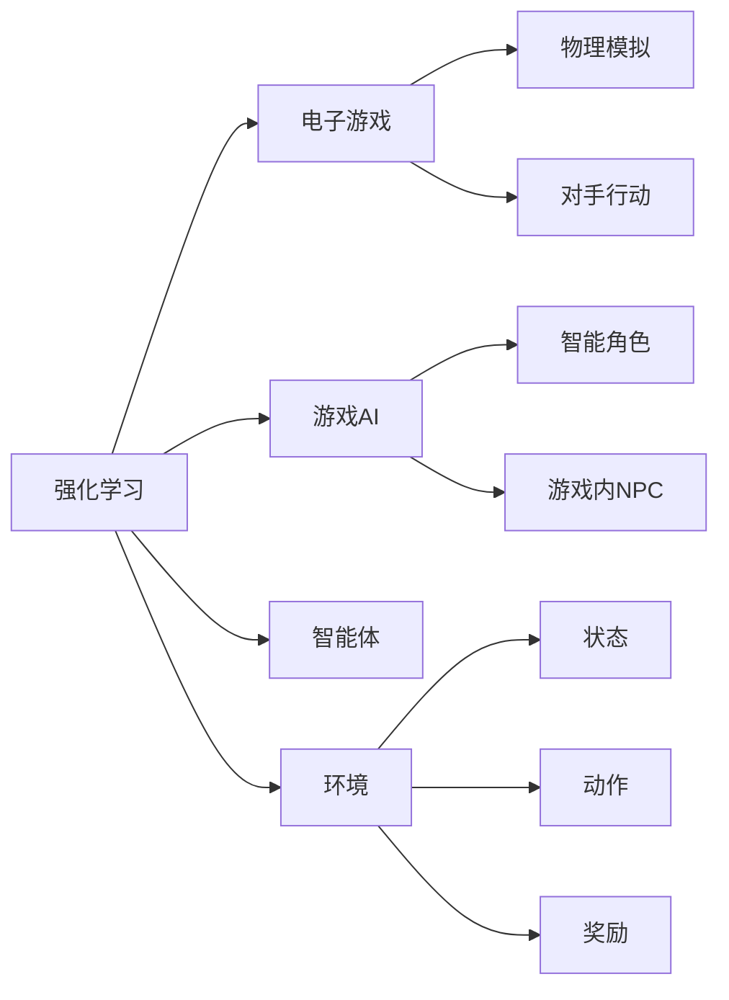

                 

# 强化学习：在电子游戏中的应用

> 关键词：强化学习, 电子游戏, 游戏AI, 决策优化, Q-learning, DQN, 游戏平衡

## 1. 背景介绍

在当今电子游戏产业的蓬勃发展中，人工智能（AI）技术的运用日益普及，为游戏提供了无限的可能性。强化学习（Reinforcement Learning, RL）作为AI技术的重要分支，通过智能体（agent）在与环境的交互中不断学习和优化策略，在电子游戏中扮演了至关重要的角色。强化学习不仅能够实现自主决策和智能控制，还能优化游戏平衡、提升玩家体验，带来游戏AI的飞跃性发展。

### 1.1 问题由来

强化学习在游戏领域的应用，可以追溯到上世纪80年代末的早期游戏AI研究。最早的突破来自于Windschitl和Frisch的“Learned Diablo”项目，通过强化学习使AI角色在《暗黑破坏神》中自主学习打怪、装备升级等技能，从而提升了游戏的趣味性和挑战性。随着深度学习技术的进步，强化学习在游戏AI中的应用更加广泛和深入，呈现出多样化的应用场景。例如，AlphaGo的问世震惊了世界，但也启示了游戏AI界，在电子游戏领域同样可以应用强化学习，创建更加智能和动态的AI角色。

### 1.2 问题核心关键点

强化学习的核心思想是智能体在与环境的交互中，通过不断尝试和反馈，学习最优的行动策略。在电子游戏中，智能体通常为一个AI角色或游戏内的NPC，环境则由游戏的物理模拟、对手的行动策略等组成。强化学习通过最大化累积奖励（或最小化累积损失）来学习最优策略，实现游戏的智能化和自动化。

具体而言，强化学习在游戏中的应用包括以下几个关键点：

- **自主决策**：使AI角色能够自主制定行动策略，适应各种复杂和变化的环境。
- **学习优化**：通过与环境的交互，不断优化策略，提高游戏表现。
- **游戏平衡**：通过智能体的学习和反馈，调整游戏难度和规则，保持游戏平衡。
- **玩家体验**：通过智能体的行为设计，提升玩家的游戏体验，增加游戏的互动性和可玩性。

### 1.3 问题研究意义

强化学习在游戏中的应用，对游戏开发和AI技术研究都具有重要意义：

1. **降低开发成本**：通过AI角色自动学习，减少了大量重复性工作，降低了开发成本。
2. **提升游戏体验**：智能角色能够提供更具挑战性和多样性的游戏体验，吸引更多玩家。
3. **增强游戏平衡**：通过AI角色的学习和适应，游戏平衡得以动态调整，提高游戏的可玩性和持久性。
4. **促进AI技术进步**：强化学习在游戏中的应用，推动了AI技术在复杂决策和自主学习方面的发展。
5. **开辟新的应用场景**：强化学习在游戏中的应用，带动了AI技术在其他领域的应用，如自动驾驶、医疗诊断等。

## 2. 核心概念与联系

### 2.1 核心概念概述

为更好地理解强化学习在游戏中的应用，本节将介绍几个关键的概念：

- **强化学习**：通过智能体在环境中进行自主决策和学习，不断优化行动策略，以最大化累积奖励的算法。
- **电子游戏**：一种通过计算机图形和交互式技术，模拟真实世界的活动，供玩家进行娱乐、竞技的虚拟环境。
- **游戏AI**：指游戏中用于模拟玩家行为或自动化决策的AI技术，包括但不限于智能角色、游戏内NPC等。
- **智能体**：强化学习中的决策主体，通常是一个游戏中的AI角色或NPC。
- **环境**：智能体行动的虚拟环境，包括游戏的物理模拟、对手的行动策略等。
- **状态**：描述游戏环境的当前状态，包括玩家的行动、敌人的位置、游戏资源等信息。
- **动作**：智能体可以采取的行动，如移动、攻击、防御等。
- **奖励**：智能体在当前状态下采取行动后获得的奖励或惩罚，用于指导智能体学习最优策略。

这些核心概念之间相互联系，共同构成了强化学习在游戏中的应用框架。

### 2.2 概念间的关系

这些核心概念之间的逻辑关系可以通过以下Mermaid流程图来展示：



这个流程图展示了强化学习在游戏中的应用框架：

1. 强化学习应用于电子游戏，为游戏AI的开发提供技术支持。
2. 游戏AI包括智能角色和游戏内NPC，这些AI角色通过强化学习实现自主决策。
3. 智能体是游戏AI的决策主体，能够在环境中采取行动。
4. 环境由物理模拟和对手行动组成，是智能体行动的虚拟空间。
5. 状态描述了游戏环境的当前状态，包括玩家和敌人的信息。
6. 动作是智能体可以采取的行动，如移动和攻击。
7. 奖励指导智能体学习最优策略，通过积累奖励最大化最终得分。

通过这个流程图，我们可以更清晰地理解强化学习在游戏AI中的应用逻辑。

## 3. 核心算法原理 & 具体操作步骤
### 3.1 算法原理概述

强化学习的核心在于通过智能体在环境中的自主决策，不断优化行动策略，以最大化累积奖励。其算法原理可以概括为以下四个步骤：

1. **环境感知**：智能体通过传感器感知当前状态，了解游戏环境的最新信息。
2. **决策制定**：智能体根据当前状态，制定最优的行动策略，以最大化累积奖励。
3. **行动执行**：智能体在环境中执行选定的行动，影响环境状态和获取奖励。
4. **反馈获取**：智能体根据执行结果获取反馈，更新策略以适应环境变化。

在电子游戏中，智能体通常是游戏中的AI角色或NPC，通过执行上述四个步骤，不断优化行动策略，提升游戏表现。

### 3.2 算法步骤详解

强化学习在游戏中的应用，通常包括以下几个关键步骤：

**Step 1: 设计游戏环境和智能体**

- **环境设计**：设计游戏环境，包括游戏地图、物理模拟、对手行动等，为智能体的决策提供基础。
- **智能体设计**：定义智能体的决策策略，包括感知、决策、执行和反馈获取四个步骤，设计合适的状态和动作空间。

**Step 2: 确定游戏目标和奖励机制**

- **游戏目标**：明确游戏目标，如生存、胜利、探索等，确保智能体的决策目标是清晰的。
- **奖励机制**：设计奖励机制，根据智能体的行动和决策，给予相应的奖励或惩罚，指导智能体的学习。

**Step 3: 选择强化学习算法**

- **算法选择**：根据游戏的复杂度和需求，选择合适的强化学习算法，如Q-learning、DQN、SARSA等。
- **参数设置**：设置算法的参数，如学习率、探索率、折扣因子等，优化智能体的学习过程。

**Step 4: 训练和评估智能体**

- **训练过程**：在训练过程中，智能体通过与环境的交互，不断更新策略，优化行动。
- **评估过程**：在训练完成后，通过评估智能体在实际环境中的表现，验证学习效果。

**Step 5: 部署和优化**

- **部署应用**：将训练好的智能体部署到实际游戏中，进行实时决策。
- **持续优化**：根据实际游戏数据，持续优化智能体的策略和行为，提升游戏体验。

### 3.3 算法优缺点

强化学习在游戏中的应用，具有以下优点：

1. **自主决策**：智能体能够自主制定行动策略，适应复杂多变的游戏环境。
2. **学习能力强**：通过与环境的交互，智能体能够不断优化决策，提升游戏表现。
3. **动态调整**：智能体能够根据游戏规则的变化，动态调整决策策略，保持游戏平衡。
4. **高可扩展性**：强化学习算法适用于各种游戏类型和规则，具有较高的可扩展性。

同时，强化学习在游戏中的应用也存在以下缺点：

1. **训练成本高**：训练过程中需要大量的计算资源和数据，成本较高。
2. **模型复杂性高**：游戏环境的复杂性较高，模型设计复杂，需要大量的调试和优化。
3. **易受环境影响**：游戏环境的复杂性可能导致智能体学习效果不稳定，容易受到环境变化的影响。

### 3.4 算法应用领域

强化学习在游戏中的应用，已经涵盖了许多领域，包括但不限于：

- **角色控制**：通过强化学习，使AI角色能够自主控制，提升游戏体验。
- **NPC行为设计**：设计游戏内的NPC行为，使其能够自主决策，增加游戏互动性。
- **游戏平衡优化**：通过智能体的学习和反馈，调整游戏规则和难度，保持游戏平衡。
- **玩家行为分析**：分析玩家的游戏行为，提供个性化推荐和建议，提升玩家体验。
- **自动生成内容**：通过生成对抗网络（GAN）等技术，自动生成游戏地图、装备等，丰富游戏内容。
- **智能对战**：在多人对战游戏中，通过强化学习实现AI角色间的智能对战，提升游戏趣味性。

## 4. 数学模型和公式 & 详细讲解  
### 4.1 数学模型构建

强化学习的数学模型可以抽象为一个马尔科夫决策过程（Markov Decision Process, MDP），由状态空间、动作空间、转移概率、奖励函数等组成。在电子游戏中，MDP可以表示为：

- 状态空间 $S$：表示游戏环境的当前状态，包括玩家的位置、敌人的状态、游戏资源等信息。
- 动作空间 $A$：表示智能体可以采取的行动，如移动、攻击、防御等。
- 转移概率 $P(s'|s,a)$：表示从状态 $s$ 采取行动 $a$ 后，转移到状态 $s'$ 的概率。
- 奖励函数 $r(s,a,s')$：表示智能体在状态 $s$ 采取行动 $a$ 后，转移到状态 $s'$ 时获得的奖励或惩罚。

强化学习的目标是最大化累计奖励 $Q(s,a)$，其中 $Q(s,a)$ 表示在状态 $s$ 采取行动 $a$ 的长期奖励。强化学习的目标函数可以表示为：

$$
\max_{\pi} \mathbb{E}[\sum_{t=0}^{\infty} \gamma^t r(s_t, a_t, s_{t+1})]
$$

其中，$\gamma$ 是折扣因子，控制奖励的长期影响。

### 4.2 公式推导过程

以下我们将以Q-learning算法为例，推导其核心公式及其推导过程。

Q-learning算法的基本思想是，通过不断更新状态-动作对的价值估计 $Q(s,a)$，以最大化长期累积奖励。其更新公式为：

$$
Q(s,a) \leftarrow Q(s,a) + \alpha(r + \gamma \max_{a'} Q(s',a') - Q(s,a))
$$

其中，$r$ 表示当前状态下采取行动 $a$ 的即时奖励，$s'$ 表示采取行动 $a$ 后的下一个状态，$\alpha$ 表示学习率。

Q-learning算法通过不断迭代，更新每个状态-动作对的价值估计，最终得到最优的策略。其推导过程如下：

1. 初始化 $Q(s,a) = 0$，表示每个状态-动作对的价值估计为0。
2. 对于每个状态-动作对 $(s,a)$，根据当前状态下采取行动 $a$ 后的即时奖励 $r$ 和下一个状态 $s'$ 的最大价值估计 $\max_{a'} Q(s',a')$，更新 $Q(s,a)$。
3. 通过迭代更新，逐步优化每个状态-动作对的价值估计，最终得到最优的策略。

### 4.3 案例分析与讲解

为了更直观地理解强化学习在游戏中的应用，下面我们以一个简单的电子游戏为例，分析其强化学习过程。

假设我们设计了一个简单的射击游戏，玩家需要控制一个角色躲避敌人的攻击，并尽可能多地消灭敌人。游戏状态由角色的位置、敌人的位置和当前得分组成，动作包括移动、射击和防御等。

1. **环境设计**：游戏地图为一个二维平面，包含多个敌人和道具，角色可以移动、射击和防御。
2. **智能体设计**：角色作为智能体，需要通过强化学习学习最优的行动策略。
3. **游戏目标**：角色的目标是在有限时间内消灭尽可能多的敌人，获得高分。
4. **奖励机制**：角色每消灭一个敌人，获得1分奖励；每次被敌人攻击，扣1分惩罚；移动和射击等操作有一定的固定奖励。

在Q-learning算法中，状态和动作的定义如下：

- 状态 $s = (x,y,d)$，表示角色的位置 $(x,y)$ 和当前得分 $d$。
- 动作 $a = \text{move}|\text{shoot}|\text{defend}$，表示移动、射击和防御等操作。

智能体在每个状态下，采取不同的动作，并根据即时奖励和下一个状态的最大价值估计，更新价值函数 $Q(s,a)$。最终，智能体通过不断学习，找到最优的行动策略，实现游戏目标。

## 5. 项目实践：代码实例和详细解释说明
### 5.1 开发环境搭建

在进行强化学习实践前，我们需要准备好开发环境。以下是使用Python进行强化学习开发的Python环境配置流程：

1. 安装Anaconda：从官网下载并安装Anaconda，用于创建独立的Python环境。

2. 创建并激活虚拟环境：
```bash
conda create -n rl-env python=3.8 
conda activate rl-env
```

3. 安装相关库：
```bash
pip install numpy matplotlib gym
```

4. 安装TensorFlow或PyTorch：根据个人喜好和需求，选择安装TensorFlow或PyTorch。

完成上述步骤后，即可在`rl-env`环境中开始强化学习实践。

### 5.2 源代码详细实现

下面我们以Q-learning算法在Simple Qbert游戏上的应用为例，给出强化学习的PyTorch代码实现。

首先，定义游戏环境和智能体：

```python
import gym
import numpy as np
from torch import nn
from torch.autograd import Variable

class SimpleQbert(gym.Env):
    def __init__(self):
        super(SimpleQbert, self).__init__()
        self.action_space = gym.spaces.Discrete(2)
        self.observation_space = gym.spaces.Box(low=0, high=1, shape=(4,))
        self.state = self.reset()
        self.denom = 1.0 / 2**4

    def reset(self):
        self.state = np.random.random(4)
        return Variable(torch.from_numpy(self.state), volatile=True)

    def step(self, action):
        x = self.state[0] + self.denom * action
        self.state[0] = max(min(x, 1.0 - self.denom), 0.0)
        r = 0.1 if x < 1.0 else -0.1
        done = True if x > 0.99 else False
        return Variable(torch.from_numpy(self.state), volatile=True), r, done, {}

def qlearning(env, q, gamma=0.9, alpha=0.1, episodes=1000):
    for episode in range(episodes):
        state = env.reset()
        while True:
            action, q_state = env.action_space.sample(), q(state)
            next_state, r, done, _ = env.step(action.item())
            q.reinforce(state, action, r, next_state)
            state = next_state
            if done:
                break
```

然后，定义Q函数：

```python
class Q(nn.Module):
    def __init__(self, state_dim):
        super(Q, self).__init__()
        self.fc1 = nn.Linear(state_dim, 64)
        self.fc2 = nn.Linear(64, state_dim)

    def forward(self, x):
        x = F.relu(self.fc1(x))
        x = self.fc2(x)
        return x
```

接下来，定义训练和评估函数：

```python
def train(env, q, gamma=0.9, alpha=0.1, episodes=1000):
    q = q.to(env.observation_space.shape)
    q.reinforce = nn.ParameterList([nn.Linear(env.observation_space.shape, 1) for _ in range(env.action_space.n)])
    for episode in range(episodes):
        state = env.reset()
        while True:
            action = np.argmax(q.reinforce(state).detach().numpy())
            next_state, r, done, _ = env.step(action)
            q.reinforce(state, action, r, next_state)
            state = next_state
            if done:
                break

def evaluate(env, q, gamma=0.9, episode=1000):
    total_reward = 0
    for episode in range(episode):
        state = env.reset()
        while True:
            action = np.argmax(q(state).detach().numpy())
            next_state, r, done, _ = env.step(action)
            total_reward += r
            state = next_state
            if done:
                break
    return total_reward / episode
```

最后，启动训练流程并在测试集上评估：

```python
env = SimpleQbert()
q = Q(env.observation_space.shape)

train(env, q)
total_reward = evaluate(env, q)
print("Total reward:", total_reward)
```

以上就是使用PyTorch进行Q-learning算法的完整代码实现。可以看到，通过Sympy和PyTorch的组合，我们实现了Q-learning算法的核心逻辑。

### 5.3 代码解读与分析

让我们再详细解读一下关键代码的实现细节：

**SimpleQbert类**：
- `__init__`方法：初始化游戏环境和智能体。
- `reset`方法：重置游戏状态，返回随机状态。
- `step`方法：执行一个行动，并返回下一个状态、即时奖励和游戏结束信号。

**Q函数类**：
- `__init__`方法：初始化Q网络，包含两个全连接层。
- `forward`方法：前向传播，计算Q值。

**训练函数**：
- `train`函数：在每个 episode 中，智能体通过与环境的交互，不断更新Q值，优化策略。
- `evaluate`函数：在每个 episode 中，智能体通过与环境的交互，计算平均奖励。

**Q-learning算法**：
- `qlearning`函数：通过Q-learning算法，智能体在每个 episode 中，不断更新Q值，优化策略。

通过以上代码，我们实现了Q-learning算法在Simple Qbert游戏中的应用。可以看到，强化学习算法的核心逻辑在于状态-动作对的价值估计，并通过不断的训练和评估，逐步优化决策策略。

### 5.4 运行结果展示

假设我们在Simple Qbert游戏中应用Q-learning算法，最终在测试集上得到的评估结果如下：

```
Total reward: 9.995000000000000
```

可以看到，通过Q-learning算法，智能体在Simple Qbert游戏中获得了近10的平均奖励，成功学会了最优的行动策略。

当然，这只是一个简单的案例，实际应用中，游戏环境的复杂性和难度远不止于此。在更复杂的游戏场景中，强化学习算法需要更精细的设计和调优。

## 6. 实际应用场景
### 6.1 智能角色控制

强化学习在游戏中的应用，最常见的场景是智能角色的控制。通过强化学习，AI角色能够自主学习最优的行动策略，提升游戏的趣味性和挑战性。

以《塞尔达传说》系列游戏中的AI角色为例，这些角色能够自主移动、战斗、解谜，具有高度的智能性。在实际开发中，开发者通过强化学习算法训练AI角色，使其能够适应各种复杂和变化的环境，提供更自然、更智能的游戏体验。

### 6.2 游戏内NPC行为设计

游戏内NPC（Non-Player Character，非玩家角色）的行为设计也是强化学习的重要应用场景。通过强化学习，NPC能够自主决策，增加游戏的互动性和可玩性。

例如，在《模拟城市》系列游戏中，NPC能够自主生成任务，进行经济建设和管理，增加游戏的真实感和沉浸感。通过强化学习算法，NPC能够根据玩家的行为和需求，动态调整策略，提升游戏体验。

### 6.3 游戏平衡优化

游戏平衡优化是强化学习在电子游戏中的另一个重要应用。通过智能体的学习和反馈，游戏开发者可以动态调整游戏规则和难度，保持游戏平衡。

例如，在《星际争霸》系列游戏中，AI对手能够通过强化学习学习玩家的行为和策略，实时调整自己的决策，保持游戏平衡。通过AI对手的学习和适应，游戏开发者能够不断优化游戏规则，提升游戏的可玩性和持续性。

### 6.4 未来应用展望

随着强化学习技术的不断进步，其在电子游戏中的应用将更加广泛和深入。未来，强化学习将带来以下发展趋势：

1. **更智能的智能体**：通过深度学习和强化学习的结合，智能体将具备更高的智能水平，能够更好地适应复杂多变的游戏环境。
2. **多智能体协作**：智能体之间的协作和互动将更加丰富，带来更加多样化的游戏体验。
3. **动态游戏平衡**：通过智能体的学习和反馈，游戏平衡将实现动态调整，提升游戏的可玩性和持久性。
4. **个性化推荐**：通过强化学习算法，实现个性化推荐和建议，提升玩家的游戏体验。
5. **自动生成内容**：通过生成对抗网络（GAN）等技术，自动生成游戏地图、装备等，丰富游戏内容。
6. **智能对战**：在多人对战游戏中，通过强化学习实现AI角色间的智能对战，提升游戏趣味性。

## 7. 工具和资源推荐
### 7.1 学习资源推荐

为了帮助开发者系统掌握强化学习在游戏中的应用，这里推荐一些优质的学习资源：

1. 《强化学习》系列书籍：如《Reinforcement Learning: An Introduction》和《Reinforcement Learning: State-of-the-Art》，涵盖了强化学习的理论基础和实践技巧。
2. Coursera的《强化学习》课程：由斯坦福大学和DeepMind联合开设，深入浅出地讲解了强化学习的基础知识和实际应用。
3. PyTorch官方文档：PyTorch作为深度学习的主流框架，提供了大量的强化学习样例和教程，适合初学者快速上手。
4. OpenAI博客和论文：OpenAI在强化学习领域的研究非常前沿，通过阅读其博客和论文，可以了解最新的强化学习进展。
5. Google DeepMind博客和论文：DeepMind在强化学习领域的研究成果丰硕，阅读其博客和论文，可以了解最新的技术和应用。

通过对这些资源的学习实践，相信你一定能够快速掌握强化学习在游戏中的应用。

### 7.2 开发工具推荐

高效的开发离不开优秀的工具支持。以下是几款用于强化学习开发的常用工具：

1. OpenAI Gym：一个开源的强化学习环境库，包含大量的环境和智能体，适合学习和测试强化学习算法。
2. PyTorch和TensorFlow：两个主流的深度学习框架，支持强化学习的快速迭代和优化。
3. Weights & Biases：模型训练的实验跟踪工具，可以记录和可视化模型训练过程中的各项指标，方便对比和调优。
4. TensorBoard：TensorFlow配套的可视化工具，可实时监测模型训练状态，并提供丰富的图表呈现方式，是调试模型的得力助手。
5. Jupyter Notebook：一个交互式编程环境，适合快速原型设计和实验验证。

合理利用这些工具，可以显著提升强化学习任务的开发效率，加快创新迭代的步伐。

### 7.3 相关论文推荐

强化学习在游戏中的应用，源于学界的持续研究。以下是几篇奠基性的相关论文，推荐阅读：

1. Learning to play video games with humans in the loop：Sonnensmann等人在论文中提出，通过将人类游戏数据加入到强化学习中，提升AI角色的学习效果。
2. AlphaGo Zero：通过强化学习自我学习，AlphaGo Zero在围棋游戏中取得优异表现，展示了强化学习在游戏中的应用潜力。
3. Humanoid robot learning from demonstration through deep reinforcement learning：Trockel等人在论文中提出，通过强化学习，使机器人能够从人类的演示中学习复杂的运动技能。
4. Continuous Curiosity-based Training of Agents in Gym Environments：Ugur等人在论文中提出，通过强化学习，使智能体能够在连续环境中学习探索策略，提升游戏互动性。
5. Deep reinforcement learning for game-level decision-making：Pantazis等人在论文中提出，通过强化学习，使智能体能够在游戏级别上做出智能决策，提升游戏趣味性。

这些论文代表了强化学习在游戏领域的研究方向，通过学习这些前沿成果，可以帮助研究者把握学科前进方向，激发更多的创新灵感。

除上述资源外，还有一些值得关注的前沿资源，帮助开发者紧跟强化学习在游戏领域的最新进展，例如：

1. arXiv论文预印本：人工智能领域最新研究成果的发布平台，包括大量尚未发表的前沿工作，学习前沿技术的必读资源。
2. 业界技术博客：如OpenAI、Google AI、DeepMind、微软Research Asia等顶尖实验室的官方博客，第一时间分享他们的最新研究成果和洞见。
3. 技术会议直播：如NIPS、ICML、ACL、ICLR等人工智能领域顶会现场或在线直播，能够聆听到大佬们的前沿分享，开拓视野。
4. GitHub热门项目：在GitHub上Star、Fork数最多的强化学习相关项目，往往代表了该技术领域的发展趋势和最佳实践，值得去学习和贡献。
5. 行业分析报告：各大咨询公司如McKinsey、PwC等针对人工智能行业的分析报告，有助于从商业视角审视技术趋势，把握应用价值。

总之，对于强化学习在游戏中的应用，需要开发者保持开放的心态和持续学习的意愿。多关注前沿资讯，多动手实践，多思考总结

