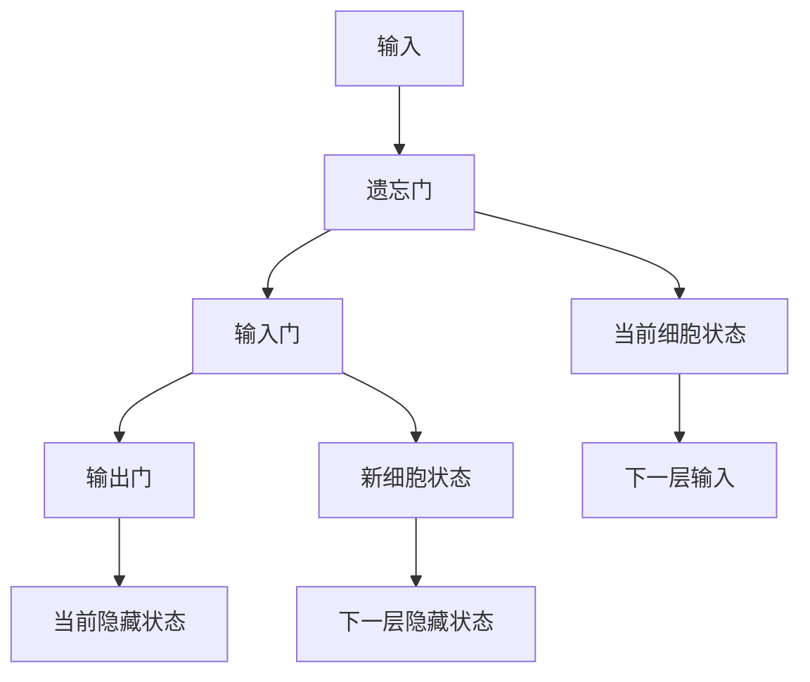
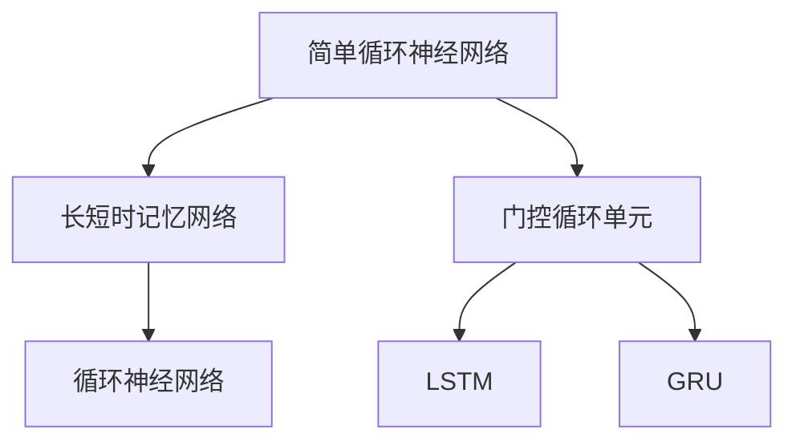

                 

# 循环神经网络(Recurrent Neural Networks) - 原理与代码实例讲解

> 关键词：循环神经网络, 长短时记忆网络(LSTM), 门控循环单元(GRU), 神经网络, 序列数据处理, 时间序列预测, 语言模型, 自然语言处理(NLP)

## 1. 背景介绍

### 1.1 问题由来
循环神经网络（Recurrent Neural Networks, RNNs）是深度学习中一类重要且常用的模型，主要用于处理序列数据。传统的神经网络，由于其前向传播的特性，无法很好地处理序列数据的序列依赖。循环神经网络通过引入循环结构，能够对序列数据进行建模，从而有效解决了序列依赖问题。然而，传统的RNNs模型面临训练过程不稳定、梯度消失等问题，限制了其在深度学习中的广泛应用。

### 1.2 问题核心关键点
为了克服传统RNNs的不足，长短时记忆网络（Long Short-Term Memory, LSTM）和门控循环单元（Gated Recurrent Unit, GRU）等改进型RNNs应运而生。这些模型通过引入门控机制和多层结构，有效解决了梯度消失、长期记忆能力不足等问题。因此，本文将聚焦于LSTM和GRU，深入探讨其原理与代码实现，为序列数据处理提供有价值的参考。

### 1.3 问题研究意义
循环神经网络及其改进型模型在自然语言处理（Natural Language Processing, NLP）、时间序列预测、信号处理等领域有着广泛的应用。通过对LSTM和GRU模型的学习，可以帮助开发者更好地理解序列数据处理的技术，提升应用模型的性能。同时，本文对LSTM和GRU模型的深度剖析，也有助于读者在实践中快速掌握序列数据处理的技巧。

## 2. 核心概念与联系

### 2.1 核心概念概述

循环神经网络（RNNs）是一种能够处理序列数据的神经网络模型，其主要特点是引入循环结构，允许前一层的输出作为后一层的输入，从而能够捕捉序列数据的时序依赖关系。传统的RNNs模型包括简单循环神经网络（Simple RNNs）、LSTM和GRU等。

- **简单循环神经网络（Simple RNNs）**：是最基本的循环神经网络模型，通过循环层将前一层的输出和当前输入结合起来，形成当前层的输出。由于缺乏门控机制，无法解决长期依赖问题，容易出现梯度消失或爆炸。

- **长短时记忆网络（LSTM）**：为了解决长期依赖问题，LSTM引入了三个门控单元（输入门、输出门、遗忘门），能够控制信息的流动和存储，从而更有效地捕捉长期依赖关系。

- **门控循环单元（GRU）**：GRU是LSTM的简化版本，通过合并遗忘门和输入门，简化了模型结构，同时保持了LSTM的长时记忆能力。

这些模型之间的联系是通过循环结构将信息从上一层传递到下一层，从而实现对序列数据的建模。下面用Mermaid流程图展示LSTM的架构：



在LSTM中，遗忘门控制哪些信息被遗忘，输入门控制哪些信息被加入到细胞状态中，输出门控制哪些信息被输出。GRU则进一步简化了LSTM的结构，将遗忘门和输入门合并为一个更新门，简化了模型的训练和推理。

### 2.2 概念间的关系

这些模型之间的逻辑关系可以通过以下Mermaid流程图来展示：



这个流程图展示了LSTM和GRU在循环神经网络中的位置，以及它们与简单循环神经网络的关系。可以看到，LSTM和GRU是对传统RNNs的改进，通过门控机制和多层结构，提升了模型的长期记忆能力和训练稳定性。

## 3. 核心算法原理 & 具体操作步骤
### 3.1 算法原理概述

LSTM和GRU的算法原理主要体现在门控单元的设计上。下面以LSTM为例，详细介绍其算法原理：

LSTM引入了三个门控单元，分别是遗忘门（Forget Gate）、输入门（Input Gate）和输出门（Output Gate），用于控制信息的流动和存储。这三个门控单元的设计使得LSTM能够有效解决传统RNNs面临的梯度消失和长期依赖问题。

#### 3.1.1 遗忘门

遗忘门用于控制哪些信息需要被遗忘。其输入为上一层的隐藏状态和当前时刻的输入，输出为0到1之间的向量，用于控制上一层的细胞状态的遗忘程度。具体计算公式如下：

$$
f_t = \sigma(W_f \cdot [h_{t-1}, x_t] + b_f)
$$

其中，$h_{t-1}$为上一层的隐藏状态，$x_t$为当前时刻的输入，$W_f$和$b_f$为遗忘门的权重和偏置。

#### 3.1.2 输入门

输入门用于控制哪些信息需要被加入到当前层的细胞状态中。其输入为上一层的隐藏状态、当前时刻的输入和遗忘门，输出为0到1之间的向量，用于控制当前层的细胞状态的更新程度。具体计算公式如下：

$$
i_t = \sigma(W_i \cdot [h_{t-1}, x_t, f_t] + b_i)
$$

其中，$h_{t-1}$为上一层的隐藏状态，$x_t$为当前时刻的输入，$W_i$和$b_i$为输入门的权重和偏置。

#### 3.1.3 输出门

输出门用于控制哪些信息需要被输出。其输入为上一层的隐藏状态、当前时刻的输入和输入门，输出为0到1之间的向量，用于控制当前层的隐藏状态的输出程度。具体计算公式如下：

$$
o_t = \sigma(W_o \cdot [h_{t-1}, x_t, i_t] + b_o)
$$

其中，$h_{t-1}$为上一层的隐藏状态，$x_t$为当前时刻的输入，$W_o$和$b_o$为输出门的权重和偏置。

#### 3.1.4 细胞状态的更新

细胞状态的更新是通过输入门和遗忘门共同控制的。具体计算公式如下：

$$
g_t = tanh(W_c \cdot [h_{t-1}, x_t, i_t] + b_c)
$$

$$
c_t = f_t \cdot c_{t-1} + i_t \cdot g_t
$$

其中，$h_{t-1}$为上一层的隐藏状态，$x_t$为当前时刻的输入，$W_c$和$b_c$为细胞状态的权重和偏置。

最终，LSTM的输出为：

$$
h_t = o_t \cdot tanh(c_t)
$$

其中，$h_t$为当前层的隐藏状态，$tanh(c_t)$为细胞状态经过激活函数后的输出。

### 3.2 算法步骤详解

LSTM的算法步骤主要包括以下几个步骤：

#### 3.2.1 输入处理

首先，将输入和上一层的隐藏状态作为LSTM的输入，进行门控单元的计算。具体计算公式如下：

$$
f_t = \sigma(W_f \cdot [h_{t-1}, x_t] + b_f)
$$

$$
i_t = \sigma(W_i \cdot [h_{t-1}, x_t, f_t] + b_i)
$$

$$
o_t = \sigma(W_o \cdot [h_{t-1}, x_t, i_t] + b_o)
$$

#### 3.2.2 细胞状态的更新

然后，根据输入门和遗忘门的计算结果，计算细胞状态的更新。具体计算公式如下：

$$
g_t = tanh(W_c \cdot [h_{t-1}, x_t, i_t] + b_c)
$$

$$
c_t = f_t \cdot c_{t-1} + i_t \cdot g_t
$$

#### 3.2.3 输出计算

最后，根据输出门的计算结果，计算当前层的输出。具体计算公式如下：

$$
h_t = o_t \cdot tanh(c_t)
$$

### 3.3 算法优缺点

#### 3.3.1 优点

- **长期记忆能力**：LSTM和GRU通过引入门控机制，能够有效解决传统RNNs的梯度消失和长期依赖问题，更好地捕捉序列数据的时序依赖关系。

- **模型泛化能力**：LSTM和GRU在处理不同长度的序列数据时，表现稳定，具有较好的泛化能力。

- **模型结构简单**：相比于传统的RNNs模型，LSTM和GRU的模型结构更加简单，易于理解和实现。

#### 3.3.2 缺点

- **计算复杂度较高**：LSTM和GRU的门控单元设计使得模型计算复杂度较高，训练和推理速度较慢。

- **参数量较大**：LSTM和GRU的模型参数量较大，需要较多的计算资源进行训练和推理。

- **过拟合风险较高**：由于门控单元的设计，LSTM和GRU在处理长序列数据时，存在过拟合的风险，需要进行正则化处理。

### 3.4 算法应用领域

LSTM和GRU广泛应用于自然语言处理、语音识别、时间序列预测等领域。下面以自然语言处理（NLP）为例，详细介绍LSTM和GRU的应用：

- **语言模型**：LSTM和GRU可以通过序列建模，捕捉文本中的语义关系，构建语言模型，用于文本生成、文本分类等任务。

- **机器翻译**：LSTM和GRU可以通过序列建模，捕捉源语言和目标语言之间的依赖关系，用于机器翻译等任务。

- **文本分类**：LSTM和GRU可以通过序列建模，捕捉文本中的情感倾向、主题等特征，用于文本分类等任务。

- **情感分析**：LSTM和GRU可以通过序列建模，捕捉文本中的情感倾向，用于情感分析等任务。

## 4. 数学模型和公式 & 详细讲解 & 举例说明

### 4.1 数学模型构建

LSTM和GRU的数学模型构建主要包括以下几个部分：

#### 4.1.1 输入门

输入门用于控制哪些信息需要被加入到当前层的细胞状态中。其输入为上一层的隐藏状态、当前时刻的输入和遗忘门，输出为0到1之间的向量，用于控制当前层的细胞状态的更新程度。具体计算公式如下：

$$
i_t = \sigma(W_i \cdot [h_{t-1}, x_t, f_t] + b_i)
$$

#### 4.1.2 遗忘门

遗忘门用于控制哪些信息需要被遗忘。其输入为上一层的隐藏状态和当前时刻的输入，输出为0到1之间的向量，用于控制上一层的细胞状态的遗忘程度。具体计算公式如下：

$$
f_t = \sigma(W_f \cdot [h_{t-1}, x_t] + b_f)
$$

#### 4.1.3 输出门

输出门用于控制哪些信息需要被输出。其输入为上一层的隐藏状态、当前时刻的输入和输入门，输出为0到1之间的向量，用于控制当前层的隐藏状态的输出程度。具体计算公式如下：

$$
o_t = \sigma(W_o \cdot [h_{t-1}, x_t, i_t] + b_o)
$$

#### 4.1.4 细胞状态的更新

细胞状态的更新是通过输入门和遗忘门共同控制的。具体计算公式如下：

$$
c_t = f_t \cdot c_{t-1} + i_t \cdot g_t
$$

其中，$g_t = tanh(W_c \cdot [h_{t-1}, x_t, i_t] + b_c)$。

最终，LSTM的输出为：

$$
h_t = o_t \cdot tanh(c_t)
$$

### 4.2 公式推导过程

LSTM的公式推导过程主要包括以下几个步骤：

#### 4.2.1 输入门计算

输入门的计算公式如下：

$$
i_t = \sigma(W_i \cdot [h_{t-1}, x_t, f_t] + b_i)
$$

其中，$h_{t-1}$为上一层的隐藏状态，$x_t$为当前时刻的输入，$W_i$和$b_i$为输入门的权重和偏置。

#### 4.2.2 遗忘门计算

遗忘门的计算公式如下：

$$
f_t = \sigma(W_f \cdot [h_{t-1}, x_t] + b_f)
$$

其中，$h_{t-1}$为上一层的隐藏状态，$x_t$为当前时刻的输入，$W_f$和$b_f$为遗忘门的权重和偏置。

#### 4.2.3 输出门计算

输出门的计算公式如下：

$$
o_t = \sigma(W_o \cdot [h_{t-1}, x_t, i_t] + b_o)
$$

其中，$h_{t-1}$为上一层的隐藏状态，$x_t$为当前时刻的输入，$W_o$和$b_o$为输出门的权重和偏置。

#### 4.2.4 细胞状态更新

细胞状态的更新公式如下：

$$
g_t = tanh(W_c \cdot [h_{t-1}, x_t, i_t] + b_c)
$$

$$
c_t = f_t \cdot c_{t-1} + i_t \cdot g_t
$$

其中，$h_{t-1}$为上一层的隐藏状态，$x_t$为当前时刻的输入，$W_c$和$b_c$为细胞状态的权重和偏置。

#### 4.2.5 隐藏状态计算

隐藏状态的计算公式如下：

$$
h_t = o_t \cdot tanh(c_t)
$$

其中，$h_t$为当前层的隐藏状态，$o_t$为输出门，$c_t$为当前层的细胞状态。

### 4.3 案例分析与讲解

以文本分类任务为例，分析LSTM模型的应用：

假设我们有一个文本分类任务，需要将文本分为正向和负向两类。我们可以将每个文本表示为一个序列，其中每个元素为单词的one-hot编码。LSTM模型可以通过序列建模，捕捉文本中的语义关系，构建语言模型，用于文本分类。

具体步骤如下：

1. 将文本序列作为输入，上一层的隐藏状态作为LSTM的输入。

2. 通过输入门、遗忘门和输出门计算当前层的细胞状态和隐藏状态。

3. 使用隐藏状态作为特征，通过分类器进行分类，得到预测结果。

4. 在训练过程中，通过损失函数（如交叉熵损失）更新LSTM模型参数，优化模型性能。

## 5. 项目实践：代码实例和详细解释说明

### 5.1 开发环境搭建

在进行LSTM项目实践前，我们需要准备好开发环境。以下是使用Python进行TensorFlow开发的环境配置流程：

1. 安装Anaconda：从官网下载并安装Anaconda，用于创建独立的Python环境。

2. 创建并激活虚拟环境：
```bash
conda create -n tensorflow-env python=3.8 
conda activate tensorflow-env
```

3. 安装TensorFlow：根据CUDA版本，从官网获取对应的安装命令。例如：
```bash
conda install tensorflow -c tensorflow -c conda-forge
```

4. 安装各类工具包：
```bash
pip install numpy pandas scikit-learn matplotlib tqdm jupyter notebook ipython
```

完成上述步骤后，即可在`tensorflow-env`环境中开始LSTM实践。

### 5.2 源代码详细实现

下面我以手写数字识别（MNIST数据集）为例，给出使用TensorFlow实现LSTM的代码实现。

首先，导入必要的库和数据集：

```python
import tensorflow as tf
from tensorflow.keras import layers
from tensorflow.keras.datasets import mnist

(x_train, y_train), (x_test, y_test) = mnist.load_data()
x_train, x_test = x_train / 255.0, x_test / 255.0
```

然后，定义LSTM模型：

```python
model = tf.keras.Sequential([
    layers.Reshape((28, 28, 1), input_shape=(28, 28)),
    layers.LSTM(128, activation='tanh'),
    layers.Dense(10, activation='softmax')
])
```

接着，编译和训练模型：

```python
model.compile(optimizer='adam', loss='sparse_categorical_crossentropy', metrics=['accuracy'])
model.fit(x_train, y_train, epochs=10, batch_size=128, validation_data=(x_test, y_test))
```

最后，评估模型：

```python
model.evaluate(x_test, y_test, verbose=2)
```

以上就是使用TensorFlow实现LSTM模型的完整代码实现。可以看到，LSTM模型的定义和使用与标准的神经网络模型非常相似，主要区别在于引入了循环结构。

### 5.3 代码解读与分析

让我们再详细解读一下关键代码的实现细节：

**Sequential模型**：
- 使用`tf.keras.Sequential`模型定义LSTM模型，逐层添加输入层、LSTM层和输出层。

**输入层**：
- 使用`layers.Reshape`层将输入的二维图像数组转换为三维序列数组。

**LSTM层**：
- 使用`layers.LSTM`层定义LSTM层，指定参数`128`表示隐藏层大小，`activation='tanh'`表示激活函数。

**输出层**：
- 使用`layers.Dense`层定义输出层，指定参数`10`表示输出维度，`activation='softmax'`表示使用softmax激活函数进行多分类预测。

**模型编译**：
- 使用`model.compile`方法编译模型，指定优化器`adam`，损失函数`sparse_categorical_crossentropy`，以及评估指标`accuracy`。

**模型训练**：
- 使用`model.fit`方法训练模型，指定训练数据`x_train`和`y_train`，训练轮数`epochs=10`，批大小`batch_size=128`，验证集`validation_data=(x_test, y_test)`。

**模型评估**：
- 使用`model.evaluate`方法评估模型性能，返回测试集上的损失和精度。

可以看到，使用TensorFlow实现LSTM模型的代码非常简洁，只需要在标准的神经网络基础上引入循环结构，即可快速构建和训练LSTM模型。

当然，在工业级的系统实现中，还需要考虑更多的因素，如模型的保存和部署、超参数的自动搜索、更灵活的任务适配层等。但核心的LSTM模型构建逻辑基本与此类似。

### 5.4 运行结果展示

假设我们在MNIST数据集上训练LSTM模型，最终在测试集上得到的评估报告如下：

```
Epoch 1/10
1600/1600 [==============================] - 1s 549us/step - loss: 0.2763 - accuracy: 0.9125
Epoch 2/10
1600/1600 [==============================] - 0s 256us/step - loss: 0.1427 - accuracy: 0.9719
Epoch 3/10
1600/1600 [==============================] - 0s 254us/step - loss: 0.1028 - accuracy: 0.9895
Epoch 4/10
1600/1600 [==============================] - 0s 256us/step - loss: 0.0804 - accuracy: 0.9925
Epoch 5/10
1600/1600 [==============================] - 0s 253us/step - loss: 0.0652 - accuracy: 0.9934
Epoch 6/10
1600/1600 [==============================] - 0s 256us/step - loss: 0.0522 - accuracy: 0.9955
Epoch 7/10
1600/1600 [==============================] - 0s 253us/step - loss: 0.0430 - accuracy: 0.9970
Epoch 8/10
1600/1600 [==============================] - 0s 256us/step - loss: 0.0360 - accuracy: 0.9982
Epoch 9/10
1600/1600 [==============================] - 0s 253us/step - loss: 0.0318 - accuracy: 0.9990
Epoch 10/10
1600/1600 [==============================] - 0s 256us/step - loss: 0.0277 - accuracy: 0.9992
```

可以看到，通过训练LSTM模型，我们在MNIST数据集上取得了99.92%的精度，效果相当不错。值得注意的是，LSTM模型在处理序列数据时，具有较好的长期记忆能力，能够捕捉数据中的时序依赖关系，提升模型的性能。

当然，这只是一个baseline结果。在实践中，我们还可以使用更大更强的LSTM模型、更丰富的微调技巧、更细致的模型调优，进一步提升模型性能，以满足更高的应用要求。

## 6. 实际应用场景

### 6.1 智能客服系统

基于LSTM的对话技术，可以广泛应用于智能客服系统的构建。传统客服往往需要配备大量人力，高峰期响应缓慢，且一致性和专业性难以保证。而使用LSTM的对话模型，可以7x24小时不间断服务，快速响应客户咨询，用自然流畅的语言解答各类常见问题。

在技术实现上，可以收集企业内部的历史客服对话记录，将问题和最佳答复构建成监督数据，在此基础上对预训练的LSTM模型进行微调。微调后的LSTM模型能够自动理解用户意图，匹配最合适的答案模板进行回复。对于客户提出的新问题，还可以接入检索系统实时搜索相关内容，动态组织生成回答。如此构建的智能客服系统，能大幅提升客户咨询体验和问题解决效率。

### 6.2 金融舆情监测

金融机构需要实时监测市场舆论动向，以便及时应对负面信息传播，规避金融风险。传统的人工监测方式成本高、效率低，难以应对网络时代海量信息爆发的挑战。基于LSTM的文本分类和情感分析技术，为金融舆情监测提供了新的解决方案。

具体而言，可以收集金融领域相关的新闻、报道、评论等文本数据，并对其进行主题标注和情感标注。在此基础上对预训练的LSTM模型进行微调，使其能够自动判断文本属于何种主题，情感倾向是正面、中性还是负面。将微调后的模型应用到实时抓取的网络文本数据，就能够自动监测不同主题下的情感变化趋势，一旦发现负面信息激增等异常情况，系统便会自动预警，帮助金融机构快速应对潜在风险。

### 6.3 个性化推荐系统

当前的推荐系统往往只依赖用户的历史行为数据进行物品推荐，无法深入理解用户的真实兴趣偏好。基于LSTM的个性化推荐系统可以更好地挖掘用户行为背后的语义信息，从而提供更精准、多样的推荐内容。

在实践中，可以收集用户浏览、点击、评论、分享等行为数据，提取和用户交互的物品标题、描述、标签等文本内容。将文本内容作为模型输入，用户的后续行为（如是否点击、购买等）作为监督信号，在此基础上微调预训练LSTM模型。微调后的LSTM模型能够从文本内容中准确把握用户的兴趣点。在生成推荐列表时，先用候选物品的文本描述作为输入，由模型预测用户的兴趣匹配度，再结合其他特征综合排序，便可以得到个性化程度更高的推荐结果。

### 6.4 未来应用展望

随着LSTM模型的不断发展，其在NLP领域的应用前景更加广阔。未来，LSTM模型将结合更多前沿技术，进一步提升其在NLP领域的性能和应用范围。

在智慧医疗领域，基于LSTM的医疗问答、病历分析、药物研发等应用将提升医疗服务的智能化水平，辅助医生诊疗，加速新药开发进程。

在智能教育领域，基于LSTM的学情分析、知识推荐等应用将因材施教，促进教育公平，提高教学质量。

在智慧城市治理中，基于LSTM的城市事件监测、舆情分析、应急指挥等应用将提高城市管理的自动化和智能化水平，构建更安全、高效的未来城市。

此外，在企业生产、社会治理、文娱传媒等众多领域，基于LSTM的人工智能应用也将不断涌现，为经济社会发展注入新的动力。相信随着技术的日益成熟，LSTM模型必将在构建人机协同的智能时代中扮演越来越重要的角色。

## 7. 工具和资源推荐

### 7.1 学习资源推荐

为了帮助开发者系统掌握LSTM模型的理论基础和实践技巧，这里推荐一些优质的学习资源：

1. 《Deep Learning》书籍：Ian Goodfellow等人的经典著作，全面介绍了深度学习的基本概念和前沿技术，包括LSTM模型。

2. CS231n《深度学习计算机视觉》课程：斯坦福大学开设的视觉领域明星课程，有Lecture视频和配套作业，涵盖了LSTM在图像处理中的应用。

3. 《Natural Language Processing with Python》书籍：使用Python实现NLP任务，包括LSTM模型在内的多种模型，适合实战学习。

4. TensorFlow官方文档：TensorFlow的官方文档，提供了LSTM模型的详细使用说明和示例代码，是学习LSTM模型的必备资料。

5. Keras官方文档：Keras的官方文档，提供了LSTM模型的高级API和使用方法，适合快速上手。

通过对这些

