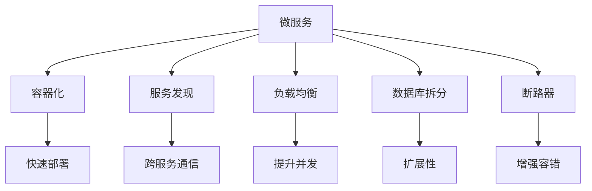
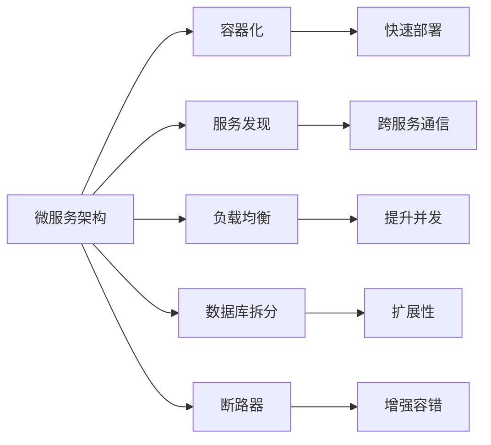
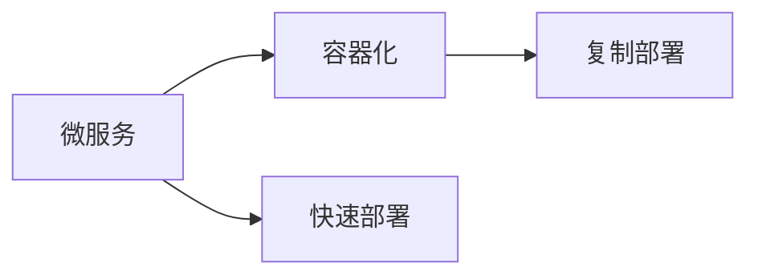
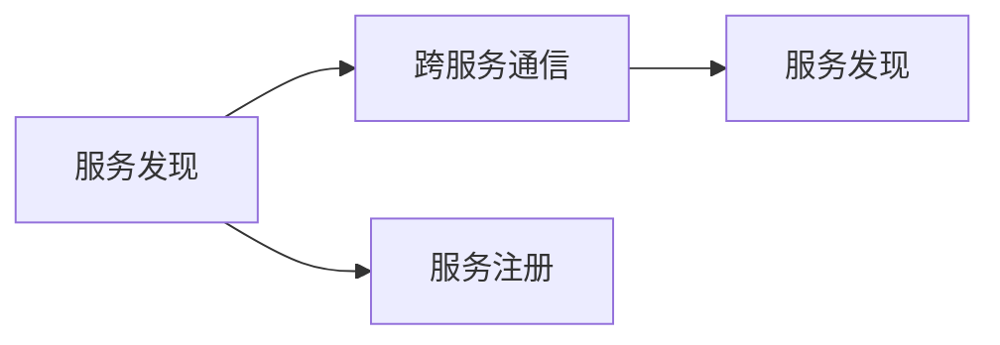
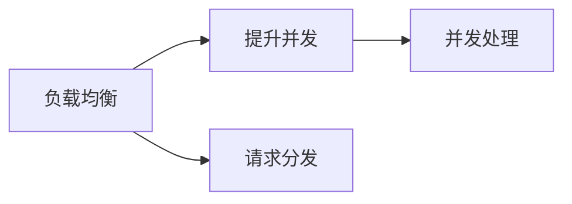
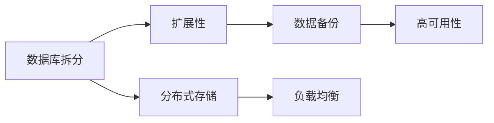
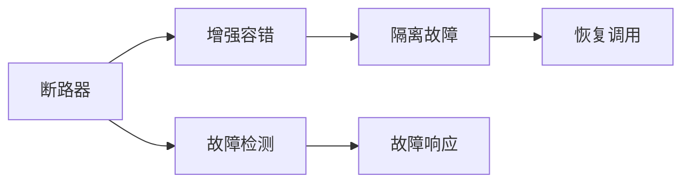
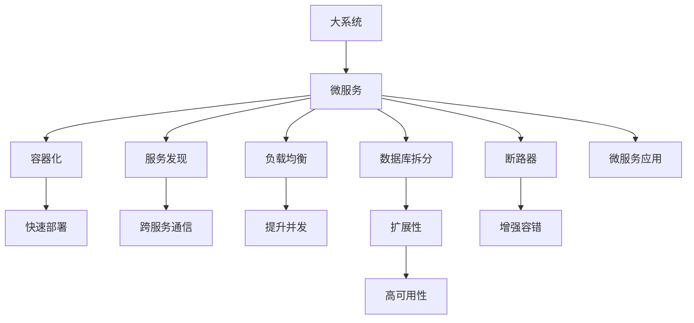

                 

## 1. 背景介绍

### 1.1 问题由来
随着互联网业务的飞速发展，系统的规模和复杂度日益增加，单块单体架构的传统应用逐渐暴露出诸多问题，如部署难度大、维护成本高、扩展性差等。面对这些问题，微服务架构应运而生，成为构建高扩展性、高可用性应用的重要选择。微服务架构通过将大系统拆分成多个独立的微服务，每个微服务独立部署、独立扩展，有效解决了传统单体架构下的扩展难题，为系统的快速迭代和高效运维提供了强有力的支持。

### 1.2 问题核心关键点
微服务架构的核心在于通过拆分业务逻辑，将复杂的系统拆解成多个独立的、可独立部署、独立扩展的微服务。每个微服务运行在独立的进程中，通过轻量级通信机制（如HTTP RESTful API）与其他微服务协同工作，实现系统的分布式部署和灵活扩展。微服务的核心原则是"独立构建、独立部署、独立运行、独立扩展"。

微服务架构的优势主要体现在以下几个方面：
1. 高扩展性：通过拆分业务逻辑，每个微服务可以独立扩展，无需整体系统停机。
2. 快速迭代：每个微服务独立部署，可以快速迭代开发和测试。
3. 松耦合：微服务之间通过轻量级通信机制相互调用，降低了系统间的耦合度。
4. 弹性伸缩：微服务可以灵活地分配计算资源，支持动态扩缩容。
5. 故障隔离：微服务架构中，一个微服务的故障不会影响到其他服务，增强了系统的稳定性和可靠性。

### 1.3 问题研究意义
微服务架构在提高系统扩展性、提升系统可靠性和加快系统迭代速度等方面具有重要意义。随着分布式系统在互联网应用的普及，微服务架构的这些优势越来越受到开发者和架构师的青睐，成为构建高可用、高扩展、高可靠性应用的首选架构范式。

## 2. 核心概念与联系

### 2.1 核心概念概述

为更好地理解微服务架构的优势，本节将介绍几个密切相关的核心概念：

- 微服务(Microservice)：将大系统拆分成多个独立的、可以独立部署、独立扩展的微服务。每个微服务负责一个独立的业务功能，如用户注册、订单管理、库存服务等。

- 容器化(Docker)：一种轻量级的虚拟化技术，可以将微服务打包为容器，便于在不同环境中快速部署和复制。

- 服务发现(Service Discovery)：微服务架构中，微服务通过服务发现机制获取其他服务的信息，实现跨服务通信。

- 负载均衡(Load Balancing)：在微服务架构中，负载均衡器负责将请求分发至不同的微服务实例，提高系统的并发处理能力。

- 数据库拆分(Database Sharding)：为了提高数据库的扩展性和可用性，数据库也通常按照业务功能进行拆分，如用户数据和订单数据分别存储在不同的数据库实例中。

- 断路器(Circuit Breaker)：一种用于提高系统容错性的机制，当系统出现故障时，断路器会立即中断服务调用，避免故障进一步蔓延。

这些核心概念之间的逻辑关系可以通过以下Mermaid流程图来展示：



这个流程图展示了大系统拆分成微服务后的整体架构，以及微服务架构中的关键组件和技术：

1. 微服务通过容器化技术实现快速部署。
2. 微服务通过服务发现机制实现跨服务通信。
3. 微服务通过负载均衡技术提升并发处理能力。
4. 数据库通过拆分提升扩展性和可用性。
5. 断路器机制增强系统的容错能力。

### 2.2 概念间的关系

这些核心概念之间存在着紧密的联系，形成了微服务架构的整体生态系统。下面我们通过几个Mermaid流程图来展示这些概念之间的关系。

#### 2.2.1 微服务架构的整体架构



这个综合流程图展示了微服务架构的整体架构，以及各个核心组件和技术的关系。

#### 2.2.2 微服务与容器化的关系



这个流程图展示了微服务与容器化的关系，通过容器化技术，微服务可以快速部署和复制。

#### 2.2.3 服务发现与跨服务通信的关系



这个流程图展示了服务发现与跨服务通信的关系，服务发现通过服务注册和发现机制，实现跨服务通信。

#### 2.2.4 负载均衡与提升并发的关系



这个流程图展示了负载均衡与提升并发的关系，负载均衡通过请求分发机制，提升系统的并发处理能力。

#### 2.2.5 数据库拆分与扩展性的关系



这个流程图展示了数据库拆分与扩展性的关系，通过数据库拆分，提升系统的扩展性和高可用性。

#### 2.2.6 断路器与增强容错的关系



这个流程图展示了断路器与增强容错的关系，通过断路器机制，增强系统的容错能力。

### 2.3 核心概念的整体架构

最后，我们用一个综合的流程图来展示这些核心概念在大系统微服务化过程中的整体架构：



这个综合流程图展示了从大系统拆分成微服务，再通过容器化、服务发现、负载均衡、数据库拆分和断路器等技术手段，构建起微服务架构的整体过程。通过这些流程图，我们可以更清晰地理解微服务架构中各个核心组件和技术的关系，为后续深入讨论具体的微服务实践奠定基础。

## 3. 核心算法原理 & 具体操作步骤
### 3.1 算法原理概述

微服务架构的核心算法原理是分布式系统架构的原理，即通过将大系统拆分成多个独立的、可以独立部署、独立扩展的微服务，实现系统的分布式部署和灵活扩展。每个微服务通过轻量级通信机制与其他微服务协同工作，从而实现系统的解耦和高效运行。

微服务架构的核心算法原理包括以下几个关键点：

- 分布式部署：将大系统拆分成多个独立的微服务，每个微服务独立部署，通过版本控制和自动化部署工具，实现快速迭代和灵活部署。
- 微服务通信：微服务通过轻量级通信机制（如HTTP RESTful API）相互调用，实现跨服务通信。
- 服务发现：微服务通过服务发现机制获取其他服务的信息，实现跨服务通信。
- 负载均衡：通过负载均衡器将请求分发至不同的微服务实例，提高系统的并发处理能力。
- 数据库拆分：为了提高数据库的扩展性和可用性，数据库通常按照业务功能进行拆分，如用户数据和订单数据分别存储在不同的数据库实例中。
- 断路器：用于提高系统容错性，当系统出现故障时，断路器会立即中断服务调用，避免故障进一步蔓延。

### 3.2 算法步骤详解

微服务架构的构建主要包括以下几个关键步骤：

**Step 1: 需求分析与系统拆分**

- 对系统进行需求分析，识别出系统中的不同业务模块和功能组件。
- 根据业务模块的功能和数据流，将系统拆分成多个独立的微服务。每个微服务负责一个独立的业务功能，如用户注册、订单管理、库存服务等。

**Step 2: 微服务设计**

- 根据需求分析结果，设计每个微服务的接口和数据流。接口设计应遵循RESTful原则，采用轻量级通信机制。
- 为每个微服务选择合适的技术栈和框架，如Spring Boot、Django、Node.js等。

**Step 3: 容器化与快速部署**

- 将每个微服务打包为容器（如Docker），方便在不同环境中快速部署和复制。
- 使用容器编排工具（如Kubernetes）管理容器的生命周期，实现自动扩展和故障恢复。

**Step 4: 服务发现与跨服务通信**

- 设计服务发现机制，通过服务注册和发现机制，实现跨服务通信。
- 使用服务发现工具（如Consul、Eureka）管理服务注册和发现，实现跨服务调用。

**Step 5: 负载均衡与提升并发**

- 设计负载均衡器，将请求分发至不同的微服务实例，提高系统的并发处理能力。
- 使用负载均衡工具（如Nginx、HAProxy）实现请求分发和负载均衡。

**Step 6: 数据库拆分与扩展性**

- 设计数据库拆分方案，将数据库按照业务功能进行拆分，如用户数据和订单数据分别存储在不同的数据库实例中。
- 使用分布式数据库（如MySQL Cluster、MongoDB）提升数据库的扩展性和高可用性。

**Step 7: 断路器与增强容错**

- 设计断路器机制，当系统出现故障时，断路器会立即中断服务调用，避免故障进一步蔓延。
- 使用断路器工具（如Hystrix、Resilience4j）实现断路器功能，增强系统的容错能力。

**Step 8: 监控与日志**

- 设计监控和日志系统，实时监控微服务的运行状态和性能指标，及时发现和解决问题。
- 使用监控工具（如Prometheus、Grafana）和日志工具（如ELK Stack、Splunk）实现监控和日志管理。

以上微服务架构的构建步骤，详细描述了从系统需求分析、微服务设计到部署、通信、扩展等各个环节的关键操作。这些步骤在实际应用中可能需要根据具体场景进行调整和优化，但核心思想和原则是一致的。

### 3.3 算法优缺点

微服务架构具有以下优点：

- 高扩展性：通过拆分业务逻辑，每个微服务可以独立扩展，无需整体系统停机。
- 快速迭代：每个微服务独立部署，可以快速迭代开发和测试。
- 松耦合：微服务之间通过轻量级通信机制相互调用，降低了系统间的耦合度。
- 弹性伸缩：微服务可以灵活地分配计算资源，支持动态扩缩容。
- 故障隔离：微服务架构中，一个微服务的故障不会影响到其他服务，增强了系统的稳定性和可靠性。

同时，微服务架构也存在一些缺点：

- 系统复杂度增加：微服务架构引入了更多的组件和工具，系统复杂度增加。
- 分布式协调难度大：微服务架构中的组件和工具需要协同工作，协调难度较大。
- 数据一致性问题：微服务架构中的数据拆分和分布式存储，可能带来数据一致性问题。
- 开发和运维成本高：微服务架构的开发和运维需要更多的资源和技术积累，成本较高。
- 版本管理困难：微服务架构中的版本管理和发布更新较为困难，可能引入不稳定的影响。

尽管存在这些缺点，但就目前而言，微服务架构仍然是大规模系统构建的首选方案。通过合理的系统设计和架构规划，可以最大限度地发挥微服务架构的优势，克服其缺点。

### 3.4 算法应用领域

微服务架构在多个领域都有广泛的应用，主要包括以下几个方面：

- 电子商务：如电商平台的用户管理、订单管理、库存管理等。通过微服务架构，可以构建高扩展性、高可用性的电商系统，满足用户海量访问和交易需求。
- 金融服务：如银行系统的账户管理、支付处理、风险控制等。通过微服务架构，可以构建高安全性、高可靠性的金融系统，保障用户资金和数据安全。
- 社交网络：如社交平台的用户管理、内容管理、推荐系统等。通过微服务架构，可以构建高并发、高扩展的社交平台，满足用户多样化的社交需求。
- 医疗健康：如医院的信息管理系统、预约系统、电子病历等。通过微服务架构，可以构建高可用、高可靠的医疗系统，保障患者的健康数据安全。
- 智能交通：如智慧城市的路况监控、交通管理、智能导航等。通过微服务架构，可以构建高效率、高可靠性的智能交通系统，提升城市的交通管理水平。
- 教育培训：如在线教育平台的用户管理、课程管理、学习推荐等。通过微服务架构，可以构建高扩展性、高可靠性的在线教育平台，满足用户多样化的学习需求。

除了上述这些领域，微服务架构还被广泛应用到企业内部系统集成、政府公共服务、物联网等领域，为各行各业带来显著的技术变革。

## 4. 数学模型和公式 & 详细讲解 & 举例说明

### 4.1 数学模型构建

本节将使用数学语言对微服务架构的构建过程进行更加严格的刻画。

记微服务系统为 $S=\{S_1, S_2, \ldots, S_n\}$，其中 $S_i$ 表示第 $i$ 个微服务。假设 $S_i$ 的数据流为 $D_i=\{d_{i1}, d_{i2}, \ldots, d_{im}\}$，其中 $d_{ij}$ 表示 $S_i$ 的第 $j$ 个数据流。

定义服务发现机制为 $F=\{f_1, f_2, \ldots, f_n\}$，其中 $f_j$ 表示 $S_i$ 的第 $j$ 个数据流的服务发现机制。

定义负载均衡机制为 $L=\{l_1, l_2, \ldots, l_n\}$，其中 $l_j$ 表示 $S_i$ 的第 $j$ 个数据流的负载均衡机制。

定义数据库拆分方案为 $D=\{d_1, d_2, \ldots, d_n\}$，其中 $d_j$ 表示 $S_i$ 的第 $j$ 个数据库拆分方案。

定义断路器机制为 $B=\{b_1, b_2, \ldots, b_n\}$，其中 $b_j$ 表示 $S_i$ 的第 $j$ 个数据流的断路器机制。

微服务架构的整体数学模型为：

$$
S = \bigcap_{i=1}^n S_i \quad \text{和} \quad \bigcup_{i=1}^n S_i = S
$$

其中 $\bigcap_{i=1}^n S_i$ 表示微服务系统中的每个微服务可以独立部署、独立扩展，$\bigcup_{i=1}^n S_i = S$ 表示每个微服务通过轻量级通信机制相互调用，实现跨服务通信。

### 4.2 公式推导过程

以下我们以微服务架构中的负载均衡机制为例，推导其数学模型及其梯度计算公式。

假设微服务 $S_i$ 的第 $j$ 个数据流 $d_{ij}$ 有 $N$ 个实例，每个实例的负载为 $W_{ij}$，负载均衡器将请求 $R$ 分配到 $d_{ij}$ 的实例 $w$，则负载均衡器 $l_j$ 的负载分配公式为：

$$
w = \arg\min_{1 \leq w \leq N} \frac{W_{ij}}{l_j}
$$

其中 $l_j$ 表示 $d_{ij}$ 的负载上限，$R$ 表示请求的负载。

负载均衡器 $l_j$ 的梯度计算公式为：

$$
\nabla_{W_{ij}} l_j = -\frac{1}{W_{ij}^2}
$$

其中 $\nabla_{W_{ij}} l_j$ 表示对 $W_{ij}$ 的梯度，表示 $W_{ij}$ 对 $l_j$ 的影响。

在得到负载均衡机制的梯度计算公式后，即可带入微服务架构的总体目标函数，完成模型的迭代优化。重复上述过程直至收敛，最终得到微服务架构的最佳负载均衡方案。

### 4.3 案例分析与讲解

假设在一个电商平台中，用户注册、订单管理和库存管理三个微服务需要进行负载均衡优化。已知每个微服务的负载均衡器参数如下：

- 用户注册服务 $S_1$：有2个实例，每个实例的负载上限为1000，当前负载为800。
- 订单管理服务 $S_2$：有4个实例，每个实例的负载上限为2000，当前负载为1500。
- 库存管理服务 $S_3$：有3个实例，每个实例的负载上限为1000，当前负载为500。

使用负载均衡器优化这3个微服务的负载，目标是使每个微服务的负载均衡。

根据负载均衡器的公式，计算每个实例的负载分配权重：

- 用户注册服务 $S_1$ 的负载分配权重为：
  $$
  w_1 = \frac{1}{2} \cdot \frac{1000}{800} = 1.25
  $$

- 订单管理服务 $S_2$ 的负载分配权重为：
  $$
  w_2 = \frac{1}{4} \cdot \frac{2000}{1500} = 1.333
  $$

- 库存管理服务 $S_3$ 的负载分配权重为：
  $$
  w_3 = \frac{1}{3} \cdot \frac{1000}{500} = 2
  $$

然后计算每个微服务的总负载：

- 用户注册服务 $S_1$ 的总负载为：
  $$
  W_1 = w_1 \cdot 800 = 1000
  $$

- 订单管理服务 $S_2$ 的总负载为：
  $$
  W_2 = w_2 \cdot 1500 = 2000
  $$

- 库存管理服务 $S_3$ 的总负载为：
  $$
  W_3 = w_3 \cdot 500 = 1000
  $$

最后，通过优化每个微服务的负载均衡器参数，使每个微服务的负载达到最优。例如，假设用户注册服务 $S_1$ 的负载均衡器参数 $l_1$ 调整为1000，则新的负载分配权重和总负载分别为：

- 用户注册服务 $S_1$ 的负载分配权重为：
  $$
  w_1 = \frac{1}{2} \cdot \frac{1000}{800} = 1.25
  $$

- 用户注册服务 $S_1$ 的总负载为：
  $$
  W_1 = w_1 \cdot 800 = 1000
  $$

- 订单管理服务 $S_2$ 的负载分配权重为：
  $$
  w_2 = \frac{1}{4} \cdot \frac{2000}{1500} = 1.333
  $$

- 订单管理服务 $S_2$ 的总负载为：
  $$
  W_2 = w_2 \cdot 1500 = 2000
  $$

- 库存管理服务 $S_3$ 的负载分配权重为：
  $$
  w_3 = \frac{1}{3} \cdot \frac{1000}{500} = 2
  $$

- 库存管理服务 $S_3$ 的总负载为：
  $$
  W_3 = w_3 \cdot 500 = 1000
  $$

通过上述计算，可以看出用户注册服务 $S_1$ 的负载均衡器参数 $l_1$ 调整后，使得每个微服务的负载达到最优。

## 5. 项目实践：代码实例和详细解释说明
### 5.1 开发环境搭建

在进行微服务实践前，我们需要准备好开发环境。以下是使用Python进行Django开发的环境配置流程：

1. 安装Anaconda：从官网下载并安装Anaconda，用于创建独立的Python环境。

2. 创建并激活虚拟环境：
```bash
conda create -n django-env python=3.8 
conda activate django-env
```

3. 安装Django：从官网获取Django最新版本，并在虚拟环境中安装。例如：
```bash
pip install django==4.0.3
```

4. 安装Django REST framework：用于实现RESTful API服务，并在虚拟环境中安装。例如：
```bash
pip install django-rest-framework==4.6.0
```

5. 安装Docker：用于实现微服务的容器化部署。例如：
```bash
sudo apt-get install docker.io
```

6. 配置Docker镜像仓库：在Docker中创建一个镜像仓库，用于存放和推送微服务镜像。例如：
```bash
docker login dockerhub.com
```

完成上述步骤后，即可在`django-env`环境中开始微服务实践。

### 5.2 源代码详细实现

这里我们以一个简单的电商订单管理微服务为例，给出使用Django框架进行微服务开发的Python代码实现。

首先，定义订单管理服务的URL路由：

```python
from django.urls import path
from . import views

urlpatterns = [
    path('api/orders/', views.OrderView.as_view()),
]
```

然后，定义订单管理的API视图类：

```python
from rest_framework.views import APIView
from rest_framework.response import Response
from .models import Order
from .serializers import OrderSerializer

class OrderView(APIView):
    def get(self, request, format=None):
        orders = Order.objects.all()
        serializer = OrderSerializer(orders, many=True)
        return Response(serializer.data)

    def post(self, request, format=None):
        serializer = OrderSerializer(data=request.data)
        if serializer.is_valid():
            serializer.save()
            return Response(serializer.data, status=201)
        return Response(serializer.errors, status=400)
```

接着，定义订单管理的数据模型和序列化类：

```python
from django.db import models
from rest_framework import serializers

class Order(models.Model):
    user = models.ForeignKey(User, on_delete=models.CASCADE)
    product = models.ForeignKey(Product, on_delete=models.CASCADE)
    amount = models.DecimalField(max_digits=10, decimal_places=2)
    status = models.CharField(max_length=20, choices=ORDER_STATUS_CHOICES)

class OrderSerializer(serializers.ModelSerializer):
    class Meta:
        model = Order
        fields = '__all__'
```

最后，运行Django应用并启动Docker容器：

```bash
python manage.py runserver 0.0.0.0:8000
docker run -d -p 8000:8000 -v /path/to/django/project:/home/django/app my_django_app
```

这个例子展示了如何使用Django框架构建微服务架构，通过RESTful API实现订单管理功能，并通过Docker容器化实现微服务的快速部署。

### 5.3 代码解读与分析

让我们再详细解读一下关键代码的实现细节：

**URL路由**：
- `from django.urls import path`：导入Django的URL路由模块。
- `urlpatterns = [path('api/orders/', views.OrderView.as_view())]`：定义订单管理的API路由，将请求路由到`OrderView`视图类。

**API视图类**：
- `from rest_framework.views import APIView`：导入Django REST framework的API视图类。
- `def get(self, request, format=None)`：定义GET请求处理函数，获取所有订单。
- `def post(self, request, format=None)`：定义POST请求处理函数，创建新订单。

**数据模型和序列化类**：
- `from django.db import models`：导入Django的数据库模块。
- `class Order(models.Model)`：定义订单管理的Data Model。
- `from rest_framework import serializers`：导入Django REST framework的序列化类。
- `class OrderSerializer(serializers.ModelSerializer)`：定义订单管理的序列化类。

**运行Django应用**：
- `python manage.py runserver 0.0.0.0:8000`：启动Django开发服务器，监听8000端口。
- `docker run -d -p 8000:8000 -v /path/to/django/project:/home/django/app my_django_app`：启动Docker容器，并将Django应用映射到容器中，

