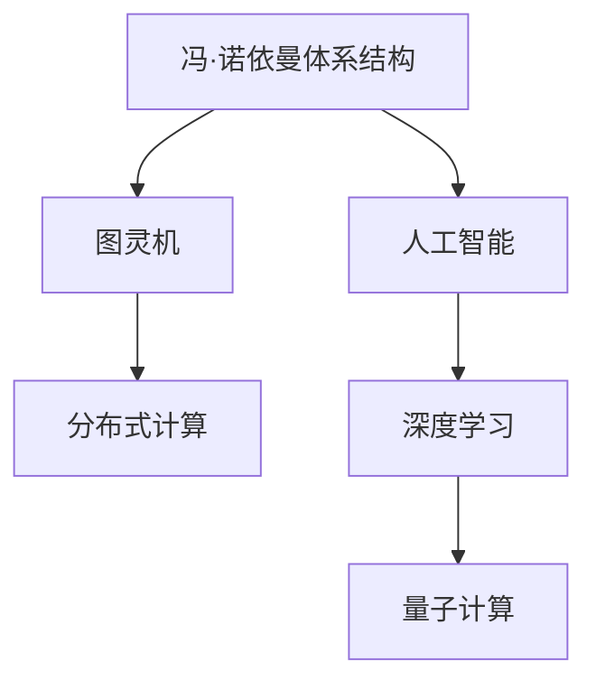

                 

# 思想的进化：从简单到复杂

## 1. 背景介绍

### 1.1 问题由来
现代计算机科学和人工智能的发展，离不开对计算机思想演进的深入理解和应用。从最初简单的逻辑电路到复杂的神经网络，计算机思想经历了从简单到复杂，从机械计算到智能推理的过程。这一过程不仅展示了人类对自然界和人工智能的深刻洞察，也推动了计算机科学和相关领域的飞速发展。

### 1.2 问题核心关键点
计算机思想的演变，涉及计算机体系结构、算法设计、应用实现等多个方面。其主要关键点包括：

- **计算模型**：从最早的冯·诺依曼体系结构到分布式计算、量子计算等先进模型。
- **算法设计**：从基础的排序、搜索算法到复杂的数据挖掘、机器学习算法。
- **应用实现**：从早期简单的数值计算到复杂的自然语言处理、计算机视觉等。
- **软件工程**：从早期的手工编程到现代的软件开发生命周期管理。
- **人工智能**：从基于规则的系统到神经网络、深度学习等智能化技术。

通过这些关键点的演进，我们可以看到计算机思想是如何一步步从简单走向复杂的。

### 1.3 问题研究意义
研究计算机思想演进，对于理解计算机科学和人工智能的发展历程，掌握现代计算技术的基本原理，推动相关技术的应用和创新，具有重要意义：

- **历史洞察**：有助于我们更全面地了解计算机科学的发展脉络，认识到当前技术的起源和发展方向。
- **技术应用**：通过对计算机思想演进的深入理解，我们可以更好地应用和改进现有的计算技术，开发出更高效、更智能的算法和系统。
- **创新驱动**：计算机思想的不断演进，激励了研究人员探索新方法，推动了计算机科学和人工智能的持续进步。
- **社会价值**：掌握先进的计算思想，有助于提高社会整体的科技水平，推动经济和社会发展。

## 2. 核心概念与联系

### 2.1 核心概念概述
为了更好地理解计算机思想从简单到复杂的演进过程，我们需要了解以下几个核心概念：

- **冯·诺依曼体系结构**：计算机的核心概念，以中央处理器和存储器为中心，通过输入输出设备与外部世界交互。
- **图灵机**：理论上的计算模型，描述了一台能够进行任意计算的通用机器。
- **人工智能**：使计算机能够模拟人的智能活动，包括感知、理解、学习、推理等。
- **深度学习**：基于神经网络的机器学习技术，模拟人脑的神经网络结构，用于复杂模式的识别和预测。
- **分布式计算**：将计算任务分散到多台计算机上并行处理，提高计算效率和系统可靠性。
- **量子计算**：利用量子位进行计算，可以解决传统计算机难以处理的复杂问题。

这些核心概念构成了计算机思想演进的基础，帮助我们理解从简单到复杂计算模型的演变。

### 2.2 概念间的关系
这些核心概念之间的关系可以通过以下Mermaid流程图来展示：



这个流程图展示了从冯·诺依曼体系结构到分布式计算，再到人工智能、深度学习和量子计算的演进过程。

## 3. 核心算法原理 & 具体操作步骤

### 3.1 算法原理概述
计算机思想的演进涉及从简单的计算模型到复杂的算法设计和应用实现。其核心算法原理包括：

- **算法设计**：基于不同的计算模型，设计相应的算法，如排序、搜索、图遍历等。
- **数据处理**：通过数据结构（如数组、链表、树等）进行数据的存储和操作。
- **模型训练**：通过大量数据对算法进行训练，优化其性能。
- **推理与预测**：利用训练好的模型进行推理和预测，如自然语言处理、图像识别等。
- **优化算法**：设计高效算法，如梯度下降、遗传算法等，提高计算效率和效果。

### 3.2 算法步骤详解
以下以深度学习为例，详细讲解其算法步骤：

1. **数据准备**：收集和预处理训练数据，包括图像、文本、声音等。
2. **模型设计**：选择合适的网络结构，如卷积神经网络(CNN)、循环神经网络(RNN)等。
3. **模型训练**：使用反向传播算法更新网络权重，优化模型性能。
4. **模型评估**：在验证集上评估模型效果，调整超参数。
5. **模型应用**：将训练好的模型应用于实际问题，如图像识别、语音识别、自然语言处理等。

### 3.3 算法优缺点
深度学习的优点包括：

- **高效建模**：能够处理大规模数据，提取复杂特征。
- **通用性**：适用于多种领域，如图像识别、语音处理、自然语言处理等。
- **预测精度高**：在许多任务上取得了最先进的性能。

其缺点包括：

- **计算资源需求高**：需要大量计算资源，如GPU、TPU等。
- **训练时间长**：训练过程耗时较长，且对超参数敏感。
- **解释性差**：深度学习模型往往是“黑箱”，难以解释内部决策过程。

### 3.4 算法应用领域
深度学习在以下几个领域得到了广泛应用：

- **计算机视觉**：如图像识别、目标检测、图像分割等。
- **自然语言处理**：如文本分类、情感分析、机器翻译等。
- **语音识别**：如语音转文字、语音合成等。
- **推荐系统**：如电商推荐、电影推荐等。
- **医疗健康**：如医学影像分析、疾病预测等。

## 4. 数学模型和公式 & 详细讲解

### 4.1 数学模型构建
深度学习的基本数学模型包括：

- **神经网络**：由多个层组成，每一层包含多个神经元。
- **反向传播算法**：通过链式法则计算误差梯度，更新网络权重。
- **损失函数**：衡量模型预测与真实标签之间的差异，如均方误差、交叉熵等。
- **激活函数**：如ReLU、Sigmoid等，增强网络的非线性能力。

### 4.2 公式推导过程
以下以线性回归为例，展示其基本公式推导过程：

假设我们有训练数据集 $\{(x_i, y_i)\}_{i=1}^N$，其中 $x_i \in \mathbb{R}^d$ 为输入向量，$y_i \in \mathbb{R}$ 为输出向量。我们的目标是找到一个线性模型 $h(x) = \theta^T x + b$ 进行拟合，其中 $\theta \in \mathbb{R}^d$ 为权重向量，$b$ 为偏置项。

损失函数为均方误差：

$$
L(y, \hat{y}) = \frac{1}{2N} \sum_{i=1}^N (y_i - \hat{y}_i)^2
$$

其中 $\hat{y}_i = \theta^T x_i + b$。

根据梯度下降算法，更新参数 $\theta$ 和 $b$ 的公式为：

$$
\theta \leftarrow \theta - \eta \nabla_{\theta}L(y, \hat{y})
$$

其中 $\eta$ 为学习率。

将 $\hat{y}_i$ 代入损失函数，得：

$$
L(y, \hat{y}) = \frac{1}{2N} \sum_{i=1}^N (y_i - \theta^T x_i - b)^2
$$

对 $\theta$ 和 $b$ 求偏导，得：

$$
\nabla_{\theta}L(y, \hat{y}) = \frac{1}{N} \sum_{i=1}^N (x_i - \overline{x})(y_i - \overline{y})
$$

$$
\nabla_{b}L(y, \hat{y}) = \frac{1}{N} \sum_{i=1}^N (y_i - \overline{y})
$$

其中 $\overline{x} = \frac{1}{N} \sum_{i=1}^N x_i$，$\overline{y} = \frac{1}{N} \sum_{i=1}^N y_i$。

最终，我们得到：

$$
\theta \leftarrow \theta - \eta \frac{1}{N} \sum_{i=1}^N (x_i - \overline{x})(y_i - \overline{y})
$$

$$
b \leftarrow b - \eta \frac{1}{N} \sum_{i=1}^N (y_i - \overline{y})
$$

这就是线性回归的基本推导过程。通过不断迭代上述公式，我们能够最小化损失函数，得到最优的 $\theta$ 和 $b$，实现线性回归模型的训练。

### 4.3 案例分析与讲解
以图像分类为例，展示深度学习的基本应用。

假设我们有一个包含 $C$ 个类别的图像分类任务，输入为 $m \times n \times c$ 的图像数据，输出为 $C$ 维的向量 $y$，表示该图像属于哪个类别。

深度学习中，我们通常使用卷积神经网络(CNN)进行图像分类。CNN包括卷积层、池化层、全连接层等。

- **卷积层**：对输入图像进行卷积操作，提取局部特征。
- **池化层**：对卷积层的输出进行降维，减小参数量。
- **全连接层**：将池化层的输出转换为 $C$ 维向量，进行分类。

假设卷积层的输出为 $H \times W \times k$，其中 $H$ 和 $W$ 为特征图的高和宽，$k$ 为特征图的深度。全连接层的输出为 $N \times H \times W \times k$，其中 $N$ 为样本数量。

则线性回归部分的公式变为：

$$
\theta \leftarrow \theta - \eta \frac{1}{N} \sum_{i=1}^N \sum_{j=1}^C (\sum_{l=1}^k h_{il}^T x_{il} - \overline{x}^T \overline{y})
$$

$$
b \leftarrow b - \eta \frac{1}{N} \sum_{i=1}^N \sum_{j=1}^C (y_j - \overline{y})
$$

其中 $x_{il}$ 表示第 $i$ 个样本的第 $l$ 个特征图的第 $j$ 个通道。$h_{il}$ 表示第 $i$ 个样本的第 $l$ 个特征图的第 $j$ 个通道的权重向量。

通过上述公式，我们能够不断迭代训练深度学习模型，得到最优的 $\theta$ 和 $b$，实现图像分类的任务。

## 5. 项目实践：代码实例和详细解释说明

### 5.1 开发环境搭建

**Python环境**：

1. 安装Python 3.6及以上版本。
2. 安装Anaconda或Miniconda，用于创建虚拟环境。
3. 安装NumPy、Pandas、SciPy等科学计算库。
4. 安装Keras或TensorFlow等深度学习框架。

**深度学习框架**：

1. 安装Keras，用一行命令即可快速搭建深度学习环境。
2. 安装TensorFlow，通过pip安装，支持GPU加速。
3. 安装PyTorch，支持GPU加速，与NVIDIA库深度集成。

### 5.2 源代码详细实现

以下是一个简单的卷积神经网络实现，用于图像分类任务：

```python
import tensorflow as tf
from tensorflow.keras import datasets, layers, models

# 加载数据集
(train_images, train_labels), (test_images, test_labels) = datasets.cifar10.load_data()

# 标准化像素值
train_images, test_images = train_images / 255.0, test_images / 255.0

# 构建卷积神经网络模型
model = models.Sequential([
    layers.Conv2D(32, (3, 3), activation='relu', input_shape=(32, 32, 3)),
    layers.MaxPooling2D((2, 2)),
    layers.Conv2D(64, (3, 3), activation='relu'),
    layers.MaxPooling2D((2, 2)),
    layers.Conv2D(64, (3, 3), activation='relu'),
    layers.Flatten(),
    layers.Dense(64, activation='relu'),
    layers.Dense(10)
])

# 编译模型
model.compile(optimizer='adam',
              loss=tf.keras.losses.SparseCategoricalCrossentropy(from_logits=True),
              metrics=['accuracy'])

# 训练模型
model.fit(train_images, train_labels, epochs=10, 
          validation_data=(test_images, test_labels))
```

该代码实现了包含三个卷积层的卷积神经网络，用于对CIFAR-10数据集进行图像分类。

### 5.3 代码解读与分析

**数据预处理**：

1. 使用`datasets.cifar10.load_data()`函数加载CIFAR-10数据集。
2. 将像素值标准化到0到1之间。

**模型定义**：

1. 使用`Sequential`模型定义卷积神经网络，包含三个卷积层、两个池化层和两个全连接层。
2. 卷积层使用`Conv2D`，指定卷积核大小和激活函数。
3. 池化层使用`MaxPooling2D`，对卷积层输出进行降维。
4. 全连接层使用`Dense`，进行分类。

**模型编译**：

1. 使用`compile`方法编译模型，指定优化器、损失函数和评估指标。

**模型训练**：

1. 使用`fit`方法训练模型，指定训练数据、验证数据和迭代次数。

## 6. 实际应用场景

### 6.1 智能推荐系统

智能推荐系统利用深度学习模型对用户行为进行分析和预测，提供个性化的推荐内容。在电商、视频、音乐等平台上广泛应用。

**算法实现**：

1. 收集用户的历史行为数据，包括浏览、购买、评分等。
2. 使用深度学习模型，如协同过滤、隐语义模型等，对用户和物品进行表示学习。
3. 利用表示学习的用户和物品向量，计算相似度，推荐相关物品。

**应用案例**：

1. 电商推荐：根据用户浏览记录，推荐相关商品。
2. 音乐推荐：根据用户听歌记录，推荐相似音乐。
3. 视频推荐：根据用户观看记录，推荐相关视频。

### 6.2 医疗影像分析

医疗影像分析利用深度学习模型对医学影像进行分析和诊断。在放射科、病理科等科室广泛应用。

**算法实现**：

1. 收集和标注大量医学影像数据。
2. 使用深度学习模型，如卷积神经网络、循环神经网络等，对医学影像进行特征提取和分类。
3. 利用模型对新医学影像进行诊断。

**应用案例**：

1. 医学影像分类：对CT、MRI等医学影像进行分类，如肿瘤、病灶、正常组织等。
2. 医学影像分割：对医学影像进行分割，提取感兴趣区域。
3. 医学影像生成：生成医学影像，如模拟CT图像。

### 6.3 自然语言处理

自然语言处理利用深度学习模型对自然语言进行处理和分析。在语音识别、机器翻译、文本分类等任务中广泛应用。

**算法实现**：

1. 收集和标注大量自然语言数据。
2. 使用深度学习模型，如循环神经网络、长短期记忆网络等，对自然语言进行序列建模。
3. 利用模型进行自然语言处理任务，如语言翻译、文本分类、情感分析等。

**应用案例**：

1. 机器翻译：将一种语言翻译成另一种语言。
2. 情感分析：对用户评论进行情感分析，判断其情感倾向。
3. 文本分类：对新闻、文章等文本进行分类，如体育、娱乐、科技等。

## 7. 工具和资源推荐

### 7.1 学习资源推荐

1. **《深度学习》**：Ian Goodfellow、Yoshua Bengio和Aaron Courville合著的经典教材，涵盖深度学习的理论和实践。
2. **《机器学习实战》**：Peter Harrington所著，结合实际项目讲解机器学习算法和实现。
3. **《Python深度学习》**：Francois Chollet所著，介绍TensorFlow和Keras框架的使用。
4. **Coursera、edX等在线课程**：提供深度学习、机器学习、自然语言处理等课程，由顶尖大学和公司授课。
5. **Kaggle竞赛**：参与实际问题解决竞赛，提高实践能力。

### 7.2 开发工具推荐

1. **PyTorch**：Python深度学习框架，灵活易用，支持GPU加速。
2. **TensorFlow**：由Google开发的深度学习框架，功能强大，支持分布式计算。
3. **Keras**：高层次深度学习框架，快速构建深度学习模型。
4. **Jupyter Notebook**：交互式开发环境，支持代码编写、执行和文档编写。
5. **GitHub**：版本控制平台，支持代码管理、协作开发和共享。

### 7.3 相关论文推荐

1. **《Deep Learning》**：Goodfellow、Bengio和Courville合著的经典教材，涵盖深度学习理论和实践。
2. **《Neural Networks and Deep Learning》**：Michael Nielsen所著，介绍神经网络和深度学习的基本原理。
3. **《Natural Language Processing with Python》**：Steven Bird、Ewan Klein和Edward Loper合著的教材，介绍自然语言处理的基本方法和技术。
4. **《Deep Reinforcement Learning with Python》**：John Schulman、Ian Goodfellow等合著的书籍，介绍深度强化学习的基本原理和实践。
5. **《Understanding Deep Learning》**：Christopher M. Bishop所著，介绍深度学习的基本原理和应用。

## 8. 总结：未来发展趋势与挑战

### 8.1 研究成果总结

计算机思想的演进经历了从简单到复杂的漫长过程。从最早的冯·诺依曼体系结构，到分布式计算、深度学习等先进技术，计算机思想在不断进化中取得巨大成就。深度学习技术在自然语言处理、计算机视觉、语音识别等领域的广泛应用，显著提升了计算机系统的智能化水平。

### 8.2 未来发展趋势

未来，计算机思想将向以下几个方向发展：

1. **分布式计算**：随着硬件和网络技术的进步，分布式计算将进一步提升计算效率和系统可靠性。
2. **量子计算**：量子计算机将解决传统计算机难以处理的问题，如大数分解、模拟量子系统等。
3. **自适应计算**：动态调整计算资源和算法，适应不同场景下的需求，提高计算效率和效果。
4. **混合智能**：结合人工智能与人类智能，实现更高效、更可靠的智能系统。
5. **跨领域融合**：计算机思想将与其他领域技术进行更深层次的融合，如生物计算、材料计算等。

### 8.3 面临的挑战

尽管计算机思想在不断进步，但仍面临诸多挑战：

1. **计算资源瓶颈**：深度学习等计算密集型任务需要大量计算资源，如何高效利用计算资源，是未来需要解决的重要问题。
2. **模型复杂性**：深度学习模型结构复杂，难以解释内部决策过程，如何提高模型的可解释性和鲁棒性，是未来需要研究的重点。
3. **数据隐私和安全**：深度学习模型需要大量数据进行训练，如何保护数据隐私和安全，是未来需要考虑的重要问题。
4. **伦理和社会责任**：深度学习模型可能带来道德和社会问题，如何确保模型符合伦理和社会规范，是未来需要解决的重要问题。

### 8.4 研究展望

未来，计算机思想的演进需要关注以下几个方向：

1. **智能算法设计**：结合符号逻辑和机器学习，设计更加智能和灵活的算法。
2. **跨学科融合**：将计算机思想与其他学科知识进行融合，拓展计算技术的应用范围。
3. **伦理和社会责任**：在深度学习模型的开发和应用中，始终关注伦理和社会责任，确保技术的安全和可靠。

计算机思想的演进是一个长期而复杂的历程，需要不断探索和创新。通过持续的研究和实践，相信计算机思想将在未来取得更大的成就，为人类社会的发展带来更多机遇和挑战。

## 9. 附录：常见问题与解答

**Q1：计算机思想是如何从简单到复杂演进的？**

A: 计算机思想从简单到复杂演进的过程，涉及多个关键技术的发展和应用。从最早的冯·诺依曼体系结构，到分布式计算、深度学习等先进技术，计算机思想在不断进化中取得巨大成就。

**Q2：深度学习的优点和缺点是什么？**

A: 深度学习的优点包括：

- 高效建模：能够处理大规模数据，提取复杂特征。
- 通用性：适用于多种领域，如图像识别、语音处理、自然语言处理等。
- 预测精度高：在许多任务上取得了最先进的性能。

其缺点包括：

- 计算资源需求高：需要大量计算资源，如GPU、TPU等。
- 训练时间长：训练过程耗时较长，且对超参数敏感。
- 解释性差：深度学习模型往往是“黑箱”，难以解释内部决策过程。

**Q3：智能推荐系统的算法实现过程是什么？**

A: 智能推荐系统的算法实现过程如下：

1. 收集用户的历史行为数据，包括浏览、购买、评分等。
2. 使用深度学习模型，如协同过滤、隐语义模型等，对用户和物品进行表示学习。
3. 利用表示学习的用户和物品向量，计算相似度，推荐相关物品。

**Q4：医疗影像分析的应用场景是什么？**

A: 医疗影像分析的应用场景包括：

1. 医学影像分类：对CT、MRI等医学影像进行分类，如肿瘤、病灶、正常组织等。
2. 医学影像分割：对医学影像进行分割，提取感兴趣区域。
3. 医学影像生成：生成医学影像，如模拟CT图像。

**Q5：自然语言处理的算法实现过程是什么？**

A: 自然语言处理的算法实现过程如下：

1. 收集和标注大量自然语言数据。
2. 使用深度学习模型，如循环神经网络、长短期记忆网络等，对自然语言进行序列建模。
3. 利用模型进行自然语言处理任务，如语言翻译、文本分类、情感分析等。

**Q6：深度学习的训练过程包括哪些步骤？**

A: 深度学习的训练过程包括以下步骤：

1. 数据准备：收集和预处理训练数据，包括图像、文本、声音等。
2. 模型设计：选择合适的网络结构，如卷积神经网络(CNN)、循环神经网络(RNN)等。
3. 模型训练：使用反向传播算法更新网络权重，优化模型性能。
4. 模型评估：在验证集上评估模型效果，调整超参数。
5. 模型应用：将训练好的模型应用于实际问题，如图像识别、语音识别、自然语言处理等。

**Q7：计算机思想演进过程中，有哪些重要里程碑事件？**

A: 计算机思想演进过程中，重要里程碑事件包括：

- 1946年，ENIAC计算机问世，开启了计算机时代。
- 1950年，图灵提出图灵机概念，奠定了计算机科学理论基础。
- 1964年，IBM发布SRET-1，采用虚拟存储和分时系统。
- 1968年，Dijkstra开发UNIX操作系统，推动了操作系统和编程语言的发展。
- 1990年，互联网技术问世，开启了计算机网络新纪元。
- 2012年，AlexNet在图像识别竞赛中取得突破，深度学习技术开始崛起。

这些里程碑事件，标志着计算机思想在不同历史阶段的演进，推动了计算机技术的发展和应用。

**Q8：未来计算机思想的发展方向是什么？**

A: 未来计算机思想的发展方向包括：

1. 分布式计算：随着硬件和网络技术的进步，分布式计算将进一步提升计算效率和系统可靠性。
2. 量子计算：量子计算机将解决传统计算机难以处理的问题，如大数分解、模拟量子系统等。
3. 自适应计算：动态调整计算资源和算法，适应不同场景下的需求，提高计算效率和效果。
4. 混合智能：结合人工智能与人类智能，实现更高效、更可靠的智能系统。
5. 跨领域融合：将计算机思想与其他学科知识进行融合，拓展计算技术的应用范围。

这些发展方向将推动计算机技术在更多领域取得突破，带来更大的社会和经济价值。

---

作者：禅与计算机程序设计艺术 / Zen and the Art of Computer Programming

