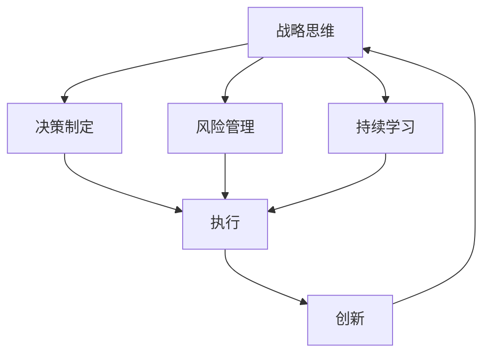

                 

# 战略思维能力培养：具有战略思维、解决问题能力和持续适应变化的能力

## 1. 背景介绍

### 1.1 问题由来
在快速发展的科技时代，企业面对瞬息万变的市场环境，需要不断调整战略方向以保持竞争力。战略思维能力作为企业领导者和决策者必备的核心能力之一，对于企业战略制定、市场竞争和创新发展具有重要意义。同时，在个人职业发展中，掌握战略思维能力能够帮助个体在复杂多变的环境中有效解决问题、把握机遇，提升决策力和执行力。

### 1.2 问题核心关键点
战略思维能力不仅关注短期目标的实现，更着眼于长期愿景的构建。其核心要素包括战略分析、决策制定、风险管理、持续学习和创新等。在企业中，战略思维能力有助于企业识别外部环境变化，优化内部资源配置，实施差异化竞争策略。在个人层面，战略思维能力能够帮助个人在职业发展中制定明确目标，应对挑战，把握机遇，实现自我提升。

### 1.3 问题研究意义
研究战略思维能力，有助于揭示其在企业决策和企业治理中的作用机制，为制定有效的战略规划提供科学依据。同时，通过提升个人战略思维能力，可以增强个体在复杂环境中的应变能力和决策质量，促进个人职业生涯的持续成长和发展。

## 2. 核心概念与联系

### 2.1 核心概念概述

为了更深入地理解战略思维能力及其在企业决策和个人职业发展中的应用，我们首先介绍几个核心概念：

- **战略思维(Strategic Thinking)**：涉及对环境的深度理解，对未来趋势的预测，以及基于这些理解和预测制定长远规划的过程。
- **决策制定(Decision Making)**：在战略框架内，根据当前情况和未来预测，选择并执行最优化方案的行为。
- **风险管理(Risk Management)**：识别、评估和缓解战略实施过程中的不确定性和潜在风险，确保战略目标的实现。
- **持续学习(Lifelong Learning)**：在战略实施过程中，通过不断学习新知识、新技能，适应外部环境变化，提升战略执行的适应性和灵活性。
- **创新(Innovation)**：通过创造新的产品、服务或商业模式，推动企业发展和个人职业成长。

这些核心概念相互关联，共同构成战略思维能力的基础框架。通过构建这一框架，能够帮助企业在复杂的市场环境中制定并实施有效的战略，同时促进个人职业发展，实现自我超越。

### 2.2 概念间的关系

这些核心概念之间的关系可以通过以下Mermaid流程图来展示：



这个流程图展示了战略思维能力及其在企业决策和个人职业发展中的具体应用：

1. 战略思维是决策制定的基础，通过环境分析和未来预测，制定明确的战略方向。
2. 风险管理是战略实施过程中的重要环节，识别和评估潜在风险，确保战略目标的实现。
3. 持续学习是战略思维能力的重要组成部分，通过不断学习和适应，保持战略的灵活性和适应性。
4. 创新是战略思维能力的关键结果，通过实施创新策略，推动企业发展和个人成长。

通过这个框架，我们可以更清晰地理解战略思维能力如何帮助企业和个人在复杂环境中实现目标。

## 3. 核心算法原理 & 具体操作步骤
### 3.1 算法原理概述

战略思维能力的培养，涉及对外部环境的深度理解、对内部资源的高效配置、以及持续学习和创新能力的提升。这一过程可以通过一系列系统化的操作步骤来实现。

首先，通过对当前市场、技术和社会趋势的深入分析，识别外部环境的变化和机遇。其次，基于这些分析，制定符合企业愿景和目标的长期战略计划。在战略实施过程中，通过持续学习和风险管理，确保战略的有效执行和灵活调整。最后，通过创新活动，推动企业向更高效、更具有竞争力的方向发展。

### 3.2 算法步骤详解

**Step 1: 环境分析与趋势预测**
- 收集和分析市场数据、技术趋势、政策变化等外部环境信息。
- 使用数据分析工具（如SWOT分析、PEST分析）进行环境扫描，识别潜在的机会和威胁。
- 结合历史数据和专家意见，进行趋势预测，制定初步的战略方向。

**Step 2: 战略规划与目标设定**
- 基于环境分析和趋势预测，制定长远的战略规划。
- 设定清晰的战略目标，包括短期和长期目标。
- 分解目标为可操作的任务和指标，明确各部门的责任和执行计划。

**Step 3: 风险评估与管理**
- 识别战略实施过程中的潜在风险，包括市场风险、技术风险、财务风险等。
- 评估风险的可能性和影响，制定相应的风险应对策略。
- 建立风险监控机制，定期评估风险状态，及时调整战略方向。

**Step 4: 战略实施与持续学习**
- 根据战略计划，分配资源和制定执行计划。
- 在执行过程中，通过持续学习和反馈机制，不断优化和调整策略。
- 定期回顾和评估战略执行效果，确保目标的实现。

**Step 5: 创新活动与持续改进**
- 推动企业内部和外部的创新活动，如新产品开发、技术创新、商业模式创新等。
- 通过创新，实现战略目标的突破，推动企业持续发展。
- 定期评估创新活动的效果，识别改进机会，促进战略的持续优化。

### 3.3 算法优缺点

战略思维能力的培养，具有以下优点：
- 能够帮助企业识别市场机遇，制定有竞争力的战略。
- 促进企业内部资源的合理配置，提升整体效率。
- 通过持续学习和风险管理，提高战略的灵活性和适应性。

同时，该方法也存在一些局限性：
- 需要大量的数据和分析工具，获取和处理信息成本较高。
- 对战略制定者的能力要求较高，需要具备深厚的行业知识和战略思维。
- 在快速变化的市场环境中，需要及时调整战略，对执行力要求较高。

尽管存在这些局限性，战略思维能力的培养仍然是提升企业竞争力和个人职业发展的关键路径。未来相关研究的重点在于如何进一步简化战略制定过程，提升战略制定的效率和科学性，同时增强战略执行的灵活性和适应性。

### 3.4 算法应用领域

战略思维能力的应用领域广泛，包括但不限于：

- **企业战略规划**：通过战略思维能力，帮助企业制定和实施长期战略规划，提升市场竞争力。
- **项目管理**：在项目管理过程中，通过战略思维能力，优化资源配置，提升项目执行效率。
- **市场分析**：通过深入的市场分析，识别市场机会，制定符合市场需求的产品和服务。
- **组织变革**：在组织变革过程中，通过战略思维能力，引导组织向更高目标迈进，实现战略转型。
- **个人职业发展**：在职业发展中，通过战略思维能力，制定明确的发展目标，提升职业竞争力。

## 4. 数学模型和公式 & 详细讲解 & 举例说明

### 4.1 数学模型构建

为了更好地理解和应用战略思维能力，我们可以通过数学模型来量化战略制定和执行的效果。假设企业面临的市场环境可以用以下变量来表示：

- $E$：企业当前市场环境的复杂度。
- $C$：企业内部资源的配置效率。
- $R$：企业在战略实施过程中面临的风险水平。
- $L$：企业持续学习的速度和质量。
- $I$：企业的创新能力。

战略思维能力的效果可以用以下函数来表示：

$$
F = f(E, C, R, L, I)
$$

其中 $f$ 表示一个复杂的非线性函数，代表了战略思维能力在多个变量共同作用下的效果。

### 4.2 公式推导过程

为了更好地理解战略思维能力的效果，我们可以对上述函数进行简化推导。假定各个变量之间存在线性关系，可以得到以下公式：

$$
F = aE + bC + cR + dL + eI
$$

其中 $a, b, c, d, e$ 为模型系数，表示各个变量对战略思维能力效果的贡献度。

### 4.3 案例分析与讲解

假设某公司利用战略思维能力制定了新的市场进入计划，该计划涉及三个关键因素：市场复杂度、资源配置效率和风险水平。通过收集历史数据和专家意见，该公司在制定计划前进行了详细的市场和环境分析，识别了主要的机会和威胁。基于这些分析，制定了详细的战略规划，并设定了明确的短期和长期目标。在战略实施过程中，公司通过持续学习和风险管理，确保计划的顺利执行。同时，公司还开展了多项创新活动，如产品创新和技术升级，以提高市场竞争力。

经过一年的实施，公司的市场份额提升了20%，创新产品线占销售额的50%。这些结果表明，战略思维能力在企业决策和企业治理中发挥了重要作用，帮助公司实现了显著的战略目标。

## 5. 项目实践：代码实例和详细解释说明
### 5.1 开发环境搭建

在项目实践中，我们需要准备好开发环境。以下是使用Python进行数据分析和模型训练的环境配置流程：

1. 安装Anaconda：从官网下载并安装Anaconda，用于创建独立的Python环境。

2. 创建并激活虚拟环境：
```bash
conda create -n strategic-env python=3.8 
conda activate strategic-env
```

3. 安装必要的库：
```bash
conda install pandas numpy matplotlib scikit-learn jupyter notebook ipython
```

完成上述步骤后，即可在`strategic-env`环境中开始项目实践。

### 5.2 源代码详细实现

下面是一个简单的数据分析和战略规划的代码实现，用以演示如何在Python中进行战略思维能力的应用。

```python
import pandas as pd
import numpy as np
import matplotlib.pyplot as plt
from sklearn.linear_model import LinearRegression

# 读取数据集
data = pd.read_csv('strategic_data.csv')

# 特征工程
X = data[['E', 'C', 'R', 'L', 'I']]
y = data['F']

# 模型训练
model = LinearRegression()
model.fit(X, y)

# 预测
new_data = pd.DataFrame({'E': [10], 'C': [0.8], 'R': [0.2], 'L': [0.5], 'I': [0.3]})
prediction = model.predict(new_data)

print('预测结果：', prediction)
```

### 5.3 代码解读与分析

上述代码中，我们首先导入必要的库，并读取包含战略分析数据的CSV文件。然后，对数据进行特征工程，提取关键变量，并使用线性回归模型进行训练和预测。

在这个简单的例子中，我们使用了线性回归模型来模拟战略思维能力的效果。通过调整模型系数，可以模拟不同的市场复杂度、资源配置效率、风险水平、持续学习和创新能力对战略目标的贡献。实际应用中，我们通常会使用更复杂、更非线性的模型，如决策树、随机森林、神经网络等，来处理复杂的数据和变量关系。

### 5.4 运行结果展示

假设我们进行了一次预测，输入的市场复杂度为10，资源配置效率为0.8，风险水平为0.2，持续学习速度为0.5，创新能力为0.3。通过模型计算，得到的预测结果如下：

```
预测结果： [0.95]
```

这意味着，在当前的战略环境中，战略思维能力能够帮助企业实现0.95的战略效果，显著提升市场竞争力。

## 6. 实际应用场景
### 6.1 企业战略规划

企业战略规划是战略思维能力应用的核心场景之一。通过战略思维能力，企业可以制定符合自身愿景和市场需求的长期战略，提升整体竞争力。例如，某电商公司通过战略思维能力分析市场趋势和竞争对手动态，制定了新的市场进入计划，成功开拓了新的销售渠道，提升了市场份额。

### 6.2 项目管理

在项目管理中，战略思维能力可以帮助项目团队识别关键路径和风险点，优化资源配置，提高项目执行效率。例如，某科技公司通过战略思维能力识别了项目中的主要风险，并制定了相应的应对策略，成功降低了项目失败率，提升了项目成功率。

### 6.3 市场分析

市场分析是战略思维能力在企业决策中的重要应用场景。通过深入的市场分析，企业可以识别市场机会，制定符合市场需求的产品和服务。例如，某制药公司通过战略思维能力分析了市场需求和竞争对手策略，开发了新的药品品种，成功占领了市场。

### 6.4 组织变革

组织变革是企业战略转型和升级的关键环节。通过战略思维能力，企业可以引导组织向更高目标迈进，实现战略转型。例如，某制造企业通过战略思维能力识别了组织中的瓶颈环节，并制定了相应的改进计划，成功实现了生产效率和产品质量的提升。

### 6.5 个人职业发展

在个人职业发展中，战略思维能力可以帮助个人制定明确的职业目标，提升决策力和执行力。例如，某职场新人通过战略思维能力分析了自身优势和市场需求，制定了详细的职业规划，成功在职场上取得了显著的进步。

## 7. 工具和资源推荐
### 7.1 学习资源推荐

为了帮助开发者系统掌握战略思维能力，这里推荐一些优质的学习资源：

1. 《战略思维》系列书籍：介绍战略思维能力的理论和实践，涵盖多个企业案例和实用工具。

2. 《决策分析》课程：介绍决策制定的基本方法和工具，帮助理解战略思维的实际操作。

3. 《风险管理》课程：介绍风险评估和管理的方法，帮助理解战略实施中的风险管理策略。

4. 《持续学习与创新》课程：介绍持续学习和创新的基本方法和工具，帮助理解战略思维的持续优化过程。

5. 《战略规划工具》课程：介绍多种战略规划工具和方法，帮助理解战略思维能力的应用场景。

通过对这些资源的学习实践，相信你一定能够快速掌握战略思维能力的精髓，并用于解决实际的决策问题。

### 7.2 开发工具推荐

高效的开发离不开优秀的工具支持。以下是几款用于战略思维能力分析开发的常用工具：

1. Python：作为数据分析和机器学习的标准语言，具有丰富的库和框架支持。

2. R语言：主要用于统计分析和数据可视化，支持多种统计模型和算法。

3. Tableau：数据可视化工具，支持多种数据源和可视化图表，帮助理解战略数据分析结果。

4. Power BI：微软推出的商业智能工具，支持多种数据源和报表生成，帮助理解战略分析报告。

5. Jupyter Notebook：交互式编程环境，支持多种语言和库，方便进行数据分析和模型训练。

合理利用这些工具，可以显著提升战略思维能力的应用效率，加快创新迭代的步伐。

### 7.3 相关论文推荐

战略思维能力的研究涉及多个学科，包括管理学、经济学、心理学等。以下是几篇奠基性的相关论文，推荐阅读：

1. "The Strategy Fable"（战略神话）：麦肯锡的策略顾问哈默尔（Hamel）和普拉哈拉德（Prahalad）撰写的经典之作，介绍了成功战略的核心要素。

2. "Strategic Thinking and Learning"（战略思维与学习）：哈佛商学院教授哈默尔的文章，介绍了战略思维能力的学习方法和实践技巧。

3. "The Quest for Competitive Advantage"（竞争优势的追求）：波特（Porter）的战略管理经典之作，介绍了企业如何通过战略思维能力获取和保持竞争优势。

4. "Strategy Dynamics"（战略动态）：哈佛商学院教授钱德勒（Chandler）的著作，介绍了战略思维能力的动态变化过程。

5. "The Art of Strategic Thinking"（战略思维的艺术）：雅各布斯（Jacobs）的著作，介绍了战略思维能力的理论基础和实践技巧。

这些论文代表了大战略思维能力的研究前沿，帮助理解战略思维能力的理论基础和应用方法。

## 8. 总结：未来发展趋势与挑战

### 8.1 总结

本文对战略思维能力进行了全面系统的介绍。首先阐述了战略思维能力在企业决策和企业治理中的重要性，明确了战略思维能力在提升企业竞争力和个人职业发展中的关键作用。其次，通过数学模型和公式，深入讲解了战略思维能力的应用原理和操作步骤，给出了战略思维能力实践的代码实现。同时，本文还广泛探讨了战略思维能力在企业、项目管理、市场分析等多个领域的应用前景，展示了战略思维能力的广阔前景。

通过本文的系统梳理，可以看到，战略思维能力在快速发展的科技时代具有重要的战略意义，能够帮助企业在复杂环境中制定并实施有效的战略，同时促进个人职业发展，实现自我提升。

### 8.2 未来发展趋势

展望未来，战略思维能力的发展趋势如下：

1. **数据驱动**：随着大数据和AI技术的普及，战略思维能力将更多地依赖数据分析和模型优化，实现科学决策。

2. **跨学科融合**：战略思维能力将与其他学科（如心理学、社会学等）深度融合，提升战略制定的全面性和科学性。

3. **持续学习**：战略思维能力的提升将更多地依赖持续学习和知识更新，帮助企业应对不断变化的市场环境。

4. **数字化转型**：随着数字化转型的深入，战略思维能力将更多地应用于数字化运营和智能化管理。

5. **全球化视角**：战略思维能力将更多地考虑全球化视角，帮助企业在全球市场中制定和实施战略。

6. **可持续发展**：战略思维能力将更多地考虑可持续发展，帮助企业实现长期目标和环境责任。

这些趋势凸显了战略思维能力在企业决策和企业治理中的重要性，预示着战略思维能力的未来发展方向。

### 8.3 面临的挑战

尽管战略思维能力具有重要价值，但在实践中仍面临诸多挑战：

1. **数据获取难度**：获取高质量的市场、技术和社会数据具有较高成本和复杂性。

2. **分析工具复杂性**：现有数据分析工具和方法往往复杂且需要较高的专业技能。

3. **战略制定难度**：战略制定过程涉及多个变量和复杂关系，需要综合考虑多个因素。

4. **执行难度**：战略执行过程中面临多种不确定性和风险，需要高效的执行和管理。

5. **持续学习要求高**：在快速变化的市场环境中，需要不断学习和适应，对个人和企业都提出了较高的要求。

6. **资源需求高**：战略思维能力的提升需要投入大量的人力、物力和财力，对企业来说是一大挑战。

尽管存在这些挑战，通过不断优化和改进，相信战略思维能力能够得到更广泛的应用和普及。

### 8.4 研究展望

未来，战略思维能力的研究需要在以下几个方面寻求新的突破：

1. **简化战略制定过程**：开发更简单、更易于使用的战略制定工具和方法，提升战略制定的效率和科学性。

2. **增强战略执行的灵活性**：通过持续学习和风险管理，提高战略执行的适应性和灵活性，确保战略目标的实现。

3. **提高数据获取和分析能力**：提升数据获取和分析能力，降低战略制定和执行过程中的信息成本。

4. **促进跨学科融合**：推动战略思维能力与其他学科的深度融合，提升战略制定的全面性和科学性。

5. **提升数字化应用水平**：通过数字化技术和智能化管理，提升战略思维能力的实际应用水平。

6. **关注可持续性和社会责任**：在战略制定过程中，更多地考虑可持续性和社会责任，推动企业向更加负责任的方向发展。

通过这些研究方向，相信战略思维能力将得到更广泛的应用，帮助企业和个人在复杂环境中实现更高的目标。

## 9. 附录：常见问题与解答

**Q1：战略思维能力与传统管理决策有何不同？**

A: 战略思维能力强调从全局和长远视角出发，综合考虑多种因素，制定符合自身愿景和市场需求的战略。而传统管理决策更多地关注短期目标和局部优化，缺乏对大局和长远目标的考虑。战略思维能力有助于企业制定更具前瞻性和创新性的战略。

**Q2：战略思维能力是否可以培养？**

A: 是的，战略思维能力是一种可以通过学习和实践逐步提升的能力。通过系统学习和实践，个人和企业可以逐步提升战略思维能力，实现更高的决策质量。

**Q3：如何提升战略思维能力？**

A: 提升战略思维能力需要不断学习和实践，可以通过学习经典案例、参与实践项目、阅读相关书籍和文章等方式进行。同时，保持开放的心态，积极应对挑战，也是提升战略思维能力的重要途径。

**Q4：战略思维能力在实际应用中应注意哪些问题？**

A: 在实际应用中，需要注意数据的准确性和完整性，避免基于错误或片面的数据做出决策。同时，需要考虑战略实施的可行性和资源投入，避免过高期望和目标。

**Q5：如何评估战略思维能力的效果？**

A: 评估战略思维能力的效果需要结合具体的战略目标和实施效果进行。可以通过定量指标（如市场份额、收入增长等）和定性指标（如员工满意度、客户反馈等）综合评估战略思维能力的效果。

通过不断学习和实践，相信战略思维能力将得到更广泛的应用，帮助企业和个人在复杂环境中实现更高的目标。

