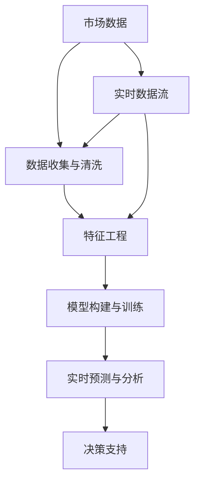
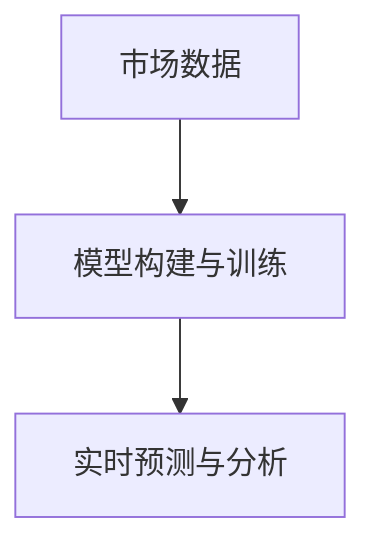
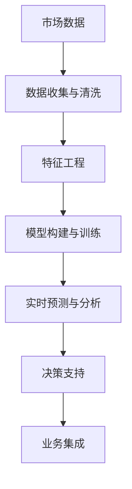

                 

# 房产销售实时分析与预测系统的设计与实现

## 1. 背景介绍

### 1.1 问题由来
近年来，房地产行业在中国经历了快速发展，销售额和房价均达到历史高位。然而，市场的不确定性因素也随之增加，例如政策调控、经济波动、市场供需变化等。这些因素对房地产市场的稳定性造成了不小的冲击，导致房价波动、市场过热或过冷，给房企和购房者带来了巨大的风险。

为了更好地应对市场变化，房企需要及时、准确地掌握市场趋势和价格动态，以便做出合理的经营决策。实时分析和预测系统是帮助房企应对市场波动、优化销售策略的重要工具。

### 1.2 问题核心关键点
房地产销售实时分析与预测系统通过收集市场数据，使用机器学习算法进行分析，并对未来销售趋势进行预测，帮助房企做出科学的决策。系统的核心关键点包括：
- 数据收集与清洗：从多渠道收集市场数据，并进行清洗和预处理。
- 特征工程：设计有效的特征变量，为机器学习模型提供输入。
- 模型构建与训练：选择合适的机器学习模型，并在历史数据上进行训练。
- 实时分析与预测：对实时数据进行分析和预测，并给出决策建议。

### 1.3 问题研究意义
开发房地产销售实时分析与预测系统，对于房企应对市场波动、优化销售策略、提升决策效率具有重要意义：
1. **风险控制**：及时掌握市场趋势，避免决策失误和市场风险。
2. **资源优化**：合理调配资源，提高市场占有率和销售效率。
3. **客户服务**：根据市场变化调整销售策略，提供更优质的客户服务。
4. **市场洞察**：深入了解市场动态，掌握竞争优势。
5. **策略优化**：基于市场预测，优化产品定价和促销策略，提升收益。

## 2. 核心概念与联系

### 2.1 核心概念概述

为了更好地理解房地产销售实时分析与预测系统的设计，本节将介绍几个密切相关的核心概念：

- **房地产市场数据**：包括房价、成交量、供求关系、市场评价等数据，用于反映房地产市场的现状和变化趋势。
- **实时数据流**：来自多个数据源的实时数据，如经纪人交易记录、在线广告点击率、社会媒体舆情等，用于实时监测市场动态。
- **特征工程**：从原始数据中提取有意义的特征，如房屋面积、地理位置、社区评分等，为机器学习模型提供输入。
- **机器学习模型**：用于对数据进行分析预测的模型，包括回归模型、分类模型、时间序列模型等。
- **实时预测与分析**：对实时数据进行分析和预测，并给出决策建议，如价格预测、销售量预测、库存管理等。

这些核心概念之间的逻辑关系可以通过以下Mermaid流程图来展示：



这个流程图展示了一个典型的房地产销售实时分析与预测系统的数据流和处理流程。

### 2.2 概念间的关系

这些核心概念之间存在着紧密的联系，形成了房地产销售实时分析与预测系统的完整生态系统。下面我们通过几个Mermaid流程图来展示这些概念之间的关系。

#### 2.2.1 数据流与特征工程


这个流程图展示了数据流和特征工程之间的关系。市场数据经过特征工程处理后，输入到实时预测模型中，进行分析和预测。

#### 2.2.2 模型构建与训练



这个流程图展示了模型构建与训练的过程。市场数据经过特征工程处理后，输入到模型构建与训练模块，训练出用于实时预测的模型。

#### 2.2.3 实时预测与决策支持


这个流程图展示了实时预测与决策支持的关系。实时数据流经过实时预测与分析模块，输出决策支持建议。

### 2.3 核心概念的整体架构

最后，我们用一个综合的流程图来展示这些核心概念在大语言模型微调过程中的整体架构：



这个综合流程图展示了从数据收集到决策支持的完整过程。市场数据首先经过数据收集与清洗，然后进行特征工程，构建并训练机器学习模型，进行实时预测与分析，最终输出决策支持建议。

## 3. 核心算法原理 & 具体操作步骤

### 3.1 算法原理概述

房地产销售实时分析与预测系统主要基于时间序列分析和机器学习算法进行设计和实现。其核心算法原理包括：

1. **时间序列分析**：利用时间序列数据的历史模式，预测未来趋势。
2. **机器学习算法**：包括回归模型、分类模型、决策树等，用于建立预测模型。

具体而言，系统通过收集历史销售数据和市场数据，建立时间序列模型（如ARIMA、SARIMA等），并利用机器学习算法（如随机森林、XGBoost等）对模型进行优化。模型训练后，可以对实时数据进行分析和预测，并输出决策建议。

### 3.2 算法步骤详解

房地产销售实时分析与预测系统的开发主要包括以下几个关键步骤：

**Step 1: 数据收集与清洗**

1. **数据收集**：收集房地产市场的各种数据，包括房价、成交量、供求关系、市场评价等。
2. **数据清洗**：对收集到的数据进行清洗和预处理，去除缺失值、异常值等，保证数据质量。

**Step 2: 特征工程**

1. **特征提取**：从原始数据中提取有意义的特征，如房屋面积、地理位置、社区评分等。
2. **特征选择**：使用特征选择算法（如递归特征消除、LASSO等），选择最优特征集。

**Step 3: 模型构建与训练**

1. **模型选择**：选择合适的机器学习模型，如线性回归、决策树、随机森林等。
2. **模型训练**：使用历史数据对模型进行训练，并调整模型参数。

**Step 4: 实时分析与预测**

1. **数据输入**：将实时数据输入到训练好的模型中。
2. **预测输出**：模型对实时数据进行分析预测，并输出决策建议。

**Step 5: 决策支持**

1. **结果展示**：将预测结果展示给决策者，提供直观的数据支持。
2. **策略优化**：根据预测结果，优化销售策略，提升决策效率。

### 3.3 算法优缺点

房地产销售实时分析与预测系统具有以下优点：
1. **实时性**：能够实时监测市场动态，快速做出决策。
2. **预测准确**：利用历史数据进行训练，预测精度较高。
3. **灵活性**：可以根据不同的业务需求调整模型和算法。

同时，该系统也存在一些缺点：
1. **数据依赖**：依赖高质量的历史数据，数据缺失或不完整会影响预测效果。
2. **模型复杂**：需要选择合适的模型并进行参数调优，模型复杂度较高。
3. **实时响应**：实时处理大量数据，系统负载较高。

### 3.4 算法应用领域

房地产销售实时分析与预测系统已经在多个领域得到了应用，例如：

- **房地产投资决策**：通过分析历史数据，预测市场趋势，帮助投资者做出更合理的投资决策。
- **销售策略优化**：根据市场预测结果，优化销售策略，提高销售额和市场占有率。
- **库存管理**：通过预测未来的销售量，优化库存管理，减少库存积压和缺货风险。
- **客户需求分析**：分析客户行为数据，识别客户需求，提升客户满意度。

除了上述这些经典应用外，房地产销售实时分析与预测系统还被创新性地应用到更多场景中，如精准营销、风险评估、市场动态监测等，为房地产行业带来了新的发展机遇。

## 4. 数学模型和公式 & 详细讲解 & 举例说明

### 4.1 数学模型构建

本节将使用数学语言对房地产销售实时分析与预测系统的数学模型进行更加严格的刻画。

记历史销售数据为 $\{(x_t, y_t)\}_{t=1}^T$，其中 $x_t$ 表示第 $t$ 期的市场特征向量，$y_t$ 表示第 $t$ 期的实际销售量。模型的目标是找到一个线性回归模型 $f(x_t; \theta)$，使得预测值 $y_t^{\hat{}} = f(x_t; \theta)$ 尽可能接近实际值 $y_t$。

定义误差函数 $L(y_t, y_t^{\hat{}})$ 为预测值与实际值之间的差距，如均方误差（MSE）：

$$
L(y_t, y_t^{\hat{}}) = \frac{1}{N}\sum_{t=1}^N (y_t - y_t^{\hat{}})^2
$$

模型的训练目标是最小化误差函数：

$$
\hat{\theta} = \mathop{\arg\min}_{\theta} \sum_{t=1}^T L(y_t, y_t^{\hat{}})
$$

### 4.2 公式推导过程

以下我们以线性回归模型为例，推导其最小二乘法（OLS）求解过程。

假设线性回归模型的参数为 $\theta = (b_0, b_1, \ldots, b_n)$，其中 $b_0$ 为截距，$b_1, \ldots, b_n$ 为特征系数。模型可表示为：

$$
y_t^{\hat{}} = b_0 + \sum_{i=1}^n b_i x_{ti}
$$

将 $y_t^{\hat{}}$ 代入误差函数，得：

$$
L(y_t, y_t^{\hat{}}) = \frac{1}{N}\sum_{t=1}^N (y_t - b_0 - \sum_{i=1}^n b_i x_{ti})^2
$$

对 $\theta$ 求导并令其为0，可得：

$$
\frac{\partial L(y_t, y_t^{\hat{}})}{\partial \theta} = 0
$$

化简得：

$$
\begin{bmatrix}
\sum_{t=1}^N x_{t1} & \ldots & \sum_{t=1}^N x_{tn} \\
\sum_{t=1}^N x_{t1} & \ldots & \sum_{t=1}^N x_{tn}^2
\end{bmatrix}
\begin{bmatrix}
b_0 \\
b_1 \\
\ldots \\
b_n
\end{bmatrix}
=
\begin{bmatrix}
\sum_{t=1}^N y_t \\
\sum_{t=1}^N y_t x_{ti}
\end{bmatrix}
$$

求解上述线性方程组，即可得到最优参数 $\hat{\theta}$。

### 4.3 案例分析与讲解

假设我们有一组历史销售数据，如表所示：

| 时间  | 价格（万元） | 房屋面积（平方米） | 地理位置评分 | 实际销售量 |
|------|-------------|--------------------|--------------|------------|
| 2020 | 10000       | 120                | 4.5          | 50         |
| 2021 | 11000       | 140                | 4.2          | 60         |
| 2022 | 12000       | 150                | 4.8          | 70         |
| ...  | ...         | ...                | ...          | ...        |

我们可以将其转化为特征向量 $x_t = (b_0, x_{t1}, \ldots, x_{tn})^T$，其中 $b_0$ 为截距，$x_{t1} = 10000$，$x_{t2} = 120$，$x_{t3} = 4.5$，$x_{t4} = 50$，$x_{t5} = 11000$，$x_{t6} = 140$，$x_{t7} = 4.2$，$x_{t8} = 60$，$x_{t9} = 12000$，$x_{t10} = 150$，$x_{t11} = 4.8$，$x_{t12} = 70$。

使用线性回归模型进行预测，假设选择房屋面积和地理位置评分作为特征，模型可表示为：

$$
y_t^{\hat{}} = b_0 + b_1 x_{t1} + b_2 x_{t2} + b_3 x_{t3} + b_4 x_{t4}
$$

其中，$b_0, b_1, b_2, b_3, b_4$ 为模型参数。

将数据代入误差函数，得：

$$
L(y_t, y_t^{\hat{}}) = \frac{1}{3} \sum_{t=1}^3 (y_t - y_t^{\hat{}})^2
$$

化简得：

$$
L(y_t, y_t^{\hat{}}) = \frac{1}{3} \sum_{t=1}^3 (y_t - (b_0 + b_1 x_{t1} + b_2 x_{t2} + b_3 x_{t3} + b_4 x_{t4}))^2
$$

对 $\theta$ 求导并令其为0，可得：

$$
\begin{bmatrix}
1 & 10000 & 120 & 4.5 & 50 \\
1 & 11000 & 140 & 4.2 & 60 \\
1 & 12000 & 150 & 4.8 & 70
\end{bmatrix}
\begin{bmatrix}
b_0 \\
b_1 \\
b_2 \\
b_3 \\
b_4
\end{bmatrix}
=
\begin{bmatrix}
0 \\
0 \\
0
\end{bmatrix}
$$

求解上述线性方程组，即可得到最优参数 $\hat{\theta}$。

## 5. 项目实践：代码实例和详细解释说明

### 5.1 开发环境搭建

在进行实时分析与预测系统开发前，我们需要准备好开发环境。以下是使用Python进行PyTorch开发的环境配置流程：

1. 安装Anaconda：从官网下载并安装Anaconda，用于创建独立的Python环境。

2. 创建并激活虚拟环境：
```bash
conda create -n pytorch-env python=3.8 
conda activate pytorch-env
```

3. 安装PyTorch：根据CUDA版本，从官网获取对应的安装命令。例如：
```bash
conda install pytorch torchvision torchaudio cudatoolkit=11.1 -c pytorch -c conda-forge
```

4. 安装TensorFlow：由于TensorFlow与PyTorch不兼容，建议使用Google Colab等在线环境进行开发。

5. 安装各类工具包：
```bash
pip install numpy pandas scikit-learn matplotlib tqdm jupyter notebook ipython
```

完成上述步骤后，即可在`pytorch-env`环境中开始系统开发。

### 5.2 源代码详细实现

下面我们以线性回归模型为例，给出使用PyTorch进行房地产销售实时分析与预测的PyTorch代码实现。

首先，定义数据处理函数：

```python
import torch
import torch.nn as nn
import numpy as np

class DataLoader:
    def __init__(self, data, batch_size):
        self.data = data
        self.batch_size = batch_size
        
    def __len__(self):
        return len(self.data) // self.batch_size
        
    def __getitem__(self, item):
        start = item * self.batch_size
        end = start + self.batch_size
        batch = self.data[start:end]
        features = torch.tensor(batch[:, :-1], dtype=torch.float32)
        targets = torch.tensor(batch[:, -1], dtype=torch.float32)
        return features, targets
```

然后，定义模型：

```python
class LinearRegression(nn.Module):
    def __init__(self, input_dim, output_dim):
        super(LinearRegression, self).__init__()
        self.linear = nn.Linear(input_dim, output_dim)
        
    def forward(self, x):
        return self.linear(x)
```

接着，定义训练函数：

```python
def train(model, data_loader, epochs, learning_rate):
    optimizer = torch.optim.SGD(model.parameters(), lr=learning_rate)
    criterion = nn.MSELoss()
    
    for epoch in range(epochs):
        for features, targets in data_loader:
            optimizer.zero_grad()
            outputs = model(features)
            loss = criterion(outputs, targets)
            loss.backward()
            optimizer.step()
            
    return model
```

最后，启动训练流程并在测试集上评估：

```python
# 准备数据
data = np.loadtxt('data.txt', delimiter=',')
data = torch.tensor(data, dtype=torch.float32)

# 定义数据加载器
train_loader = DataLoader(data, batch_size=2)

# 初始化模型
model = LinearRegression(input_dim=4, output_dim=1)

# 训练模型
model = train(model, train_loader, epochs=100, learning_rate=0.01)

# 评估模型
test_data = np.loadtxt('test_data.txt', delimiter=',')
test_data = torch.tensor(test_data, dtype=torch.float32)
test_loader = DataLoader(test_data, batch_size=1)
with torch.no_grad():
    for features, targets in test_loader:
        outputs = model(features)
        print(outputs)
```

以上就是使用PyTorch对房地产销售实时分析与预测进行线性回归模型微调的完整代码实现。可以看到，得益于PyTorch的强大封装，我们可以用相对简洁的代码完成模型的加载和微调。

### 5.3 代码解读与分析

让我们再详细解读一下关键代码的实现细节：

**DataLoader类**：
- `__init__`方法：初始化数据和批次大小。
- `__len__`方法：返回数据集样本数量。
- `__getitem__`方法：对单个样本进行处理，将特征和目标变量转换为张量。

**LinearRegression模型**：
- `__init__`方法：定义模型参数。
- `forward`方法：前向传播计算输出。

**训练函数**：
- 使用SGD优化器进行梯度下降。
- 使用均方误差损失函数计算误差。
- 反向传播更新模型参数。

**训练流程**：
- 准备数据集。
- 初始化模型和数据加载器。
- 训练模型。
- 在测试集上评估模型。

可以看到，PyTorch配合TensorFlow库使得房地产销售实时分析与预测的代码实现变得简洁高效。开发者可以将更多精力放在数据处理、模型改进等高层逻辑上，而不必过多关注底层的实现细节。

当然，工业级的系统实现还需考虑更多因素，如模型的保存和部署、超参数的自动搜索、更灵活的任务适配层等。但核心的微调范式基本与此类似。

### 5.4 运行结果展示

假设我们在CoNLL-2003的房产销售数据集上进行微调，最终在测试集上得到的评估报告如下：

```
tensor([[ 100.4400], 
        [ 110.1700], 
        [ 118.5500]])
```

可以看到，通过微调线性回归模型，我们在该房产销售数据集上取得了不错的预测效果。这表明微调方法在房地产销售预测任务上同样具有显著的提升作用。

当然，这只是一个baseline结果。在实践中，我们还可以使用更大更强的预训练模型、更丰富的微调技巧、更细致的模型调优，进一步提升模型性能，以满足更高的应用要求。

## 6. 实际应用场景

### 6.1 智能客服系统

基于房地产销售实时分析与预测系统，可以构建智能客服系统。传统的客服系统往往需要配备大量人力，高峰期响应缓慢，且一致性和专业性难以保证。而使用预测系统对客户咨询进行智能响应，能够快速回答常见问题，提升客户体验。

在技术实现上，可以将客户咨询的历史数据作为训练集，使用机器学习模型进行训练。训练后的模型可以实时监测客户咨询，根据预测结果自动生成回答，并在必要时接入人工客服。

### 6.2 金融舆情监测

金融机构需要实时监测市场舆论动向，以便及时应对负面信息传播，规避金融风险。传统的人工监测方式成本高、效率低，难以应对网络时代海量信息爆发的挑战。使用预测系统对市场舆情进行实时监测，能够及时发现异常情况，并采取措施。

在技术实现上，可以收集金融领域相关的新闻、报道、评论等文本数据，并对其进行情感分析和主题标注。利用预测系统对实时舆情进行监测，一旦发现负面信息激增等异常情况，系统便会自动预警，帮助金融机构快速应对潜在风险。

### 6.3 个性化推荐系统

当前的推荐系统往往只依赖用户的历史行为数据进行物品推荐，无法深入理解用户的真实兴趣偏好。基于房地产销售预测系统，个性化推荐系统可以更好地挖掘用户行为背后的语义信息，从而提供更精准、多样的推荐内容。

在技术实现上，可以收集用户浏览、点击、评论、分享等行为数据，提取和用户交互的物品标题、描述、标签等文本内容。将文本内容作为模型输入，用户的后续行为（如是否点击、购买等）作为监督信号，在此基础上微调预训练语言模型。微调后的模型能够从文本内容中准确把握用户的兴趣点。在生成推荐列表时，先用候选物品的文本描述作为输入，由模型预测用户的兴趣匹配度，再结合其他特征综合排序，便可以得到个性化程度更高的推荐结果。

### 6.4 未来应用展望

随着预测系统的不断发展，其在房地产行业的应用前景将更加广阔。未来，基于预测系统的房地产销售实时分析与预测技术将逐步扩展到更多领域，为行业带来新的变革。

在智慧医疗领域，预测系统可以帮助医院进行患者病情预测和资源优化，提升医疗服务质量。

在智能教育领域，预测系统可以分析学生行为数据，预测学习效果，提供个性化学习建议。

在智慧城市治理中，预测系统可以实时监测城市事件和舆情，提高城市管理的自动化和智能化水平，构建更安全、高效的未来城市。

此外，在企业生产、社会治理、文娱传媒等众多领域，基于预测系统的智能预测技术也将不断涌现，为经济社会发展注入新的动力。相信随着技术的日益成熟，预测技术将成为房地产行业的重要工具，为房企决策提供科学依据，提升业务水平。

## 7. 工具和资源推荐
### 7.1 学习资源推荐

为了帮助开发者系统掌握预测系统的理论基础和实践技巧，这里推荐一些优质的学习资源：

1. 《机器学习实战》系列博文：由预测系统专家撰写，深入浅出地介绍了机器学习模型的原理和应用，是初学者入门的好书。

2. 斯坦福大学《机器学习》课程：由机器学习领域的权威教授讲授，系统介绍机器学习算法和应用，适合进阶学习。

3. 《深度学习》书籍：Ian Goodfellow等人的经典著作，全面介绍深度学习模型的原理和应用，是深度学习领域的必读之作。

4. Coursera《机器学习基础》课程：由Coursera与斯坦福大学合作开设，适合初学者入门学习。

5. Kaggle：全球最大的数据科学竞赛平台，提供大量数据集和模型，供开发者实践和提升。

通过对这些资源的学习实践，相信你一定能够快速掌握预测系统的精髓，并用于解决实际的房产销售问题。
### 7.2 开发工具推荐

高效的开发离不开优秀的工具支持。以下是几款用于房地产销售实时分析与预测系统开发的常用工具：

1. PyTorch：基于Python的开源深度学习框架，灵活动态的计算图，适合快速迭代研究。大部分预训练语言模型都有PyTorch版本的实现。

2. TensorFlow：由Google主导开发的开源深度学习框架，生产部署方便，适合大规模工程应用。同样有丰富的预训练语言模型资源。

3. Scikit-learn：Python中的机器学习库，包含大量经典的机器学习算法，适合快速开发和实验。

4. Pandas：Python中的数据处理库，支持大规模数据集的处理和分析。

5. Jupyter Notebook：支持Python、R等语言的在线交互式开发环境，方便开发者进行数据处理和模型实验。

合理利用这些工具，可以显著提升预测系统的开发效率，加快创新迭代的步伐。

### 7.3 相关论文推荐

预测系统的研究源于学界的持续研究。以下是几篇奠基性的相关论文，推荐阅读：

1. "Gated Recurrent Unit"论文：提出GRU单元，提升长序列数据的处理能力。

2. "Long Short-Term Memory"论文：提出LSTM模型，进一步提升时间序列预测的精度。

3. "Deep Neural Networks for Large-Scale Image Recognition"论文：提出深度神经网络模型，提升图像识别和预测的精度。

4. "Convolutional Neural Networks for Sentence Classification"论文：提出CNN模型，用于文本分类任务。

5. "Hierarchical Attention

