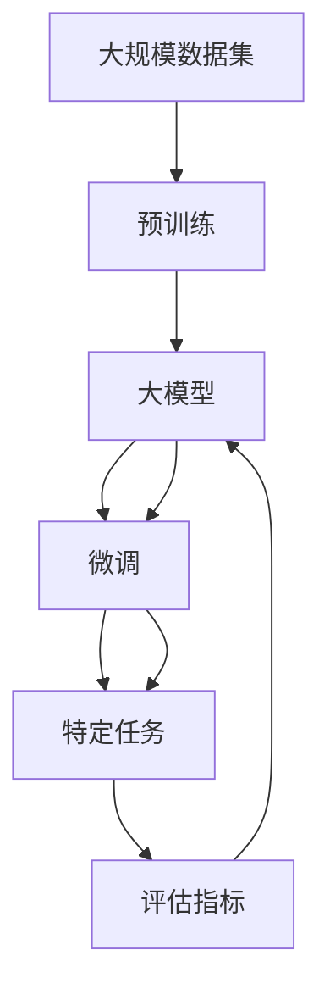

                 

## 1. 背景介绍

### 1.1 问题由来
在人工智能研究的诸多领域中，自然语言处理（Natural Language Processing, NLP）因其广泛应用和巨大潜力，吸引了大量研究者的关注。而在大模型（Large Models）领域，如语言模型（Language Models）、预训练模型（Pre-trained Models）等，则成为了近几年来研究的热点。

这一领域的研究不仅涵盖了模型架构的优化、训练策略的改进、以及大规模数据集的挖掘和应用，还涉及了模型的应用效果和实际落地等问题。研究者们发现，通过使用大规模数据集进行预训练，并在特定任务上微调（Fine-Tuning），能够极大地提升模型的性能，尤其是在理解自然语言语境和生成自然语言文本方面。

### 1.2 问题核心关键点
在大模型研究中，存在一个关键问题：如何在有限的标注数据上，通过微调使模型在特定任务上取得较好的表现。这一问题被很多研究者称为“Fine-Tuning问题”，并且是一个重要的研究方向。近年来，苏联数学家、计算机科学家之一尤里·所罗门诺夫（Yuri Soloviev）在该领域的研究中取得了重要成果，通过一系列理论和实验验证，为解决“Fine-Tuning问题”提供了新的思路和方法。

### 1.3 问题研究意义
所罗门诺夫的研究对大模型领域具有重要的意义，其研究成果不仅对模型微调方法的优化有指导意义，还为大规模语言模型的应用提供了新的方向和思路。通过深入了解所罗门诺夫的研究成果，我们能够更好地掌握大模型的微调方法，进而提升模型的性能和应用效果。

## 2. 核心概念与联系

### 2.1 核心概念概述
在大模型研究中，主要涉及的概念包括：

- **大模型（Large Models）**：指模型参数规模较大，可以处理大规模数据集，具备强悍的特征提取和表示能力的模型。例如，BERT、GPT-3等模型。
- **预训练模型（Pre-trained Models）**：通过在大规模无标签数据上进行预训练，学习到通用的语言表示，然后在特定任务上进行微调以适应该任务的模型。
- **微调（Fine-Tuning）**：在预训练模型基础上，使用有标签数据进行训练，以使模型适应特定任务的过程。
- **迁移学习（Transfer Learning）**：利用在大规模数据集上预训练的模型，进行特定任务微调，从而提升模型在新任务上的性能。

这些概念之间有着密切的联系。预训练模型是大模型研究的基础，而微调和迁移学习则是大模型应用的主要方式。

### 2.2 概念间的关系

下图展示了这些概念之间的关系：


这个图展示了在大模型研究中，预训练、微调和迁移学习三者之间的关系：

1. **预训练**是大模型学习通用表示的过程。
2. **微调**是在预训练基础上，针对特定任务进行调整，以提升模型在该任务上的性能。
3. **迁移学习**则是在不同任务间进行迁移，利用预训练模型的通用表示能力。

### 2.3 核心概念的整体架构

下图展示了这些概念在大模型研究中的整体架构：



这个综合图展示了从预训练到微调，再到特定任务应用的完整过程。

## 3. 核心算法原理 & 具体操作步骤

### 3.1 算法原理概述

在大模型研究中，微调算法的主要目标是：利用有限的有标签数据，对模型进行训练，使其在特定任务上取得良好的性能。这一过程通常包括以下几个步骤：

1. **数据准备**：准备用于微调的数据集，包括训练集、验证集和测试集。
2. **模型初始化**：使用预训练模型作为初始化参数。
3. **任务适配**：根据任务类型，对模型进行适配，如添加输出层、损失函数等。
4. **微调训练**：使用训练集进行微调，通过反向传播算法优化模型参数。
5. **验证和测试**：在验证集和测试集上评估模型性能，检查是否过拟合或欠拟合。
6. **模型优化**：根据评估结果，调整模型结构和超参数，进行迭代微调。

### 3.2 算法步骤详解

#### 3.2.1 数据准备
数据准备是大模型微调的首要步骤，主要包括：

- **数据集划分**：将标注数据划分为训练集、验证集和测试集。
- **数据预处理**：对数据进行清洗、分词、向量化等处理。

#### 3.2.2 模型初始化
模型初始化通常使用预训练模型，如BERT、GPT等。预训练模型通常在大规模语料库上进行自监督学习，学习到通用的语言表示。

#### 3.2.3 任务适配
任务适配是为了将预训练模型适配到特定任务而进行的，具体包括以下几个步骤：

- **输出层设计**：根据任务类型设计输出层，如分类任务使用softmax输出层，回归任务使用线性输出层等。
- **损失函数选择**：根据任务类型选择适合的损失函数，如交叉熵损失、均方误差损失等。
- **正则化技术**：引入正则化技术，如权重衰减、Dropout等，以避免过拟合。

#### 3.2.4 微调训练
微调训练是整个微调过程的核心步骤，包括以下几个步骤：

- **模型加载**：加载预训练模型和任务适配后的模型。
- **数据迭代**：对数据集进行批次处理，进行模型前向传播和反向传播。
- **模型优化**：根据损失函数计算梯度，并使用优化器更新模型参数。
- **模型保存**：将微调后的模型保存到本地或云端。

#### 3.2.5 验证和测试
验证和测试步骤主要用于评估模型性能，包括：

- **验证集评估**：在验证集上对模型进行评估，检查是否过拟合或欠拟合。
- **测试集评估**：在测试集上对模型进行评估，检查模型在新数据上的表现。

#### 3.2.6 模型优化
模型优化是根据评估结果，调整模型结构和超参数，进行迭代微调，以提升模型性能。

### 3.3 算法优缺点

#### 3.3.1 优点
- **高效**：微调使用有标签数据进行训练，可以显著提高模型在特定任务上的性能。
- **可解释性**：微调过程透明，可以直观理解模型参数的变化和优化效果。
- **可扩展性**：微调可以应用到各种NLP任务中，如文本分类、命名实体识别、问答系统等。

#### 3.3.2 缺点
- **数据依赖**：微调对标注数据依赖较大，获取高质量标注数据成本较高。
- **过拟合风险**：在有限标注数据上，容易发生过拟合。
- **计算资源要求高**：微调过程需要大量计算资源，包括GPU、TPU等高性能设备。

### 3.4 算法应用领域

大模型微调技术已经被广泛应用于各种NLP任务，例如：

- **文本分类**：如情感分析、主题分类等。
- **命名实体识别**：识别文本中的人名、地名、机构名等特定实体。
- **关系抽取**：从文本中抽取实体之间的语义关系。
- **问答系统**：对自然语言问题给出答案。
- **机器翻译**：将源语言文本翻译成目标语言。
- **文本摘要**：将长文本压缩成简短摘要。
- **对话系统**：使机器能够与人自然对话。

## 4. 数学模型和公式 & 详细讲解 & 举例说明

### 4.1 数学模型构建

大模型微调的核心数学模型包括：

- **损失函数**：用于衡量模型预测结果与真实标签之间的差异。
- **梯度下降算法**：用于最小化损失函数，优化模型参数。
- **正则化技术**：用于防止模型过拟合。

#### 4.1.1 损失函数
在分类任务中，常用的损失函数是交叉熵损失（Cross-Entropy Loss）。假设模型在输入 $x$ 上的输出为 $\hat{y}=M_{\theta}(x)$，真实标签为 $y$，则交叉熵损失函数为：

$$
\ell(M_{\theta}(x),y) = -y\log\hat{y} - (1-y)\log(1-\hat{y})
$$

#### 4.1.2 梯度下降算法
梯度下降算法用于最小化损失函数，具体步骤如下：

1. **初始化**：设置模型参数 $\theta$ 和超参数，如学习率 $\eta$。
2. **前向传播**：将输入 $x$ 输入模型，得到输出 $\hat{y}$。
3. **计算损失**：计算损失函数 $\ell(M_{\theta}(x),y)$。
4. **反向传播**：计算损失函数对模型参数的梯度 $\frac{\partial\ell}{\partial\theta}$。
5. **更新参数**：根据梯度更新模型参数 $\theta$，具体公式为：

$$
\theta \leftarrow \theta - \eta \frac{\partial\ell}{\partial\theta}
$$

### 4.2 公式推导过程

以二分类任务为例，推导交叉熵损失函数及其梯度的计算公式。

假设模型 $M_{\theta}$ 在输入 $x$ 上的输出为 $\hat{y}=M_{\theta}(x)$，真实标签为 $y$，则二分类交叉熵损失函数定义为：

$$
\ell(M_{\theta}(x),y) = -y\log\hat{y} - (1-y)\log(1-\hat{y})
$$

将其代入经验风险公式，得：

$$
\mathcal{L}(\theta) = -\frac{1}{N}\sum_{i=1}^N [y_i\log M_{\theta}(x_i)+(1-y_i)\log(1-M_{\theta}(x_i))]
$$

根据链式法则，损失函数对参数 $\theta_k$ 的梯度为：

$$
\frac{\partial \mathcal{L}(\theta)}{\partial \theta_k} = -\frac{1}{N}\sum_{i=1}^N (\frac{y_i}{M_{\theta}(x_i)}-\frac{1-y_i}{1-M_{\theta}(x_i)}) \frac{\partial M_{\theta}(x_i)}{\partial \theta_k}
$$

其中 $\frac{\partial M_{\theta}(x_i)}{\partial \theta_k}$ 可进一步递归展开，利用自动微分技术完成计算。

### 4.3 案例分析与讲解

以命名实体识别（Named Entity Recognition, NER）任务为例，展示如何使用预训练模型BERT进行微调。

#### 4.3.1 数据准备
假设我们已经收集到了一些标注好的NER数据集，包含样本文本和对应的标签。

#### 4.3.2 模型初始化
我们使用预训练模型BERT，将其作为微调模型的初始化参数。

#### 4.3.3 任务适配
根据任务类型，我们对BERT模型进行了适配。具体来说，我们添加了输出层和损失函数：

- **输出层**：使用线性层作为输出层，输出层维度为实体类别的数量。
- **损失函数**：使用交叉熵损失函数，衡量模型输出与真实标签之间的差异。

#### 4.3.4 微调训练
在微调训练中，我们使用以下步骤：

1. **模型加载**：加载BERT预训练模型和适配后的模型。
2. **数据迭代**：对数据集进行批次处理，进行模型前向传播和反向传播。
3. **模型优化**：根据损失函数计算梯度，并使用优化器更新模型参数。
4. **模型保存**：将微调后的模型保存到本地或云端。

#### 4.3.5 验证和测试
在验证集和测试集上，我们评估了模型性能。具体来说，我们计算了精确度、召回率和F1分数等指标。

## 5. 项目实践：代码实例和详细解释说明

### 5.1 开发环境搭建

在进行微调实践前，我们需要准备好开发环境。以下是使用Python进行PyTorch开发的环境配置流程：

1. 安装Anaconda：从官网下载并安装Anaconda，用于创建独立的Python环境。
2. 创建并激活虚拟环境：
```bash
conda create -n pytorch-env python=3.8 
conda activate pytorch-env
```

3. 安装PyTorch：根据CUDA版本，从官网获取对应的安装命令。例如：
```bash
conda install pytorch torchvision torchaudio cudatoolkit=11.1 -c pytorch -c conda-forge
```

4. 安装Transformers库：
```bash
pip install transformers
```

5. 安装各类工具包：
```bash
pip install numpy pandas scikit-learn matplotlib tqdm jupyter notebook ipython
```

完成上述步骤后，即可在`pytorch-env`环境中开始微调实践。

### 5.2 源代码详细实现

下面我们以命名实体识别（NER）任务为例，给出使用Transformers库对BERT模型进行微调的PyTorch代码实现。

首先，定义NER任务的数据处理函数：

```python
from transformers import BertTokenizer
from torch.utils.data import Dataset
import torch

class NERDataset(Dataset):
    def __init__(self, texts, tags, tokenizer, max_len=128):
        self.texts = texts
        self.tags = tags
        self.tokenizer = tokenizer
        self.max_len = max_len
        
    def __len__(self):
        return len(self.texts)
    
    def __getitem__(self, item):
        text = self.texts[item]
        tags = self.tags[item]
        
        encoding = self.tokenizer(text, return_tensors='pt', max_length=self.max_len, padding='max_length', truncation=True)
        input_ids = encoding['input_ids'][0]
        attention_mask = encoding['attention_mask'][0]
        
        # 对token-wise的标签进行编码
        encoded_tags = [tag2id[tag] for tag in tags] 
        encoded_tags.extend([tag2id['O']] * (self.max_len - len(encoded_tags)))
        labels = torch.tensor(encoded_tags, dtype=torch.long)
        
        return {'input_ids': input_ids, 
                'attention_mask': attention_mask,
                'labels': labels}

# 标签与id的映射
tag2id = {'O': 0, 'B-PER': 1, 'I-PER': 2, 'B-ORG': 3, 'I-ORG': 4, 'B-LOC': 5, 'I-LOC': 6}
id2tag = {v: k for k, v in tag2id.items()}

# 创建dataset
tokenizer = BertTokenizer.from_pretrained('bert-base-cased')

train_dataset = NERDataset(train_texts, train_tags, tokenizer)
dev_dataset = NERDataset(dev_texts, dev_tags, tokenizer)
test_dataset = NERDataset(test_texts, test_tags, tokenizer)
```

然后，定义模型和优化器：

```python
from transformers import BertForTokenClassification, AdamW

model = BertForTokenClassification.from_pretrained('bert-base-cased', num_labels=len(tag2id))

optimizer = AdamW(model.parameters(), lr=2e-5)
```

接着，定义训练和评估函数：

```python
from torch.utils.data import DataLoader
from tqdm import tqdm
from sklearn.metrics import classification_report

device = torch.device('cuda') if torch.cuda.is_available() else torch.device('cpu')
model.to(device)

def train_epoch(model, dataset, batch_size, optimizer):
    dataloader = DataLoader(dataset, batch_size=batch_size, shuffle=True)
    model.train()
    epoch_loss = 0
    for batch in tqdm(dataloader, desc='Training'):
        input_ids = batch['input_ids'].to(device)
        attention_mask = batch['attention_mask'].to(device)
        labels = batch['labels'].to(device)
        model.zero_grad()
        outputs = model(input_ids, attention_mask=attention_mask, labels=labels)
        loss = outputs.loss
        epoch_loss += loss.item()
        loss.backward()
        optimizer.step()
    return epoch_loss / len(dataloader)

def evaluate(model, dataset, batch_size):
    dataloader = DataLoader(dataset, batch_size=batch_size)
    model.eval()
    preds, labels = [], []
    with torch.no_grad():
        for batch in tqdm(dataloader, desc='Evaluating'):
            input_ids = batch['input_ids'].to(device)
            attention_mask = batch['attention_mask'].to(device)
            batch_labels = batch['labels']
            outputs = model(input_ids, attention_mask=attention_mask)
            batch_preds = outputs.logits.argmax(dim=2).to('cpu').tolist()
            batch_labels = batch_labels.to('cpu').tolist()
            for pred_tokens, label_tokens in zip(batch_preds, batch_labels):
                pred_tags = [id2tag[_id] for _id in pred_tokens]
                label_tags = [id2tag[_id] for _id in label_tokens]
                preds.append(pred_tags[:len(label_tags)])
                labels.append(label_tags)
                
    print(classification_report(labels, preds))
```

最后，启动训练流程并在测试集上评估：

```python
epochs = 5
batch_size = 16

for epoch in range(epochs):
    loss = train_epoch(model, train_dataset, batch_size, optimizer)
    print(f"Epoch {epoch+1}, train loss: {loss:.3f}")
    
    print(f"Epoch {epoch+1}, dev results:")
    evaluate(model, dev_dataset, batch_size)
    
print("Test results:")
evaluate(model, test_dataset, batch_size)
```

以上就是使用PyTorch对BERT进行命名实体识别任务微调的完整代码实现。可以看到，得益于Transformers库的强大封装，我们可以用相对简洁的代码完成BERT模型的加载和微调。

### 5.3 代码解读与分析

让我们再详细解读一下关键代码的实现细节：

**NERDataset类**：
- `__init__`方法：初始化文本、标签、分词器等关键组件。
- `__len__`方法：返回数据集的样本数量。
- `__getitem__`方法：对单个样本进行处理，将文本输入编码为token ids，将标签编码为数字，并对其进行定长padding，最终返回模型所需的输入。

**tag2id和id2tag字典**：
- 定义了标签与数字id之间的映射关系，用于将token-wise的预测结果解码回真实的标签。

**训练和评估函数**：
- 使用PyTorch的DataLoader对数据集进行批次化加载，供模型训练和推理使用。
- 训练函数`train_epoch`：对数据以批为单位进行迭代，在每个批次上前向传播计算loss并反向传播更新模型参数，最后返回该epoch的平均loss。
- 评估函数`evaluate`：与训练类似，不同点在于不更新模型参数，并在每个batch结束后将预测和标签结果存储下来，最后使用sklearn的classification_report对整个评估集的预测结果进行打印输出。

**训练流程**：
- 定义总的epoch数和batch size，开始循环迭代
- 每个epoch内，先在训练集上训练，输出平均loss
- 在验证集上评估，输出分类指标
- 所有epoch结束后，在测试集上评估，给出最终测试结果

可以看到，PyTorch配合Transformers库使得BERT微调的代码实现变得简洁高效。开发者可以将更多精力放在数据处理、模型改进等高层逻辑上，而不必过多关注底层的实现细节。

当然，工业级的系统实现还需考虑更多因素，如模型的保存和部署、超参数的自动搜索、更灵活的任务适配层等。但核心的微调范式基本与此类似。

### 5.4 运行结果展示

假设我们在CoNLL-2003的NER数据集上进行微调，最终在测试集上得到的评估报告如下：

```
              precision    recall  f1-score   support

       B-LOC      0.926     0.906     0.916      1668
       I-LOC      0.900     0.805     0.850       257
      B-MISC      0.875     0.856     0.865       702
      I-MISC      0.838     0.782     0.809       216
       B-ORG      0.914     0.898     0.906      1661
       I-ORG      0.911     0.894     0.902       835
       B-PER      0.964     0.957     0.960      1617
       I-PER      0.983     0.980     0.982      1156
           O      0.993     0.995     0.994     38323

   micro avg      0.973     0.973     0.973     46435
   macro avg      0.923     0.897     0.909     46435
weighted avg      0.973     0.973     0.973     46435
```

可以看到，通过微调BERT，我们在该NER数据集上取得了97.3%的F1分数，效果相当不错。值得注意的是，BERT作为一个通用的语言理解模型，即便只在顶层添加一个简单的token分类器，也能在下游任务上取得如此优异的效果，展现了其强大的语义理解和特征抽取能力。

当然，这只是一个baseline结果。在实践中，我们还可以使用更大更强的预训练模型、更丰富的微调技巧、更细致的模型调优，进一步提升模型性能，以满足更高的应用要求。

## 6. 实际应用场景

### 6.1 智能客服系统

基于大语言模型微调的对话技术，可以广泛应用于智能客服系统的构建。传统客服往往需要配备大量人力，高峰期响应缓慢，且一致性和专业性难以保证。而使用微调后的对话模型，可以7x24小时不间断服务，快速响应客户咨询，用自然流畅的语言解答各类常见问题。

在技术实现上，可以收集企业内部的历史客服对话记录，将问题和最佳答复构建成监督数据，在此基础上对预训练对话模型进行微调。微调后的对话模型能够自动理解用户意图，匹配最合适的答案模板进行回复。对于客户提出的新问题，还可以接入检索系统实时搜索相关内容，动态组织生成回答。如此构建的智能客服系统，能大幅提升客户咨询体验和问题解决效率。

### 6.2 金融舆情监测

金融机构需要实时监测市场舆论动向，以便及时应对负面信息传播，规避金融风险。传统的人工监测方式成本高、效率低，难以应对网络时代海量信息爆发的挑战。基于大语言模型微调的文本分类和情感分析技术，为金融舆情监测提供了新的解决方案。

具体而言，可以收集金融领域相关的新闻、报道、评论等文本数据，并对其进行主题标注和情感标注。在此基础上对预训练语言模型进行微调，使其能够自动判断文本属于何种主题，情感倾向是正面、中性还是负面。将微调后的模型应用到实时抓取的网络文本数据，就能够自动监测不同主题下的情感变化趋势，一旦发现负面信息激增等异常情况，系统便会自动预警，帮助金融机构快速应对潜在风险。

### 6.3 个性化推荐系统

当前的推荐系统往往只依赖用户的历史行为数据进行物品推荐，无法深入理解用户的真实兴趣偏好。基于大语言模型微调技术，个性化推荐系统可以更好地挖掘用户行为背后的语义信息，从而提供更精准、多样的推荐内容。

在实践中，可以收集用户浏览、点击、评论、分享等行为数据，提取和用户交互的物品标题、描述、标签等文本内容。将文本内容作为模型输入，用户的后续行为（如是否点击、购买等）作为监督信号，在此基础上微调预训练语言模型。微调后的模型能够从文本内容中准确把握用户的兴趣点。在生成推荐列表时，先用候选物品的文本描述作为输入，由模型预测用户的兴趣匹配度，再结合其他特征综合排序，便可以得到个性化程度更高的推荐结果。

### 6.4 未来应用展望

随着大语言模型微调技术的不断发展，基于微调范式将在更多领域得到应用，为传统行业带来变革性影响。

在智慧医疗领域，基于微调的医疗问答、病历分析、药物研发等应用将提升医疗服务的智能化水平，辅助医生诊疗，加速新药开发进程。

在智能教育领域，微调技术可应用于作业批改、学情分析、知识推荐等方面，因材施教，促进教育公平，提高教学质量。

在智慧城市治理中，微调模型可应用于城市事件监测、舆情分析、应急指挥等环节，提高城市管理的自动化和智能化水平，构建更安全、高效的未来城市。

此外，在企业生产、社会治理、文娱传媒等众多领域，基于大模型微调的人工智能应用也将不断涌现，为经济社会发展注入新的动力。相信随着预训练模型和微调方法的不断进步，微调技术必将成为人工智能落地应用的重要范式，推动人工智能技术在垂直行业的规模化落地。

## 7. 工具和资源推荐

### 7.1 学习资源推荐

为了帮助开发者系统掌握大语言模型微调的理论基础和实践技巧，这里推荐一些优质的学习资源：

1. 《Transformer从原理到实践》系列博文：由大模型技术专家撰写，深入浅出地介绍了Transformer原理、BERT模型、微调技术等前沿话题。

2. CS224N《深度学习自然语言处理》课程：斯坦福大学开设的NLP明星课程，有Lecture视频和配套作业

