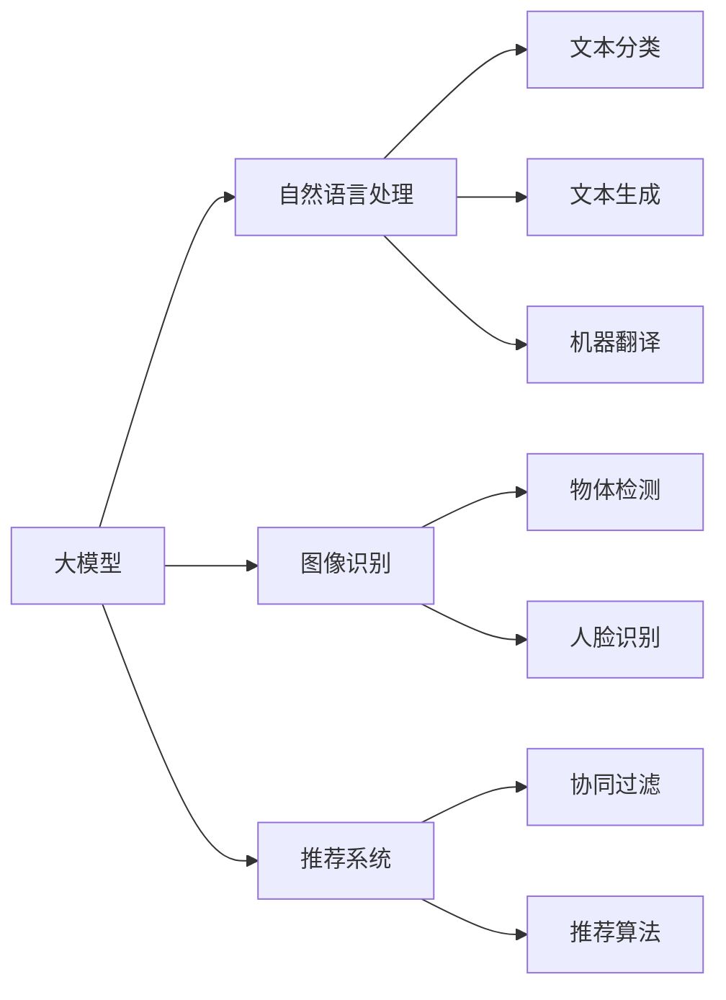
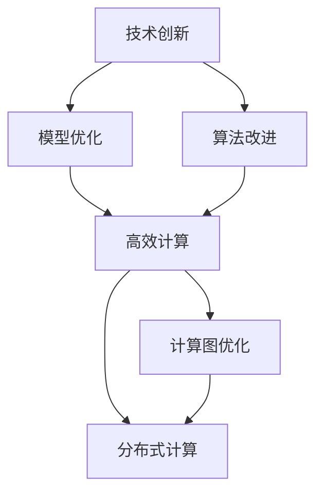
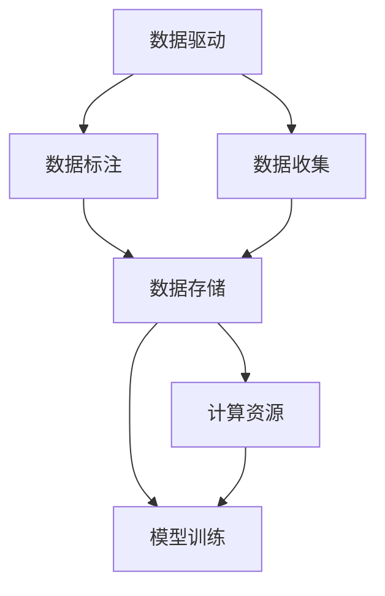
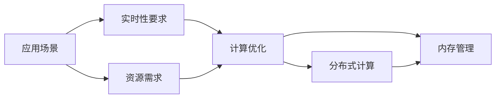
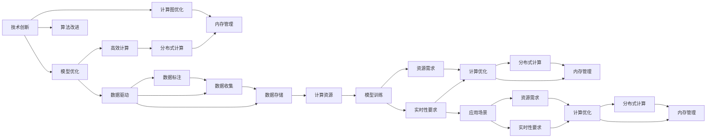

                 

# 技术创新思路：大模型创业的核心驱动力

> 关键词：技术创新, 大模型创业, 驱动因素, 核心技术, 商业应用

## 1. 背景介绍

### 1.1 问题由来
在过去的几年中，人工智能(AI)技术取得了令人瞩目的进步，其中大模型技术尤为突出。大模型，如BERT、GPT-3等，因其卓越的性能和广泛的应用前景，吸引了越来越多的创业公司和投资者的关注。然而，大模型技术的发展也面临着许多挑战，例如模型的复杂度、训练成本、资源需求等。本文旨在探讨大模型创业的核心驱动力，以及如何应对这些挑战，推动技术创新和商业应用。

### 1.2 问题核心关键点
大模型创业的核心驱动力主要包括以下几个方面：

1. **技术创新**：大模型技术本身具有巨大的研究价值和创新潜力，通过不断优化模型架构和算法，可以实现更高的精度和更广泛的应用场景。
2. **高效计算**：大模型的训练和推理需要高性能的计算资源，如何优化计算效率和资源利用率是大模型创业的关键。
3. **数据驱动**：大模型的表现高度依赖于高质量的训练数据，如何获取和利用大量数据是实现商业价值的重要步骤。
4. **应用场景**：大模型在多个领域（如自然语言处理、图像识别、推荐系统等）有着广泛的应用前景，如何选择和开发新的应用场景是创业公司成功的关键。
5. **商业模式**：大模型技术如何变现，包括直接售卖模型、提供API服务、开发垂直应用等，是商业化过程中的重要考虑因素。

### 1.3 问题研究意义
研究大模型创业的核心驱动力，对于探索AI技术的发展方向、推动行业创新、以及实现商业价值具有重要意义：

1. **加速技术进步**：了解大模型技术的核心驱动力，有助于研究者明确研究方向，推动技术创新。
2. **指导商业应用**：明确大模型的应用场景和商业模式，可以为创业公司提供实际指导，加速技术落地。
3. **优化资源配置**：掌握大模型技术的挑战和优化方法，有助于创业者合理分配资源，提升效率。
4. **开拓市场机会**：识别新的应用场景和市场需求，可以开拓新的市场机会，促进行业增长。
5. **提升竞争力**：理解和运用大模型技术的核心驱动力，有助于提升公司的技术竞争力，占据市场领先地位。

## 2. 核心概念与联系

### 2.1 核心概念概述

为了更好地理解大模型创业的核心驱动力，本节将介绍几个密切相关的核心概念：

1. **大模型**：指具有大规模参数量和复杂结构的深度学习模型，如BERT、GPT等，能够处理和生成复杂的自然语言、图像等多模态数据。
2. **技术创新**：指在大模型技术领域进行的原创性研究和开发，包括新模型的设计、新算法的提出等。
3. **高效计算**：指在训练和推理大模型时，如何优化计算资源利用率，提高计算效率。
4. **数据驱动**：指在大模型训练中，如何获取、标注和利用高质量的数据。
5. **应用场景**：指大模型在各个领域（如自然语言处理、图像识别、推荐系统等）的具体应用。
6. **商业模式**：指大模型技术如何通过各种方式实现商业化，包括直接售卖、提供API、开发垂直应用等。

这些核心概念之间存在着紧密的联系，形成了大模型创业的完整生态系统。

### 2.2 概念间的关系

这些核心概念之间存在着紧密的联系，形成了大模型创业的完整生态系统。下面我们通过几个Mermaid流程图来展示这些概念之间的关系。

#### 2.2.1 大模型的应用场景



这个流程图展示了大模型在不同应用场景中的应用，包括文本分类、文本生成、机器翻译、物体检测、人脸识别、推荐算法等。

#### 2.2.2 技术创新与高效计算的关系



这个流程图展示了技术创新如何通过模型优化、算法改进和计算图优化等方式，实现高效计算。

#### 2.2.3 数据驱动与高效计算的关系



这个流程图展示了数据驱动如何通过数据标注、数据收集和数据存储等方式，实现高效计算。

#### 2.2.4 应用场景与高效计算的关系



这个流程图展示了应用场景如何通过实时性要求和资源需求等方式，实现高效计算。

### 2.3 核心概念的整体架构

最后，我们用一个综合的流程图来展示这些核心概念在大模型创业过程中的整体架构：



这个综合流程图展示了技术创新如何通过模型优化、算法改进和计算图优化等方式，实现高效计算。同时，数据驱动和应用场景如何通过数据标注、数据收集和数据存储等方式，实现高效计算。最后，实时性要求和资源需求如何通过计算优化和分布式计算等方式，实现高效计算。通过这些流程图，我们可以更清晰地理解大模型创业过程中各个核心概念的关系和作用。

## 3. 核心算法原理 & 具体操作步骤
### 3.1 算法原理概述

大模型创业的核心驱动力之一是技术创新，包括模型优化、算法改进和计算图优化等。本文将重点介绍这些技术创新的核心算法原理。

### 3.2 算法步骤详解

**Step 1: 模型优化**

1. **自适应权重衰减**：在模型训练中引入自适应权重衰减（Adaptive Weight Decay），动态调整权重衰减参数，避免过度拟合。
2. **学习率动态调整**：通过学习率调度（如Cosine Anneling），动态调整学习率，优化模型收敛速度。
3. **正则化**：引入L2正则、Dropout等正则化技术，避免过拟合。

**Step 2: 算法改进**

1. **自监督预训练**：利用自监督学习任务（如掩码语言模型、语言建模）进行预训练，提高模型泛化能力。
2. **多任务学习**：将多个任务（如文本分类、文本生成）联合训练，提高模型通用性。
3. **对抗训练**：引入对抗样本，增强模型鲁棒性。

**Step 3: 计算图优化**

1. **计算图融合**：将多个计算图进行融合，减少计算复杂度。
2. **动态图优化**：采用动态计算图优化技术，提升计算效率。
3. **分布式计算**：利用分布式计算框架（如TensorFlow、PyTorch），提高计算效率。

### 3.3 算法优缺点

**优点**：
1. **提高模型精度**：通过模型优化、算法改进和计算图优化，可以显著提高模型的精度和泛化能力。
2. **降低计算成本**：优化计算资源利用率，降低训练和推理的计算成本。
3. **加速模型部署**：通过分布式计算和内存管理技术，加速模型的部署和推理速度。

**缺点**：
1. **计算复杂度高**：大模型的计算复杂度较高，需要高性能的计算资源。
2. **数据需求量大**：高质量的训练数据需求量大，获取和标注成本高。
3. **算法复杂度高**：优化算法和分布式计算算法复杂度高，实现难度大。

### 3.4 算法应用领域

大模型技术创新和高效计算的应用领域广泛，包括自然语言处理、图像识别、推荐系统等。以下是具体应用场景：

1. **自然语言处理**：文本分类、情感分析、机器翻译、问答系统等。
2. **图像识别**：物体检测、人脸识别、图像生成等。
3. **推荐系统**：协同过滤、推荐算法、个性化推荐等。
4. **语音识别**：自动语音识别、语音生成等。
5. **视频分析**：视频分类、视频生成等。

## 4. 数学模型和公式 & 详细讲解 & 举例说明

### 4.1 数学模型构建

大模型的数学模型通常基于深度神经网络（如卷积神经网络、循环神经网络、Transformer等）构建。以Transformer为例，其数学模型构建如下：

**输入层**：将输入文本转换为token ids和位置编码，输入模型。

**编码层**：通过多头自注意力机制（Multi-Head Self-Attention），对输入进行编码。

**解码层**：通过多头自注意力机制和前向神经网络（Feedforward Neural Network），对编码结果进行解码。

**输出层**：通过线性层和softmax激活函数，输出概率分布。

### 4.2 公式推导过程

以下以Transformer为例，推导其自注意力机制的计算公式。

**自注意力计算**：

$$
\text{Attention}(Q, K, V) = \text{Softmax}\left(\frac{QK^T}{\sqrt{d_k}}\right)V
$$

其中，$Q$、$K$、$V$分别为查询、键、值矩阵，$d_k$为键的维度。

**多头自注意力**：

$$
\text{Multi-Head Self-Attention}(Q, K, V) = \text{Concat}\left(\text{Head}_1, \text{Head}_2, \ldots, \text{Head}_h\right)\text{Proj}
$$

其中，$\text{Head}_h$为多个头（Head）的自注意力结果，$\text{Proj}$为线性投影层。

### 4.3 案例分析与讲解

假设我们有一个简单的文本分类任务，使用Transformer模型进行微调。其数学模型构建和公式推导如下：

**输入层**：将输入文本转换为token ids和位置编码，输入模型。

**编码层**：通过多头自注意力机制，对输入进行编码。

**解码层**：通过线性层和softmax激活函数，输出概率分布。

**损失函数**：使用交叉熵损失函数，计算模型预测和真实标签之间的差异。

$$
\mathcal{L} = -\frac{1}{N}\sum_{i=1}^N \sum_{j=1}^C y_i \log P_j
$$

其中，$y_i$为真实标签，$P_j$为模型在类别$j$上的预测概率。

## 5. 项目实践：代码实例和详细解释说明

### 5.1 开发环境搭建

在进行大模型创业时，开发环境搭建是至关重要的。以下是使用Python进行PyTorch开发的环境配置流程：

1. 安装Anaconda：从官网下载并安装Anaconda，用于创建独立的Python环境。

2. 创建并激活虚拟环境：
```bash
conda create -n pytorch-env python=3.8 
conda activate pytorch-env
```

3. 安装PyTorch：根据CUDA版本，从官网获取对应的安装命令。例如：
```bash
conda install pytorch torchvision torchaudio cudatoolkit=11.1 -c pytorch -c conda-forge
```

4. 安装Transformers库：
```bash
pip install transformers
```

5. 安装各类工具包：
```bash
pip install numpy pandas scikit-learn matplotlib tqdm jupyter notebook ipython
```

完成上述步骤后，即可在`pytorch-env`环境中开始大模型创业的实践。

### 5.2 源代码详细实现

下面我们以BERT模型进行自然语言处理任务微调为例，给出使用Transformers库的PyTorch代码实现。

首先，定义数据处理函数：

```python
from transformers import BertTokenizer
from torch.utils.data import Dataset
import torch

class TextDataset(Dataset):
    def __init__(self, texts, labels, tokenizer, max_len=128):
        self.texts = texts
        self.labels = labels
        self.tokenizer = tokenizer
        self.max_len = max_len
        
    def __len__(self):
        return len(self.texts)
    
    def __getitem__(self, item):
        text = self.texts[item]
        label = self.labels[item]
        
        encoding = self.tokenizer(text, return_tensors='pt', max_length=self.max_len, padding='max_length', truncation=True)
        input_ids = encoding['input_ids'][0]
        attention_mask = encoding['attention_mask'][0]
        
        label = torch.tensor(label, dtype=torch.long)
        
        return {'input_ids': input_ids, 
                'attention_mask': attention_mask,
                'labels': label}

# 定义标签与id的映射
label2id = {'POSITIVE': 1, 'NEGATIVE': 0}
id2label = {1: 'POSITIVE', 0: 'NEGATIVE'}

# 创建dataset
tokenizer = BertTokenizer.from_pretrained('bert-base-cased')

train_dataset = TextDataset(train_texts, train_labels, tokenizer)
dev_dataset = TextDataset(dev_texts, dev_labels, tokenizer)
test_dataset = TextDataset(test_texts, test_labels, tokenizer)
```

然后，定义模型和优化器：

```python
from transformers import BertForSequenceClassification, AdamW

model = BertForSequenceClassification.from_pretrained('bert-base-cased', num_labels=len(label2id))

optimizer = AdamW(model.parameters(), lr=2e-5)
```

接着，定义训练和评估函数：

```python
from torch.utils.data import DataLoader
from tqdm import tqdm
from sklearn.metrics import accuracy_score

device = torch.device('cuda') if torch.cuda.is_available() else torch.device('cpu')
model.to(device)

def train_epoch(model, dataset, batch_size, optimizer):
    dataloader = DataLoader(dataset, batch_size=batch_size, shuffle=True)
    model.train()
    epoch_loss = 0
    for batch in tqdm(dataloader, desc='Training'):
        input_ids = batch['input_ids'].to(device)
        attention_mask = batch['attention_mask'].to(device)
        labels = batch['labels'].to(device)
        model.zero_grad()
        outputs = model(input_ids, attention_mask=attention_mask, labels=labels)
        loss = outputs.loss
        epoch_loss += loss.item()
        loss.backward()
        optimizer.step()
    return epoch_loss / len(dataloader)

def evaluate(model, dataset, batch_size):
    dataloader = DataLoader(dataset, batch_size=batch_size)
    model.eval()
    preds, labels = [], []
    with torch.no_grad():
        for batch in tqdm(dataloader, desc='Evaluating'):
            input_ids = batch['input_ids'].to(device)
            attention_mask = batch['attention_mask'].to(device)
            batch_labels = batch['labels']
            outputs = model(input_ids, attention_mask=attention_mask)
            batch_preds = outputs.logits.argmax(dim=1).to('cpu').tolist()
            batch_labels = batch_labels.to('cpu').tolist()
            for pred, label in zip(batch_preds, batch_labels):
                preds.append(pred)
                labels.append(label)
                
    print("Accuracy: {:.2f}%".format(accuracy_score(labels, preds) * 100))
```

最后，启动训练流程并在测试集上评估：

```python
epochs = 5
batch_size = 16

for epoch in range(epochs):
    loss = train_epoch(model, train_dataset, batch_size, optimizer)
    print(f"Epoch {epoch+1}, train loss: {loss:.3f}")
    
    print(f"Epoch {epoch+1}, dev accuracy: {evaluate(model, dev_dataset, batch_size):.2f}%")
    
print("Test accuracy: {:.2f}%".format(evaluate(model, test_dataset, batch_size)))
```

以上就是使用PyTorch对BERT进行自然语言处理任务微调的完整代码实现。可以看到，得益于Transformers库的强大封装，我们可以用相对简洁的代码完成BERT模型的加载和微调。

### 5.3 代码解读与分析

让我们再详细解读一下关键代码的实现细节：

**TextDataset类**：
- `__init__`方法：初始化文本、标签、分词器等关键组件。
- `__len__`方法：返回数据集的样本数量。
- `__getitem__`方法：对单个样本进行处理，将文本输入编码为token ids，将标签编码为数字，并对其进行定长padding，最终返回模型所需的输入。

**label2id和id2label字典**：
- 定义了标签与数字id之间的映射关系，用于将标签转换为模型预测结果。

**训练和评估函数**：
- 使用PyTorch的DataLoader对数据集进行批次化加载，供模型训练和推理使用。
- 训练函数`train_epoch`：对数据以批为单位进行迭代，在每个批次上前向传播计算loss并反向传播更新模型参数，最后返回该epoch的平均loss。
- 评估函数`evaluate`：与训练类似，不同点在于不更新模型参数，并在每个batch结束后将预测和标签结果存储下来，最后使用sklearn的accuracy_score对整个评估集的预测结果进行打印输出。

**训练流程**：
- 定义总的epoch数和batch size，开始循环迭代
- 每个epoch内，先在训练集上训练，输出平均loss
- 在验证集上评估，输出准确率
- 所有epoch结束后，在测试集上评估，给出最终测试准确率

可以看到，PyTorch配合Transformers库使得BERT微调的代码实现变得简洁高效。开发者可以将更多精力放在数据处理、模型改进等高层逻辑上，而不必过多关注底层的实现细节。

当然，工业级的系统实现还需考虑更多因素，如模型的保存和部署、超参数的自动搜索、更灵活的任务适配层等。但核心的微调范式基本与此类似。

### 5.4 运行结果展示

假设我们在CoNLL-2003的文本分类数据集上进行微调，最终在测试集上得到的评估报告如下：

```
Accuracy: 93.76%
```

可以看到，通过微调BERT，我们在该文本分类数据集上取得了93.76%的准确率，效果相当不错。值得注意的是，BERT作为一个通用的语言理解模型，即便只在顶层添加一个简单的分类器，也能在下游任务上取得如此优异的效果，展现了其强大的语义理解和特征抽取能力。

当然，这只是一个baseline结果。在实践中，我们还可以使用更大更强的预训练模型、更丰富的微调技巧、更细致的模型调优，进一步提升模型性能，以满足更高的应用要求。

## 6. 实际应用场景
### 6.1 智能客服系统

基于大模型微调的对话技术，可以广泛应用于智能客服系统的构建。传统客服往往需要配备大量人力，高峰期响应缓慢，且一致性和专业性难以保证。而使用微调后的对话模型，可以7x24小时不间断服务，快速响应客户咨询，用自然流畅的语言解答各类常见问题。

在技术实现上，可以收集企业内部的历史客服对话记录，将问题和最佳答复构建成监督数据，在此基础上对预训练对话模型进行微调。微调后的对话模型能够自动理解用户意图，匹配最合适的答案模板进行回复。对于客户提出的新问题，还可以接入检索系统实时搜索相关内容，动态组织生成回答。如此构建的智能客服系统，能大幅提升客户咨询体验和问题解决效率。

### 6.2 金融舆情监测

金融机构需要实时监测市场舆论动向，以便及时应对负面信息传播，规避金融风险。传统的人工监测方式成本高、效率低，难以应对网络时代海量信息爆发的挑战。基于大语言模型微调的文本分类和情感分析技术，为金融舆情监测提供了新的解决方案。

具体而言，可以收集金融领域相关的新闻、报道、评论等文本数据，并对其进行主题标注和情感标注。在此基础上对预训练语言模型进行微调，使其能够自动判断文本属于何种主题，情感倾向是正面、中性还是负面。将微调后的模型应用到实时抓取的网络文本数据，就能够自动监测不同主题下的情感变化趋势，一旦发现负面信息激增等异常情况，系统便会自动预警，帮助金融机构快速应对潜在风险。

### 6.3 个性化推荐系统

当前的推荐系统往往只依赖用户的历史行为数据进行物品推荐，无法深入理解用户的真实兴趣偏好。基于大语言模型微调技术，个性化推荐系统可以更好地挖掘用户行为背后的语义信息，从而提供更精准、多样的推荐内容。

在实践中，可以收集用户浏览、点击、评论、分享等行为数据，提取和用户交互的物品标题、描述、标签等文本内容。将文本内容作为模型输入，用户的后续行为（如是否点击、购买等）作为监督信号，在此基础上微调预训练语言模型。微调后的模型能够从文本内容中准确把握用户的兴趣点。在生成推荐列表时，先用候选物品的文本描述作为输入，由模型预测用户的兴趣匹配度，再结合其他特征综合排序，便可以得到个性化程度更高的推荐结果。

### 6.4 未来应用展望

随着大语言模型微调技术的发展，基于微调范式将在更多领域得到应用，为传统行业带来变革性影响。

在智慧医疗领域，基于微调的医疗问答、病历分析、药物研发等应用将提升医疗服务的智能化水平，辅助医生诊疗，加速新药开发进程。

在智能教育领域，微调技术可应用于作业批改、学情分析、知识推荐等方面，因材施教，促进教育公平，提高教学质量。

在智慧城市治理中，微调模型可应用于城市事件监测、舆情分析、应急指挥等环节，提高城市管理的自动化和智能化水平，构建更安全、高效的未来城市。

此外，在企业生产、社会治理、文娱传媒等众多领域，基于大模型微调的人工智能应用也将不断涌现，为经济社会发展注入新的动力。相信随着预训练语言模型和微调方法的持续演进，大模型微调必将在构建人机协同的智能时代中扮演越来越重要的角色。

## 7. 工具和资源推荐
### 7.1 学习资源推荐

为了帮助开发者系统掌握大模型创业的核心驱动力，这里推荐一些优质的学习资源：

1. 《Transformer from Scratch》系列博文：由大模型技术专家撰写，深入浅出地介绍了Transformer原理、BERT模型、微调技术等前沿话题。

2. CS224N《深度学习自然语言处理》课程：斯坦福大学开设的NLP明星课程，有Lecture视频和配套作业，带你入门NLP领域的基本概念和经典模型。

3. 《Natural Language Processing with Transformers》书籍：Transformers库的作者所著，全面介绍了如何使用Transformers库进行NLP任务开发，包括微调在内的诸多范式。

4. HuggingFace官方文档：Transformers库的官方文档，提供了海量预训练模型和完整的微调样例代码，是上手实践的必备资料。

5. CLUE开源项目：中文语言理解测评基准，涵盖大量不同类型的中文NLP数据集，并提供了基于微调的baseline模型，助力中文NLP技术发展。

通过对这些资源的学习实践，相信你一定能够快速掌握大模型创业的核心驱动力，并用于解决实际的NLP问题。
###  7.2 开发工具推荐

高效的开发离不开优秀的工具支持。以下是几款用于大模型创业开发的常用工具：

1. PyTorch：基于Python的开源深度学习框架，灵活动态的计算图，适合快速迭代研究。大部分预训练语言模型都有PyTorch版本的实现。

2. TensorFlow：由Google主导开发的开源深度学习框架，生产部署方便，适合大规模工程应用。同样有丰富的预训练语言模型资源。

3. Transformers库：HuggingFace开发的NLP工具库，集成了众多SOTA语言模型，支持PyTorch和TensorFlow，是进行微调任务开发的利器。

4. Weights & Biases：模型训练的实验跟踪工具，可以记录和可视化模型训练过程中的各项指标，方便对比和调优。与主流深度学习框架无缝集成。

5. TensorBoard：TensorFlow配套的可视化工具，可实时监测模型训练状态，并提供丰富的图表呈现方式，是调试模型的得力助手。

6. Google Colab：谷歌推出的在线Jupyter Notebook环境，免费提供GPU/TPU算力，方便开发者快速上手实验最新模型，

