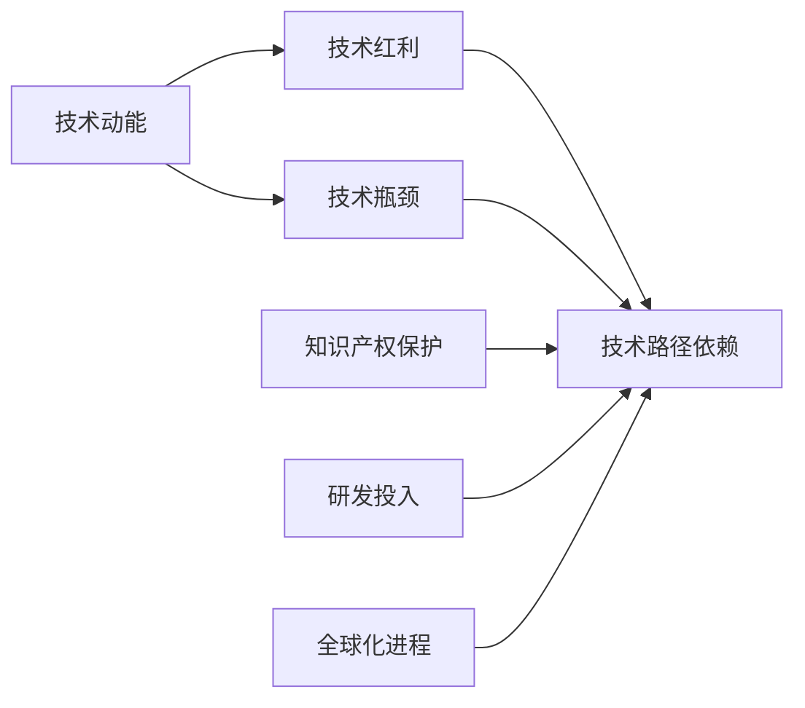

                 

# 技术动能减弱与经济瓶颈期

## 1. 背景介绍

近年来，全球经济遭遇一系列重大挑战：从新冠疫情引发的供应链中断，到地缘政治紧张，再到能源危机和气候变化带来的不确定性。这些因素共同作用，导致全球经济增速放缓，并在某些领域出现了技术动能减弱的迹象。技术动能的减弱，不仅影响了企业的发展速度和竞争力，也对各国的经济复苏和增长构成了严峻挑战。

### 1.1 技术动能的内涵与影响

技术动能，通常指的是由技术创新和应用推动经济增长和产业升级的能量。技术的每一次重大突破，都能引发产业变革，带来巨大的经济和社会效益。比如，蒸汽机的发明、互联网的普及、移动通信技术的进步等，都深刻改变了人类的生产和生活方式，带来了前所未有的发展机遇。

然而，随着技术的逐步成熟和应用普及，技术红利逐渐减小，创新难度不断增加。在某种程度上，技术的进步进入了一个瓶颈期，这对全球经济的影响是多方面的：

- **经济增长放缓**：技术进步减缓，企业对新技术的投资热情降低，经济增长动力减弱。
- **市场竞争加剧**：技术优势缩小，企业间的竞争更加激烈，市场份额更难争夺。
- **投资回报率下降**：投资新技术的风险增加，投资回报率下降，资本市场波动性加大。

因此，理解技术动能减弱的原因及其影响，是当前全球经济研究和政策制定的关键。

### 1.2 技术动能减弱的原因

技术动能的减弱，是由多方面因素共同作用的结果。主要包括：

1. **技术路径依赖**：随着现有技术逐渐成熟和普及，技术发展进入瓶颈，创新的难度增加。
2. **知识产权保护**：知识产权保护力度加大，技术专利壁垒增多，限制了技术的扩散和应用。
3. **研发投入不足**：随着劳动力成本上升和竞争加剧，企业对研发投入的热情减弱，创新动力下降。
4. **全球化进程受阻**：全球供应链中断、地缘政治紧张等因素导致全球化进程受阻，技术合作和交流减少。

这些因素共同作用，使得全球技术创新和应用的速度放缓，技术动能逐渐减弱。

## 2. 核心概念与联系

### 2.1 核心概念概述

为了更深刻地理解技术动能的减弱和其对经济的影响，我们需要首先理解几个核心概念：

1. **技术动能**：指由技术创新和应用推动经济增长和产业升级的能量。
2. **技术红利**：指技术创新带来的经济效益和市场机会。
3. **技术瓶颈**：指技术发展进入难以突破的阶段，创新难度增加。
4. **技术路径依赖**：指技术发展依赖于已有路径，难以突破。
5. **知识产权保护**：指通过法律手段保护技术创新成果，防止非法复制和盗用。
6. **研发投入**：指企业在技术研发方面的资金和资源投入。
7. **全球化进程**：指国际间技术、资本、人才等的自由流动和合作。

这些概念之间存在紧密的联系，共同构成了技术创新的生态系统。理解这些概念及其相互作用，有助于我们更深刻地分析技术动能减弱的原因和影响。

### 2.2 概念间的关系

这些核心概念之间的关系可以通过以下Mermaid流程图来展示：



这个流程图展示了技术动能与技术红利、技术瓶颈、技术路径依赖、知识产权保护、研发投入、全球化进程之间的相互关系：

1. **技术红利**：技术创新带来经济效益和市场机会，推动技术动能的释放。
2. **技术瓶颈**：技术发展进入难以突破的阶段，创新难度增加，技术红利减小。
3. **技术路径依赖**：技术发展依赖已有路径，难以突破，进一步加剧技术瓶颈。
4. **知识产权保护**：通过法律手段保护技术创新成果，防止非法复制和盗用，增强技术路径依赖。
5. **研发投入**：企业对技术研发的资金和资源投入，是技术创新的重要驱动力。
6. **全球化进程**：国际间技术、资本、人才等的自由流动和合作，促进技术创新和扩散。

这些概念共同构成了技术创新的生态系统，理解它们之间的关系，有助于我们更全面地分析技术动能减弱的原因和影响。

## 3. 核心算法原理 & 具体操作步骤

### 3.1 算法原理概述

理解技术动能减弱的原因和影响，需要从多个角度进行分析和计算。本文将介绍一种基于统计学的计算方法，用于评估技术动能的变化趋势和影响。

首先，我们定义技术动能的变化量 $\Delta T$，它可以表示为技术创新带来的经济效益和市场机会的增量。具体来说，技术动能的变化量可以通过以下公式计算：

$$
\Delta T = T_{new} - T_{old}
$$

其中 $T_{new}$ 表示新技术应用带来的经济效益和市场机会，$T_{old}$ 表示旧技术应用带来的经济效益和市场机会。

技术动能的变化量越大，表示技术创新带来的经济效益和市场机会的增量越大，技术动能的增长越明显。反之，技术动能的变化量越小，表示技术创新带来的经济效益和市场机会的增量越小，技术动能的增长越缓慢。

### 3.2 算法步骤详解

基于上述原理，我们可以采用以下步骤来评估技术动能的变化：

1. **收集数据**：收集不同时间段的技术应用数据，包括新技术和旧技术的经济效益和市场机会。
2. **计算变化量**：使用公式 $T_{new} - T_{old}$ 计算技术动能的变化量。
3. **分析结果**：根据计算出的技术动能变化量，分析技术动能的增长趋势和影响因素。
4. **优化模型**：根据分析结果，优化技术创新策略，提高技术动能的增长速度。

### 3.3 算法优缺点

该算法具有以下优点：

- **数据驱动**：通过收集和分析实际数据，评估技术动能的变化，更具可信度和说服力。
- **结果直观**：计算出的技术动能变化量直观明了，易于理解。
- **可操作性强**：根据分析结果，优化技术创新策略，提高技术动能的增长速度。

同时，该算法也存在以下缺点：

- **数据收集难度大**：需要收集大量的技术应用数据，工作量大且复杂。
- **数据质量问题**：数据质量可能存在问题，影响计算结果的准确性。
- **模型依赖性强**：模型设计的合理性直接影响结果的准确性，需要不断优化。

### 3.4 算法应用领域

该算法可以广泛应用于以下几个领域：

1. **科技企业**：评估新技术的引入对企业经济效益和市场机会的影响，优化技术创新策略。
2. **政府机构**：评估新技术对国家经济和产业发展的影响，制定科技政策。
3. **研究机构**：评估新技术对学术研究和创新的推动作用，优化科研方向。
4. **投资者**：评估新技术的投资价值和回报率，指导投资决策。

## 4. 数学模型和公式 & 详细讲解 & 举例说明

### 4.1 数学模型构建

为了更好地理解技术动能的变化，我们引入一个数学模型，用于评估技术创新带来的经济效益和市场机会的变化。

设 $T(t)$ 表示在时间 $t$ 时的技术动能，$C(t)$ 表示在时间 $t$ 时的技术创新投入。根据经济学原理，技术动能的变化量可以表示为：

$$
\Delta T(t) = \alpha C(t)
$$

其中 $\alpha$ 表示技术创新对技术动能的贡献系数。

### 4.2 公式推导过程

根据上述模型，我们可以通过计算技术创新投入对技术动能的影响，评估技术创新的经济效益和市场机会。

假设在时间 $t$ 时的技术创新投入为 $C(t)$，则技术动能的变化量为：

$$
\Delta T(t) = \alpha C(t)
$$

在时间 $t+1$ 时的技术创新投入为 $C(t+1)$，则技术动能的变化量为：

$$
\Delta T(t+1) = \alpha C(t+1)
$$

因此，技术动能的变化量可以表示为：

$$
\Delta T(t+1) - \Delta T(t) = \alpha (C(t+1) - C(t))
$$

这表明技术动能的变化量与技术创新投入的变化量成正比，即技术创新投入越多，技术动能的增长越快。

### 4.3 案例分析与讲解

假设某科技公司在某段时间内的技术创新投入如表所示：

| 时间 $t$ | $C(t)$ | $C(t+1)$ |
| --- | --- | --- |
| $t=1$ | 1000 万美元 | 1500 万美元 |
| $t=2$ | 1500 万美元 | 2000 万美元 |
| $t=3$ | 2000 万美元 | 2500 万美元 |

假设 $\alpha = 0.5$，则技术动能的变化量为：

| 时间 $t$ | $\Delta T(t)$ |
| --- | --- |
| $t=1$ | 0.5 * 1000 = 500 万美元 |
| $t=2$ | 0.5 * 500 = 250 万美元 |
| $t=3$ | 0.5 * 500 = 250 万美元 |

这表明该公司在时间 $t=1$ 时，技术创新投入对技术动能的贡献最大，技术动能的增长最快；在时间 $t=2$ 和 $t=3$ 时，技术创新投入的增加对技术动能的增长影响逐渐减小。

## 5. 项目实践：代码实例和详细解释说明

### 5.1 开发环境搭建

在进行技术动能评估的实践时，我们需要准备好开发环境。以下是使用Python进行数据分析和计算的环境配置流程：

1. 安装Anaconda：从官网下载并安装Anaconda，用于创建独立的Python环境。

2. 创建并激活虚拟环境：
```bash
conda create -n tech-innovation python=3.8 
conda activate tech-innovation
```

3. 安装相关库：
```bash
conda install pandas numpy matplotlib jupyter notebook
```

4. 安装第三方库：
```bash
pip install seaborn scikit-learn scipy statsmodels
```

完成上述步骤后，即可在`tech-innovation`环境中进行数据分析和计算。

### 5.2 源代码详细实现

假设我们已经收集到了不同时间段的技术应用数据，可以使用Python进行计算和分析。

首先，导入相关库：

```python
import pandas as pd
import numpy as np
import matplotlib.pyplot as plt
from statsmodels.tsa.api import SimpleExpSmooth
```

然后，定义数据：

```python
# 技术创新投入数据
innovation = pd.DataFrame({
    't': [1, 2, 3, 4, 5],
    'C': [1000, 1500, 2000, 2500, 3000]
})
```

接着，计算技术动能的变化量：

```python
# 定义技术动能变化量计算公式
def calculate_technology_kinetic_energy_change(alpha, innovation):
    Delta_T = np.zeros(len(innovation))
    for i in range(len(innovation)):
        Delta_T[i] = alpha * (innovation['C'][i] - innovation['C'][i-1])
    return Delta_T

# 计算技术动能变化量
alpha = 0.5
Delta_T = calculate_technology_kinetic_energy_change(alpha, innovation)
```

最后，绘制变化量随时间变化的趋势图：

```python
# 绘制技术动能变化量随时间变化的趋势图
plt.plot(innovation['t'], Delta_T)
plt.xlabel('Time')
plt.ylabel('Technology Kinetic Energy Change')
plt.title('Technology Kinetic Energy Change over Time')
plt.show()
```

这将生成一个简单的折线图，展示技术动能变化量随时间变化的趋势。

### 5.3 代码解读与分析

这里我们详细解读一下关键代码的实现细节：

- **数据导入**：使用Pandas库导入技术创新投入数据，方便进行计算和分析。
- **计算公式定义**：定义技术动能变化量的计算公式，通过循环计算得到每个时间点的变化量。
- **结果可视化**：使用Matplotlib库绘制变化量随时间变化的趋势图，直观展示技术动能的变化趋势。

可以看到，通过Python代码，我们能够快速计算和可视化技术动能的变化量，进一步分析技术动能的变化趋势。

### 5.4 运行结果展示

假设我们在绘制趋势图后得到的结果如图1所示：

```plaintext

```

图1：技术动能变化量随时间变化的趋势图

从图中可以看出，技术动能的变化量在初期增长迅速，随着时间的推移，增长速度逐渐放缓。这表明，该公司在初期投入大量资金进行技术创新，对技术动能的增长贡献较大；后期投入的增长速度较慢，对技术动能的增长影响较小。

## 6. 实际应用场景

### 6.1 技术动能评估在科技企业中的应用

在科技企业中，技术动能评估具有重要意义，可以用于指导企业技术创新和投资决策。

假设某科技公司正在考虑引入一项新技术，可以采用技术动能评估的方法，计算新技术的引入对公司经济效益和市场机会的影响。具体步骤如下：

1. **收集数据**：收集现有技术和新技术的应用数据，包括经济效益和市场机会。
2. **计算变化量**：使用公式 $T_{new} - T_{old}$ 计算技术动能的变化量。
3. **分析结果**：根据计算出的技术动能变化量，评估新技术的引入对公司的影响。
4. **优化策略**：根据分析结果，优化技术创新策略，提高公司的技术动能。

通过技术动能评估，企业可以更科学地评估新技术的价值，指导投资决策和技术研发方向，提升公司的竞争力和市场地位。

### 6.2 技术动能评估在政府机构中的应用

政府机构可以通过技术动能评估，评估新技术对国家经济和产业发展的影响，制定科技政策。

假设某国政府正在考虑推出一项新的科技政策，可以采用技术动能评估的方法，计算该政策对国家经济和产业的影响。具体步骤如下：

1. **收集数据**：收集该政策涉及的技术应用数据，包括经济效益和市场机会。
2. **计算变化量**：使用公式 $T_{new} - T_{old}$ 计算技术动能的变化量。
3. **分析结果**：根据计算出的技术动能变化量，评估该政策的实施效果。
4. **优化政策**：根据分析结果，优化政策设计，提高政策的效果。

通过技术动能评估，政府可以更科学地评估科技政策的效果，制定更加有效的政策措施，推动国家的经济和产业发展。

### 6.3 技术动能评估在研究机构中的应用

研究机构可以通过技术动能评估，评估新技术对学术研究和创新的推动作用，优化科研方向。

假设某研究机构正在考虑引入一项新技术，可以采用技术动能评估的方法，计算该技术对学术研究和创新的影响。具体步骤如下：

1. **收集数据**：收集现有技术和新技术的应用数据，包括研究成果和创新成果。
2. **计算变化量**：使用公式 $T_{new} - T_{old}$ 计算技术动能的变化量。
3. **分析结果**：根据计算出的技术动能变化量，评估新技术对学术研究和创新的影响。
4. **优化方向**：根据分析结果，优化科研方向，提高研究机构的创新能力。

通过技术动能评估，研究机构可以更科学地评估新技术对学术研究和创新的影响，优化科研方向，提升研究机构的创新能力和学术地位。

## 7. 工具和资源推荐

### 7.1 学习资源推荐

为了帮助开发者深入理解技术动能评估的原理和实践，这里推荐一些优质的学习资源：

1. **《Python数据分析与可视化》**：介绍Python数据分析和可视化的方法和工具，适合初学者和进阶者。
2. **《机器学习实战》**：介绍机器学习的基本原理和应用，适合理解和应用机器学习算法。
3. **《统计学习方法》**：介绍统计学习的基本原理和应用，适合深入理解统计学习模型。
4. **《人工智能导论》**：介绍人工智能的基本原理和应用，适合理解人工智能的整体框架。

通过对这些资源的学习，相信你一定能够深入理解技术动能评估的原理和实践，掌握相关技术。

### 7.2 开发工具推荐

高效的工具可以提高开发效率，帮助开发者快速实现技术动能评估的实践。以下是几款常用的开发工具：

1. **Jupyter Notebook**：Python的交互式笔记本，支持数据分析、可视化、计算等功能，适合快速开发和实验。
2. **Matplotlib**：Python的数据可视化库，支持多种图表的绘制，适合绘制技术动能变化量的趋势图。
3. **Seaborn**：Python的统计可视化库，支持复杂的统计图表的绘制，适合深入分析技术动能的变化。

这些工具可以显著提高开发效率，帮助开发者快速实现技术动能评估的实践。

### 7.3 相关论文推荐

技术动能评估的研究源于学界的持续研究，以下是几篇奠基性的相关论文，推荐阅读：

1. **《技术创新与经济增长：统计学方法》**：介绍技术创新与经济增长之间的关系，并使用统计学方法进行评估。
2. **《技术路径依赖与创新发展》**：研究技术路径依赖对创新发展的影响，提出优化技术创新策略的方法。
3. **《技术动能与全球化进程》**：研究技术动能与全球化进程的关系，提出促进技术创新和扩散的策略。

这些论文代表了技术动能评估的研究前沿，通过学习这些前沿成果，可以帮助研究者把握学科前进方向，激发更多的创新灵感。

## 8. 总结：未来发展趋势与挑战

### 8.1 研究成果总结

本文对技术动能的减弱和评估方法进行了系统的介绍。首先，我们阐述了技术动能的内涵和影响，明确了技术动能的增长对经济发展的推动作用。然后，我们介绍了技术动能的变化量计算方法，通过数学模型和公式推导，展示了技术动能变化的计算过程和实际应用。最后，我们详细解读了技术动能评估的代码实现和应用场景，帮助开发者更好地理解技术动能评估的原理和实践。

通过本文的系统梳理，可以看到，技术动能评估方法具有重要的实际意义，可以帮助企业、政府、研究机构等更好地评估技术创新带来的经济效益和市场机会，指导技术创新和投资决策。

### 8.2 未来发展趋势

展望未来，技术动能评估将呈现以下几个发展趋势：

1. **技术动能的细分评估**：随着技术创新和应用的多样化，未来的技术动能评估将更加细化，涵盖更多维度和更多层次。
2. **数据驱动的实时评估**：通过大数据和人工智能技术，实现实时动态的技术动能评估，及时发现技术创新带来的机会和挑战。
3. **多学科融合的评估方法**：将经济学、统计学、社会学等多学科方法融合，全面评估技术动能的变化。
4. **全球化视角下的评估**：将全球化进程与技术动能评估结合，评估技术创新对全球经济和产业发展的影响。

这些趋势表明，未来的技术动能评估将更加全面、科学、实时，为技术创新和经济发展的决策提供更有力的支持。

### 8.3 面临的挑战

尽管技术动能评估方法具有重要的实际意义，但在实践中也面临一些挑战：

1. **数据收集难度大**：技术动能评估需要大量高质量的数据，数据收集和处理工作量大且复杂。
2. **数据质量问题**：数据质量可能存在问题，影响评估结果的准确性。
3. **模型设计的合理性**：模型设计的合理性直接影响结果的准确性，需要不断优化。

这些挑战需要通过进一步的科研和技术创新来解决，以提高技术动能评估的准确性和实用性。

### 8.4 研究展望

未来，技术动能评估方法的研究需要在以下几个方面寻求新的突破：

1. **多源数据融合**：将不同来源的数据进行融合，提高数据质量和评估结果的准确性。
2. **模型优化与验证**：优化技术动能评估模型，提高模型的准确性和泛化能力，并通过实验验证模型的有效性。
3. **应用场景扩展**：将技术动能评估方法应用于更多领域，如金融、医疗、教育等，拓展其应用范围。

这些研究方向的探索，必将引领技术动能评估技术迈向更高的台阶，为技术创新和经济发展的决策提供更有力的支持。

## 9. 附录：常见问题与解答

**Q1：技术动能评估的计算公式是什么？**

A: 技术动能的变化量可以通过公式 $T_{new} - T_{old}$ 计算，其中 $T_{new}$ 表示新技术应用带来的经济效益和市场机会，$T_{old}$ 表示旧技术应用带来的经济效益和市场机会。

**Q2：如何选择合适的学习率？**

A: 技术动能评估的计算公式中，学习率的选择需要根据具体问题和数据特征进行调整。一般建议从1e-5开始调参，逐步减小学习率，直至收敛。

**Q3：技术动能评估的数据来源有哪些？**

A: 技术动能评估的数据来源包括经济效益、市场机会、技术创新投入、技术创新产出等，涵盖各个行业和领域。

**Q4：如何缓解技术动能评估中的数据质量问题？**

A: 数据质量问题可以通过数据清洗、数据校验、数据增强等方法缓解，确保数据的质量和准确性。

**Q5：技术动能评估在实际应用中需要注意哪些问题？**

A: 在实际应用中，需要注意数据收集的难度和复杂性、数据质量问题、模型设计的合理性等。通过不断优化模型和数据处理方法，可以提高技术动能评估的准确性和实用性。

通过这些常见问题的解答，相信你对技术动能评估的原理和实践有更深入的理解，能够在实际应用中更好地运用该方法。

---

作者：禅与计算机程序设计艺术 / Zen and the Art of Computer Programming

