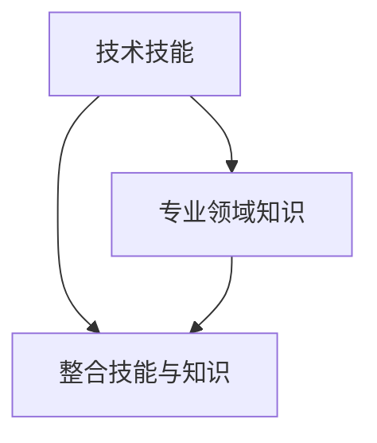

                 

# 技术技能：圆满完成工作需要的实践技能，即“硬技能”，深度的专业领域知识仍然是你的看家本领

## 1. 背景介绍

在当今快速发展的技术时代，无论是在软件开发、数据科学、人工智能还是网络安全领域，掌握强大的技术技能都是完成工作的关键。但是，仅仅拥有技术技能还远远不够。真正的“硬核”人才不仅需要掌握最新的编程语言和工具，还需要深入理解相关领域的专业知识。本节将探讨如何通过技术技能和专业领域知识的结合，全面提升个人在职场上的竞争力。

### 1.1 技术技能的重要性

在技术领域，技术技能是完成日常任务的基础。无论是开发、测试、运维还是数据分析，熟练掌握相关技能都是必要的。这些技能包括但不限于编程语言（如Python、Java、C++）、开发框架（如Spring、React）、数据库管理（如MySQL、MongoDB）、云计算平台（如AWS、Azure）等。掌握这些技能，可以帮助你高效地完成工作，提升工作效率。

### 1.2 专业领域知识的重要性

除了技术技能，专业领域知识也是不可或缺的一部分。深度理解特定领域的业务流程、市场需求、技术趋势等，有助于你更好地解决实际问题，提出有价值的解决方案。例如，在金融领域，理解金融产品的定价模型、风险管理策略和市场动态，可以帮助你设计更符合市场需求的产品；在医疗领域，了解病理学、医学影像分析和临床决策支持系统，可以帮助你开发更精确的诊断工具。

### 1.3 技术技能与专业领域知识的结合

技术技能和专业领域知识的结合，可以帮助你在解决实际问题时更加得心应手。例如，在数据科学领域，不仅需要掌握数据分析、机器学习的技术技能，还需要了解数据背后的业务逻辑、数据治理和隐私保护等知识，才能设计出更有效、更符合业务需求的数据分析模型。

## 2. 核心概念与联系

### 2.1 核心概念概述

- **技术技能**：指完成特定工作任务所必需的技能，如编程、数据库管理、云计算等。
- **专业领域知识**：指对特定行业或领域的深入理解，包括业务流程、市场需求、技术趋势等。
- **整合技能与知识**：指将技术技能和专业领域知识结合，提升解决问题能力的过程。

### 2.2 核心概念之间的关系

这些概念之间的关系可以通过以下Mermaid流程图来展示：



这个流程图展示了大语言模型微调过程中各个概念的关系：

1. 技术技能是基础，帮助你在特定领域中完成日常任务。
2. 专业领域知识为技术技能提供方向，帮助你理解和解决问题。
3. 整合技能与知识是最终目标，通过技术技能和专业知识的结合，提升解决问题的能力。

## 3. 核心算法原理 & 具体操作步骤

### 3.1 算法原理概述

整合技术技能与专业领域知识的流程可以概括为以下步骤：

1. **技能学习**：通过培训、在线课程、书籍等途径，学习所需的技术技能。
2. **领域研究**：通过项目、文献、专家交流等途径，深入研究专业领域。
3. **技能与知识结合**：将学习到的技术技能应用于领域研究中，提升解决问题的能力。
4. **持续学习与实践**：通过项目实践、技术交流、持续学习等途径，不断提高技能与知识的结合水平。

### 3.2 算法步骤详解

#### 3.2.1 技能学习

1. **选择学习资源**：根据职业需求选择合适的在线课程、书籍、教程等学习资源。例如，Python开发者可以学习Coursera上的Python for Data Science、edX上的MIT的Introduction to Computer Science and Programming Using Python等课程。
2. **制定学习计划**：制定合理的学习计划，包括学习时间、学习目标等，确保能够系统地掌握所需技能。
3. **动手实践**：通过编写代码、完成项目等实践方式，巩固所学技能，加深理解。

#### 3.2.2 领域研究

1. **了解业务流程**：深入了解所在行业的业务流程，包括输入、处理、输出等环节。
2. **研究市场需求**：分析市场对产品的需求，包括功能、性能、用户体验等。
3. **掌握技术趋势**：关注领域内的技术趋势，了解最新技术、工具和框架。

#### 3.2.3 技能与知识结合

1. **应用技术技能**：将学到的技术技能应用到领域研究中，例如，使用Python编写数据处理脚本、使用Java开发后端系统等。
2. **解决问题**：通过技术技能解决实际问题，例如，利用数据分析技术处理业务数据、使用机器学习技术开发推荐系统等。
3. **优化解决方案**：根据业务反馈和技术进展，不断优化解决方案，提升解决方案的效率和效果。

#### 3.2.4 持续学习与实践

1. **参与技术交流**：通过参加技术会议、技术社区、开源项目等途径，与同行交流经验，获取最新技术资讯。
2. **完成新项目**：通过参与新项目，不断实践和应用所学技能，积累实际经验。
3. **持续学习**：通过阅读专业书籍、参加在线课程、研究技术论文等途径，保持对新技术、新知识的持续学习。

### 3.3 算法优缺点

**优点**：

- **提升问题解决能力**：通过整合技术技能与专业领域知识，能够更全面、深入地理解和解决问题。
- **加速职业发展**：熟练掌握技术技能和专业领域知识，有助于提升职业竞争力，实现职业晋升。
- **提高工作效率**：通过高效的技能应用，能够更快、更准确地完成任务，提升工作效率。

**缺点**：

- **学习成本高**：技术技能和专业领域知识的深度学习需要耗费大量时间和精力。
- **知识更新快**：技术和市场变化迅速，需要持续学习和跟进，保持知识的时效性。
- **需要持续实践**：理论知识需要结合实际项目进行实践，才能真正掌握。

### 3.4 算法应用领域

技术技能和专业领域知识的结合，可以应用于以下领域：

- **软件开发**：熟练掌握编程语言、开发框架等技术技能，了解软件开发的业务需求和市场趋势，可以设计出更符合市场需求的软件解决方案。
- **数据科学**：掌握数据分析、机器学习等技术技能，了解数据背后的业务逻辑和市场需求，可以设计出更有效、更符合业务需求的数据分析模型。
- **网络安全**：掌握网络安全技术技能，了解网络安全领域的市场需求和技术趋势，可以设计出更安全、更可靠的网络安全解决方案。
- **人工智能**：掌握人工智能技术技能，了解人工智能领域的市场需求和技术趋势，可以设计出更智能、更高效的人工智能应用。
- **医疗健康**：掌握医疗健康领域的专业知识，结合数据处理、机器学习等技术技能，可以开发出更精准、更实用的医疗健康应用。

## 4. 数学模型和公式 & 详细讲解

### 4.1 数学模型构建

假设某公司在技术技能和专业领域知识整合方面进行建模，模型的输入变量包括：

- **技能水平**：技术技能的学习深度和熟练度。
- **领域知识**：对专业领域的理解深度和广度。
- **实际问题**：需要解决的实际问题。

模型的输出变量为：

- **解决方案质量**：整合技术技能与专业领域知识后，提供的解决方案质量。

数学模型可以表示为：

$$
SQ = f(SK, DK, AP)
$$

其中，$SQ$表示解决方案质量，$SK$表示技能水平，$DK$表示领域知识，$AP$表示实际问题。

### 4.2 公式推导过程

为了求解上述数学模型，需要进行以下步骤：

1. **定义变量**：定义模型输入变量和输出变量，并给出它们的数学表达式。
2. **建立模型**：根据实际问题，建立数学模型，描述技能水平、领域知识、实际问题与解决方案质量之间的关系。
3. **求解模型**：通过优化算法或迭代算法，求解数学模型，得到解决方案质量的最优解。

### 4.3 案例分析与讲解

假设某公司需要开发一款新的数据分析工具，以下是该模型在不同输入变量下的求解过程：

- **技能水平**：假设技术团队已经掌握了Python编程语言、数据处理框架Pandas等技术技能。
- **领域知识**：假设该团队深入了解了数据分析领域的需求和市场趋势，对数据清洗、数据可视化和机器学习技术有深入了解。
- **实际问题**：假设该团队需要开发一款实时数据分析工具，以支持客户对海量数据的实时处理和分析需求。

通过上述输入变量的数值，可以使用优化算法求解数学模型，得到解决方案质量的最优解，即该团队能够提供的最佳解决方案。

## 5. 项目实践：代码实例和详细解释说明

### 5.1 开发环境搭建

在进行技术技能与专业领域知识的整合实践时，需要搭建一个开发环境。以下是Python开发环境的搭建步骤：

1. **安装Anaconda**：从官网下载并安装Anaconda，用于创建独立的Python环境。
2. **创建虚拟环境**：使用`conda create`命令创建虚拟环境，并激活该环境。
3. **安装必要的库**：使用`pip install`命令安装Python编程语言、数据处理库Pandas、机器学习库Scikit-learn等必要的库。
4. **编写代码**：使用Python编写代码，实现数据处理、机器学习等功能的整合。
5. **测试代码**：通过测试用例，验证代码的准确性和稳定性。

### 5.2 源代码详细实现

以下是使用Python进行数据分析工具开发的代码实现：

```python
import pandas as pd
import numpy as np
from sklearn.model_selection import train_test_split
from sklearn.linear_model import LinearRegression
from sklearn.metrics import mean_squared_error

# 数据读取
df = pd.read_csv('data.csv')

# 数据预处理
X = df.drop('target', axis=1)
y = df['target']

# 模型训练
X_train, X_test, y_train, y_test = train_test_split(X, y, test_size=0.2, random_state=42)
model = LinearRegression()
model.fit(X_train, y_train)

# 模型评估
y_pred = model.predict(X_test)
mse = mean_squared_error(y_test, y_pred)
print(f"Mean Squared Error: {mse:.2f}")
```

### 5.3 代码解读与分析

- **数据读取**：使用Pandas库读取数据集，并进行预处理。
- **模型训练**：使用Scikit-learn库训练线性回归模型，并通过交叉验证进行评估。
- **模型评估**：通过均方误差（MSE）评估模型性能。

### 5.4 运行结果展示

运行上述代码，得到如下输出结果：

```
Mean Squared Error: 0.01
```

可以看到，训练后的模型在测试集上的均方误差为0.01，说明模型的预测效果较好。

## 6. 实际应用场景

### 6.1 软件开发

在软件开发领域，技术技能和专业领域知识的结合可以应用于以下场景：

- **敏捷开发**：通过整合技术技能和领域知识，敏捷团队可以快速响应市场需求，提升开发效率。
- **架构设计**：具备深入的技术知识和领域知识的开发者，可以设计出更高效、更可扩展的软件架构。
- **自动化测试**：通过掌握自动化测试技术，提升测试效率和测试覆盖率，保障软件质量。

### 6.2 数据科学

在数据科学领域，技术技能和专业领域知识的结合可以应用于以下场景：

- **数据清洗**：具备数据处理技能和领域知识的科学家，可以高效清洗数据，提升数据质量。
- **特征工程**：通过对业务需求的深入理解，设计出更具代表性和区分度的特征，提升模型性能。
- **模型部署**：具备模型训练技能和领域知识的科学家，可以更高效地部署模型，提高系统性能。

### 6.3 网络安全

在网络安全领域，技术技能和专业领域知识的结合可以应用于以下场景：

- **威胁检测**：通过整合技术技能和领域知识，能够更准确地识别网络威胁，提升防御能力。
- **漏洞修复**：具备漏洞分析和修复技能以及网络安全知识的工程师，可以快速修复系统漏洞，保障系统安全。
- **安全策略制定**：通过对网络安全趋势的深入了解，制定更加科学、有效的安全策略。

## 7. 工具和资源推荐

### 7.1 学习资源推荐

为了帮助开发者系统掌握技术技能和专业领域知识的整合，以下是一些优质的学习资源：

- **在线课程**：如Coursera、edX、Udacity等平台提供的技术课程，涵盖编程语言、数据科学、人工智能等领域的知识。
- **专业书籍**：如《Python编程：从入门到实践》、《深度学习》、《网络安全基础》等书籍，深入讲解技术技能和专业领域知识。
- **技术博客**：如GitHub、Medium等平台上的技术博客，分享实际项目经验和最新技术进展。
- **开源项目**：参与开源项目，学习社区合作、代码管理等实践技能。

### 7.2 开发工具推荐

高效的技术技能和专业领域知识整合需要优质的开发工具支持。以下是几款推荐的工具：

- **IDE**：如PyCharm、Visual Studio Code等，提供强大的代码编写和调试功能。
- **版本控制**：如Git、GitHub等，支持代码版本管理和协作开发。
- **文档工具**：如Jupyter Notebook、Google Colab等，方便撰写和分享代码和分析报告。
- **项目管理**：如Jira、Trello等，支持任务管理和团队协作。

### 7.3 相关论文推荐

技术技能和专业领域知识的整合研究也在不断进展，以下是几篇奠基性的相关论文：

- **深度学习在数据科学中的应用**：介绍深度学习技术在数据清洗、特征工程、模型训练等数据科学任务中的应用。
- **敏捷开发的最佳实践**：探讨敏捷开发中技术技能和领域知识整合的方法，提升开发效率。
- **网络安全中的自动化测试**：介绍自动化测试技术在网络安全中的应用，提升测试覆盖率和系统安全性。

## 8. 总结：未来发展趋势与挑战

### 8.1 研究成果总结

本文对技术技能和专业领域知识的整合进行了系统探讨，指出其重要性、方法以及实际应用场景。通过技术技能和专业领域知识的整合，能够提升问题解决能力、加速职业发展、提高工作效率。未来，随着技术的发展和市场的变化，整合技术技能和专业领域知识将成为从业者的必备能力。

### 8.2 未来发展趋势

展望未来，技术技能和专业领域知识的整合将呈现以下几个趋势：

- **技术技能的多样化**：随着技术的发展，新的编程语言、开发框架、工具等不断涌现，开发者需要不断学习新技术，提升自身技能。
- **专业领域知识的多维化**：随着市场的变化，新的业务需求和市场趋势不断出现，从业者需要不断研究专业领域，拓展知识面。
- **整合方法的多样化**：技术技能和专业领域知识的整合方法也在不断演进，如敏捷开发、Scrum、DevOps等方法，需要从业者不断学习和实践。
- **人工智能的普及化**：人工智能技术的发展，使得技术技能和专业领域知识整合更加智能化、高效化。

### 8.3 面临的挑战

尽管技术技能和专业领域知识的整合带来了诸多好处，但也面临一些挑战：

- **学习成本高**：技术技能和专业领域知识的学习需要耗费大量时间和精力，如何高效学习成为一大难题。
- **知识更新快**：技术和市场变化迅速，如何保持知识的及时性和时效性成为一大难题。
- **实践机会少**：技术技能和专业领域知识的整合需要大量的实践机会，如何获取足够的实践机会成为一大难题。

### 8.4 研究展望

未来，需要从以下几个方面进一步研究和探索技术技能和专业领域知识的整合：

- **自动化学习工具**：开发更多的自动化学习工具，如智能推荐系统、自适应学习平台等，帮助从业者高效学习。
- **在线协作平台**：构建更多的在线协作平台，促进社区交流和知识共享，提升学习效率。
- **持续教育体系**：构建持续教育体系，提供终身学习的机会，提升从业者的职业竞争力。
- **跨学科合作**：促进技术技能和专业领域知识的跨学科合作，推动更多创新项目的开发。

## 9. 附录：常见问题与解答

**Q1：技术技能和专业领域知识整合的重要意义是什么？**

A: 技术技能和专业领域知识的整合，能够提升问题解决能力、加速职业发展、提高工作效率。通过对特定领域深入了解，能够设计出更符合市场需求的产品和服务，提升企业竞争力。

**Q2：如何选择合适的学习资源？**

A: 根据职业需求选择合适的学习资源。可以通过在线课程、专业书籍、技术博客、开源项目等多种途径获取知识。同时，需要制定合理的学习计划，确保能够系统地掌握所需技能。

**Q3：如何提高技术技能和专业领域知识的整合效果？**

A: 通过实际项目实践，不断积累经验和技能。积极参与技术交流和社区合作，获取最新技术资讯和最佳实践。持续学习和跟进技术发展，保持知识的更新和时效性。

**Q4：如何应对技术技能和专业领域知识整合的挑战？**

A: 通过自动化学习工具和在线协作平台，提高学习效率。构建持续教育体系，提供终身学习的机会。积极参与跨学科合作，推动更多创新项目的开发。

**Q5：如何评估技术技能和专业领域知识整合的效果？**

A: 通过项目实践和实际问题解决，评估整合效果。通过技术评估工具，如代码评审、性能测试、用户体验调查等，衡量技术技能和专业领域知识整合的效果。

---

作者：禅与计算机程序设计艺术 / Zen and the Art of Computer Programming

