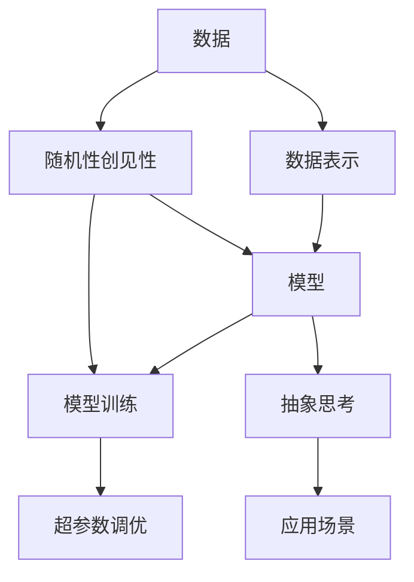
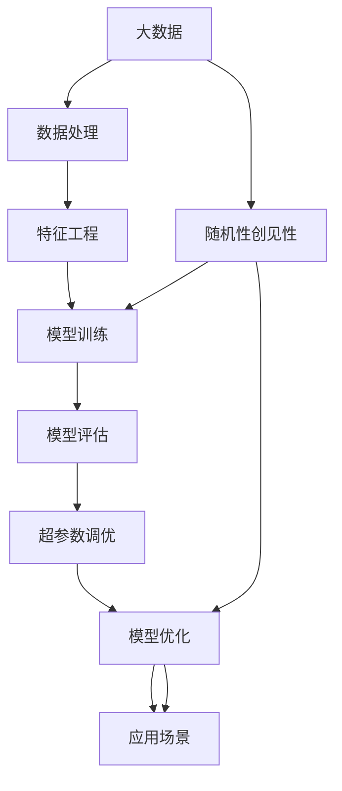

                 

# 抽象思考与随机性创见性

## 1. 背景介绍

### 1.1 问题由来

在当今科技日新月异的时代，人工智能（AI）技术尤其是机器学习和深度学习（DL）领域，正以前所未有的速度发展。从图像识别、自然语言处理到自动驾驶、金融预测，AI的应用领域越来越广泛，其在各个行业中的重要性日益凸显。然而，这些技术的背后，离不开抽象思考和随机性创见性这两大支柱。

### 1.2 问题核心关键点

抽象思考和随机性创见性是推动人工智能技术发展的关键因素。其中，抽象思考指的是通过模型、算法和数据，捕捉和提炼出问题的本质特征，从而进行高效、准确的处理。而随机性创见性则是指在数据分析和模型训练过程中，引入不确定性因素，以获取更丰富、更创新的知识。本文将探讨这两者的原理和应用，并结合实际案例，给出具体的技术解决方案。

### 1.3 问题研究意义

理解抽象思考和随机性创见性对于掌握人工智能技术至关重要。它不仅能帮助开发者更好地设计和优化算法，提升模型性能，还能在面对复杂问题时，提供新的解决方案和突破口。此外，这种思考方式还有助于提高解决问题的效率，促进技术创新，为行业发展注入新的活力。

## 2. 核心概念与联系

### 2.1 核心概念概述

为更好地理解抽象思考和随机性创见性，本节将介绍几个关键概念：

- 抽象思考（Abstraction Thinking）：通过数据提炼、模型构建、算法优化等手段，捕捉问题的核心特征，进行高效、准确的处理。
- 随机性创见性（Stochastic Innovation）：在数据分析和模型训练过程中，引入不确定性因素，如噪声、随机初始化等，以获得更丰富的知识。
- 数据表示（Data Representation）：将原始数据转化为模型可用的形式，如向量化、特征工程等。
- 模型训练（Model Training）：通过反向传播等算法，调整模型参数，使其在训练集上表现良好。
- 超参数调优（Hyperparameter Tuning）：通过调整模型参数以外的其他参数（如学习率、批量大小等），优化模型性能。

### 2.2 概念间的关系

这些核心概念之间的逻辑关系可以通过以下Mermaid流程图来展示：



这个流程图展示了数据和模型之间的关系，以及随机性创见性和抽象思考如何相互促进：

1. 数据通过数据表示转化为模型可用的形式，再由模型进行处理。
2. 随机性创见性在模型训练过程中引入不确定性因素，促进模型学习和创新。
3. 抽象思考从模型中提取核心特征，形成高效、准确的处理方式。
4. 这些核心特征最终在应用场景中发挥作用，解决实际问题。

### 2.3 核心概念的整体架构

最后，我们用一个综合的流程图来展示这些核心概念在大数据和机器学习系统中的整体架构：



这个综合流程图展示了从数据采集到模型应用的全过程，以及随机性创见性和抽象思考如何在其中发挥作用。

## 3. 核心算法原理 & 具体操作步骤
### 3.1 算法原理概述

抽象思考和随机性创见性在大数据和机器学习系统中的应用，主要基于以下原理：

- 数据表示：通过特征提取、降维等方法，将原始数据转化为模型可用的形式，减小数据维度，提高模型效率。
- 模型训练：通过梯度下降等算法，调整模型参数，使其在训练集上表现良好。
- 随机性创见性：在模型训练过程中引入噪声、随机初始化等不确定性因素，促进模型学习和创新。
- 超参数调优：通过调整模型参数以外的其他参数（如学习率、批量大小等），优化模型性能。

### 3.2 算法步骤详解

抽象思考和随机性创见性在大数据和机器学习系统中的应用，主要通过以下步骤进行：

1. **数据预处理**：对原始数据进行清洗、归一化、去噪等预处理操作，确保数据的质量和一致性。
2. **数据表示**：通过特征提取、降维等方法，将数据转化为模型可用的形式。
3. **模型选择**：根据问题的性质和数据的特点，选择合适的模型，如线性模型、神经网络、深度学习模型等。
4. **模型训练**：通过反向传播等算法，调整模型参数，使其在训练集上表现良好。
5. **随机性创见性引入**：在模型训练过程中引入噪声、随机初始化等不确定性因素，促进模型学习和创新。
6. **超参数调优**：通过调整模型参数以外的其他参数（如学习率、批量大小等），优化模型性能。
7. **模型评估**：在测试集上评估模型性能，检查模型是否过拟合或欠拟合，并进行调整。
8. **模型优化**：通过模型集成、参数调整等方法，进一步提升模型性能。

### 3.3 算法优缺点

抽象思考和随机性创见性在大数据和机器学习系统中的应用，具有以下优点：

- 提高模型性能：通过特征提取和模型优化，能够捕捉问题的核心特征，提高模型性能。
- 促进模型创新：通过随机性创见性引入不确定性因素，能够促进模型学习和创新。
- 泛化能力强：通过超参数调优和模型优化，能够提升模型的泛化能力，适应不同场景。

同时，这些方法也存在一些局限性：

- 数据质量要求高：数据预处理和特征提取对数据质量要求较高，需要确保数据的一致性和准确性。
- 计算资源消耗大：模型训练和超参数调优需要大量的计算资源，对硬件要求较高。
- 模型复杂度高：复杂的模型结构需要更多的计算资源，且容易发生过拟合。

### 3.4 算法应用领域

抽象思考和随机性创见性在大数据和机器学习系统中的应用，涉及多个领域，如：

- 自然语言处理（NLP）：通过语言模型、情感分析、机器翻译等任务，解决文本处理问题。
- 计算机视觉（CV）：通过图像识别、目标检测、图像生成等任务，解决图像处理问题。
- 推荐系统：通过协同过滤、基于内容的推荐等算法，解决用户推荐问题。
- 金融预测：通过时间序列分析、风险评估等算法，解决金融预测问题。
- 生物信息学：通过基因组分析、蛋白质预测等算法，解决生物信息处理问题。

## 4. 数学模型和公式 & 详细讲解 & 举例说明
### 4.1 数学模型构建

以线性回归模型为例，构建数学模型：

$$
y = \beta_0 + \beta_1x_1 + \beta_2x_2 + ... + \beta_nx_n + \epsilon
$$

其中，$y$ 为预测目标，$\beta_0$ 为截距，$\beta_1, \beta_2, ..., \beta_n$ 为模型系数，$x_1, x_2, ..., x_n$ 为特征，$\epsilon$ 为噪声。

### 4.2 公式推导过程

通过最小二乘法，求解线性回归模型的参数：

1. 目标函数：
$$
L(\beta) = \frac{1}{2N}\sum_{i=1}^{N}(y_i - \hat{y}_i)^2
$$

其中，$N$ 为样本数，$y_i$ 为实际值，$\hat{y}_i$ 为预测值。

2. 梯度下降：
$$
\frac{\partial L}{\partial \beta_k} = \frac{1}{N}\sum_{i=1}^{N}(x_{ki} - \bar{x}_k)(y_i - \hat{y}_i)
$$

3. 参数更新：
$$
\beta_k = \beta_k - \eta\frac{\partial L}{\partial \beta_k}
$$

其中，$\eta$ 为学习率。

### 4.3 案例分析与讲解

以图像分类为例，使用卷积神经网络（CNN）进行分类：

1. 数据预处理：对图像进行归一化、去噪等预处理操作。
2. 数据表示：通过卷积层、池化层等操作，将图像转化为模型可用的形式。
3. 模型选择：选择卷积神经网络进行图像分类。
4. 模型训练：通过反向传播等算法，调整模型参数，使其在训练集上表现良好。
5. 随机性创见性引入：在模型训练过程中引入噪声、随机初始化等不确定性因素。
6. 超参数调优：通过调整学习率、批量大小等参数，优化模型性能。
7. 模型评估：在测试集上评估模型性能，检查模型是否过拟合或欠拟合，并进行调整。
8. 模型优化：通过模型集成、参数调整等方法，进一步提升模型性能。

## 5. 项目实践：代码实例和详细解释说明
### 5.1 开发环境搭建

在进行项目实践前，我们需要准备好开发环境。以下是使用Python进行TensorFlow开发的环境配置流程：

1. 安装Anaconda：从官网下载并安装Anaconda，用于创建独立的Python环境。

2. 创建并激活虚拟环境：
```bash
conda create -n tf-env python=3.8 
conda activate tf-env
```

3. 安装TensorFlow：根据CUDA版本，从官网获取对应的安装命令。例如：
```bash
conda install tensorflow -c pytorch -c conda-forge
```

4. 安装各类工具包：
```bash
pip install numpy pandas scikit-learn matplotlib tqdm jupyter notebook ipython
```

完成上述步骤后，即可在`tf-env`环境中开始项目实践。

### 5.2 源代码详细实现

下面我们以线性回归为例，给出使用TensorFlow进行模型训练的代码实现。

```python
import tensorflow as tf
import numpy as np
import matplotlib.pyplot as plt

# 构造数据集
x = np.random.rand(100).astype(np.float32)
y = x * 0.1 + 0.2 + np.random.normal(0, 0.01, 100).astype(np.float32)
x = np.vstack([np.ones((100, 1)), x]).T

# 定义模型
w = tf.Variable(tf.random.normal([2, 1]))
b = tf.Variable(tf.random.normal([1]))
model = tf.keras.Sequential([tf.keras.layers.Dense(units=1, input_shape=[2], kernel_initializer='ones')])

# 定义损失函数和优化器
loss_fn = tf.keras.losses.MeanSquaredError()
optimizer = tf.keras.optimizers.SGD(learning_rate=0.01)

# 训练模型
epochs = 100
for i in range(epochs):
    with tf.GradientTape() as tape:
        y_pred = model(x)
        loss_value = loss_fn(y_pred, y)
    gradients = tape.gradient(loss_value, [w, b])
    optimizer.apply_gradients(zip(gradients, [w, b]))
    if i % 10 == 0:
        print(f"Epoch {i}, loss: {loss_value.numpy()}")

# 评估模型
y_pred = model(x)
plt.scatter(x[:, 1], y)
plt.plot(x[:, 1], y_pred, color='red')
plt.show()
```

### 5.3 代码解读与分析

让我们再详细解读一下关键代码的实现细节：

**线性回归模型实现**：
- 首先，生成100个随机数据点，每个数据点有2个特征和一个目标变量。
- 使用TensorFlow定义模型，包括一个线性层和一个优化器。
- 定义损失函数和优化器，使用均方误差作为损失函数，随机梯度下降作为优化器。
- 循环100次，每次使用梯度下降更新模型参数。

**模型评估**：
- 在训练过程中，每10次迭代输出一次损失值。
- 训练结束后，使用`model.predict`函数对训练数据进行预测，并使用`plt.scatter`和`plt.plot`函数绘制结果图。

## 6. 实际应用场景
### 6.1 推荐系统

推荐系统是抽象思考和随机性创见性在实际应用中常见的一种场景。推荐系统通过分析用户的历史行为和偏好，预测用户对未来内容的兴趣，从而提供个性化的推荐。

在推荐系统中，可以采用协同过滤、基于内容的推荐等算法，通过特征提取和模型训练，捕捉用户和物品之间的关联，从而进行推荐。通过随机性创见性引入噪声，可以更好地处理数据中的不确定性，提高推荐系统的准确性和稳定性。

### 6.2 金融预测

金融预测是另一个典型的应用场景，通过时间序列分析和机器学习模型，对金融市场进行预测。

在金融预测中，可以采用ARIMA、LSTM等模型，通过数据预处理和特征工程，将历史数据转化为模型可用的形式，进行训练和预测。通过随机性创见性引入噪声，可以更好地处理数据中的不确定性，提高预测的准确性和稳定性。

### 6.3 医学影像分析

医学影像分析是另一个重要的应用场景，通过图像处理和深度学习模型，对医学影像进行分类和诊断。

在医学影像分析中，可以采用卷积神经网络（CNN）等模型，通过数据预处理和特征提取，将医学影像转化为模型可用的形式，进行训练和预测。通过随机性创见性引入噪声，可以更好地处理数据中的不确定性，提高诊断的准确性和稳定性。

### 6.4 未来应用展望

随着大数据和人工智能技术的不断发展，抽象思考和随机性创见性将发挥越来越重要的作用，推动人工智能技术在各个领域的应用和发展。未来，这些技术将在以下方面进一步拓展：

1. 多模态数据处理：将文本、图像、视频等多模态数据进行综合处理，提高系统的准确性和稳定性。
2. 大规模模型训练：通过分布式训练和模型并行等技术，支持更大规模的模型训练，提高系统的性能和效率。
3. 实时数据处理：通过流数据处理和在线学习等技术，实现对实时数据的处理和预测，提高系统的实时性。
4. 自适应学习：通过自适应学习算法，使系统能够自动调整模型参数，适应不同的应用场景。

## 7. 工具和资源推荐
### 7.1 学习资源推荐

为了帮助开发者系统掌握抽象思考和随机性创见性的原理和实践，这里推荐一些优质的学习资源：

1. 《深度学习》课程：由斯坦福大学开设的深度学习课程，涵盖深度学习的各种经典模型和算法，是理解抽象思考和随机性创见性的基础。
2. 《Python深度学习》书籍：深入浅出地讲解了深度学习的基础知识和实际应用，适合初学者入门。
3. 《TensorFlow实战》书籍：通过实战案例，介绍TensorFlow的基本使用方法和高级技巧，适合TensorFlow开发实践。
4. Coursera深度学习课程：提供各种深度学习课程，包括斯坦福大学、MIT等顶级学府的课程，覆盖深度学习的各个方面。
5. GitHub开源项目：在GitHub上Star、Fork数最多的深度学习项目，往往代表了该技术领域的前沿进展，值得学习和贡献。

通过对这些资源的学习实践，相信你一定能够掌握抽象思考和随机性创见性的精髓，并将其应用于实际项目中。

### 7.2 开发工具推荐

高效的开发离不开优秀的工具支持。以下是几款用于深度学习开发的常用工具：

1. TensorFlow：由Google主导开发的深度学习框架，生产部署方便，适合大规模工程应用。
2. PyTorch：基于Python的开源深度学习框架，灵活动态的计算图，适合快速迭代研究。
3. Keras：基于TensorFlow和Theano的高级API，易于上手，适合初学者快速入门。
4. Weights & Biases：模型训练的实验跟踪工具，可以记录和可视化模型训练过程中的各项指标，方便对比和调优。
5. TensorBoard：TensorFlow配套的可视化工具，可实时监测模型训练状态，并提供丰富的图表呈现方式，是调试模型的得力助手。

合理利用这些工具，可以显著提升深度学习模型的开发效率，加快创新迭代的步伐。

### 7.3 相关论文推荐

抽象思考和随机性创见性在大数据和机器学习系统中的应用，源于学界的持续研究。以下是几篇奠基性的相关论文，推荐阅读：

1. "Deep Learning"（《深度学习》）：Ian Goodfellow、Yoshua Bengio和Aaron Courville著，深度学习领域的经典教材，涵盖了深度学习的各个方面。
2. "On the importance of initialization and momentum in deep learning"（《深度学习中的初始化和动量重要性》）：Ian Goodfellow和Yoshua Bengio著，介绍了深度学习中初始化和动量的重要性。
3. "Iterative algorithms for least squares problems"（《求解最小二乘问题的迭代算法》）：Gene H. Golub和Christian Reinsch著，介绍了求解最小二乘问题的迭代算法。
4. "Stochastic Gradient Descent Tricks"（《随机梯度下降技巧》）：Ian Goodfellow、Yoshua Bengio和Aaron Courville著，介绍了随机梯度下降的各种技巧和优化方法。
5. "TensorFlow: A system for large-scale machine learning"（《TensorFlow：大规模机器学习的系统》）：Martín Abadi等著，介绍了TensorFlow的基本原理和应用。

这些论文代表了大数据和机器学习系统中的抽象思考和随机性创见性的发展脉络。通过学习这些前沿成果，可以帮助研究者把握学科前进方向，激发更多的创新灵感。

除上述资源外，还有一些值得关注的前沿资源，帮助开发者紧跟抽象思考和随机性创见性技术的最新进展，例如：

1. arXiv论文预印本：人工智能领域最新研究成果的发布平台，包括大量尚未发表的前沿工作，学习前沿技术的必读资源。
2. 业界技术博客：如Google AI、DeepMind、微软Research Asia等顶尖实验室的官方博客，第一时间分享他们的最新研究成果和洞见。
3. 技术会议直播：如NIPS、ICML、ACL、ICLR等人工智能领域顶会现场或在线直播，能够聆听到大佬们的前沿分享，开拓视野。
4. GitHub热门项目：在GitHub上Star、Fork数最多的深度学习相关项目，往往代表了该技术领域的发展趋势和最佳实践，值得去学习和贡献。
5. 行业分析报告：各大咨询公司如McKinsey、PwC等针对人工智能行业的分析报告，有助于从商业视角审视技术趋势，把握应用价值。

总之，对于抽象思考和随机性创见性技术的学习和实践，需要开发者保持开放的心态和持续学习的意愿。多关注前沿资讯，多动手实践，多思考总结，必将收获满满的成长收益。

## 8. 总结：未来发展趋势与挑战
### 8.1 总结

本文对抽象思考和随机性创见性的原理和应用进行了全面系统的介绍。首先阐述了抽象思考和随机性创见性在大数据和机器学习系统中的重要作用，明确了它们在捕捉问题本质特征、促进模型创新方面的独特价值。其次，从原理到实践，详细讲解了这些技术的数学原理和关键步骤，给出了具体的应用实例。同时，本文还广泛探讨了这些技术在推荐系统、金融预测、医学影像分析等多个领域的应用前景，展示了它们的广阔前景。

通过本文的系统梳理，可以看到，抽象思考和随机性创见性在大数据和机器学习系统中的应用，正不断拓展人工智能技术的边界，推动技术进步和行业发展。这些技术的创新和应用，不仅提升了模型的性能和效果，还为AI技术在各个领域的应用提供了新的方向和可能性。

### 8.2 未来发展趋势

展望未来，抽象思考和随机性创见性将呈现以下几个发展趋势：

1. 深度学习模型的普及：随着深度学习模型的普及，抽象思考和随机性创见性将在更多领域得到应用，推动AI技术向各个行业渗透。
2. 多模态数据融合：将文本、图像、视频等多模态数据进行综合处理，提高系统的准确性和稳定性。
3. 大规模模型训练：通过分布式训练和模型并行等技术，支持更大规模的模型训练，提高系统的性能和效率。
4. 实时数据处理：通过流数据处理和在线学习等技术，实现对实时数据的处理和预测，提高系统的实时性。
5. 自适应学习：通过自适应学习算法，使系统能够自动调整模型参数，适应不同的应用场景。

### 8.3 面临的挑战

尽管抽象思考和随机性创见性已经取得了显著的进展，但在迈向更加智能化、普适化应用的过程中，仍面临诸多挑战：

1. 数据质量要求高：数据预处理和特征提取对数据质量要求较高，需要确保数据的一致性和准确性。
2. 计算资源消耗大：模型训练和超参数调优需要大量的计算资源，对硬件要求较高。
3. 模型复杂度高：复杂的模型结构需要更多的计算资源，且容易发生过拟合。
4. 泛化能力不足：模型在不同场景下的泛化能力有限，容易出现过拟合或欠拟合。
5. 可解释性不足：当前深度学习模型更像是"黑盒"系统，难以解释其内部工作机制和决策逻辑。

### 8.4 研究展望

面对这些挑战，未来的研究需要在以下几个方面寻求新的突破：

1. 数据增强：通过数据增强技术，扩充训练集，减少数据质量对模型性能的影响。
2. 模型简化：通过模型简化和压缩技术，降低模型复杂度，减少计算资源消耗。
3. 知识蒸馏：通过知识蒸馏技术，将复杂模型迁移到轻量级模型，提高模型的泛化能力。
4. 可解释性增强：通过可解释性增强技术，使模型更加透明，提高系统的可解释性。

这些研究方向将推动抽象思考和随机性创见性技术的发展，使AI技术在各个领域中发挥更大的作用。相信随着学界和产业界的共同努力，这些挑战终将一一被克服，抽象思考和随机性创见性必将在构建人机协同的智能时代中扮演越来越重要的角色。

## 9. 附录：常见问题与解答

**Q1：抽象思考和随机性创见性在大数据和机器学习系统中的应用，有哪些具体的应用场景？**

A: 抽象思考和随机性创见性在大数据和机器学习系统中的应用，涉及多个领域，如自然语言处理、计算机视觉、推荐系统、金融预测、医学影像分析等。具体应用场景包括：

1. 自然语言处理：通过语言模型、情感分析、机器翻译等任务，解决文本处理问题。
2. 计算机视觉：通过图像识别、目标检测、图像生成等任务，解决图像处理问题。
3. 推荐系统：通过协同过滤、基于内容的推荐等算法，解决用户推荐问题。
4. 金融预测：通过时间序列分析和机器学习模型，对金融市场进行预测。
5. 医学影像分析：通过图像处理和深度学习模型，对医学影像进行分类和诊断。

**Q2：在实际应用中，如何选择合适的模型？**

A: 在实际应用中，选择合适的模型需要考虑以下几个因素：

1. 数据特性：根据数据的特点选择合适的模型，如线性模型、神经网络、深度学习模型等。
2. 任务需求：根据任务需求选择合适的模型，如分类、回归、生成等任务。
3. 计算资源：根据计算资源的情况选择合适的模型，如简单的线性模型、复杂的深度学习模型等。
4. 模型性能：通过实验比较不同模型的性能，选择最优的模型。

**Q3：在模型训练过程中，如何处理过拟合问题？**

A: 在模型训练过程中，可以通过以下方法处理过拟合问题：

1. 数据增强：通过回译、近义替换等方式扩充训练集。
2. 正则化：使用L2正则、Dropout等技术避免过拟合。
3. 早停策略：在验证集上评估模型性能，如果性能不再提升，则停止训练。
4. 模型集成：训练多个模型，取平均输出，抑制过拟合。
5. 超参数调优：通过调整模型参数以外的其他参数（如学习率、批量大小等），优化模型性能。

**Q4：模型评估和调优有哪些常用方法？**

A: 模型评估和调优的常用方法包括：

1. 交叉验证：将数据集分成训练集和验证集，进行交叉验证，评估模型性能。
2. ROC曲线：通过绘制ROC曲线，评估模型在不同阈值下的性能。
3. 混淆矩阵：通过绘制混淆矩阵，评估模型的分类性能。
4. 学习曲线：通过绘制学习曲线，评估模型的训练和验证性能。
5. 网格搜索：通过网格搜索技术，寻找最优的超参数组合。

**Q5：在实际应用中，如何平衡模型性能和计算资源消耗？**

A: 在实际应用中，可以通过以下方法平衡模型性能和计算资源消耗：

1. 模型简化：通过模型简化和压缩技术，降低模型复杂度，减少计算资源消耗。
2. 参数共享：通过参数共享技术，减少模型参数量，降低计算资源消耗。
3. 并行计算：通过并行计算技术，

