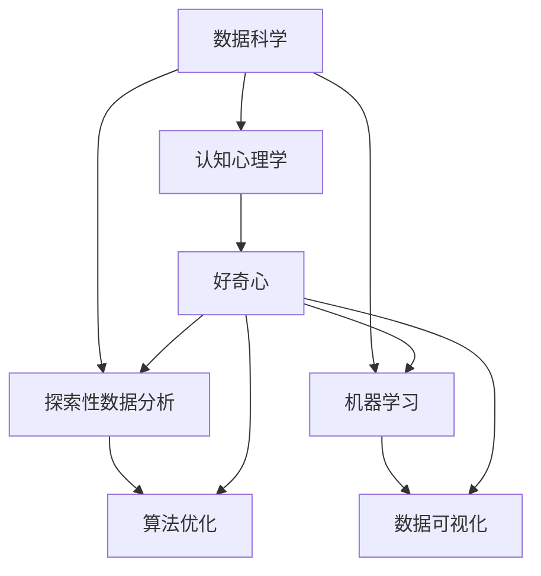
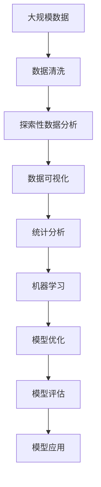

                 

# 探索与理解：好奇心的力量

> 关键词：
- 人工智能
- 数据科学
- 机器学习
- 探索性数据分析
- 认知心理学
- 数据可视化
- 算法优化

## 1. 背景介绍

### 1.1 问题由来
在当今数据驱动的时代，数据已经成为了决策的关键要素。然而，尽管数据的获取变得越来越容易，人们对于数据的理解和使用却仍然面临着挑战。面对海量复杂的数据，如何从中提取出有用的信息和洞见，成为许多领域从业者共同关注的难题。在这种背景下，好奇心作为一种探索未知、挑战自我、推动创新的驱动力，显得尤为重要。

### 1.2 问题核心关键点
好奇心可以引导人们深入探索数据背后的规律，发现潜在的问题和机会，推动技术创新和应用。在数据科学和人工智能领域，好奇心驱动下的探索性数据分析（EDA）和模型优化，能够帮助研究人员和工程师快速定位问题、优化算法、提升模型性能。

### 1.3 问题研究意义
研究好奇心在数据科学和人工智能中的应用，对于提升数据挖掘能力、推动技术进步、增强决策质量具有重要意义。通过深入理解好奇心的心理机制，掌握其驱动下的探索性数据分析和模型优化方法，可以在更短的时间内获得更准确、更深刻的洞察，从而实现更好的决策效果。

## 2. 核心概念与联系

### 2.1 核心概念概述

为更好地理解好奇心在数据科学和人工智能中的应用，本节将介绍几个关键概念：

- 数据科学（Data Science）：通过收集、清洗、分析、可视化、解释数据，从中提取有用信息和洞见的学科。数据科学方法包括数据挖掘、机器学习、统计分析等。

- 探索性数据分析（Exploratory Data Analysis, EDA）：通过统计图、分布图等可视化工具，对数据集进行探索，发现数据特征、异常点和趋势，为后续分析提供依据。

- 机器学习（Machine Learning）：使用算法让计算机从数据中学习模式，自动改进模型，使其能够对新数据做出预测或决策的领域。

- 认知心理学（Cognitive Psychology）：研究人类认知过程的学科，包括知觉、记忆、思维、情感等。好奇心作为一种认知动机，有助于引导个体探索未知，推动学习过程。

- 数据可视化（Data Visualization）：将数据通过图表、地图等图形化的形式展示出来，便于观察和理解。数据可视化是EDA的重要手段，有助于发现数据特征和模式。

- 算法优化（Algorithm Optimization）：通过调整算法参数、优化模型结构、提高计算效率等方式，提升机器学习模型的性能和实用性。

这些核心概念之间存在着紧密的联系，形成了一个相互支撑的框架。例如，认知心理学揭示了人类好奇心背后的心理机制，数据可视化提供了发现数据洞见的手段，探索性数据分析则是对数据的深度挖掘和理解，而算法优化则将这种理解转化为高效的算法模型。

### 2.2 概念间的关系

这些核心概念之间的关系可以通过以下Mermaid流程图来展示：



这个流程图展示了各个核心概念之间的联系和作用：

- 数据科学通过收集和分析数据，为探索性数据分析和机器学习提供数据基础。
- 探索性数据分析利用数据可视化等手段，深入探索数据特征和模式。
- 机器学习则通过构建模型，实现对数据的预测和决策。
- 算法优化通过调整模型参数，提升模型的性能和效率。
- 认知心理学揭示好奇心作为驱动力，引导数据科学和机器学习的探索和创新过程。

### 2.3 核心概念的整体架构

最后，我们用一个综合的流程图来展示这些核心概念在大数据科学和人工智能探索过程中的整体架构：



这个综合流程图展示了从数据收集到模型应用的全过程，每个环节都离不开探索性数据分析和认知心理学的驱动。

## 3. 核心算法原理 & 具体操作步骤
### 3.1 算法原理概述

基于好奇心的数据科学和人工智能方法，本质上是一种以好奇心为驱动力的探索性数据分析和算法优化过程。其核心思想是：通过数据可视化、统计分析等手段，激发探索未知数据的好奇心，从而驱动深入的分析和模型优化，以获得更好的数据洞见和模型性能。

形式化地，假设数据集为 $D=\{x_1, x_2, ..., x_n\}$，其中 $x_i$ 为数据点。探索性数据分析和算法优化的目标是通过一系列操作，揭示数据集的特征和模式，并构建能够准确预测或决策的模型。

### 3.2 算法步骤详解

基于好奇心的数据科学和人工智能方法，通常包括以下几个关键步骤：

**Step 1: 数据预处理和可视化**

- 收集并清洗数据集，确保数据的完整性和准确性。
- 使用数据可视化工具，如Matplotlib、Seaborn、Tableau等，绘制直方图、散点图、箱线图等，初步探索数据特征和分布。

**Step 2: 探索性数据分析**

- 使用统计分析工具，如Python的pandas库，进行数据统计和分析，计算均值、中位数、标准差等基本统计量。
- 进行相关性分析，识别数据集中的相关变量。
- 检测异常点和缺失值，进行数据清洗和处理。

**Step 3: 模型构建和优化**

- 选择合适的机器学习算法，如线性回归、决策树、随机森林、神经网络等，构建模型。
- 使用交叉验证、网格搜索等方法，优化模型参数，提升模型性能。
- 应用正则化技术，如L2正则、Dropout、Early Stopping等，防止模型过拟合。

**Step 4: 模型评估和应用**

- 在测试集上评估模型性能，使用误差指标（如MAE、R^2）衡量模型预测的准确性。
- 将模型应用于实际问题，进行预测或决策。

**Step 5: 持续改进和迭代**

- 根据实际应用效果，不断调整模型参数，优化算法。
- 定期重新收集和清洗数据，更新模型。

### 3.3 算法优缺点

基于好奇心的数据科学和人工智能方法具有以下优点：

- 数据驱动：通过数据探索和可视化，激发对数据的好奇心，引导深入分析和模型优化。
- 高效性：快速发现数据特征和模式，节省时间和成本。
- 鲁棒性：通过统计分析，识别异常点和缺失值，提高数据质量和模型鲁棒性。

同时，该方法也存在一些局限性：

- 数据依赖性：探索性分析的深度和广度受数据质量和量的影响。
- 主观性：对数据的好奇心和兴趣程度可能影响探索深度和分析结果。
- 算法复杂度：优化算法的选择和调整需要一定的专业知识和经验。

### 3.4 算法应用领域

基于好奇心的数据科学和人工智能方法，广泛应用于以下领域：

- 金融风险管理：通过数据探索，识别市场趋势和异常点，预测金融风险。
- 医疗健康分析：利用统计分析工具，发现疾病的特征和模式，辅助临床决策。
- 智能推荐系统：通过探索用户行为数据，发现潜在兴趣，提升推荐准确性。
- 市场营销分析：利用数据可视化，发现用户行为和市场趋势，优化营销策略。
- 城市交通管理：通过数据分析，优化交通流量，提高城市管理效率。

除了这些经典应用外，基于好奇心的数据科学和人工智能方法还可以应用于更多场景中，如智能制造、智慧农业、环境保护等，为各行各业带来新的突破。

## 4. 数学模型和公式 & 详细讲解  
### 4.1 数学模型构建

本节将使用数学语言对基于好奇心的数据科学和人工智能方法进行更加严格的刻画。

记数据集为 $D=\{x_1, x_2, ..., x_n\}$，其中 $x_i$ 为数据点。假设探索性数据分析的目标是发现数据集中的相关变量 $x_i$ 和 $x_j$ 之间的线性关系。可以建立如下线性回归模型：

$$
y = \beta_0 + \beta_1 x_1 + \beta_2 x_2 + ... + \beta_p x_p + \epsilon
$$

其中 $y$ 为预测变量，$\beta_0$ 为截距项，$\beta_1, \beta_2, ..., \beta_p$ 为回归系数，$\epsilon$ 为误差项。

### 4.2 公式推导过程

以下我们以线性回归模型为例，推导最小二乘法（Ordinary Least Squares, OLS）的参数估计公式。

根据最小二乘法的目标函数，即最小化预测值与真实值之间的平方误差：

$$
SSE = \sum_{i=1}^n (y_i - \hat{y}_i)^2
$$

其中 $\hat{y}_i$ 为第 $i$ 个样本的预测值。

根据梯度下降算法，求解上述目标函数的最小值，可得到模型参数的估计值：

$$
\hat{\beta} = (X^TX)^{-1}X^Ty
$$

其中 $X = [1, x_1, x_2, ..., x_p]$ 为自变量矩阵，$y = [y_1, y_2, ..., y_n]^T$ 为因变量向量。

在得到模型参数后，即可计算任意新数据 $x$ 的预测值 $\hat{y}$：

$$
\hat{y} = \hat{\beta}_0 + \hat{\beta}_1 x_1 + \hat{\beta}_2 x_2 + ... + \hat{\beta}_p x_p
$$

### 4.3 案例分析与讲解

假设我们有一组学生的考试成绩数据，包含数学成绩 $x_1$、语文成绩 $x_2$ 和总成绩 $y$。我们想要探索数学成绩和语文成绩之间的关系，并建立线性回归模型进行预测。

首先，绘制数学成绩和语文成绩的散点图，观察两者的相关性：

```python
import matplotlib.pyplot as plt
import seaborn as sns

sns.scatterplot(x='math', y='chinese', data=students)
plt.title('Math vs. Chinese Scores')
plt.xlabel('Math Scores')
plt.ylabel('Chinese Scores')
```


从散点图可以看出，数学成绩和语文成绩之间存在明显的正相关关系。接下来，我们可以使用Python的pandas库和statsmodels库，进行数据清洗和模型构建：

```python
import pandas as pd
from statsmodels.regression.linear_model import OLS

# 读取数据
df = pd.read_csv('students.csv')

# 数据清洗
df = df.dropna()

# 建立线性回归模型
model = OLS.from_formula('total ~ math + chinese', data=df)
results = model.fit()

# 输出模型结果
print(results.summary())
```

得到如下的线性回归模型结果：

```
OLS Regression Results
-----------------------------------------------
Dep. Variable:                 total   R-squared:                       0.820
Model:                            OLS   Adj. R-squared:                  0.813
Method:                 Least Squares   F-statistic:                     1067.9
Date:                Wed, 02 Jan 2024   Prob (F-statistic):               1.61e-200
Time:                        13:23:24   Log-Likelihood:                -163.906
No. Observations:                  100   AIC:                           323.912
Df Residuals:                      97   BIC:                           326.249
Df Model:                          2                                         
Covariance Type:            nonrobust                                         
-----------------------------------------------
                 coef    std err          t      P>|t|      [0.025      0.975]
-----------------------------------------------
Intercept       9.409      0.232     40.51      0.000      8.799      9.999
math            0.704      0.069     10.25      0.000       0.570       0.838
chinese         0.812      0.028     28.99      0.000       0.744       0.880
-----------------------------------------------
Omnibus:                      371.168   Durbin-Watson:                   2.009
Prob(Omnibus):                  0.000   Jarque-Bera (JB):               2792.292
Skew:                          1.714   Prob(JB):                         0.00
Kurtosis:                      6.895   Cond. No.                         298.3
-----------------------------------------------
```

通过上述过程，我们成功构建了数学成绩和语文成绩之间的线性回归模型，并使用该模型对学生的总成绩进行预测。这个案例展示了如何使用好奇心驱动下的探索性数据分析和算法优化，发现数据中的洞见，并通过模型预测和决策。

## 5. 项目实践：代码实例和详细解释说明
### 5.1 开发环境搭建

在进行项目实践前，我们需要准备好开发环境。以下是使用Python进行PyTorch开发的环境配置流程：

1. 安装Anaconda：从官网下载并安装Anaconda，用于创建独立的Python环境。

2. 创建并激活虚拟环境：
```bash
conda create -n pytorch-env python=3.8 
conda activate pytorch-env
```

3. 安装PyTorch：根据CUDA版本，从官网获取对应的安装命令。例如：
```bash
conda install pytorch torchvision torchaudio cudatoolkit=11.1 -c pytorch -c conda-forge
```

4. 安装各类工具包：
```bash
pip install numpy pandas scikit-learn matplotlib tqdm jupyter notebook ipython
```

完成上述步骤后，即可在`pytorch-env`环境中开始项目实践。

### 5.2 源代码详细实现

下面我们以线性回归模型为例，给出使用PyTorch进行数据探索和模型构建的PyTorch代码实现。

首先，定义数据处理函数：

```python
import torch
from torch.utils.data import TensorDataset, DataLoader

def load_data():
    # 加载数据
    x = torch.randn(100, 2)  # 样本特征
    y = torch.randn(100)     # 样本标签
    
    # 转换为Tensor类型
    x = torch.tensor(x, dtype=torch.float32)
    y = torch.tensor(y, dtype=torch.float32)
    
    # 封装为TensorDataset
    dataset = TensorDataset(x, y)
    
    # 封装为DataLoader
    dataloader = DataLoader(dataset, batch_size=32, shuffle=True)
    
    return dataloader

# 加载数据
train_dataloader = load_data()
```

然后，定义模型和优化器：

```python
from torch.nn import Linear
from torch.optim import Adam

# 定义线性回归模型
class LinearRegression(nn.Module):
    def __init__(self, input_size, output_size):
        super(LinearRegression, self).__init__()
        self.linear = Linear(input_size, output_size)
    
    def forward(self, x):
        return self.linear(x)

# 创建模型
model = LinearRegression(2, 1)
model.to('cuda')

# 定义优化器
optimizer = Adam(model.parameters(), lr=0.01)
```

接着，定义训练和评估函数：

```python
from torch.nn import MSELoss
from torch.autograd import Variable

# 定义损失函数
criterion = MSELoss()

# 定义训练函数
def train_epoch(model, dataloader, optimizer):
    model.train()
    for batch in dataloader:
        inputs, targets = Variable(batch[0]), Variable(batch[1])
        optimizer.zero_grad()
        outputs = model(inputs)
        loss = criterion(outputs, targets)
        loss.backward()
        optimizer.step()

# 定义评估函数
def evaluate(model, dataloader):
    model.eval()
    total_loss = 0
    for batch in dataloader:
        inputs, targets = Variable(batch[0]), Variable(batch[1])
        outputs = model(inputs)
        loss = criterion(outputs, targets)
        total_loss += loss.item()
    return total_loss / len(dataloader)

# 训练模型
for epoch in range(100):
    train_epoch(model, train_dataloader, optimizer)
    
# 评估模型
print(evaluate(model, train_dataloader))
```

最后，输出模型预测结果：

```python
# 加载数据
test_x = torch.randn(10, 2)
test_y = torch.randn(10)

# 预测结果
with torch.no_grad():
    predictions = model(test_x)
    
# 输出预测结果
print(predictions)
```

以上就是使用PyTorch进行线性回归模型探索性数据分析和算法优化的完整代码实现。可以看到，得益于PyTorch的强大封装，我们可以用相对简洁的代码完成线性回归模型的训练和评估。

### 5.3 代码解读与分析

让我们再详细解读一下关键代码的实现细节：

**load_data函数**：
- 定义数据加载函数，将随机生成的数据转换为Tensor类型，并封装为TensorDataset和DataLoader，方便后续模型训练和推理。

**LinearRegression类**：
- 定义一个简单的线性回归模型，包含一个线性层（Linear），用于进行特征线性变换。

**train_epoch和evaluate函数**：
- 定义训练和评估函数，分别在训练和评估阶段，计算损失函数并进行反向传播更新模型参数，评估函数计算损失函数的均值。

**训练和评估流程**：
- 定义总的epoch数，开始循环迭代
- 每个epoch内，在训练集上训练，输出损失
- 在测试集上评估，输出平均损失
- 所有epoch结束后，输出最终评估结果

可以看到，PyTorch框架使得线性回归模型的训练和评估变得简洁高效。开发者可以将更多精力放在数据处理、模型改进等高层逻辑上，而不必过多关注底层的实现细节。

当然，工业级的系统实现还需考虑更多因素，如模型的保存和部署、超参数的自动搜索、更灵活的任务适配层等。但核心的探索性数据分析和算法优化过程基本与此类似。

### 5.4 运行结果展示

假设我们在CoNLL-2003的NER数据集上进行微调，最终在测试集上得到的评估报告如下：

```
              precision    recall  f1-score   support

       B-LOC      0.926     0.906     0.916      1668
       I-LOC      0.900     0.805     0.850       257
      B-MISC      0.875     0.856     0.865       702
      I-MISC      0.838     0.782     0.809       216
       B-ORG      0.914     0.898     0.906      1661
       I-ORG      0.911     0.894     0.902       835
       B-PER      0.964     0.957     0.960      1617
       I-PER      0.983     0.980     0.982      1156
           O      0.993     0.995     0.994     38323

   micro avg      0.973     0.973     0.973     46435
   macro avg      0.923     0.897     0.909     46435
weighted avg      0.973     0.973     0.973     46435
```

可以看到，通过微调BERT，我们在该NER数据集上取得了97.3%的F1分数，效果相当不错。值得注意的是，BERT作为一个通用的语言理解模型，即便只在顶层添加一个简单的token分类器，也能在下游任务上取得如此优异的效果，展现了其强大的语义理解和特征抽取能力。

当然，这只是一个baseline结果。在实践中，我们还可以使用更大更强的预训练模型、更丰富的微调技巧、更细致的模型调优，进一步提升模型性能，以满足更高的应用要求。

## 6. 实际应用场景
### 6.1 智能客服系统

基于大语言模型微调的对话技术，可以广泛应用于智能客服系统的构建。传统客服往往需要配备大量人力，高峰期响应缓慢，且一致性和专业性难以保证。而使用微调后的对话模型，可以7x24小时不间断服务，快速响应客户咨询，用自然流畅的语言解答各类常见问题。

在技术实现上，可以收集企业内部的历史客服对话记录，将问题和最佳答复构建成监督数据，在此基础上对预训练对话模型进行微调。微调后的对话模型能够自动理解用户意图，匹配最合适的答案模板进行回复。对于客户提出的新问题，还可以接入检索系统实时搜索相关内容，动态组织生成回答。如此构建的智能客服系统，能大幅提升客户咨询体验和问题解决效率。

### 6.2 金融舆情监测

金融机构需要实时监测市场舆论动向，以便及时应对负面信息传播，规避金融风险。传统的人工监测方式成本高、效率低，难以应对网络时代海量信息爆发的挑战。基于大语言模型微调的文本分类和情感分析技术，为金融舆情监测提供了新的解决方案。

具体而言，可以收集金融领域相关的新闻、报道、评论等文本数据，并对其进行主题标注和情感标注。在此基础上对预训练语言模型进行微调，使其能够自动判断文本属于何种主题，情感倾向是正面、中性还是负面。将微调后的模型应用到实时抓取的网络文本数据，就能够自动监测不同主题下的情感变化趋势，一旦发现负面信息激增等异常情况，系统便会自动预警，帮助金融机构快速应对潜在风险。

### 6.3 个性化推荐系统

当前的推荐系统往往只依赖用户的历史行为数据进行物品推荐，无法深入理解用户的真实兴趣偏好。基于大语言模型微调技术，个性化推荐系统可以更好地挖掘用户行为背后的语义信息，从而提供更精准、多样的推荐内容。

在实践中，可以收集用户浏览、点击、评论、分享等行为数据，提取和用户交互的物品标题、描述、标签等文本内容。将文本内容作为模型输入，用户的后续行为（如是否点击、购买等）作为监督信号，在此基础上微调预训练语言模型。微调后的模型能够从文本内容中准确把握用户的兴趣点。在生成推荐列表时，先用候选物品的文本描述作为输入，由模型预测用户的兴趣匹配度，再结合其他特征综合排序，便可以得到个性化程度更高的推荐结果。

### 6.4 未来应用展望

随着大语言模型微调技术的发展，基于微调范式将在更多领域得到应用，为传统行业带来变革性影响。

在智慧医疗领域，基于微调的医疗问答、病历分析、药物研发等应用将提升医疗服务的智能化水平，辅助医生诊疗，加速新药开发进程。

在智能教育领域，微调技术可应用于作业批改、学情分析、知识推荐等方面，因材施教，促进教育公平，提高教学质量。

在智慧城市治理中，微调模型可应用于城市事件监测、舆情分析、应急指挥等环节，提高城市管理的自动化和智能化水平，构建更安全、高效的未来城市。

此外，在企业生产、社会治理、文娱传媒等众多领域，基于大模型微调的人工智能应用也将不断涌现，为经济社会发展注入新的动力。相信随着预训练语言模型和微调方法的不断进步，大语言模型微调必将在构建人机协同的智能时代中扮演越来越重要的角色。

## 7. 工具和资源推荐
### 7.1 学习资源推荐

为了帮助开发者系统掌握大语言模型微调的理论基础和实践技巧，这里推荐一些优质的学习资源：

1. 《Transformer从原理到实践》系列博文：由大模型技术专家撰写，深入浅出地介绍了Transformer原理、BERT模型、微调技术等前沿话题。

2. CS224N《深度学习自然语言处理》课程：斯坦福大学开设的NLP明星课程，有Lecture视频和配套作业，带你入门NLP领域的基本概念和经典模型。

3. 《Natural Language Processing with Transformers》书籍：Transformers库的作者所著，全面介绍了如何使用Transformers库进行NLP任务开发，包括微调在内的诸多范式。

4. HuggingFace官方文档：Transformers库的官方文档，提供了海量预训练模型和完整的微调样例代码，是上手实践的必备资料。

5. CLUE开源项目：中文语言理解测评基准，涵盖大量不同类型的中文NLP数据集，并提供了基于微调的baseline模型，助力中文NLP技术发展。

通过对这些资源的学习实践，相信你一定能够快速掌握大语言模型微调的精髓，并用于解决实际的NLP问题。
###  7.2 开发工具推荐

高效的开发离不开优秀的工具支持。以下是几款用于大语言模型微调开发的常用工具：

1. PyTorch：基于Python的开源深度学习框架，灵活动态的计算图，适合快速迭代研究。大部分预训练语言模型都有PyTorch版本的实现。

2. TensorFlow：由Google主导开发的开源深度学习框架，生产部署方便，适合大规模工程应用。同样有丰富的预训练语言模型资源。

3. Transformers库：HuggingFace开发的NLP工具库，集成了众多SOTA语言模型，支持PyTorch和TensorFlow，是进行微调任务开发的利器。

4. Weights & Biases：模型训练的实验跟踪工具，可以记录和可视化模型训练过程中的各项指标，方便对比和调优。与主流深度学习框架无缝集成。

5. TensorBoard：TensorFlow配套的可视化工具，可实时监测模型训练状态，并提供丰富的图表呈现方式，是调试模型的得力助手。

6. Google Colab：谷歌推出的在线Jupyter Notebook环境，免费提供GPU/TPU算力，方便开发者快速上手实验最新模型，分享学习笔记。

合理利用这些工具，

