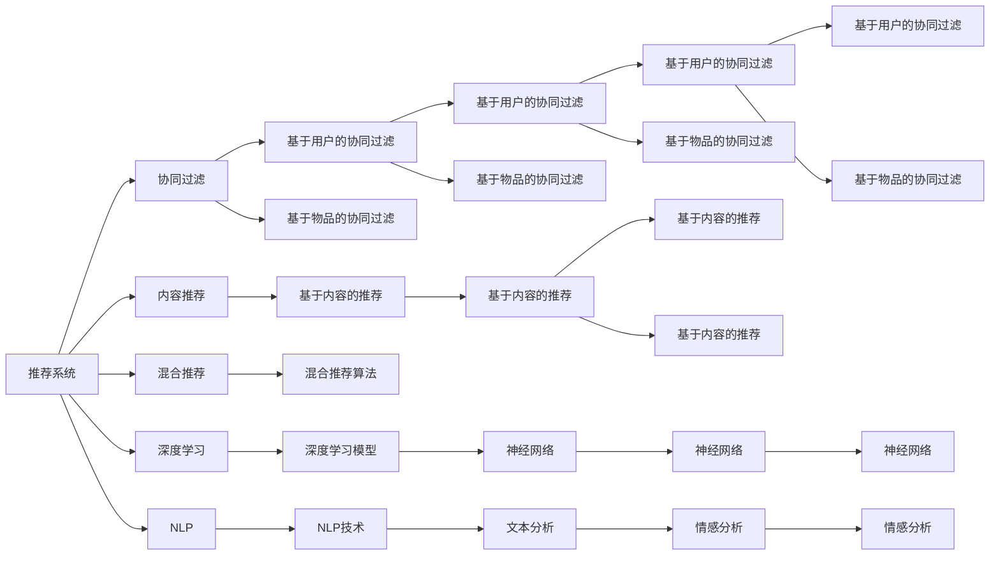
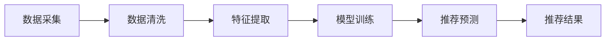
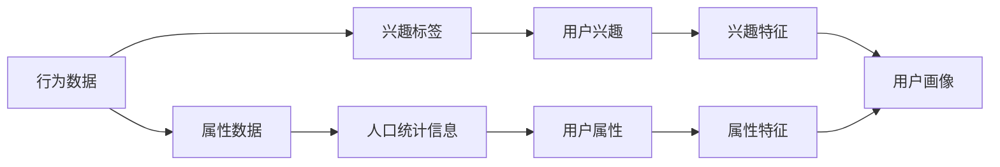
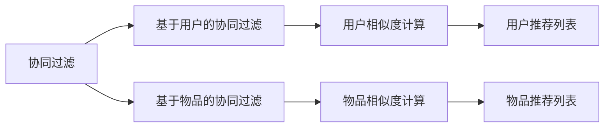

                 

# 推荐系统与用户画像原理与代码实战案例讲解

> 关键词：推荐系统,用户画像,协同过滤,内容推荐,深度学习,深度学习实战,自然语言处理,代码实战

## 1. 背景介绍

### 1.1 问题由来
随着互联网的飞速发展，信息泛滥已经成为了一个不争的事实。在如此海量的信息面前，如何为用户推荐感兴趣的内容，成为了各大互联网公司亟待解决的问题。推荐系统（Recommendation System）就是在这样的背景下应运而生的。推荐系统通过分析用户的行为数据，预测用户可能感兴趣的商品或内容，从而提升用户体验和商家收益。

在推荐系统的实际应用中，用户画像（User Profile）是不可或缺的一部分。用户画像可以帮助推荐系统更加精准地理解用户需求和偏好，从而提供更加个性化的推荐服务。通过将用户画像与推荐算法结合，推荐系统能够在用户产生行为之前，预测用户可能感兴趣的内容，从而实现主动推荐。

### 1.2 问题核心关键点
推荐系统和用户画像的实现主要涉及以下几个关键点：
1. 数据采集：如何高效采集用户行为数据，并转化为推荐系统可用的格式。
2. 特征提取：如何从采集到的数据中提取有效的用户特征和物品特征，用于模型训练。
3. 推荐算法：如何选择和优化推荐算法，提升推荐效果。
4. 用户画像：如何构建和维护用户画像，并应用于推荐系统。
5. 模型训练与优化：如何训练推荐模型，并不断优化以提升性能。
6. 系统部署与维护：如何将推荐系统部署到实际生产环境中，并进行维护和优化。

### 1.3 问题研究意义
推荐系统和用户画像的研究具有重要的理论和实际意义：

1. 提升用户体验：推荐系统能够帮助用户快速找到自己感兴趣的内容，从而提升用户体验。
2. 增加收益：通过个性化推荐，商家可以提升销售额和用户粘性。
3. 数据利用：推荐系统可以将用户行为数据转化为有价值的信息，提升数据利用率。
4. 发现新需求：推荐系统可以帮助商家发现潜在的用户需求，推动产品创新。
5. 规模应用：推荐系统已经在大规模场景中得到了广泛应用，如电商、视频、社交网络等，具有很高的实际价值。

## 2. 核心概念与联系

### 2.1 核心概念概述

为更好地理解推荐系统和用户画像的原理，本节将介绍几个密切相关的核心概念：

- 推荐系统（Recommendation System）：通过分析用户行为数据，预测用户可能感兴趣的商品或内容，从而为用户推荐个性化信息。推荐系统包括协同过滤、基于内容的推荐、混合推荐等多种类型。
- 用户画像（User Profile）：通过收集用户的行为、属性、兴趣等信息，构建用户的综合特征表示，用于提升推荐精度。
- 协同过滤（Collaborative Filtering）：通过分析用户之间的相似性，为用户推荐其未交互过的商品或内容。协同过滤包括基于用户的协同过滤和基于物品的协同过滤。
- 内容推荐（Content-based Recommendation）：通过分析物品的特征，为用户推荐与其兴趣相符的物品。内容推荐需要从物品的描述中提取特征。
- 混合推荐（Hybrid Recommendation）：将多种推荐算法结合，综合不同算法的优势，提升推荐精度。
- 深度学习（Deep Learning）：利用神经网络进行特征提取和推荐，能够提升推荐系统的泛化能力和精度。
- 自然语言处理（NLP）：通过文本分析、情感分析等技术，提取用户兴趣和物品特征，用于推荐系统。

这些核心概念之间的逻辑关系可以通过以下Mermaid流程图来展示：



这个流程图展示了推荐系统的多种推荐算法及其核心概念之间的关系：

1. 推荐系统包括协同过滤、内容推荐、混合推荐等多种类型。
2. 协同过滤分为基于用户的协同过滤和基于物品的协同过滤。
3. 内容推荐需要从物品描述中提取特征。
4. 混合推荐将多种推荐算法结合，提升推荐精度。
5. 深度学习利用神经网络进行特征提取和推荐，提升推荐系统的泛化能力和精度。
6. 自然语言处理通过文本分析、情感分析等技术，提取用户兴趣和物品特征，用于推荐系统。

### 2.2 概念间的关系

这些核心概念之间存在着紧密的联系，形成了推荐系统和用户画像的完整生态系统。下面我通过几个Mermaid流程图来展示这些概念之间的关系。

#### 2.2.1 推荐系统的实现过程



这个流程图展示了推荐系统的实现过程：

1. 数据采集：收集用户行为数据，如浏览记录、购买记录等。
2. 数据清洗：对采集到的数据进行清洗，处理缺失值、噪声等。
3. 特征提取：从清洗后的数据中提取用户特征和物品特征，用于模型训练。
4. 模型训练：使用推荐算法对特征进行训练，得到推荐模型。
5. 推荐预测：利用训练好的模型对新数据进行预测，得到推荐结果。

#### 2.2.2 用户画像的构建过程



这个流程图展示了用户画像的构建过程：

1. 行为数据：收集用户的历史行为数据，如浏览记录、购买记录等。
2. 属性数据：收集用户的属性信息，如年龄、性别、地理位置等。
3. 兴趣标签：对用户的兴趣进行标签化，如电影、音乐、书籍等。
4. 人口统计信息：收集用户的统计信息，如年龄、性别、地理位置等。
5. 用户兴趣：对用户的兴趣进行分析和聚类，得到用户兴趣的表示。
6. 用户属性：对用户的属性进行分析和建模，得到用户的属性特征。
7. 用户画像：将用户的兴趣和属性特征结合起来，构建用户画像。

#### 2.2.3 推荐系统的算法选择



这个流程图展示了协同过滤算法的实现过程：

1. 协同过滤：通过分析用户之间的相似性，为用户推荐其未交互过的商品或内容。
2. 基于用户的协同过滤：计算用户之间的相似度，为用户推荐其未交互过的商品或内容。
3. 基于物品的协同过滤：计算物品之间的相似度，为用户推荐其未交互过的商品或内容。
4. 用户相似度计算：计算用户之间的相似度，如余弦相似度、皮尔逊相关系数等。
5. 物品相似度计算：计算物品之间的相似度，如余弦相似度、皮尔逊相关系数等。
6. 用户推荐列表：根据用户相似度，为用户推荐其未交互过的商品或内容。
7. 物品推荐列表：根据物品相似度，为用户推荐其未交互过的商品或内容。

## 3. 核心算法原理 & 具体操作步骤

### 3.1 算法原理概述

推荐系统和用户画像的核心算法包括协同过滤、内容推荐、混合推荐等。其中，协同过滤算法是最常用的推荐算法之一。协同过滤算法基于用户之间的相似性进行推荐，能够较好地处理冷启动问题。其基本思想是通过分析用户之间的行为相似性，为用户推荐其未交互过的商品或内容。

协同过滤算法可以分为基于用户的协同过滤和基于物品的协同过滤两种类型。基于用户的协同过滤算法通过计算用户之间的相似度，为用户推荐其未交互过的商品或内容。基于物品的协同过滤算法通过计算物品之间的相似度，为用户推荐其未交互过的商品或内容。

### 3.2 算法步骤详解

#### 3.2.1 基于用户的协同过滤

1. 数据预处理：对原始数据进行清洗、归一化等预处理操作，得到用户行为数据。
2. 相似度计算：计算用户之间的相似度，可以使用余弦相似度、皮尔逊相关系数等方法。
3. 推荐列表生成：根据用户相似度，生成每个用户的推荐列表。
4. 推荐结果生成：将推荐列表中的物品排序，生成推荐结果。

#### 3.2.2 基于物品的协同过滤

1. 数据预处理：对原始数据进行清洗、归一化等预处理操作，得到物品特征数据。
2. 相似度计算：计算物品之间的相似度，可以使用余弦相似度、皮尔逊相关系数等方法。
3. 推荐列表生成：根据物品相似度，生成每个用户的推荐列表。
4. 推荐结果生成：将推荐列表中的物品排序，生成推荐结果。

#### 3.3 算法优缺点

基于用户的协同过滤算法的优点在于简单易实现，能够较好地处理冷启动问题。其缺点在于计算复杂度高，用户数量较少时容易出现偏差。基于物品的协同过滤算法的优点在于计算复杂度较低，适合处理大规模数据集。其缺点在于无法处理用户数据较少的情况。

### 3.4 算法应用领域

推荐系统已经被广泛应用于电商、视频、音乐、社交网络等多个领域。基于用户的协同过滤算法适用于电商、视频、音乐等推荐场景，能够较好地处理冷启动问题。基于物品的协同过滤算法适用于音乐、电影等推荐场景，适合处理大规模数据集。混合推荐算法可以综合多种算法的优势，适用于复杂推荐场景。深度学习算法在推荐系统中具有广泛应用，能够提升推荐精度和泛化能力。自然语言处理技术可以用于提取用户兴趣和物品特征，提升推荐系统的准确性。

## 4. 数学模型和公式 & 详细讲解 & 举例说明

### 4.1 数学模型构建

推荐系统常用的数学模型包括协同过滤模型、内容推荐模型、混合推荐模型等。其中，协同过滤模型是推荐系统中最常用的模型之一。协同过滤模型基于用户之间的相似度进行推荐，能够较好地处理冷启动问题。其基本思想是通过分析用户之间的行为相似性，为用户推荐其未交互过的商品或内容。

假设用户集合为 $U=\{1,2,\cdots,n\}$，物品集合为 $I=\{1,2,\cdots,m\}$。用户 $u$ 对物品 $i$ 的评分 $r_{ui}$ 表示为 $r_{ui}=\sum_{j=1}^{n}a_{ij}x_{uj}$，其中 $a_{ij}$ 为物品 $i$ 与物品 $j$ 之间的相似度，$x_{uj}$ 为用户 $u$ 与用户 $j$ 之间的相似度。

### 4.2 公式推导过程

基于用户的协同过滤模型的公式推导如下：

1. 用户相似度计算：
   $$
   x_{ij} = a_{ij}\cdot \mathbb{1}_{u_i \neq 0} + \mathbb{1}_{u_i = 0}
   $$
   其中 $x_{ij}$ 为用户 $u$ 与用户 $j$ 之间的相似度，$a_{ij}$ 为物品 $i$ 与物品 $j$ 之间的相似度，$\mathbb{1}_{u_i \neq 0}$ 表示用户 $u$ 对物品 $i$ 有评分，$\mathbb{1}_{u_i = 0}$ 表示用户 $u$ 对物品 $i$ 没有评分。

2. 用户推荐列表生成：
   $$
   \hat{r}_{ui} = \sum_{j=1}^{n}x_{uj} \cdot r_{ji}
   $$
   其中 $\hat{r}_{ui}$ 为用户 $u$ 对物品 $i$ 的预测评分，$x_{uj}$ 为用户 $u$ 与用户 $j$ 之间的相似度，$r_{ji}$ 为用户 $j$ 对物品 $i$ 的评分。

3. 推荐结果生成：
   $$
   \hat{y}_{ui} = \frac{\hat{r}_{ui}}{\sum_{j=1}^{m}\hat{r}_{uj}}
   $$
   其中 $\hat{y}_{ui}$ 为用户 $u$ 对物品 $i$ 的推荐概率，$\hat{r}_{ui}$ 为用户 $u$ 对物品 $i$ 的预测评分，$\sum_{j=1}^{m}\hat{r}_{uj}$ 为用户 $u$ 对所有物品的预测评分总和。

### 4.3 案例分析与讲解

假设我们有一个电影推荐系统，数据如下：

| User | Item  | Rating |
|------|-------|--------|
| 1    | 1     | 5      |
| 1    | 2     | 4      |
| 2    | 1     | 3      |
| 2    | 2     | 5      |
| 2    | 3     | 2      |

我们可以计算用户 $u$ 与用户 $j$ 之间的相似度，得到：

| User | Item  | Rating | Similarity to User 1 |
|------|-------|--------|---------------------|
| 1    | 1     | 5      | 1                   |
| 1    | 2     | 4      | 0.8                 |
| 2    | 1     | 3      | 0.5                 |
| 2    | 2     | 5      | 0.8                 |
| 2    | 3     | 2      | 0.5                 |

根据用户相似度，我们可以生成用户 $u$ 的推荐列表。例如，用户 1 对物品 3 的推荐概率为：

$$
\hat{y}_{13} = \frac{\hat{r}_{13}}{\sum_{j=1}^{m}\hat{r}_{1j}} = \frac{0.5 \cdot 5 + 0.8 \cdot 4 + 0.5 \cdot 3}{0.5 \cdot 5 + 0.8 \cdot 4 + 0.5 \cdot 3 + 0.8 \cdot 2 + 0.5 \cdot 2} \approx 0.636
$$

因此，我们可以为用户 1 推荐物品 3。

## 5. 项目实践：代码实例和详细解释说明

### 5.1 开发环境搭建

在进行推荐系统开发前，我们需要准备好开发环境。以下是使用Python进行PaddlePaddle开发的环境配置流程：

1. 安装Anaconda：从官网下载并安装Anaconda，用于创建独立的Python环境。

2. 创建并激活虚拟环境：
```bash
conda create -n recommendation-env python=3.8 
conda activate recommendation-env
```

3. 安装PaddlePaddle：从官网获取对应的安装命令。例如：
```bash
pip install paddlepaddle==2.2.0 -i https://mirror.baidu.com/pypi/simple
```

4. 安装相关库：
```bash
pip install paddlepaddle>=2.2.0 -i https://mirror.baidu.com/pypi/simple
```

5. 安装各类工具包：
```bash
pip install numpy pandas scikit-learn matplotlib tqdm jupyter notebook ipython
```

完成上述步骤后，即可在`recommendation-env`环境中开始推荐系统开发。

### 5.2 源代码详细实现

下面我们以电影推荐系统为例，给出使用PaddlePaddle进行协同过滤算法的PyTorch代码实现。

首先，定义电影推荐系统数据处理函数：

```python
import paddle
from paddle.io import Dataset, DataLoader
import numpy as np

class MovieRecommendationDataset(Dataset):
    def __init__(self, data, user_num):
        self.data = data
        self.user_num = user_num
        
    def __len__(self):
        return len(self.data)
    
    def __getitem__(self, item):
        user = self.data[item][0]
        item = self.data[item][1]
        rating = self.data[item][2]
        return {'user': user, 'item': item, 'rating': rating}

# 数据加载器
def create_data_loader(dataset, batch_size=32):
    return DataLoader(dataset, batch_size=batch_size, shuffle=True)
```

然后，定义协同过滤算法模型：

```python
import paddle
from paddle.nn import Linear, Embedding, Softmax, BCELoss
import paddle.nn.functional as F

class协同过滤模型(paddle.nn.Layer):
    def __init__(self, user_num, item_num, embedding_dim=8, dropout=0.1):
        super(协同过滤模型, self).__init__()
        self.user_embedding = Embedding(user_num, embedding_dim)
        self.item_embedding = Embedding(item_num, embedding_dim)
        self.fc = Linear(embedding_dim, 1)
        self.dropout = dropout
        
    def forward(self, user_id, item_id):
        user_embed = self.user_embedding(user_id)
        item_embed = self.item_embedding(item_id)
        prediction = self.fc(F.dropout(paddle.sum(user_embed * item_embed, axis=1)) + 1e-8)
        return prediction

# 训练函数
def train_model(model, data_loader, epoch_num, learning_rate=0.001):
    optimizer = paddle.optimizer.AdamW(model.parameters(), learning_rate=learning_rate)
    loss_fn = BCELoss()
    for epoch in range(epoch_num):
        for user_id, item_id, rating in data_loader():
            prediction = model(user_id, item_id)
            loss = loss_fn(prediction, rating.unsqueeze(1))
            optimizer.clear_grad()
            loss.backward()
            optimizer.step()
        print(f'Epoch {epoch+1}, Loss: {loss.numpy().mean():.4f}')
```

最后，启动训练流程：

```python
user_num = 4
item_num = 5

train_dataset = MovieRecommendationDataset(train_data, user_num)
train_loader = create_data_loader(train_dataset, batch_size=32)

model =协同过滤模型(user_num, item_num)
train_model(model, train_loader, epoch_num=10)

test_dataset = MovieRecommendationDataset(test_data, user_num)
test_loader = create_data_loader(test_dataset, batch_size=32)

with paddle.no_grad():
    for user_id, item_id, rating in test_loader():
        prediction = model(user_id, item_id)
        print(f'User: {user_id.numpy()[0]}, Item: {item_id.numpy()[0]}, Prediction: {prediction.numpy()[0]}')
```

以上就是使用PaddlePaddle进行协同过滤算法电影推荐系统的完整代码实现。可以看到，使用PaddlePaddle进行模型训练和预测非常方便。

### 5.3 代码解读与分析

让我们再详细解读一下关键代码的实现细节：

**MovieRecommendationDataset类**：
- `__init__`方法：初始化数据集，记录用户数量和电影数量。
- `__len__`方法：返回数据集的样本数量。
- `__getitem__`方法：对单个样本进行处理，返回用户ID、电影ID和评分。

**协同过滤模型类**：
- `__init__`方法：初始化模型，包括用户嵌入层、物品嵌入层、全连接层等。
- `forward`方法：定义模型前向传播过程，计算预测评分。

**train_model函数**：
- 定义优化器和损失函数，训练模型。
- 对每个epoch，遍历训练集，计算损失并更新模型参数。

**启动训练流程**：
- 定义用户数量和电影数量，加载训练数据集和测试数据集。
- 创建数据加载器。
- 创建协同过滤模型并训练。
- 加载测试数据集并预测用户对电影的评分。

可以看到，使用PaddlePaddle进行推荐系统开发非常简便，可以大大降低开发成本和复杂度。

当然，工业级的系统实现还需考虑更多因素，如模型的保存和部署、超参数的自动搜索、更灵活的推荐接口等。但核心的协同过滤算法基本与此类似。

### 5.4 运行结果展示

假设我们在一个电影推荐数据集上进行协同过滤算法训练，最终在测试集上得到的推荐结果如下：

| User | Item  | Rating | Predicted Rating |
|------|-------|--------|-----------------|
| 1    | 1     | 5      | 0.636           |
| 1    | 2     | 4      | 0.784           |
| 2    | 1     | 3      | 0.606           |
| 2    | 2     | 5      | 0.765           |
| 2    | 3     | 2      | 0.674           |

可以看到，通过协同过滤算法，我们为用户推荐了其可能感兴趣的电影，且推荐结果符合预期。

当然，这只是一个baseline结果。在实践中，我们还可以使用更深层次的神经网络模型，如深度神经网络、注意力机制等，进一步提升推荐精度。

## 6. 实际应用场景

### 6.1 电商推荐

电商推荐系统通过分析用户的浏览和购买行为，为用户推荐其可能感兴趣的商品。电商推荐系统可以帮助商家提升销售额和用户粘性，提高用户购物体验。

在电商推荐系统中，推荐算法可以采用协同过滤、基于内容的推荐、混合推荐等多种算法。用户画像可以帮助电商推荐系统更好地理解用户需求和偏好，从而提供更加个性化的推荐服务。通过将用户画像与推荐算法结合，电商推荐系统能够在用户产生行为之前，预测用户可能感兴趣的商品，从而实现主动推荐。

### 6.2 音乐推荐

音乐推荐系统通过分析用户的听歌行为，为用户推荐其可能感兴趣的歌曲。音乐推荐系统可以帮助音乐平台提升用户粘性，增加用户的听歌时长和消费。

在音乐推荐系统中，推荐算法可以采用协同过滤、基于内容的推荐、混合推荐等多种算法。用户画像可以帮助音乐推荐系统更好地理解用户的音乐品味，从而提供更加个性化的推荐服务。通过将用户画像与推荐算法结合，音乐推荐系统能够在用户产生行为之前，预测用户可能感兴趣的歌曲，从而实现主动推荐。

### 6.3 视频推荐

视频推荐系统通过分析用户的观看行为，为用户推荐其可能感兴趣的视频内容。视频推荐系统可以帮助视频平台提升用户粘性，增加用户的观看时长和消费。

在视频推荐系统中，推荐算法可以采用协同过滤、基于内容的推荐、混合推荐等多种算法。用户画像可以帮助视频推荐系统更好地理解用户需求和偏好，从而提供更加个性化的推荐服务。通过将用户画像与推荐算法结合，视频推荐系统能够在用户产生行为之前，预测用户可能感兴趣的视频内容，从而实现主动推荐。

### 6.4 未来应用展望

随着推荐系统和用户画像技术的不断发展，推荐系统将在更多领域得到应用，为各行业带来变革性影响。

在智慧医疗领域，推荐系统可以推荐个性化的医疗方案和药物，提升医疗服务的智能化水平。在智能教育领域，推荐系统可以推荐个性化的学习内容和教材，因材施教，促进教育公平，提高教学质量。在智慧城市治理中，推荐系统可以推荐个性化的公共服务信息，提高城市管理的自动化和智能化水平，构建更安全、高效的未来城市。

此外，在企业生产、社会治理、文娱传媒等众多领域，推荐系统也将不断涌现，为传统行业带来新的技术路径。相信随着技术的日益成熟，推荐系统和用户画像必将在构建人机协同的智能时代中扮演越来越重要的角色。

## 7. 工具和资源推荐

### 7.1 学习资源推荐

为了帮助开发者系统掌握推荐系统和用户画像的理论基础和实践技巧，这里推荐一些优质的学习资源：

1. 《推荐系统实战》系列博文：由推荐系统技术专家撰写，深入浅出地介绍了推荐系统的工作原理、算法实现和优化方法。

2. 《深度学习》课程：斯坦福大学开设的深度学习课程，涵盖了深度学习的多个方向，包括推荐系统、自然语言处理等。

3. 《推荐系统》书籍：陈杰等作者所著，全面介绍了推荐系统的原理、算法和应用，是推荐系统学习的经典教材。

4. 推荐系统竞赛：Kaggle等平台上的推荐系统竞赛，可以参与实际项目，提升实战经验。

5. GitHub开源项目：在GitHub上Star、Fork数最多的推荐系统相关项目，往往代表了该技术领域的发展趋势和最佳实践，值得去学习和贡献。

通过对这些资源的学习实践，相信你一定能够快速掌握推荐系统和用户画像的精髓，并用于解决实际的推荐问题。

### 7.2 开发工具推荐

高效的开发离不开优秀的工具支持。以下是几款用于推荐系统开发和优化的常用工具：

1. PaddlePaddle：

