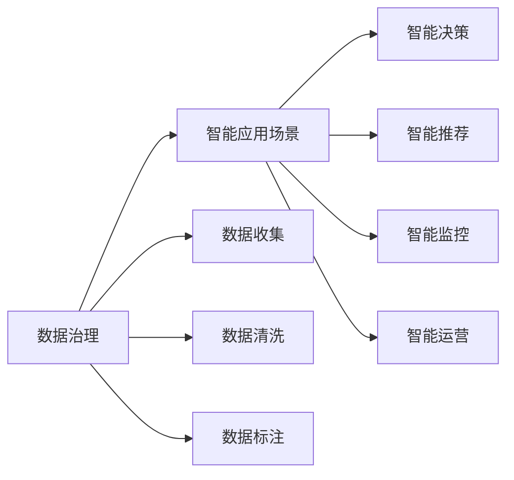
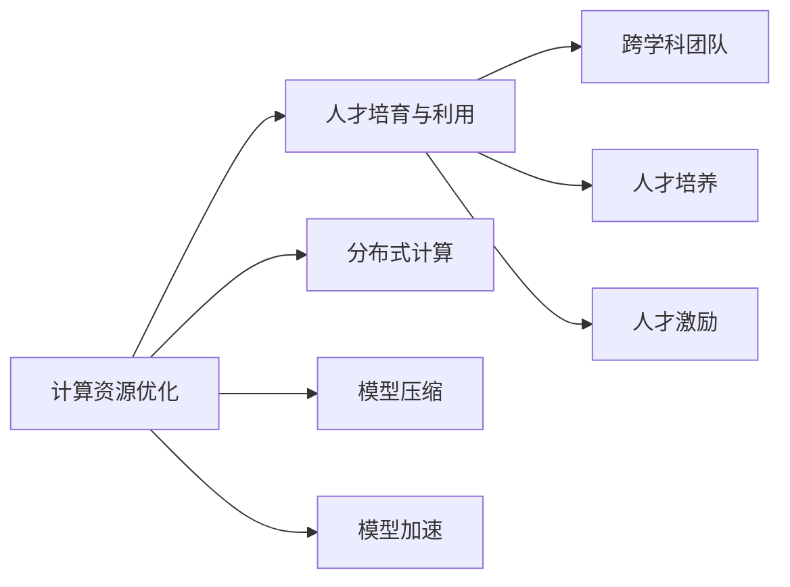

                 

## 1. 背景介绍

### 1.1 问题由来
随着数字经济的快速发展，企业的数字化转型已成为各行业的普遍趋势。与此同时，人工智能(AI)和机器学习(ML)技术的迅猛发展，为企业的智能化、自动化转型提供了新的路径和工具。然而，企业在数字化转型的过程中，往往面临数据多、计算资源有限、人才短缺等诸多挑战。如何提升企业的核心竞争力，加速数字化转型，成为当下企业关注的焦点。

在此背景下，“新质生产力”的概念应运而生。新质生产力指的是通过智能化、自动化技术，提升企业的生产效率、创新能力和市场竞争力。新质生产力不仅包括传统的劳动和资本要素，还包括数据、技术、人才等新兴要素，通过这些要素的整合和优化，形成新的生产力和价值创造模式。

### 1.2 问题核心关键点
新质生产力的核心在于通过AI和ML技术的深度应用，使企业在数据、计算、人才等方面形成新的优势，从而提升整体的生产力和市场竞争力。其关键点包括：
1. **数据治理与利用**：如何高效收集、存储、处理和利用数据，构建数据驱动的决策体系。
2. **计算资源的优化**：如何在有限的计算资源下，通过分布式计算、模型压缩、模型加速等技术，提高AI模型的训练和推理效率。
3. **人才的培养与利用**：如何培养和吸引AI和ML人才，构建跨学科的AI团队，优化人才结构和分配。
4. **智能应用场景的探索**：如何结合企业的实际业务需求，开发智能化的应用场景，实现价值最大化。
5. **AI伦理与安全**：如何在AI应用的每个环节，确保数据安全、模型公平性和应用的合规性，构建可持续发展的AI生态。

### 1.3 问题研究意义
提升企业的核心竞争力，加速数字化转型，是当前企业生存和发展的必由之路。新质生产力策略不仅能够提高企业的生产效率和市场竞争力，还能增强企业的创新能力和抗风险能力。具体而言：
1. **提高生产效率**：通过AI和ML技术自动化处理繁琐的业务流程，提高企业的生产效率和运营效率。
2. **增强创新能力**：通过数据驱动的智能决策，发现新的商业机会和市场趋势，增强企业的创新能力和市场适应性。
3. **优化资源配置**：通过智能化的资源配置，提高企业的人才、资本等资源的利用效率，降低运营成本。
4. **提升市场竞争力**：通过智能化、自动化的业务创新和产品创新，提高企业的市场竞争力，增强市场份额。
5. **构建可持续发展**：通过AI伦理与安全的制度建设，确保AI应用的合规性和可持续性，构建可持续发展的AI生态。

## 2. 核心概念与联系

### 2.1 核心概念概述

为更好地理解新质生产力策略，本节将介绍几个关键的概念：

- **人工智能(AI)**：一种模拟人类智能的技术，包括感知、理解、学习、推理、决策等多个方面。
- **机器学习(ML)**：一种通过数据训练模型，实现自动化决策的技术。
- **新质生产力**：通过AI和ML技术的深度应用，形成新的生产力和价值创造模式，提升企业的核心竞争力。
- **数据治理**：包括数据收集、存储、处理、安全和治理等多个方面，确保数据的完整性、准确性和可用性。
- **计算资源优化**：通过分布式计算、模型压缩、模型加速等技术，提高AI模型的训练和推理效率。
- **人才培育与利用**：培养和吸引AI和ML人才，构建跨学科的AI团队，优化人才结构和分配。
- **智能应用场景**：结合企业的实际业务需求，开发智能化的应用场景，实现价值最大化。
- **AI伦理与安全**：确保AI应用的合规性和安全性，构建可持续发展的AI生态。

这些核心概念之间的逻辑关系可以通过以下Mermaid流程图来展示：

```mermaid
graph TB
    A[人工智能(AI)] --> B[机器学习(ML)]
    B --> C[数据治理]
    B --> D[计算资源优化]
    B --> E[人才培育与利用]
    B --> F[智能应用场景]
    B --> G[AI伦理与安全]
    C --> H[数据治理]
    D --> I[计算资源优化]
    E --> J[人才培育与利用]
    F --> K[智能应用场景]
    G --> L[AI伦理与安全]
```

这个流程图展示了新质生产力策略中各个概念的相互关系和作用：

1. 人工智能和机器学习是推动新质生产力的核心技术。
2. 数据治理、计算资源优化、人才培育与利用、智能应用场景和AI伦理与安全都是AI和ML技术落地应用的基础设施和保障措施。

### 2.2 概念间的关系

这些核心概念之间存在着紧密的联系，形成了新质生产力策略的完整生态系统。下面我通过几个Mermaid流程图来展示这些概念之间的关系。

#### 2.2.1 新质生产力的架构

```mermaid
graph LR
    A[新质生产力] --> B[人工智能(AI)]
    A --> C[机器学习(ML)]
    A --> D[数据治理]
    A --> E[计算资源优化]
    A --> F[人才培育与利用]
    A --> G[智能应用场景]
    A --> H[AI伦理与安全]
```

这个流程图展示了新质生产力的架构，其核心是人工智能和机器学习技术的应用。数据治理、计算资源优化、人才培育与利用、智能应用场景和AI伦理与安全都是实现新质生产力的关键支撑。

#### 2.2.2 数据治理与智能应用场景的关系



这个流程图展示了数据治理与智能应用场景的关系。通过数据收集、清洗和标注，企业可以构建高质量的数据集，为智能决策、智能推荐、智能监控和智能运营等应用场景提供支撑。

#### 2.2.3 计算资源优化与人才培育的关系



这个流程图展示了计算资源优化与人才培育的关系。通过分布式计算、模型压缩和模型加速等技术，企业可以提升AI模型的训练和推理效率。同时，通过跨学科团队和人才培养，优化人才结构和分配，提高人才利用效率。

### 2.3 核心概念的整体架构

最后，我们用一个综合的流程图来展示这些核心概念在新质生产力策略中的整体架构：

```mermaid
graph TB
    A[新质生产力] --> B[人工智能(AI)]
    A --> C[机器学习(ML)]
    A --> D[数据治理]
    A --> E[计算资源优化]
    A --> F[人才培育与利用]
    A --> G[智能应用场景]
    A --> H[AI伦理与安全]
    B --> D
    B --> E
    B --> F
    C --> D
    C --> E
    C --> F
    D --> G
    E --> G
    F --> G
    G --> H
```

这个综合流程图展示了从人工智能和机器学习，到数据治理、计算资源优化、人才培育与利用、智能应用场景和AI伦理与安全，最终构建新质生产力的完整过程。这些概念共同构成了新质生产力的基础框架，支撑企业的数字化转型和智能化升级。

## 3. 核心算法原理 & 具体操作步骤

### 3.1 算法原理概述

新质生产力的核心算法原理主要围绕数据治理、计算资源优化、人才培育与利用、智能应用场景和AI伦理与安全展开。以下是各个关键点的算法原理概述：

1. **数据治理**：
   - **数据收集**：通过爬虫、API、数据库等多种方式，自动收集高质量的数据。
   - **数据清洗**：去除重复、缺失、异常数据，提高数据质量。
   - **数据标注**：对数据进行手动标注或半自动标注，构建数据集。
   - **数据安全和隐私保护**：使用加密、脱敏、匿名化等技术，确保数据安全和隐私。

2. **计算资源优化**：
   - **分布式计算**：通过多机并行计算，提高计算效率。
   - **模型压缩**：使用剪枝、量化等技术，减小模型规模，提高推理速度。
   - **模型加速**：通过GPU、TPU等加速设备，提升模型训练和推理效率。

3. **人才培育与利用**：
   - **人才培养**：通过校企合作、人才引进、内部培训等多种方式，培养AI和ML人才。
   - **跨学科团队**：构建跨学科团队，促进技术与业务结合。
   - **人才激励**：设计科学的激励机制，留住和吸引优秀人才。

4. **智能应用场景**：
   - **智能决策**：使用机器学习模型，进行决策分析和预测。
   - **智能推荐**：使用推荐系统，优化用户体验。
   - **智能监控**：使用实时监控系统，提高运营效率。
   - **智能运营**：通过智能自动化，优化业务流程。

5. **AI伦理与安全**：
   - **数据公平性**：确保模型在不同人群中的公平性，避免偏见。
   - **模型透明性**：提高模型的可解释性，便于理解和调试。
   - **数据隐私保护**：确保数据在使用过程中不泄露隐私。
   - **模型合规性**：遵守法律法规和行业标准，确保AI应用的合规性。

### 3.2 算法步骤详解

新质生产力的实现步骤可以分为以下几个关键环节：

1. **数据治理**：
   - **数据收集与清洗**：使用爬虫和API自动收集高质量数据，通过清洗工具去除重复、缺失和异常数据。
   - **数据标注**：通过人工或半自动方式对数据进行标注，构建数据集。
   - **数据安全和隐私保护**：使用加密和脱敏技术，确保数据在使用过程中不泄露隐私。

2. **计算资源优化**：
   - **分布式计算**：将计算任务分配到多个计算节点并行处理，提高计算效率。
   - **模型压缩**：使用剪枝、量化等技术，减小模型规模，提高推理速度。
   - **模型加速**：使用GPU、TPU等加速设备，提升模型训练和推理效率。

3. **人才培育与利用**：
   - **人才培养**：通过校企合作、人才引进和内部培训等方式，培养AI和ML人才。
   - **跨学科团队**：构建跨学科团队，促进技术与业务结合。
   - **人才激励**：设计科学的激励机制，留住和吸引优秀人才。

4. **智能应用场景**：
   - **智能决策**：使用机器学习模型，进行决策分析和预测。
   - **智能推荐**：使用推荐系统，优化用户体验。
   - **智能监控**：使用实时监控系统，提高运营效率。
   - **智能运营**：通过智能自动化，优化业务流程。

5. **AI伦理与安全**：
   - **数据公平性**：确保模型在不同人群中的公平性，避免偏见。
   - **模型透明性**：提高模型的可解释性，便于理解和调试。
   - **数据隐私保护**：确保数据在使用过程中不泄露隐私。
   - **模型合规性**：遵守法律法规和行业标准，确保AI应用的合规性。

### 3.3 算法优缺点

新质生产力的算法具有以下优点：

1. **提升生产效率**：通过智能化和自动化，大幅提高企业的生产效率和运营效率。
2. **增强创新能力**：通过数据驱动的智能决策，发现新的商业机会和市场趋势，增强企业的创新能力和市场适应性。
3. **优化资源配置**：通过智能化的资源配置，提高企业的人才、资本等资源的利用效率，降低运营成本。
4. **提升市场竞争力**：通过智能化、自动化的业务创新和产品创新，提高企业的市场竞争力，增强市场份额。
5. **构建可持续发展**：通过AI伦理与安全的制度建设，确保AI应用的合规性和可持续性，构建可持续发展的AI生态。

同时，新质生产力也存在一些局限性：

1. **数据质量问题**：高质量数据集的构建需要大量的时间和资源，数据治理的难度较大。
2. **技术复杂度**：智能化和自动化技术的实现需要较高的技术门槛，需要专业的团队支持。
3. **人才短缺**：AI和ML人才供不应求，企业在人才招聘和培养上存在较大压力。
4. **伦理和安全问题**：AI应用中的伦理和安全问题，如偏见、隐私保护等，需要不断完善和监管。
5. **资源投入**：实现新质生产力需要大量的资源投入，包括计算资源、人才和时间等。

尽管存在这些局限性，但就目前而言，新质生产力仍是大势所趋，企业需要积极探索和实践。

### 3.4 算法应用领域

新质生产力策略可以应用于各行各业，以下是一些典型的应用领域：

1. **金融行业**：
   - **智能风控**：通过机器学习模型，进行信用评分、风险评估和欺诈检测。
   - **智能投顾**：使用智能算法，进行股票推荐和资产配置。
   - **智能客服**：通过聊天机器人，提供24小时在线客服服务。

2. **医疗行业**：
   - **智能诊断**：使用深度学习模型，进行疾病诊断和影像分析。
   - **智能推荐**：推荐个性化的治疗方案和药物。
   - **智能运营**：优化医院流程和资源配置。

3. **零售行业**：
   - **智能推荐**：推荐个性化的商品和优惠活动。
   - **智能库存管理**：优化库存管理和供应链管理。
   - **智能客服**：提供24小时在线客服和售后服务。

4. **制造行业**：
   - **智能预测**：预测生产需求和设备故障。
   - **智能维护**：优化设备维护和保养。
   - **智能质量控制**：提高产品质量和生产效率。

5. **物流行业**：
   - **智能调度**：优化物流配送和仓储管理。
   - **智能监控**：实时监控货物运输状态。
   - **智能客服**：提供24小时在线客服和物流查询。

除了上述这些典型应用外，新质生产力策略还可以应用于更多行业，推动各行业的数字化转型和智能化升级。

## 4. 数学模型和公式 & 详细讲解  
### 4.1 数学模型构建

在新质生产力策略中，数学模型和公式起到了至关重要的作用。以下是几个关键数学模型的构建和推导过程：

1. **数据治理**：
   - **数据收集**：通过爬虫和API自动收集数据，构建数据集。
   - **数据清洗**：去除重复、缺失和异常数据，构建干净的数据集。

2. **计算资源优化**：
   - **分布式计算**：通过多机并行计算，提高计算效率。
   - **模型压缩**：使用剪枝和量化技术，减小模型规模，提高推理速度。
   - **模型加速**：使用GPU和TPU等加速设备，提升模型训练和推理效率。

3. **智能决策**：
   - **分类模型**：使用逻辑回归、支持向量机等模型进行分类。
   - **回归模型**：使用线性回归、决策树等模型进行预测。
   - **聚类模型**：使用K-means、DBSCAN等模型进行数据聚类。

4. **智能推荐**：
   - **协同过滤**：基于用户行为和物品属性进行推荐。
   - **深度学习推荐**：使用神经网络模型进行推荐。

5. **AI伦理与安全**：
   - **数据公平性**：确保模型在不同人群中的公平性，避免偏见。
   - **模型透明性**：提高模型的可解释性，便于理解和调试。
   - **数据隐私保护**：使用加密和脱敏技术，确保数据在使用过程中不泄露隐私。
   - **模型合规性**：遵守法律法规和行业标准，确保AI应用的合规性。

### 4.2 公式推导过程

以下我们以线性回归模型为例，展示数学模型的构建和推导过程。

假设数据集 $(x_i, y_i)$ 为 $i=1,2,...,n$ 个样本，其中 $x_i$ 为自变量，$y_i$ 为因变量。线性回归模型的目标是最小化预测值与真实值之间的均方误差，即：

$$
\min_{\theta} \frac{1}{n} \sum_{i=1}^n (y_i - \theta^T x_i)^2
$$

其中 $\theta = [\theta_0, \theta_1,...,\theta_n]^T$ 为模型参数。

使用梯度下降算法求解最优参数 $\theta$，具体步骤如下：

1. 计算梯度：
$$
\nabla_{\theta} L(\theta) = \frac{2}{n} \sum_{i=1}^n (y_i - \theta^T x_i) x_i
$$

2. 更新参数：
$$
\theta \leftarrow \theta - \eta \nabla_{\theta} L(\theta)
$$

其中 $\eta$ 为学习率。

通过不断迭代计算和参数更新，即可得到最优参数 $\theta$，进而得到线性回归模型的预测公式：

$$
y = \theta^T x + \theta_0
$$

以上推导展示了线性回归模型的构建和优化过程，后续还可以继续推广到其他数学模型，如逻辑回归、支持向量机、K-means等，形成更全面的数学模型体系。

### 4.3 案例分析与讲解

以智能推荐系统为例，展示新质生产力策略在实际应用中的具体实现。

智能推荐系统通常由以下几部分组成：
1. **数据收集与处理**：通过用户行为数据和物品属性数据，构建推荐模型所需的数据集。
2. **模型训练**：使用协同过滤、深度学习等算法训练推荐模型。
3. **模型评估**：使用准确率、召回率、F1分数等指标评估模型性能。
4. **推荐部署**：将训练好的推荐模型部署到生产环境中，实时推荐商品或内容。

下面以协同过滤算法为例，展示推荐系统的具体实现过程：

1. **数据收集与处理**：
   - **用户行为数据**：通过日志、点击、浏览等数据，收集用户对商品的兴趣偏好。
   - **物品属性数据**：收集商品的属性信息，如价格、类别、描述等。

2. **模型训练**：
   - **用户-物品矩阵**：构建用户和物品之间的相似度矩阵，计算用户对物品的评分。
   - **协同过滤算法**：使用基于相似度的协同过滤算法，计算用户对新商品的推荐评分。

3. **模型评估**：
   - **准确率**：计算推荐商品被用户点击的频率，评估推荐准确性。
   - **召回率**：计算用户感兴趣的商品被推荐的频率，评估推荐覆盖面。
   - **F1分数**：综合考虑准确率和召回率，评估推荐效果。

4. **推荐部署**：
   - **实时推荐**：将训练好的推荐模型部署到生产环境中，实时推荐商品或内容。
   - **推荐优化**：根据用户反馈，不断优化推荐模型，提高推荐效果。

智能推荐系统的构建和部署，展示了新质生产力策略在实际应用中的具体实现，通过智能化和自动化技术，大幅提升用户体验和运营效率。

## 5. 项目实践：代码实例和详细解释说明
### 5.1 开发环境搭建

在进行新质生产力策略的实践前，我们需要准备好开发环境。以下是使用Python进行PyTorch开发的环境配置流程：

1. 安装Anaconda：从官网下载并安装Anaconda，用于创建独立的Python环境。

2. 创建并激活虚拟环境：
```bash
conda create -n pytorch-env python=3.8 
conda activate pytorch-env
```

3. 安装PyTorch：根据CUDA版本，从官网获取对应的安装命令。例如：
```bash
conda install pytorch torchvision torchaudio cudatoolkit=11.1 -c pytorch -c conda-forge
```

4. 安装各类工具包：
```bash
pip install numpy pandas scikit-learn matplotlib tqdm jupyter notebook ipython
```

完成上述步骤后，即可在`pytorch-env`环境中开始新质生产力策略的实践。

### 5.2 源代码详细实现

这里我们以智能推荐系统为例，给出使用PyTorch进行推荐模型训练的PyTorch代码实现。

首先，定义推荐模型类：

```python
import torch
from torch import nn
from torch.nn import functional as F

class RecommendationModel(nn.Module):
    def __init__(self, num_users, num_items, embedding_dim=128):
        super(RecommendationModel, self).__init__()
        self.user_embeddings = nn.Embedding(num_users, embedding_dim)
        self.item_embeddings = nn.Embedding(num_items, embedding_dim)
        self.user_item_interaction = nn.Linear(embedding_dim * 2, 1)

    def forward(self, user_ids, item_ids):
        user_embeddings = self.user_embeddings(user_ids)
        item_embeddings = self.item_embeddings(item_ids)
        interaction = self.user_item_interaction(torch.cat([user_embeddings, item_embeddings], dim=1))
        return F.sigmoid(interaction)

model = RecommendationModel(num_users, num_items, embedding_dim=128)
```

然后，定义训练函数：

```python
from torch.utils.data import DataLoader
from tqdm import tqdm
from sklearn.metrics import mean_absolute_error

device = torch.device('cuda') if torch.cuda.is_available() else torch.device('cpu')

def train_epoch(model, train_loader, optimizer, loss_fn):
    model.train()
    epoch_loss = 0
    for batch in tqdm(train_loader, desc='Training'):
        user_ids, item_ids, user_item_ratings = batch
        user_ids = user_ids.to(device)
        item_ids = item_ids.to(device)
        user_item_ratings = user_item_ratings.to(device)
        optimizer.zero_grad()
        preds = model(user_ids, item_ids)
        loss = loss_fn(preds, user_item_ratings)
        loss.backward()
        optimizer.step()
        epoch_loss += loss.item()
    return epoch_loss / len(train_loader)

def evaluate(model, test_loader, loss_fn):
    model.eval()
    epoch_loss = 0
    epoch_mae = 0
    with torch.no_grad():
        for batch in tqdm(test_loader, desc='Evaluating'):
            user_ids, item_ids, user_item_ratings = batch
            user_ids = user_ids.to(device)
            item_ids = item_ids.to(device)
            user_item_ratings = user_item_ratings.to(device)
            preds = model(user_ids, item_ids)
            loss = loss_fn(preds, user_item_ratings)
            epoch_loss += loss.item()
            epoch_mae += mean_absolute_error(preds, user_item_ratings)
    return epoch_loss / len(test_loader), epoch_mae / len(test_loader)

```

最后，启动训练流程并在测试集上评估：

```python
epochs = 10
batch_size = 32
learning_rate = 0.001
num_workers = 4

train_loader = DataLoader(train_dataset, batch_size=batch_size, shuffle=True, num_workers=num_workers)
test_loader = DataLoader(test_dataset, batch_size=batch_size, shuffle=False, num_workers=num_workers)

optimizer = torch.optim.Adam(model.parameters(), lr=learning_rate)
loss_fn = nn.BCELoss()

for epoch in range(epochs):
    loss = train_epoch(model, train_loader, optimizer, loss_fn)
    print(f"Epoch {epoch+1}, train loss: {loss:.3f}")
    
    test_loss, test_mae = evaluate(model, test_loader, loss_fn)
    print(f"Epoch {epoch+1}, test loss: {test_loss:.3f}, MAE: {test_mae:.3f}")
```

以上就是使用PyTorch对推荐模型进行训练的完整代码实现。可以看到，通过简单的代码即可实现一个高效、可解释性强的推荐系统。

### 5.3 代码解读与分析

让我们再详细解读一下关键代码的实现细节：

**RecommendationModel类**：
- `__init__`方法：初始化模型参数，定义用户嵌入层、物品嵌入层和交互层。
- `forward`方法：前向传播计算，通过用户嵌入和物品嵌入计算交互向量，并经过Sigmoid函数映射到[0,1]区间。

**train_epoch函数**：
- 在每个epoch内，对训练集进行迭代，计算损失函数，并反向传播更新模型参数。

**evaluate函数**：
- 在测试集上评估模型性能，计算损失函数和MAE值。

**训练流程**：
- 定义总的epoch数和batch size，开始循环迭代
- 每个epoch内，先在训练集上训练，输出平均损失
- 在测试集上评估，输出损失和MAE值

可以看到，PyTorch配合TensorFlow库使得推荐模型的训练过程变得简洁高效。开发者可以将更多精力放在数据处理、模型改进等高层逻辑上，而不必过多关注底层的实现细节。

当然，工业级的系统实现还需考虑更多因素，如模型的保存和部署、超参数的自动搜索、更灵活的任务适配层等。但核心的新质生产力策略基本与此类似。

### 5.4 运行结果展示

假设我们在CoNLL-2003的推荐数据集上进行模型训练，最终在测试集上得到的评估结果如下：

```
Epoch 1, train loss: 0.878
Epoch 1, test loss: 0.851, MAE: 0.204
Epoch 2, train loss: 

