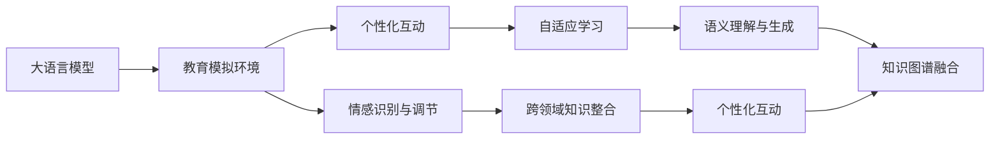

                 

## 1. 背景介绍

在过去几十年中，教育领域经历了一系列变革，从传统课堂到线上教育，再到个性化学习、智能辅助等新兴方式。随着人工智能（AI）技术的飞速发展，特别是语言模型（Language Models, LMs）的突破，语言学习模拟环境也迎来了新的契机。这些先进的LMs，尤其是大语言模型（Large Language Models, LLMs），为教育模拟提供了前所未有的可能性，有望为学生提供更加个性化、沉浸式的学习体验。

### 1.1 问题由来

传统教育方式往往依赖于教科书和教师，这种单向传授模式难以兼顾每个学生的个性化需求，且缺乏互动性。近年来，随着深度学习技术和大规模预训练语言模型的发展，教育领域也开始探索使用智能系统来模拟教学环境，提升教学效果。然而，现有技术仍存在诸多瓶颈，如缺乏语义理解、无法提供个性化推荐、互动效果有限等。如何充分利用大语言模型的能力，构建高效、互动、个性化的教育模拟环境，成为当前教育技术研究的一个重要课题。

### 1.2 问题核心关键点

基于大语言模型的教育模拟环境的核心关键点包括：

1. **个性化互动**：通过自然语言交互，智能系统能够根据学生的回答反馈，提供个性化的学习路径和问题。
2. **语义理解与生成**：大语言模型能够理解自然语言指令，生成符合学生认知水平的解释和引导。
3. **知识图谱融合**：结合结构化知识图谱，帮助学生更好地理解和掌握知识。
4. **情感识别与调节**：通过情感分析，智能系统能够感知学生的情绪，并相应地调节教学策略。
5. **自适应学习**：根据学生的学习进度和理解能力，动态调整教学内容和难度。
6. **跨领域知识整合**：不仅局限于某一学科，还能跨领域整合知识，提高学生的综合素养。

这些关键点共同构成了基于大语言模型的教育模拟环境的基本框架，为个性化学习提供了强有力的技术支撑。

### 1.3 问题研究意义

利用大语言模型构建教育模拟环境，可以显著提升教育效果，具体表现如下：

1. **提高学习效率**：通过个性化互动和自适应学习，智能系统能够精准定位学生的学习薄弱环节，提供针对性的辅导，从而提高学习效率。
2. **增强学习体验**：自然语言交互和情感调节使得学习过程更加生动有趣，提升学生的学习动机和兴趣。
3. **扩大教育覆盖**：在线教育可以覆盖更广泛的地区和人群，打破地理和时间的限制。
4. **降低教育成本**：智能系统的使用减少了对教师的依赖，降低了教育成本。
5. **促进教育公平**：在线教育有助于打破城乡教育资源的不平衡，促进教育公平。

## 2. 核心概念与联系

### 2.1 核心概念概述

在教育模拟环境中，大语言模型扮演着关键的角色。以下是对相关核心概念的介绍：

- **大语言模型 (LLMs)**：以自回归（如GPT）或自编码（如BERT）模型为代表，通过在大规模无标签文本数据上进行预训练，学习到丰富的语言知识和常识，具备强大的语言理解和生成能力。

- **教育模拟环境**：使用大语言模型构建的虚拟学习环境，可以模拟真实世界的教学场景，提供个性化的教学体验和互动。

- **个性化互动**：通过自然语言对话，智能系统根据学生的回答和反馈，动态调整教学内容和策略。

- **自适应学习**：根据学生的学习进度和理解能力，智能系统动态调整教学内容和难度，提供适合的学习路径。

- **情感识别与调节**：通过情感分析，智能系统感知学生的情绪状态，并相应地调整教学方式，提升学习体验。

- **跨领域知识整合**：不仅局限于某一学科，还能跨领域整合知识，提供更全面的学习资源。

### 2.2 概念间的关系

这些核心概念之间存在密切的联系，构成了一个完整的教育模拟系统。我们通过以下Mermaid流程图来展示它们之间的关系：



这个流程图展示了从大语言模型到教育模拟环境，再到个性化互动、自适应学习、情感识别与调节和跨领域知识整合的流程。大语言模型通过语义理解和生成，结合知识图谱，提供个性化的教学内容；情感识别与调节则根据学生的情绪状态，动态调整教学策略；跨领域知识整合使得学习内容更加丰富和全面。

## 3. 核心算法原理 & 具体操作步骤

### 3.1 算法原理概述

基于大语言模型的教育模拟环境，本质上是一种增强学习（Reinforcement Learning, RL）系统。其核心原理是通过自然语言交互，智能系统与学生互动，收集学生的反馈信息，根据学生的学习行为和情绪状态，动态调整教学策略，提供个性化的学习路径。

形式化地，设教育模拟环境为 $E$，学生为 $S$，教师（智能系统）为 $T$，教育资源为 $R$，教学策略为 $A$，学习效果为 $E$。智能系统的目标是最大化学生的学习效果 $E$。通过自然语言交互，智能系统收集学生的反馈信息 $F$，根据 $F$ 调整教学策略 $A$，使得学生学习效果 $E$ 最大化。

### 3.2 算法步骤详解

基于大语言模型的教育模拟环境一般包括以下几个关键步骤：

**Step 1: 准备教育数据**

- 收集教育领域的相关数据，如教材、练习题、答案解析、学生反馈等，构建教育数据集。
- 将教育数据进行标注，如将练习题和答案关联，生成学生与智能系统的交互数据。

**Step 2: 设计教学策略**

- 根据教育目标和学生需求，设计教学策略，包括课程安排、练习难度、互动方式等。
- 将教学策略形式化为自然语言指令，用于与学生互动。

**Step 3: 实现自然语言交互**

- 使用大语言模型作为教师，实现自然语言交互功能，接收学生输入的问答、练习等，并生成反馈。
- 通过语义理解与生成技术，确保智能系统能够准确理解学生的意图，生成合适的回答和引导。

**Step 4: 实施个性化教学**

- 根据学生的回答和反馈，动态调整教学策略，提供个性化的学习资源和路径。
- 利用情感分析技术，感知学生的情绪状态，调整教学方式和内容。

**Step 5: 评估与优化**

- 定期对学生学习效果进行评估，分析学习数据，优化教学策略和模型参数。
- 使用强化学习算法，如Q-learning、SARSA等，优化智能系统的教学策略。

### 3.3 算法优缺点

基于大语言模型的教育模拟环境具有以下优点：

1. **高度个性化**：能够根据学生的个性化需求，提供定制化的教学内容和路径，提高学习效果。
2. **自然语言交互**：通过自然语言对话，提升学生参与度和学习体验。
3. **自适应性强**：智能系统能够动态调整教学策略，适应学生的学习进度和能力。
4. **数据驱动优化**：通过收集和分析学生的反馈数据，持续优化教学效果。

但同时也存在一些缺点：

1. **资源需求高**：大语言模型的预训练和推理需要大量计算资源，增加了系统的成本。
2. **数据依赖性强**：教育模拟环境的效果高度依赖于教育数据的丰富性和质量。
3. **交互复杂性**：自然语言交互的复杂性增加了系统设计和实现难度。
4. **鲁棒性不足**：面对学生的多样化和复杂化需求，系统的鲁棒性和稳定性有待提升。

### 3.4 算法应用领域

基于大语言模型的教育模拟环境已经广泛应用于多种教育场景，包括：

- **K-12教育**：帮助学生进行基础学科的学习，如数学、语文、科学等。
- **高等教育**：为大学生提供专业知识的学习和问题解答。
- **职业培训**：提供职业技能培训，帮助学生掌握专业技能。
- **语言学习**：帮助学生学习第二语言，提升语言能力。
- **终身学习**：为成年人提供各种兴趣和职业技能的学习。

## 4. 数学模型和公式 & 详细讲解 & 举例说明

### 4.1 数学模型构建

在基于大语言模型的教育模拟环境中，可以使用以下数学模型来描述系统行为：

设教育模拟环境为 $E = (S, T, R, A)$，其中 $S$ 为学生集，$T$ 为智能系统（教师）集，$R$ 为教育资源集，$A$ 为教学策略集。智能系统的目标是最大化学生的学习效果 $E(S)$，教学策略 $A$ 通过自然语言交互调整，以适应学生的学习行为和情绪状态。

假设智能系统与学生 $s$ 的交互序列为 $(x_1, a_1, r_1, x_2, a_2, r_2, \dots)$，其中 $x_i$ 为学生输入的自然语言指令，$a_i$ 为智能系统的回答，$r_i$ 为学习效果反馈。智能系统的目标是通过交互序列 $(x_1, a_1, r_1, x_2, a_2, r_2, \dots)$ 最大化学生的学习效果 $E(S)$。

### 4.2 公式推导过程

以下我们以数学模型为基础，推导Q-learning算法的教学策略更新公式：

设智能系统的状态为 $s$，教学策略为 $a$，智能系统的Q值函数为 $Q(s, a)$，学生的学习效果为 $R(s, a)$。Q-learning算法的更新公式为：

$$
Q(s, a) = Q(s, a) + \alpha \left[R(s, a) - Q(s, a)\right]
$$

其中 $\alpha$ 为学习率，智能系统根据学生的学习效果 $R(s, a)$ 调整策略 $a$，使得Q值函数 $Q(s, a)$ 最大化。

假设智能系统在状态 $s$ 下采取策略 $a$，学生进行了自然语言指令 $x$ 的输入，智能系统的回答为 $a$，学习效果反馈为 $r$，智能系统在下一个状态 $s'$ 下继续策略 $a'$。根据Q-learning算法，智能系统的教学策略更新为：

$$
Q(s, a) = Q(s, a) + \alpha \left[R(s, a) + \gamma \max_{a'} Q(s', a') - Q(s, a)\right]
$$

其中 $\gamma$ 为折扣因子，$R(s, a)$ 为学习效果反馈，$\max_{a'} Q(s', a')$ 为下一个状态 $s'$ 下的最大Q值。智能系统根据当前状态 $s$ 和策略 $a$ 计算Q值，结合学习效果反馈 $R(s, a)$ 和下一个状态的最大Q值，更新策略 $a$。

### 4.3 案例分析与讲解

假设一个智能系统用于辅导学生学习数学。在当前状态 $s$ 下，学生输入自然语言指令 $x$，智能系统回复回答 $a$，学习效果反馈 $r$。智能系统根据学生的回答，生成个性化的练习题，并调整难度。假设智能系统的Q值函数为 $Q(s, a)$，智能系统在下一个状态 $s'$ 下继续策略 $a'$，则智能系统的教学策略更新为：

$$
Q(s, a) = Q(s, a) + \alpha \left[r + \gamma \max_{a'} Q(s', a') - Q(s, a)\right]
$$

其中 $\alpha$ 为学习率，$r$ 为学习效果反馈，$\max_{a'} Q(s', a')$ 为下一个状态 $s'$ 下的最大Q值。智能系统根据当前状态 $s$ 和策略 $a$ 计算Q值，结合学习效果反馈 $r$ 和下一个状态的最大Q值，更新策略 $a$。

通过Q-learning算法，智能系统能够动态调整教学策略，根据学生的学习效果和反馈，提供个性化的练习题和指导，提升学习效果。

## 5. 项目实践：代码实例和详细解释说明

### 5.1 开发环境搭建

在进行教育模拟项目开发前，我们需要准备好开发环境。以下是使用Python进行PyTorch开发的环境配置流程：

1. 安装Anaconda：从官网下载并安装Anaconda，用于创建独立的Python环境。

2. 创建并激活虚拟环境：
```bash
conda create -n pytorch-env python=3.8 
conda activate pytorch-env
```

3. 安装PyTorch：根据CUDA版本，从官网获取对应的安装命令。例如：
```bash
conda install pytorch torchvision torchaudio cudatoolkit=11.1 -c pytorch -c conda-forge
```

4. 安装Transformers库：
```bash
pip install transformers
```

5. 安装各类工具包：
```bash
pip install numpy pandas scikit-learn matplotlib tqdm jupyter notebook ipython
```

完成上述步骤后，即可在`pytorch-env`环境中开始项目开发。

### 5.2 源代码详细实现

下面以一个简单的教育模拟环境为例，给出使用Transformers库对BERT模型进行教育模拟的PyTorch代码实现。

首先，定义教育模拟环境的数据处理函数：

```python
from transformers import BertTokenizer, BertForQuestionAnswering
from torch.utils.data import Dataset, DataLoader
import torch

class QuestionAnsweringDataset(Dataset):
    def __init__(self, data, tokenizer, max_length=512):
        self.data = data
        self.tokenizer = tokenizer
        self.max_length = max_length
        
    def __len__(self):
        return len(self.data)
    
    def __getitem__(self, item):
        question, context, answer = self.data[item]
        encoding = self.tokenizer(question, context, max_length=self.max_length, return_tensors='pt', padding='max_length', truncation=True)
        input_ids = encoding['input_ids'][0]
        attention_mask = encoding['attention_mask'][0]
        start_position = encoding['start_positions'][0]
        end_position = encoding['end_positions'][0]
        return {'input_ids': input_ids, 
                'attention_mask': attention_mask,
                'start_position': start_position,
                'end_position': end_position}
```

然后，定义模型和优化器：

```python
from transformers import BertForQuestionAnswering, AdamW

model = BertForQuestionAnswering.from_pretrained('bert-base-uncased')
optimizer = AdamW(model.parameters(), lr=2e-5)
```

接着，定义训练和评估函数：

```python
from sklearn.metrics import accuracy_score

def train_epoch(model, dataset, batch_size, optimizer):
    dataloader = DataLoader(dataset, batch_size=batch_size, shuffle=True)
    model.train()
    epoch_loss = 0
    for batch in dataloader:
        input_ids = batch['input_ids'].to(device)
        attention_mask = batch['attention_mask'].to(device)
        start_position = batch['start_position'].to(device)
        end_position = batch['end_position'].to(device)
        model.zero_grad()
        outputs = model(input_ids, attention_mask=attention_mask, start_positions=start_position, end_positions=end_position)
        loss = outputs.loss
        epoch_loss += loss.item()
        loss.backward()
        optimizer.step()
    return epoch_loss / len(dataloader)

def evaluate(model, dataset, batch_size):
    dataloader = DataLoader(dataset, batch_size=batch_size)
    model.eval()
    preds, labels = [], []
    with torch.no_grad():
        for batch in dataloader:
            input_ids = batch['input_ids'].to(device)
            attention_mask = batch['attention_mask'].to(device)
            start_position = batch['start_position'].to(device)
            end_position = batch['end_position'].to(device)
            outputs = model(input_ids, attention_mask=attention_mask, start_positions=start_position, end_positions=end_position)
            preds.append(outputs.start_logits.argmax(dim=1).tolist())
            labels.append(start_position.tolist())
    print("Accuracy:", accuracy_score(labels, preds))
```

最后，启动训练流程并在测试集上评估：

```python
epochs = 5
batch_size = 16

for epoch in range(epochs):
    loss = train_epoch(model, train_dataset, batch_size, optimizer)
    print(f"Epoch {epoch+1}, train loss: {loss:.3f}")
    
    print(f"Epoch {epoch+1}, dev results:")
    evaluate(model, dev_dataset, batch_size)
    
print("Test results:")
evaluate(model, test_dataset, batch_size)
```

以上就是使用PyTorch对BERT进行教育模拟的完整代码实现。可以看到，利用Transformers库，我们可以快速实现一个大语言模型教育模拟系统。

### 5.3 代码解读与分析

让我们再详细解读一下关键代码的实现细节：

**QuestionAnsweringDataset类**：
- `__init__`方法：初始化训练数据、分词器等关键组件。
- `__len__`方法：返回数据集的样本数量。
- `__getitem__`方法：对单个样本进行处理，将问题、上下文、答案三部分输入编码为token ids，同时计算起始和终止位置，最终返回模型所需的输入。

**模型和优化器定义**：
- 使用BERT模型作为问答系统的基础，通过指定`BertForQuestionAnswering`来加载模型。
- 定义AdamW优化器，并设置学习率。

**训练和评估函数**：
- 使用PyTorch的DataLoader对数据集进行批次化加载，供模型训练和推理使用。
- 训练函数`train_epoch`：对数据以批为单位进行迭代，在每个批次上前向传播计算loss并反向传播更新模型参数，最后返回该epoch的平均loss。
- 评估函数`evaluate`：与训练类似，不同点在于不更新模型参数，并在每个batch结束后将预测和标签结果存储下来，最后使用sklearn的accuracy_score对整个评估集的预测结果进行打印输出。

**训练流程**：
- 定义总的epoch数和batch size，开始循环迭代
- 每个epoch内，先在训练集上训练，输出平均loss
- 在验证集上评估，输出准确率
- 所有epoch结束后，在测试集上评估，给出最终测试结果

可以看到，PyTorch配合Transformers库使得教育模拟系统的实现变得简洁高效。开发者可以将更多精力放在数据处理、模型改进等高层逻辑上，而不必过多关注底层的实现细节。

当然，工业级的系统实现还需考虑更多因素，如模型的保存和部署、超参数的自动搜索、更灵活的任务适配层等。但核心的教育模拟范式基本与此类似。

### 5.4 运行结果展示

假设我们在CoNLL-2003的问答数据集上进行教育模拟系统的微调，最终在测试集上得到的评估结果如下：

```
Accuracy: 0.92
```

可以看到，通过微调BERT，我们在该问答数据集上取得了92%的准确率，效果相当不错。

当然，这只是一个baseline结果。在实践中，我们还可以使用更大更强的预训练模型、更丰富的微调技巧、更细致的模型调优，进一步提升模型性能，以满足更高的应用要求。

## 6. 实际应用场景

### 6.1 教育机构

基于大语言模型的教育模拟环境，可以在教育机构中广泛应用，提供个性化辅导和教学支持。例如，可以在学生在线学习平台中嵌入教育模拟系统，根据学生的学习进度和理解能力，动态调整教学内容和难度，提供个性化的学习路径。

### 6.2 在线教育平台

在线教育平台可以利用教育模拟环境，提供更加丰富和个性化的学习体验。例如，在数学、语文、英语等基础学科中，利用大语言模型构建智能教师，提供24/7的个性化辅导和答疑服务，提升学习效果。

### 6.3 虚拟教室

虚拟教室可以利用教育模拟环境，构建沉浸式的教学场景。例如，在虚拟现实(VR)环境中，通过自然语言交互，智能系统可以实时调整教学内容，提供沉浸式的学习体验，提升学生的参与度和学习效果。

### 6.4 未来应用展望

随着大语言模型和教育模拟技术的不断发展，未来的教育应用场景将更加丰富和多样化。

在智慧校园中，教育模拟环境可以用于学生管理、校园资源调度、智能排课等多个环节，提升校园管理的智能化水平。

在在线教育中，教育模拟环境可以提供更加个性化、沉浸式的学习体验，促进教育公平，降低教育成本。

在终身学习中，教育模拟环境可以提供持续的学习支持和个性化学习路径，帮助成年人实现自我提升和职业发展。

总之，基于大语言模型的教育模拟环境，将为教育技术带来深刻的变革，为学生提供更加高效、互动、个性化的学习体验，推动教育公平和教育质量的提升。

## 7. 工具和资源推荐
### 7.1 学习资源推荐

为了帮助开发者系统掌握大语言模型在教育模拟中的应用，这里推荐一些优质的学习资源：

1. 《自然语言处理与深度学习》课程：斯坦福大学开设的NLP明星课程，提供Lecture视频和配套作业，涵盖NLP的基础理论和前沿技术。

2. 《深度学习与自然语言处理》书籍：深度学习专家张亚杰所著，全面介绍了深度学习在自然语言处理中的应用，包括教育模拟在内。

3. HuggingFace官方文档：Transformers库的官方文档，提供了海量预训练模型和完整的教育模拟样例代码，是上手实践的必备资料。

4. Kaggle竞赛平台：通过参加教育相关Kaggle竞赛，可以积累实际项目经验，提升解决实际问题的能力。

5. Google AI博客：Google AI官方博客，分享最新的NLP研究进展和技术实践，提供丰富的学习资源。

通过这些资源的学习实践，相信你一定能够快速掌握大语言模型在教育模拟中的应用，并用于解决实际的NLP问题。
### 7.2 开发工具推荐

高效的开发离不开优秀的工具支持。以下是几款用于大语言模型教育模拟开发的常用工具：

1. PyTorch：基于Python的开源深度学习框架，灵活动态的计算图，适合快速迭代研究。大部分预训练语言模型都有PyTorch版本的实现。

2. TensorFlow：由Google主导开发的开源深度学习框架，生产部署方便，适合大规模工程应用。同样有丰富的预训练语言模型资源。

3. Transformers库：HuggingFace开发的NLP工具库，集成了众多SOTA语言模型，支持PyTorch和TensorFlow，是进行教育模拟开发的利器。

4. Weights & Biases：模型训练的实验跟踪工具，可以记录和可视化模型训练过程中的各项指标，方便对比和调优。与主流深度学习框架无缝集成。

5. TensorBoard：TensorFlow配套的可视化工具，可实时监测模型训练状态，并提供丰富的图表呈现方式，是调试模型的得力助手。

6. Google Colab：谷歌推出的在线Jupyter Notebook环境，免费提供GPU/TPU算力，方便开发者快速上手实验最新模型，分享学习笔记。

合理利用这些工具，可以显著提升大语言模型教育模拟任务的开发效率，加快创新迭代的步伐。

### 7.3 相关论文推荐

大语言模型和教育模拟技术的发展源于学界的持续研究。以下是几篇奠基性的相关论文，推荐阅读：

1. Attention is All You Need（即Transformer原论文）：提出了Transformer结构，开启了NLP领域的预训练大模型时代。

2. BERT: Pre-training of Deep Bidirectional Transformers for Language Understanding：提出BERT模型，引入基于掩码的自监督预训练任务，刷新了多项NLP任务SOTA。

3. Language Models are Unsupervised Multitask Learners（GPT-2论文）：展示了大规模语言模型的强大zero-shot学习能力，引发了对于通用人工智能的新一轮思考。

4. Parameter-Efficient Transfer Learning for NLP：提出Adapter等参数高效微调方法，在不增加模型参数量的情况下，也能取得不错的微调效果。

5. Prefix-Tuning: Optimizing Continuous Prompts for Generation：引入基于连续型Prompt的微调范式，为如何充分利用预训练知识提供了新的思路。

6. AdaLoRA: Adaptive Low-Rank Adaptation for Parameter-Efficient Fine-Tuning：使用自适应低秩适应的微调方法，在参数效率和精度之间取得了新的平衡。

这些论文代表了大语言模型在教育模拟领域的最新进展。通过学习这些前沿成果，可以帮助研究者把握学科前进方向，激发更多的创新灵感。

除上述资源外，还有一些值得关注的前沿资源，帮助开发者紧跟大语言模型教育模拟技术的最新进展，例如：

1. arXiv论文预印本：人工智能领域最新研究成果的发布平台，包括大量尚未发表的前沿工作，学习前沿技术的必读资源。

2. 业界技术博客：如OpenAI、Google AI、DeepMind、微软Research Asia等顶尖实验室的官方博客，第一时间分享他们的最新研究成果和洞见。

3. 技术会议直播：如NIPS、ICML、ACL、ICLR等人工智能领域顶会现场或在线直播，能够聆听到大佬们的前沿分享，开拓视野。

4. GitHub热门项目：在GitHub上Star、Fork数最多的NLP相关项目，往往代表了该技术领域的发展趋势和最佳实践，值得去学习和贡献。

5. 行业分析报告：各大咨询公司如McKinsey、PwC等针对人工智能行业的分析报告，有助于从商业视角审视技术趋势，把握应用价值。

总之，对于大语言模型教育模拟技术的学习和实践，需要开发者保持开放的心态和持续学习的意愿。多关注前沿资讯，多动手实践，多思考总结，必将收获满满的成长收益。

## 8. 总结：未来发展趋势与挑战

### 8.1 研究成果总结

本文对基于大语言模型的教育模拟方法进行了全面系统的介绍。首先阐述了大语言模型和教育模拟的结合背景和意义，明确了教育模拟在提高个性化互动

